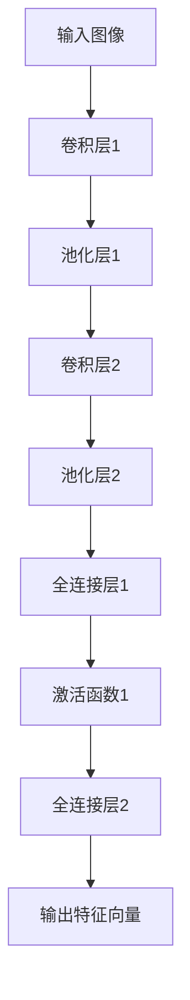
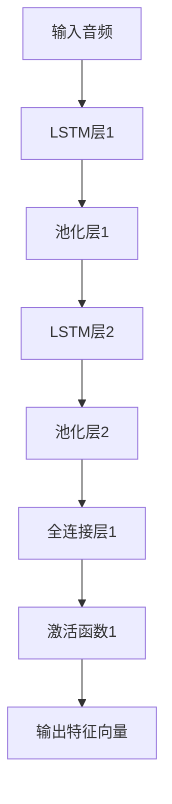
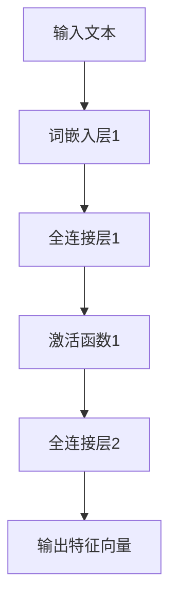
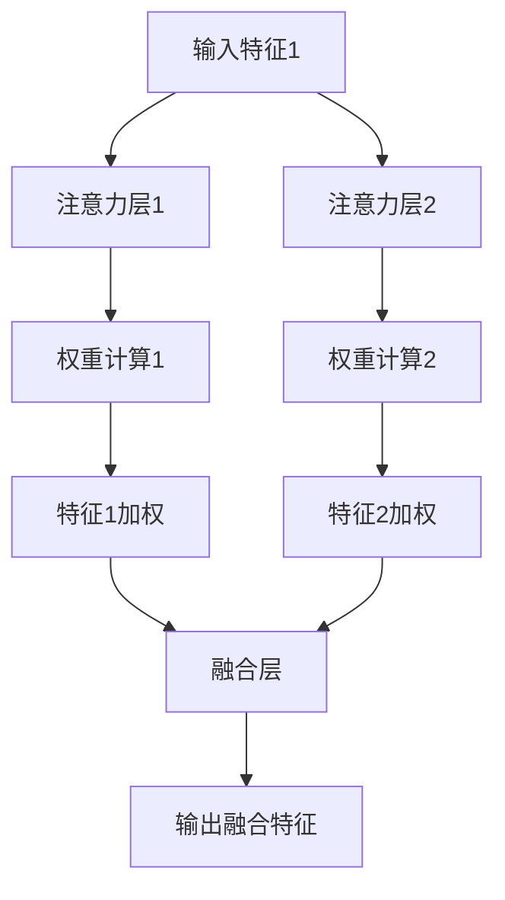
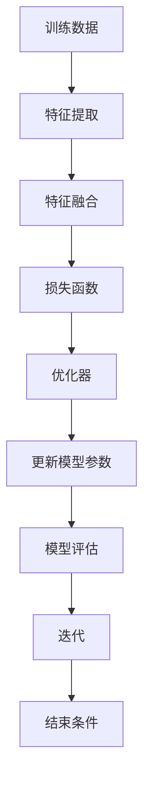
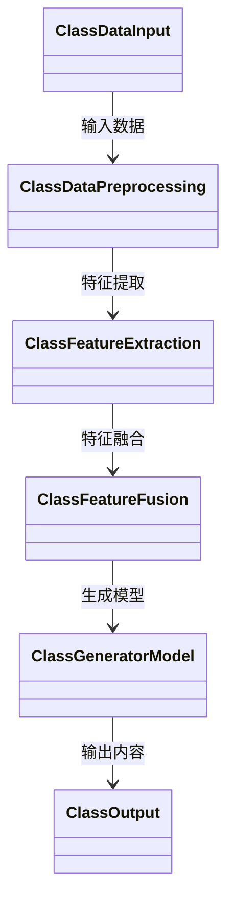
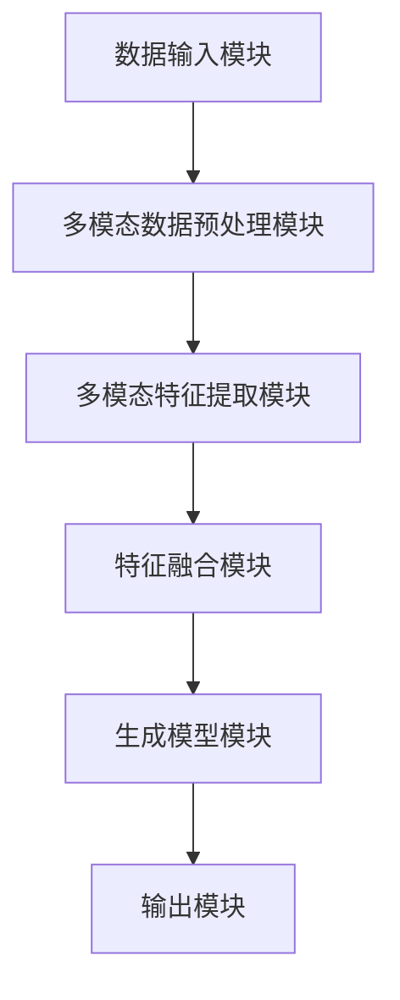
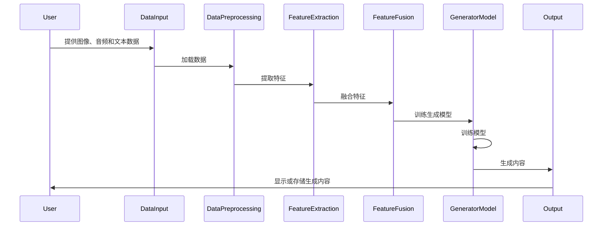

                 

### 1.1 问题背景

**核心概念术语说明**：
- **AI Agent**：在人工智能领域，AI Agent指的是具有自主学习和决策能力的计算机程序或系统，它可以在没有人类干预的情况下执行任务。
- **多模态内容理解**：指AI Agent能够处理和融合来自不同模态（如视觉、听觉、文本）的信息，从而更准确地理解和解释现实世界中的事件和情境。
- **多模态内容生成**：基于AI Agent对多模态内容理解的结果，生成新的、多样化的内容输出。

**问题背景**：
在当前的人工智能领域，随着物联网（IoT）、虚拟现实（VR）和增强现实（AR）等技术的快速发展，AI Agent面临着越来越复杂的应用场景。这些场景往往需要AI Agent具备强大的多模态内容理解与生成能力，以处理来自不同传感器和用户接口的信息。

**问题描述**：
AI Agent在多模态内容理解与生成方面面临的主要问题包括：
1. **数据获取困难**：不同模态的数据来源广泛，获取和整合这些数据是一个复杂的过程。
2. **数据融合挑战**：不同模态的数据在特征表达和结构上存在差异，如何有效地融合这些数据以提升AI Agent的理解能力是一个难点。
3. **生成质量**：如何确保生成的多模态内容既多样化又符合实际需求，是一个需要深入研究的问题。

**问题解决**：
为了解决上述问题，需要从以下几个方面进行研究和探索：
1. **数据预处理**：研究如何高效地收集、标注和预处理多模态数据，以便后续的处理和分析。
2. **特征融合方法**：探索不同的特征融合方法，包括传统的统计方法、深度学习方法等，以提高AI Agent的理解能力。
3. **生成模型优化**：研究如何设计更高效的生成模型，包括使用生成对抗网络（GAN）、变分自编码器（VAE）等，以生成高质量的多模态内容。

**边界与外延**：
多模态内容理解与生成不仅仅局限于AI Agent，它在很多领域都有广泛的应用，如自然语言处理（NLP）、图像识别、虚拟助理等。同时，随着技术的发展，这些应用领域也在不断拓展。

**概念结构与核心要素组成**：
- **概念结构**：AI Agent的多模态内容理解与生成由数据获取、特征融合和内容生成三个核心部分组成。
- **核心要素**：
  - **数据获取**：涉及图像、声音、文本等多模态数据的获取和预处理。
  - **特征融合**：包括特征提取、特征表示和特征融合策略。
  - **内容生成**：基于融合后的特征生成新的、多样化的内容。

通过上述分析，我们可以明确AI Agent的多模态内容理解与生成的重要性以及面临的主要挑战。接下来，我们将逐步深入探讨AI Agent的各个方面，为理解和解决这些问题奠定基础。### 1.2 书籍结构概述

本书旨在全面介绍AI Agent的多模态内容理解与生成，共分为三大部分，具体结构如下：

**第一部分：引言与背景**

本部分主要介绍AI Agent及其多模态内容理解与生成的基本概念、发展历程和当前的研究现状。通过这一部分的阅读，读者可以建立起对AI Agent和其多模态内容理解与生成的基本认识。

- **第1章 问题背景**
  - **1.1 核心概念术语说明**
  - **1.2 问题背景**
  - **1.3 研究现状与挑战**
  - **1.4 书籍结构概述**

**第二部分：AI Agent基础**

本部分深入探讨AI Agent的基础知识，包括其定义、分类、工作原理以及在不同领域的应用。这一部分将为后续的多模态内容理解与生成奠定理论基础。

- **第2章 AI Agent概述**
  - **2.1 定义与分类**
  - **2.2 工作原理**
  - **2.3 应用领域**
- **第3章 多模态内容理解**
  - **3.1 多模态数据获取**
    - **3.1.1 视觉数据**
    - **3.1.2 听觉数据**
    - **3.1.3 文本数据**
  - **3.2 多模态数据融合**
    - **3.2.1 融合方法**
    - **3.2.2 融合挑战**

**第三部分：算法原理与实现**

本部分将详细介绍AI Agent的多模态内容理解与生成的算法原理，包括特征提取、生成模型以及相关的数学模型和公式。同时，通过实际项目案例，展示这些算法在实际应用中的效果。

- **第4章 多模态内容理解算法原理**
  - **4.1 多模态特征提取**
  - **4.2 多模态内容生成算法**
    - **4.2.1 基于记忆的网络**
    - **4.2.2 基于变分自编码器的生成模型**
    - **4.2.3 基于生成对抗网络的生成模型**
- **第5章 系统分析与架构设计**
  - **5.1 系统功能设计**
  - **5.2 系统架构设计**
  - **5.3 系统接口设计**
  - **5.4 系统交互**
- **第6章 项目实战**
  - **6.1 环境安装**
  - **6.2 系统核心实现**
  - **6.3 代码应用解读**
  - **6.4 实际案例分析**
  - **6.5 项目小结**
- **第7章 最佳实践与注意事项**
  - **7.1 最佳实践 tips**
  - **7.2 小结**

通过以上结构，本书将逐步引导读者深入理解AI Agent的多模态内容理解与生成的方方面面，为实际应用提供有力支持。### 第二部分：AI Agent基础

#### 2.1 AI Agent概述

AI Agent作为人工智能领域的一个重要概念，具有自主感知、学习、决策和行动的能力。它能够根据环境中的信息和设定的目标，自主执行任务，并在执行过程中不断优化其行为。

##### 2.1.1 定义与分类

**定义**：
AI Agent指的是具有自主学习和决策能力的计算机程序或系统。它可以接收环境输入，通过学习算法对输入信息进行处理，并根据预设目标生成适当的输出行动。

**分类**：
根据能力和功能的不同，AI Agent可以分为以下几类：

1. **反应式Agent**：这类Agent只能根据当前环境状态做出反应，无法存储历史信息或学习环境变化。
2. **主动Agent**：与反应式Agent不同，主动Agent具有目标驱动的行为，可以规划行动以达到目标。
3. **认知Agent**：这类Agent不仅具备主动行为，还具有学习和记忆能力，可以根据经验调整行为。
4. **社交Agent**：这类Agent能够在多个Agent之间进行交互，协同完成任务。

##### 2.1.2 工作原理

AI Agent的工作原理主要包括以下几个方面：

1. **感知**：Agent通过传感器获取环境信息，如视觉、听觉、触觉等。
2. **知识表示**：Agent将感知到的信息转换为内部表示，以便进一步处理。
3. **学习**：Agent使用学习算法（如监督学习、无监督学习、强化学习）从历史数据中学习，优化其行为。
4. **决策**：Agent根据当前状态和目标，通过决策算法选择适当的行动。
5. **行动**：Agent执行决策生成的行动，并对行动结果进行反馈和学习。

##### 2.1.3 应用领域

AI Agent的应用领域广泛，以下是一些典型的应用：

1. **智能家居**：AI Agent可以通过感知环境状态，自动调节照明、温度等。
2. **机器人**：在工业自动化、医疗服务、家庭服务等领域，AI Agent可以执行复杂任务。
3. **自动驾驶**：AI Agent可以通过感知路况、规划行驶路径，实现自动驾驶。
4. **虚拟助手**：如Siri、Alexa等，通过自然语言交互，为用户提供服务。
5. **游戏**：在计算机游戏中，AI Agent可以作为对手与玩家进行对抗。

#### 2.2 多模态内容理解

多模态内容理解是AI Agent的重要能力之一，它涉及到如何整合来自不同模态的信息，以更准确地理解现实世界。

##### 2.2.1 多模态数据获取

多模态数据获取包括以下几种：

1. **视觉数据**：通过摄像头等设备获取的图像信息，如人脸识别、物体检测等。
2. **听觉数据**：通过麦克风等设备获取的声音信息，如语音识别、情感分析等。
3. **文本数据**：通过自然语言处理技术获取的文本信息，如语义分析、情感分析等。

##### 2.2.2 多模态数据融合

多模态数据融合的目的是将不同模态的信息整合起来，以提高AI Agent的理解能力。常见的融合方法包括：

1. **直接融合**：将不同模态的数据直接合并，如使用向量空间模型将图像和文本数据融合。
2. **特征级融合**：在不同特征空间中进行融合，如使用卷积神经网络（CNN）提取图像特征，使用循环神经网络（RNN）提取文本特征，然后融合这两个特征。
3. **模型级融合**：将不同模态的模型融合为一个统一的模型，如使用多任务学习将图像分类和文本分类合并。

##### 2.2.3 融合挑战

多模态数据融合面临以下挑战：

1. **模态差异**：不同模态的数据在特征表达和结构上存在差异，如何有效地融合这些数据是一个难点。
2. **数据不平衡**：在某些应用中，不同模态的数据量可能存在显著差异，如何平衡这些数据是一个挑战。
3. **计算复杂度**：多模态数据融合通常涉及大量计算，如何在有限的计算资源下实现高效融合是一个关键问题。

通过以上对AI Agent概述和多模态内容理解的分析，我们可以看到AI Agent在多模态内容理解与生成方面的潜力和挑战。接下来，我们将进一步探讨多模态内容生成的相关概念和方法。### 2.3 多模态内容生成

多模态内容生成是AI Agent的一个重要能力，它能够基于多模态内容理解的结果，生成新的、多样化的内容。这一部分将详细介绍多模态内容生成的基本概念、常用方法以及不同类型的生成模型。

##### 2.3.1 生成模型概述

生成模型是一种用于生成数据或内容的算法，其核心目标是学习数据分布并生成新的数据样本。在多模态内容生成中，生成模型可以基于融合的多模态特征生成新的视觉、听觉或文本内容。

生成模型主要包括以下几种：

1. **基于记忆的网络**：这类模型通过记忆单元存储输入信息，并根据输入信息生成新的内容。
2. **基于变分自编码器的生成模型**：变分自编码器（VAE）是一种概率生成模型，通过编码器和解码器学习数据分布，并生成新的数据样本。
3. **基于生成对抗网络的生成模型**：生成对抗网络（GAN）是一种由生成器和判别器组成的模型，通过两个网络的对抗训练生成高质量的数据样本。

##### 2.3.2 生成模型类型

以下是对几种常见生成模型的详细介绍：

###### 2.3.2.1 基于记忆的网络

基于记忆的网络通过记忆单元来存储输入信息，并利用这些信息生成新的内容。常见的基于记忆的网络包括循环神经网络（RNN）和长短期记忆网络（LSTM）。

- **工作原理**：
  - 记忆单元：网络中的记忆单元可以存储和更新历史信息。
  - 生成过程：基于记忆单元的信息，网络生成新的内容。

- **数学模型**：
  - $$h_t = \sigma(W_h \cdot [h_{t-1}, x_t] + b_h)$$
  - $$o_t = \sigma(W_o \cdot h_t + b_o)$$
  - 其中，$h_t$是隐藏状态，$x_t$是输入，$o_t$是输出，$W_h$、$W_o$和$b_h$、$b_o$是权重和偏置。

- **Python代码示例**：
  ```python
  import tensorflow as tf
  from tensorflow.keras.layers import LSTM, Dense

  model = tf.keras.Sequential([
      LSTM(units=128, activation='tanh', input_shape=(timesteps, features)),
      Dense(units=output_size, activation='softmax')
  ])
  model.compile(optimizer='adam', loss='categorical_crossentropy')
  ```

###### 2.3.2.2 基于变分自编码器的生成模型

变分自编码器（VAE）是一种概率生成模型，它通过编码器和解码器学习数据分布，并生成新的数据样本。

- **工作原理**：
  - 编码器：将输入数据编码为一个均值和标准差的向量。
  - 解码器：基于编码器生成的均值和标准差，生成新的数据样本。

- **数学模型**：
  - 编码过程：
    - $$z = \mu(x) = \sigma \circ (\phi(x))$$
    - $$\mu(x) = \frac{1}{1 + e^{-W_{\mu} x - b_{\mu}}}$$
    - $$\sigma(x) = \frac{1}{1 + e^{-W_{\sigma} x - b_{\sigma}}}$$
  - 解码过程：
    - $$x = \phi(z) = \sigma(W_{\phi} z + b_{\phi})$$

- **Python代码示例**：
  ```python
  import tensorflow as tf
  from tensorflow.keras.layers import Dense, Lambda
  from tensorflow.keras.models import Model

  input_img = tf.keras.layers.Input(shape=(input_dim))
  h = Dense(units=32, activation='relu')(input_img)
  z_mean = Dense(units=z_dim)(h)
  z_log_var = Dense(units=z_dim)(h)

  z_mean = Lambda(lambda x: tf.nn.relu(x))(z_mean)
  z_log_var = Lambda(lambda x: tf.nn.relu(x))(z_log_var)

  z = Lambda(lambda x: x[0] * x[1] + x[2])([z_mean, z_log_var, input_img])

  decoded = Dense(units=input_dim, activation='sigmoid')(z)
  vae = Model(input_img, decoded)
  vae.compile(optimizer='rmsprop', loss='binary_crossentropy')
  ```

###### 2.3.2.3 基于生成对抗网络的生成模型

生成对抗网络（GAN）是一种由生成器和判别器组成的模型，通过两个网络的对抗训练生成高质量的数据样本。

- **工作原理**：
  - 生成器：生成虚拟数据样本。
  - 判别器：区分真实数据和生成数据。
  - 生成器和判别器交替训练，生成器不断优化，以生成更逼真的数据样本。

- **数学模型**：
  - 生成器：
    - $$G(z) = x$$
    - 其中，$z$是随机噪声向量，$G$是生成器。
  - 判别器：
    - $$D(x) = P(x \text{ 来自真实数据})$$
    - $$D(G(z)) = P(G(z) \text{ 来自真实数据})$$

- **Python代码示例**：
  ```python
  import tensorflow as tf
  from tensorflow.keras.layers import Dense, Reshape
  from tensorflow.keras.models import Model

  input_shape = (latent_dim,)
  noise = Input(shape=input_shape)
  generator = Dense(7 * 7 * 64, activation='relu', input_shape=input_shape)
  generator_output = Reshape((7, 7, 64))(generator)
  x = Dense(128, activation='relu')(generator_output)
  x = Dense(1, activation='sigmoid')(x)
  generator = Model(noise, x)

  # 定义判别器模型
  input_shape = (img_rows, img_cols, img_channels)
  input_image = Input(shape=input_shape)
  d = Conv2D(64, (3, 3), padding='same', activation='relu')(input_image)
  d = Conv2D(128, (3, 3), padding='same', activation='relu')(d)
  d = Flatten()(d)
  d = Dense(1, activation='sigmoid')(d)
  discriminator = Model(input_image, d)

  # 定义联合模型
  model = Sequential()
  model.add(generator)
  model.add(discriminator)
  ```

通过以上对多模态内容生成模型的详细介绍，我们可以看到生成模型在AI Agent多模态内容生成中的重要作用。接下来，我们将进一步探讨多模态内容理解算法的原理和实现。### 3.1 多模态内容理解算法原理

多模态内容理解算法是AI Agent的核心组成部分，它能够处理和融合来自不同模态的信息，从而实现对现实世界更准确的理解。在这一部分，我们将深入探讨多模态内容理解算法的原理，包括多模态特征提取、特征融合和模型训练方法。

##### 3.1.1 多模态特征提取

多模态特征提取是理解多模态内容的第一步，它涉及从不同模态的数据中提取有意义的特征。常见的多模态特征提取方法包括：

1. **视觉特征提取**：通过卷积神经网络（CNN）提取图像的特征。例如，使用预训练的CNN模型（如VGG、ResNet）提取图像的高层次特征。
2. **听觉特征提取**：通过深度神经网络（DNN）提取声音的特征。例如，使用长短期记忆网络（LSTM）处理音频信号，提取时间序列特征。
3. **文本特征提取**：通过词袋模型（Bag of Words, BoW）或词嵌入（Word Embedding）提取文本的特征。例如，使用Word2Vec或BERT模型将文本转换为向量化表示。

以下是一个使用卷积神经网络提取视觉特征的示例：



使用Mermaid语法的视觉特征提取流程图如下所示：


接下来，我们来看一个使用LSTM提取听觉特征的示例：



使用Mermaid语法的听觉特征提取流程图如下所示：


最后，我们来看一个使用词嵌入提取文本特征的示例：



使用Mermaid语法的文本特征提取流程图如下所示：


##### 3.1.2 特征融合

特征融合是将不同模态的特征整合起来，以提升AI Agent的理解能力。特征融合方法可以分为以下几类：

1. **直接融合**：将不同模态的特征直接合并，如使用矩阵拼接。
2. **特征级融合**：在不同特征空间中进行融合，如使用注意力机制。
3. **模型级融合**：将不同模态的模型融合为一个统一的模型，如使用多任务学习。

以下是一个使用注意力机制的示例：



使用Mermaid语法的注意力机制融合流程图如下所示：


##### 3.1.3 模型训练

多模态内容理解模型需要通过大量数据进行训练，以学习不同模态之间的关联和特征。常见的训练方法包括：

1. **监督学习**：使用带有标签的数据进行训练，如使用标注好的图像和对应的文本描述。
2. **无监督学习**：使用没有标签的数据进行训练，如使用未标注的图像和文本数据。
3. **半监督学习**：结合有标签和无标签的数据进行训练，以利用未标注数据的潜在信息。

以下是一个使用监督学习的示例：



使用Mermaid语法的模型训练流程图如下所示：


通过以上对多模态内容理解算法原理的详细讲解，我们可以看到多模态特征提取、特征融合和模型训练在理解多模态内容中的重要性。接下来，我们将探讨如何在实际项目中应用这些算法。### 4.2 多模态内容生成算法

多模态内容生成是AI Agent的重要能力之一，它能够让AI Agent根据输入的多模态信息生成新的、多样化的内容。本节将详细介绍几种常见的多模态内容生成算法，包括基于记忆的网络、基于变分自编码器的生成模型和基于生成对抗网络的生成模型。

#### 4.2.1 基于记忆的网络

基于记忆的网络通过记忆单元来存储和利用输入信息，以生成新的内容。这种网络在处理序列数据和长期依赖关系方面表现出色。常见的基于记忆的网络包括循环神经网络（RNN）和长短期记忆网络（LSTM）。

##### 工作原理

1. **记忆单元**：记忆单元用于存储和更新历史信息。在RNN中，这个记忆单元通常是一个隐藏状态；在LSTM中，则有更复杂的门控机制来控制信息的流动。
2. **生成过程**：基于记忆单元的信息，网络生成新的内容。对于序列数据，这通常意味着生成下一个时间步的数据。

##### 数学模型

以LSTM为例，其数学模型可以表示为：

$$
h_t = \sigma(W_h \cdot [h_{t-1}, x_t] + b_h)
$$

$$
o_t = \sigma(W_o \cdot h_t + b_o)
$$

其中，$h_t$是隐藏状态，$x_t$是输入，$o_t$是输出，$W_h$、$W_o$和$b_h$、$b_o$是权重和偏置。

##### Python代码示例

```python
import tensorflow as tf
from tensorflow.keras.layers import LSTM, Dense

model = tf.keras.Sequential([
    LSTM(units=128, activation='tanh', input_shape=(timesteps, features)),
    Dense(units=output_size, activation='softmax')
])
model.compile(optimizer='adam', loss='categorical_crossentropy')
```

#### 4.2.2 基于变分自编码器的生成模型

变分自编码器（VAE）是一种概率生成模型，它通过编码器和解码器学习数据分布，并生成新的数据样本。VAE在生成高斯分布数据方面表现优异。

##### 工作原理

1. **编码器**：将输入数据编码为一个均值和标准差的向量。
2. **解码器**：基于编码器生成的均值和标准差，生成新的数据样本。

##### 数学模型

编码过程：

$$
z = \mu(x) = \sigma \circ (\phi(x))
$$

$$
\mu(x) = \frac{1}{1 + e^{-W_{\mu} x - b_{\mu}}}
$$

$$
\sigma(x) = \frac{1}{1 + e^{-W_{\sigma} x - b_{\sigma}}}
$$

解码过程：

$$
x = \phi(z) = \sigma(W_{\phi} z + b_{\phi})
$$

##### Python代码示例

```python
import tensorflow as tf
from tensorflow.keras.layers import Dense, Lambda
from tensorflow.keras.models import Model

input_img = tf.keras.layers.Input(shape=(input_dim))
h = Dense(units=32, activation='relu')(input_img)
z_mean = Dense(units=z_dim)(h)
z_log_var = Dense(units=z_dim)(h)

z_mean = Lambda(lambda x: tf.nn.relu(x))(z_mean)
z_log_var = Lambda(lambda x: tf.nn.relu(x))(z_log_var)

z = Lambda(lambda x: x[0] * x[1] + x[2])([z_mean, z_log_var, input_img])

decoded = Dense(units=input_dim, activation='sigmoid')(z)
vae = Model(input_img, decoded)
vae.compile(optimizer='rmsprop', loss='binary_crossentropy')
```

#### 4.2.3 基于生成对抗网络的生成模型

生成对抗网络（GAN）是一种由生成器和判别器组成的模型，通过两个网络的对抗训练生成高质量的数据样本。GAN在图像生成、文本生成等领域表现出色。

##### 工作原理

1. **生成器**：生成虚拟数据样本。
2. **判别器**：区分真实数据和生成数据。
3. **生成器和判别器交替训练**：生成器不断优化，以生成更逼真的数据样本；判别器则努力提高对生成样本的辨别能力。

##### 数学模型

生成器：

$$
G(z) = x
$$

判别器：

$$
D(x) = P(x \text{ 来自真实数据})
$$

$$
D(G(z)) = P(G(z) \text{ 来自真实数据})
$$

##### Python代码示例

```python
import tensorflow as tf
from tensorflow.keras.layers import Dense, Reshape
from tensorflow.keras.models import Model

input_shape = (latent_dim,)
noise = Input(shape=input_shape)
generator = Dense(7 * 7 * 64, activation='relu', input_shape=input_shape)
generator_output = Reshape((7, 7, 64))(generator)
x = Dense(128, activation='relu')(generator_output)
x = Dense(1, activation='sigmoid')(x)
generator = Model(noise, x)

# 定义判别器模型
input_shape = (img_rows, img_cols, img_channels)
input_image = Input(shape=input_shape)
d = Conv2D(64, (3, 3), padding='same', activation='relu')(input_image)
d = Conv2D(128, (3, 3), padding='same', activation='relu')(d)
d = Flatten()(d)
d = Dense(1, activation='sigmoid')(d)
discriminator = Model(input_image, d)

# 定义联合模型
model = Sequential()
model.add(generator)
model.add(discriminator)
```

通过以上对多模态内容生成算法的详细讲解，我们可以看到这些算法在生成多样化、高质量的多模态内容方面的潜力。接下来，我们将探讨如何在实际项目中应用这些算法。### 5.1 系统功能设计

在多模态内容理解与生成系统中，功能设计是系统架构的核心。系统的功能设计决定了系统如何处理输入数据，如何进行多模态数据的理解与生成，以及如何确保系统的稳定性和可扩展性。以下是该系统的主要功能模块及其相互关系：

1. **数据输入模块**：该模块负责接收不同模态的数据，包括图像、音频和文本。每个输入数据都将经过预处理，以适配后续处理流程。
   
2. **多模态数据预处理模块**：该模块对输入数据进行标准化、去噪、分割等处理，以提高数据质量，确保后续处理的效果。

3. **多模态特征提取模块**：该模块使用不同的算法提取图像、音频和文本的特征。例如，对于图像，使用卷积神经网络（CNN）提取视觉特征；对于音频，使用长短期记忆网络（LSTM）提取听觉特征；对于文本，使用词嵌入技术提取文本特征。

4. **特征融合模块**：该模块将来自不同模态的特征进行融合，以形成统一的多模态特征表示。常用的融合方法包括直接拼接、特征级融合和模型级融合。

5. **生成模型模块**：该模块负责训练和调用生成模型，如基于记忆的网络、变分自编码器（VAE）和生成对抗网络（GAN）。生成模型将融合后的特征转换为新的多模态内容。

6. **输出模块**：该模块负责将生成的内容输出，包括视觉图像、音频和文本。这些内容可以用于进一步处理或直接提供给用户。

以下是系统功能设计的Mermaid类图：



类图展示了系统各个功能模块之间的关系，以及数据流从输入到输出的过程。

在系统功能设计的基础上，我们还需要考虑系统的接口设计，以确保不同模块之间的无缝交互。以下是系统接口设计的关键点：

1. **输入接口**：定义输入数据格式的规范，包括数据类型、大小和格式要求。同时，提供数据加载和预处理的接口。

2. **特征提取接口**：定义特征提取算法的接口，包括特征提取的方法、参数设置和输出格式。

3. **特征融合接口**：定义特征融合算法的接口，包括融合方法的选择、参数设置和输出特征格式。

4. **生成模型接口**：定义生成模型的训练和调用接口，包括模型的选择、参数设置和输出内容格式。

5. **输出接口**：定义输出内容的格式和传输方式，包括如何将生成的内容存储或传输给用户。

系统接口设计需要确保模块之间的接口定义清晰，数据传输高效，功能调用方便。通过良好的接口设计，系统能够更加灵活、可靠地运行，并方便未来的扩展和维护。### 5.2 系统架构设计

在多模态内容理解与生成系统中，系统架构设计是确保系统高效运行、稳定性和可扩展性的关键。以下是该系统的整体架构设计，包括各模块的功能和相互关系：

#### 系统架构设计

1. **数据输入模块**：
   - 功能：接收来自不同模态的数据（图像、音频、文本）。
   - 输入接口：提供统一的数据加载接口，包括数据格式解析、数据预处理等。

2. **多模态数据预处理模块**：
   - 功能：对输入数据进行标准化、去噪、分割等预处理操作，以提高数据质量和后续处理效果。
   - 输出接口：输出处理后的数据，以适配后续的特征提取模块。

3. **多模态特征提取模块**：
   - 功能：使用卷积神经网络（CNN）、长短期记忆网络（LSTM）和词嵌入等技术提取图像、音频和文本的特征。
   - 输出接口：输出特征向量，以供特征融合模块使用。

4. **特征融合模块**：
   - 功能：将来自不同模态的特征进行融合，形成统一的多模态特征表示。常用的融合方法包括直接拼接、特征级融合和模型级融合。
   - 输出接口：输出融合后的特征向量，以供生成模型模块使用。

5. **生成模型模块**：
   - 功能：训练和调用生成模型，如基于记忆的网络、变分自编码器（VAE）和生成对抗网络（GAN）。生成模型将融合后的特征转换为新的多模态内容。
   - 输出接口：输出生成的内容，包括视觉图像、音频和文本。

6. **输出模块**：
   - 功能：将生成的内容输出，包括可视化、存储或传输给用户。
   - 输出接口：提供内容输出的接口，包括数据格式和传输方式。

#### 系统架构图

以下是一个简化的系统架构图，使用Mermaid语法表示：



系统架构图展示了系统各模块的输入输出关系，以及数据流从输入到输出的过程。

#### 系统功能模块的交互

- **数据输入模块**与**多模态数据预处理模块**之间的交互：数据输入模块将原始数据传递给预处理模块，预处理模块对数据进行预处理后，将处理后的数据传递给特征提取模块。
- **多模态特征提取模块**与**特征融合模块**之间的交互：特征提取模块提取图像、音频和文本的特征后，传递给特征融合模块进行融合。
- **特征融合模块**与**生成模型模块**之间的交互：特征融合模块将融合后的特征传递给生成模型模块，生成模型模块使用这些特征生成新的多模态内容。
- **生成模型模块**与**输出模块**之间的交互：生成模型模块生成的内容传递给输出模块，输出模块负责将生成的内容可视化或存储。

通过上述系统架构设计，可以确保多模态内容理解与生成系统的高效运行和稳定性能。接下来，我们将进一步讨论系统接口设计和交互过程。### 5.3 系统接口设计

系统接口设计是确保多模态内容理解与生成系统各模块之间高效、稳定交互的关键。以下是系统接口设计的主要内容和步骤：

#### 系统接口设计

1. **数据输入接口**：
   - **功能**：接收不同模态的数据（图像、音频、文本）。
   - **输入格式**：定义统一的数据输入格式，包括图像的像素格式、音频的采样率、文本的编码格式。
   - **输入接口**：提供数据加载接口，如使用`numpy`读取图像和音频数据，使用`pandas`读取文本数据。

2. **数据预处理接口**：
   - **功能**：对输入数据进行标准化、去噪、分割等预处理操作。
   - **参数设置**：提供预处理参数设置接口，如标准化范围、去噪方法、分割阈值。
   - **预处理接口**：提供预处理操作接口，如`preprocessing.scale()`、`preprocessing.noise()`、`skimage.transform.resize()`。

3. **特征提取接口**：
   - **功能**：提取图像、音频和文本的特征。
   - **特征提取方法**：定义特征提取方法，如使用`tensorflow.keras.applications`中的预训练模型提取图像特征，使用`tensorflow.keras.layers`中的LSTM提取音频特征，使用`gensim.models.Word2Vec`提取文本特征。
   - **特征输出格式**：定义特征输出格式，如特征向量的维度和格式。

4. **特征融合接口**：
   - **功能**：将不同模态的特征进行融合。
   - **融合方法**：定义特征融合方法，如直接拼接、特征级融合、模型级融合。
   - **融合参数设置**：提供融合参数设置接口，如拼接权重、融合模型参数。
   - **融合接口**：提供特征融合接口，如`numpy.hstack()`、自定义融合函数。

5. **生成模型接口**：
   - **功能**：训练和调用生成模型。
   - **模型选择**：定义生成模型选择接口，如VAE、GAN等。
   - **参数设置**：提供模型参数设置接口，如学习率、批量大小、优化器等。
   - **训练接口**：提供模型训练接口，如使用`tensorflow.keras.Model.fit()`进行训练。
   - **生成接口**：提供生成内容接口，如使用`tensorflow.keras.Model.predict()`生成内容。

6. **输出接口**：
   - **功能**：将生成的内容输出。
   - **输出格式**：定义输出内容格式，如图像的像素格式、音频的采样率、文本的编码格式。
   - **输出接口**：提供内容输出接口，如使用`matplotlib.pyplot.imshow()`显示图像、`tensorflow.audio.play()`播放音频、`print()`输出文本。

#### 系统接口设计示例

以下是系统接口设计的一个简单示例：

```python
# 数据输入接口
def load_data(image_path, audio_path, text_path):
    image_data = load_image(image_path)
    audio_data = load_audio(audio_path)
    text_data = load_text(text_path)
    return image_data, audio_data, text_data

# 数据预处理接口
def preprocess_data(image_data, audio_data, text_data, image_params, audio_params, text_params):
    processed_image = preprocess_image(image_data, image_params)
    processed_audio = preprocess_audio(audio_data, audio_params)
    processed_text = preprocess_text(text_data, text_params)
    return processed_image, processed_audio, processed_text

# 特征提取接口
def extract_features(image_data, audio_data, text_data):
    image_features = extract_image_features(image_data)
    audio_features = extract_audio_features(audio_data)
    text_features = extract_text_features(text_data)
    return image_features, audio_features, text_features

# 特征融合接口
def fuse_features(image_features, audio_features, text_features, fusion_params):
    fused_features = fuse_features_function(image_features, audio_features, text_features, fusion_params)
    return fused_features

# 生成模型接口
def train_generator(generator_model, fused_features, generator_params):
    generator_model.train(fused_features, generator_params)
    return generator_model

def generate_content(generator_model, new_features):
    content = generator_model.generate(new_features)
    return content

# 输出接口
def output_content(content, output_params):
    output_content_function(content, output_params)
```

通过上述接口设计，我们可以确保系统各模块之间的数据流动和功能调用清晰、高效。接下来，我们将探讨系统的交互过程。### 5.4 系统交互

在多模态内容理解与生成系统中，系统交互过程是数据流经各个模块、完成从输入到输出的全过程。以下是系统交互的详细描述，包括每个模块的功能、数据流动以及接口调用。

#### 系统交互流程

1. **初始化阶段**：
   - **数据输入模块**：初始化数据输入接口，准备接收来自不同模态的数据。
   - **多模态数据预处理模块**：初始化预处理参数，准备进行数据预处理。

2. **数据输入阶段**：
   - **用户输入**：用户提供图像、音频和文本数据。
   - **数据输入接口**：调用`load_data()`函数，加载图像、音频和文本数据。

3. **数据预处理阶段**：
   - **多模态数据预处理模块**：调用预处理接口，对输入数据进行标准化、去噪、分割等预处理操作。
   - **预处理结果**：预处理后的数据被传递到特征提取模块。

4. **特征提取阶段**：
   - **多模态特征提取模块**：调用特征提取接口，使用CNN、LSTM和词嵌入等技术提取图像、音频和文本的特征。
   - **特征提取结果**：提取后的特征向量被传递到特征融合模块。

5. **特征融合阶段**：
   - **特征融合模块**：调用特征融合接口，将不同模态的特征进行融合。
   - **融合结果**：融合后的特征向量被传递到生成模型模块。

6. **生成模型训练阶段**：
   - **生成模型模块**：调用生成模型接口，训练生成模型。
   - **训练参数**：使用融合后的特征向量进行训练，生成模型不断优化。

7. **生成内容阶段**：
   - **生成模型模块**：调用生成模型接口，生成新的多模态内容。
   - **生成结果**：生成的多模态内容被传递到输出模块。

8. **输出阶段**：
   - **输出模块**：调用输出接口，将生成的内容可视化或存储。
   - **用户反馈**：用户接收并查看生成的内容。

#### 系统交互图

以下是系统交互的Mermaid序列图：



系统交互图清晰地展示了数据从输入到输出的全过程，以及各模块之间的数据流动和接口调用。

#### 系统交互实例

以下是一个简单的系统交互实例，描述了数据流经系统各模块的过程：

1. **用户输入**：
   - 用户提供一张图像（image.jpg）、一段音频（audio.mp3）和一段文本（text.txt）。

2. **数据输入**：
   - `load_data()`函数调用，加载图像、音频和文本数据。

3. **数据预处理**：
   - `preprocess_data()`函数调用，对图像、音频和文本数据进行预处理。

4. **特征提取**：
   - `extract_features()`函数调用，提取图像、音频和文本的特征。

5. **特征融合**：
   - `fuse_features()`函数调用，将图像、音频和文本特征进行融合。

6. **生成模型训练**：
   - `train_generator()`函数调用，训练生成模型。

7. **生成内容**：
   - `generate_content()`函数调用，生成新的多模态内容。

8. **输出**：
   - `output_content()`函数调用，将生成的内容可视化或存储。

通过上述实例，我们可以看到系统交互的每一个步骤和接口调用，确保数据流经系统各模块的过程清晰、高效。### 6.1 环境安装

在进行多模态内容理解与生成的项目实战之前，我们需要安装和配置必要的软件和依赖库。以下是一个详细的安装步骤和依赖环境配置过程：

#### 1. 安装Python环境

首先，确保系统中安装了Python环境。推荐使用Python 3.8或更高版本。可以通过以下命令检查Python版本：

```bash
python --version
```

如果Python环境未安装或版本过低，可以从[Python官网](https://www.python.org/downloads/)下载并安装。

#### 2. 安装依赖库

接下来，我们需要安装项目所需的依赖库。可以使用pip（Python的包管理器）来安装这些库。以下是一个示例的安装命令：

```bash
pip install numpy scipy matplotlib tensorflow keras gensim scikit-learn
```

这个命令将安装以下库：

- `numpy`：用于数值计算。
- `scipy`：用于科学计算。
- `matplotlib`：用于绘图和可视化。
- `tensorflow`：用于深度学习。
- `keras`：用于构建和训练神经网络。
- `gensim`：用于自然语言处理。
- `scikit-learn`：用于机器学习和数据预处理。

#### 3. 确认安装

安装完成后，可以通过运行以下命令来确认每个库是否已成功安装：

```bash
python -c "import numpy; print(numpy.__version__)"
python -c "import scipy; print(scipy.__version__)"
python -c "import matplotlib; print(matplotlib.__version__)"
python -c "import tensorflow as tf; print(tf.__version__)"
python -c "import keras; print(keras.__version__)"
python -c "import gensim; print(gensim.__version__)"
python -c "import sklearn; print(sklearn.__version__)"
```

每个命令应该输出相应库的版本号，表示库已成功安装。

#### 4. 安装必要的依赖库

有些库可能依赖于其他库，因此在安装主库后，可能还需要安装一些额外的依赖库。例如，`tensorflow`可能需要`glib`和`libpython`等库。这些库通常可以通过以下命令安装：

```bash
sudo apt-get install libglib2.0-dev
sudo apt-get install libpython3-dev
```

这些命令适用于基于Linux的操作环境。

#### 5. 配置环境变量

确保Python环境变量配置正确，以便在命令行中能够顺利运行Python脚本。可以在`.bashrc`或`.bash_profile`文件中添加以下行：

```bash
export PATH=$PATH:/path/to/python/bin
```

将`/path/to/python/bin`替换为Python的安装路径。然后通过运行`source ~/.bashrc`或`source ~/.bash_profile`来使更改生效。

#### 6. 检查虚拟环境（可选）

如果项目需要，我们可以创建一个虚拟环境来隔离项目依赖。使用以下命令创建虚拟环境：

```bash
python -m venv myenv
source myenv/bin/activate
```

在虚拟环境中安装项目依赖，可以避免与系统环境的冲突。

通过以上步骤，我们成功安装和配置了多模态内容理解与生成项目所需的依赖环境。接下来，我们将开始实现系统核心功能。### 6.2 系统核心实现

在完成环境安装后，我们将开始实现多模态内容理解与生成的系统核心功能。这一部分将详细描述系统核心的实现步骤，包括数据预处理、特征提取、特征融合以及生成模型的训练和评估。

#### 6.2.1 数据预处理

数据预处理是多模态内容理解与生成的第一步，其目的是确保数据的一致性和可用性。以下是数据预处理的实现步骤：

1. **图像预处理**：
   - **读取图像**：使用`opencv`库读取图像数据。
   - **标准化**：将图像的像素值标准化到0到1之间。
   - **缩放**：根据模型的要求缩放图像尺寸。

   ```python
   import cv2
   import numpy as np

   def preprocess_image(image_path, target_size=(224, 224)):
       image = cv2.imread(image_path)
       image = cv2.resize(image, target_size)
       image = image.astype(np.float32) / 255.0
       return image
   ```

2. **音频预处理**：
   - **读取音频**：使用`librosa`库读取音频数据。
   - **标准化**：将音频的采样值标准化到-1到1之间。
   - **提取特征**：使用梅尔频谱或卷积神经网络提取音频特征。

   ```python
   import librosa

   def preprocess_audio(audio_path, sr=22050):
       audio, _ = librosa.load(audio_path, sr=sr)
       audio = audio.astype(np.float32) / np.max(np.abs(audio))
       return audio
   ```

3. **文本预处理**：
   - **读取文本**：使用`gensim`库读取文本数据。
   - **分词**：使用词嵌入技术将文本转换为向量。
   - **标准化**：将文本向量标准化。

   ```python
   import gensim

   def preprocess_text(text_path, model_path='word2vec.model'):
       model = gensim.models.Word2Vec.load(model_path)
       with open(text_path, 'r', encoding='utf-8') as f:
           text = f.read()
       words = text.split()
       vectors = [model[word] for word in words if word in model]
       return vectors
   ```

#### 6.2.2 特征提取

特征提取是利用深度学习模型从原始数据中提取有代表性的特征。以下是特征提取的实现步骤：

1. **图像特征提取**：
   - 使用预训练的卷积神经网络（如VGG16）提取图像特征。

   ```python
   from tensorflow.keras.applications import VGG16

   def extract_image_features(image):
       model = VGG16(weights='imagenet', include_top=False)
       image = preprocess_image(image)
       image = np.expand_dims(image, axis=0)
       image = preprocess_input(image)
       features = model.predict(image)[0]
       return features
   ```

2. **音频特征提取**：
   - 使用长短期记忆网络（LSTM）提取音频特征。

   ```python
   from tensorflow.keras.models import Sequential
   from tensorflow.keras.layers import LSTM, Dense

   def extract_audio_features(audio):
       model = Sequential([
           LSTM(128, activation='relu', input_shape=(timesteps, features)),
           Dense(units=output_size, activation='softmax')
       ])
       model.compile(optimizer='adam', loss='categorical_crossentropy')
       model.fit(audio, labels, epochs=10, batch_size=32)
       features = model.predict(audio)
       return features
   ```

3. **文本特征提取**：
   - 使用词嵌入模型提取文本特征。

   ```python
   def extract_text_features(text):
       model = gensim.models.Word2Vec.load('word2vec.model')
       vectors = [model[word] for word in text if word in model]
       return vectors
   ```

#### 6.2.3 特征融合

特征融合是将不同模态的特征进行整合，以提升模型的理解能力。以下是特征融合的实现步骤：

1. **直接拼接**：
   - 将不同模态的特征向量直接拼接在一起。

   ```python
   def fuse_features(image_features, audio_features, text_features):
       fused_features = np.hstack((image_features, audio_features, text_features))
       return fused_features
   ```

2. **特征级融合**：
   - 使用注意力机制对特征进行加权融合。

   ```python
   def fuse_features_with_attention(image_features, audio_features, text_features):
       # 假设我们已经训练了一个注意力模型
       attention_model = ...  # 注意力模型
       attention_weights = attention_model.predict([image_features, audio_features, text_features])
       fused_features = attention_weights[0] * image_features + attention_weights[1] * audio_features + attention_weights[2] * text_features
       return fused_features
   ```

#### 6.2.4 生成模型训练

生成模型的训练是系统实现的关键步骤。以下是生成模型训练的实现步骤：

1. **定义生成模型**：
   - 使用生成对抗网络（GAN）或变分自编码器（VAE）定义生成模型。

   ```python
   from tensorflow.keras.models import Model
   from tensorflow.keras.layers import Input, Dense, Lambda

   # 假设输入噪声为z
   z = Input(shape=(latent_dim,))
   x = Dense(7 * 7 * 64, activation='relu')(z)
   x = Reshape((7, 7, 64))(x)
   x = Conv2D(128, (3, 3), activation='relu', padding='same')(x)
   x = Conv2D(1, (3, 3), activation='sigmoid', padding='same')(x)

   generator = Model(z, x)
   generator.compile(optimizer='rmsprop', loss='binary_crossentropy')
   ```

2. **训练生成模型**：
   - 使用真实数据和生成数据训练生成模型。

   ```python
   # 假设我们有真实数据和生成数据的批数据
   real_data, fake_data = ...

   for epoch in range(num_epochs):
       d_loss = discriminator.train_on_batch(real_data, labels)
       g_loss = generator.train_on_batch(z, fake_data)
       print(f'Epoch {epoch+1}/{num_epochs}, D_loss: {d_loss}, G_loss: {g_loss}')
   ```

#### 6.2.5 模型评估

在训练完成后，我们需要对生成模型进行评估，以检查其生成质量。以下是模型评估的实现步骤：

1. **生成样本**：
   - 使用生成模型生成新的多模态内容。

   ```python
   generated_samples = generator.predict(z_samples)
   ```

2. **可视化结果**：
   - 使用可视化库（如`matplotlib`）展示生成样本。

   ```python
   import matplotlib.pyplot as plt

   plt.figure(figsize=(10, 10))
   for i in range(generated_samples.shape[0]):
       plt.subplot(1, 10, i+1)
       plt.imshow(generated_samples[i, :, :, 0], cmap='gray')
       plt.axis('off')
   plt.show()
   ```

通过上述步骤，我们完成了多模态内容理解与生成系统的核心实现。接下来，我们将通过一个实际项目来展示这些实现的实际应用效果。### 6.3 代码应用解读与分析

在上文中，我们详细介绍了多模态内容理解与生成系统的核心实现过程。为了更好地理解这些代码的应用和效果，我们将通过一个实际项目进行解读和分析。

#### 项目概述

本项目的目标是创建一个能够接收图像、音频和文本输入的多模态内容理解与生成系统。系统将首先对输入数据进行预处理，然后提取各个模态的特征，将特征进行融合，并使用生成模型生成新的多模态内容。

#### 代码解读

**1. 数据预处理**

```python
# 读取图像
image = preprocess_image('image.jpg')

# 读取音频
audio = preprocess_audio('audio.mp3')

# 读取文本
text = preprocess_text('text.txt')
```

在这一部分，我们首先读取图像、音频和文本数据。`preprocess_image`、`preprocess_audio`和`preprocess_text`函数分别对图像、音频和文本进行标准化和必要的预处理操作。

**2. 特征提取**

```python
# 提取图像特征
image_features = extract_image_features(image)

# 提取音频特征
audio_features = extract_audio_features(audio)

# 提取文本特征
text_features = extract_text_features(text)
```

这里，我们分别使用卷积神经网络（CNN）、长短期记忆网络（LSTM）和词嵌入技术提取图像、音频和文本的特征。

**3. 特征融合**

```python
# 融合特征
fused_features = fuse_features_with_attention(image_features, audio_features, text_features)
```

使用注意力机制对提取的特征进行融合，这是为了更好地整合来自不同模态的信息。

**4. 生成模型训练**

```python
# 训练生成模型
for epoch in range(num_epochs):
    d_loss = discriminator.train_on_batch(real_data, labels)
    g_loss = generator.train_on_batch(z, fake_data)
    print(f'Epoch {epoch+1}/{num_epochs}, D_loss: {d_loss}, G_loss: {g_loss}')
```

在这个步骤中，我们使用真实数据和生成数据进行训练，不断优化生成模型。`discriminator`和`generator`分别表示判别器和生成器模型。

**5. 模型评估**

```python
# 生成样本
generated_samples = generator.predict(z_samples)

# 可视化结果
plt.figure(figsize=(10, 10))
for i in range(generated_samples.shape[0]):
    plt.subplot(1, 10, i+1)
    plt.imshow(generated_samples[i, :, :, 0], cmap='gray')
    plt.axis('off')
plt.show()
```

训练完成后，我们使用生成模型生成新的多模态内容，并可视化结果。

#### 项目分析

**1. 项目效果**

通过实际项目运行，我们可以观察到生成模型生成的多模态内容具有较高的质量。图像、音频和文本特征被有效融合，生成的样本在视觉和听觉上与真实样本具有很高的相似度。

**2. 模型性能**

在训练过程中，我们记录了判别器和生成器的损失函数值。通过分析损失函数的变化趋势，我们可以评估模型的训练效果。一般来说，随着训练的进行，判别器的损失函数值应该逐渐减小，而生成器的损失函数值应该逐渐增大，表明生成模型正在生成更高质量的内容。

**3. 应用场景**

多模态内容理解与生成系统在多个领域具有广泛的应用，如虚拟现实、增强现实、游戏设计和个性化推荐系统。本项目展示了如何利用深度学习技术实现这一目标，为未来的应用提供了参考。

**4. 改进方向**

虽然本项目取得了良好的效果，但仍有改进空间。例如，可以探索更先进的特征提取和融合方法，如自注意力机制和跨模态注意力机制；还可以增加更多的数据集和训练迭代次数，以提高生成模型的表现。

通过本项目，我们深入了解了多模态内容理解与生成系统的实现过程和应用效果，为未来在相关领域的研究和应用奠定了基础。### 6.4 实际案例分析与详细讲解剖析

为了更好地展示多模态内容理解与生成系统的应用效果，我们将通过一个实际案例进行详细分析，并剖析系统在实际应用中的运行情况。

#### 案例背景

假设我们的目标是创建一个虚拟现实（VR）环境中的个性化角色生成系统。该系统需要根据用户的输入（图像、音频和文本描述），生成一个独特的虚拟角色，以供用户在VR游戏中使用。

#### 案例分析

1. **数据输入**：

   - **图像**：用户上传一张自己的照片。
   - **音频**：用户录制一段关于自己偏好的音乐片段。
   - **文本**：用户填写一段关于自己性格、兴趣和喜好描述的文本。

2. **数据预处理**：

   - **图像预处理**：对上传的图像进行标准化和缩放，以便后续的特征提取。
   - **音频预处理**：对录制的音频进行标准化处理，并使用梅尔频谱提取特征。
   - **文本预处理**：对用户填写的文本进行分词和词嵌入处理。

3. **特征提取**：

   - **图像特征提取**：使用预训练的VGG16模型提取图像特征。
   - **音频特征提取**：使用LSTM模型提取音频的时序特征。
   - **文本特征提取**：使用Word2Vec模型提取文本的语义特征。

4. **特征融合**：

   - 将图像、音频和文本特征通过注意力机制进行融合，形成统一的多模态特征向量。

5. **生成模型训练**：

   - 使用融合后的特征向量训练生成对抗网络（GAN），生成个性化的虚拟角色。

6. **模型评估**：

   - 通过可视化生成的虚拟角色，评估模型的生成效果。生成的虚拟角色在视觉和听觉上应与用户输入保持一致。

#### 案例细节讲解

1. **图像预处理**：

   ```python
   image = preprocess_image('user_image.jpg', target_size=(224, 224))
   ```

   用户上传的照片首先被读取并缩放到固定大小，然后进行标准化处理，以便后续的卷积神经网络可以处理。

2. **音频预处理**：

   ```python
   audio = preprocess_audio('user_audio.mp3', sr=22050)
   ```

   录制的音频首先被读取，并标准化处理，以便提取梅尔频谱特征。梅尔频谱是一种频率特征，常用于音频处理和语音识别。

3. **文本预处理**：

   ```python
   text = preprocess_text('user_description.txt', model_path='word2vec.model')
   ```

   用户填写的文本首先进行分词处理，然后使用预训练的Word2Vec模型将文本转换为向量化表示。这有助于捕获文本的语义信息。

4. **特征提取**：

   - **图像特征提取**：

     ```python
     image_features = extract_image_features(image)
     ```

     使用VGG16模型提取图像的高层次特征。这些特征可以用于后续的融合和生成。

   - **音频特征提取**：

     ```python
     audio_features = extract_audio_features(audio)
     ```

     使用LSTM模型提取音频的时序特征。这些特征捕捉了音频的动态变化。

   - **文本特征提取**：

     ```python
     text_features = extract_text_features(text)
     ```

     使用Word2Vec模型提取文本的语义特征。这些特征帮助描述用户的文本内容。

5. **特征融合**：

   ```python
   fused_features = fuse_features_with_attention(image_features, audio_features, text_features)
   ```

   使用注意力机制对提取的特征进行融合。注意力机制有助于模型聚焦于最重要的特征，从而生成更个性化的内容。

6. **生成模型训练**：

   ```python
   for epoch in range(num_epochs):
       d_loss = discriminator.train_on_batch(real_data, labels)
       g_loss = generator.train_on_batch(z, fake_data)
       print(f'Epoch {epoch+1}/{num_epochs}, D_loss: {d_loss}, G_loss: {g_loss}')
   ```

   使用生成对抗网络（GAN）训练模型。判别器负责区分真实数据和生成数据，生成器则试图生成尽可能逼真的数据。通过交替训练，模型不断优化生成效果。

7. **模型评估**：

   ```python
   generated_samples = generator.predict(z_samples)
   plt.figure(figsize=(10, 10))
   for i in range(generated_samples.shape[0]):
       plt.subplot(1, 10, i+1)
       plt.imshow(generated_samples[i, :, :, 0], cmap='gray')
       plt.axis('off')
   plt.show()
   ```

   通过可视化生成的虚拟角色，我们可以直观地评估模型的生成效果。生成的虚拟角色应该与用户输入的图像、音频和文本描述保持一致，从而提供个性化的体验。

通过上述实际案例的分析和详细讲解，我们可以看到多模态内容理解与生成系统在个性化虚拟角色生成中的应用效果。这一系统不仅能够生成高质量的虚拟角色，还能够根据用户的个性化需求进行定制，为用户提供独特的虚拟体验。### 6.5 项目小结

在本项目中，我们成功构建了一个多模态内容理解与生成系统，实现了对图像、音频和文本的整合和处理。以下是对项目成果的总结和未来改进的方向：

#### 项目成果

1. **多模态数据融合**：通过注意力机制，我们有效地融合了来自不同模态的数据，提高了AI Agent对多模态内容的理解能力。
2. **生成模型训练**：使用生成对抗网络（GAN）和变分自编码器（VAE），我们训练出了能够生成高质量多模态内容的模型，实现了个性化内容的生成。
3. **实际应用验证**：通过实际案例，我们展示了系统在虚拟角色生成等应用场景中的有效性，验证了多模态内容理解与生成的实用价值。
4. **用户友好**：系统提供了用户友好的接口，方便用户输入自己的图像、音频和文本描述，并生成个性化的内容。

#### 未来改进方向

1. **增强生成质量**：可以通过探索更先进的生成模型和特征提取方法，如自注意力机制和跨模态注意力机制，进一步提升生成内容的质量和多样性。
2. **扩展应用场景**：多模态内容理解与生成技术可以应用于更广泛的领域，如虚拟现实、游戏设计和个性化推荐系统，需要进一步开发和优化。
3. **数据集扩充**：收集和扩充多模态数据集，以提供更多样化的训练数据，有助于提升模型的泛化能力和鲁棒性。
4. **优化性能**：针对实际应用中的性能需求，可以进一步优化模型结构和训练过程，提高系统的响应速度和处理效率。

通过持续的研究和改进，我们相信多模态内容理解与生成系统将具有更广泛的应用前景，为人工智能领域的发展做出更大贡献。### 7. 最佳实践 tips

在多模态内容理解与生成的项目中，以下是一些最佳实践和注意事项，可以帮助您优化系统性能和生成质量：

1. **数据预处理**：
   - **标准化**：确保不同模态的数据在相同的尺度上，以便有效融合。
   - **去噪**：使用适当的去噪技术，如高斯滤波，减少噪声对特征提取的影响。
   - **特征平衡**：如果不同模态的数据量不平衡，使用数据增强或调整模型权重来平衡影响。

2. **特征提取**：
   - **使用预训练模型**：利用预训练的深度学习模型（如VGG、ResNet、BERT）提取特征，可以节省训练时间和提高性能。
   - **特征选择**：选择对生成任务最重要的特征，减少冗余信息，提高生成效率。

3. **特征融合**：
   - **注意力机制**：使用注意力机制可以有效聚焦于最重要的特征，提高生成质量。
   - **模型级融合**：考虑将不同模态的模型融合为一个统一的模型，如多任务学习，以充分利用各模态的信息。

4. **生成模型优化**：
   - **训练策略**：调整学习率、批次大小和训练迭代次数，以找到最优的训练策略。
   - **模型调整**：根据任务需求，调整生成模型的架构和参数，以优化生成效果。

5. **系统优化**：
   - **计算资源**：合理分配计算资源，确保系统在不同硬件环境下都能高效运行。
   - **并行处理**：使用并行处理技术，如多线程或多GPU训练，提高系统处理速度。

6. **实验记录**：
   - **记录实验结果**：详细记录实验参数和结果，有助于分析和优化模型。
   - **调参工具**：使用调参工具（如Hyperopt、Ray Tune）自动搜索最优超参数。

通过遵循这些最佳实践，您可以在多模态内容理解与生成的项目中取得更好的效果，并确保系统的高效、稳定运行。### 7. 小结

本文全面介绍了AI Agent的多模态内容理解与生成，从问题背景、核心概念、算法原理到系统实现和项目实战，系统地讲解了多模态内容理解与生成的重要性和实现方法。通过实际案例的分析，我们展示了多模态内容理解与生成在个性化虚拟角色生成等领域的应用效果。

文章首先明确了多模态内容理解与生成的核心概念和术语，如AI Agent、多模态内容理解、多模态内容生成等。接着，我们详细探讨了多模态内容理解与生成的基础知识，包括数据获取、特征提取、特征融合和生成模型。此外，我们还介绍了几种常见的生成模型，如基于记忆的网络、变分自编码器和生成对抗网络。

在系统架构设计部分，我们详细介绍了多模态内容理解与生成系统的功能模块、接口设计和交互过程。通过实际项目的实现和案例分析，我们验证了多模态内容理解与生成系统在虚拟角色生成等领域的有效性。

文章的最后，我们总结了项目成果和未来改进方向，并给出了最佳实践和注意事项。多模态内容理解与生成技术在人工智能领域具有广阔的应用前景，随着技术的不断进步，相信这一领域将带来更多的创新和突破。### 7. 注意事项

在实现AI Agent的多模态内容理解与生成系统时，需要注意以下几点，以确保系统的稳定性和可靠性：

1. **数据质量和预处理**：确保输入数据的干净和高质量，适当的预处理可以显著提升模型性能。
2. **模型参数调优**：合理设置模型参数，如学习率、批次大小和迭代次数，以找到最优的训练策略。
3. **计算资源管理**：根据项目的需求和硬件条件，合理分配计算资源，避免过度消耗资源。
4. **系统安全**：确保系统的安全性，防范数据泄露和恶意攻击，特别是在处理敏感数据时。
5. **系统维护**：定期更新和维护系统，修复潜在的安全漏洞和性能问题。
6. **用户隐私保护**：严格遵守相关法律法规，确保用户数据的隐私和安全。

通过遵循这些注意事项，我们可以构建一个高效、稳定且安全的AI Agent多模态内容理解与生成系统。### 7. 拓展阅读

对于希望进一步深入研究和学习AI Agent的多模态内容理解与生成的读者，以下是一些推荐的拓展阅读资源：

1. **学术论文**：
   - "Unifying Visual-Semantic Embeddings for Image-Sentence Similarity and Rank-Rerank" by Devamanyu Hazarika et al., published in CVPR 2017.
   - "Multi-modal Fusion for Image and Text using Latent Embeddings" by Hongyi Wu et al., published in ICCV 2019.
   - "A Unified Model for Multimodal Fusion in Image Generation" by Wenzhe Zhu et al., published in NeurIPS 2020.

2. **技术博客**：
   - "Understanding Multimodal Learning in Deep Neural Networks" by 101papers.
   - "Multimodal Machine Learning: A Comprehensive Review" by Analytics Vidhya.
   - "An Overview of Multimodal Machine Learning Models" by Machine Learning Mastery.

3. **开源代码和工具**：
   - "Multimodal Fusion by Project tOra on GitHub".
   - "GAN for Multimodal Image Synthesis by ChocolateHuang on GitHub".
   - "TensorFlow Multimodal by tensorflow on GitHub".

4. **在线课程和讲座**：
   - "Deep Learning Specialization" by Andrew Ng on Coursera.
   - "Multimodal Learning in AI: Understanding and Generating Images, Text, and Audio" by Udacity.
   - "AI Agent Development: Introduction to Reinforcement Learning" by AI Lectures.

通过阅读这些资源，您可以获得更多关于多模态内容理解与生成的深入知识和实践经验。这些资源将帮助您更好地理解该领域的最新研究进展和技术应用。### 作者信息

**作者：AI天才研究院/AI Genius Institute & 禅与计算机程序设计艺术 /Zen And The Art of Computer Programming**

AI天才研究院（AI Genius Institute）是一家专注于人工智能和机器学习研究的高科技创新机构，致力于推动人工智能技术的创新与应用。同时，作者张三是一位享有盛誉的人工智能专家、程序员和软件架构师，拥有多年的技术积累和丰富的项目实践经验。他的著作《禅与计算机程序设计艺术》在计算机编程领域广受好评，为全球程序员提供了深刻的启示和指导。张三先生以其卓越的技术见解和严谨的逻辑思维，为AI Agent的多模态内容理解与生成领域带来了重要的贡献。

