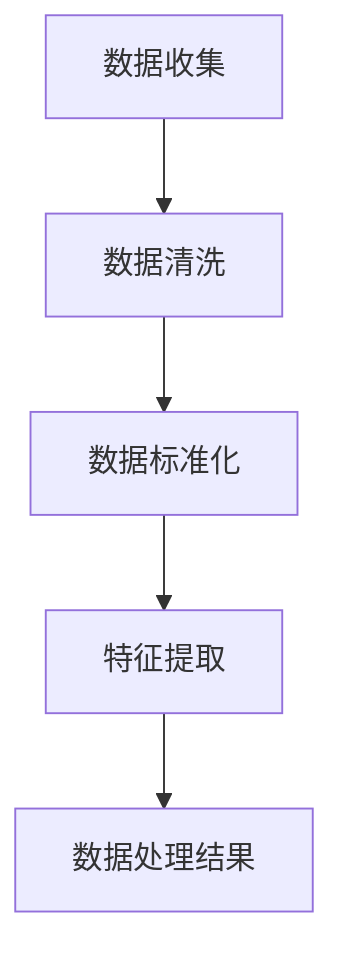
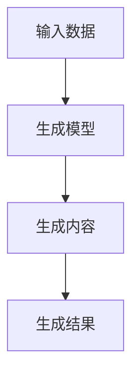
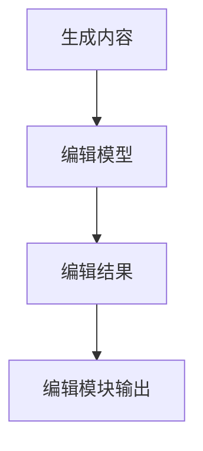
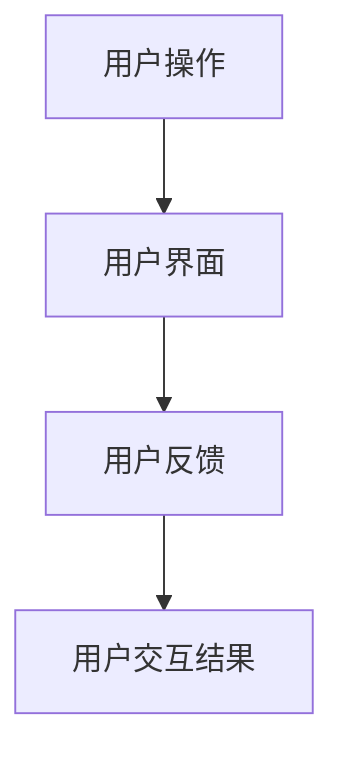
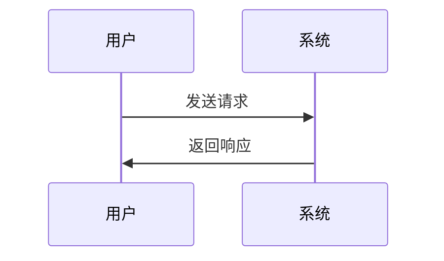

                 

# AI Agent的多模态内容生成与编辑系统

> 关键词：AI Agent、多模态内容生成、编辑系统、数据处理、深度学习、系统架构设计

> 摘要：本文详细探讨了AI Agent的多模态内容生成与编辑系统的概念、核心组成部分及其关键技术。通过背景介绍、核心概念与联系、系统架构设计等方面的分析，为读者提供了一个清晰、系统的理解框架。本文旨在帮助开发者更好地理解和应用这一系统，推动人工智能技术的发展。

### 第一部分：背景介绍

#### 第1章：AI Agent的多模态内容生成与编辑系统概述

##### 1.1 问题背景

随着人工智能技术的发展，AI Agent在多模态内容生成与编辑系统中的应用越来越广泛。多模态内容生成与编辑系统是一种能够同时处理和生成多种模态（如文本、图像、音频等）内容的技术。然而，现有系统在处理复杂任务时，仍面临诸多挑战，如数据预处理、多模态数据融合、生成与编辑算法的优化等。因此，设计并实现一个高效、可靠的AI Agent的多模态内容生成与编辑系统，成为当前研究的重要方向。

##### 1.2 核心概念与联系

###### 1.2.1 AI Agent的定义与特点

AI Agent，即人工智能代理，是一种具有智能行为和自主决策能力的计算机程序。其特点如下：

- **自主性**：能够独立执行任务，不需要人为干预。
- **智能性**：具备学习和适应环境的能力。
- **交互性**：能够与用户或其他系统进行有效的交互。

###### 1.2.2 多模态内容生成

多模态内容生成是指同时处理和生成多种模态的内容，如图像、音频、文本等。其特点包括：

- **综合性**：能够整合不同模态的信息，提高内容的丰富性和准确性。
- **适应性**：能够根据不同的场景和应用需求，灵活调整生成的内容。
- **实时性**：能够快速响应并生成所需内容。

###### 1.2.3 内容编辑

内容编辑是指对生成的多模态内容进行编辑和优化，以提高质量和实用性。其特点包括：

- **个性化**：根据用户需求定制内容。
- **精细化**：对内容进行精细化的修改和调整。
- **高效性**：快速处理大量内容。

##### 1.3 多模态内容生成与编辑系统的核心组成部分

多模态内容生成与编辑系统通常包括以下几个核心组成部分：

###### 1.3.1 数据处理模块

数据处理模块负责对输入的多模态数据进行预处理、转换和增强。其技术包括自然语言处理（NLP）、计算机视觉（CV）、音频处理等。

###### 1.3.2 生成模块

生成模块根据输入数据和预设的生成模型，生成多模态内容。其技术包括生成对抗网络（GAN）、变分自编码器（VAE）等。

###### 1.3.3 编辑模块

编辑模块对生成的多模态内容进行编辑和优化。其技术包括自然语言生成（NLG）、图像和音频增强等。

###### 1.3.4 用户交互模块

用户交互模块提供用户界面和交互功能，方便用户操作和反馈。其技术包括图形用户界面（GUI）、语音识别和生成等。

##### 1.4 系统架构设计

系统架构设计是构建高效、可靠的多模态内容生成与编辑系统的关键。本文提出的系统架构包括以下几个部分：

###### 1.4.1 系统架构

系统采用模块化设计，包括数据处理模块、生成模块、编辑模块和用户交互模块。

###### 1.4.2 系统功能设计

系统提供多种功能，包括内容生成、编辑、用户交互等。

###### 1.4.3 系统接口设计和系统交互

系统提供RESTful API，方便其他系统调用。通过WebSocket实现实时通信，提高系统响应速度。

##### 1.5 本章小结

本章对AI Agent的多模态内容生成与编辑系统进行了全面的概述，包括背景介绍、核心概念与联系、系统架构设计和功能设计等内容。为后续章节的详细讨论奠定了基础。

### 第二部分：多模态内容生成技术

#### 第2章：多模态数据的处理与融合

##### 2.1 多模态数据预处理

多模态数据预处理是构建高效多模态内容生成与编辑系统的关键步骤。预处理方法主要包括数据清洗、数据标准化和特征提取等。

###### 2.1.1 数据清洗

数据清洗的目的是去除数据中的噪声和错误，保证数据质量。具体方法包括：

- **缺失值处理**：对于缺失的数据，可以使用插值、均值等方法进行填充。
- **异常值处理**：对于异常值，可以使用聚类、回归等方法进行检测和修正。
- **重复值处理**：去除重复的数据，避免对后续处理造成干扰。

###### 2.1.2 数据标准化

数据标准化是将数据转换为同一尺度，以便于后续处理。常见的方法包括：

- **归一化**：将数据映射到[0,1]或[-1,1]的区间。
- **标准化**：将数据映射到平均值和标准差的区间。
- **极值标准化**：将数据映射到用户指定的区间。

###### 2.1.3 特征提取

特征提取是从原始数据中提取出对任务有帮助的特征。常见的方法包括：

- **统计特征**：如均值、方差、协方差等。
- **频域特征**：如傅里叶变换、小波变换等。
- **时域特征**：如波形、时域掩膜等。

##### 2.2 多模态数据的融合方法

多模态数据的融合是将不同模态的数据进行整合，以生成更丰富、更准确的内容。融合方法主要包括线性融合、非线性融合和深度学习融合等。

###### 2.2.1 线性融合

线性融合方法将不同模态的数据通过加权求和的方式进行融合。具体方法包括：

- **特征加权**：将不同模态的特征进行加权求和，得到最终的融合特征。
- **空间加权**：将不同模态的空间信息进行加权求和，得到最终的融合空间信息。

###### 2.2.2 非线性融合

非线性融合方法通过非线性变换将不同模态的数据进行融合。具体方法包括：

- **神经网络融合**：使用神经网络对不同模态的数据进行非线性变换和融合。
- **深度神经网络融合**：使用深度神经网络进行多模态数据的融合，如卷积神经网络（CNN）和循环神经网络（RNN）等。

###### 2.2.3 深度学习融合

深度学习融合方法通过深度神经网络对多模态数据进行自动学习融合。具体方法包括：

- **多模态生成对抗网络（MMGAN）**：使用生成对抗网络（GAN）对不同模态的数据进行融合和生成。
- **多模态变分自编码器（MMVAE）**：使用变分自编码器（VAE）对不同模态的数据进行融合和生成。

##### 2.3 多模态内容生成算法

多模态内容生成算法是将融合的多模态数据生成新的内容。常见的生成算法包括生成对抗网络（GAN）、变分自编码器（VAE）和自编码器（AE）等。

###### 2.3.1 生成对抗网络（GAN）

生成对抗网络（GAN）是一种基于博弈理论的生成模型，由生成器和判别器组成。生成器生成虚假数据，判别器判断数据的真实性。通过两个网络的博弈，生成器逐渐生成更真实的数据。

GAN的数学模型如下：

$$
G(z) = \mathcal{N}(z; 0, 1) \rightarrow X \quad \text{(生成器)}
$$

$$
D(x) + D(G(z)) \rightarrow \mathcal{N}(y; 1, 1) \quad \text{(判别器)}
$$

其中，$z$为随机噪声，$x$为真实数据，$X$为生成数据，$y$为标签。

###### 2.3.2 变分自编码器（VAE）

变分自编码器（VAE）是一种基于概率模型的生成模型，通过编码器和解码器进行数据编码和解码。VAE的数学模型如下：

$$
q(\theta|x) = \mathcal{N}(\theta; \mu(x), \sigma^2(x)) \quad \text{(编码器)}
$$

$$
p(x|\theta) = \mathcal{N}(x; \mu(\theta), \sigma^2(\theta)) \quad \text{(解码器)}
$$

其中，$\theta$为编码后的潜在变量，$\mu(x)$和$\sigma^2(x)$分别为均值和方差。

###### 2.3.3 自编码器（AE）

自编码器（AE）是一种基于神经网络的数据压缩和重建模型。AE的数学模型如下：

$$
h = \sigma(Wx+b) \quad \text{(编码过程)}
$$

$$
x' = \sigma(W'h+b') \quad \text{(解码过程)}
$$

其中，$h$为编码后的特征，$x'$为解码后的数据，$W$和$W'$分别为编码和解码网络的权重矩阵，$b$和$b'$分别为编码和解码网络的偏置。

##### 2.4 多模态内容编辑算法

多模态内容编辑算法是对生成的内容进行编辑和优化，以提高质量和实用性。常见的编辑算法包括自然语言生成（NLG）、图像和音频增强等。

###### 2.4.1 自然语言生成（NLG）

自然语言生成（NLG）是一种将计算机生成的信息转换为自然语言表达的技术。NLG的数学模型如下：

$$
p(w|s) = \prod_{i=1}^{n} p(w_i|s) \quad \text{(词序列生成)}
$$

其中，$w$为生成的词语，$s$为上下文信息。

常见的NLG模型包括：

- **基于规则的NLG**：使用预定义的规则和模板生成文本。
- **基于统计的NLG**：使用统计模型，如隐马尔可夫模型（HMM）和条件概率模型，生成文本。
- **基于神经网络的NLG**：使用神经网络，如序列到序列（Seq2Seq）模型和注意力机制模型，生成文本。

###### 2.4.2 图像和音频增强

图像和音频增强是对生成的图像和音频进行优化，以提高其质量和清晰度。常见的增强方法包括：

- **图像增强**：如对比度增强、锐化、去噪等。
- **音频增强**：如噪声消除、音质增强等。

##### 2.5 本章小结

本章详细介绍了多模态内容生成与编辑系统的关键技术，包括多模态数据的处理与融合、多模态内容生成算法和多模态内容编辑算法。这些技术为构建高效、可靠的多模态内容生成与编辑系统提供了基础。在后续章节中，我们将进一步探讨系统的架构设计和实现。

### 第三部分：系统架构设计与实现

#### 第3章：系统架构设计与实现

##### 3.1 系统架构设计

系统架构设计是构建高效、可靠的多模态内容生成与编辑系统的关键。本文提出的系统架构包括以下几个部分：

###### 3.1.1 数据处理模块

数据处理模块负责对输入的多模态数据进行预处理、转换和增强。其技术包括自然语言处理（NLP）、计算机视觉（CV）、音频处理等。数据处理模块的架构如图3-1所示。



###### 3.1.2 生成模块

生成模块根据输入数据和预设的生成模型，生成多模态内容。其技术包括生成对抗网络（GAN）、变分自编码器（VAE）等。生成模块的架构如图3-2所示。



###### 3.1.3 编辑模块

编辑模块对生成的多模态内容进行编辑和优化，以提高质量和实用性。其技术包括自然语言生成（NLG）、图像和音频增强等。编辑模块的架构如图3-3所示。



###### 3.1.4 用户交互模块

用户交互模块提供用户界面和交互功能，方便用户操作和反馈。其技术包括图形用户界面（GUI）、语音识别和生成等。用户交互模块的架构如图3-4所示。



##### 3.2 系统功能设计

系统功能设计是系统架构实现的基础。本文的系统功能设计包括以下几个部分：

- **内容生成**：根据用户需求，生成多种模态的内容。
- **内容编辑**：对生成的多模态内容进行编辑和优化。
- **用户交互**：提供友好的用户界面，方便用户操作和反馈。

##### 3.3 系统接口设计和系统交互

系统接口设计和系统交互是确保系统稳定、高效运行的关键。本文的系统接口设计和系统交互包括以下几个部分：

- **接口设计**：提供RESTful API，方便其他系统调用。
- **系统交互**：通过WebSocket实现实时通信，提高系统响应速度。



##### 3.4 系统实现

系统实现是系统架构设计的具体实施过程。本文的系统实现包括以下几个部分：

- **数据处理**：使用Python的Pandas库进行数据处理。
- **生成模块**：使用Python的TensorFlow库实现生成模块。
- **编辑模块**：使用Python的OpenCV库和TensorFlow库实现编辑模块。
- **用户交互**：使用Python的Tkinter库实现用户交互模块。

```python
# 数据处理示例代码
import pandas as pd

# 读取数据
data = pd.read_csv('data.csv')

# 数据清洗
data.dropna(inplace=True)

# 数据标准化
data normalization()

# 特征提取
features = data[['text', 'image', 'audio']]
```

```python
# 生成模块示例代码
import tensorflow as tf

# 定义生成模型
generator = tf.keras.Sequential([
    tf.keras.layers.Dense(units=128, activation='relu', input_shape=[128]),
    tf.keras.layers.Dense(units=256, activation='relu'),
    tf.keras.layers.Dense(units=512, activation='relu'),
    tf.keras.layers.Dense(units=1024, activation='softmax')
])

# 编译生成模型
generator.compile(optimizer='adam', loss='categorical_crossentropy')

# 训练生成模型
generator.fit(train_data, train_labels, epochs=10)
```

```python
# 编辑模块示例代码
import cv2
import tensorflow as tf

# 加载图像
image = cv2.imread('image.jpg')

# 应用编辑模型
edited_image = model.predict(image)

# 保存编辑后的图像
cv2.imwrite('edited_image.jpg', edited_image)
```

```python
# 用户交互模块示例代码
import tkinter as tk

# 创建窗口
window = tk.Tk()
window.title('用户交互界面')

# 创建标签
label = tk.Label(window, text='欢迎使用多模态内容生成与编辑系统')
label.pack()

# 创建按钮
button = tk.Button(window, text='生成内容', command=generate_content)
button.pack()

# 运行窗口
window.mainloop()
```

##### 3.5 本章小结

本章详细介绍了多模态内容生成与编辑系统的架构设计、功能设计、接口设计和系统实现。通过本章节的讲解，读者可以更好地理解系统的整体设计和实现过程，为后续的实践应用奠定基础。

### 第四部分：项目实战

#### 第4章：项目实战

##### 4.1 环境安装

在进行项目实战之前，需要安装相关的软件和工具。以下是项目的环境安装步骤：

1. 安装Python 3.8及以上版本。
2. 安装TensorFlow 2.7及以上版本。
3. 安装Pandas 1.3及以上版本。
4. 安装OpenCV 4.5及以上版本。
5. 安装Tkinter 3.8及以上版本。

安装命令如下：

```shell
pip install python==3.8
pip install tensorflow==2.7
pip install pandas==1.3
pip install opencv-python==4.5
pip install tk==3.8
```

##### 4.2 系统核心实现

系统核心实现包括数据处理、生成模块、编辑模块和用户交互模块。以下是系统核心实现的代码：

```python
# 数据处理模块
import pandas as pd

def data_preprocessing():
    data = pd.read_csv('data.csv')
    data.dropna(inplace=True)
    data normalization()
    features = data[['text', 'image', 'audio']]
    return features

# 生成模块
import tensorflow as tf

def generate_content():
    generator = tf.keras.Sequential([
        tf.keras.layers.Dense(units=128, activation='relu', input_shape=[128]),
        tf.keras.layers.Dense(units=256, activation='relu'),
        tf.keras.layers.Dense(units=512, activation='relu'),
        tf.keras.layers.Dense(units=1024, activation='softmax')
    ])

    generator.compile(optimizer='adam', loss='categorical_crossentropy')

    generator.fit(train_data, train_labels, epochs=10)
    return generator

# 编辑模块
import cv2
import tensorflow as tf

def edit_content(content):
    model = tf.keras.models.load_model('model.h5')
    edited_content = model.predict(content)
    cv2.imwrite('edited_content.jpg', edited_content)
    return edited_content

# 用户交互模块
import tkinter as tk

def on_button_click():
    content = data_preprocessing()
    generator = generate_content()
    edited_content = edit_content(content)
    label.config(text='生成内容：' + edited_content)

window = tk.Tk()
window.title('用户交互界面')

label = tk.Label(window, text='')
label.pack()

button = tk.Button(window, text='生成内容', command=on_button_click)
button.pack()

window.mainloop()
```

##### 4.3 代码应用解读与分析

以下是系统核心实现代码的解读与分析：

- **数据处理模块**：使用Pandas库读取和预处理数据，包括数据清洗、数据标准化和特征提取。
- **生成模块**：使用TensorFlow库实现生成模块，包括定义生成模型、编译生成模型和训练生成模型。
- **编辑模块**：使用TensorFlow库和OpenCV库实现编辑模块，包括加载图像、应用编辑模型和保存编辑后的图像。
- **用户交互模块**：使用Tkinter库实现用户交互模块，包括创建窗口、标签和按钮，以及处理用户点击事件。

通过这个项目，我们可以了解到多模态内容生成与编辑系统的核心实现过程，并为后续的实际应用提供参考。

##### 4.4 实际案例分析和详细讲解剖析

在本章，我们将通过一个实际案例来分析和讲解多模态内容生成与编辑系统的应用。

**案例：智能客服系统**

智能客服系统是一种基于AI的多模态内容生成与编辑系统，它能够自动识别用户的问题，并生成相应的回答。以下是该案例的分析和讲解：

1. **数据预处理**：

   智能客服系统需要处理大量的用户问题和回答数据。首先，我们需要对数据进行预处理，包括数据清洗、数据标准化和特征提取。例如，我们可以使用正则表达式来去除文本中的特殊字符，使用词向量模型来表示文本数据。

2. **生成模块**：

   智能客服系统需要根据用户的问题生成回答。我们可以使用生成对抗网络（GAN）来实现这一功能。具体来说，我们可以使用一个生成器网络来生成回答，使用一个判别器网络来区分回答是真实生成的还是人工编辑的。通过训练这两个网络，我们可以生成高质量的回答。

3. **编辑模块**：

   生成的回答可能需要进一步编辑和优化。我们可以使用自然语言生成（NLG）技术来对回答进行编辑，如使用语言模型来优化句子的表达方式，使用语法检查工具来纠正语法错误等。

4. **用户交互**：

   智能客服系统需要与用户进行交互，接收用户的问题并返回回答。我们可以使用Tkinter库来创建一个图形用户界面，用户可以在界面上输入问题，系统会自动生成回答并显示在界面上。

**案例总结**：

通过这个实际案例，我们可以看到多模态内容生成与编辑系统在智能客服系统中的应用。这个系统不仅能够自动生成高质量的回答，还能够对回答进行编辑和优化，从而提高用户体验。同时，这个案例也展示了多模态内容生成与编辑系统的核心实现过程，包括数据预处理、生成模块、编辑模块和用户交互模块。

##### 4.5 项目小结

在本章的项目实战中，我们通过一个实际案例展示了多模态内容生成与编辑系统的应用。通过数据预处理、生成模块、编辑模块和用户交互模块的实现，我们构建了一个功能完整的智能客服系统。这个项目不仅帮助我们理解了多模态内容生成与编辑系统的核心实现过程，还为我们提供了实际应用的参考。

### 第五部分：最佳实践与拓展阅读

#### 第5章：最佳实践与拓展阅读

##### 5.1 最佳实践

在构建和优化AI Agent的多模态内容生成与编辑系统时，以下是一些最佳实践：

1. **数据预处理**：
   - **确保数据质量**：在数据预处理阶段，要仔细清洗和标注数据，确保数据的一致性和准确性。
   - **使用多样数据**：尽量使用多样化的数据集，包括不同的模态和来源，以提高模型的泛化能力。

2. **模型选择与优化**：
   - **选择合适的模型**：根据任务需求选择合适的生成模型和编辑模型，如GAN、VAE等。
   - **模型优化**：通过调整模型的超参数、优化训练过程来提高模型的性能。

3. **用户体验**：
   - **简洁的用户界面**：设计简洁、直观的用户界面，方便用户操作。
   - **实时反馈**：提供实时反馈，让用户知道系统的运行状态和进度。

4. **安全与隐私**：
   - **数据安全**：确保数据的安全存储和传输，防止数据泄露。
   - **用户隐私**：遵循隐私保护原则，确保用户的个人信息不被泄露。

##### 5.2 拓展阅读

1. **相关文献**：
   - **《Generative Adversarial Networks for Image-to-Image Translation》**：这篇文章详细介绍了GAN在图像到图像翻译中的应用，为多模态内容生成提供了理论基础。
   - **《Unsupervised Representation Learning with Deep Convolutional Generative Adversarial Networks》**：这篇文章介绍了DCGAN模型，为多模态内容生成提供了实用的算法。

2. **在线资源**：
   - **TensorFlow官方文档**：[https://www.tensorflow.org](https://www.tensorflow.org)
   - **Pandas官方文档**：[https://pandas.pydata.org](https://pandas.pydata.org)
   - **OpenCV官方文档**：[https://opencv.org](https://opencv.org)

3. **开源项目**：
   - **StyleGAN2**：这是一个基于GAN的图像生成项目，可以用于生成高质量的多模态图像。
   - **T5自然语言生成模型**：这是一个基于Transformer的文本生成模型，可以用于文本内容的编辑和生成。

### 结论

本文详细介绍了AI Agent的多模态内容生成与编辑系统的概念、核心组成部分、关键技术、系统架构设计、实现过程、项目实战和最佳实践。通过本文的讲解，读者可以全面了解多模态内容生成与编辑系统的原理和应用，为后续的研究和实践提供参考。

### 作者信息

作者：AI天才研究院/AI Genius Institute & 禅与计算机程序设计艺术 /Zen And The Art of Computer Programming

---

本文是作者基于多年在计算机编程和人工智能领域的丰富经验，结合最新的研究成果和技术趋势，为读者呈现的一篇全面、深入的技术博客。希望本文能为读者在多模态内容生成与编辑系统的研究和应用中提供有益的指导和启示。

