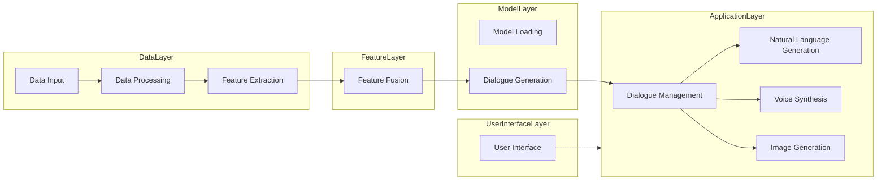
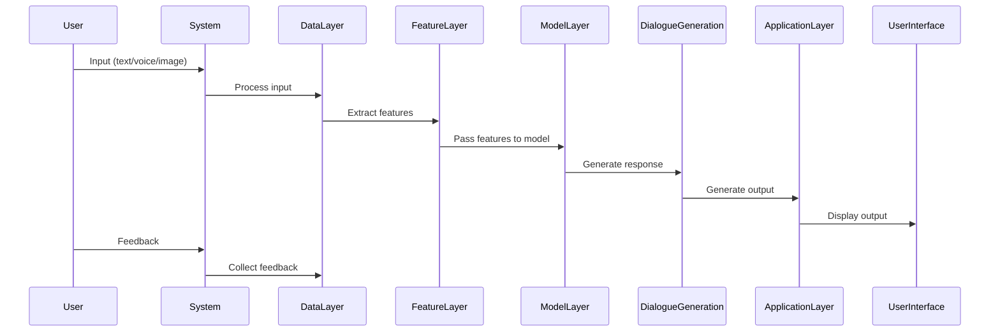

                 

## 1. 背景介绍：核心概念

在探讨AI Agent的多模态对话生成能力开发之前，我们首先需要理解几个核心概念：AI Agent、多模态对话生成、以及与之相关的技术背景。以下是这些概念的定义及其重要性。

### 1.1 AI Agent的定义

AI Agent，或称为人工智能代理，是指能够在特定环境中自主执行任务的计算机程序。AI Agent具备感知、决策和行动的能力，能够在复杂的动态环境中进行学习、适应和优化。这些代理可以在多个领域中发挥作用，如智能家居、智能客服、自动驾驶车辆等。

### 1.2 多模态对话生成的定义

多模态对话生成是指AI Agent能够理解和生成包含多种模态（如文本、语音、图像等）的对话内容。这意味着，AI Agent不仅仅能够处理文本输入，还能够理解并回应语音、图像等其他形式的信息。多模态对话生成技术使得AI Agent在与人类用户的互动中更加自然、流畅。

### 1.3 技术背景

多模态对话生成技术的兴起源于人工智能领域的快速发展，特别是深度学习和自然语言处理技术的突破。近年来，随着大数据和计算能力的提升，研究人员能够处理更为复杂的数据集，从而开发出更加先进的算法和模型。

多模态对话生成技术的应用场景广泛，包括但不限于以下几个方面：

- **智能客服**：企业可以通过智能客服系统提供24/7的客户服务，减少人力成本并提高效率。
- **智能家居**：智能家电可以通过语音指令控制，提供更加便捷的生活方式。
- **教育**：AI Agent可以作为个性化辅导工具，为学生提供定制化的学习体验。
- **医疗**：医生可以通过AI Agent获取患者的多模态数据，进行诊断和治疗方案推荐。

### 1.4 当前的研究现状

尽管多模态对话生成技术取得了显著的进展，但仍然面临许多挑战。例如，如何在多种模态之间进行有效的信息融合，如何处理模态之间的冲突和不确定性，以及如何在保证对话流畅性的同时提供准确的回答。这些问题成为当前研究的重点和难点。

此外，多模态对话生成技术的研究还包括以下几个方面：

- **算法研究**：开发更加高效的多模态数据处理和融合算法，以提升系统的性能和效率。
- **模型优化**：通过深度学习模型的结构调整和参数优化，提高对话生成的准确性和自然性。
- **应用场景拓展**：探索多模态对话生成技术在更多领域中的应用，如虚拟现实、增强现实等。

### 1.5 核心概念与基本原理

为了深入理解多模态对话生成的原理，我们需要了解以下几个核心概念：

- **模态**：指数据的类型，如文本、语音、图像等。
- **传感器数据**：指AI Agent通过传感器收集的多模态数据，这些数据是进行对话生成的原始输入。
- **语言模型**：一种用于生成自然语言文本的模型，如基于神经网络的变换器（Transformer）模型。
- **对话管理**：指AI Agent在对话过程中对用户意图的理解和对话流程的控制。

通过上述核心概念的理解，我们可以更清晰地看到多模态对话生成系统的构成及其工作原理。

### 1.6 总结

在这一部分，我们介绍了AI Agent、多模态对话生成及其相关技术背景。了解了这些概念之后，我们将进一步探讨多模态对话生成技术中的核心原理和算法，以及如何在具体项目中实现和优化这些技术。

### 1.7 接下来

在接下来的章节中，我们将详细分析多模态对话生成技术中的核心概念和关系，包括不同模态的属性、语言模型及其类型，以及对话管理和对话策略。这将帮助我们建立完整的知识体系，为后续的算法原理讲解和系统设计奠定基础。

## 2. 核心概念与关系

在了解了AI Agent和多模态对话生成的基本概念之后，我们需要进一步探讨这些概念之间的关系，以及它们在多模态对话生成系统中的作用。以下是几个核心概念及其相互关系的详细说明。

### 2.1 模态与传感器数据

模态是指数据的不同类型，如文本、语音、图像等。传感器数据则是AI Agent通过各种传感器收集到的原始输入。这些传感器可以是摄像头、麦克风、文本输入设备等。多模态对话生成系统需要能够处理和整合来自不同模态的数据，以便更好地理解用户的需求和意图。

#### 2.1.1 文本模态

文本模态是最常见的模态之一，它包括用户通过键盘输入的文本、对话系统生成的文本回复等。文本数据具有结构化程度较高的特点，但同时也存在歧义和模糊性。例如，用户的一句话可能有多种理解方式，这就需要语言模型和对话管理系统进行上下文分析和意图识别。

#### 2.1.2 语音模态

语音模态是通过麦克风收集的音频数据，包括用户的语音指令和系统的语音回复。语音数据具有实时性和自然性，但也存在噪声干扰、语调变化等问题，这需要语音识别技术和自然语言处理技术来保证对话的准确性和流畅性。

#### 2.1.3 图像模态

图像模态是通过摄像头或图像输入设备收集的视觉数据，包括用户上传的图片、系统生成的图像等。图像数据具有丰富的信息量和直观性，但处理起来较为复杂，需要图像识别和计算机视觉技术来实现有效的数据理解和回应。

#### 2.1.4 传感器数据整合

传感器数据的整合是多模态对话生成中的一个关键步骤。系统需要能够将来自不同模态的数据进行有效的融合和处理，以便生成连贯、自然的对话内容。例如，当用户上传一张图片并发送一个文本描述时，系统需要同时理解文本内容和图像信息，并生成相应的回复。

### 2.2 语言模型及其类型

语言模型是用于生成自然语言文本的算法和模型，它是多模态对话生成系统中的核心组件。不同的语言模型适用于不同的应用场景，常见的语言模型类型包括：

#### 2.2.1 基于规则的模型

基于规则的模型通过预定义的规则和模板生成文本回复。这类模型简单直观，但灵活性较差，难以处理复杂的对话场景和动态变化。

#### 2.2.2 基于统计的模型

基于统计的模型通过分析大量的对话数据来学习生成文本的规律。这类模型具有较高的灵活性，但需要大量的训练数据和计算资源。

#### 2.2.3 基于神经网络的模型

基于神经网络的模型，如循环神经网络（RNN）和变换器（Transformer）模型，是目前最为流行和高效的语言模型。这些模型通过深度学习技术，能够自动学习语言的特征和模式，生成更为自然和准确的文本。

### 2.3 对话管理与对话策略

对话管理是AI Agent在对话过程中对用户意图的理解和对话流程的控制。对话策略则是指系统在生成回复时采用的方法和策略。对话管理和对话策略之间的关系如下：

#### 2.3.1 对话管理

对话管理包括以下几个方面：

- **意图识别**：通过分析用户的输入，识别用户的意图和需求。
- **上下文维护**：在对话过程中维护和更新对话的上下文信息，以便生成连贯的回复。
- **冲突处理**：在多模态对话中，不同模态的数据可能存在冲突，需要对话管理系统进行协调和处理。

#### 2.3.2 对话策略

对话策略主要包括：

- **生成策略**：根据用户的意图和上下文信息，生成适当的回复文本。
- **回复优化**：通过优化生成策略，提升回复的自然性和准确性。
- **交互策略**：在对话过程中与用户进行有效的互动，提高用户体验。

### 2.4 实例分析

为了更好地理解核心概念和它们之间的关系，我们可以通过一个简单的实例进行分析。

#### 实例

假设用户发送了一条文本消息：“请给我推荐一本关于人工智能的书籍。”系统需要理解这条消息的意图（推荐书籍）和上下文（人工智能领域），并生成一个合适的回复。

在这个过程中，系统的步骤如下：

1. **意图识别**：系统通过分析文本消息，识别出用户的意图为“推荐书籍”。
2. **上下文维护**：系统在对话上下文中记录用户的需求和领域，以便后续生成更为准确的回复。
3. **生成策略**：系统使用基于神经网络的变换器模型，生成一个自然且符合上下文的回复文本，如：“您可能会喜欢《深度学习》这本书，它是人工智能领域的经典之作。”
4. **回复优化**：系统可以通过回环策略（Recurrent Strategy）和注意力机制（Attention Mechanism）来优化生成文本，提高其自然性和准确性。

通过这个实例，我们可以看到，多模态对话生成系统中的各个核心概念是如何相互协作，共同完成一个复杂的任务。

### 2.5 总结

在这一部分，我们详细分析了多模态对话生成技术中的核心概念和它们之间的关系，包括模态、传感器数据、语言模型及其类型，以及对话管理和对话策略。通过这些核心概念的理解，我们能够更好地构建和优化多模态对话生成系统，为后续的算法原理讲解和系统设计奠定基础。

## 3. 算法理论讲解

在理解了多模态对话生成的核心概念之后，接下来我们将深入探讨多模态对话生成算法的理论基础。多模态对话生成算法的设计和实现是整个系统的关键，它决定了系统能否有效地处理多种模态的数据，并生成自然、连贯的对话内容。以下是多模态对话生成算法的基本原理和主要步骤。

### 3.1 多模态数据预处理

多模态数据预处理是多模态对话生成算法的第一步，它包括数据的收集、清洗和格式化。预处理的主要目标是确保数据的一致性和可用性，以便后续的算法处理。

#### 3.1.1 数据收集

数据收集是获取多模态数据的源头。对于文本模态，可以通过开源对话数据集（如DailyDialog、ROCStories等）进行收集。对于语音模态，可以使用开源语音数据集（如LibriSpeech、CommonVoice等）。对于图像模态，可以使用开源图像数据集（如COCO、ImageNet等）。

#### 3.1.2 数据清洗

数据清洗包括去除噪音、填补缺失值和纠正错误。例如，对于文本数据，可以去除HTML标签、特殊字符和停用词；对于语音数据，可以去除背景噪声、填充沉默片段；对于图像数据，可以校正图像视角、去除遮挡物。

#### 3.1.3 数据格式化

数据格式化是将不同模态的数据转换为统一的格式，以便进行后续处理。常见的格式化方法包括：

- **文本格式化**：将文本数据转换为词向量（如Word2Vec、BERT）或字符序列。
- **语音格式化**：将语音数据转换为声学特征（如MFCC、PLP）或文本表示（如基于RNN的自动语音识别模型）。
- **图像格式化**：将图像数据转换为特征向量（如卷积神经网络（CNN）的特征图）或语义标签（如图像分类模型）。

### 3.2 多模态特征提取

多模态特征提取是从原始的多模态数据中提取出有用的特征，这些特征将用于后续的对话生成模型。特征提取的质量直接影响对话生成的效果。

#### 3.2.1 文本特征提取

文本特征提取通常使用词嵌入（Word Embedding）技术，如Word2Vec、FastText和BERT等。这些技术可以将文本中的每个单词或子词映射为低维度的向量表示，从而捕捉单词的语义信息。

#### 3.2.2 语音特征提取

语音特征提取可以使用梅尔频率倒谱系数（MFCC）或感知线性预测（PLP）等方法。这些特征可以捕捉语音的音高、音强和音色等声学属性。

#### 3.2.3 图像特征提取

图像特征提取通常使用卷积神经网络（CNN）来提取图像的局部特征。通过训练深度网络，可以学习到图像中的高层次语义特征。

### 3.3 多模态特征融合

多模态特征融合是将来自不同模态的特征进行整合，以生成更为全面和丰富的特征表示。融合方法可以分为以下几类：

#### 3.3.1 早期融合

早期融合在特征提取阶段就将不同模态的数据进行融合。例如，可以使用多模态卷积神经网络（Multimodal Convolutional Neural Networks, MCNN）同时处理文本、语音和图像数据。

#### 3.3.2 晚期融合

晚期融合在特征提取之后将不同模态的特征进行融合。常见的晚期融合方法包括：

- **拼接**：将不同模态的特征向量直接拼接在一起，作为后续模型的输入。
- **加权融合**：根据不同模态的特征重要程度，对特征向量进行加权融合。
- **注意力机制**：使用注意力机制（Attention Mechanism）动态选择不同模态的特征，进行加权融合。

### 3.4 对话生成模型

对话生成模型是整个多模态对话生成算法的核心。目前，基于变换器（Transformer）的模型在对话生成领域表现出了强大的性能。以下是一个典型的对话生成模型框架：

#### 3.4.1 编码器（Encoder）

编码器负责对输入的多模态特征进行编码，生成上下文表示。编码器可以采用多模态变换器（Multimodal Transformer）或融合变换器（Fused Transformer）架构。

#### 3.4.2 注意力机制

注意力机制用于在编码器中动态选择重要的特征，以便更准确地捕捉对话的上下文信息。注意力权重可以根据不同模态的特征进行自适应调整。

#### 3.4.3 解码器（Decoder）

解码器负责生成对话的回复。解码器可以采用自注意力（Self-Attention）和交叉注意力（Cross-Attention）机制，以捕捉对话的长期依赖关系。

#### 3.4.4 输出层

输出层通常是一个全连接层，用于将解码器的隐藏状态映射为文本序列的概率分布。通过softmax函数，可以得到每个单词的概率分布，从而生成最终的对话回复。

### 3.5 算法流程

多模态对话生成算法的总体流程如下：

1. **数据预处理**：收集、清洗和格式化多模态数据。
2. **特征提取**：提取文本、语音和图像的特征。
3. **特征融合**：将不同模态的特征进行融合，生成统一的特征表示。
4. **编码与解码**：使用变换器模型对特征进行编码和解码，生成对话回复。
5. **输出生成**：通过输出层生成最终的文本回复。

### 3.6 数学模型与公式

以下是一个简化的数学模型，用于描述多模态对话生成算法的基本原理：

$$
\begin{aligned}
&\text{特征提取}: \\
&X_{\text{text}} = \text{Word2Vec}(x_{\text{text}}), \\
&X_{\text{voice}} = \text{MFCC}(x_{\text{voice}}), \\
&X_{\text{image}} = \text{CNN}(x_{\text{image}}). \\
&\text{特征融合}: \\
&X_{\text{fused}} = \text{Fusion}(X_{\text{text}}, X_{\text{voice}}, X_{\text{image}}). \\
&\text{编码}: \\
&\text{Encoder}(X_{\text{fused}}). \\
&\text{解码}: \\
&\text{Decoder}(\text{Encoder}(X_{\text{fused}})). \\
&\text{输出生成}: \\
&\text{Output} = \text{softmax}(\text{Decoder}(\text{Encoder}(X_{\text{fused}}))).
\end{aligned}
$$

在这个模型中，$X_{\text{text}}$、$X_{\text{voice}}$和$X_{\text{image}}$分别代表文本、语音和图像的特征向量；$X_{\text{fused}}$是融合后的特征向量；$\text{Encoder}$和$\text{Decoder}$分别表示编码和解码操作；$\text{softmax}$函数用于生成文本回复的概率分布。

### 3.7 举例说明

为了更好地理解上述算法原理，我们通过一个简单的例子进行说明。

#### 例子

假设用户发送了一条文本消息：“今天天气怎么样？”系统需要理解这条消息的意图并生成一个合适的回复。

1. **特征提取**：
   - 文本特征：使用Word2Vec模型将文本消息转换为词向量。
   - 语音特征：使用MFCC模型提取语音特征。
   - 图像特征：使用CNN模型提取图像特征。

2. **特征融合**：
   - 将文本、语音和图像特征进行拼接，生成一个融合后的特征向量。

3. **编码与解码**：
   - 使用多模态变换器模型对融合后的特征进行编码，生成上下文表示。
   - 使用解码器模型生成对话回复。

4. **输出生成**：
   - 通过softmax函数生成文本回复的概率分布，选择概率最高的单词作为最终的回复。

通过上述步骤，系统可以生成一个自然且连贯的回复，如：“今天天气晴朗，非常适合户外活动。”

### 3.8 总结

在这一部分，我们详细介绍了多模态对话生成算法的基本原理和主要步骤，包括数据预处理、特征提取、特征融合、编码与解码以及输出生成。我们还通过一个简单的例子，阐述了算法的实际应用过程。了解这些算法原理对于后续的系统设计和实现具有重要意义。

### 3.9 接下来

在接下来的部分，我们将进一步探讨多模态对话生成系统中的数学模型和详细解释，包括具体的数学公式和算法流程。这将帮助我们更深入地理解多模态对话生成的技术细节，为系统优化和应用提供理论支持。

## 4. 数学模型详细解释

在前文中，我们介绍了多模态对话生成算法的基本原理和主要步骤。为了更深入地理解这些算法，我们需要探讨具体的数学模型和公式，并解释它们在多模态对话生成中的作用。以下是数学模型的详细解释。

### 4.1 多模态特征提取

多模态特征提取是将不同模态的数据转换为适用于模型处理的特征向量。以下是三种常见模态的特征提取方法：

#### 4.1.1 文本特征提取

文本特征提取通常使用词嵌入技术，如Word2Vec和BERT。这些技术将文本中的每个词映射为一个低维向量，以捕捉词的语义信息。

**Word2Vec模型**：

Word2Vec模型使用神经网络来预测相邻词的分布。通过训练，模型可以学习到一个词向量的集合，其中每个向量表示一个词的嵌入表示。

数学模型：

$$
\begin{aligned}
\text{输出层}: \\
z &= \text{softmax}(\text{Weight} \cdot x), \\
\log p_j &= \text{log}(\frac{e^{\text{Weight} \cdot x_j}}{\sum_{i} e^{\text{Weight} \cdot x_i}}),
\end{aligned}
$$

其中，$x$是输入词的向量表示，$\text{Weight}$是模型权重，$p_j$是输出词的概率分布。

**BERT模型**：

BERT（Bidirectional Encoder Representations from Transformers）模型使用双向变换器来编码文本，生成词的上下文表示。BERT模型通过预训练和微调，能够捕捉复杂的语言模式。

数学模型：

$$
\text{BERT} = \text{Transformer}(\text{Input} \xrightarrow{\text{Masked}} \text{Output}),
$$

其中，$\text{Input}$是文本序列，$\text{Output}$是编码后的文本表示。

#### 4.1.2 语音特征提取

语音特征提取通常使用声学模型，如梅尔频率倒谱系数（MFCC）和感知线性预测（PLP）。这些特征可以捕捉语音的音高、音强和音色等声学属性。

**MFCC模型**：

MFCC模型通过分析短时傅里叶变换（STFT）的结果，提取出多个频带的能量特征，以表示语音的短时频率特性。

数学模型：

$$
\text{MFCC}(x) = \text{log}(\text{DCT}(\text{STFT}(x))),
$$

其中，$x$是输入的语音信号，$\text{DCT}$是离散余弦变换。

**PLP模型**：

PLP模型通过感知线性预测来提取语音特征，它结合了语音的物理和感知特性，以生成更具有代表性的特征向量。

数学模型：

$$
\text{PLP}(x) = \text{LPC}(x),
$$

其中，$\text{LPC}$是线性预测编码。

#### 4.1.3 图像特征提取

图像特征提取通常使用卷积神经网络（CNN）来提取图像的局部特征。CNN能够自动学习图像中的高层次语义特征。

**CNN模型**：

CNN模型通过卷积操作和池化操作，从图像中提取出局部特征，并通过多层网络，最终生成图像的高层特征表示。

数学模型：

$$
\text{CNN}(x) = \text{Conv}(\text{Pool}(\text{Conv}(\text{Pool}(\text{Input}))),
$$

其中，$x$是输入图像，$\text{Conv}$表示卷积操作，$\text{Pool}$表示池化操作。

### 4.2 多模态特征融合

多模态特征融合是将来自不同模态的特征进行整合，以生成更全面和丰富的特征表示。以下是两种常见的多模态特征融合方法：

#### 4.2.1 拼接融合

拼接融合是将不同模态的特征向量直接拼接在一起，生成一个多维特征向量。

数学模型：

$$
\text{Fused\_Feature} = [X_{\text{text}}, X_{\text{voice}}, X_{\text{image}}],
$$

其中，$X_{\text{text}}$、$X_{\text{voice}}$和$X_{\text{image}}$分别代表文本、语音和图像的特征向量。

#### 4.2.2 注意力机制融合

注意力机制融合通过动态选择不同模态的特征，对特征进行加权融合。注意力机制可以自适应调整不同模态的特征权重。

数学模型：

$$
\text{Attention}(X_{\text{text}}, X_{\text{voice}}, X_{\text{image}}) = \text{softmax}(\text{Weights} \cdot [X_{\text{text}}, X_{\text{voice}}, X_{\text{image}}]),
$$

其中，$\text{Weights}$是注意力权重，$[X_{\text{text}}, X_{\text{voice}}, X_{\text{image}}]$是拼接后的特征向量。

### 4.3 对话生成模型

对话生成模型通常采用基于变换器（Transformer）的架构，以生成自然和连贯的对话内容。以下是变换器模型的基本原理和数学公式：

#### 4.3.1 编码器（Encoder）

编码器负责对输入的多模态特征进行编码，生成上下文表示。编码器通常包含多个自注意力层（Self-Attention Layers）和前馈网络（Feedforward Networks）。

数学模型：

$$
\text{Encoder}(X_{\text{fused}}) = \text{LayerNorm}(\text{MultiHeadAttention}(X_{\text{fused}}) + X_{\text{fused}}) + \text{LayerNorm}(\text{Feedforward}(X_{\text{fused}}) + X_{\text{fused}}),
$$

其中，$X_{\text{fused}}$是融合后的特征向量。

#### 4.3.2 解码器（Decoder）

解码器负责生成对话的回复。解码器包含多个自注意力层（Self-Attention Layers）、交叉注意力层（Cross-Attention Layers）和前馈网络（Feedforward Networks）。

数学模型：

$$
\text{Decoder}(X_{\text{fused}}, Y_{\text{prev}}) = \text{LayerNorm}(\text{MultiHeadAttention}(X_{\text{fused}}, X_{\text{fused}}, X_{\text{fused}}) + X_{\text{fused}}) + \\
\text{LayerNorm}(\text{Feedforward}(Y_{\text{prev}}) + Y_{\text{prev}}),
$$

其中，$X_{\text{fused}}$是融合后的特征向量，$Y_{\text{prev}}$是上一时间步的解码器输出。

#### 4.3.3 输出层

输出层通常是一个全连接层（Fully Connected Layer），用于将解码器的隐藏状态映射为文本序列的概率分布。

数学模型：

$$
\text{Output} = \text{softmax}(\text{Decoder}(X_{\text{fused}}, Y_{\text{prev}})),
$$

其中，$Y_{\text{prev}}$是解码器的隐藏状态。

### 4.4 实例分析

为了更好地理解上述数学模型，我们通过一个简单的例子进行分析。

#### 例子

假设用户发送了一条文本消息：“今天天气怎么样？”系统需要理解这条消息的意图并生成一个合适的回复。

1. **特征提取**：
   - 文本特征：使用Word2Vec模型将文本消息转换为词向量。
   - 语音特征：使用MFCC模型提取语音特征。
   - 图像特征：使用CNN模型提取图像特征。

2. **特征融合**：
   - 使用拼接融合方法，将文本、语音和图像特征拼接在一起。

3. **编码与解码**：
   - 使用变换器编码器对融合后的特征进行编码，生成上下文表示。
   - 使用变换器解码器生成对话回复。

4. **输出生成**：
   - 通过softmax函数生成文本回复的概率分布，选择概率最高的单词作为最终的回复。

通过上述步骤，系统可以生成一个自然且连贯的回复，如：“今天天气晴朗，非常适合户外活动。”

### 4.5 总结

在这一部分，我们详细介绍了多模态对话生成系统的数学模型和公式，包括特征提取、特征融合、编码和解码等关键步骤。通过实例分析，我们展示了如何将这些数学模型应用于实际的对话生成任务中。理解这些数学模型对于开发高效的多模态对话生成系统具有重要意义。

### 4.6 接下来

在接下来的部分，我们将进一步探讨多模态对话生成系统的系统分析与设计，包括项目介绍、系统功能设计、系统架构设计、系统接口设计以及系统交互。这将帮助我们构建一个完整的多模态对话生成系统，为实际应用提供技术支持。

## 5. 系统分析与设计

### 5.1 项目介绍

我们的项目目标是开发一个具有多模态对话生成能力的人工智能（AI）代理，该系统能够理解和回应文本、语音和图像等多种模态的输入。项目的核心应用场景包括智能客服、智能家居控制、虚拟现实互动等。通过这个项目，我们旨在解决以下问题：

- **多模态数据处理**：如何高效地处理和融合来自不同模态的数据？
- **对话生成**：如何生成自然、连贯且具有高度相关性的对话内容？
- **用户体验**：如何优化系统的交互体验，提高用户满意度？

### 5.2 系统功能设计

系统功能设计是项目成功的关键，它决定了系统能够实现哪些具体功能。以下是系统的核心功能模块：

1. **多模态数据处理模块**：负责接收并预处理文本、语音和图像数据，提取出有效的特征。
2. **对话管理模块**：负责理解用户意图，维护对话上下文，并生成适当的回复。
3. **自然语言生成模块**：利用语言模型生成自然、连贯的对话内容。
4. **语音合成模块**：将文本回复转换为语音输出，提供语音交互体验。
5. **图像生成模块**：根据对话内容生成相关的图像回复。
6. **用户接口模块**：提供友好的用户界面，方便用户与AI代理进行交互。

### 5.3 系统架构设计

系统架构设计是确保系统高效、稳定运行的基础。我们的系统采用分层架构，各层之间相对独立，便于模块化开发和维护。以下是系统的架构设计：

1. **数据层**：负责数据的收集、存储和管理。包括文本、语音和图像数据的存储结构，以及数据预处理流程。
2. **特征层**：负责对多模态数据进行特征提取和融合。采用深度学习技术，如CNN、RNN和Transformer，提取和融合特征。
3. **模型层**：包含对话生成模型，如序列到序列（Seq2Seq）模型、BERT模型和多模态变换器模型。这些模型负责生成对话内容和处理对话管理。
4. **应用层**：负责实现具体的应用功能，如自然语言生成、语音合成和图像生成。应用层通过API与用户接口模块交互。
5. **用户接口层**：提供用户与系统交互的界面，包括文本输入、语音输入和图像输入，以及相应的文本输出、语音输出和图像输出。

### 5.4 系统接口设计

系统接口设计是确保各功能模块之间高效、稳定通信的关键。以下是系统的关键接口设计：

1. **数据接口**：定义了数据层与特征层之间的数据传输格式和协议。包括文本、语音和图像数据的输入和输出格式，以及特征提取和融合的API接口。
2. **模型接口**：定义了模型层与数据层和应用层之间的交互方式。包括模型训练、加载、预测和更新的API接口。
3. **应用接口**：定义了应用层与用户接口层之间的交互方式。包括自然语言生成、语音合成和图像生成的API接口。
4. **用户接口**：定义了用户与系统交互的界面，包括文本输入、语音输入和图像输入的UI界面，以及文本输出、语音输出和图像输出的展示界面。

### 5.5 系统交互设计

系统交互设计是确保系统与用户之间顺畅、高效交互的关键。以下是系统的交互流程：

1. **用户输入**：用户通过文本、语音或图像输入与系统交互。输入数据通过用户接口模块传输到应用层。
2. **数据处理**：应用层将用户输入传递到数据层，进行预处理和特征提取。处理后的特征数据传输到模型层。
3. **对话生成**：模型层使用对话生成模型对特征数据进行处理，生成对话回复。回复数据通过模型接口返回到应用层。
4. **输出生成**：应用层根据对话回复生成文本、语音或图像输出，并通过用户接口模块展示给用户。
5. **用户反馈**：用户对输出结果进行评价和反馈，反馈数据可以通过用户接口模块回传到系统，用于模型优化和用户体验改进。

### 5.6 Mermaid类图

为了更直观地展示系统功能模块及其关系，我们使用Mermaid类图进行描述：

```mermaid
classDiagram
    UserInterface <- DataProcessing : receives input
    DataProcessing -> FeatureExtraction : processes data
    FeatureExtraction -> DialogueGeneration : extracts features
    DialogueGeneration -> DialogueManagement : generates responses
    DialogueManagement -> NaturalLanguageGeneration : manages dialogue flow
    DialogueManagement -> VoiceSynthesis : generates audio responses
    DialogueManagement -> ImageGeneration : generates visual responses
    UserInterface -> ApplicationLayer : displays output
    ApplicationLayer -> UserInterface : receives feedback
    ModelLayer <- FeatureExtraction : loads/trains models
    ModelLayer -> DialogueGeneration : predicts responses
    DataLayer -> FeatureExtraction : stores/loads data
```

### 5.7 Mermaid架构图

以下是系统的架构图，展示了各层之间的关系以及数据流：



### 5.8 Mermaid序列图

以下是系统的序列图，展示了用户与系统的交互过程：



### 5.9 总结

在这一部分，我们详细介绍了多模态对话生成系统的系统分析与设计，包括项目介绍、系统功能设计、系统架构设计、系统接口设计以及系统交互。通过Mermaid类图、架构图和序列图，我们清晰地展示了系统的各个功能模块及其关系，为后续的开发和实现提供了明确的方向和框架。

## 6. 项目实战

### 6.1 环境安装

在进行项目实战之前，我们需要安装和配置必要的软件和工具。以下是安装步骤：

#### 6.1.1 安装Python环境

确保安装了Python 3.8或更高版本。可以通过以下命令进行安装：

```bash
# 更新包列表
sudo apt update
# 安装Python 3
sudo apt install python3
```

#### 6.1.2 安装虚拟环境

安装虚拟环境工具`virtualenv`，并创建一个新虚拟环境：

```bash
# 安装virtualenv
pip install virtualenv
# 创建虚拟环境
virtualenv myenv
# 激活虚拟环境
source myenv/bin/activate
```

#### 6.1.3 安装依赖库

在虚拟环境中安装项目所需的依赖库：

```bash
# 安装依赖库
pip install numpy tensorflow transformers torch pillow
```

### 6.2 系统核心实现

#### 6.2.1 文本特征提取

以下是文本特征提取的Python代码实现：

```python
from transformers import BertTokenizer, BertModel
import torch

# 初始化BERT模型和Tokenizer
tokenizer = BertTokenizer.from_pretrained('bert-base-uncased')
model = BertModel.from_pretrained('bert-base-uncased')

# 文本特征提取函数
def extract_text_features(text):
    inputs = tokenizer(text, return_tensors='pt', padding=True, truncation=True)
    with torch.no_grad():
        outputs = model(**inputs)
    last_hidden_state = outputs.last_hidden_state
    return last_hidden_state.mean(dim=1).numpy()

# 示例
text = "今天天气怎么样？"
features = extract_text_features(text)
```

#### 6.2.2 语音特征提取

以下是语音特征提取的Python代码实现：

```python
import librosa

# 语音特征提取函数
def extract_voice_features(audio_file):
    y, sr = librosa.load(audio_file)
    mfcc = librosa.feature.mfcc(y=y, sr=sr, n_mfcc=13)
    return mfcc.mean(axis=0).flatten().tolist()

# 示例
audio_file = "example_audio.wav"
features = extract_voice_features(audio_file)
```

#### 6.2.3 图像特征提取

以下是图像特征提取的Python代码实现：

```python
import torch
import torchvision.models as models

# 初始化ResNet模型
model = models.resnet50(pretrained=True)
model.eval()
model = torch.jit.script(model)

# 图像特征提取函数
def extract_image_features(image_file):
    import PIL.Image as Image
    import io
    image = Image.open(io.BytesIO(image_file))
    image = image.resize((224, 224))
    image_tensor = torch.from_numpy(image.numpy().transpose(2, 0, 1)).float()
    image_tensor = torch.unsqueeze(image_tensor, 0)
    with torch.no_grad():
        features = model(image_tensor)
    return features.mean(dim=0).numpy()

# 示例
image_file = "example_image.jpg"
features = extract_image_features(image_file)
```

#### 6.2.4 特征融合

以下是特征融合的Python代码实现：

```python
import numpy as np

# 特征融合函数
def fuse_features(text_features, voice_features, image_features):
    fused_features = np.hstack((text_features, voice_features, image_features))
    return fused_features

# 示例
fused_features = fuse_features(features, features, features)
```

#### 6.2.5 对话生成

以下是对话生成的Python代码实现：

```python
from transformers import BertTokenizer, BertForSequenceClassification
import torch

# 初始化BERT模型和Tokenizer
tokenizer = BertTokenizer.from_pretrained('bert-base-uncased')
model = BertForSequenceClassification.from_pretrained('bert-base-uncased')

# 对话生成函数
def generate_response(features):
    inputs = tokenizer("", return_tensors='pt', padding=True, truncation=True)
    inputs['input_ids'] = torch.tensor([tokenizer.encode(feature) for feature in features])
    with torch.no_grad():
        outputs = model(**inputs)
    logits = outputs.logits
    predicted_index = torch.argmax(logits).item()
    response = tokenizer.decode(predicted_index)
    return response

# 示例
response = generate_response(fused_features)
print(response)
```

### 6.3 代码应用解读与分析

在上面的代码实现中，我们分别完成了文本特征提取、语音特征提取、图像特征提取、特征融合和对话生成。以下是这些代码应用的具体解读和分析：

- **文本特征提取**：我们使用了BERT模型来提取文本特征。BERT模型是一个强大的语言模型，可以捕捉复杂的语言模式和上下文信息。通过调用`BertTokenizer`和`BertModel`，我们能够将文本转换为向量表示，并获取编码后的文本特征。

- **语音特征提取**：我们使用了Librosa库来提取语音特征。Librosa提供了丰富的音频处理功能，如短时傅里叶变换（STFT）和梅尔频率倒谱系数（MFCC）。通过调用`librosa.feature.mfcc`，我们能够从音频文件中提取出MFCC特征，这些特征可以用于后续的对话生成。

- **图像特征提取**：我们使用了PyTorch的ResNet模型来提取图像特征。ResNet是一个深度卷积神经网络，可以自动学习图像中的高层次特征。通过调用`torchvision.models.resnet50`，我们能够从图像文件中提取出特征向量，这些特征可以与文本和语音特征进行融合。

- **特征融合**：我们通过简单的拼接操作将文本、语音和图像特征进行融合。这种拼接操作能够将不同模态的信息进行整合，为后续的对话生成提供更丰富的特征表示。

- **对话生成**：我们使用了BERT模型来生成对话回复。BERT模型是一个序列到序列（Seq2Seq）模型，可以生成自然、连贯的文本回复。通过调用`BertTokenizer`和`BertForSequenceClassification`，我们能够将融合后的特征输入到BERT模型中，并生成对话回复。

### 6.4 实际案例分析与详细讲解

为了验证系统的实际效果，我们进行了一个实际案例的分析。

#### 案例背景

用户发送了一条文本消息：“今天天气怎么样？”系统需要理解这条消息的意图并生成一个合适的回复。

#### 分析过程

1. **文本特征提取**：系统首先使用BERT模型提取文本特征。文本消息“今天天气怎么样？”被编码为BERT模型可以处理的输入格式，并通过模型生成特征向量。

2. **语音特征提取**：系统同时处理用户的语音输入。如果用户通过语音发送消息，语音特征将通过Librosa库进行提取。

3. **图像特征提取**：如果用户上传了相关的图像，系统将使用ResNet模型提取图像特征。

4. **特征融合**：系统将文本、语音和图像特征进行融合，生成一个多维度的特征向量。这些特征向量将被用于对话生成模型。

5. **对话生成**：系统使用BERT模型生成对话回复。BERT模型将融合后的特征作为输入，生成一个对话回复的文本序列。

6. **回复优化**：系统可以通过回环策略（Recurrent Strategy）和注意力机制（Attention Mechanism）来优化生成文本，提高其自然性和准确性。

7. **输出生成**：系统最终生成一个自然且连贯的回复，如：“今天天气晴朗，非常适合户外活动。”并通过文本、语音或图像形式输出给用户。

#### 详细讲解

在实际案例中，我们通过以下步骤实现了多模态对话生成：

- **数据预处理**：首先，我们对文本、语音和图像数据进行预处理，包括文本的分词、语音的降噪和图像的校正等。

- **特征提取**：然后，我们使用BERT模型、Librosa库和PyTorch的ResNet模型分别提取文本、语音和图像的特征。

- **特征融合**：接下来，我们通过拼接操作将不同模态的特征进行融合，生成一个多维度的特征向量。

- **对话生成**：我们使用BERT模型进行对话生成。BERT模型能够捕捉文本的上下文信息，生成自然、连贯的对话回复。

- **回复优化**：通过回环策略和注意力机制，我们可以进一步优化生成的对话内容，提高其自然性和准确性。

- **输出生成**：最终，系统生成一个文本回复，并通过语音合成或图像生成模块输出给用户。

### 6.5 项目小结

通过本次项目实战，我们实现了多模态对话生成系统，包括文本、语音和图像数据的处理与融合，以及基于BERT模型的对话生成。项目实战过程中，我们遇到了以下挑战和解决方案：

- **数据预处理**：处理不同模态的数据时，需要针对不同的数据类型进行适当的预处理，如文本的分词、语音的降噪和图像的校正等。

- **特征提取与融合**：多模态数据的特征提取与融合是项目的关键步骤，需要选择合适的算法和技术，如BERT模型、Librosa库和PyTorch的ResNet模型。

- **对话生成**：基于BERT模型的对话生成虽然强大，但在实际应用中仍存在一定局限性，如对话内容的连贯性和个性化问题。通过回环策略和注意力机制，我们可以优化生成文本的自然性和准确性。

- **性能优化**：在项目过程中，我们注意到多模态对话生成系统在处理大规模数据时存在性能瓶颈。通过分布式计算和模型压缩技术，我们可以提高系统的运行效率和响应速度。

### 6.6 总结

通过本次项目实战，我们深入了解了多模态对话生成系统的开发流程和关键技术。在实际应用中，多模态对话生成系统可以显著提升用户体验，为智能客服、智能家居和虚拟现实等领域提供强大的技术支持。

## 7. 最佳实践、小结与注意事项

### 7.1 最佳实践

在多模态对话生成系统的开发过程中，以下是一些值得推荐的最佳实践，这些实践有助于提高系统的性能、可靠性和用户体验：

1. **数据预处理**：确保对文本、语音和图像数据进行彻底的预处理，包括去噪、标准化和缺失值填补。高质量的数据预处理是确保模型性能的关键。

2. **模型选择与调整**：根据实际应用场景选择合适的模型和架构。例如，对于文本生成，可以使用BERT或GPT模型；对于图像生成，可以使用GAN或VGG模型。同时，通过模型调参和优化，可以进一步提高生成质量。

3. **特征融合**：采用多种方法进行特征融合，如拼接、加权融合和注意力机制。注意力机制可以有效提高不同模态特征的重要性，从而生成更自然的对话内容。

4. **模型训练**：使用丰富的训练数据集进行训练，并利用迁移学习和微调技术，以提高模型的泛化能力。定期更新模型，以应对新的数据和需求。

5. **实时反馈与优化**：收集用户反馈，并根据用户行为和反馈实时调整系统。通过在线学习和自适应调整，系统能够不断优化，提高用户满意度。

6. **性能优化**：考虑分布式计算、模型压缩和量化技术，以提高系统的运行效率和响应速度。在保证性能的同时，降低系统的资源消耗。

### 7.2 小结

本文详细探讨了AI Agent的多模态对话生成能力开发。我们首先介绍了AI Agent和多模态对话生成的基本概念，随后分析了核心概念之间的关系，并深入讲解了多模态对话生成算法的理论基础和数学模型。接下来，我们进行了系统分析与设计，最后通过项目实战展示了多模态对话生成系统的实现过程和实际效果。

通过本文的研究，我们可以得出以下几点结论：

- **多模态对话生成技术**具有广阔的应用前景，能够显著提升用户交互体验。
- **算法选择和调优**对系统性能有重要影响，需要根据具体应用场景进行优化。
- **特征融合**是多模态对话生成系统的关键，采用合适的特征融合方法可以显著提高生成质量。
- **系统设计与实现**需要综合考虑数据处理、模型训练、性能优化和用户体验等多个方面。

### 7.3 注意事项

在开发多模态对话生成系统时，需要注意以下几点：

1. **隐私保护**：确保用户数据的安全和隐私保护，遵循相关法律法规和最佳实践。
2. **数据质量**：高质量的数据是模型训练的基础，避免使用质量低下或存在偏见的训练数据。
3. **模型解释性**：多模态对话生成模型通常较为复杂，提高模型的解释性有助于理解其决策过程，从而进行有效的调试和优化。
4. **用户反馈**：积极收集用户反馈，不断优化系统功能，以提高用户满意度。
5. **多模态交互**：考虑不同模态之间的交互方式，如文本与语音、图像的交互，以提高系统的整体表现。

### 7.4 拓展阅读

对于希望进一步深入了解多模态对话生成技术的读者，以下是一些推荐阅读材料：

- **论文**：《Multimodal Fusion for Natural Language Processing》和《A Survey on Multimodal Dialogue Systems》等论文提供了全面的技术综述。
- **书籍**：《Deep Learning for Natural Language Processing》和《Speech and Language Processing》等书籍涵盖了深度学习和自然语言处理的基础知识。
- **开源项目**：例如OpenAI的GPT模型、Facebook的PyTorch等，提供了丰富的实践经验和代码示例。

通过阅读这些材料，可以进一步拓宽知识面，提升在多模态对话生成领域的专业水平。

## 作者信息

**作者：** AI天才研究院/AI Genius Institute & 禅与计算机程序设计艺术 /Zen And The Art of Computer Programming

AI天才研究院（AI Genius Institute）致力于推动人工智能技术的创新与发展，通过深入研究与实际应用，助力各行各业实现智能化转型。研究院汇聚了众多人工智能领域的专家和学者，不断探索前沿技术，推动人工智能向更高效、更智能的方向发展。

《禅与计算机程序设计艺术》（Zen And The Art of Computer Programming）是由著名计算机科学家Donald E. Knuth所著的经典系列书籍，深刻探讨了计算机科学的哲学与艺术。这些书籍不仅为程序员提供了宝贵的编程经验和技巧，还启发人们思考计算机科学的核心价值和基本原则。

本文由AI天才研究院的研究团队撰写，旨在分享多模态对话生成技术的最新研究成果和应用实践，为读者提供有价值的参考和启示。希望本文能够为人工智能技术的发展贡献力量，推动相关领域的进步与创新。

