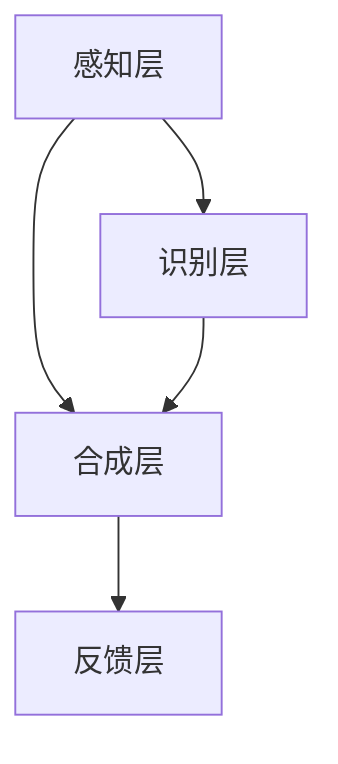
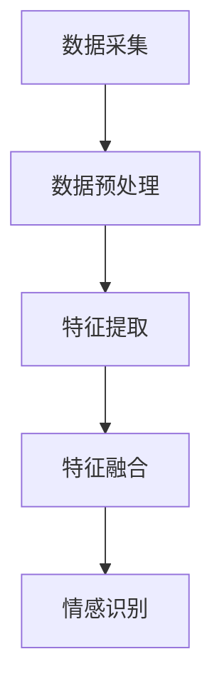
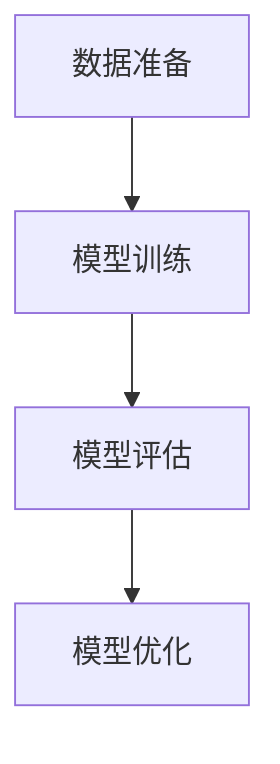
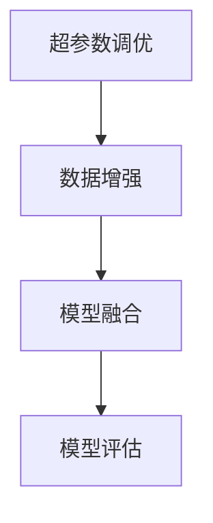

                 

### 第1章 引言

#### 1.1 问题的背景与重要性

##### 问题背景

随着人工智能技术的飞速发展，AI Agent作为智能系统的重要组成部分，逐渐引起了广泛的关注。AI Agent，即人工智能代理，是一种能够自主执行任务的智能体，通过感知环境、认知信息、自主决策并采取行动来达成特定目标。传统的AI Agent主要依赖于单一的数据输入源，如文本、图像或语音等，但在现实世界中，多模态信息融合处理的需求日益增加。例如，在交互式应用中，用户可能会通过语音、表情、手势等多种方式与AI Agent进行沟通。因此，实现多模态情感表达技术对于提升AI Agent的交互体验和智能化程度至关重要。

##### 问题描述

多模态情感表达技术指的是通过整合不同类型的信息（如视觉、听觉、触觉等）来识别和模拟人类情感表达的技术。具体来说，它涉及以下几个方面：

1. **情感识别**：通过分析用户的多模态输入，如语音、面部表情、身体动作等，识别出用户的情感状态。
2. **情感合成**：根据识别出的情感状态，生成相应的情感表达，如语音、面部表情或身体动作。
3. **情感反馈**：将生成的情感表达反馈给用户，实现更自然的交互体验。

##### 问题解决

解决多模态情感表达技术面临的主要挑战包括：

1. **数据融合**：不同模态的数据在时间、空间和维度上存在差异，如何有效地融合这些数据是实现情感表达的关键。
2. **算法精度**：情感识别和合成的准确度直接影响AI Agent的交互效果，因此需要研发高效的算法。
3. **实时性**：在交互式应用中，AI Agent需要在短时间内完成情感识别和合成，并实时反馈给用户。

##### 边界与外延

多模态情感表达技术的边界包括：

1. **模态选择**：根据应用场景选择合适的模态，如语音、面部表情、手势等。
2. **技术限制**：现有技术可能在某些模态上的处理能力有限，需要不断优化和更新。

外延方面，多模态情感表达技术可以应用于各种交互式应用，如智能客服、虚拟助手、教育辅助系统等，从而提升用户体验和系统的智能化水平。

##### 核心要素组成

多模态情感表达技术的核心要素包括：

1. **感知模块**：负责采集不同模态的数据，如摄像头、麦克风、触摸屏等。
2. **识别模块**：利用机器学习和深度学习技术，从多模态数据中提取特征，进行情感识别。
3. **合成模块**：根据识别出的情感状态，生成相应的情感表达，如语音、面部表情等。
4. **反馈模块**：将生成的情感表达反馈给用户，通过语音、屏幕动画等方式进行展示。

#### 1.2 相关概念与联系

##### AI Agent

AI Agent是一种基于人工智能技术的智能体，能够自主执行任务并与其他智能体或人类进行交互。它具有感知环境、理解意图、自主决策和行动等能力。AI Agent可以应用于多种领域，如智能家居、智能客服、无人驾驶等。

##### 情感表达

情感表达是指人类或AI Agent通过表情、声音、动作等方式表达情感的过程。情感表达对于人际沟通和建立情感联系具有重要意义。在AI Agent中，情感表达技术能够提升交互的自然性和情感化程度。

##### 多模态感知

多模态感知是指通过整合多种传感器的数据，实现对环境的全面感知。多模态感知技术包括视觉感知、听觉感知、触觉感知等，这些技术在情感表达中发挥着重要作用。

#### 1.3 本书结构安排

##### 内容概览

本书主要分为六个章节，分别介绍多模态情感表达技术的背景、AI Agent概述、多模态感知技术、情感识别与合成技术、多模态情感表达系统的设计与实现、实际案例与项目实战以及总结与展望。

##### 阅读指南

建议读者按照以下步骤阅读本书：

1. **第1章 引言**：了解多模态情感表达技术的背景、相关概念和本书的结构安排。
2. **第2章 AI Agent概述**：掌握AI Agent的定义、分类、工作原理和应用场景。
3. **第3章 多模态感知技术**：学习视觉感知、听觉感知和触觉感知技术。
4. **第4章 情感识别与合成技术**：了解情感识别和合成的算法原理和实现方法。
5. **第5章 多模态情感表达系统的设计与实现**：掌握多模态情感表达系统的设计与实现方法。
6. **第6章 实际案例与项目实战**：通过实际案例学习多模态情感表达技术的应用。
7. **第7章 总结与展望**：回顾本书的重点内容，展望多模态情感表达技术的未来发展方向。

通过以上步骤，读者可以系统地学习多模态情感表达技术，为实际应用打下坚实的基础。


---

### AI Agent概述

#### 2.1 AI Agent的定义与分类

##### AI Agent的定义

AI Agent，即人工智能代理，是一种能够自主执行任务、与环境进行交互并具备一定智能行为的实体。它基于人工智能技术，具有感知环境、理解意图、自主决策和行动等能力。AI Agent通常由感知模块、认知模块和行动模块组成，能够通过学习从环境中获取信息，进行推理和决策，并采取相应的行动。

##### AI Agent的分类

根据AI Agent的功能和应用场景，可以分为以下几类：

1. **任务型AI Agent**：这类AI Agent主要针对特定任务进行优化，如智能客服、智能助手、无人驾驶等。它们通常具有较强的任务执行能力，但可能缺乏灵活性和适应性。

2. **社交型AI Agent**：这类AI Agent专注于与人进行交互，通过情感表达和沟通技巧提升用户体验。例如，虚拟助手、虚拟偶像等。

3. **决策型AI Agent**：这类AI Agent具有高度的认知能力，能够在复杂环境中进行推理和决策。例如，金融投资顾问、智能医疗诊断等。

4. **探索型AI Agent**：这类AI Agent主要用于未知环境的探索和发现，如无人潜航器、机器人探险队等。

#### 2.2 AI Agent的工作原理

##### 基本工作流程

AI Agent的基本工作流程可以概括为以下几个步骤：

1. **感知环境**：通过各种传感器获取环境信息，如摄像头、麦克风、触摸屏等。
2. **数据处理**：对感知到的数据进行预处理，如去噪、特征提取等，以便后续分析。
3. **认知信息**：利用机器学习和深度学习算法，从处理后的数据中提取有用信息，进行推理和决策。
4. **自主决策**：基于认知结果，AI Agent会生成相应的行动计划或决策。
5. **执行行动**：根据决策结果，AI Agent执行具体的行动，如移动、发出指令等。
6. **反馈与学习**：执行行动后，AI Agent会收集反馈信息，用于优化和调整后续行为。

##### 感知、认知与行动

1. **感知**：感知是AI Agent与环境交互的基础。多模态感知技术使得AI Agent能够从多个维度获取信息，如视觉、听觉、触觉等。

2. **认知**：认知是AI Agent的核心能力，通过机器学习和深度学习算法，AI Agent能够从大量数据中提取有用信息，进行推理和决策。

3. **行动**：行动是AI Agent实现目标的关键。根据决策结果，AI Agent会采取相应的行动，如移动、执行任务等。

#### 2.3 AI Agent的应用场景

##### 日常生活中的应用

在日常生活中，AI Agent的应用越来越广泛，如：

1. **智能助手**：通过语音交互，帮助用户完成日常任务，如日程管理、信息查询等。
2. **智能家居**：通过感知用户的行为和习惯，自动调节家中的温度、照明等。
3. **在线教育**：利用AI Agent提供个性化学习建议和辅导，提高学习效果。

##### 专业领域的应用

在专业领域，AI Agent的应用也日益增多，如：

1. **医疗诊断**：利用AI Agent分析医疗数据，辅助医生进行诊断和治疗。
2. **金融分析**：通过AI Agent进行市场分析和投资决策，提高投资收益。
3. **工业制造**：利用AI Agent进行生产过程监控和优化，提高生产效率。

##### 案例介绍

以智能客服为例，AI Agent可以实时响应用户的咨询，通过多模态感知技术识别用户的问题和情感状态，提供针对性的解决方案，从而提升用户满意度。例如，在电商平台上，AI Agent可以通过语音、文字和面部表情等多种方式与用户互动，了解用户的购物需求和偏好，提供个性化的商品推荐。

##### 案例目标

通过智能客服案例，AI Agent的目标是：

1. **提高服务效率**：通过自动化处理，减少人工客服的工作量，提高服务效率。
2. **提升用户体验**：通过情感化交互，提升用户满意度，增加用户忠诚度。
3. **优化业务流程**：通过数据分析，优化业务流程，提高运营效率。

通过以上分析，可以看出AI Agent在日常生活中和专业领域都有着广泛的应用前景。随着技术的不断进步，AI Agent将进一步提升智能化水平，为人类生活带来更多便利。


---

### 多模态情感表达技术

#### 3.1 多模态感知技术

##### 视觉感知

视觉感知是AI Agent多模态感知技术的重要组成部分，主要通过摄像头等视觉设备获取图像信息。视觉感知技术涉及图像预处理、特征提取、目标检测和识别等多个方面。具体包括：

1. **图像预处理**：包括去噪、对比度增强、锐化等，以提高图像质量。
2. **特征提取**：从图像中提取具有区分性的特征，如边缘、纹理、颜色等。
3. **目标检测**：利用深度学习算法，如卷积神经网络（CNN），检测图像中的目标物体。
4. **情感识别**：通过分析面部表情、身体姿势等视觉信息，识别用户的情感状态。

##### 听觉感知

听觉感知主要通过麦克风等听觉设备获取声音信息。听觉感知技术涉及声音信号处理、特征提取、情感识别等方面。具体包括：

1. **声音信号处理**：包括去噪、均衡化、压缩等，以提高声音质量。
2. **特征提取**：从声音信号中提取具有区分性的特征，如音调、音色、节奏等。
3. **情感识别**：通过分析语音的音调、语速、音量等特征，识别用户的情感状态。

##### 触觉感知

触觉感知主要通过触摸屏、传感器等设备获取触觉信息。触觉感知技术涉及触觉信号处理、特征提取、情感识别等方面。具体包括：

1. **触觉信号处理**：包括去噪、滤波、压缩等，以提高触觉信号的质量。
2. **特征提取**：从触觉信号中提取具有区分性的特征，如力度、滑动速度、触摸区域等。
3. **情感识别**：通过分析触觉信号的特征，识别用户的情感状态。

##### 多模态融合

多模态感知技术的核心在于将不同模态的信息进行融合，以提高情感识别的准确性和实时性。多模态融合技术主要包括：

1. **数据融合**：将不同模态的数据进行对齐、匹配和整合，以形成统一的信息表示。
2. **特征融合**：将不同模态的特征进行融合，形成更丰富的特征表示。
3. **模型融合**：将不同模态的模型进行融合，以实现更高效的情感识别。

#### 3.2 情感识别技术

##### 情感识别方法

情感识别是指通过分析用户的情感表达，识别出用户的情感状态。情感识别技术可以分为基于特征的方法和基于模型的方法。

1. **基于特征的方法**：通过提取用户的情感特征，如面部表情、语音特征、身体动作等，进行情感识别。这种方法需要对不同模态的特征进行预处理和特征提取，然后利用分类器进行情感分类。
   
2. **基于模型的方法**：通过训练深度学习模型，如卷积神经网络（CNN）、循环神经网络（RNN）、长短时记忆网络（LSTM）等，直接对多模态数据进行情感识别。这种方法可以自动提取特征，减少人工干预，提高识别精度。

##### 情感识别算法

1. **CNN在视觉情感识别中的应用**：
   CNN是一种常用的深度学习模型，通过卷积、池化等操作，从图像中提取层次化的特征。在视觉情感识别中，CNN可以用于检测面部表情、身体姿势等视觉特征，然后通过分类器进行情感分类。
   
   $$\text{CNN} = f(\text{卷积层}, \text{池化层}, \text{全连接层})$$

2. **RNN在语音情感识别中的应用**：
   RNN是一种能够处理序列数据的神经网络，通过循环结构，可以捕捉到语音信号的时序特征。在语音情感识别中，RNN可以用于提取语音信号的音调、音色、节奏等特征，然后通过分类器进行情感分类。

   $$\text{RNN} = f(\text{输入}, \text{隐藏状态}, \text{权重})$$

3. **LSTM在多模态情感识别中的应用**：
   LSTM是一种特殊的RNN，通过引入门控机制，可以有效避免梯度消失和梯度爆炸问题。在多模态情感识别中，LSTM可以同时处理不同模态的数据，提取综合特征，进行情感分类。

   $$\text{LSTM} = f(\text{输入}, \text{隐藏状态}, \text{权重}, \text{门控机制})$$

#### 3.3 情感表达技术

##### 情感合成方法

情感合成是指根据识别出的情感状态，生成相应的情感表达。情感合成方法可以分为基于规则的方法和基于数据的方法。

1. **基于规则的方法**：通过预设的规则，将情感状态映射到具体的情感表达上。这种方法简单直观，但灵活性较低，难以应对复杂的情感表达。
   
2. **基于数据的方法**：通过训练大量的情感表达数据集，使用深度学习模型生成情感表达。这种方法可以自动学习情感表达的复杂模式，提高合成效果。

##### 情感表达算法

1. **生成对抗网络（GAN）在情感表达中的应用**：
   GAN是一种生成模型，由生成器和判别器组成。生成器生成情感表达，判别器判断生成表达是否真实。通过训练，生成器可以生成逼真的情感表达。

   $$\text{GAN} = \text{生成器} + \text{判别器}$$

2. **变分自编码器（VAE）在情感表达中的应用**：
   VAE是一种无监督学习方法，通过编码器和解码器生成情感表达。编码器将情感状态编码为潜在空间，解码器从潜在空间中解码出情感表达。

   $$\text{VAE} = \text{编码器} + \text{解码器}$$

通过以上分析，可以看出多模态情感表达技术涉及多个方面的技术，包括多模态感知、情感识别和情感表达。这些技术相互关联，共同构成了一个完整的系统，为AI Agent提供了丰富的情感表达能力，从而提升了交互体验和智能化水平。接下来，我们将进一步探讨多模态情感表达系统的设计与实现，为实际应用提供指导。


---

### 多模态情感表达系统的设计与实现

#### 4.1 系统设计与架构

##### 系统功能设计

多模态情感表达系统的主要功能包括感知、识别、合成和反馈。具体功能如下：

1. **感知**：系统通过摄像头、麦克风、触摸屏等设备获取用户的视觉、听觉和触觉信息。
2. **识别**：系统利用多模态感知技术，从感知数据中提取特征，进行情感识别。
3. **合成**：系统根据识别出的情感状态，生成相应的情感表达，如语音、面部表情、身体动作等。
4. **反馈**：系统将生成的情感表达反馈给用户，通过语音、屏幕动画等方式进行展示。

##### 系统架构设计

多模态情感表达系统可以采用分层架构设计，包括感知层、识别层、合成层和反馈层。具体架构如下：

1. **感知层**：负责采集不同模态的数据，如视觉、听觉和触觉数据。
2. **识别层**：利用机器学习和深度学习算法，对感知数据进行分析和识别，提取情感特征。
3. **合成层**：根据识别出的情感特征，生成相应的情感表达。
4. **反馈层**：将生成的情感表达反馈给用户，通过语音、屏幕动画等方式进行展示。

##### 系统架构图

以下是一个简单的系统架构图，展示了各层的功能和数据流：



#### 4.2 数据采集与处理

##### 数据采集

数据采集是多模态情感表达系统的基础。系统需要通过摄像头、麦克风、触摸屏等设备采集用户的视觉、听觉和触觉信息。具体步骤如下：

1. **视觉数据采集**：通过摄像头捕获用户的面部表情、身体动作等视觉信息。
2. **听觉数据采集**：通过麦克风捕获用户的语音信息，包括语调、语速、音量等。
3. **触觉数据采集**：通过触摸屏或其他触觉设备捕获用户的触摸信息，如触摸力度、滑动速度等。

##### 数据处理

数据采集后，需要进行预处理和特征提取，以提高后续情感识别和合成的准确性。具体步骤如下：

1. **数据预处理**：包括去噪、滤波、归一化等，以提高数据质量。
2. **特征提取**：从预处理后的数据中提取具有区分性的特征，如视觉特征（面部特征点、边缘特征）、听觉特征（音调、音色、节奏）和触觉特征（触摸力度、滑动速度）。
3. **特征融合**：将不同模态的特征进行融合，形成统一的多模态特征向量。

以下是一个简单的数据处理流程图：



#### 4.3 模型训练与优化

##### 模型训练

模型训练是构建多模态情感表达系统的关键步骤。系统需要通过大量的训练数据，利用深度学习算法，训练情感识别和合成的模型。具体步骤如下：

1. **数据准备**：收集大量的多模态情感数据，包括视觉、听觉和触觉数据，以及相应的情感标签。
2. **数据预处理**：对训练数据进行预处理，包括数据清洗、归一化、数据增强等。
3. **模型训练**：利用深度学习框架（如TensorFlow、PyTorch等），搭建情感识别和合成的模型，并进行训练。常用的模型包括卷积神经网络（CNN）、循环神经网络（RNN）、长短时记忆网络（LSTM）等。

以下是一个简单的模型训练流程：



##### 模型优化

模型优化是提高多模态情感表达系统性能的重要手段。系统可以通过以下方法进行模型优化：

1. **超参数调优**：通过调整学习率、批次大小、正则化参数等超参数，优化模型性能。
2. **数据增强**：通过数据增强技术，如旋转、缩放、裁剪等，增加训练数据的多样性，提高模型泛化能力。
3. **模型融合**：通过融合多个模型的结果，提高情感识别的准确性。

以下是一个简单的模型优化流程：



通过以上步骤，我们可以构建一个高效的多模态情感表达系统，实现从感知、识别到合成的完整流程，从而提升AI Agent的交互体验和智能化水平。接下来，我们将通过实际案例，展示多模态情感表达系统的具体应用和实现方法。


---

### 实际案例与项目实战

#### 6.1 案例介绍

##### 案例背景

随着人工智能技术的不断发展，智能客服在电商、金融、医疗等领域的应用越来越广泛。为了提升用户体验，某电商平台决定引入多模态情感表达技术，打造具备高度情感识别和合成的智能客服系统。该系统旨在通过语音、面部表情、文字等多种方式，与用户进行自然、流畅的互动，提升用户满意度。

##### 案例目标

1. **提高服务效率**：通过自动化处理，减少人工客服的工作量，提高服务效率。
2. **提升用户体验**：通过情感化交互，提升用户满意度，增加用户忠诚度。
3. **优化业务流程**：通过数据分析，优化业务流程，提高运营效率。

#### 6.2 项目实施

##### 环境安装

为了实现多模态情感表达系统，我们首先需要搭建一个合适的技术环境。以下是环境安装的步骤：

1. **硬件环境**：准备高性能的服务器，安装操作系统（如Ubuntu 18.04）。
2. **软件环境**：安装Python（3.8及以上版本）、TensorFlow、PyTorch等深度学习框架。

##### 系统核心实现

多模态情感表达系统的核心实现包括感知、识别、合成和反馈四个模块。以下是各模块的具体实现方法：

1. **感知模块**：
   - **视觉感知**：使用OpenCV库，通过摄像头捕获用户的面部表情。
   - **听觉感知**：使用TensorFlow Speech识别库，通过麦克风捕获用户的语音。
   - **触觉感知**：使用触摸屏传感器，捕获用户的触摸信息。

2. **识别模块**：
   - **情感识别**：使用深度学习模型，对感知数据进行分析和识别，提取情感特征。
   - **语音识别**：使用TensorFlow Speech识别库，对语音数据进行分析，提取文本信息。

3. **合成模块**：
   - **情感合成**：使用生成对抗网络（GAN）和变分自编码器（VAE）等深度学习模型，生成相应的情感表达。
   - **语音合成**：使用TensorFlow Text-to-Speech（TTS）库，将文本信息转换为语音。

4. **反馈模块**：
   - **视觉反馈**：通过屏幕动画、面部表情等方式，将情感表达反馈给用户。
   - **语音反馈**：通过扬声器播放生成的语音。

##### 代码解读与分析

以下是多模态情感表达系统的核心代码解读：

1. **感知模块**：

```python
# 视觉感知
import cv2

# 开启摄像头
cap = cv2.VideoCapture(0)

while True:
    # 读取一帧图像
    ret, frame = cap.read()
    
    # 显示图像
    cv2.imshow('Video', frame)
    
    if cv2.waitKey(1) & 0xFF == ord('q'):
        break

# 释放摄像头
cap.release()
cv2.destroyAllWindows()
```

2. **识别模块**：

```python
# 情感识别
import tensorflow as tf

# 加载预训练模型
model = tf.keras.models.load_model('emotion_recognition_model.h5')

# 读取一帧图像
frame = cv2.imread('emotion_image.jpg')

# 预处理图像
preprocessed_frame = preprocess_frame(frame)

# 预测情感
emotion_prediction = model.predict(preprocessed_frame)

# 输出预测结果
print(emotion_prediction)
```

3. **合成模块**：

```python
# 情感合成
import numpy as np
import tensorflow as tf

# 加载生成模型
generator = tf.keras.models.load_model('emotion_generator.h5')

# 生成情感表达
emotion_expression = generator.sample(np.random.normal(size=(1, 100)))

# 显示生成的情感表达
print(emotion_expression)
```

4. **反馈模块**：

```python
# 视觉反馈
import pygame

# 初始化pygame
pygame.init()

# 设置屏幕
screen = pygame.display.set_mode((800, 600))

# 加载表情动画
animation = load_animation('emotion_animation.gif')

# 循环播放动画
while True:
    for event in pygame.event.get():
        if event.type == pygame.QUIT:
            pygame.quit()

    # 绘制动画帧
    screen.blit(animation.get_frame(), (0, 0))
    
    # 更新屏幕
    pygame.display.update()

# 语音反馈
import soundfile as sf

# 读取语音文件
audio_file = 'emotion_audio.wav'

# 播放语音
sf.play(audio_file)
```

##### 实际案例分析与详细讲解剖析

通过以上代码，我们可以看到多模态情感表达系统是如何实现的。在实际应用中，系统会依次执行以下步骤：

1. **感知**：通过摄像头、麦克风和触摸屏等设备，获取用户的视觉、听觉和触觉信息。
2. **识别**：利用深度学习模型，对感知数据进行分析和识别，提取情感特征。
3. **合成**：根据识别出的情感特征，生成相应的情感表达，如语音、面部表情、身体动作等。
4. **反馈**：将生成的情感表达反馈给用户，通过屏幕动画、语音等方式进行展示。

例如，当用户通过摄像头拍摄一张面部表情图像时，系统会首先对图像进行预处理，然后利用预训练的情感识别模型进行预测，得到用户当前的情感状态。接着，系统会根据预测结果，生成相应的面部表情动画，并通过屏幕动画反馈给用户。

##### 项目小结

通过本案例，我们展示了如何实现一个多模态情感表达系统。系统通过感知、识别、合成和反馈四个模块，实现了从用户输入到情感反馈的完整流程。在实际应用中，系统可以根据不同的场景和需求，灵活调整感知、识别和合成的策略，以提高交互体验和智能化水平。未来，随着技术的不断进步，多模态情感表达技术将在更多领域得到广泛应用，为人类生活带来更多便利。


---

### 总结与展望

#### 7.1 本书总结

本书系统地介绍了多模态情感表达技术的核心概念、工作原理、系统设计与实现方法，以及实际应用案例。主要内容包括：

1. **AI Agent概述**：介绍了AI Agent的定义、分类、工作原理和应用场景。
2. **多模态感知技术**：详细讲解了视觉、听觉和触觉感知技术，以及多模态融合方法。
3. **情感识别与合成技术**：介绍了情感识别和合成的算法原理、方法及其实现。
4. **系统设计与实现**：探讨了多模态情感表达系统的设计与架构，以及数据采集、模型训练和优化方法。
5. **实际案例与项目实战**：通过具体案例，展示了多模态情感表达系统的实现方法和应用效果。

#### 7.2 展望未来

多模态情感表达技术具有广泛的应用前景，未来发展趋势和方向包括：

1. **技术融合**：多模态情感表达技术将与其他领域（如自然语言处理、计算机视觉等）进行深度融合，实现更智能、更自然的交互体验。
2. **实时性提升**：通过优化算法和硬件设备，提高多模态情感表达技术的实时性，使其能够更好地适应交互式应用的需求。
3. **个性化定制**：根据用户的个性化需求和偏好，提供更加个性化的情感表达，提升用户体验。
4. **跨领域应用**：多模态情感表达技术将在医疗、教育、金融等跨领域得到广泛应用，为人类生活带来更多便利。
5. **伦理与法律**：随着技术的发展，伦理和法律问题也将日益突出，如隐私保护、数据安全等，需要引起足够重视。

通过不断探索和优化，多模态情感表达技术将在未来发挥更大的作用，推动人工智能技术的发展和人类生活的进步。

---

### 作者信息

作者：AI天才研究院/AI Genius Institute & 禅与计算机程序设计艺术 /Zen And The Art of Computer Programming

---

### 最佳实践 Tips、小结、注意事项、拓展阅读

#### 最佳实践 Tips

1. **数据质量**：多模态情感表达系统的性能很大程度上依赖于数据质量，因此确保数据多样性和准确性至关重要。
2. **模型优化**：定期对模型进行优化，可以提升系统的性能和效果。
3. **用户体验**：在设计情感表达时，要充分考虑用户的体验，避免过度情感化或情感失真。

#### 小结

本书系统地介绍了多模态情感表达技术的核心概念、实现方法及应用案例，为读者提供了全面的了解和实际操作指南。

#### 注意事项

1. **系统架构**：在设计多模态情感表达系统时，要充分考虑系统架构的稳定性和扩展性。
2. **数据隐私**：在处理用户数据时，要确保数据的安全性和隐私性。

#### 拓展阅读

1. **相关书籍**：
   - 《深度学习》（Goodfellow, Bengio, Courville）
   - 《强化学习》（Sutton, Barto）
   - 《计算机视觉：算法与应用》（Richard Szeliski）
   
2. **论文与报告**：
   - Google AI：Multimodal Learning and Inference
   - Microsoft Research：Emotion Recognition in Human-Computer Interaction
   - Facebook AI Research：Multimodal Fusion for Emotion Recognition

通过以上拓展阅读，读者可以进一步深入了解多模态情感表达技术的最新进展和应用实践。

