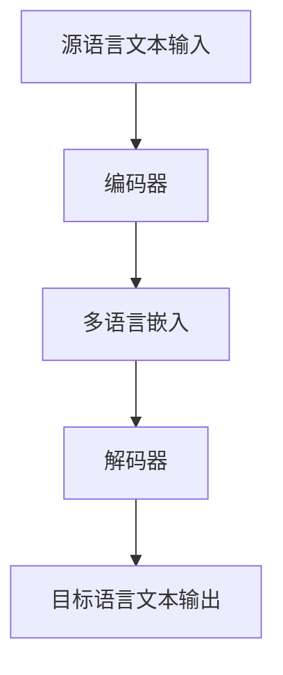
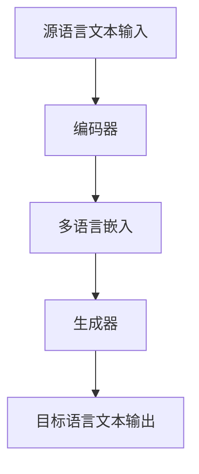

                 

## 《AI Agent的多语言支持：跨语言理解与生成》

> 关键词：AI Agent、多语言支持、跨语言理解、跨语言生成、语言模型、算法原理、系统架构

> 摘要：本文深入探讨了AI Agent的多语言支持技术，特别是跨语言理解与生成的关键算法原理和系统架构设计。通过系统化分析，本文旨在为读者提供一个全面、详尽的指南，帮助理解如何实现高效的多语言AI交互，以及其在实际应用中的挑战与解决方案。

## 《AI Agent的多语言支持：跨语言理解与生成》目录大纲

### 第一部分：背景介绍与核心概念

#### 第1章 问题背景与核心概念

1.1 问题背景

- 人工智能的发展趋势
- 多语言支持在AI领域的需求
- 跨语言理解与生成的重要性

1.2 核心概念

- AI Agent的定义与功能
- 多语言支持与跨语言理解
- 跨语言生成与翻译

1.3 概念结构与核心要素

- 语言模型与多语言模型
- 跨语言信息检索
- 跨语言语义理解

1.4 边界与外延

- 多语言支持的范围
- 跨语言理解与生成的限制

1.5 本章小结

- 总结核心概念
- 提出后续章节内容预告

### 第二部分：核心概念与联系

#### 第2章 语言模型与多语言模型

2.1 语言模型原理

- 语言模型的定义
- 语言模型的特点
- 语言模型的分类

2.2 多语言模型简介

- 多语言模型的概念
- 多语言模型的分类
- 多语言模型的挑战

2.3 概念属性特征对比

- 语言模型与多语言模型的对比
- 模型性能指标对比

2.4 ER实体关系图

- 多语言模型的实体关系
- 跨语言理解的实体关系

2.5 本章小结

- 总结核心概念与联系
- 为后续算法讲解做准备

### 第三部分：算法原理讲解

#### 第3章 跨语言理解算法原理

3.1 跨语言理解概述

- 跨语言理解的定义
- 跨语言理解的目标

3.2 算法原理讲解

3.2.1 Mermaid流程图



3.2.2 Python源代码与数学模型

```python
def cross_language_understanding(source_text, target_language):
    encoded_text = encoder(source_text)
    multi_language_embedding = multilingual_model(encoded_text)
    decoded_text = decoder(multi_language_embedding, target_language)
    return decoded_text
```

$$\text{数学模型：} Y = f(X; \theta)$$
- \( X \)：输入文本
- \( Y \)：输出文本
- \( f \)：模型函数
- \( \theta \)：模型参数

3.3 详细讲解与举例说明

3.3.1 具体案例

3.3.2 数学公式解析

3.3.3 通俗易懂的例子

3.4 本章小结

- 算法的原理与应用
- 为后续生成算法讲解做准备

#### 第4章 跨语言生成算法原理

4.1 跨语言生成概述

- 跨语言生成的定义
- 跨语言生成的目标

4.2 算法原理讲解

4.2.1 Mermaid流程图



4.3 详细讲解与举例说明

4.3.1 Python源代码示例

4.3.2 数学模型与公式

4.3.3 实例演示

4.4 本章小结

- 算法的原理与应用
- 为后续应用与实战讲解做准备

### 第四部分：系统分析与架构设计

#### 第5章 系统功能设计与架构

5.1 问题场景介绍

- AI Agent多语言支持的应用场景

5.2 系统功能设计

- 领域模型Mermaid类图

5.3 系统架构设计

- Mermaid架构图

5.4 系统接口设计

- 系统接口定义与实现

5.5 系统交互Mermaid序列图

- 系统模块交互流程

### 第五部分：项目实战与案例分析

#### 第6章 环境安装与配置

6.1 开发环境搭建

6.2 系统依赖安装

6.3 环境配置与调试

#### 第7章 系统核心实现

7.1 跨语言理解核心代码实现

7.2 跨语言生成核心代码实现

7.3 系统模块集成与测试

#### 第8章 实际案例分析

8.1 应用场景描述

8.2 系统运行结果分析

8.3 问题与改进建议

#### 第9章 项目小结

9.1 项目总结

9.2 最佳实践与经验分享

### 第六部分：总结与展望

#### 第10章 总结与展望

10.1 全文总结

10.2 未来研究方向

10.3 对AI Agent多语言支持的展望

---

**作者：** AI天才研究院/AI Genius Institute & 禅与计算机程序设计艺术 /Zen And The Art of Computer Programming

---

**完整性要求：** 本文将详细解析每个章节的核心内容，确保每个小节都提供丰富的具体讲解和详细实例，从而形成一个完整的知识体系。以下是逐步详细讲解的过程。

---

### 第1章 问题背景与核心概念

#### 1.1 问题背景

人工智能（AI）的发展已经进入了一个新的阶段，特别是在自然语言处理（NLP）领域，AI Agent的应用变得越来越广泛。AI Agent是一种能够与人类进行自然语言交互的智能系统，它们在客服、智能助手、信息检索等领域发挥着重要作用。然而，随着全球化的深入，不同语言的用户越来越多地需要使用AI Agent的服务，这促使我们面临一个关键问题：如何实现AI Agent的多语言支持？

**人工智能的发展趋势**

随着计算能力的提升和数据量的爆炸性增长，人工智能技术取得了显著的进展。深度学习、神经网络和大数据分析等技术已经成为AI领域的核心。在这些技术的推动下，AI Agent的能力也得到了大幅提升，能够处理更复杂的问题和实现更精细的任务。

**多语言支持在AI领域的需求**

全球化的商业环境需要AI系统能够跨语言提供服务，以便更好地满足不同地区的用户需求。例如，跨国企业需要他们的客服系统能够支持多种语言，以便在全球范围内提供一致的服务体验。此外，多语言支持还能够提升AI Agent的用户体验，使其更加自然和人性化的与用户进行交互。

**跨语言理解与生成的重要性**

跨语言理解与生成是AI Agent多语言支持的核心技术。跨语言理解指的是系统能够理解并处理不同语言的输入，而跨语言生成则是系统能够将一种语言的输入转换成另一种语言的输出。这两者共同作用，使得AI Agent能够有效地与多语言用户进行交互。

#### 1.2 核心概念

**AI Agent的定义与功能**

AI Agent是指一种智能的计算机程序，它可以模拟人类的智能行为，具备感知、学习、推理和决策能力。AI Agent的核心功能是能够与人类进行自然语言交互，完成特定的任务或提供有用的信息。

**多语言支持与跨语言理解**

多语言支持是指AI系统能够处理和理解多种语言的输入。跨语言理解则是指系统能够将一种语言的输入转换为另一种语言的内部表示，以便进行后续的处理和生成。

**跨语言生成与翻译**

跨语言生成是指AI系统能够将一种语言的文本转换为另一种语言的文本。在翻译领域，这通常被称为机器翻译。跨语言生成不仅仅是简单的单词替换，还需要考虑语法、语义和语境等因素。

#### 1.3 概念结构与核心要素

**语言模型与多语言模型**

语言模型是NLP领域的一个基本概念，它是一个概率模型，用于预测下一个单词或字符。多语言模型是在多个语言之间共享信息，从而提升模型在每种语言上的性能。

**跨语言信息检索**

跨语言信息检索是指在不同语言的文档中查找和检索信息。这需要系统能够理解不同语言之间的对应关系，从而实现跨语言的信息匹配和检索。

**跨语言语义理解**

跨语言语义理解是指系统能够理解不同语言之间的语义对应关系，从而在不同语言之间进行有效的语义转换和交互。

#### 1.4 边界与外延

**多语言支持的范围**

多语言支持不仅包括语言的理解和生成，还包括语言的识别、语音合成、语音识别等多种技术。因此，多语言支持的实现涉及多个层面的技术和算法。

**跨语言理解与生成的限制**

跨语言理解与生成虽然带来了巨大的便利，但也面临一些挑战。首先，不同语言之间的语法和语义差异很大，这给跨语言处理带来了困难。其次，不同语言的语料库和资源差异也很大，这影响了模型的训练和性能。

#### 1.5 本章小结

在本章中，我们介绍了AI Agent多语言支持的问题背景、核心概念和结构要素。通过这一章的讲解，读者可以初步了解AI Agent多语言支持的重要性和实现原理。在接下来的章节中，我们将深入探讨相关的算法原理和系统架构设计，帮助读者全面理解这一领域的最新进展和技术实现。

### 第2章 语言模型与多语言模型

#### 2.1 语言模型原理

语言模型是自然语言处理（NLP）领域的一个核心概念，它是用于预测下一个单词或字符的概率模型。语言模型可以基于不同的方法构建，如N-gram模型、神经网络模型和深度学习模型等。

**语言模型的定义**

语言模型是一种统计模型，它通过分析大量的文本数据来学习语言规律和概率分布。在NLP任务中，语言模型用于预测下一个单词或字符，从而生成文本。

**语言模型的特点**

- **概率性**：语言模型基于概率理论，能够预测下一个单词或字符的概率分布。
- **统计性**：语言模型通过对大量文本数据的统计分析来学习语言规律。
- **适应性**：语言模型可以根据不同的任务和场景进行调整和优化。

**语言模型的分类**

- **N-gram模型**：N-gram模型是最简单的语言模型，它将文本分割成连续的N个单词或字符序列，并计算每个序列的概率。
- **神经网络模型**：神经网络模型通过多层神经网络来学习文本数据中的复杂结构和规律。
- **深度学习模型**：深度学习模型是神经网络的一种，它通过多层非线性变换来提取文本数据中的特征。

#### 2.2 多语言模型简介

多语言模型是语言模型的一种扩展，它旨在在一个模型中同时处理多种语言的文本数据。多语言模型的出现主要是为了解决不同语言之间的差异性和资源不平衡问题。

**多语言模型的概念**

多语言模型是一个可以在多种语言之间共享信息和资源的模型。它通过学习一种语言的文本数据，同时提高模型在其它语言上的性能。

**多语言模型的分类**

- **基于共享表示的多语言模型**：这种模型通过共享词向量或隐藏层来学习不同语言的共同特征。
- **基于翻译模型的多语言模型**：这种模型利用翻译模型将一种语言的输入翻译成其它语言，然后进行后续处理。
- **基于混合模型的多语言模型**：这种模型结合了共享表示和翻译模型的优势，通过多种方式来处理不同语言的输入。

**多语言模型的挑战**

- **语言差异**：不同语言在语法、语义和词汇上有很大的差异，这给多语言模型的学习和预测带来了挑战。
- **资源不平衡**：某些语言有丰富的语料库和资源，而另一些语言则相对匮乏，这会影响模型的学习效果和性能。

#### 2.3 概念属性特征对比

在了解了语言模型和

