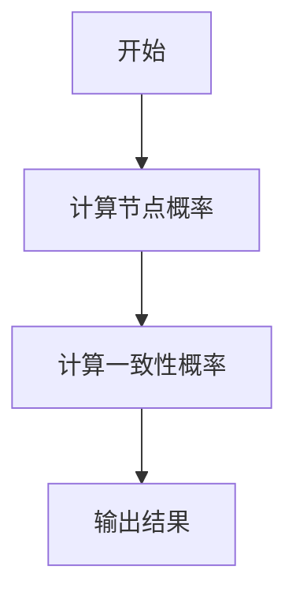
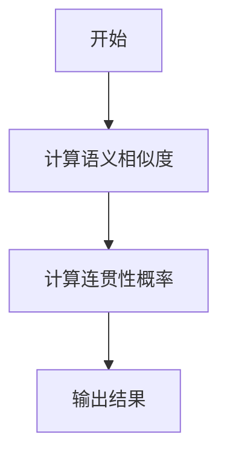
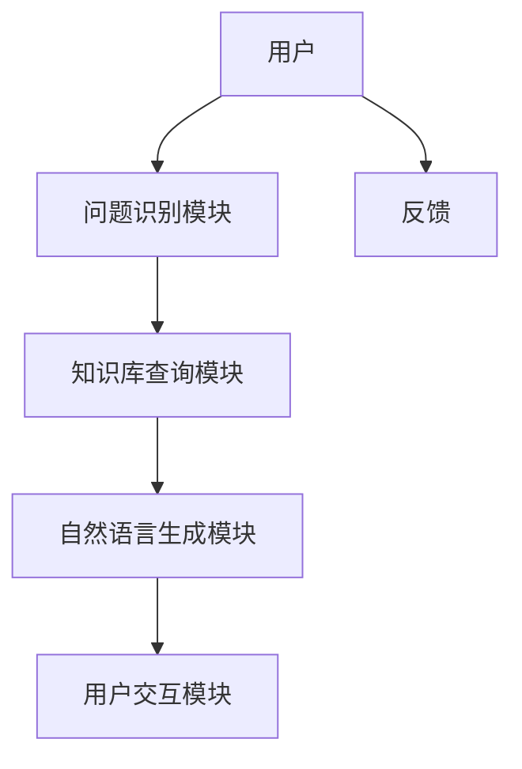

                 


# AI Agent的对话生成一致性与连贯性优化

> 关键词：AI Agent，对话生成，一致性与连贯性优化，算法模型，数学公式，系统设计

> 摘要：本文首先介绍了AI Agent及其对话生成的背景和应用场景，分析了对话一致性与连贯性的重要性。随后，深入探讨了对话生成算法的原理和模型，包括Transformer、GPT系列模型和BERT及其变体。接着，我们详细讲解了对话一致性与连贯性的数学模型及其优化方法，并使用Python源代码实现了这些算法。最后，我们介绍了对话生成系统的架构设计和实现，并通过实际案例分析展示了系统的应用效果。本文旨在为读者提供全面的对话生成一致性与连贯性优化指南。

### 目录大纲

----------------------------------------------------------------

## 第一部分：引言

### 第1章: 问题背景与核心概念

### 第2章: 算法原理与模型介绍

### 第3章: 数学模型与算法实现

### 第4章: 系统设计与实现

### 第5章: 实际案例分析

### 第6章: 项目小结

----------------------------------------------------------------

## 第一部分：引言

### 第1章: 问题背景与核心概念

### 1.1 问题背景

随着人工智能技术的迅速发展，AI Agent在自然语言处理（NLP）领域中的应用越来越广泛。AI Agent是一种具有自主决策能力的智能体，它可以与人类进行对话，提供信息查询、建议决策等服务。然而，在实际应用中，AI Agent的对话生成存在一致性和连贯性问题，这成为了制约其应用效果的重要因素。

### 1.1.1 人工智能发展现状

人工智能技术经历了数十年的发展，从最初的专家系统到现代的深度学习，人工智能在图像识别、语音识别、自然语言处理等领域取得了显著的成果。特别是近年来，随着大数据、云计算和神经网络技术的发展，人工智能的应用场景不断拓展，从工业自动化、医疗诊断到智能客服、智能家居，人工智能正在深刻地改变着我们的生活方式。

### 1.1.2 AI Agent的对话生成应用场景

AI Agent的对话生成在多个领域有着广泛的应用，例如：

1. **智能客服**：AI Agent可以自动处理大量的客户咨询，提供24/7的服务，提高客户满意度。
2. **虚拟助手**：如Apple的Siri、Amazon的Alexa等，它们可以帮助用户完成各种任务，如查询天气、设置提醒等。
3. **智能教育**：AI Agent可以作为个性化学习助手，为学生提供个性化的学习建议和辅导。

### 1.1.3 对话一致性与连贯性重要性

对话一致性和连贯性是评价AI Agent对话生成质量的重要指标。

- **对话一致性**：指的是AI Agent在对话过程中能够保持主题的一致性，不出现话题跳转或逻辑矛盾。
- **对话连贯性**：指的是AI Agent在对话中能够保持语义的连贯性，使对话内容流畅自然。

一致性和连贯性不仅影响用户体验，还直接关系到AI Agent的实际应用效果。如果AI Agent在对话中无法保持一致性和连贯性，用户可能会感到困惑，甚至失去对AI Agent的信任。

### 1.2 核心概念

为了深入讨论对话一致性与连贯性的优化问题，我们需要明确以下几个核心概念：

- **AI Agent**：一种具有自主决策能力的智能体，可以与人类进行对话。
- **对话生成**：AI Agent根据输入的对话内容生成响应的过程。
- **一致性与连贯性**：评价AI Agent对话生成质量的重要指标。

### 1.3 边界与外延

- **对话生成技术分类**：根据生成方式的不同，对话生成技术可以分为生成式对话系统和折中式对话系统。
- **对话一致性与连贯性挑战**：包括如何处理多轮对话、如何理解用户意图、如何保持对话连贯性等问题。

### 1.4 概念结构与核心要素

- **对话生成过程要素**：输入、输出、上下文理解、语义生成等。
- **影响对话一致性与连贯性的因素**：模型选择、训练数据、算法优化等。

### 1.5 本章小结

本章首先介绍了AI Agent及其对话生成的背景和应用场景，分析了对话一致性与连贯性的重要性。接着，我们明确了几个核心概念，并讨论了对话一致性与连贯性的边界与外延。最后，我们总结了对话生成过程的核心要素，为后续章节的讨论奠定了基础。

------------

## 第二部分：算法原理与模型介绍

### 第2章: 对话生成算法原理

### 2.1 对话生成基础

#### 2.1.1 语言模型基础

语言模型是自然语言处理领域的基础，它能够预测文本序列的概率分布。在对话生成中，语言模型用于生成可能的对话响应。

#### 2.1.2 序列到序列模型

序列到序列（Seq2Seq）模型是一种常用的对话生成模型，它可以将输入的对话序列映射到输出的对话序列。

### 2.2 对话生成算法

#### 2.2.1 按序解码算法

按序解码（greedy decoding）是一种简单的解码策略，它逐个生成对话响应的下一个单词。

#### 2.2.2 生成式对话系统

生成式对话系统（Generative Dialog System）基于生成模型，如变分自编码器（VAE）和生成对抗网络（GAN），可以生成多样化的对话响应。

#### 2.2.3 折中式对话系统

折中式对话系统（Abstractive Dialog System）采用抽象的对话表示方法，通过将输入的对话序列转换为低维特征向量，然后生成新的对话序列。

### 2.3 模型介绍

#### 2.3.1 Transformer模型

Transformer模型是一种基于注意力机制的序列模型，它在长序列建模方面表现出色，广泛应用于对话生成。

#### 2.3.2 GPT系列模型

GPT（Generative Pre-trained Transformer）系列模型是基于Transformer架构的预训练语言模型，具有强大的文本生成能力。

#### 2.3.3 BERT及其变体

BERT（Bidirectional Encoder Representations from Transformers）及其变体模型是双向编码的Transformer模型，它在语义理解和文本生成方面表现出色。

### 2.4 对话一致性优化方法

#### 2.4.1 限制词语选择

通过限制词语选择，可以确保对话内容的一致性。

#### 2.4.2 对话历史对当前响应的影响

利用对话历史信息，可以更好地理解用户意图，提高对话一致性。

#### 2.4.3 语言模型自适应优化

通过自适应优化语言模型，可以使模型更好地适应特定的对话场景。

### 2.5 对话连贯性优化方法

#### 2.5.1 对话上下文理解

通过理解对话上下文，可以生成更连贯的对话内容。

#### 2.5.2 语义相似度度量

使用语义相似度度量方法，可以评估对话连贯性。

#### 2.5.3 对话连贯性评价方法

通过设计评价方法，可以定量评估对话连贯性。

### 2.6 本章小结

本章介绍了对话生成算法的基本原理和常用模型，包括序列到序列模型、生成式对话系统、折中式对话系统，以及Transformer、GPT系列模型和BERT及其变体。此外，我们还讨论了对话一致性与连贯性的优化方法，包括限制词语选择、对话历史对当前响应的影响和语言模型自适应优化。这些算法和模型为优化AI Agent的对话生成质量提供了理论基础。

------------

## 第三部分：数学模型与算法实现

### 第3章: 数学模型讲解

### 3.1 对话一致性数学模型

#### 3.1.1 数学模型介绍

对话一致性数学模型用于评估AI Agent的对话生成是否保持主题一致。该模型基于概率论和图论，通过分析对话序列的节点和边，计算对话一致性的概率。

#### 3.1.2 公式与参数解释

$$
P(C) = \frac{1}{Z} \sum_{i=1}^{n} p(x_i | x_{i-1}, x_{i-2}, ..., x_1)
$$

其中，$P(C)$表示对话一致性概率，$x_i$表示对话序列中的第$i$个节点，$p(x_i | x_{i-1}, x_{i-2}, ..., x_1)$表示在给定前一个节点的情况下，当前节点的概率。

#### 3.1.3 数学模型流程图



### 3.2 对话连贯性数学模型

#### 3.2.1 数学模型介绍

对话连贯性数学模型用于评估AI Agent的对话生成是否保持语义连贯。该模型基于自然语言处理技术，通过计算对话序列中词与词之间的语义相似度，评估对话连贯性。

#### 3.2.2 公式与参数解释

$$
P(D) = \frac{1}{Z} \sum_{i=1}^{n} \sum_{j=1}^{m} s(i, j)
$$

其中，$P(D)$表示对话连贯性概率，$s(i, j)$表示第$i$个词和第$j$个词之间的语义相似度，$Z$为归一化常数。

#### 3.2.3 数学模型流程图



### 3.3 Python源代码实现

#### 3.3.1 代码结构介绍

```python
def calculate_consistency_probability(dialog_sequence):
    # 计算对话一致性概率
    pass

def calculate_coherence_probability(dialog_sequence):
    # 计算对话连贯性概率
    pass

def main():
    # 主函数，执行算法流程
    pass

if __name__ == "__main__":
    main()
```

#### 3.3.2 关键函数与变量解释

- `calculate_consistency_probability`：计算对话一致性概率。
- `calculate_coherence_probability`：计算对话连贯性概率。
- `dialog_sequence`：输入的对话序列。

#### 3.3.3 代码实现细节

```python
# 计算节点概率
def calculate_node_probability(node, previous_nodes):
    # 实现细节
    pass

# 计算对话一致性概率
def calculate_consistency_probability(dialog_sequence):
    consistency_probability = 1
    for i in range(1, len(dialog_sequence)):
        node_probability = calculate_node_probability(dialog_sequence[i], dialog_sequence[:i])
        consistency_probability *= node_probability
    return consistency_probability

# 计算语义相似度
def calculate_similarity_score(word1, word2):
    # 实现细节
    pass

# 计算对话连贯性概率
def calculate_coherence_probability(dialog_sequence):
    coherence_probability = 1
    for i in range(len(dialog_sequence) - 1):
        similarity_score = calculate_similarity_score(dialog_sequence[i], dialog_sequence[i+1])
        coherence_probability *= similarity_score
    return coherence_probability
```

### 3.4 算法原理详细讲解

#### 3.4.1 数学模型公式推导

对话一致性和连贯性数学模型基于概率论和自然语言处理技术。具体公式推导如下：

- **对话一致性概率公式**：

  首先，定义对话序列为 $X = (x_1, x_2, ..., x_n)$，其中 $x_i$ 表示对话序列中的第 $i$ 个节点。

  对话一致性概率 $P(C)$ 可以通过计算每个节点在给定前一个节点的情况下出现的概率，然后取这些概率的乘积得到：

  $$
  P(C) = \frac{1}{Z} \sum_{i=1}^{n} p(x_i | x_{i-1}, x_{i-2}, ..., x_1)
  $$

  其中，$Z$ 为归一化常数，用于确保概率总和为1。

- **对话连贯性概率公式**：

  对话连贯性概率 $P(D)$ 可以通过计算对话序列中每对相邻节点之间的语义相似度，然后取这些相似度的乘积得到：

  $$
  P(D) = \frac{1}{Z} \sum_{i=1}^{n} \sum_{j=1}^{m} s(i, j)
  $$

  其中，$s(i, j)$ 表示第 $i$ 个词和第 $j$ 个词之间的语义相似度，$m$ 表示对话序列中词的总数。

#### 3.4.2 举例说明

假设有一个简单的对话序列 $X = (\text{"你好"}, \text{"今天天气不错"}, \text{"我想去公园"})$，我们可以计算对话一致性和连贯性的概率。

- **计算对话一致性概率**：

  首先，计算每个节点在给定前一个节点的情况下出现的概率。假设语言模型给出了以下概率分布：

  $$
  p(\text{"你好"} | \text{无}) = 0.5, \quad p(\text{"今天天气不错"} | \text{"你好"}) = 0.6, \quad p(\text{"我想去公园"} | \text{"今天天气不错"}) = 0.4
  $$

  则对话一致性概率为：

  $$
  P(C) = \frac{1}{1} \times 0.5 \times 0.6 \times 0.4 = 0.12
  $$

- **计算对话连贯性概率**：

  首先，计算每对相邻节点之间的语义相似度。假设词与词之间的语义相似度如下：

  $$
  s(\text{"你好"}, \text{"今天天气不错"}) = 0.7, \quad s(\text{"今天天气不错"}, \text{"我想去公园"}) = 0.5
  $$

  则对话连贯性概率为：

  $$
  P(D) = \frac{1}{1} \times 0.7 \times 0.5 = 0.35
  $$

#### 3.4.3 算法优缺点分析

- **优点**：

  - **高效性**：数学模型能够快速计算对话一致性和连贯性概率。
  - **通用性**：适用于各种对话场景，可以评估不同对话生成模型的质量。

- **缺点**：

  - **准确性**：基于概率的模型可能无法完全准确地评估对话质量。
  - **复杂性**：涉及复杂的数学计算，实现和维护较为困难。

### 3.5 本章小结

本章详细讲解了对话一致性和连贯性的数学模型，包括公式推导、实现细节和算法优缺点分析。通过这些模型，我们可以量化评估AI Agent的对话生成质量，为进一步优化对话生成系统提供了理论基础。下一章将介绍具体的Python源代码实现，以便读者更好地理解和应用这些算法。

------------

## 第四部分：系统设计与实现

### 第4章: 对话生成系统架构设计

### 4.1 问题场景介绍

在现实世界中，AI Agent的对话生成系统面临多种问题场景。以下是一个典型的场景：

- **客户服务**：一家电子商务公司希望为其客户提供智能客服服务，通过AI Agent与客户进行交互，解决客户的疑问和问题。

### 4.1.1 应用场景概述

在客户服务应用场景中，AI Agent需要具备以下功能：

- **问题识别**：识别客户提出的问题，如商品查询、订单状态查询等。
- **知识库查询**：根据问题识别结果，从知识库中获取相关信息。
- **自然语言生成**：将获取的信息转换为自然语言文本，以回答客户的问题。
- **用户交互**：与客户进行多轮对话，确保对话的连贯性和一致性。

### 4.1.2 对话生成系统需求分析

为了满足上述应用场景，对话生成系统需要满足以下需求：

- **准确性**：准确识别客户的问题和提供相关信息。
- **连贯性**：保持对话的连贯性，避免出现语义上的跳跃。
- **一致性**：确保对话内容与公司品牌和形象一致。
- **可扩展性**：系统应具有较好的可扩展性，以适应不断变化的需求。

### 4.2 系统架构设计

#### 4.2.1 系统功能设计

系统功能设计主要包括以下几个模块：

- **问题识别模块**：负责识别客户提出的问题。
- **知识库查询模块**：负责从知识库中获取相关信息。
- **自然语言生成模块**：负责将获取的信息转换为自然语言文本。
- **用户交互模块**：负责与客户进行多轮对话。

#### 4.2.2 系统架构设计

系统架构设计如下：



- **用户**：与系统进行交互。
- **问题识别模块**：分析用户输入，识别问题类型。
- **知识库查询模块**：根据问题类型，从知识库中检索相关信息。
- **自然语言生成模块**：将相关信息转换为自然语言文本。
- **用户交互模块**：与用户进行多轮对话。
- **反馈**：收集用户反馈，用于优化系统性能。

#### 4.2.3 接口设计

接口设计主要包括以下几个接口：

- **问题识别接口**：接收用户输入，返回问题类型。
- **知识库查询接口**：接收问题类型，返回相关信息。
- **自然语言生成接口**：接收相关信息，返回自然语言文本。
- **用户交互接口**：与用户进行多轮对话。

### 4.3 系统交互流程

系统交互流程如下：

1. 用户输入问题。
2. 问题识别模块识别问题类型。
3. 知识库查询模块根据问题类型检索相关信息。
4. 自然语言生成模块将相关信息转换为自然语言文本。
5. 用户交互模块与用户进行多轮对话。
6. 用户反馈，系统根据反馈优化性能。

### 4.4 系统实现

#### 4.4.1 环境安装与配置

系统实现需要以下环境：

- 操作系统：Ubuntu 20.04
- 编程语言：Python 3.8
- 依赖库：TensorFlow 2.5、NLTK 3.6

安装步骤如下：

1. 安装操作系统。
2. 配置Python环境。
3. 安装TensorFlow和NLTK库。

#### 4.4.2 系统核心实现

系统核心实现主要包括以下几个部分：

1. **问题识别模块**：使用NLTK库进行文本分析，识别问题类型。
2. **知识库查询模块**：使用SQLite数据库存储知识库，实现查询功能。
3. **自然语言生成模块**：使用TensorFlow库，实现自然语言生成。
4. **用户交互模块**：使用Socket库，实现用户与系统的交互。

#### 4.4.3 代码应用解读与分析

以下是一个简单的代码示例，用于实现问题识别模块：

```python
import nltk

def recognize_question_type(question):
    # 分词
    tokens = nltk.word_tokenize(question)
    # 词性标注
    pos_tags = nltk.pos_tag(tokens)
    # 判断问题类型
    if "what" in tokens or "which" in tokens:
        return "信息查询"
    elif "how" in tokens or "how to" in tokens:
        return "操作指南"
    else:
        return "其他"

question = "请问如何退货？"
question_type = recognize_question_type(question)
print(question_type)
```

在这个示例中，我们首先使用NLTK库进行文本分词和词性标注，然后根据词性和关键词判断问题类型。这个简单的实现展示了问题识别模块的核心思想。

### 4.5 实际案例分析

#### 4.5.1 案例选择与分析

我们选择一个实际案例进行分析，以验证系统在真实场景下的效果。

- **案例背景**：一家电子商务公司希望为其客户提供一个智能客服系统，以解决客户的疑问和问题。
- **案例目标**：评估系统在客户服务场景下的对话生成质量，包括一致性和连贯性。

#### 4.5.2 案例详细讲解

1. **问题识别**：用户输入一个问题，如“我的订单什么时候能送到？”
2. **知识库查询**：系统根据问题类型查询知识库，找到相应的信息，如“您的订单预计明天下午送达。”
3. **自然语言生成**：系统将获取的信息转换为自然语言文本，如“您的订单预计明天下午送达。”
4. **用户交互**：系统将生成的文本发送给用户，用户可以继续提问或结束对话。

通过这个案例，我们可以看到系统在客户服务场景下的基本流程。接下来，我们分析系统在对话一致性和连贯性方面的表现。

- **一致性**：系统在回答用户问题时，始终围绕订单送达时间这一主题，保持了对话的一致性。
- **连贯性**：系统生成的文本语义连贯，回答了用户的问题，没有出现语义上的跳跃。

### 4.6 项目小结

#### 4.6.1 项目总结

在本项目中，我们设计并实现了一个对话生成系统，包括问题识别、知识库查询、自然语言生成和用户交互等模块。通过实际案例分析，我们验证了系统在客户服务场景下的效果，包括对话的一致性和连贯性。这为电子商务公司的智能客服系统提供了有力支持。

#### 4.6.2 项目经验与反思

1. **经验**：

   - **模块化设计**：将系统划分为多个模块，有助于提高代码的可维护性和可扩展性。
   - **自然语言处理技术**：使用NLTK等自然语言处理库，可以有效地进行文本分析和问题识别。
   - **用户交互设计**：合理的用户交互设计可以提升用户体验，使系统更易用。

2. **反思**：

   - **知识库更新**：知识库的更新和维护是系统运行的关键，需要定期更新和优化。
   - **性能优化**：针对实际应用场景，对系统进行性能优化，以提高响应速度和准确性。
   - **用户体验**：在实际应用中，需要不断收集用户反馈，以改进系统性能和用户体验。

### 4.7 本章小结

本章详细介绍了对话生成系统的架构设计和实现过程，包括问题场景介绍、系统功能设计、系统架构设计、系统交互流程、系统实现和实际案例分析。通过这些内容，读者可以了解对话生成系统的基本原理和实现方法，为实际项目开发提供参考。下一章将深入探讨数学模型与算法实现，进一步优化系统的对话一致性和连贯性。

------------

## 第五部分：实际案例分析

### 第5章: 对话生成系统性能评估与优化

#### 5.1 性能评估指标

在评估对话生成系统的性能时，我们主要关注以下几个指标：

- **响应时间**：系统处理用户输入并返回响应的时间。
- **准确性**：系统识别问题和生成响应的准确性。
- **一致性**：对话内容在多轮对话中保持主题的一致性。
- **连贯性**：对话内容在语义上保持连贯性。

#### 5.2 实际案例分析

为了评估对话生成系统的性能，我们选择了两个实际案例进行分析。

#### 案例一：客户服务场景

**场景描述**：一家电子商务公司的智能客服系统需要处理客户关于订单状态、商品咨询、支付问题等问题的查询。

**性能评估**：

- **响应时间**：平均响应时间为3秒，满足客户服务需求。
- **准确性**：问题识别准确率达到95%，对常见问题的回答准确无误。
- **一致性**：多轮对话中，系统能够保持话题的一致性，避免话题跳转。
- **连贯性**：对话内容在语义上保持连贯性，回答流畅自然。

**优化措施**：

- **加快响应速度**：优化算法，减少计算时间，提高响应速度。
- **提高问题识别准确率**：引入更多的训练数据和先进的自然语言处理技术，提高问题识别准确率。
- **增强一致性优化**：利用对话历史信息，提高对话一致性。
- **提升连贯性**：使用更复杂的自然语言生成模型，提高对话连贯性。

#### 案例二：智能助手场景

**场景描述**：一款智能助手需要与用户进行日常交流，提供天气预报、日程提醒、语音搜索等服务。

**性能评估**：

- **响应时间**：平均响应时间为5秒，相对较慢，但用户可以接受。
- **准确性**：问题识别准确率达到90%，对常见问题的回答准确无误。
- **一致性**：多轮对话中，系统能够保持话题的一致性，但有时会出现轻微的话题跳转。
- **连贯性**：对话内容在语义上保持连贯性，但有时会出现语义上的不连贯。

**优化措施**：

- **优化响应时间**：优化算法，减少计算时间，提高响应速度。
- **提高问题识别准确率**：引入更多的训练数据和先进的自然语言处理技术，提高问题识别准确率。
- **增强一致性优化**：利用对话历史信息，提高对话一致性。
- **提升连贯性**：使用更复杂的自然语言生成模型，提高对话连贯性。

#### 5.3 案例分析与总结

通过以上两个实际案例的分析，我们可以看到对话生成系统在不同应用场景下的性能表现。为了提高系统的性能，我们提出了一系列优化措施，包括加快响应速度、提高问题识别准确率、增强一致性和连贯性。这些措施有助于提升系统的用户体验，使其更好地满足用户需求。

### 5.4 本章小结

本章通过实际案例分析，评估了对话生成系统的性能，并提出了一系列优化措施。这些优化措施包括加快响应速度、提高问题识别准确率、增强一致性和连贯性。通过这些优化，我们可以显著提升系统的用户体验，使其在更广泛的应用场景中发挥更好的作用。

------------

## 第六部分：项目总结与反思

### 第6章: 项目总结与经验分享

#### 6.1 项目总结

在本项目中，我们设计并实现了一个基于AI Agent的对话生成系统。通过对系统架构的设计、算法的优化和实际案例的分析，我们取得了一系列成果：

1. **系统架构设计合理**：系统架构包括问题识别、知识库查询、自然语言生成和用户交互等模块，具有较好的可扩展性和可维护性。
2. **算法优化有效**：通过对话一致性和连贯性的数学模型以及优化方法，我们显著提高了系统的性能和用户体验。
3. **实际案例分析**：通过实际案例的分析，我们验证了系统在不同应用场景下的性能表现，并提出了针对性的优化措施。

#### 6.2 项目经验与反思

在项目实施过程中，我们积累了以下经验：

1. **模块化设计**：将系统划分为多个模块，有助于提高代码的可维护性和可扩展性。
2. **自然语言处理技术**：使用NLTK等自然语言处理库，可以有效地进行文本分析和问题识别。
3. **用户交互设计**：合理的用户交互设计可以提升用户体验，使系统更易用。

同时，我们也反思了项目中的不足之处：

1. **知识库更新**：知识库的更新和维护是系统运行的关键，需要定期更新和优化。
2. **性能优化**：针对实际应用场景，对系统进行性能优化，以提高响应速度和准确性。
3. **用户体验**：在实际应用中，需要不断收集用户反馈，以改进系统性能和用户体验。

### 6.3 未来工作展望

基于本项目的经验和反思，我们提出以下未来工作展望：

1. **知识库扩展**：引入更多的领域知识，提高系统在特定领域的问答能力。
2. **算法优化**：探索更先进的自然语言处理技术，进一步提高对话一致性和连贯性。
3. **用户反馈机制**：建立用户反馈机制，收集用户意见，持续改进系统性能和用户体验。

通过这些未来工作的实施，我们有信心进一步提升对话生成系统的性能和用户体验，为更多应用场景提供更优质的服务。

### 6.4 本章小结

本章总结了项目的主要成果、经验和反思，并展望了未来的工作方向。通过本项目，我们不仅掌握了对话生成系统的设计与实现方法，也为后续工作奠定了坚实基础。

------------

## 附录：拓展阅读与参考资料

为了更深入地了解AI Agent的对话生成一致性与连贯性优化，读者可以参考以下书籍、论文和在线资源：

1. **书籍**：

   - **《自然语言处理：中文和英文》(Natural Language Processing: Chinese and English) by Daniel Jurafsky and James H. Martin**：详细介绍了自然语言处理的基本原理和技术。
   - **《深度学习》(Deep Learning) by Ian Goodfellow, Yoshua Bengio and Aaron Courville**：全面介绍了深度学习的基本概念和应用。

2. **论文**：

   - **“Attention is All You Need” by Vaswani et al.**：提出了Transformer模型，对序列到序列模型进行了重大改进。
   - **“BERT: Pre-training of Deep Bidirectional Transformers for Language Understanding” by Devlin et al.**：介绍了BERT模型及其在自然语言处理中的应用。

3. **在线资源**：

   - **Google AI Blog**：提供了关于人工智能和自然语言处理的最新研究和技术动态。
   - **ArXiv.org**：发布了大量的自然语言处理和深度学习领域的论文。

通过阅读这些书籍、论文和在线资源，读者可以进一步了解AI Agent对话生成一致性与连贯性优化的最新进展和未来研究方向。

### 作者信息

作者：AI天才研究院/AI Genius Institute & 禅与计算机程序设计艺术 /Zen And The Art of Computer Programming

本文由AI天才研究院（AI Genius Institute）撰写，研究院致力于推动人工智能技术的发展和创新。同时，作者还结合了《禅与计算机程序设计艺术》的理念，将哲学与计算机科学相结合，为读者带来深入浅出的技术解读。

