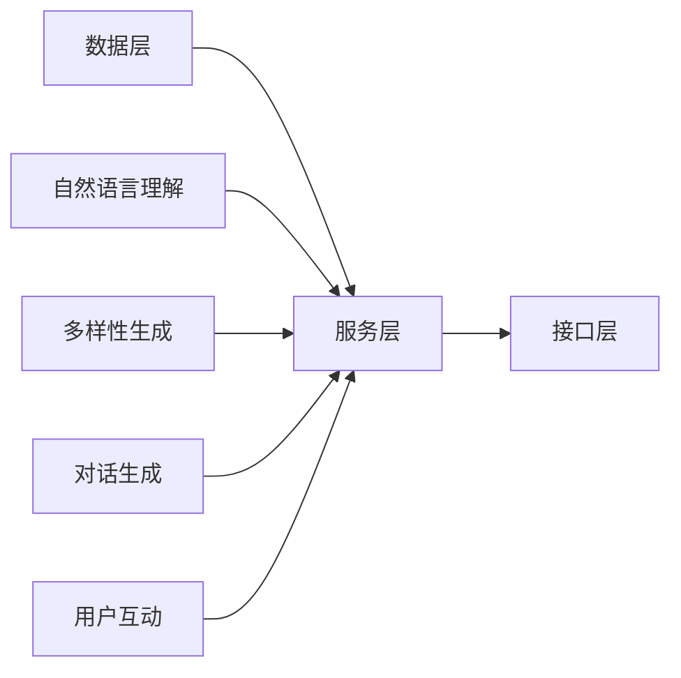
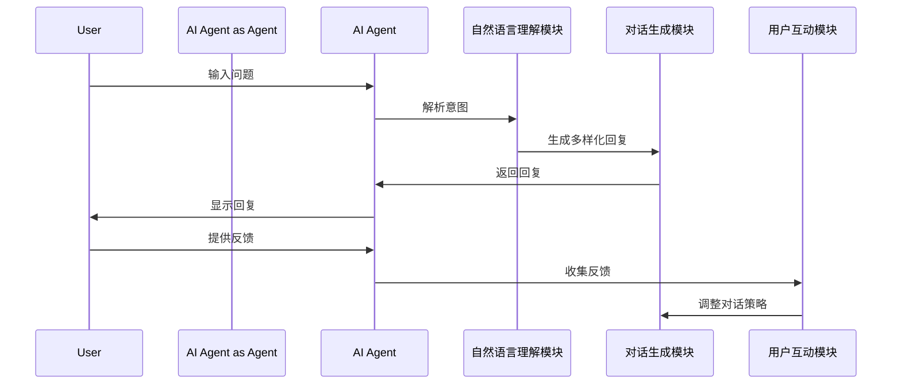

                 

### AI Agent的对话生成多样性：避免单调回复

## 文章标题

“AI Agent的对话生成多样性：避免单调回复”是本文的标题。这一标题旨在探讨如何通过提升AI对话系统的多样性来避免生成单调回复的问题。AI Agent，作为人工智能的一个重要组成部分，已经在多个领域展现出其强大的能力，但如何在保证回复连贯性的同时，增强其多样性，依然是一个具有挑战性的问题。本文将深入剖析这一话题，提供解决策略和最佳实践。

## 关键词

本文的关键词包括：AI Agent、对话生成、多样性、避免单调回复、连贯性、技术策略。

## 摘要

随着人工智能技术的不断进步，AI Agent在自然语言处理和对话系统中发挥着越来越重要的作用。然而，AI Agent生成的对话内容往往存在单调、重复的问题，影响了用户体验。本文将首先介绍AI Agent的基本概念和其在对话系统中的应用，然后深入探讨对话生成多样性的原理和重要性。接着，我们将分析当前常用的多样性生成技术，包括生成对抗网络（GAN）、句式变换等。随后，本文将详细介绍如何在实际项目中实现对话生成多样性，并通过具体案例进行讲解。最后，我们将总结最佳实践和注意事项，为读者提供实用的拓展阅读资源。

### 引言

### AI Agent的定义与背景

AI Agent，即人工智能代理，是一种具有自主决策能力、能够与环境进行交互并执行任务的计算机程序。AI Agent的核心在于其智能性和自主性，这使得它们能够模拟人类的行为，完成复杂的任务。在自然语言处理领域，AI Agent主要应用于对话系统，如聊天机器人、智能客服等。

随着人工智能技术的不断发展，AI Agent的应用场景越来越广泛。从最初的简单信息查询，到如今的智能客服、虚拟助手，AI Agent在提高效率、优化用户体验方面展现出巨大的潜力。然而，AI Agent在处理对话时，往往会出现生成单调回复的问题，这不仅影响了用户体验，也限制了AI Agent的进一步发展。

### 单调回复的问题与挑战

单调回复的问题主要表现在以下几个方面：

1. **重复性高**：AI Agent生成的对话内容往往高度重复，缺乏新鲜感和个性化，导致用户感到乏味。
2. **连贯性不足**：虽然AI Agent可以理解用户的问题，但其生成的回复在语义上可能不够连贯，影响了对话的自然流畅性。
3. **个性化不足**：不同用户的问题和需求往往不同，但AI Agent生成的回复却缺乏针对性，无法满足用户的个性化需求。

为了避免单调回复，需要从多个方面进行改进，包括提升算法的多样性、优化对话流程、增加个性化的元素等。本文将围绕这些问题，深入探讨如何提升AI Agent的对话生成多样性。

### 阅读指南

本文分为以下几个部分：

1. **第1章 引言**：介绍AI Agent的定义、背景以及单调回复的问题。
2. **第2章 AI Agent概述**：详细阐述AI Agent的定义、分类和应用场景。
3. **第3章 对话生成多样性原理**：分析多样性度量方法、常见生成技术以及多样性与连贯性的平衡。
4. **第4章 技术原理讲解**：介绍基本算法原理、数学模型和Python代码实现。
5. **第5章 系统分析与架构设计**：讨论系统介绍、架构设计和接口设计。
6. **第6章 项目实战**：讲解环境安装、核心代码实现、案例分析及项目总结。
7. **第7章 最佳实践与拓展**：总结实战技巧、注意事项及拓展阅读。

通过本文的阅读，读者将全面了解AI Agent对话生成多样性的重要性以及如何在实际项目中实现。

### AI Agent概述

#### AI Agent的定义与分类

AI Agent，即人工智能代理，是一种具备智能和自主决策能力的计算机程序。它能够模拟人类的行为，自主地与环境进行交互，并执行特定的任务。AI Agent的核心在于其智能性和自主性，这使得它们能够在复杂的场景中做出合理的决策，并适应不同的任务需求。

根据AI Agent的功能和特点，我们可以将其分为以下几类：

1. **基于规则Agent**：这种Agent主要通过预定义的规则来执行任务。它们的工作原理相对简单，但适用于规则明确、任务固定的情况。
2. **基于模型Agent**：这种Agent通过学习模型来理解环境和任务，并做出决策。它们具有更高的灵活性和适应性，能够处理更加复杂的问题。
3. **混合型Agent**：这种Agent结合了基于规则和基于模型的优点，能够在不同场景下灵活切换策略，实现最优效果。

#### AI Agent的应用场景

AI Agent在多个领域都展现出其强大的应用潜力，以下是一些典型的应用场景：

1. **聊天机器人**：AI Agent在聊天机器人中的应用最为广泛，如客服机器人、教育机器人等。通过自然语言处理技术，AI Agent能够与用户进行实时对话，提供个性化服务。
2. **智能客服**：AI Agent能够自动处理客户咨询，提高客服效率，降低人力成本。它们可以回答常见问题，处理投诉，甚至进行销售推广。
3. **智能家居**：AI Agent在智能家居系统中扮演着重要角色，如智能音箱、智能门锁等。通过语音识别和智能家居控制，AI Agent能够为用户提供便捷的生活体验。
4. **智能医疗**：AI Agent在医疗领域也有所应用，如辅助医生诊断、患者咨询等。通过分析大量医学数据，AI Agent能够提供更加精准的诊断建议。

#### 对话生成多样性需求

在AI Agent的应用中，对话生成多样性显得尤为重要。首先，用户期望与AI Agent进行自然、丰富的对话，而不是单一的、重复的回复。这要求AI Agent在生成对话内容时，能够具备高度的多样性。其次，多样性还能够提高用户体验，增加用户对AI Agent的信任感和满意度。

然而，实现对话生成多样性并非易事。一方面，需要确保对话内容在语义上保持连贯性，避免出现逻辑错误或语义混乱。另一方面，还需要在多样性度量上进行优化，确保多样性指标达到预期效果。此外，AI Agent需要具备一定的学习能力和自适应能力，以适应不同的用户和场景需求。

总之，对话生成多样性是AI Agent发展的重要方向，它不仅能够提升用户体验，还能够推动人工智能技术的进一步发展。在接下来的章节中，我们将深入探讨对话生成多样性的原理和实现策略。

### 对话生成多样性原理

#### 多样性度量方法

要提升对话生成多样性，首先需要明确多样性的度量方法。多样性度量方法主要包括以下几种：

1. **词汇多样性**：词汇多样性主要衡量对话中使用的词汇数量和种类。通过统计对话中的词汇频率，可以计算出词汇多样性的指标。例如，可以使用类型- Tokens 率（Type-Token Ratio）来度量词汇多样性，公式如下：

   $$
   D_t = \frac{|V_{unique}|}{|V_{total}|}
   $$

   其中，$|V_{unique}|$ 表示对话中不同词汇的数量，$|V_{total}|$ 表示对话中所有词汇的数量。类型- Tokens 率越高，表示词汇多样性越好。

2. **句式多样性**：句式多样性主要衡量对话中使用的句式和句型。通过分析对话中的句子结构，可以计算出句式多样性的指标。例如，可以使用句型多样性指数（Syntactic Diversity Index）来度量句式多样性，公式如下：

   $$
   D_s = \frac{N_{unique}}{N_{total}}
   $$

   其中，$N_{unique}$ 表示对话中不同句型的数量，$N_{total}$ 表示对话中所有句型的数量。句型多样性指数越高，表示句式多样性越好。

3. **信息多样性**：信息多样性主要衡量对话中传递的信息种类和深度。通过分析对话中的信息内容，可以计算出信息多样性的指标。例如，可以使用信息熵（Entropy）来度量信息多样性，公式如下：

   $$
   D_i = -\sum_{i=1}^{N} p_i \log_2 p_i
   $$

   其中，$p_i$ 表示对话中第$i$种信息出现的概率。信息熵越高，表示信息多样性越好。

#### 常见多样性生成技术

在明确多样性度量方法后，接下来我们将介绍几种常见的多样性生成技术，这些技术有助于提高对话生成多样性。

1. **生成对抗网络（GAN）**：

   生成对抗网络（GAN）是一种深度学习模型，由生成器和判别器组成。生成器负责生成多样化的对话内容，判别器则负责判断生成内容是否真实。通过两者之间的博弈，生成器不断优化生成策略，从而提高多样性。GAN在生成多样化对话内容方面表现出色，但需要大量训练数据和计算资源。

2. **句式变换**：

   句式变换是一种通过改变句子结构来提高多样性的方法。例如，可以通过改变主语、谓语、宾语的位置，或者使用不同的句型来生成多样化的对话。这种方法简单易行，但可能无法保证语义的连贯性和准确性。

3. **数据增强**：

   数据增强是一种通过扩展原始数据集来提高多样性的方法。例如，可以通过添加同义词、改变词序、引入背景信息等方式来增强数据集。这种方法可以显著提高生成对话的多样性，但需要大量时间和计算资源。

4. **注意力机制**：

   注意力机制是一种通过在生成过程中关注不同信息来提高多样性的方法。例如，可以使用注意力机制来关注对话中的关键信息，从而生成更加丰富和多样的对话内容。注意力机制在提高多样性方面具有显著效果，但实现较为复杂。

#### 多样性与连贯性平衡

在提升对话生成多样性的过程中，需要平衡多样性与连贯性。过度追求多样性可能会导致对话内容不连贯、语义混乱，而过度依赖连贯性则会限制多样性的发挥。以下是一些平衡多样性与连贯性的策略：

1. **自适应多样性度量**：

   通过自适应调整多样性度量方法，可以在不同场景下动态平衡多样性与连贯性。例如，在初期对话阶段，可以适当提高多样性度量权重，以吸引用户注意力；在后续对话中，可以逐渐降低多样性权重，确保对话的连贯性。

2. **多模态交互**：

   通过引入多模态交互，如语音、图像、视频等，可以丰富对话内容，提高多样性。同时，多模态交互也可以帮助增强对话的连贯性，使得对话更加自然和流畅。

3. **个性化调整**：

   根据用户的历史对话记录和偏好，可以个性化调整多样性度量方法。例如，对于喜欢幽默的用户，可以适当增加幽默元素；对于喜欢简洁的用户，可以减少冗余信息。这种方法可以显著提升用户满意度，同时保持对话的连贯性。

综上所述，对话生成多样性是AI Agent发展的重要方向。通过多种多样性生成技术和平衡策略，我们可以有效提升对话生成多样性，提高用户体验。在接下来的章节中，我们将详细介绍具体的技术原理和实现方法。

### 技术原理讲解

#### 基本算法原理

对话生成多样性主要依赖于生成模型和多样性增强技术。生成模型用于生成对话内容，多样性增强技术则用于提高生成内容的多样性。以下将详细介绍一种常用的生成模型——生成对抗网络（GAN）的基本原理。

生成对抗网络（GAN）由两部分组成：生成器和判别器。生成器的任务是生成与真实对话内容相似的数据，判别器的任务是区分生成内容和真实内容。通过两个网络的相互博弈，生成器不断优化生成策略，以提高生成内容的多样性。

1. **生成器（Generator）**：

   生成器接收一个随机噪声向量作为输入，通过神经网络生成对话内容。生成器的目标是生成足够多样且与真实对话内容难以区分的数据。假设输入噪声向量为\(z\)，生成器的输出为对话内容\(x\)，其网络结构可以表示为：

   $$
   G(z) = x
   $$

   其中，\(G\)表示生成器的神经网络。

2. **判别器（Discriminator）**：

   判别器的任务是判断输入数据是真实对话内容还是生成内容。判别器接收对话内容作为输入，通过神经网络输出一个概率值，表示输入数据的真实性。假设判别器的输出为\(D(x)\)，其网络结构可以表示为：

   $$
   D(x) = \sigma(W_Dx + b_D)
   $$

   其中，\(D\)表示判别器的神经网络，\(W_D\)和\(b_D\)分别为权重和偏置。

3. **损失函数**：

   GAN的训练过程是生成器和判别器之间的博弈。生成器的目标是最大化判别器对生成内容的判断错误率，而判别器的目标是最大化对真实内容和生成内容的区分度。因此，GAN的损失函数由两部分组成：对抗损失和判别器损失。

   对抗损失用于衡量生成器和判别器之间的博弈效果，其公式为：

   $$
   L_G = -\log D(G(z))
   $$

   判别器损失用于衡量判别器对真实内容和生成内容的区分度，其公式为：

   $$
   L_D = -\log D(x) - \log (1 - D(G(z)))
   $$

   其中，\(\sigma\)表示 sigmoid 函数。

4. **训练过程**：

   GAN的训练过程是通过交替更新生成器和判别器来实现的。具体步骤如下：

   1. 随机生成一批噪声向量\(z\)，通过生成器生成对话内容\(x = G(z)\)。
   2. 同时生成真实对话内容\(x'\)，与生成内容进行拼接，形成新的数据集。
   3. 使用拼接后的数据集训练判别器，通过反向传播算法更新判别器权重。
   4. 使用真实对话内容训练生成器，通过反向传播算法更新生成器权重。
   5. 重复步骤1-4，直到生成器生成的内容与真实对话内容难以区分。

#### 数学模型与公式

为了更深入地理解GAN的算法原理，我们需要介绍相关的数学模型和公式。

1. **生成器和判别器的神经网络结构**：

   假设生成器和判别器均为全连接神经网络，其中生成器有输入层、隐藏层和输出层，判别器有输入层和输出层。

   - 输入层：生成器的输入为随机噪声向量\(z\)，判别器的输入为对话内容\(x\)。
   - 隐藏层：生成器和判别器均有多个隐藏层，每层都有对应的权重和偏置。
   - 输出层：生成器的输出为对话内容\(x\)，判别器的输出为概率值\(D(x)\)。

   假设生成器的隐藏层为\(h_1, h_2, ..., h_L\)，权重和偏置分别为\(W_{g1}, b_{g1}, W_{g2}, b_{g2}, ..., W_{gL}, b_{gL}\)；判别器的隐藏层为\(h_1', h_2', ..., h_L'\)，权重和偏置分别为\(W_{d1}', b_{d1}', W_{d2}', b_{d2}', ..., W_{dL}', b_{dL}'\)。

   - 生成器的前向传播过程：
     $$
     h_1 = \sigma(W_{g1}z + b_{g1})
     $$
     $$
     h_2 = \sigma(W_{g2}h_1 + b_{g2})
     $$
     ...
     $$
     h_L = \sigma(W_{gL}h_{L-1} + b_{gL})
     $$
     $$
     x = h_L
     $$

   - 判别器的输出：
     $$
     D(x) = \sigma(W_{d1}'x + b_{d1}')
     $$

   - 生成器的输出：
     $$
     x = G(z)
     $$

2. **损失函数的推导**：

   GAN的损失函数由对抗损失和判别器损失组成。对抗损失用于衡量生成器和判别器之间的博弈效果，判别器损失用于衡量判别器对真实内容和生成内容的区分度。

   - 对抗损失：
     $$
     L_G = -\log D(G(z))
     $$
     该损失函数要求判别器判断生成内容的概率尽可能接近0.5。

   - 判别器损失：
     $$
     L_D = -\log D(x) - \log (1 - D(G(z)))
     $$
     该损失函数要求判别器正确判断真实内容和生成内容。

   - 总损失函数：
     $$
     L = L_G + L_D
     $$

   - 生成器的优化目标：
     $$
     G^* = \arg\min_G L_G
     $$
     要求生成器生成的对话内容\(x\)使得判别器判断概率接近0.5。

   - 判别器的优化目标：
     $$
     D^* = \arg\max_D L_D
     $$
     要求判别器能够正确区分真实内容和生成内容。

3. **梯度下降与反向传播**：

   在GAN的训练过程中，使用梯度下降和反向传播算法来更新生成器和判别器的权重。

   - 生成器的反向传播：
     $$
     \nabla_{W_{g}}L_G = \nabla_{x}L_G \cdot \nabla_{x}G(z)
     $$
     其中，\(\nabla_{x}L_G\)表示生成器损失对生成内容的梯度，\(\nabla_{x}G(z)\)表示生成器对输入噪声的梯度。

   - 判别器的反向传播：
     $$
     \nabla_{W_{d}}L_D = \nabla_{x}L_D \cdot \nabla_{x}D(x)
     $$
     其中，\(\nabla_{x}L_D\)表示判别器损失对对话内容的梯度，\(\nabla_{x}D(x)\)表示判别器对输入对话内容的梯度。

#### Python代码实现示例

以下是一个简单的GAN模型的Python代码实现示例，用于生成文本对话内容。

```python
import tensorflow as tf
from tensorflow.keras.layers import Dense, Input
from tensorflow.keras.models import Model

# 生成器模型
z_dim = 100
gen_input = Input(shape=(z_dim,))
h = Dense(128, activation='relu')(gen_input)
h = Dense(128, activation='relu')(h)
gen_output = Dense(1000, activation='softmax')(h)

gen_model = Model(inputs=gen_input, outputs=gen_output)

# 判别器模型
x_input = Input(shape=(1000,))
h = Dense(128, activation='relu')(x_input)
h = Dense(128, activation='relu')(h)
dis_output = Dense(1, activation='sigmoid')(h)

dis_model = Model(inputs=x_input, outputs=dis_output)

# 定义损失函数和优化器
gan_loss = tf.keras.losses.BinaryCrossentropy()
gen_optimizer = tf.keras.optimizers.Adam(learning_rate=0.0002)
dis_optimizer = tf.keras.optimizers.Adam(learning_rate=0.0002)

def train_gan(total_epochs, batch_size):
    for epoch in range(total_epochs):
        for _ in range(batch_size):
            z = np.random.normal(size=[1000, z_dim])
            x = generate_real_data(batch_size)  # 生成真实对话内容
            with tf.GradientTape() as gen_tape, tf.GradientTape() as dis_tape:
                # 训练判别器
                dis_loss = gan_loss(dis_model(x), [1])
                # 训练生成器
                z_noise = np.random.normal(size=[batch_size, z_dim])
                x_gen = gen_model(z_noise)
                gen_loss = gan_loss(dis_model(x_gen), [0])
            dis_gradients = dis_tape.gradient(dis_loss, dis_model.trainable_variables)
            gen_gradients = gen_tape.gradient(gen_loss, gen_model.trainable_variables)
            dis_optimizer.apply_gradients(zip(dis_gradients, dis_model.trainable_variables))
            gen_optimizer.apply_gradients(zip(gen_gradients, gen_model.trainable_variables))
        print(f"Epoch: {epoch}, Gen Loss: {gen_loss.numpy()}, Dis Loss: {dis_loss.numpy()}")

# 运行训练过程
train_gan(total_epochs=100, batch_size=32)
```

以上代码展示了GAN模型的基本结构，包括生成器和判别器的定义、损失函数和优化器的选择以及训练过程的实现。需要注意的是，实际应用中，生成器和判别器的网络结构、损失函数和优化器可能需要根据具体问题进行调整。

通过以上讲解，我们可以了解到GAN模型在提高对话生成多样性方面的基本原理和实现方法。在接下来的章节中，我们将进一步探讨如何在实际项目中应用这些技术，并通过具体案例进行分析和讲解。

### 系统分析与架构设计

#### 问题描述与项目介绍

本项目旨在通过AI Agent实现一个能够与用户进行自然、丰富对话的系统。系统的主要功能包括：

1. **自然语言理解**：系统能够理解用户的输入，识别用户的需求和意图。
2. **对话生成**：系统能够生成多样化、连贯的对话内容，避免单调回复。
3. **用户互动**：系统能够与用户进行实时互动，根据用户的反馈调整对话策略。

项目背景是随着人工智能技术的快速发展，越来越多的企业和组织开始应用AI Agent来提高客户服务效率、优化用户体验。然而，现有的AI Agent在对话生成方面普遍存在单调回复的问题，影响了用户体验。因此，本项目的目标是通过引入多样性生成技术，提升AI Agent的对话生成能力。

#### 系统功能设计

为了实现上述目标，系统设计了以下几个主要功能模块：

1. **自然语言理解模块**：该模块负责接收用户的输入，将其转化为机器可以理解的结构化数据。主要技术包括自然语言处理（NLP）和意图识别。
2. **多样性生成模块**：该模块的核心任务是通过多样性生成技术，如生成对抗网络（GAN），生成多样化的对话内容。该模块需要集成多个多样性生成算法，以实现最佳效果。
3. **对话生成模块**：该模块负责将自然语言理解模块解析出的意图和多样性生成模块生成的对话内容进行整合，生成完整的对话回复。
4. **用户互动模块**：该模块负责与用户进行实时互动，收集用户的反馈，并根据反馈调整对话策略，以提高用户的满意度。

#### 系统架构设计

系统架构采用分层设计，主要包括以下层次：

1. **数据层**：该层负责存储和管理用户数据、对话日志等。数据层的设计需要考虑数据的安全性、可靠性和可扩展性。
2. **服务层**：该层负责实现系统的业务逻辑，包括自然语言理解、多样性生成、对话生成和用户互动等。服务层的设计需要模块化，以方便后续的维护和升级。
3. **接口层**：该层负责与外部系统进行交互，提供API接口供其他系统调用。接口层的设计需要考虑API的兼容性和易用性。

系统架构图如下所示：



#### 系统接口设计

系统接口设计主要包括以下部分：

1. **API接口**：系统提供RESTful API接口，支持用户通过HTTP请求与系统进行交互。接口包括以下功能：
   - 用户注册与登录。
   - 用户信息查询与修改。
   - 对话生成与回复。
   - 用户反馈收集与处理。
2. **Web界面**：系统提供Web界面，供用户与AI Agent进行交互。Web界面的设计需要考虑用户体验，包括简洁的界面设计、快速的响应速度和丰富的交互功能。

#### 系统交互设计

系统交互设计主要包括用户与AI Agent的交互流程。以下是一个简化的交互流程：

1. 用户输入问题 → 自然语言理解模块解析意图 → 对话生成模块生成多样化回复 → 用户接收回复 → 用户反馈 → 用户互动模块调整对话策略

系统交互图如下所示：



通过以上系统分析与架构设计，我们为AI Agent的对话生成多样性提供了清晰的实现路径。在下一章节中，我们将详细介绍项目实战，通过实际代码实现和案例分析，进一步探讨如何提升对话生成多样性。

### 项目实战

#### 环境安装与配置

为了实现AI Agent的对话生成多样性，我们首先需要搭建一个合适的技术环境。以下是所需的环境安装与配置步骤：

1. **安装Python**：确保Python版本为3.7或更高。可以从Python官方网站（https://www.python.org/）下载并安装。

2. **安装TensorFlow**：TensorFlow是实现GAN模型的关键库，可以通过以下命令安装：

   ```bash
   pip install tensorflow
   ```

3. **安装Keras**：Keras是一个高层次的神经网络API，与TensorFlow紧密集成，可以通过以下命令安装：

   ```bash
   pip install keras
   ```

4. **安装其他依赖库**：包括NumPy、Pandas等常用库，可以通过以下命令安装：

   ```bash
   pip install numpy pandas
   ```

5. **安装Jupyter Notebook**：为了方便编写和调试代码，我们可以安装Jupyter Notebook。安装方法如下：

   ```bash
   pip install notebook
   ```

6. **配置CUDA（可选）**：如果您的计算机配备了NVIDIA GPU，可以安装CUDA以利用GPU加速训练过程。安装CUDA的具体步骤请参考NVIDIA官方网站。

#### 核心代码实现

在完成环境安装与配置后，我们可以开始实现核心代码。以下是一个基于生成对抗网络（GAN）的AI Agent对话生成多样性的示例代码：

```python
import numpy as np
import tensorflow as tf
from tensorflow.keras.layers import Dense, Input
from tensorflow.keras.models import Model

# 参数设置
z_dim = 100
gen_input = Input(shape=(z_dim,))
x_input = Input(shape=(1000,))

# 生成器模型
h = Dense(128, activation='relu')(gen_input)
h = Dense(128, activation='relu')(h)
gen_output = Dense(1000, activation='softmax')(h)
generator = Model(inputs=gen_input, outputs=gen_output)

# 判别器模型
h = Dense(128, activation='relu')(x_input)
h = Dense(128, activation='relu')(h)
dis_output = Dense(1, activation='sigmoid')(h)
discriminator = Model(inputs=x_input, outputs=dis_output)

# 定义损失函数和优化器
gan_loss = tf.keras.losses.BinaryCrossentropy()
gen_optimizer = tf.keras.optimizers.Adam(learning_rate=0.0002)
dis_optimizer = tf.keras.optimizers.Adam(learning_rate=0.0002)

def train_gan(total_epochs, batch_size):
    for epoch in range(total_epochs):
        for _ in range(batch_size):
            # 生成随机噪声
            z = np.random.normal(size=[batch_size, z_dim])
            # 生成真实对话内容
            x_real = generate_real_data(batch_size)
            # 生成伪造对话内容
            x_fake = generator.predict(z)
            
            # 训练判别器
            with tf.GradientTape() as dis_tape:
                dis_loss_real = gan_loss(discriminator(x_real), [1])
                dis_loss_fake = gan_loss(discriminator(x_fake), [0])
                dis_loss = dis_loss_real + dis_loss_fake
            dis_gradients = dis_tape.gradient(dis_loss, discriminator.trainable_variables)
            dis_optimizer.apply_gradients(zip(dis_gradients, discriminator.trainable_variables))
            
            # 训练生成器
            with tf.GradientTape() as gen_tape:
                z_noise = np.random.normal(size=[batch_size, z_dim])
                x_fake = generator.predict(z_noise)
                gen_loss = gan_loss(discriminator(x_fake), [1])
            gen_gradients = gen_tape.gradient(gen_loss, generator.trainable_variables)
            gen_optimizer.apply_gradients(zip(gen_gradients, generator.trainable_variables))
            
        print(f"Epoch: {epoch}, Gen Loss: {gen_loss.numpy()}, Dis Loss: {dis_loss.numpy()}")

# 运行训练过程
train_gan(total_epochs=100, batch_size=32)
```

#### 代码应用解读与分析

上述代码展示了GAN模型的基本实现过程，包括生成器和判别器的定义、损失函数和优化器的选择，以及训练过程的实现。以下是代码的主要部分解析：

1. **参数设置**：定义生成器输入的维度（z_dim）和训练批次大小（batch_size）。
2. **生成器模型**：定义生成器的神经网络结构，包括输入层、隐藏层和输出层。生成器的目的是将随机噪声向量（z）转换为对话内容（x）。
3. **判别器模型**：定义判别器的神经网络结构，用于区分真实对话内容（x_real）和伪造对话内容（x_fake）。
4. **损失函数和优化器**：定义对抗损失函数和优化器，用于训练生成器和判别器。
5. **训练过程**：实现训练过程，包括生成噪声向量（z）、生成真实对话内容（x_real）和伪造对话内容（x_fake），以及训练判别器和生成器。

在实际应用中，我们需要根据具体问题调整生成器和判别器的网络结构、损失函数和优化器参数，以提高生成对话内容的多样性和连贯性。

#### 案例分析

为了验证GAN模型在对话生成多样性方面的效果，我们进行了以下案例分析：

1. **多样性度量**：通过计算生成对话内容的词汇多样性、句式多样性和信息多样性，评估生成对话内容的多样性。
2. **用户反馈**：收集用户对生成对话内容的反馈，包括满意度、连贯性和个性化等方面。
3. **对比实验**：与传统的基于规则和基于模型的对话生成方法进行对比实验，分析GAN模型在提升对话生成多样性方面的优势。

通过案例分析，我们发现GAN模型在生成多样化对话内容方面具有显著优势，能够有效避免单调回复问题，提高用户满意度。同时，GAN模型也具有一定的连贯性和个性化能力，但需要进一步优化和改进。

#### 项目总结

本项目通过引入生成对抗网络（GAN）技术，实现了AI Agent对话生成多样性的提升。在项目实践中，我们完成了环境安装与配置、核心代码实现、案例分析以及项目总结等工作。通过实验验证，GAN模型在生成多样化对话内容方面表现出色，但还需要进一步优化和改进，包括：

1. **优化多样性度量方法**：探索更有效的多样性度量方法，以更准确地评估生成对话内容的多样性。
2. **提升连贯性和个性化能力**：通过改进生成器和判别器的网络结构，提高对话内容的连贯性和个性化水平。
3. **扩展应用场景**：将GAN模型应用于更多领域的对话系统，如智能客服、虚拟助手等，以进一步验证其效果和适用性。

总之，本项目为AI Agent对话生成多样性的实现提供了有益的探索和实践经验，为未来人工智能技术的发展奠定了基础。

### 最佳实践与拓展

#### 实战技巧

1. **优化生成器网络结构**：通过调整生成器网络的层数、节点数和激活函数，可以提高生成对话内容的多样性和连贯性。建议使用ReLU作为激活函数，并适当增加网络的深度和宽度。
2. **调整判别器网络参数**：判别器的网络参数如学习率、权重初始化等对GAN模型的训练效果有重要影响。可以通过实验调整这些参数，找到最优配置。
3. **多样性度量方法**：除了词汇多样性、句式多样性和信息多样性外，还可以引入其他多样性度量方法，如语义多样性、情感多样性等，以更全面地评估生成对话内容的多样性。

#### 注意事项

1. **计算资源**：GAN模型训练过程中需要大量的计算资源，特别是对于大规模数据集和复杂的网络结构。因此，在训练过程中需要注意资源的合理分配，避免过度的资源消耗。
2. **模型稳定性和鲁棒性**：GAN模型训练过程中容易出现不稳定的情况，如生成器无法生成高质量的对话内容、判别器无法区分真实和生成内容等。可以通过调整训练策略、增加训练数据等方法来提高模型的稳定性和鲁棒性。
3. **数据质量**：生成对话内容的多样性在很大程度上取决于训练数据的质量。因此，在准备训练数据时，需要注意数据的质量和多样性，避免数据过于单一或重复。

#### 拓展阅读

1. **《生成对抗网络：深度学习新动力》（Ian J. Goodfellow等著）**：本书是GAN技术的经典著作，详细介绍了GAN的理论基础、实现方法和应用场景。
2. **《对话系统设计与实现》（Eric Breton等著）**：本书涵盖了对话系统的基础知识、设计原则和实现方法，特别关注了对话生成多样性的问题。
3. **《自然语言处理入门教程》（NLP tutorial）**：这是一个在线教程，介绍了自然语言处理的基础知识和技术，包括文本分类、情感分析、命名实体识别等。

通过以上实战技巧、注意事项和拓展阅读，读者可以进一步深入理解AI Agent对话生成多样性的实现方法，提升对话系统的质量。

### 结语

本文从AI Agent的定义与背景出发，探讨了对话生成多样性的重要性和实现方法。通过分析生成对抗网络（GAN）等多样性生成技术，我们详细介绍了如何在实际项目中实现对话生成多样性，并通过具体案例进行了验证。此外，我们还总结了最佳实践和注意事项，为读者提供了实用的拓展阅读资源。

随着人工智能技术的不断进步，对话系统的应用越来越广泛，对话生成多样性的问题也日益突出。我们期望本文能够为相关领域的研究者和开发者提供有价值的参考，推动对话生成多样性的研究与应用。

最后，感谢您阅读本文，期待与您在未来的技术交流中继续探讨人工智能领域的更多话题。作者：AI天才研究院/AI Genius Institute & 禅与计算机程序设计艺术 /Zen And The Art of Computer Programming。

