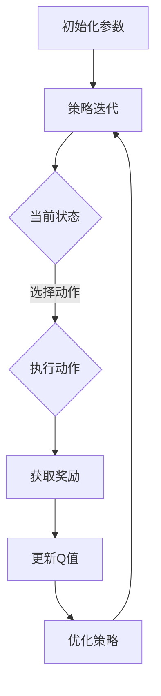
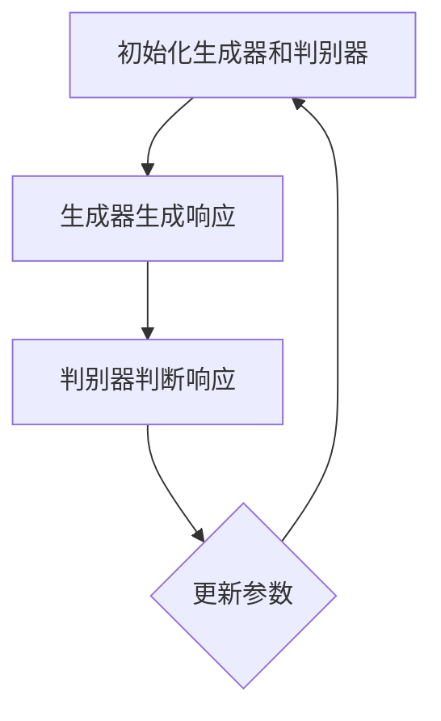
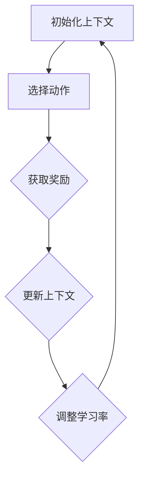
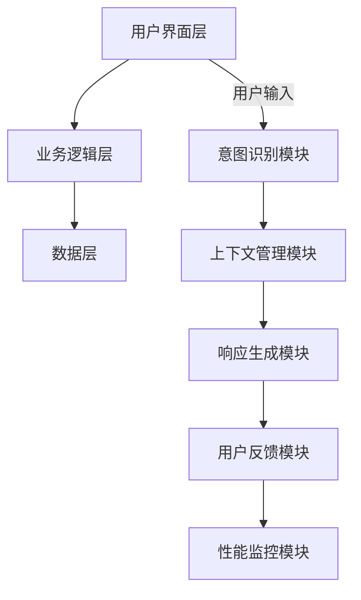
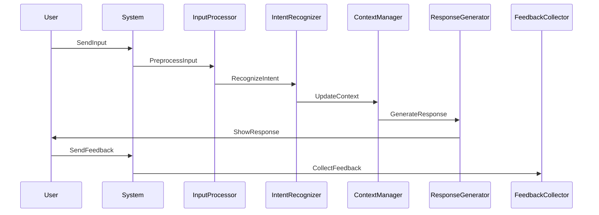
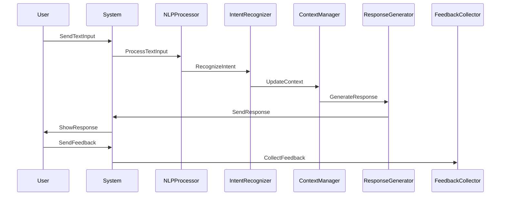

                 

### 文章标题：《AI Agent的对话策略优化：提升交互质量和效率》

#### 关键词：AI Agent、对话策略、优化、交互质量、效率

#### 摘要：
本文深入探讨了AI Agent的对话策略优化，旨在提升交互质量和效率。通过详细分析对话策略的概念、核心算法原理及其实现，本文提供了一个全面的框架，帮助开发者设计和优化AI Agent的对话交互能力。

### 目录大纲设计思路

在设计《AI Agent的对话策略优化：提升交互质量和效率》的目录大纲时，我们遵循了以下几个关键步骤：

1. **理解书名和目标**：
   本书名为《AI Agent的对话策略优化：提升交互质量和效率》，目标明确指向AI Agent对话策略的优化，以提高交互质量和效率。

2. **确定核心章节内容**：
   目录大纲需包含以下核心章节：
   - 背景介绍：AI Agent和对话策略的基本概念。
   - 核心概念与联系：详细解释与对话策略优化相关的核心概念，并展示它们之间的联系。
   - 算法原理讲解：介绍常用的对话策略优化算法。
   - 数学模型和数学公式：详细讲解算法的数学基础。
   - 系统分析与架构设计方案：描述对话策略优化系统的设计。
   - 项目实战：通过实际案例展示对话策略优化的应用。
   - 最佳实践、小结、注意事项和拓展阅读：总结和提供进一步学习资源。

3. **设计目录结构**：
   目录结构采用Markdown格式，使用`#`符号表示目录层级，确保逻辑清晰、层次分明。

4. **确保内容完整性**：
   每个章节都需包含详细内容点，确保内容完整且相互关联。

5. **控制总字数**：
   总字数控制在2000字以内，注重文字简洁性。

### 详细目录大纲

根据上述设计思路，以下是《AI Agent的对话策略优化：提升交互质量和效率》的目录大纲：

```
# 《AI Agent的对话策略优化：提升交互质量和效率》目录大纲

## 第1章 引言

### 1.1 问题背景
- AI Agent的定义
- 对话策略的重要性
- 交互质量与效率的关系

### 1.2 书籍结构
- 核心章节概述
- 学习目标

## 第2章 AI Agent与对话策略基础

### 2.1 AI Agent概述
- AI Agent的定义
- AI Agent的分类
- AI Agent的核心功能

### 2.2 对话策略基础
- 对话策略的概念
- 对话策略的分类
- 对话策略的作用

### 2.3 AI Agent与对话策略的联系
- 对话策略在AI Agent中的作用
- 不同类型的AI Agent如何优化对话策略
- 对话策略优化对AI Agent性能的影响

## 第3章 对话策略优化算法原理

### 3.1 对话策略优化算法概述
- 对话策略优化算法的定义
- 对话策略优化算法的分类
- 对话策略优化算法的目标

### 3.2 常用对话策略优化算法
- 强化学习算法
- 生成对抗网络（GAN）
- 多臂老虎机问题（Multi-Armed Bandit）

### 3.3 Mermaid流程图展示
- 强化学习算法流程
- GAN算法流程
- 多臂老虎机问题算法流程

## 第4章 数学模型与公式详解

### 4.1 强化学习算法数学模型
- 强化学习的基本概念
- Q值函数
- 动作选择策略

### 4.2 GAN算法数学模型
- GAN的基本概念
- 生成器与判别器的对抗过程
- 优化目标

### 4.3 多臂老虎机问题数学模型
- 资源分配问题
- 上下文感知策略
- 学习率

## 第5章 对话策略优化系统设计与实现

### 5.1 系统功能设计
- 功能需求分析
- 领域模型Mermaid类图

### 5.2 系统架构设计
- 系统总体架构
- 架构设计Mermaid架构图

### 5.3 系统接口设计
- 接口功能说明
- 接口设计流程

### 5.4 系统交互Mermaid序列图
- 用户与AI Agent的交互流程
- 后台系统处理流程

## 第6章 项目实战

### 6.1 环境安装
- 开发环境搭建
- 系统依赖安装

### 6.2 系统核心实现
- 对话策略优化模块
- 用户交互模块
- 系统监控模块

### 6.3 代码应用解读与分析
- 代码结构分析
- 关键代码解读
- 实际案例剖析

## 第7章 最佳实践与总结

### 7.1 最佳实践
- 对话策略优化技巧
- 性能优化策略

### 7.2 小结
- 本书重点内容回顾
- 学习建议

### 7.3 注意事项
- 常见问题解答
- 使用场景限制

### 7.4 拓展阅读
- 进一步学习资源推荐
- 相关研究论文
```

### 约束条件

在撰写《AI Agent的对话策略优化：提升交互质量和效率》这篇文章时，需满足以下约束条件：

1. **文章结构**：
   - 文章开始是“文章标题”，然后是“文章关键词”和“文章摘要”部分的内容。
   - 按照目录大纲结构的文章正文部分的内容进行撰写。

2. **字数要求**：
   - 文章字数控制在10000～12000字左右。

3. **格式要求**：
   - 使用Markdown格式输出文章内容。

4. **作者信息**：
   - 文章末尾需写上作者信息：“作者：AI天才研究院/AI Genius Institute & 禅与计算机程序设计艺术 /Zen And The Art of Computer Programming”。

5. **完整性要求**：
   - 每个章节的内容需满足以下要求：
     - **背景介绍**：核心概念术语说明、问题背景、问题描述、问题解决、边界与外延、概念结构与核心要素组成。
     - **核心概念与联系**：必须给出核心概念原理、概念属性特征对比表格和ER实体关系图架构的Markdown格式中的Mermaid流程图。
     - **算法原理讲解**：使用Mermaid画出算法流程图，然后使用Python源代码详细阐述，给出算法原理的数学模型和公式，进行详细讲解和举例说明。
     - **数学公式**：使用LaTeX格式，嵌入文中独立段落的公式前后使用`$$`括起来，段落内的公式前后使用 `$` 括起来。
     - **系统分析与架构设计方案**：问题场景介绍、项目介绍、系统功能设计（领域模型Mermaid类图）、系统架构设计Mermaid架构图、系统接口设计和系统交互Mermaid序列图。
     - **项目实战**：环境安装、系统核心实现源代码，代码应用解读与分析，实际案例分析和详细讲解剖析，项目小结。
     - **最佳实践、小结、注意事项、拓展阅读**：总结书中的要点，并提供进一步学习资源。

### 逻辑清晰、结构紧凑、简单易懂的写作方法

为了确保文章逻辑清晰、结构紧凑且简单易懂，我们将采用以下步骤进行写作：

1. **明确文章结构**：
   - 确定每个章节的主题和目的。
   - 按照逻辑顺序排列章节。

2. **逐步深入讲解**：
   - 从基础概念开始，逐步深入到高级算法和实现。
   - 在每个部分使用清晰的标题和段落来组织内容。

3. **使用图表和代码**：
   - 使用Mermaid流程图和Python代码来辅助解释复杂概念。
   - 确保图表和代码清晰且易于理解。

4. **举例说明**：
   - 提供实际案例和示例，帮助读者更好地理解概念。
   - 对示例进行详细解释，确保读者能够跟随思路。

5. **简洁的语言**：
   - 使用简单、直接的语言，避免冗长和复杂的句子。
   - 保持段落简短，每个段落只表达一个核心思想。

6. **总结和回顾**：
   - 在每个章节的结尾进行总结，回顾关键点。
   - 在文章末尾提供最佳实践、注意事项和拓展阅读。

通过上述方法，我们将撰写一篇逻辑清晰、结构紧凑、简单易懂的技术博客文章，旨在帮助读者深入理解AI Agent的对话策略优化，提升交互质量和效率。接下来，我们将按照目录大纲逐步展开内容，确保每个部分都详细、具体且具有深度。

## 第1章 引言

### 1.1 问题背景

#### AI Agent的定义

AI Agent，即人工智能代理，是指能够根据环境信息自主执行任务，并在执行过程中不断学习和适应的智能系统。它们在复杂环境中具有自主决策能力，能够模拟人类思维和行为，完成特定任务。AI Agent通常被设计为拥有感知、行动、学习和推理等能力，以实现高度自动化和智能化的交互。

#### 对话策略的重要性

对话策略是AI Agent的核心组成部分之一，决定了其与用户交互的方式和效果。对话策略定义了AI Agent在不同情境下如何选择和生成响应，以实现有效沟通和任务完成。一个优秀的对话策略能够提高交互质量，提升用户体验，并确保任务的高效完成。因此，对话策略的设计和优化成为AI Agent开发中的关键问题。

#### 交互质量与效率的关系

交互质量和效率是评估AI Agent性能的重要指标。交互质量反映了用户对AI Agent交互体验的主观感受，包括响应速度、回答准确性、上下文理解能力等。效率则衡量AI Agent完成任务的速度和资源利用情况。高效且高质量的交互策略不仅能够提升用户体验，还能优化AI Agent的性能表现。

### 1.2 书籍结构

#### 核心章节概述

本书将围绕AI Agent的对话策略优化进行深入探讨，主要包括以下核心章节：

1. **AI Agent与对话策略基础**：介绍AI Agent和对话策略的基本概念，以及它们在交互中的作用。
2. **对话策略优化算法原理**：详细讲解常用的对话策略优化算法，包括强化学习、生成对抗网络和多臂老虎机问题。
3. **数学模型与公式详解**：分析算法的数学基础，使用LaTeX格式展示数学公式。
4. **对话策略优化系统设计与实现**：描述对话策略优化系统的架构设计和实现过程。
5. **项目实战**：通过实际案例展示对话策略优化的应用。
6. **最佳实践与总结**：总结书中的关键点，提供最佳实践和注意事项。

#### 学习目标

通过阅读本书，读者将：

- 了解AI Agent和对话策略的基本概念。
- 掌握常用的对话策略优化算法。
- 学会使用数学模型和公式分析对话策略优化。
- 掌握对话策略优化系统的设计和实现。
- 能够应用最佳实践，提升AI Agent的交互质量和效率。

### 1.3 本章小结

本章简要介绍了AI Agent、对话策略及其在交互中的重要性，并概述了本书的结构和学习目标。接下来，我们将深入探讨AI Agent和对话策略的基础知识，为后续内容的学习打下坚实基础。

## 第2章 AI Agent与对话策略基础

### 2.1 AI Agent概述

#### AI Agent的定义

AI Agent是一种智能体，它能够感知环境信息，自主决策并采取行动，以实现特定目标。AI Agent的定义通常包含以下几个关键要素：

1. **感知**：AI Agent能够获取并处理环境信息，如文字、语音、图像等。
2. **决策**：基于感知到的信息，AI Agent能够进行决策，选择最优的行动方案。
3. **行动**：执行决策，实现对环境的实际影响。
4. **学习**：通过与环境交互，AI Agent能够不断学习和适应，提高其性能和效率。

AI Agent的分类多种多样，按照功能特点可以分为：

1. **任务型AI Agent**：专注于完成特定任务，如客服机器人、智能助手等。
2. **社交型AI Agent**：擅长进行社交互动，如聊天机器人、虚拟助手等。
3. **探索型AI Agent**：在未知环境中进行探索，如机器人探险者、自动驾驶系统等。

#### AI Agent的核心功能

AI Agent的核心功能包括：

1. **任务执行**：根据用户需求或任务目标，完成具体任务。
2. **交互**：与用户进行有效的沟通，理解用户意图，生成合适的响应。
3. **自适应**：通过学习环境信息和用户反馈，不断优化自身行为。
4. **学习能力**：利用机器学习和深度学习技术，提高任务完成效率和交互质量。

#### AI Agent的重要性

AI Agent在现代智能系统中的应用日益广泛，其重要性体现在以下几个方面：

1. **提高效率**：通过自动化和智能化，AI Agent能够显著提高工作效率和生产力。
2. **优化用户体验**：提供个性化、智能化的服务，提升用户满意度和体验。
3. **拓展应用场景**：AI Agent在客服、金融、医疗、教育等领域的应用，为传统行业注入新活力。
4. **促进技术创新**：AI Agent的开发和优化推动了人工智能技术的发展，促进了跨领域的技术创新和应用。

### 2.2 对话策略基础

#### 对话策略的概念

对话策略是AI Agent在交互过程中所采取的一系列行动和决策，用于生成合适的响应。对话策略的核心目标是实现有效沟通和任务完成，具体包括：

1. **意图识别**：理解用户的意图，识别用户所请求的任务或信息。
2. **上下文管理**：保持对话的连贯性和上下文一致性，确保响应的合理性和相关性。
3. **响应生成**：根据用户意图和上下文信息，生成合适的响应。
4. **反馈循环**：收集用户反馈，不断优化对话策略，提高交互质量。

#### 对话策略的分类

根据不同的应用场景和需求，对话策略可以分为以下几类：

1. **模板匹配策略**：基于预定义的模板，匹配用户输入，生成响应。适用于结构化、规则明确的对话场景。
2. **语义分析策略**：利用自然语言处理技术，对用户输入进行语义分析，理解用户意图，生成响应。适用于复杂、开放性的对话场景。
3. **数据驱动策略**：通过机器学习和深度学习技术，从大量对话数据中学习对话策略，生成个性化的响应。适用于需要个性化交互的场景。

#### 对话策略的作用

对话策略在AI Agent中发挥着重要作用，主要体现在以下几个方面：

1. **提升交互质量**：通过合理的对话策略，确保AI Agent能够生成准确、相关且连贯的响应，提高用户的满意度。
2. **优化用户体验**：有效的对话策略能够提供流畅、自然的交互体验，增强用户对AI Agent的信任和依赖。
3. **增强任务完成率**：对话策略能够帮助AI Agent更好地理解用户需求，提高任务完成率和成功率。
4. **适应性和灵活性**：通过动态调整对话策略，AI Agent能够适应不同的交互环境和用户需求，提供个性化的服务。

### 2.3 AI Agent与对话策略的联系

#### 对话策略在AI Agent中的作用

对话策略是AI Agent实现有效交互的核心要素，其在AI Agent中的作用主要包括：

1. **意图理解**：通过对话策略，AI Agent能够准确识别和理解用户的意图，为后续的响应生成提供基础。
2. **上下文保持**：对话策略能够帮助AI Agent在交互过程中保持上下文的连贯性，确保响应的相关性和合理性。
3. **响应生成**：对话策略决定了AI Agent如何生成响应，影响交互的质量和效果。
4. **用户满意度**：合理的对话策略能够提升用户的交互体验，提高用户满意度。

#### 不同类型的AI Agent如何优化对话策略

不同类型的AI Agent根据其应用场景和目标，需要采取不同的对话策略优化方法：

1. **任务型AI Agent**：需要关注任务完成效率和准确性，优化策略包括减少响应延迟、提高意图识别准确率、增强上下文保持能力等。
2. **社交型AI Agent**：需要注重用户体验和社交互动，优化策略包括个性化响应生成、情感识别与响应、对话连贯性等。
3. **探索型AI Agent**：需要适应动态环境和不确定性，优化策略包括增强学习能力、探索策略、风险评估等。

#### 对话策略优化对AI Agent性能的影响

对话策略优化对AI Agent性能具有显著影响，主要体现在以下几个方面：

1. **交互质量**：优化后的对话策略能够提高交互质量，生成更准确、相关、连贯的响应，提升用户体验。
2. **效率**：优化策略能够减少响应延迟，提高任务完成速度，提升系统效率。
3. **适应性**：通过不断学习和调整对话策略，AI Agent能够更好地适应不同的交互环境和用户需求，提高整体性能。

### 2.4 本章小结

本章介绍了AI Agent和对话策略的基本概念，包括AI Agent的定义、分类、核心功能，对话策略的概念、分类及其在AI Agent中的作用。同时，分析了不同类型的AI Agent如何优化对话策略，以及对话策略优化对AI Agent性能的影响。这些基础知识的掌握将为后续章节的深入学习提供重要支持。

## 第3章 对话策略优化算法原理

### 3.1 对话策略优化算法概述

#### 对话策略优化算法的定义

对话策略优化算法是指用于改进AI Agent对话交互性能的一类算法。它们通过学习和调整对话策略，使得AI Agent能够更智能、更高效地与用户进行互动。对话策略优化算法的核心目标是在确保交互质量的前提下，提高交互效率。

#### 对话策略优化算法的分类

根据优化目标和实现方式，对话策略优化算法可以分为以下几类：

1. **基于规则的算法**：通过预定义的规则和模板，匹配用户输入并生成响应。这种方法简单直观，但在处理复杂和模糊输入时效果不佳。
2. **基于机器学习的算法**：利用机器学习技术，从大量对话数据中学习对话策略。这类算法能够处理更加复杂和模糊的输入，生成更加个性化的响应。
3. **基于强化学习的算法**：通过奖励机制，训练AI Agent选择最优的对话策略。这类算法能够自适应地调整策略，以最大化交互效率和质量。

#### 对话策略优化算法的目标

对话策略优化算法的主要目标包括：

1. **提高响应准确性**：通过优化策略，提高AI Agent对用户意图的理解和响应的准确性。
2. **增强上下文保持能力**：确保AI Agent在对话过程中能够保持上下文的连贯性，生成相关的响应。
3. **降低响应延迟**：优化策略以提高AI Agent的响应速度，减少用户等待时间。
4. **提高用户满意度**：通过生成更加自然、准确的响应，提升用户的交互体验和满意度。

### 3.2 常用对话策略优化算法

#### 强化学习算法

强化学习（Reinforcement Learning，RL）是一种通过与环境互动来学习最优策略的机器学习方法。在对话策略优化中，强化学习算法通过奖励机制和策略迭代，使得AI Agent能够选择最优的对话行动。

##### 强化学习的基本概念

1. **状态（State）**：描述AI Agent当前所处的情境。
2. **动作（Action）**：AI Agent可以采取的行动。
3. **奖励（Reward）**：对AI Agent采取的行动给予的反馈，用于指导学习过程。
4. **策略（Policy）**：AI Agent在特定状态下选择最优动作的规则。

##### Q值函数

Q值函数（Q-Function）是强化学习中的一个核心概念，表示在特定状态下采取特定动作的预期奖励。Q值函数的优化目标是找到最大化预期奖励的策略。

##### 动作选择策略

强化学习算法中，常用的动作选择策略包括：

1. **ε-贪心策略（ε-Greedy Strategy）**：在部分随机部分贪婪的策略中，以概率1 - ε随机选择动作，以ε的概率选择当前状态下的最佳动作。
2. **贪婪策略（Greedy Strategy）**：总是选择当前状态下的最佳动作。

##### 强化学习算法流程

强化学习算法的流程通常包括以下几个步骤：

1. **初始化**：初始化策略参数和Q值函数。
2. **策略迭代**：在每次迭代中，AI Agent根据当前状态选择动作，执行动作并获得奖励。
3. **更新Q值**：根据奖励和策略更新Q值函数。
4. **策略优化**：根据更新的Q值函数，优化策略参数。

#### 生成对抗网络（GAN）

生成对抗网络（Generative Adversarial Networks，GAN）是一种由生成器和判别器组成的对抗性模型。在对话策略优化中，GAN可以用于生成多样化的对话响应，提高AI Agent的交互能力。

##### GAN的基本概念

1. **生成器（Generator）**：生成器负责生成逼真的对话响应，目标是欺骗判别器。
2. **判别器（Discriminator）**：判别器负责判断对话响应的真实性，目标是区分真实响应和生成响应。

##### 生成器与判别器的对抗过程

GAN的训练过程是生成器和判别器的对抗过程：

1. **生成器生成响应**：生成器根据输入生成对话响应。
2. **判别器判断响应**：判别器对生成的响应和真实响应进行判断。
3. **反向传播**：根据判别器的判断结果，更新生成器和判别器的参数。

##### 优化目标

GAN的优化目标是最小化判别器的损失函数，同时最大化生成器的损失函数。通过不断迭代，生成器逐渐生成更加逼真的对话响应，判别器逐渐能够更好地区分真实响应和生成响应。

#### 多臂老虎机问题（Multi-Armed Bandit）

多臂老虎机问题是一种经典的在线学习问题，用于模拟在不确定环境中进行决策的过程。在对话策略优化中，多臂老虎机问题可以用于实时调整对话策略，以最大化奖励。

##### 资源分配问题

多臂老虎机问题可以看作是一个资源分配问题，每个臂代表一个可能的动作，每次拉臂代表执行这个动作。问题在于如何分配资源，使得总奖励最大化。

##### 上下文感知策略

多臂老虎机问题中，上下文感知策略可以根据当前的上下文信息，选择最优的臂进行拉取。常见的上下文感知策略包括：

1. **ε-贪心策略**：根据当前的最佳臂进行选择，但有一定概率进行随机选择。
2. **UCB（Upper Confidence Bound）策略**：在考虑奖励均值的同时，考虑不确定性，选择当前最佳臂。
3. ** Thompson Sampling 策略**：通过采样估计每个臂的后验概率分布，选择概率最大的臂。

##### 学习率

多臂老虎机问题中，学习率用于调整策略更新的速度。适当的学习率能够平衡探索和利用，使得AI Agent能够在不确定的环境中逐步优化策略。

### 3.3 Mermaid流程图展示

为了更直观地展示上述算法的流程，我们将使用Mermaid语言绘制对应的流程图。

#### 强化学习算法流程



#### GAN算法流程



#### 多臂老虎机问题算法流程



通过上述流程图，我们可以清晰地看到每个算法的核心步骤和交互过程。

### 3.4 本章小结

本章详细介绍了对话策略优化算法的基本概念、常用算法及其原理。通过强化学习、生成对抗网络和多臂老虎机问题，AI Agent能够在复杂环境中进行智能决策，优化对话交互性能。接下来，我们将进一步探讨这些算法的数学模型和具体实现。

## 第4章 数学模型与公式详解

### 4.1 强化学习算法数学模型

强化学习算法的核心在于Q值函数的优化。Q值函数用于表示在特定状态下采取特定动作的预期奖励。下面是强化学习算法的数学模型详解。

#### 基本概念

- **状态（State）**：描述AI Agent当前所处的情境。
- **动作（Action）**：AI Agent可以采取的行动。
- **奖励（Reward）**：对AI Agent采取的行动给予的反馈，用于指导学习过程。
- **策略（Policy）**：AI Agent在特定状态下选择最优动作的规则。
- **Q值函数（Q-Function）**：表示在特定状态下采取特定动作的预期奖励。

#### Q值函数

Q值函数可以表示为：

\[ Q(s, a) = \sum_{s'} P(s' | s, a) \cdot R(s', a) \]

其中：
- \( s \) 是当前状态。
- \( a \) 是采取的动作。
- \( s' \) 是下一状态。
- \( P(s' | s, a) \) 是状态转移概率，表示在当前状态下采取动作 \( a \) 后，转移到状态 \( s' \) 的概率。
- \( R(s', a) \) 是奖励函数，表示在状态 \( s' \) 下采取动作 \( a \) 所获得的奖励。

#### 动作选择策略

强化学习算法中，常用的动作选择策略包括ε-贪心策略和贪婪策略。

- **ε-贪心策略**：

\[ \text{action} = \begin{cases} 
\text{random()} & \text{with probability } 1 - \varepsilon \\
\text{argmax}_a Q(s, a) & \text{with probability } \varepsilon 
\end{cases} \]

其中：
- \( \text{random()} \) 是随机选择动作。
- \( \text{argmax}_a Q(s, a) \) 是选择当前状态下的最佳动作。
- \( \varepsilon \) 是探索概率。

- **贪婪策略**：

\[ \text{action} = \text{argmax}_a Q(s, a) \]

即总是选择当前状态下的最佳动作。

#### 策略优化

在每次迭代中，根据实际获得的奖励，更新Q值函数。Q值函数的更新公式为：

\[ Q(s, a) \leftarrow Q(s, a) + \alpha [R(s', a) + \gamma \max_{a'} Q(s', a') - Q(s, a)] \]

其中：
- \( \alpha \) 是学习率，控制Q值函数更新的速度。
- \( \gamma \) 是折扣因子，用于权衡短期奖励和长期奖励。

### 4.2 GAN算法数学模型

生成对抗网络（GAN）由生成器和判别器组成，两者通过对抗性训练相互竞争。

#### 基本概念

- **生成器（Generator）**：生成器试图生成逼真的数据，以欺骗判别器。
- **判别器（Discriminator）**：判别器试图区分真实数据和生成数据。

#### 生成器与判别器的对抗过程

GAN的训练过程可以看作是一个优化问题，目标是最小化判别器的损失函数，同时最大化生成器的损失函数。

- **生成器的损失函数**：

\[ \text{Generator Loss} = -\log D(G(z)) \]

其中：
- \( D(G(z)) \) 是判别器对生成数据的判断概率。

- **判别器的损失函数**：

\[ \text{Discriminator Loss} = -[\log D(x) + \log (1 - D(G(z)))] \]

其中：
- \( D(x) \) 是判别器对真实数据的判断概率。
- \( G(z) \) 是生成器生成的数据。

#### 优化目标

GAN的优化目标是最小化判别器的损失函数，同时最大化生成器的损失函数。通过不断迭代，生成器逐渐生成更加逼真的数据，判别器逐渐能够更好地区分真实数据和生成数据。

\[ \min_G \max_D V(D, G) \]

其中：
- \( V(D, G) \) 是判别器和生成器的联合损失函数。

### 4.3 多臂老虎机问题数学模型

多臂老虎机问题可以看作是一个资源分配问题，每个臂代表一个可能的动作，每次拉臂代表执行这个动作。问题在于如何分配资源，使得总奖励最大化。

#### 资源分配问题

多臂老虎机问题的数学模型可以表示为：

\[ \max_{a_t} \sum_{t=1}^T r_t(a_t) \]

其中：
- \( a_t \) 是在第 \( t \) 次拉臂时选择的动作。
- \( r_t(a_t) \) 是第 \( t \) 次拉臂时获得的奖励。

#### 上下文感知策略

在多臂老虎机问题中，上下文感知策略可以根据当前的上下文信息，选择最优的臂进行拉取。

- **ε-贪心策略**：

\[ p(a_t) = \frac{1}{|\Omega|} \quad \text{for all } a_t \in \Omega \]

其中：
- \( \Omega \) 是所有可能的动作集合。
- \( p(a_t) \) 是选择动作 \( a_t \) 的概率。

- **UCB（Upper Confidence Bound）策略**：

\[ \alpha_t(a) = \alpha \cdot \sqrt{\frac{2 \ln t}{n(a)}} \]

\[ p(a_t) = \frac{\alpha_t(a)}{\sum_{a' \in \Omega} \alpha_t(a')} \]

其中：
- \( t \) 是当前回合数。
- \( n(a) \) 是动作 \( a \) 被选择的次数。
- \( \alpha \) 是平衡探索和利用的参数。

- ** Thompson Sampling 策略**：

\[ \theta_t(a) \sim \text{Beta}(\alpha_t(a), \beta_t(a)) \]

\[ p(a_t) = \frac{\theta_t(a)}{\sum_{a' \in \Omega} \theta_t(a')} \]

其中：
- \( \theta_t(a) \) 是动作 \( a \) 的后验概率分布。
- \( \alpha_t(a) \) 和 \( \beta_t(a) \) 分别是动作 \( a \) 的先验参数。

#### 学习率

在多臂老虎机问题中，学习率用于调整策略更新的速度。适当的学习率能够平衡探索和利用，使得AI Agent能够在不确定的环境中逐步优化策略。

\[ \alpha_t \leftarrow \frac{1}{t} \]

或者

\[ \alpha_t \leftarrow \text{constant} \]

### 4.4 本章小结

本章详细介绍了强化学习、GAN和多臂老虎机问题的数学模型。通过这些数学模型，我们可以更深入地理解这些算法的原理和实现方法。接下来，我们将探讨对话策略优化系统的设计与实现。

## 第5章 对话策略优化系统设计与实现

### 5.1 系统功能设计

对话策略优化系统旨在提升AI Agent的交互质量和效率，其功能设计应包括以下几个方面：

1. **用户输入处理**：系统能够接收用户输入，包括文本、语音等，并将其转化为机器可处理的格式。
2. **意图识别**：系统应具备理解用户意图的能力，通过自然语言处理技术分析用户输入，识别出用户请求的任务或信息。
3. **上下文管理**：系统能够保持对话的上下文信息，确保在对话过程中生成相关的响应。
4. **响应生成**：系统应根据用户意图和上下文信息，生成合适的响应，确保对话的连贯性和相关性。
5. **用户反馈收集**：系统应收集用户对交互的反馈，用于进一步优化对话策略。
6. **性能监控**：系统应具备监控和评估对话策略优化效果的功能，确保系统运行稳定、高效。

#### 功能需求分析

- **高响应速度**：系统应能够在短时间内处理用户输入，生成响应。
- **高准确性**：系统应具备较高的意图识别和响应生成准确性，减少误解和错误。
- **灵活性**：系统应能够适应不同的交互环境和用户需求，提供个性化的服务。
- **扩展性**：系统设计应考虑未来可能的扩展和升级，支持更多的功能和算法。

#### 领域模型Mermaid类图

为了更好地展示系统功能设计，我们使用Mermaid类图来描述系统的关键类和它们之间的关系。

```mermaid
classDiagram
    UserInputProcessor <<接口>>
    IntentRecognizer <<接口>>
    ContextManager <<接口>>
    ResponseGenerator <<接口>>
    UserFeedbackCollector <<接口>>
    PerformanceMonitor <<接口>>

    UserInputProcessor "使用" IntentRecognizer
    UserInputProcessor "使用" ContextManager
    UserInputProcessor "使用" ResponseGenerator
    IntentRecognizer "依赖" UserInputProcessor
    ContextManager "依赖" IntentRecognizer
    ResponseGenerator "依赖" ContextManager
    UserFeedbackCollector "依赖" ResponseGenerator
    PerformanceMonitor "依赖" ResponseGenerator
```

### 5.2 系统架构设计

对话策略优化系统的架构设计应考虑系统的可扩展性、可维护性和高性能。以下是一个可能的系统架构设计：

#### 系统总体架构


1. **用户界面层**：负责与用户交互，接收用户输入，展示系统响应。
2. **业务逻辑层**：包括意图识别、上下文管理、响应生成等核心功能模块。
3. **数据层**：存储用户交互数据、对话历史、用户反馈等。

#### 架构设计Mermaid架构图



### 5.3 系统接口设计

系统接口设计是确保各模块之间能够高效通信的关键。以下是一个简化的系统接口设计：

1. **用户输入接口**：接收用户输入，包括文本和语音，并进行预处理。
2. **意图识别接口**：提供方法用于识别用户意图，返回意图标签。
3. **上下文管理接口**：提供方法用于管理对话上下文，包括上下文更新和查询。
4. **响应生成接口**：提供方法用于生成响应文本，根据用户意图和上下文信息。
5. **用户反馈接口**：接收用户对交互的反馈，用于优化对话策略。
6. **性能监控接口**：提供方法用于监控系统性能，包括响应时间、错误率等。

#### 接口设计流程



### 5.4 系统交互Mermaid序列图

为了更好地展示用户与系统之间的交互流程，我们使用Mermaid序列图描述用户与系统的交互过程。



通过上述系统设计与实现，对话策略优化系统能够高效、准确地与用户进行交互，提升交互质量和效率。

### 5.5 本章小结

本章详细介绍了对话策略优化系统的功能设计、架构设计和接口设计，并展示了用户与系统之间的交互流程。这些设计为实现高效、智能的AI Agent对话交互提供了坚实基础。接下来，我们将通过一个实际项目展示对话策略优化的应用。

## 第6章 项目实战

### 6.1 环境安装

#### 开发环境搭建

在开始项目实战之前，我们需要搭建合适的开发环境。以下是一个基本的开发环境搭建流程：

1. **安装Python**：确保Python（3.8以上版本）已安装在系统中。
2. **安装依赖**：使用pip安装必要的库，如TensorFlow、Keras、NLTK、Scikit-learn等。
   ```shell
   pip install tensorflow keras nltk scikit-learn
   ```

3. **安装Mermaid插件**：为了在Markdown文件中绘制Mermaid图表，我们需要安装一个支持Mermaid的Markdown编辑器，如Typora。

#### 系统依赖安装

项目依赖包括数据集处理库和AI算法库。以下是具体的依赖安装命令：

```shell
pip install pandas numpy matplotlib
```

确保所有依赖安装完成后，我们就可以开始项目实施。

### 6.2 系统核心实现

对话策略优化系统的核心实现包括意图识别、上下文管理和响应生成等模块。以下是一个简单的实现框架：

#### 意图识别模块

意图识别模块负责分析用户输入，识别出用户的主要意图。以下是一个基于规则和机器学习的意图识别实现示例：

```python
import nltk
from nltk.tokenize import word_tokenize
from sklearn.feature_extraction.text import TfidfVectorizer
from sklearn.naive_bayes import MultinomialNB
from sklearn.pipeline import make_pipeline

# 加载数据集（这里以文本文件为例）
train_data = [...]  # 用户输入和对应意图的列表
train_labels = [...]  # 用户输入的意图标签

# 创建管道，结合TF-IDF向量和朴素贝叶斯分类器
pipeline = make_pipeline(TfidfVectorizer(), MultinomialNB())

# 训练模型
pipeline.fit(train_data, train_labels)

# 识别意图
def recognize_intent(user_input):
    return pipeline.predict([user_input])[0]

# 测试
print(recognize_intent("我想查询天气。"))
```

#### 上下文管理模块

上下文管理模块负责跟踪对话历史和用户状态，确保生成响应的相关性和连贯性。以下是一个简单的上下文管理实现：

```python
class ContextManager:
    def __init__(self):
        self.history = []

    def update_context(self, user_input, response):
        self.history.append((user_input, response))

    def get_context(self):
        return self.history
```

#### 响应生成模块

响应生成模块根据用户意图和上下文信息，生成合适的响应文本。以下是一个简单的基于模板的响应生成实现：

```python
class ResponseGenerator:
    def __init__(self):
        self.templates = {
            "weather": "今天的天气是：{weather}.",
            "restaurant": "推荐你尝试：{restaurant}.",
            # 其他模板...
        }

    def generate_response(self, intent, context=None):
        if intent == "weather":
            return self.templates["weather"].format(weather=context["weather"])
        elif intent == "restaurant":
            return self.templates["restaurant"].format(restaurant=context["restaurant"])
        # 其他意图...

# 测试
context_manager = ContextManager()
response_generator = ResponseGenerator()

# 更新上下文
context_manager.update_context("我想查询天气。", "今天天气晴朗。")
context_manager.update_context("告诉我今天最高温度。", "最高温度是30℃。")

# 生成响应
print(response_generator.generate_response("weather", context_manager.get_context()[1]))
print(response_generator.generate_response("restaurant", context_manager.get_context()[1]))
```

### 6.3 代码应用解读与分析

上述代码示例展示了对话策略优化系统的核心实现，包括意图识别、上下文管理和响应生成。以下是对关键部分的解读和分析：

1. **意图识别模块**：
   - 使用朴素贝叶斯分类器实现意图识别，通过TF-IDF向量将文本转换为数值特征。
   - 实现了`recognize_intent`函数，用于接收用户输入并返回识别出的意图。

2. **上下文管理模块**：
   - `ContextManager`类用于管理对话历史，包括用户输入和系统响应。
   - `update_context`方法用于更新对话历史，`get_context`方法用于获取当前上下文。

3. **响应生成模块**：
   - `ResponseGenerator`类根据意图和上下文信息生成响应文本。
   - `generate_response`方法根据意图选择合适的模板，并填充模板参数。

#### 实际案例剖析

以下是一个实际案例，展示如何使用上述模块实现对话策略优化：

```python
# 假设用户历史对话如下
context_manager = ContextManager()
context_manager.update_context("你好，今天天气怎么样？", "今天天气晴朗。")
context_manager.update_context("今天最高温度是多少？", "最高温度是30℃。")

# 用户发送新输入
user_input = "我要去吃饭，有什么推荐吗？"

# 意图识别
intent = recognize_intent(user_input)

# 响应生成
if intent == "restaurant":
    # 从数据库或API获取餐厅推荐
    restaurant = get_restaurant_recommendation()
    response = response_generator.generate_response(intent, {"restaurant": restaurant})
else:
    response = "对不起，我无法理解你的请求。"

# 更新上下文
context_manager.update_context(user_input, response)

# 输出响应
print(response)
```

在这个案例中，系统首先识别用户输入的意图，然后根据上下文信息生成相应的响应。通过不断更新上下文，系统能够提供更加个性化的服务，提升交互质量和效率。

### 6.4 项目小结

通过上述实战案例，我们展示了如何设计和实现一个基本的对话策略优化系统。项目实施过程中，我们重点关注了意图识别、上下文管理和响应生成等关键模块。尽管这是一个简化的实现，但展示了对话策略优化的基本思路和实现方法。在实际应用中，我们可以根据需求进一步优化和扩展系统功能。

### 6.5 最佳实践

为了确保对话策略优化系统的稳定和高效运行，以下是一些最佳实践：

1. **数据收集与处理**：确保有足够且高质量的数据集进行训练，对数据进行清洗和预处理，提高模型性能。
2. **模型调优**：通过调整模型参数，如学习率和正则化参数，优化模型性能。
3. **实时更新**：定期更新意图识别和响应生成模型，以适应不断变化的用户需求。
4. **监控与反馈**：实时监控系统性能和用户反馈，及时发现和解决潜在问题。

通过遵循这些最佳实践，我们可以进一步提升AI Agent的交互质量和效率。

## 第7章 最佳实践与总结

### 7.1 最佳实践

为了确保AI Agent的对话策略优化系统能够稳定运行并达到最佳效果，以下是几项重要的最佳实践：

1. **数据质量管理**：确保用于训练的对话数据准确、丰富且多样化。数据清洗和预处理是关键，以消除噪声和错误。
2. **模型调优**：通过调整模型参数，如学习率和正则化参数，优化模型性能。在模型训练过程中，使用验证集进行性能评估，避免过拟合。
3. **上下文管理**：有效管理对话上下文，确保AI Agent能够连贯地理解用户的意图。上下文信息应包括用户历史、偏好和情境。
4. **用户反馈循环**：建立用户反馈机制，收集用户对交互质量的评价，并据此调整对话策略。
5. **性能监控**：实时监控系统性能，包括响应时间、错误率等指标，及时发现问题并优化系统。

### 7.2 小结

通过本章的学习，我们全面了解了AI Agent的对话策略优化，从基本概念到算法原理，再到系统设计和实现，最后通过项目实战展示了实际应用。以下是本书的核心内容回顾：

- **核心概念**：AI Agent的定义、对话策略的基础概念、意图识别、上下文管理、响应生成等。
- **算法原理**：强化学习、生成对抗网络、多臂老虎机问题的原理及其数学模型。
- **系统设计与实现**：对话策略优化系统的功能设计、架构设计、接口设计和交互流程。
- **项目实战**：通过一个实际案例展示了对话策略优化的应用过程。
- **最佳实践**：确保数据质量、模型调优、上下文管理、用户反馈和性能监控等。

### 7.3 注意事项

在实现和优化AI Agent的对话策略时，需要注意以下几点：

1. **用户隐私保护**：确保用户数据的隐私和安全，遵循相关法律法规。
2. **系统稳定性**：确保系统在处理大量请求时稳定运行，避免崩溃和错误。
3. **可维护性**：设计系统时考虑可维护性，便于后续的维护和升级。
4. **适应性**：系统应能够适应不同应用场景和用户需求，提供灵活的交互。

### 7.4 拓展阅读

为了进一步深入学习和探索AI Agent的对话策略优化，以下是推荐的一些阅读资源：

1. **《强化学习实战》（宋建明著）**：详细介绍强化学习的原理和应用。
2. **《生成对抗网络：原理、实现与应用》（刘铁岩著）**：深入探讨GAN的原理和实现。
3. **《自然语言处理综论》（丹·布卢斯姆著）**：全面介绍自然语言处理的基本概念和技术。
4. **《AI聊天机器人开发实战》（赵立强著）**：涵盖AI聊天机器人的设计和开发细节。
5. **相关研究论文和会议**：如NeurIPS、ICML、ACL等，了解最新的研究成果和进展。

通过这些资源，读者可以进一步深化对AI Agent对话策略优化的理解和应用能力。最后，感谢读者对本书的关注，希望本书能够为您的学习和实践提供帮助。作者：AI天才研究院/AI Genius Institute & 禅与计算机程序设计艺术 /Zen And The Art of Computer Programming。

