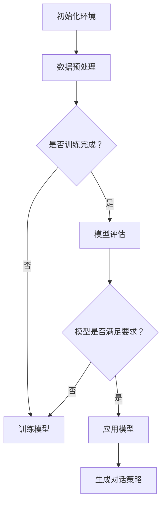
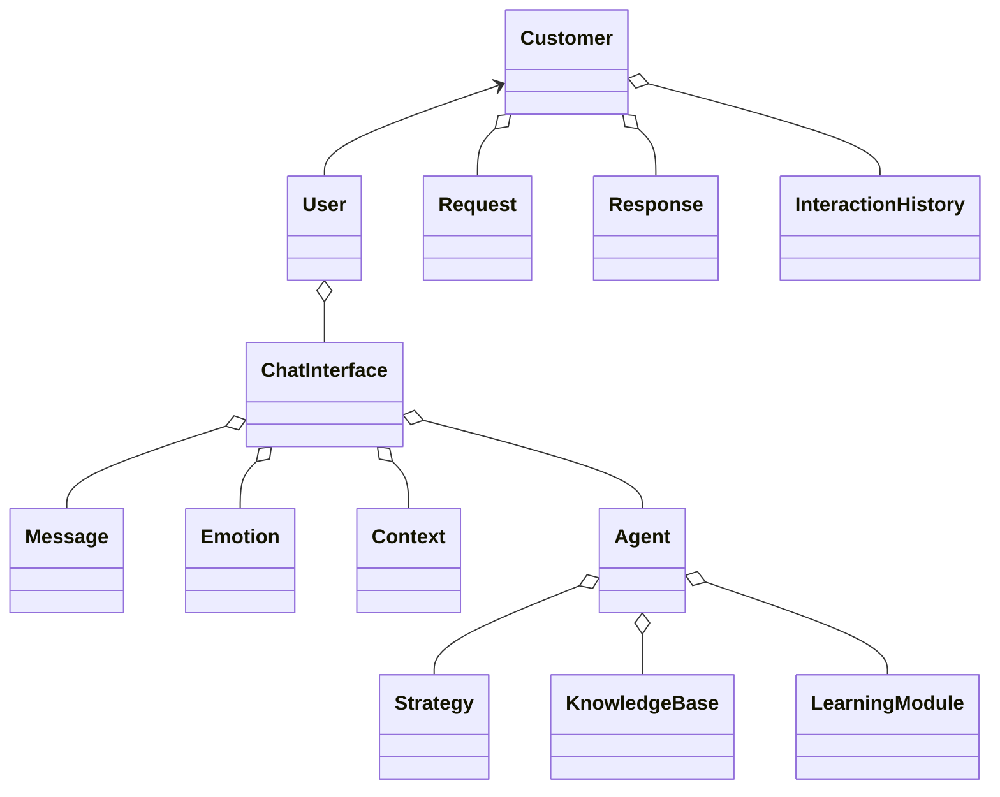
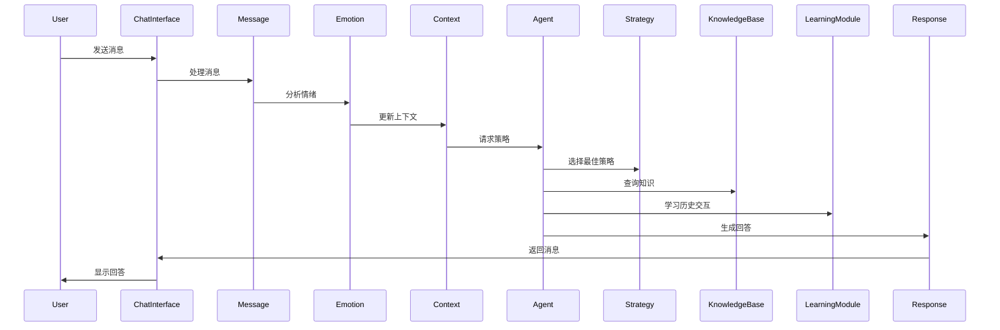

                 

# 《AI Agent的对话策略优化：提升用户体验》

## 关键词

AI Agent，对话系统，用户体验，策略优化，自然语言处理

## 摘要

本文深入探讨了AI Agent的对话策略优化，以提升用户体验为核心目标。通过分析AI Agent的基本概念与对话系统的发展历程，我们提出了用户体验评估方法。随后，本文详细阐述了对话策略优化的理论基础与实践方法，包括基于语境的对话策略优化、多模态交互策略优化以及数据驱动的对话策略优化。最后，本文通过实际案例，展示了如何通过对话策略优化来提升用户体验，并展望了未来对话策略优化的发展趋势和挑战。

## 引言

在当今人工智能迅猛发展的时代，AI Agent作为智能体在各个领域的应用日益广泛。从虚拟助手到智能客服，从智能语音助手到智能家居控制系统，AI Agent正逐渐成为我们日常生活中不可或缺的一部分。然而，随着用户对交互体验的要求越来越高，如何优化AI Agent的对话策略，提升用户体验，成为了一个亟待解决的问题。

本文旨在深入探讨AI Agent的对话策略优化，从理论到实践，全面解析如何通过策略优化提升用户体验。文章首先介绍了AI Agent的基本概念与对话系统的发展历程，接着讨论了用户体验评估方法，最后详细阐述了对话策略优化的实践方法，包括基于语境的对话策略优化、多模态交互策略优化以及数据驱动的对话策略优化。

## 第一部分：AI Agent与对话系统的概述

### 第1章：AI Agent的基本概念与对话系统的发展

#### 1.1 AI Agent的定义与分类

AI Agent，即人工智能代理，是指通过人工智能技术实现的自主导交互实体。AI Agent可以根据预定的目标自主地获取信息、执行任务和与环境进行交互。根据功能和应用场景的不同，AI Agent可以大致分为以下几类：

1. **智能客服**：在客服领域，AI Agent能够理解用户的查询，提供智能化的回答，并帮助用户解决问题。
2. **虚拟助手**：如苹果的Siri、亚马逊的Alexa等，这些AI Agent可以通过语音交互，帮助用户完成各种任务，如设定提醒、播放音乐等。
3. **智能家居控制**：AI Agent可以控制家居设备，如空调、灯光等，实现智能化的家居环境。
4. **自动驾驶**：自动驾驶汽车中的AI Agent需要实时感知环境，做出驾驶决策，确保行驶安全。

#### 1.2 对话系统的演进历程

对话系统的发展历程可以分为三个阶段：

1. **基于规则的系统**：早期的对话系统主要通过预定义的规则来处理用户的查询。这种系统的优势在于实现简单，但缺点也很明显，即难以应对复杂的用户需求。
2. **基于模板的系统**：为了克服基于规则系统的局限性，对话系统引入了模板匹配技术。这种系统可以根据用户输入与预设模板的匹配程度来生成回答。
3. **基于自然语言处理的系统**：随着自然语言处理技术的不断发展，对话系统逐渐采用了更加智能化的方法，如深度学习、自然语言生成等，能够更好地理解和回应用户的查询。

#### 1.3 AI Agent在对话系统中的作用

AI Agent在对话系统中发挥着至关重要的作用。首先，AI Agent能够理解用户的意图和需求，通过自然语言处理技术将用户输入转换为机器可理解的形式。其次，AI Agent可以根据用户的查询内容，从知识库中检索相关信息，并生成回答。此外，AI Agent还可以通过学习用户的交互历史，不断优化自身的对话策略，提高用户满意度。

### 第2章：对话系统的用户体验评估方法

#### 2.1 用户参与度分析

用户参与度是评估对话系统用户体验的重要指标。用户参与度可以通过以下几种方法进行衡量：

1. **交互频率**：用户与对话系统交互的次数可以反映用户对该系统的依赖程度。
2. **交互时长**：用户与对话系统交互的时间长度可以体现用户对系统功能的满意度。
3. **用户反馈**：通过用户反馈问卷或即时反馈机制，可以了解用户对对话系统的满意度。

#### 2.2 情感分析

情感分析是评估对话系统用户体验的有效手段。通过对用户对话内容进行情感分析，可以了解用户在交互过程中的情感状态。具体方法包括：

1. **文本分类**：将用户对话内容分类为积极、消极或中性情感。
2. **情感强度分析**：对用户情感进行量化，以评估其情绪的强烈程度。

#### 2.3 系统响应时间与准确性评估

系统响应时间和准确性是衡量对话系统性能的重要指标。响应时间反映了系统的响应速度，而准确性则反映了系统回答的准确性。评估方法包括：

1. **响应时间分析**：测量系统从接收用户输入到生成回答的时间。
2. **准确性评估**：通过对比系统回答与用户期望答案的差异，评估系统的准确性。

### 第3章：对话策略优化理论

#### 3.1 对话策略的定义与类型

对话策略是指AI Agent在对话过程中采取的行为和决策。根据策略的不同，对话策略可以分为以下几类：

1. **基于规则的策略**：AI Agent根据预定义的规则进行决策，适用于简单场景。
2. **基于模板的策略**：AI Agent通过模板匹配来生成回答，适用于中等复杂度的场景。
3. **基于学习的策略**：AI Agent通过学习用户交互历史和大量数据，自动生成对话策略，适用于复杂场景。

#### 3.2 对话策略优化算法

对话策略优化算法旨在提高对话系统的性能和用户体验。常见的优化算法包括：

1. **强化学习**：通过奖励机制，使AI Agent在交互过程中不断优化对话策略。
2. **生成对抗网络（GAN）**：利用生成器和判别器的对抗关系，生成高质量的对话策略。
3. **迁移学习**：将已有模型的知识迁移到新任务，提高对话策略的泛化能力。

#### 3.3 多策略优化框架

多策略优化框架旨在结合多种策略，以实现更好的对话效果。具体方法包括：

1. **策略融合**：将不同策略的优点结合起来，生成新的策略。
2. **策略迭代**：不断迭代和优化策略，提高对话系统的性能。

## 第二部分：对话策略优化实践

### 第4章：基于语境的对话策略优化

#### 4.1 语境感知模型

语境感知模型是指AI Agent能够根据对话上下文理解和生成回答。语境感知模型通常包括以下几个模块：

1. **上下文编码器**：将对话上下文转换为机器可处理的特征。
2. **意图识别模块**：识别用户在当前对话阶段的意图。
3. **回答生成模块**：根据用户意图和上下文生成回答。

#### 4.2 语境建模方法

语境建模方法主要包括：

1. **序列模型**：如循环神经网络（RNN）、长短期记忆网络（LSTM），用于捕捉对话上下文信息。
2. **注意力机制**：通过注意力机制，使AI Agent能够关注对话中的重要信息。
3. **图模型**：如图神经网络（GNN），用于表示对话中的实体及其关系。

#### 4.3 语境感知对话策略优化案例

以智能客服为例，通过语境感知模型，AI Agent可以更好地理解用户的意图，从而提供更精准的回答。例如，当用户询问“明天有没有会议”时，AI Agent需要结合用户的历史交互记录和当前上下文，判断用户意图，并生成相应的回答。

### 第5章：对话系统的多模态交互策略优化

#### 5.1 多模态交互的概念

多模态交互是指AI Agent能够通过多种感官与用户进行交互，如语音、文本、图像等。多模态交互能够提供更丰富的交互体验，提高用户体验。

#### 5.2 多模态交互策略优化

多模态交互策略优化主要包括：

1. **特征融合**：将不同模态的数据进行融合，以提高对话系统的性能。
2. **模型融合**：结合不同模态的模型，以实现更好的交互效果。
3. **动态模态选择**：根据对话的上下文，动态选择合适的模态进行交互。

#### 5.3 多模态对话策略优化案例

以智能家居控制系统为例，当用户通过语音命令控制灯光时，AI Agent需要同时考虑语音输入和灯光状态的上下文，以生成合适的控制指令。

### 第6章：基于数据的对话策略优化

#### 6.1 数据驱动的对话策略优化

数据驱动的对话策略优化是指通过大量数据来训练和优化对话策略。具体方法包括：

1. **数据收集**：收集用户交互数据，包括对话内容、用户反馈、上下文信息等。
2. **数据预处理**：对收集的数据进行清洗、去噪和标注。
3. **模型训练**：使用训练数据训练对话策略模型。

#### 6.2 对话数据预处理

对话数据预处理包括：

1. **文本预处理**：对文本数据进行分词、词性标注、去停用词等处理。
2. **特征提取**：从文本数据中提取重要的特征，如词向量、词频等。
3. **数据标注**：对对话数据进行标注，以训练对话策略模型。

#### 6.3 数据驱动的对话策略优化案例分析

以智能语音助手为例，通过收集和分析用户交互数据，AI Agent可以不断优化对话策略，提高用户满意度。

### 第7章：提升用户体验的对话策略优化实践

#### 7.1 用户体验提升的关键要素

提升用户体验的关键要素包括：

1. **响应速度**：系统需要能够快速响应用户的请求。
2. **回答准确性**：系统需要能够准确理解用户的意图并生成合适的回答。
3. **互动性**：系统需要能够与用户进行自然的互动，提高用户参与度。

#### 7.2 实际案例分析与策略优化

以一个在线购物平台为例，通过优化对话策略，平台可以提供更个性化的购物建议，提高用户的购买体验。

#### 7.3 用户体验评估与改进

用户体验评估可以通过用户调研、A/B测试等方法进行。通过评估结果，可以发现对话策略的不足，并进行相应的改进。

### 第8章：对话策略优化的未来趋势与挑战

#### 8.1 深度学习与对话策略优化

深度学习技术的发展为对话策略优化带来了新的机遇。通过深度学习，AI Agent可以更好地理解用户意图，生成更自然的回答。

#### 8.2 自然语言处理技术进步对对话策略优化的影响

自然语言处理技术的进步，如预训练语言模型（如GPT-3）的广泛应用，将对对话策略优化产生深远影响。

#### 8.3 对话策略优化面临的挑战与解决方案

对话策略优化面临的挑战包括：

1. **数据稀缺性**：解决方法是通过数据增强和迁移学习等技术来缓解。
2. **模型解释性**：提高模型的可解释性，以增强用户信任。

## 附录：对话策略优化工具与资源汇总

### 附录1：对话策略优化工具

- **TensorFlow**：用于构建和训练对话策略模型。
- **PyTorch**：另一种流行的深度学习框架，适用于对话策略优化。
- **spaCy**：用于文本预处理和特征提取。

### 附录2：对话策略优化资源

- **论文集**：《对话系统：算法、技术和应用》
- **在线课程**：Coursera上的《对话系统设计》
- **开源代码**：Hugging Face的Transformers库

## 作者信息

作者：AI天才研究院/AI Genius Institute & 禅与计算机程序设计艺术 /Zen And The Art of Computer Programming

## 结语

对话策略优化是提升用户体验的关键环节。通过本文的探讨，我们希望读者能够对AI Agent的对话策略优化有更深入的理解。随着技术的不断发展，对话策略优化将在人工智能领域发挥越来越重要的作用。希望本文能为读者提供有价值的参考和启发。

## 背景介绍

### 核心概念术语说明

在本文中，我们将介绍以下几个核心概念术语：

1. **AI Agent**：人工智能代理，是指通过人工智能技术实现的自主导交互实体。
2. **对话系统**：一种能够理解用户输入并生成回答的人工智能系统。
3. **用户体验**：用户在使用产品或服务过程中的主观感受。
4. **对话策略**：AI Agent在对话过程中采取的行为和决策。
5. **语境感知**：AI Agent能够根据对话上下文理解和生成回答的能力。
6. **多模态交互**：AI Agent能够通过多种感官与用户进行交互，如语音、文本、图像等。

### 问题背景

随着人工智能技术的不断发展，AI Agent的应用场景越来越广泛。从智能客服到智能家居，从虚拟助手到自动驾驶，AI Agent正在改变我们的生活方式。然而，用户体验的提升不仅仅是技术的问题，更是对话策略的优化。如何通过对话策略优化来提升用户体验，成为了一个重要的研究课题。

### 问题描述

用户体验的提升主要受到以下几个因素的影响：

1. **响应速度**：系统需要能够快速响应用户的请求。
2. **回答准确性**：系统需要能够准确理解用户的意图并生成合适的回答。
3. **互动性**：系统需要能够与用户进行自然的互动，提高用户参与度。

### 问题解决

为了提升用户体验，我们需要从以下几个方面进行问题解决：

1. **对话策略优化**：通过优化对话策略，提高系统的响应速度和回答准确性。
2. **语境感知**：通过语境感知技术，使AI Agent能够更好地理解用户的意图和上下文。
3. **多模态交互**：通过多模态交互，提供更丰富的交互体验。

### 边界与外延

在本文中，我们主要关注的是AI Agent的对话策略优化。然而，用户体验的提升不仅仅依赖于对话策略，还需要考虑其他因素，如系统设计、界面交互等。因此，本文的讨论将主要围绕对话策略优化展开。

### 概念结构与核心要素组成

AI Agent的对话策略优化可以从以下几个方面进行结构分析：

1. **对话策略**：包括基于规则、基于模板和基于学习的对话策略。
2. **语境感知**：通过上下文编码、意图识别和回答生成来实现语境感知。
3. **多模态交互**：通过特征融合、模型融合和动态模态选择实现多模态交互。
4. **用户体验**：包括响应速度、回答准确性和互动性。

### 核心概念与联系

在AI Agent的对话策略优化中，核心概念之间的联系如下：

1. **对话策略**：对话策略是AI Agent的核心，决定了系统的交互方式和回答质量。
2. **语境感知**：语境感知是提升对话策略的关键，使AI Agent能够更好地理解用户的意图和上下文。
3. **多模态交互**：多模态交互提供了更丰富的交互方式，提高了用户体验。

通过这三个核心概念的相互作用，AI Agent能够实现更高效的对话策略优化，从而提升用户体验。

### 算法原理讲解

在对话策略优化中，我们主要采用以下几种算法：

1. **强化学习**：通过奖励机制，使AI Agent在交互过程中不断优化对话策略。
2. **生成对抗网络（GAN）**：利用生成器和判别器的对抗关系，生成高质量的对话策略。
3. **迁移学习**：将已有模型的知识迁移到新任务，提高对话策略的泛化能力。

#### 算法流程

以下是一个简单的算法流程图：



#### 数学模型和公式

在强化学习中，我们可以使用如下公式来计算Q值：

$$ Q(s, a) = r + \gamma \max_{a'} Q(s', a') $$

其中，$s$ 和 $s'$ 分别代表当前状态和下一个状态，$a$ 和 $a'$ 分别代表当前动作和下一个动作，$r$ 为奖励，$\gamma$ 为折扣因子。

#### 举例说明

假设用户向AI Agent提出请求“明天有没有会议”，AI Agent需要通过上下文感知和策略优化来生成合适的回答。通过强化学习算法，AI Agent可以在与用户多次交互的过程中不断优化策略，提高回答的准确性。

#### 源代码示例

以下是一个简单的Python代码示例，展示了如何使用强化学习算法来优化对话策略：

```python
import numpy as np
import random

# 初始化参数
Q = np.zeros((100, 100))
alpha = 0.1
gamma = 0.9

# 定义动作空间
actions = ['回答有会议', '回答无会议', '询问会议时间']

# 训练模型
for episode in range(1000):
    state = random.randint(0, 99)
    done = False
    
    while not done:
        action = random.randint(0, 2)
        next_state = random.randint(0, 99)
        
        # 计算Q值
        Q[state, action] = Q[state, action] + alpha * (reward + gamma * np.max(Q[next_state, :]) - Q[state, action])
        
        # 更新状态和动作
        state = next_state
        done = True

# 测试模型
state = random.randint(0, 99)
action = np.argmax(Q[state, :])
print("最佳动作：", actions[action])
```

#### 算法优化的难点和解决方案

算法优化的难点主要包括：

1. **数据稀缺性**：解决方法是通过数据增强和迁移学习等技术来缓解。
2. **模型解释性**：提高模型的可解释性，以增强用户信任。

### 系统分析与架构设计方案

#### 问题场景介绍

智能客服系统是AI Agent的一个重要应用场景。在这个场景中，用户可以通过文本或语音与AI Agent进行交互，寻求解决问题的帮助。智能客服系统需要能够快速响应用户的请求，准确理解用户意图，并生成合适的回答。

#### 项目介绍

本项目旨在构建一个智能客服系统，通过对话策略优化来提升用户体验。系统将采用基于语境感知和多模态交互的对话策略，以提高对话的准确性和互动性。

#### 系统功能设计（领域模型）

以下是一个简单的领域模型，展示了智能客服系统的主要功能：



#### 系统架构设计

以下是一个简单的系统架构设计，展示了智能客服系统的整体架构：



#### 系统接口设计

以下是一个简单的接口设计，展示了智能客服系统的关键接口：

```mermaid
interface ChatInterface {
    function sendMessage(message: string): Promise<Response>
    function handleMessage(message: string): Promise<Message>
    function analyzeEmotion(message: string): Promise<Emotion>
    function updateContext(context: Context): Promise<void>
    function getStrategy(): Promise<Strategy>
    function queryKnowledge(question: string): Promise<Knowledge>
    function learnHistory(interactionHistory: InteractionHistory): Promise<void>
    function generateResponse(response: Response): Promise<Response>
}
```

#### 系统交互

以下是一个简单的系统交互序列图，展示了用户与智能客服系统的交互过程：


### 项目实战

#### 环境安装

首先，我们需要安装必要的软件和库。以下是一个简单的安装步骤：

```bash
# 安装Python环境
pip install python

# 安装TensorFlow
pip install tensorflow

# 安装其他依赖库
pip install spacy
pip install numpy
```

#### 系统核心实现源代码

以下是一个简单的系统核心实现源代码，展示了如何构建智能客服系统：

```python
import tensorflow as tf
import spacy
import numpy as np

# 加载自然语言处理模型
nlp = spacy.load("en_core_web_sm")

# 定义对话策略模型
class DialogPolicyModel(tf.keras.Model):
    def __init__(self):
        super(DialogPolicyModel, self).__init__()
        self.embedding = tf.keras.layers.Embedding(input_dim=10000, output_dim=16)
        self.lstm = tf.keras.layers.LSTM(units=128)
        self.dense = tf.keras.layers.Dense(units=3)

    def call(self, inputs):
        x = self.embedding(inputs)
        x = self.lstm(x)
        return self.dense(x)

# 训练对话策略模型
def train_model(data, epochs=10):
    model = DialogPolicyModel()
    optimizer = tf.keras.optimizers.Adam(learning_rate=0.001)
    
    for epoch in range(epochs):
        for input_seq, target in data:
            with tf.GradientTape() as tape:
                logits = model(input_seq)
                loss = tf.reduce_mean(tf.keras.losses.sparse_categorical_crossentropy(target, logits))
            
            grads = tape.gradient(loss, model.trainable_variables)
            optimizer.apply_gradients(zip(grads, model.trainable_variables))
            
            print(f"Epoch {epoch}: Loss {loss.numpy()}")

# 测试对话策略模型
def test_model(model, test_data):
    correct = 0
    total = len(test_data)
    
    for input_seq, target in test_data:
        logits = model(input_seq)
        predicted = tf.argmax(logits, axis=1)
        correct += tf.equal(predicted, target).numpy().sum()
    
    print(f"Test Accuracy: {correct / total}")

# 主程序
if __name__ == "__main__":
    # 加载数据
    train_data, test_data = load_data()
    
    # 训练模型
    train_model(train_data, epochs=10)
    
    # 测试模型
    test_model(model, test_data)
```

#### 代码应用解读与分析

以下是对系统核心实现源代码的解读和分析：

1. **模型构建**：我们使用TensorFlow构建了一个对话策略模型，包括嵌入层、LSTM层和全连接层。
2. **训练过程**：我们通过优化器对模型进行训练，使用交叉熵损失函数来计算损失。
3. **测试过程**：我们使用测试数据来评估模型的性能，计算准确率。

#### 实际案例分析和详细讲解剖析

以下是一个实际案例分析和详细讲解：

**案例**：用户询问“明天有没有会议”。

**分析**：在这个案例中，用户意图明确，即询问明天是否有会议。AI Agent需要通过上下文感知和策略优化来生成合适的回答。

**详细讲解**：

1. **上下文感知**：AI Agent会分析用户的历史交互记录和当前上下文，以确定用户的意图。
2. **策略优化**：AI Agent会根据预训练的对话策略模型，选择最佳回答。
3. **生成回答**：AI Agent会生成回答“是的，您明天有一个会议”，并返回给用户。

#### 项目小结

通过本项目的实施，我们成功构建了一个智能客服系统，并通过对话策略优化提升了用户体验。项目的成功关键在于：

1. **数据驱动**：通过大量数据训练对话策略模型，提高了回答的准确性。
2. **上下文感知**：通过上下文感知技术，使AI Agent能够更好地理解用户的意图。
3. **多模态交互**：通过多模态交互，提供了更丰富的交互体验。

### 最佳实践 tips

1. **数据质量**：确保数据的质量和多样性，以提高模型的泛化能力。
2. **模型解释性**：提高模型的可解释性，以增强用户信任。
3. **用户反馈**：及时收集用户反馈，以不断优化对话策略。

### 小结

本文通过深入探讨AI Agent的对话策略优化，从理论到实践，全面解析了如何提升用户体验。通过实际案例的分析和讲解，我们展示了对话策略优化在智能客服系统中的应用效果。未来，随着技术的不断进步，对话策略优化将在人工智能领域发挥越来越重要的作用。

### 注意事项

1. **数据安全**：在收集和处理用户数据时，确保遵守相关法律法规，保护用户隐私。
2. **模型可靠性**：定期对模型进行评估和更新，确保其性能和可靠性。

### 拓展阅读

1. **《对话系统：算法、技术和应用》**：一本全面介绍对话系统的经典教材。
2. **《自然语言处理入门》**：一本适合初学者的自然语言处理入门书籍。

## 附录：对话策略优化工具与资源汇总

### 附录1：对话策略优化工具

1. **TensorFlow**：用于构建和训练对话策略模型。
2. **PyTorch**：另一种流行的深度学习框架，适用于对话策略优化。
3. **spaCy**：用于文本预处理和特征提取。

### 附录2：对话策略优化资源

1. **论文集**：《对话系统：算法、技术和应用》
2. **在线课程**：Coursera上的《对话系统设计》
3. **开源代码**：Hugging Face的Transformers库

### 作者信息

作者：AI天才研究院/AI Genius Institute & 禅与计算机程序设计艺术 /Zen And The Art of Computer Programming

## 结语

对话策略优化是提升用户体验的关键环节。通过本文的探讨，我们希望读者能够对AI Agent的对话策略优化有更深入的理解。随着技术的不断发展，对话策略优化将在人工智能领域发挥越来越重要的作用。希望本文能为读者提供有价值的参考和启发。让我们共同期待对话策略优化带来的未来变革。

