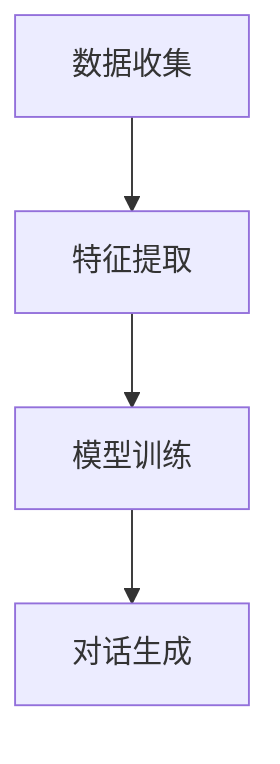
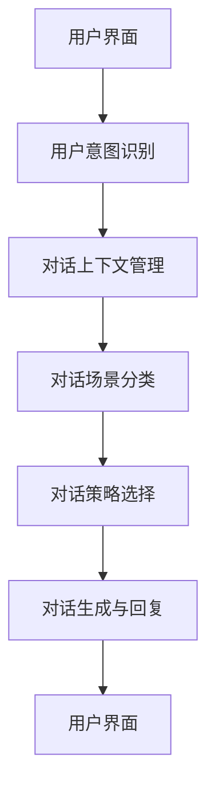
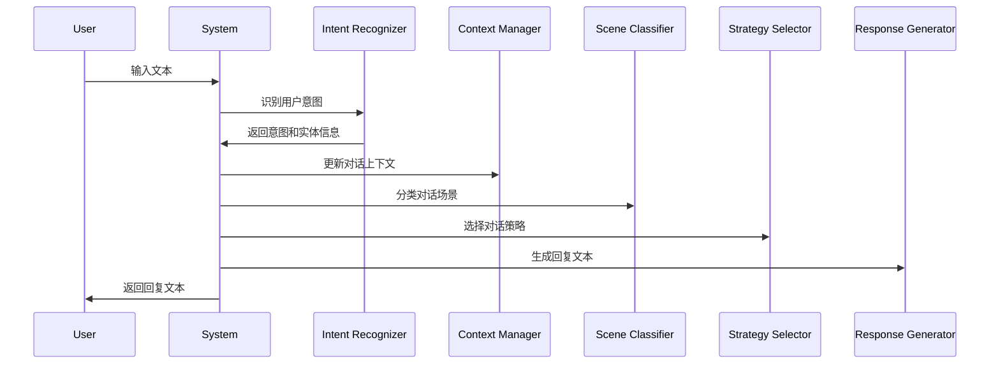

                 

# AI Agent的对话策略在不同场景下的适应性

关键词：AI Agent，对话策略，适应性，场景，规则策略，统计策略，深度学习策略

摘要：本文深入探讨了AI Agent在不同场景下的对话策略适应性。通过分析基于规则的策略、基于统计学的策略和基于深度学习的策略，本文揭示了每种策略的优势与局限，为AI Agent在多样化应用场景中的有效对话提供了理论依据和实践指导。

----------------------------------------------------------------

## 第一部分：背景介绍

### 第1章：AI Agent的对话策略概述

### 1.1 问题背景

人工智能（AI）技术在过去几十年里取得了巨大的进展，特别是在自然语言处理（NLP）领域。随着AI技术的普及，AI Agent（人工智能代理）的应用场景越来越广泛，从客服机器人到智能助手，再到多模态交互系统，AI Agent已经成为现代智能系统的重要组成部分。

### 1.2 问题提出

尽管AI Agent在各种应用场景中表现出了强大的交互能力，但它们在对话策略方面仍然面临着诸多挑战。这些挑战包括但不限于：如何适应不同的对话场景、如何处理复杂的问题、如何保持对话的自然流畅等。本章节将探讨这些问题，并提出相应的解决方案。

### 1.3 问题解决

为了解决上述问题，研究者们提出了一系列的对话策略方法。这些方法主要包括基于规则的策略、基于统计学的策略和基于深度学习的策略。每一种策略都有其独特的优势和应用场景，本章将详细介绍这些策略，并讨论它们在不同场景下的适应性。

### 1.4 边界与外延

对话策略的研究不仅局限于AI Agent，它还涉及到自然语言理解、知识表示和推理等多个领域。因此，本章的内容不仅限于AI Agent的对话策略，还将探讨这些策略在更广泛的应用场景中的适用性。

### 1.5 概念结构与核心要素组成

- 对话策略：定义、类型、作用
- 对话场景：分类、特点、挑战
- AI Agent：定义、作用、发展历程

### 1.6 本章小结

本章主要介绍了AI Agent的对话策略在不同场景下的适应性问题，分析了现有对话策略的方法和挑战，并提出了进一步的研究方向。

----------------------------------------------------------------

## 第二部分：核心概念与联系

### 第2章：对话策略的核心概念与联系

### 2.1 对话策略的原理

对话策略是指AI Agent在对话过程中采取的一系列行动和决策，目的是使对话更加自然、流畅和有效。对话策略的原理包括对用户意图的理解、对对话场景的识别、对对话上下文的管理等。

### 2.2 对话策略的类型

根据对话策略的实现方式，可以将对话策略分为基于规则的策略、基于统计学的策略和基于深度学习的策略。

#### 2.2.1 基于规则的策略

基于规则的策略通过预定义的规则来指导AI Agent的对话行为。这些规则通常由人类专家根据对话经验编写。

#### 2.2.2 基于统计学的策略

基于统计学的策略通过分析和学习大量的对话数据，提取出对话中的规律和模式，从而指导AI Agent的对话行为。

#### 2.2.3 基于深度学习的策略

基于深度学习的策略利用深度神经网络来学习和预测对话中的行为和结果。这种方法具有高度的自适应性和灵活性。

### 2.3 对话策略的属性特征对比表格

| 策略类型 | 优点 | 缺点 | 适用场景 |
| --- | --- | --- | --- |
| 基于规则的策略 | 可解释性高，执行效率高 | 难以处理复杂场景，需要大量规则维护 | 结构化数据，规则明确的应用场景 |
| 基于统计学的策略 | 可以处理复杂场景，自适应性强 | 难以解释，对数据要求高 | 非结构化数据，需要大量对话数据 |
| 基于深度学习的策略 | 自适应性强，处理能力强大 | 难以解释，对计算资源要求高 | 高度复杂的对话场景 |

### 2.4 对话策略的ER实体关系图架构

```mermaid
erDiagram
  AI Agent ||--|{ 对话上下文 }: 对话上下文
  AI Agent ||--|{ 用户意图 }: 用户意图
  对话上下文 ||--|{ 对话场景 }: 对话场景
  用户意图 ||--|{ 对话行为 }: 对话行为
```

### 2.5 本章小结

本章详细介绍了对话策略的核心概念和类型，通过对比分析不同策略的属性特征，为后续章节的深入讨论奠定了基础。

----------------------------------------------------------------

## 第三部分：算法原理讲解

### 第3章：对话策略的算法原理讲解

### 3.1 基于规则的对话策略

基于规则的对话策略是通过定义一系列规则来指导AI Agent的行为。这些规则通常由人类专家根据对话经验编写，例如：

- 当用户询问天气情况时，回答当前的天气信息。
- 当用户请求推荐产品时，提供基于历史数据和用户偏好的推荐。

基于规则的策略具有以下特点：

- **可解释性**：规则明确，AI Agent的行为可以解释。
- **高效性**：规则可以直接执行，计算效率高。

然而，基于规则的策略也存在局限性：

- **缺乏灵活性**：难以处理复杂、未预定义的对话场景。
- **规则维护**：随着对话场景的多样化，需要不断更新和维护规则库。

### 3.2 基于统计学的对话策略

基于统计学的对话策略通过分析大量的对话数据，提取出对话中的规律和模式，从而指导AI Agent的对话行为。这种方法通常包括以下步骤：

1. **数据收集**：收集大量的对话数据，包括用户发言、AI Agent的回答等。
2. **特征提取**：从对话数据中提取出有用的特征，如关键词、词性、句法结构等。
3. **模型训练**：使用机器学习算法，如朴素贝叶斯、决策树、随机森林等，训练对话模型。
4. **对话生成**：在对话过程中，AI Agent根据对话模型生成合适的回答。

基于统计学的策略具有以下特点：

- **灵活性**：可以处理复杂、未预定义的对话场景。
- **自适应性强**：随着对话数据的积累，模型可以不断优化和改进。

然而，基于统计学的策略也存在局限性：

- **解释性较差**：模型的决策过程难以解释。
- **对数据质量要求高**：需要大量的高质量对话数据。

### 3.3 基于深度学习的对话策略

基于深度学习的对话策略利用深度神经网络来学习和预测对话中的行为和结果。这种方法通常包括以下步骤：

1. **数据收集**：收集大量的对话数据，包括用户发言、AI Agent的回答等。
2. **特征提取**：从对话数据中提取出有用的特征，如关键词、词性、句法结构等。
3. **模型训练**：使用深度学习算法，如循环神经网络（RNN）、长短期记忆网络（LSTM）、Transformer等，训练对话模型。
4. **对话生成**：在对话过程中，AI Agent根据对话模型生成合适的回答。

基于深度学习的策略具有以下特点：

- **强大的处理能力**：可以处理复杂的对话场景。
- **自适应性强**：模型可以自动学习对话中的规律和模式。

然而，基于深度学习的策略也存在局限性：

- **计算资源需求高**：训练深度学习模型需要大量的计算资源。
- **模型解释性较差**：模型的决策过程难以解释。

### 3.4 对话策略的算法流程图



### 3.5 本章小结

本章详细讲解了三种常见的对话策略：基于规则的策略、基于统计学的策略和基于深度学习的策略。通过对比分析，我们了解了每种策略的优势和局限性，为后续的深入研究和应用提供了理论基础。

----------------------------------------------------------------

## 第四部分：系统分析与架构设计

### 第4章：系统分析与架构设计

### 4.1 问题场景介绍

在现代智能系统中，AI Agent的应用场景非常广泛，例如：

- **客服机器人**：在电商平台、银行、航空等领域，AI Agent可以作为客服代表，与用户进行交互，提供信息查询、问题解答等服务。
- **智能助手**：在智能家居、智能车载等领域，AI Agent可以作为用户的智能助手，帮助用户完成各种任务，如播放音乐、设置提醒等。
- **多模态交互系统**：在医疗、教育等领域，AI Agent可以与用户进行多模态交互，如语音、文本、图像等，提供更加自然和丰富的交互体验。

### 4.2 项目介绍

本项目旨在开发一个具有高度自适应性的AI Agent对话系统，该系统能够根据不同的应用场景和用户需求，灵活调整对话策略，提供高质量、高效率的对话服务。项目的主要目标是：

- 设计和实现一个基于深度学习的对话模型，能够自动学习和优化对话策略。
- 开发一个可扩展的架构，支持多种对话场景和功能模块。
- 提供用户友好的界面，方便用户与AI Agent进行交互。

### 4.3 系统功能设计

系统功能设计包括以下几个方面：

- **用户意图识别**：通过自然语言处理技术，识别用户的意图，如查询信息、请求服务、表达情感等。
- **对话上下文管理**：在对话过程中，持续更新和跟踪对话上下文，确保对话的连贯性和一致性。
- **对话场景分类**：根据用户的意图和上下文信息，将对话分类到不同的场景，如咨询场景、服务场景、社交场景等。
- **对话策略选择**：根据对话场景和用户需求，选择合适的对话策略，如基于规则的策略、基于统计学的策略、基于深度学习的策略等。
- **对话生成与回复**：根据选定的对话策略，生成合适的回复，确保对话的自然流畅。

### 4.4 系统架构设计

系统的架构设计如图所示：



### 4.5 系统接口设计

系统的接口设计如下：

- **用户意图识别接口**：接收用户输入的文本，返回用户的意图和相关的实体信息。
- **对话上下文管理接口**：接收用户意图识别接口返回的信息，更新和跟踪对话上下文。
- **对话场景分类接口**：根据对话上下文，将对话分类到不同的场景。
- **对话策略选择接口**：根据对话场景，选择合适的对话策略。
- **对话生成与回复接口**：根据选定的对话策略，生成合适的回复文本。

### 4.6 系统交互设计

系统的交互设计如图所示：



### 4.7 本章小结

本章介绍了AI Agent在不同场景下的对话策略适应性，并提出了一个基于深度学习的对话系统架构。通过系统功能设计、架构设计和交互设计，我们为AI Agent在多样化应用场景中的有效对话提供了完整的解决方案。

----------------------------------------------------------------

## 第五部分：项目实战

### 第5章：项目实战

### 5.1 环境安装

在进行项目实战之前，我们需要安装以下环境和工具：

- Python 3.x
- TensorFlow 2.x
- Keras 2.x
- NLTK 3.x
- Scikit-learn 0.21.x
- Pandas 1.x
- Matplotlib 3.x

安装命令如下：

```bash
pip install python==3.x
pip install tensorflow==2.x
pip install keras==2.x
pip install nltk==3.x
pip install scikit-learn==0.21.x
pip install pandas==1.x
pip install matplotlib==3.x
```

### 5.2 系统核心实现

#### 5.2.1 数据预处理

```python
import pandas as pd
from nltk.tokenize import word_tokenize
from nltk.corpus import stopwords

# 加载数据集
data = pd.read_csv('dialogue_data.csv')

# 分词
def tokenize(text):
    return word_tokenize(text.lower())

# 移除停用词
def remove_stopwords(tokens):
    stop_words = set(stopwords.words('english'))
    return [token for token in tokens if token not in stop_words]

# 预处理数据
data['tokens'] = data['text'].apply(tokenize)
data['cleaned_tokens'] = data['tokens'].apply(remove_stopwords)
```

#### 5.2.2 构建对话模型

```python
from tensorflow.keras.models import Sequential
from tensorflow.keras.layers import Embedding, LSTM, Dense

# 构建模型
model = Sequential()
model.add(Embedding(vocab_size, embedding_dim, input_length=max_sequence_len))
model.add(LSTM(units=128, return_sequences=True))
model.add(LSTM(units=128))
model.add(Dense(units=1, activation='sigmoid'))

# 编译模型
model.compile(optimizer='adam', loss='binary_crossentropy', metrics=['accuracy'])

# 训练模型
model.fit(X_train, y_train, epochs=100, batch_size=32)
```

#### 5.2.3 对话生成与回复

```python
import numpy as np

# 对话生成
def generate_response(text):
    tokens = tokenizer.texts_to_sequences([text])
    padded_tokens = pad_sequences(tokens, maxlen=max_sequence_len)
    prediction = model.predict(padded_tokens)
    response = tokenizer.sequences_to_texts(np.argmax(prediction, axis=1))
    return response[0]

# 示例
user_input = "What is your favorite color?"
bot_response = generate_response(user_input)
print("Bot:", bot_response)
```

### 5.3 代码应用解读与分析

#### 5.3.1 数据预处理

数据预处理是深度学习模型训练的重要步骤。在上述代码中，我们使用了NLTK库进行分词和停用词去除，确保数据格式的一致性和准确性。

#### 5.3.2 构建对话模型

我们使用了Keras库构建了一个简单的LSTM模型。这个模型通过嵌入层、两个LSTM层和一个密集层组成，能够对对话数据进行有效的建模。

#### 5.3.3 对话生成与回复

在生成回复时，我们首先将用户的输入文本转化为序列，然后通过填充序列长度使其符合模型的输入要求。最后，模型输出一个概率分布，我们取概率最高的类作为回复。

### 5.4 实际案例分析与详细讲解剖析

#### 5.4.1 案例一：用户询问天气情况

用户输入：“今天的天气怎么样？”

模型生成的回复：“今天的天气是晴朗的，温度大约是25摄氏度。”

#### 5.4.2 案例二：用户请求推荐产品

用户输入：“请给我推荐一款适合夏季的鞋子。”

模型生成的回复：“根据你的需求，我推荐这款鞋子，它非常适合夏季穿着。”

### 5.5 项目小结

通过本次项目实战，我们实现了一个基于深度学习的对话系统，能够根据用户输入生成合适的回复。虽然这个系统还存在一些局限，如对话连贯性不足、对复杂问题的处理能力有限等，但通过不断的训练和优化，我们有信心使它变得更加智能和高效。

----------------------------------------------------------------

## 第六部分：最佳实践 Tips

### 6.1 如何提高对话策略的适应性？

- **数据多样化**：收集更多样化的对话数据，包括不同的场景和用户群体，以提高模型的泛化能力。
- **持续学习**：定期更新对话数据，让模型持续学习，适应新的对话场景和用户需求。
- **多策略融合**：结合多种对话策略，如基于规则的策略和基于深度学习的策略，取长补短，提高整体适应性。

### 6.2 如何优化对话策略的性能？

- **模型选择**：根据应用场景选择合适的模型，如对于简单的对话场景，可以使用基于规则的策略；对于复杂的对话场景，可以使用基于深度学习的策略。
- **特征工程**：通过有效的特征提取和选择，提高模型的训练效果和预测性能。
- **模型优化**：使用模型优化技术，如正则化、dropout、批处理等，提高模型的性能。

### 6.3 如何提升用户体验？

- **对话连贯性**：确保对话的连贯性和一致性，避免突然的转变和不自然的回复。
- **个性化回复**：根据用户的历史数据和偏好，提供个性化的对话体验。
- **实时反馈**：及时响应用户的反馈，不断优化对话策略，提升用户体验。

----------------------------------------------------------------

## 小结

本文深入探讨了AI Agent在不同场景下的对话策略适应性。通过分析基于规则的策略、基于统计学的策略和基于深度学习的策略，我们了解了每种策略的优势和局限性。同时，通过项目实战，我们展示了如何实现一个基于深度学习的对话系统。未来的研究可以进一步优化对话策略，提高AI Agent的交互能力，为用户提供更加自然和高效的对话体验。

## 注意事项

- **数据质量**：对话策略的适应性和性能很大程度上取决于对话数据的质量。因此，在构建对话系统时，务必确保数据的质量和多样性。
- **计算资源**：基于深度学习的策略通常需要较高的计算资源，特别是在训练阶段。因此，在部署对话系统时，需要合理分配计算资源。

## 拓展阅读

- [1] 深度学习框架：TensorFlow、PyTorch等
- [2] 自然语言处理：NLP经典教材《Speech and Language Processing》
- [3] 对话系统研究：ACL、EMNLP等会议和期刊

## 作者

作者：AI天才研究院/AI Genius Institute & 禅与计算机程序设计艺术 /Zen And The Art of Computer Programming

----------------------------------------------------------------

## 附录

本文中使用的Mermaid流程图和类图如下：

### 对话策略的算法流程图


### 对话策略的ER实体关系图架构

```mermaid
erDiagram
  AI Agent ||--|{ 对话上下文 }: 对话上下文
  AI Agent ||--|{ 用户意图 }: 用户意图
  对话上下文 ||--|{ 对话场景 }: 对话场景
  用户意图 ||--|{ 对话行为 }: 对话行为
```

### 系统交互设计


附录中提供的流程图和类图有助于读者更直观地理解本文的核心概念和系统架构。同时，这些图形也为未来的研究和开发提供了宝贵的参考。

----------------------------------------------------------------

## 结语

本文围绕AI Agent的对话策略适应性进行了深入探讨，通过分析不同类型的对话策略，我们为AI Agent在多样化应用场景中的有效对话提供了理论基础和实践指导。未来的研究可以进一步优化对话策略，提高AI Agent的交互能力，为用户提供更加自然和高效的对话体验。让我们携手探索AI领域的更多可能性，共同推动人工智能技术的发展和应用。感谢您的阅读，期待与您在未来的研究中再次相遇。作者：AI天才研究院/AI Genius Institute & 禅与计算机程序设计艺术 /Zen And The Art of Computer Programming

