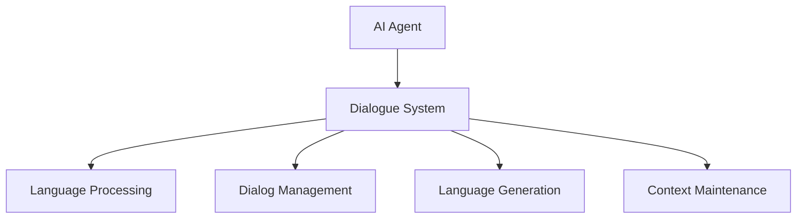
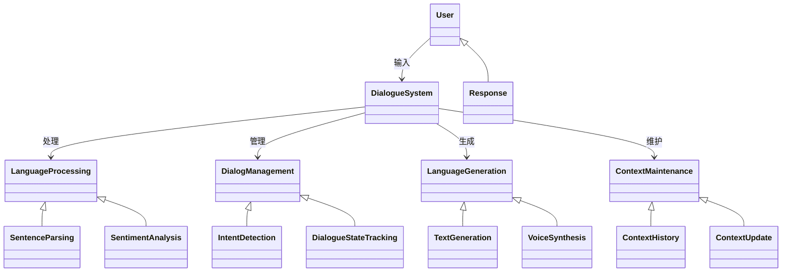
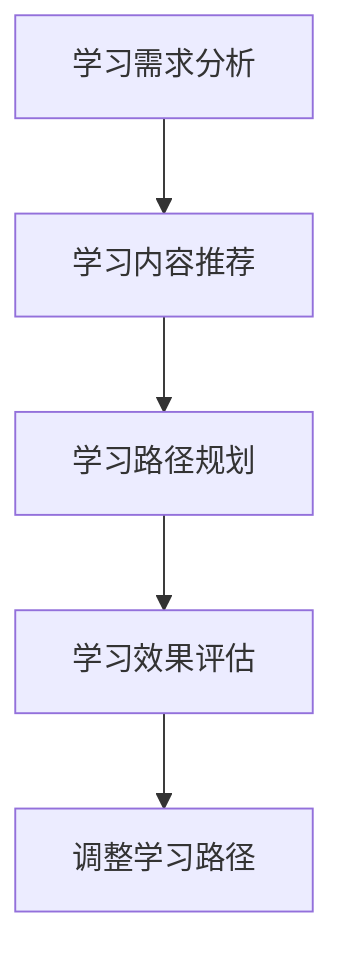

                 

### 第一部分：引言

#### 第1章：背景与概述

##### 1.1 个性化教育的现状

个性化教育是一种以学生为中心的教育理念，旨在根据每个学生的个体差异，提供量身定制的教育资源和教学方式。随着科技的进步，特别是人工智能（AI）技术的快速发展，个性化教育迎来了前所未有的变革。当前，个性化教育的应用主要集中在以下几个方面：

1. **学习内容个性化**：通过AI技术分析学生的学习行为和学习效果，为学生推荐适合其学习水平、兴趣和需求的学习内容。
2. **学习方式个性化**：根据学生的个性和学习风格，提供个性化的学习路径和教学策略，例如个性化作业、个性化辅导等。
3. **学习评价个性化**：通过多维度的评价体系，全面了解学生的学习状况，提供个性化的反馈和建议。

##### 1.2 AI Agent的定义与发展

AI Agent，又称智能代理，是指能够代表人类在特定环境中执行任务的人工智能实体。AI Agent的核心特点包括自主性、交互性和适应性。其发展经历了从规则驱动到基于数据和机器学习，再到现在的自适应和强化学习的演变过程。AI Agent在个性化教育中的应用主要体现在以下几个方面：

1. **自主学习与适应**：AI Agent可以根据学生的学习情况自动调整教学策略，实现真正的个性化教学。
2. **智能交互与反馈**：AI Agent能够与学生学习互动，提供即时、个性化的反馈，帮助学生更好地理解和掌握知识。
3. **自适应学习路径规划**：AI Agent可以根据学生的学习进度和效果，动态调整学习计划，确保学生始终在适合自己的学习路径上。

##### 1.3 对话系统在个性化教育中的应用前景

对话系统是指能够理解和生成自然语言，与人类进行有效沟通的人工智能系统。对话系统在个性化教育中的应用前景广阔，主要体现在以下几个方面：

1. **智能辅导与问答**：通过对话系统，学生可以随时随地获得个性化、即时的学习帮助和解答疑问。
2. **个性化学习评估**：对话系统可以根据学生的回答情况，评估其学习效果，提供针对性的建议和反馈。
3. **学习情境模拟**：通过对话系统，学生可以模拟真实的交流场景，提升语言表达和沟通能力。

总之，AI Agent的对话系统在个性化教育中的应用，不仅能够提高教学效果，还能够促进学生的学习兴趣和积极性，是未来教育发展的一个重要方向。在接下来的章节中，我们将深入探讨AI Agent、对话系统和个性化教育的核心概念、原理及其实际应用。

#### 第2章：核心概念与联系

##### 2.1 AI Agent的核心概念

AI Agent是人工智能领域的一个重要概念，它代表了能够自主执行任务并与环境进行交互的智能实体。以下是AI Agent的核心概念和属性：

1. **自主性**：AI Agent能够在没有外部干预的情况下，独立完成预定的任务。这种自主性是通过机器学习和深度学习算法实现的。
2. **交互性**：AI Agent能够理解用户的输入，并以自然语言的形式进行回应。这种交互性依赖于自然语言处理（NLP）和语音识别技术。
3. **适应性**：AI Agent可以根据环境和用户的需求，动态调整其行为和策略。这种适应性是通过强化学习和自我优化算法实现的。

##### 2.2 对话系统的组成与工作原理

对话系统是AI Agent的核心组成部分之一，它是实现人机交互的关键。以下是对话系统的基本组成和工作原理：

1. **语言理解**：对话系统需要理解用户输入的自然语言，这通常通过NLP技术实现，包括词法分析、句法分析和语义分析等。
2. **对话管理**：对话系统需要管理整个对话过程，包括理解用户意图、生成响应和维持对话流畅性。对话管理通常采用图灵测试、马尔可夫决策过程（MDP）和生成对抗网络（GAN）等技术。
3. **语言生成**：对话系统需要生成自然的语言响应，这可以通过模板匹配、序列到序列模型（Seq2Seq）和生成对抗网络（GAN）等实现。
4. **上下文维护**：对话系统需要维护对话的历史上下文，以便更好地理解用户意图和生成相关的响应。

##### 2.3 个性化教育的原理与实践

个性化教育是一种以学生为中心的教育理念，旨在通过差异化的教学方法和内容，满足每个学生的个体需求。以下是个性化教育的核心原理和实践：

1. **学生需求分析**：通过数据分析和学习行为监测，了解每个学生的学习需求、兴趣和弱点。
2. **学习内容个性化**：根据学生的需求，推荐适合其学习水平、兴趣和需求的学习内容和资源。
3. **教学策略个性化**：根据学生的个性和学习风格，采用不同的教学策略，如互动式教学、项目式学习和协作学习等。
4. **学习效果评估**：通过多维度的评价体系，全面了解学生的学习效果，并提供个性化的反馈和建议。

##### 2.4 Mermaid实体关系图：AI Agent与对话系统的联系

为了更清晰地理解AI Agent与对话系统的关系，我们可以使用Mermaid绘制一个实体关系图。以下是该图的Markdown格式：



在这个实体关系图中，AI Agent是整个系统的核心，它通过对话系统与用户进行交互。对话系统包括语言处理、对话管理、语言生成和上下文维护等模块，这些模块共同协作，实现智能交互和个性化教育。

通过本章的介绍，我们了解了AI Agent、对话系统和个性化教育的核心概念和联系。在接下来的章节中，我们将进一步探讨对话系统的技术实现、AI Agent在个性化教育中的应用，以及相关的最佳实践和未来展望。

---

#### 第3章：对话系统技术

##### 3.1 自然语言处理基础

自然语言处理（NLP）是人工智能领域的一个重要分支，它致力于使计算机能够理解、解释和生成人类语言。NLP在对话系统中的应用非常广泛，主要包括以下几个方面：

1. **语言模型**：语言模型是NLP的核心组件，它能够预测文本序列的概率分布。在对话系统中，语言模型用于生成自然、连贯的回复。常见的语言模型包括基于统计的方法（如n元语法）和基于神经的方法（如循环神经网络RNN、长短期记忆LSTM和变换器模型Transformer）。

2. **语音识别**：语音识别技术使对话系统能够接收和处理用户的语音输入。它涉及声学建模、语言建模和声学解码等过程。随着深度学习技术的发展，语音识别的准确性和实时性得到了显著提升。

3. **语音合成**：语音合成技术将文本转换为自然语音输出。在对话系统中，语音合成用于生成用户的回复。常见的语音合成方法包括基于规则的方法和基于数据驱动的方法。近年来，基于深度学习的方法，如WaveNet和Tacotron，已经显著提高了语音合成的自然度和清晰度。

4. **情感分析**：情感分析是一种评估文本情感极性的技术，它能够帮助对话系统理解用户的情绪状态。情感分析广泛应用于客户服务、社交媒体监控和个性化推荐等领域。常见的情感分析技术包括基于词典的方法、基于机器学习的方法和基于深度学习的方法。

##### 3.2 对话流程设计

对话流程设计是确保对话系统能够顺畅、高效地与用户互动的关键。以下是对话流程设计的关键步骤和策略：

1. **对话流程图**：对话流程图是一种直观的工具，用于描述对话系统的各个阶段和转换条件。使用Mermaid语法，可以绘制如下的对话流程图：

   ```mermaid
   graph TD
       A[启动] --> B[识别用户意图]
       B -->|确认| C[生成响应]
       B -->|未确认| D[请求更多信息]
       C --> E[发送回复]
       D --> F[收集信息]
       F --> B
   ```

   在这个流程图中，对话从启动开始，通过识别用户意图来决定下一步的操作。如果用户意图明确，系统将生成并发送回复；如果用户意图不明确，系统会请求更多信息，然后再次识别用户意图。

2. **对话管理策略**：对话管理策略包括对话状态的维护、对话历史的管理和意图识别的优化等。以下是一些常用的对话管理策略：

   - **多轮对话**：通过多轮对话，系统可以逐步揭示用户意图，提高对话的深度和复杂性。
   - **上下文感知**：对话系统应能够根据对话历史和上下文信息，生成更相关、更自然的回复。
   - **意图识别**：采用机器学习或深度学习算法，对用户输入进行意图识别，提高系统的准确性和鲁棒性。
   - **闲聊管理**：在对话过程中，系统需要处理一些非关键或闲聊的内容，这可以通过预定义的模板或闲聊机器人来实现。

##### 3.3 用户建模与行为预测

用户建模是构建个性化教育系统的关键，它涉及对用户特征、行为和学习习惯的分析和建模。以下是一些用户建模和行为预测的关键技术和方法：

1. **用户特征提取**：用户特征包括用户基本信息（如年龄、性别、教育背景）、学习行为特征（如学习时长、学习频率、学习路径）和学习成果特征（如考试成绩、作业完成情况）。通过数据挖掘和机器学习算法，可以从这些特征中提取出用户的关键属性。

2. **行为预测模型**：行为预测模型用于预测用户在未来的学习过程中可能采取的行为。常见的方法包括基于规则的预测模型和基于机器学习的预测模型。以下是一个基于决策树的预测模型示例：

   ```python
   def predict_user_behavior(features):
       if features['learning_time'] > 30:
           return '主动学习者'
       elif features['exam_grade'] > 80:
           return '优秀学生'
       else:
           return '普通学生'
   ```

   在这个模型中，根据用户的学习时间和考试成绩，预测用户的学习行为。

3. **个性化推荐**：基于用户建模和行为预测，可以实现对用户学习内容的个性化推荐。以下是一个简单的个性化推荐算法示例：

   ```python
   def recommend_learning_content(user_profile, course_catalog):
       recommended_courses = []
       for course in course_catalog:
           if course['level'] == user_profile['level'] and course['topic'] == user_profile['interest']:
               recommended_courses.append(course)
       return recommended_courses
   ```

   在这个算法中，根据用户的学习水平和兴趣，推荐适合其的学习内容。

##### 3.4 Mermaid类图：对话系统功能模块

为了更清晰地展示对话系统的功能模块和它们之间的关系，我们可以使用Mermaid绘制一个类图。以下是一个简单的类图示例：



在这个类图中，User类代表用户输入，DialogueSystem类代表整个对话系统，它包含LanguageProcessing、DialogManagement、LanguageGeneration和ContextMaintenance等四个主要模块。每个模块都有自己的子类，用于实现具体的处理功能。

通过本章的介绍，我们了解了对话系统的关键技术——自然语言处理、对话流程设计、用户建模和行为预测。这些技术为构建高效的对话系统提供了基础。在接下来的章节中，我们将进一步探讨AI Agent在个性化教育中的应用，并通过具体案例和代码示例，展示如何实现这些技术。

---

#### 第4章：AI Agent在个性化教育中的应用

##### 5.1 个性化学习路径规划

个性化学习路径规划是AI Agent在个性化教育中最重要的应用之一。通过分析学生的学习需求、兴趣和当前水平，AI Agent能够为学生制定一个科学、有效的学习计划。

1. **学习需求分析**：

   学习需求分析是制定个性化学习路径的第一步。AI Agent会通过多种途径收集学生的数据，包括：

   - **学习历史**：分析学生以往的学习记录，了解其已掌握的知识点和薄弱环节。
   - **学习行为**：通过监控学生的学习行为，如学习时长、学习频率和参与度等，了解学生的学习习惯。
   - **学生反馈**：收集学生对学习内容的偏好和反馈，为调整学习路径提供依据。

2. **学习内容推荐**：

   基于学习需求分析的结果，AI Agent会推荐适合学生水平、兴趣和需求的学习内容。以下是一个简单的学习内容推荐算法：

   ```python
   def recommend_learning_content(user_profile, course_catalog):
       recommended_courses = []
       for course in course_catalog:
           if course['level'] == user_profile['level'] and course['topic'] == user_profile['interest']:
               recommended_courses.append(course)
       return recommended_courses
   ```

   在这个算法中，根据学生的水平和兴趣，推荐适合其的学习内容。

3. **学习路径规划**：

   学习路径规划是将学习内容和教学策略整合起来的过程。AI Agent会根据学生的学习需求和推荐内容，规划一个合理的学习路径。以下是一个简单的学习路径规划算法：

   ```python
   def plan_learning_path(recommended_courses, learning_rate):
       learning_path = []
       for course in recommended_courses:
           if course['level'] <= learning_rate:
               learning_path.append(course)
               learning_rate += 1
           else:
               break
       return learning_path
   ```

   在这个算法中，根据学生的当前水平（learning_rate）和学习内容难度，规划一个逐步提升的学习路径。

4. **学习效果评估**：

   学习路径规划后，AI Agent会持续监控学生的学习进度和效果，根据学生的反馈和学习成果，调整学习路径。以下是一个简单的学习效果评估算法：

   ```python
   def evaluate_learning效果(learning_path, user_profile):
       for course in learning_path:
           if user_profile['knowledge'] >= course['required_knowledge']:
               return '成功'
           else:
               return '失败'
   ```

   在这个算法中，根据学生的知识积累情况，评估其学习效果。

##### 5.2 智能辅导与互动教学

智能辅导和互动教学是AI Agent在个性化教育中的另一重要应用。通过模拟教师的角色，AI Agent能够为学生提供个性化、即时的辅导和教学。

1. **问答系统**：

   问答系统是智能辅导的重要组成部分。学生可以通过提问，获取即时的学习帮助和解答疑问。以下是一个简单的问答系统算法：

   ```python
   def answer_question(question, knowledge_base):
       for q, a in knowledge_base.items():
           if q in question:
               return a
       return "无法回答这个问题。"
   ```

   在这个算法中，从知识库中查找与问题相关的答案。

2. **考试辅导与模拟测试**：

   AI Agent可以提供个性化的考试辅导和模拟测试，帮助学生复习和巩固知识点。以下是一个简单的考试辅导算法：

   ```python
   def exam_review(user_profile, course_catalog):
       review_topics = []
       for course in course_catalog:
           if course['level'] <= user_profile['level']:
               review_topics.append(course['topic'])
       return review_topics
   ```

   在这个算法中，根据学生的当前水平，推荐需要复习的知识点。

3. **学习进度监控与反馈**：

   AI Agent可以监控学生的学习进度，并提供实时反馈，帮助学生调整学习策略。以下是一个简单的学习进度监控算法：

   ```python
   def monitor_learning_progress(learning_path, user_profile):
       progress = {}
       for course in learning_path:
           if course['level'] <= user_profile['level']:
               progress[course['topic']] = '已完成'
           else:
               progress[course['topic']] = '待完成'
       return progress
   ```

   在这个算法中，根据学生的学习进度，更新学习状态。

##### 5.3 Mermaid流程图：个性化学习路径规划

为了更直观地展示个性化学习路径规划的过程，我们可以使用Mermaid绘制一个流程图。以下是一个简单的流程图示例：



在这个流程图中，从学习需求分析开始，通过学习内容推荐，规划学习路径，然后进行学习效果评估，并根据评估结果调整学习路径。

通过本章的介绍，我们了解了AI Agent在个性化教育中的应用，包括个性化学习路径规划、智能辅导和互动教学。这些应用不仅能够提高教学效果，还能够增强学生的学习体验。在接下来的章节中，我们将通过具体案例，进一步展示如何实现这些应用。

---

#### 第6章：案例研究

##### 6.1 案例一：在线教育平台的应用

在线教育平台是一个典型的应用场景，AI Agent可以提供个性化学习路径规划、智能辅导和互动教学等服务，以提升学生的学习效果。以下是一个具体案例的详细介绍：

1. **项目介绍**：

   该项目是一款在线教育平台，旨在为用户提供个性化的学习体验。平台集成了AI Agent，通过对话系统与用户进行交互，实现个性化推荐和智能辅导。

2. **系统功能设计**：

   - **个性化学习路径规划**：AI Agent根据学生的学习历史、兴趣和当前水平，推荐合适的学习内容和路径。
   - **智能辅导**：AI Agent提供即时问答服务，帮助学生解决学习中的疑问。
   - **互动教学**：AI Agent通过模拟教师角色，提供个性化的教学反馈和辅导。

3. **系统架构设计**：

   该系统的架构包括前端界面、后端服务和数据存储三部分。前端界面用于用户与AI Agent的交互，后端服务包括AI Agent核心、自然语言处理（NLP）模块和推荐系统，数据存储用于存储用户数据和课程内容。

4. **系统接口设计**：

   - **用户接口**：用户通过网页或移动应用与AI Agent进行交互，提交问题、获取学习建议和反馈。
   - **AI Agent接口**：AI Agent通过API与后端服务进行通信，获取用户数据、课程内容并生成推荐和反馈。

5. **系统交互Mermaid序列图**：

   ```mermaid
   sequenceDiagram
       User->>AI Agent: 提交问题
       AI Agent->>NLP Module: 处理问题
       NLP Module->>AI Agent: 返回处理结果
       AI Agent->>User: 发送回答
   ```

   在这个序列图中，用户提交问题，AI Agent通过NLP模块处理问题，然后返回回答给用户。

##### 6.2 案例二：智能辅导工具的开发

智能辅导工具是另一个应用AI Agent的典型场景，它主要用于帮助教师进行个性化教学和学生学习辅导。以下是一个具体案例的详细介绍：

1. **项目介绍**：

   该项目是一款智能辅导工具，旨在帮助教师更好地管理课堂和辅导学生。工具集成了AI Agent，通过对话系统提供个性化辅导、作业评估和教学反馈。

2. **系统功能设计**：

   - **个性化辅导**：AI Agent根据学生的个性化数据，提供针对性的辅导建议。
   - **作业评估**：AI Agent自动评估学生的作业，并提供详细的反馈和评分。
   - **教学反馈**：AI Agent收集学生的反馈，帮助教师了解学生的学习状况和教学效果。

3. **系统架构设计**：

   该系统的架构包括前端界面、后端服务和数据存储三部分。前端界面用于教师和学生的交互，后端服务包括AI Agent核心、作业评估模块和教学反馈模块，数据存储用于存储用户数据、作业内容和教学反馈。

4. **系统接口设计**：

   - **教师接口**：教师通过网页或移动应用与AI Agent进行交互，提交学生数据和获取辅导建议。
   - **学生接口**：学生通过网页或移动应用提交作业，并接收AI Agent的反馈。

5. **系统交互Mermaid序列图**：

   ```mermaid
   sequenceDiagram
       Teacher->>AI Agent: 提交学生数据
       AI Agent->>Data Storage: 存储学生数据
       Student->>AI Agent: 提交作业
       AI Agent->>Assessment Module: 评估作业
       AI Agent->>Student: 发送反馈
   ```

   在这个序列图中，教师提交学生数据，AI Agent存储数据并评估学生的作业，然后返回反馈给学生。

##### 6.3 案例三：个性化学习社区的构建

个性化学习社区是AI Agent在个性化教育中的另一个重要应用场景，它通过AI Agent的互动和个性化推荐，为用户提供一个动态的学习交流平台。以下是一个具体案例的详细介绍：

1. **项目介绍**：

   该项目是一个个性化学习社区平台，旨在为用户提供一个相互学习、交流和支持的环境。平台集成了AI Agent，通过对话系统提供个性化推荐、学习资源分享和学习交流。

2. **系统功能设计**：

   - **个性化推荐**：AI Agent根据用户的兴趣和学习数据，推荐相关的学习资源和话题。
   - **学习资源分享**：用户可以分享自己的学习资源和心得体会，获得社区成员的反馈和评价。
   - **学习交流**：用户可以通过对话系统与其他用户进行交流，讨论学习中的问题和经验。

3. **系统架构设计**：

   该系统的架构包括前端界面、后端服务和数据存储三部分。前端界面用于用户交互，后端服务包括AI Agent核心、推荐系统和社区管理模块，数据存储用于存储用户数据、学习资源和交流内容。

4. **系统接口设计**：

   - **用户接口**：用户通过网页或移动应用与AI Agent进行交互，获取推荐资源、分享学习资源和参与学习交流。
   - **AI Agent接口**：AI Agent通过API与后端服务进行通信，获取用户数据、学习资源和社区内容。

5. **系统交互Mermaid序列图**：

   ```mermaid
   sequenceDiagram
       User->>AI Agent: 获取推荐
       AI Agent->>Recommendation System: 生成推荐
       AI Agent->>User: 返回推荐
       User->>AI Agent: 分享资源
       AI Agent->>Data Storage: 存储资源
       User->>AI Agent: 交流讨论
       AI Agent->>Community Management: 管理交流
   ```

   在这个序列图中，用户获取推荐资源、分享学习资源和参与学习交流，AI Agent负责处理这些交互并维护社区的秩序。

##### 6.4 案例小结与反思

通过上述案例研究，我们可以看到AI Agent在个性化教育中的多种应用场景。这些案例不仅展示了AI Agent在个性化学习路径规划、智能辅导和互动教学等方面的优势，还反映了其在构建个性化学习社区中的重要作用。

1. **优势**：

   - **个性化学习**：AI Agent能够根据学生的个性化数据，提供量身定制的学习内容和路径，提高学习效果。
   - **智能辅导**：AI Agent能够提供即时、个性化的辅导，帮助学生解决学习中的问题，提高学习效率。
   - **互动交流**：AI Agent能够促进用户之间的交流，构建一个互动、互助的学习社区。

2. **挑战与反思**：

   - **数据隐私**：随着AI Agent在个性化教育中的应用，数据隐私问题日益突出。如何保护用户数据，防止数据泄露，是一个需要重视的问题。
   - **算法公平性**：AI Agent的推荐和评估结果可能受到算法偏见的影响。如何确保算法的公平性和透明性，避免歧视和偏见，是一个重要的挑战。
   - **技术成熟度**：虽然AI Agent在个性化教育中具有巨大的潜力，但相关技术的成熟度仍需进一步提升。如何优化算法、提高系统的鲁棒性和可靠性，是一个需要持续探索的方向。

通过案例研究和反思，我们可以更好地理解AI Agent在个性化教育中的应用价值，同时认识到其中存在的挑战和问题，为未来的发展提供参考。

---

### 第7章：最佳实践与未来展望

#### 8.1 实施建议

在将AI Agent的对话系统应用于个性化教育时，以下是一些具体的实施建议：

1. **数据收集与处理**：确保数据的多样性和质量。通过多种渠道收集学生数据，如学习历史、行为数据和反馈等。同时，采用先进的数据处理技术，如数据清洗和特征工程，以提高数据的可用性和准确性。

2. **用户体验设计**：重视用户体验设计，确保对话系统易于使用、界面友好。通过A/B测试和用户反馈，不断优化系统的交互界面和交互流程。

3. **算法优化**：持续优化AI Agent的算法，提高其推理能力、自适应性和鲁棒性。结合机器学习和深度学习技术，不断更新和改进模型。

4. **安全与隐私保护**：在数据收集和使用过程中，严格遵守数据保护法规，确保用户隐私。采用加密和匿名化等技术，降低数据泄露风险。

#### 8.2 数据安全与隐私保护

数据安全和隐私保护是AI Agent在个性化教育应用中不可忽视的重要问题。以下是一些具体措施：

1. **数据加密**：对用户数据进行加密存储和传输，防止数据泄露。

2. **用户隐私设置**：允许用户设置隐私级别，控制哪些数据可以被收集和使用。

3. **匿名化处理**：对收集到的数据进行匿名化处理，确保用户无法被直接识别。

4. **合规性审查**：定期进行合规性审查，确保数据处理过程符合相关法律法规要求。

#### 8.3 教育公平与包容性

AI Agent在个性化教育中的应用需要关注教育公平和包容性问题。以下是一些建议：

1. **多样化数据集**：确保数据集的多样性，涵盖不同背景、能力和兴趣的学生，以避免算法偏见。

2. **公平性评估**：定期评估AI Agent的推荐和评估结果，确保其对所有学生都是公平的。

3. **用户反馈机制**：建立用户反馈机制，让学生可以表达自己的意见，帮助系统识别和纠正不公平现象。

4. **教师培训**：对教师进行AI Agent使用的培训，确保他们能够正确、有效地使用这些工具，促进教育公平。

#### 8.4 教育政策与法规的影响

随着AI Agent在个性化教育中的广泛应用，相关教育政策和法规的制定和执行将对其发展产生重要影响。以下是一些建议：

1. **立法与规范**：制定相关法律法规，明确AI Agent在教育中的应用范围、数据使用规范和隐私保护要求。

2. **监管机制**：建立监管机制，对AI Agent的开发和应用进行监督，确保其符合教育目标和价值观。

3. **政策支持**：出台政策支持AI Agent在教育中的研发和应用，如提供资金、技术和人才支持。

4. **国际合作**：加强国际合作，借鉴其他国家和地区的先进经验，共同推动AI Agent在教育中的应用和发展。

通过以上实施建议、数据安全与隐私保护措施、教育公平与包容性关注以及教育政策与法规的制定和执行，我们可以更好地推动AI Agent在个性化教育中的应用，实现教育的个性化和智能化。

---

### 第9章：未来趋势与展望

#### 9.1 人工智能在教育领域的发展

人工智能（AI）在教育领域的应用正在不断扩展，从传统的学习内容推荐、智能辅导，到更复杂的个性化学习路径规划和智能评估，AI正在深刻改变教育的方方面面。未来，AI在教育中的应用将继续深化，主要体现在以下几个方面：

1. **智能化教学**：AI将更加深入地参与教学过程，通过自动化和智能化的手段，提升教学质量和效率。例如，智能教学系统可以根据学生的学习进度和需求，自动生成个性化的教学计划和资源。

2. **学习模式创新**：AI将推动学习模式的创新，例如，虚拟现实（VR）和增强现实（AR）技术的结合，将为学生提供更加沉浸式的学习体验。同时，基于AI的虚拟导师和虚拟实验平台，将为学生提供更多的实践机会。

3. **教育公平**：AI技术将有助于缩小教育资源的差距，通过在线教育平台和AI代理，为学生提供平等的学习机会。特别是在偏远地区和资源有限的环境中，AI的应用将有助于实现教育公平。

#### 9.2 新型学习模式的探索

随着AI技术的发展，新型学习模式正在不断涌现，这些模式将更加注重个性化、互动性和协作性。以下是一些重要的探索方向：

1. **个性化学习**：AI将更加精准地捕捉学生的个性化需求，通过个性化的学习内容和教学策略，实现真正的因材施教。个性化学习将不再仅仅是根据学生的能力水平进行内容调整，还将涵盖学习风格、兴趣和动机等多个方面。

2. **协作学习**：AI技术将促进学生之间的协作学习，通过智能平台和工具，学生可以更容易地组建学习小组，共同完成任务和项目。AI将帮助教师管理协作过程，提供实时反馈和支持。

3. **终身学习**：AI技术将推动终身学习模式的实现，通过智能推荐系统和在线教育资源，学生可以随时随地进行学习，不断提升自己的知识和技能。

#### 9.3 跨学科融合与集成创新

未来，教育技术的跨学科融合和集成创新将成为重要趋势。以下是一些关键的融合领域：

1. **教育与心理学**：结合教育心理学的研究成果，AI技术将更准确地理解和预测学生的学习行为和需求，从而提供更加科学和有效的教育解决方案。

2. **教育与计算科学**：计算科学的方法和工具，如数据挖掘、机器学习和深度学习，将广泛应用于教育数据的分析和模型的构建，提升教育决策的科学性和精确性。

3. **教育与艺术**：AI技术将与传统艺术教育相结合，通过虚拟现实、增强现实和智能创作工具，为学生提供更多元化的艺术学习体验。

#### 9.4 教育技术与伦理的平衡

随着AI技术在教育领域的广泛应用，伦理问题成为了一个不容忽视的重要议题。如何在推进技术发展的同时，确保教育伦理的遵循，是一个亟待解决的问题。

1. **数据伦理**：在数据收集和使用过程中，必须严格遵守隐私保护法规，确保学生数据的合法、安全和合规使用。

2. **算法透明性**：确保AI算法的透明性，让学生和教师了解算法的运作机制和决策过程，避免算法偏见和不公正现象的发生。

3. **教育公平**：在设计和应用AI技术时，必须考虑到教育公平的问题，确保技术不会加剧教育资源的不平等。

4. **教育价值观**：在AI技术的应用过程中，要坚守教育的本质和价值观，确保技术的应用不会偏离教育的目标和宗旨。

通过以上探讨，我们可以看到，AI Agent的对话系统在个性化教育中的应用前景广阔，但也面临着诸多挑战和机遇。未来，随着技术的不断进步和教育的持续发展，AI将在教育领域中发挥越来越重要的作用，推动教育向更加个性化和智能化的方向发展。

---

### 附录

#### A. 相关技术术语解释

- **AI Agent**：人工智能代理，是一种能够代表人类在特定环境中执行任务的人工智能实体。
- **自然语言处理（NLP）**：使计算机能够理解、解释和生成人类语言的技术。
- **个性化教育**：一种以学生为中心的教育理念，旨在根据每个学生的个体差异，提供量身定制的教育资源和教学方式。
- **智能辅导系统**：利用人工智能技术，为学生提供个性化辅导和教学支持的系统。
- **学习路径规划**：根据学生的学习需求和当前水平，制定一个科学、有效的学习计划。
- **算法公平性**：确保算法在处理数据和应用过程中，对所有个体都是公平和无偏见的。

#### B. 参考文献

1. Anderson, J. R. (2015). *Cognitive Psychology and Its Implications*. W. H. Freeman and Company.
2. Bengio, Y. (2009). *Learning Deep Architectures for AI*. Foundations and Trends® in Machine Learning.
3. LeCun, Y., Bengio, Y., & Hinton, G. (2015). *Deep Learning*. MIT Press.
4. Tresp, V., & Schölkopf, B. (2011). *Statistical Learning and its Complexity*. Springer.
5. Zelinsky, A., & Bielaczyc, K. (1998). *Computational models of collaborative learning environments*. Journal of Educational Computing Research, 18(3), 261-291.

#### C. Mermaid图表参考

- **Mermaid语法指南**：[https://mermaid-js.github.io/mermaid/user Guide.html](https://mermaid-js.github.io/mermaid/userGuide.html)
- **Mermaid在线编辑器**：[https://mermaid-js.github.io/mermaid-live-editor/](https://mermaid-js.github.io/mermaid-live-editor/)
- **Mermaid官方文档**：[https://mermaid-js.github.io/mermaid/](https://mermaid-js.github.io/mermaid/)

通过这些术语解释、参考文献和Mermaid图表参考，读者可以更好地理解和应用本文中介绍的核心概念和技术。这些资源将有助于深入探讨AI Agent的对话系统在个性化教育中的应用，并为未来的研究和实践提供参考。

