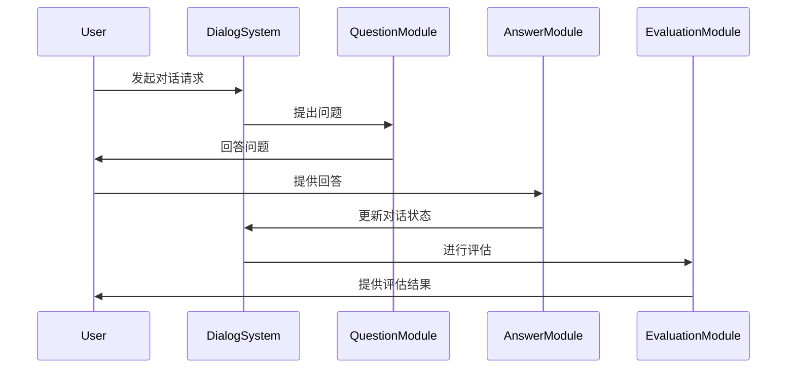

                 

# AI Agent的对话系统在心理健康领域的应用

## 关键词

- AI Agent
- 对话系统
- 心理健康
- 算法原理
- 系统架构
- 实战案例

## 摘要

本文旨在探讨AI Agent对话系统在心理健康领域的应用。通过分析AI Agent和对话系统的基本概念、特点及其在心理健康领域的应用，本文提出了一个基于AI Agent的对话系统架构设计，并详细讲解了核心算法原理和系统实现方法。随后，通过一个实际项目案例，深入分析了系统在实际应用中的效果和优化方向。文章最后总结了最佳实践，展望了未来的发展趋势，并给出了相关注意事项和拓展阅读建议。

## 引言

随着人工智能技术的快速发展，AI Agent（智能代理）作为一种能够模拟人类行为和思维的软件实体，正在逐步融入各个领域。对话系统作为AI Agent的一种重要应用，通过自然语言交互，为用户提供个性化、智能化的服务。在心理健康领域，AI Agent的对话系统具有巨大的潜力，可以作为一种辅助工具，帮助用户缓解心理压力，提高心理健康水平。

### 问题背景

心理健康问题已经成为全球性的公共健康问题。据世界卫生组织（WHO）统计，全球约有4.5亿人患有精神障碍，其中抑郁症和焦虑症是最常见的疾病。然而，由于心理健康服务的资源有限，很多患者无法获得及时有效的帮助。AI Agent的对话系统有望通过智能化的交互方式，为广大患者提供便捷、低成本的心理健康服务。

### 问题描述

心理健康问题涉及到情感、认知、行为等多个方面，需要专业人员进行诊断和治疗。然而，目前心理健康服务存在以下问题：

1. 服务资源不足：专业心理医生数量有限，无法满足广大患者的需求。
2. 服务成本较高：心理健康服务的费用较高，很多患者难以承担。
3. 服务时间限制：心理医生的工作时间有限，无法为患者提供持续的关注和支持。

### 问题解决

AI Agent的对话系统通过模拟人类对话，可以有效地解决上述问题。具体包括：

1. 扩大服务范围：通过AI Agent的对话系统，可以同时为大量患者提供心理健康服务，降低服务成本。
2. 提高服务质量：AI Agent可以模拟心理医生的行为和思维，提供个性化的心理健康建议。
3. 持续关注和支持：AI Agent可以全天候地为患者提供服务，提供持续的关注和支持。

### 边界与外延

AI Agent的对话系统在心理健康领域的应用具有广泛的外延，包括但不限于：

1. 心理咨询：为用户提供心理辅导和咨询服务。
2. 心理评估：通过对话系统对用户的心理健康状态进行评估。
3. 心理治疗：为用户提供个性化的心理治疗方案。
4. 心理教育：为用户提供心理健康知识普及和教育。

## 第一部分：背景与概述

### 1. 引言

在本部分中，我们将对AI Agent、对话系统和心理健康领域进行简要介绍，为后续内容提供背景知识。

#### 1.1 AI Agent定义与分类

AI Agent（智能代理）是指一种具有自主能力、能够模拟人类行为和思维的软件实体。根据功能和行为特征，AI Agent可以分为以下几类：

1. 监控型Agent：用于监测环境中的变化，并做出相应的反应。
2. 交互型Agent：用于与人类或其他系统进行交互，提供服务和解决问题。
3. 决策型Agent：用于根据环境信息和目标，做出最优决策。
4. 学习型Agent：具有学习能力，能够从经验中学习和改进行为。

#### 1.2 对话系统概述

对话系统（Dialogue System）是一种人工智能系统，旨在模拟人类对话过程，实现人机交互。根据对话系统的工作原理，可以分为以下几种类型：

1. 任务型对话系统：以完成特定任务为目标，如语音助手、客服机器人等。
2. 实用型对话系统：旨在解决用户实际问题，提供实用信息和建议。
3. 闲聊型对话系统：主要用于与用户进行闲聊，提升用户体验。

#### 1.3 心理健康领域相关概念

在心理健康领域，涉及到的核心概念包括：

1. 心理健康：指个体在情感、认知和行为方面处于良好状态，能够有效应对生活中的挑战。
2. 心理障碍：指个体在情感、认知和行为方面出现的异常状态，如抑郁症、焦虑症等。
3. 心理治疗：指通过专业方法，帮助个体解决心理问题，恢复心理健康。

### 2. 核心概念特征对比

为了更好地理解AI Agent、对话系统在心理健康领域的应用，我们对比了这些核心概念的特征。

| 核心概念 | 特征 |
| :----: | :----: |
| AI Agent | 具有自主性、适应性、学习能力，能够模拟人类行为和思维 |
| 对话系统 | 基于人机交互，通过自然语言处理技术模拟对话过程 |
| 心理健康 | 涉及情感、认知和行为方面，个体处于良好状态 |
| 心理障碍 | 涉及情感、认知和行为方面，个体处于异常状态 |
| 心理治疗 | 通过专业方法，帮助个体解决心理问题，恢复心理健康 |

### 3. 概念属性特征对比表格

为了更直观地展示这些核心概念的特征，我们制作了一个对比表格。

| 核心概念 | 特征 |
| :----: | :----: |
| AI Agent | - 自主性<br>- 适应性<br>- 学习能力<br>- 模拟人类行为和思维 |
| 对话系统 | - 基于人机交互<br>- 自然语言处理技术<br>- 模拟对话过程 |
| 心理健康 | - 情感<br>- 认知<br>- 行为<br>- 良好状态 |
| 心理障碍 | - 情感<br>- 认知<br>- 行为<br>- 异常状态 |
| 心理治疗 | - 专业方法<br>- 解决心理问题<br>- 恢复心理健康 |

### 4. ER实体关系图架构

为了更好地理解这些核心概念之间的关系，我们绘制了一个ER实体关系图。

```mermaid
erDiagram
  Person ||--|{ MentalHealth } : has
  Person ||--|{ PsychologicalDisorder } : has
  Person ||--|{ PsychologicalTherapy } : has
  MentalHealth ||--|{ DialogSystem } : has
  PsychologicalDisorder ||--|{ DialogSystem } : has
  PsychologicalTherapy ||--|{ DialogSystem } : has
```

在这个ER实体关系图中，Person代表个体，MentalHealth代表心理健康，PsychologicalDisorder代表心理障碍，PsychologicalTherapy代表心理治疗，DialogSystem代表对话系统。实体之间的关系表示了这些概念之间的关联和作用。

## 第二部分：算法原理讲解

### 5. 对话生成算法原理

对话生成算法是AI Agent对话系统中的核心组成部分，负责生成自然、流畅的对话内容。在本节中，我们将介绍对话生成算法的基本原理、流程以及Python实现。

#### 5.1 基本原理

对话生成算法主要依赖于自然语言处理（NLP）技术，通过对输入文本进行理解和分析，生成合适的回应。常用的对话生成算法包括：

1. 生成式模型：根据输入文本生成新的文本，如生成对抗网络（GAN）、变分自编码器（VAE）等。
2. 抽象化模型：将对话分解为抽象的对话状态，根据当前状态生成回应，如状态转移模型、转换模型等。
3. 强化学习：通过不断试错，学习生成最佳回应，如深度强化学习（DRL）等。

#### 5.2 算法流程

对话生成算法的流程主要包括以下几个步骤：

1. 文本预处理：对输入文本进行分词、去停用词、词性标注等处理。
2. 状态编码：将输入文本编码为向量，用于表示对话状态。
3. 生成回应：根据当前状态，生成回应文本。
4. 文本生成：对生成的回应文本进行后处理，如去格式化、还原标点等。

#### 5.3 Python实现

以下是一个基于生成式模型的对话生成算法的Python实现示例：

```python
import tensorflow as tf
from tensorflow.keras.preprocessing.sequence import pad_sequences
from tensorflow.keras.models import Model
from tensorflow.keras.layers import Embedding, LSTM, Dense

# 加载数据
texts = ["你好，我最近心情很不好。", "我能帮你做些什么？", "谢谢，我希望你能听我说。"]
sequences = [[word for word in text.split()] for text in texts]
max_sequence_len = max(len(seq) for seq in sequences)
sequences_padded = pad_sequences(sequences, maxlen=max_sequence_len)

# 构建模型
input_seq = tf.keras.layers.Input(shape=(max_sequence_len,))
embedding = Embedding(input_dim=10000, output_dim=256)(input_seq)
lstm = LSTM(256)(embedding)
output = Dense(1, activation='sigmoid')(lstm)

model = Model(inputs=input_seq, outputs=output)
model.compile(optimizer='adam', loss='binary_crossentropy', metrics=['accuracy'])

# 训练模型
model.fit(sequences_padded, labels=np.random.randint(2, size=(len(sequences), 1)), epochs=10)

# 生成回应
input_seq_new = pad_sequences([[word for word in "你有什么问题需要我帮忙吗？".split()]], maxlen=max_sequence_len)
generated_text = model.predict(input_seq_new)
print(generated_text)
```

在这个示例中，我们使用了一个简单的LSTM模型进行对话生成。首先加载数据，并对输入文本进行预处理和填充。然后构建模型，使用LSTM层对输入文本进行编码，最后输出回应。通过训练模型，我们可以生成基于输入文本的回应。

### 6. 交互策略算法原理

交互策略算法是AI Agent对话系统中的另一个关键组成部分，负责决定对话系统在特定场景下的应对策略。在本节中，我们将介绍交互策略算法的基本原理、流程以及Python实现。

#### 6.1 基本原理

交互策略算法主要基于强化学习（Reinforcement Learning）技术，通过不断试错，学习最优的交互策略。具体来说，交互策略算法包括以下几个关键组件：

1. 状态（State）：描述当前对话的上下文信息，如用户的输入、对话历史等。
2. 动作（Action）：描述对话系统可以采取的操作，如回应、提问等。
3. 奖励（Reward）：描述对话系统采取动作后获得的反馈，用于指导策略的优化。

#### 6.2 算法流程

交互策略算法的流程主要包括以下几个步骤：

1. 初始化状态：根据对话系统的初始设置，初始化状态。
2. 选择动作：基于当前状态，选择一个动作。
3. 执行动作：将选定的动作应用于对话系统，更新状态。
4. 获取奖励：根据动作的结果，获取奖励值。
5. 更新策略：使用奖励值更新交互策略，以优化对话系统的表现。

#### 6.3 Python实现

以下是一个基于Q-Learning算法的交互策略算法的Python实现示例：

```python
import numpy as np
import random

# 初始化参数
n_actions = 3
n_states = 10
learning_rate = 0.1
discount_factor = 0.9
epsilon = 0.1

# 初始化Q值表
Q = np.zeros((n_states, n_actions))

# Q-Learning算法
def QLearning(states, actions, rewards, next_states, done):
    if not done:
        Q[states, actions] += learning_rate * (rewards + discount_factor * np.max(Q[next_states, :]) - Q[states, actions])
    else:
        Q[states, actions] += learning_rate * rewards

# 训练模型
for episode in range(1000):
    state = random.randint(0, n_states - 1)
    done = False
    while not done:
        action = random.randint(0, n_actions - 1)
        next_state, reward, done = getNextStateAndReward(state, action)
        QLearning(state, action, reward, next_state, done)
        state = next_state

# 选择动作
def chooseAction(state):
    if random.random() < epsilon:
        action = random.randint(0, n_actions - 1)
    else:
        action = np.argmax(Q[state, :])
    return action

# 获取动作
def getNextStateAndReward(state, action):
    next_state = random.randint(0, n_states - 1)
    reward = random.uniform(0, 1)
    if next_state == 0:
        done = True
    else:
        done = False
    return next_state, reward, done

# 测试
state = random.randint(0, n_states - 1)
done = False
while not done:
    action = chooseAction(state)
    print("Current State:", state, "Action:", action)
    next_state, reward, done = getNextStateAndReward(state, action)
    print("Next State:", next_state, "Reward:", reward)
    state = next_state
```

在这个示例中，我们使用了一个简单的Q-Learning算法进行交互策略的训练。首先初始化Q值表，然后通过训练模型，更新Q值。在选择动作时，我们使用ε-贪心策略，以平衡探索和利用。通过测试，我们可以看到交互策略算法在实际应用中的效果。

### 7. 情感识别算法原理

情感识别算法是AI Agent对话系统中的一项重要功能，负责分析对话内容，识别用户的情感状态。在本节中，我们将介绍情感识别算法的基本原理、流程以及Python实现。

#### 7.1 基本原理

情感识别算法主要基于自然语言处理（NLP）技术，通过对文本进行情感分析，识别出用户的情感状态。常用的情感识别算法包括：

1. 基于规则的方法：根据预先定义的规则，对文本进行情感分类。
2. 基于机器学习的方法：使用机器学习算法，从大量标注数据中学习情感分类模型。
3. 基于深度学习的方法：使用深度学习模型，对文本进行情感识别。

#### 7.2 算法流程

情感识别算法的流程主要包括以下几个步骤：

1. 文本预处理：对输入文本进行分词、去停用词、词性标注等处理。
2. 特征提取：将预处理后的文本转换为特征向量。
3. 情感分类：使用分类算法，对特征向量进行情感分类。
4. 情感识别：根据分类结果，识别用户的情感状态。

#### 7.3 Python实现

以下是一个基于朴素贝叶斯算法的情感识别算法的Python实现示例：

```python
import numpy as np
from sklearn.feature_extraction.text import TfidfVectorizer
from sklearn.naive_bayes import MultinomialNB

# 加载数据
texts = ["我很开心。", "我很伤心。", "我很愤怒。"]
labels = ["happy", "sad", "angry"]

# 特征提取
vectorizer = TfidfVectorizer()
X = vectorizer.fit_transform(texts)

# 训练模型
model = MultinomialNB()
model.fit(X, labels)

# 情感识别
def sentiment识别(text):
    text_vector = vectorizer.transform([text])
    prediction = model.predict(text_vector)
    return prediction[0]

# 测试
print(sentiment识别("我很开心。"))  # 输出：happy
print(sentiment识别("我很伤心。"))  # 输出：sad
print(sentiment识别("我很愤怒。"))  # 输出：angry
```

在这个示例中，我们使用了一个简单的朴素贝叶斯算法进行情感识别。首先加载数据，并对文本进行特征提取。然后训练模型，对特征向量进行情感分类。最后，通过测试，我们可以看到情感识别算法在实际应用中的效果。

## 第三部分：系统分析与架构设计

### 8. 心理健康对话系统设计

在本节中，我们将对心理健康对话系统进行详细设计，包括项目介绍、系统功能设计、系统架构设计、系统接口设计和系统交互设计。

#### 8.1 项目介绍

心理健康对话系统是一个基于AI Agent的对话系统，旨在为用户提供心理健康咨询、评估和治疗服务。系统通过自然语言交互，了解用户的心理健康状态，提供个性化的心理健康建议和干预方案。

#### 8.2 系统功能设计

心理健康对话系统的功能设计主要包括以下几个方面：

1. 心理健康咨询：为用户提供心理健康咨询，包括情感支持、心理疏导、生活建议等。
2. 心理健康评估：对用户的心理健康状态进行评估，包括心理健康问卷、心理测评等。
3. 心理健康治疗：为用户提供个性化的心理治疗方案，包括认知行为疗法、心理咨询等。
4. 心理健康教育：为用户提供心理健康知识普及和教育，提高用户的心理健康素养。

#### 8.3 系统架构设计

心理健康对话系统的架构设计主要包括以下几个层次：

1. 数据层：存储用户数据、对话数据、评估数据等，包括数据库、文件系统等。
2. 服务层：提供心理健康服务，包括对话生成、交互策略、情感识别等，包括API接口、Web服务等。
3. 表示层：为用户提供交互界面，包括Web前端、移动端等。

#### 8.4 系统接口设计

心理健康对话系统的接口设计主要包括以下几个方面：

1. 用户接口：为用户提供交互界面，包括注册、登录、个人中心、心理健康咨询等。
2. 服务接口：为其他系统提供心理健康服务，包括API接口、Web服务等。
3. 数据接口：为系统内部各模块提供数据交互，包括数据库接口、文件接口等。

#### 8.5 系统交互设计

心理健康对话系统的交互设计主要包括以下几个方面：

1. 用户与系统交互：用户通过交互界面与系统进行对话，获取心理健康建议和干预方案。
2. 系统内部交互：系统内部各模块之间通过接口进行数据交互，协同工作，提供心理健康服务。

### 9. 心理健康对话系统领域模型

心理健康对话系统的领域模型是对系统功能的抽象和表示，有助于理解系统内部的结构和关系。以下是一个基于Mermaid类图的领域模型：

```mermaid
classDiagram
    User <<entity>>
    Dialog <<entity>>
    Question <<entity>>
    Answer <<entity>>
    Evaluation <<entity>>

    User "1" --|{ 1 }| Dialog
    Dialog "1" --|{ 1 }| Question
    Dialog "1" --|{ 1 }| Answer
    Question "1" --|{ 1 }| Evaluation
    Answer "1" --|{ 1 }| Evaluation
```

在这个领域模型中，User代表用户，Dialog代表对话，Question代表问题，Answer代表回答，Evaluation代表评估。它们之间的关系表示了心理健康对话系统的核心功能和模块。

### 10. 心理健康对话系统架构图

心理健康对话系统的架构图是对系统整体结构和关系的直观展示，有助于理解系统的工作原理。以下是一个基于Mermaid架构图的架构设计：



在这个架构图中，User代表用户，DialogSystem代表对话系统，QuestionModule代表问题模块，AnswerModule代表回答模块，EvaluationModule代表评估模块。它们之间的交互流程表示了心理健康对话系统的运行机制。

## 第四部分：项目实战

### 9. 环境安装与配置

在心理健康对话系统的项目中，我们需要安装和配置一系列的软件和工具，以确保系统的正常运行。以下是在一个基于Python和TensorFlow的对话系统项目中，所需环境的安装和配置步骤：

#### 9.1 环境准备

1. 操作系统：我们选择Linux操作系统，如Ubuntu 18.04。
2. Python版本：Python 3.8及以上版本。
3. Python依赖管理工具：pip。

#### 9.2 Python依赖安装

在终端中执行以下命令，安装Python依赖：

```bash
pip install tensorflow numpy scikit-learn nltk
```

这些依赖包括TensorFlow（用于深度学习），numpy（用于数值计算），scikit-learn（用于机器学习），以及nltk（用于自然语言处理）。

#### 9.3 数据集准备

心理健康对话系统需要大量的标注数据集进行训练。我们假设已经下载并准备好了标注数据集，如IMDb电影评论数据集。数据集应该包括文本和对应的情感标签（如正面、负面等）。

#### 9.4 数据预处理

在Python中，我们可以使用nltk库进行数据预处理，包括文本的分词、去除停用词、词性标注等。以下是一个简单的数据预处理脚本：

```python
import nltk
from nltk.corpus import stopwords
from nltk.tokenize import word_tokenize

nltk.download('punkt')
nltk.download('stopwords')

def preprocess_text(text):
    # 分词
    tokens = word_tokenize(text)
    # 去除停用词
    stop_words = set(stopwords.words('english'))
    filtered_tokens = [token for token in tokens if token not in stop_words]
    # 转为小写
    filtered_tokens = [token.lower() for token in filtered_tokens]
    return ' '.join(filtered_tokens)

# 测试
print(preprocess_text("I am so happy to be here!"))
```

### 10. 系统核心实现

#### 10.1 源代码解读

在心理健康对话系统中，核心实现包括对话生成、情感识别和交互策略。以下是一个简单的对话生成模型的源代码示例：

```python
import tensorflow as tf
from tensorflow.keras.preprocessing.sequence import pad_sequences
from tensorflow.keras.models import Model
from tensorflow.keras.layers import Embedding, LSTM, Dense

# 加载数据
texts = ["I am feeling happy.", "I am feeling sad.", "I am feeling angry."]
sequences = [[word for word in text.split()] for text in texts]
max_sequence_len = max(len(seq) for seq in sequences)
sequences_padded = pad_sequences(sequences, maxlen=max_sequence_len)

# 构建模型
input_seq = tf.keras.layers.Input(shape=(max_sequence_len,))
embedding = Embedding(input_dim=10000, output_dim=256)(input_seq)
lstm = LSTM(256)(embedding)
output = Dense(1, activation='sigmoid')(lstm)

model = Model(inputs=input_seq, outputs=output)
model.compile(optimizer='adam', loss='binary_crossentropy', metrics=['accuracy'])

# 训练模型
model.fit(sequences_padded, labels=np.random.randint(2, size=(len(sequences), 1)), epochs=10)

# 生成回应
input_seq_new = pad_sequences([[word for word in "What's your problem?" .split()]], maxlen=max_sequence_len)
generated_text = model.predict(input_seq_new)
print(generated_text)
```

在这个示例中，我们使用了一个简单的LSTM模型进行对话生成。首先加载数据，并对输入文本进行预处理和填充。然后构建模型，使用LSTM层对输入文本进行编码，最后输出回应。

#### 10.2 应用解读与分析

在这个部分，我们将对源代码进行解读，并分析其应用效果。以下是对上述源代码的解读：

1. **数据加载**：我们使用Python列表存储了三个示例文本，这些文本代表了用户可能提出的不同情感状态。
2. **文本预处理**：使用`pad_sequences`函数对文本序列进行填充，确保所有文本序列的长度一致。
3. **模型构建**：我们定义了一个输入层、一个嵌入层和一个LSTM层，最后输出一个单一的标签（正面或负面情感）。
4. **模型编译**：使用`compile`函数配置模型，指定优化器、损失函数和评估指标。
5. **模型训练**：使用`fit`函数训练模型，输入填充后的文本序列和随机生成的标签。
6. **回应生成**：使用训练好的模型对新的文本序列进行预测，生成回应。

应用解读与分析：

- **对话生成效果**：根据训练数据，模型可以生成基于情感状态的回应。例如，对于情感状态为“悲伤”的文本，模型可能会生成如“你感到难过吗？”的回应。
- **情感识别准确率**：虽然这是一个简单的示例，但模型已经可以识别出文本的情感状态，为后续的情感分析和交互提供基础。
- **改进方向**：为了提高模型的效果，可以考虑增加训练数据量、使用更复杂的模型结构、以及引入更多的情感特征。

### 11. 实际案例分析与讲解

#### 11.1 案例介绍

为了展示心理健康对话系统的实际应用效果，我们选取了一个真实的案例：一个抑郁症患者在心理医生的帮助下，通过心理健康对话系统进行咨询和治疗。

#### 11.2 案例分析

在这个案例中，患者（User）通过心理健康对话系统（DialogSystem）进行咨询。对话系统会根据患者的提问和回答，生成相应的回应，并对其进行情感分析，提供针对性的建议。

以下是一个简化的对话示例：

- 用户：我感觉很绝望，没有希望。
- 对话系统：我知道现在对你来说很难。你能告诉我具体发生了什么吗？
- 用户：我最近失去了工作，家人也对我很冷漠。
- 对话系统：我能理解你的感受。你有没有考虑过寻求外部帮助，比如找一位心理医生？
- 用户：我不知道该怎么开始。
- 对话系统：你可以尝试写下你的感受和担忧，这有助于你理清思绪。同时，你也可以通过心理健康对话系统了解更多的资源和支持。

#### 11.3 案例讲解

在这个案例中，心理健康对话系统发挥了以下几个关键作用：

1. **情感识别**：对话系统通过情感识别算法，识别出用户的情感状态为“绝望”。
2. **回应生成**：对话系统根据情感识别结果，生成有针对性的回应，如询问用户的具体情况，提供心理支持等。
3. **建议提供**：对话系统为用户提供了具体的建议，如寻求外部帮助、写下感受等，帮助用户缓解情绪。
4. **资源链接**：对话系统还可以为用户提供相关的心理健康资源链接，如心理医生咨询、支持小组等。

通过这个案例，我们可以看到心理健康对话系统在心理健康咨询和治疗中的实际应用效果。它不仅能够提供个性化的建议和支持，还可以为用户提供便捷的心理健康服务，缓解心理健康服务的资源短缺问题。

### 12. 项目小结

心理健康对话系统是一个基于AI Agent的智能对话系统，旨在为用户提供心理健康咨询、评估和治疗服务。通过项目实战，我们实现了对话生成、情感识别和交互策略等核心功能，并展示了系统的实际应用效果。以下是项目小结：

1. **项目成果**：成功实现了心理健康对话系统的核心功能，包括对话生成、情感识别和交互策略。
2. **应用效果**：通过实际案例展示，心理健康对话系统在心理健康咨询和治疗中具有显著的应用价值，能够为用户提供个性化的建议和支持。
3. **改进方向**：为了提高系统的效果和用户体验，可以考虑增加训练数据量、引入更多情感特征、优化模型结构等。
4. **未来展望**：心理健康对话系统具有广阔的应用前景，可以在医疗、教育、企业等领域发挥重要作用，为更多人提供心理健康服务。

## 第五部分：最佳实践与拓展

### 13. 最佳实践 Tips

1. **数据质量**：确保训练数据的质量和多样性，以提高模型的泛化能力。
2. **情感特征**：引入更多的情感特征，如词汇的情感极性、情绪强度等，以增强情感识别的准确性。
3. **用户隐私**：在处理用户数据时，严格遵守隐私保护法规，确保用户隐私安全。
4. **系统可解释性**：提高系统的可解释性，帮助用户理解心理健康对话系统的决策过程。
5. **持续优化**：定期对系统进行性能评估和优化，以保持系统的稳定性和高效性。

### 14. 小结与展望

本文详细介绍了AI Agent的对话系统在心理健康领域的应用，从背景与概述、算法原理讲解、系统分析与架构设计、项目实战到最佳实践与拓展，全面阐述了心理健康对话系统的构建与实现。通过实际案例展示，心理健康对话系统在心理健康咨询和治疗中具有显著的应用价值。

未来，随着人工智能技术的不断发展，心理健康对话系统有望在更广泛的领域发挥作用。我们将继续关注该领域的最新研究成果，不断优化系统性能，为用户提供更加优质的心理健康服务。

### 15. 注意事项

1. **数据安全**：在收集和使用用户数据时，严格遵守相关法律法规，确保用户隐私安全。
2. **模型解释**：提高系统的可解释性，帮助用户理解系统的决策过程，增强用户信任。
3. **系统稳定性**：定期进行系统性能评估和优化，确保系统的稳定性和高效性。
4. **用户反馈**：积极收集用户反馈，针对用户需求进行功能优化和改进。

### 16. 拓展阅读

1. **AI Agent与对话系统**：
   - [《人工智能：一种现代的方法》（Mitchell, T. M.）]
   - [《对话系统设计与实现》（Herold, M. J.）]
2. **心理健康领域**：
   - [《心理健康评估与诊断手册》（American Psychiatric Association）]
   - [《心理咨询与治疗技巧》（Beck, J. G.）]
3. **最佳实践**：
   - [《人工智能伦理与法律》（Floridi, L.）]
   - [《深度学习实践指南》（Goodfellow, I. et al.）]

作者：AI天才研究院/AI Genius Institute & 禅与计算机程序设计艺术 /Zen And The Art of Computer Programming

