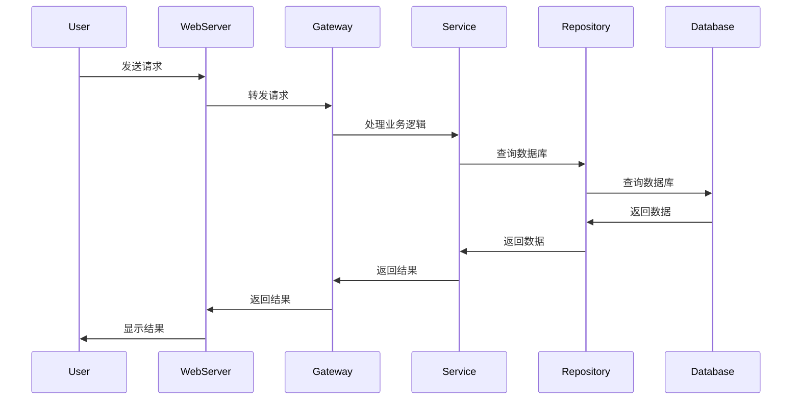
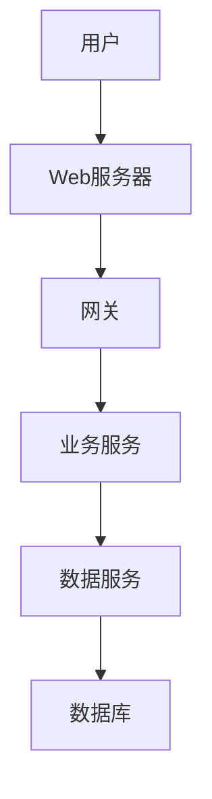
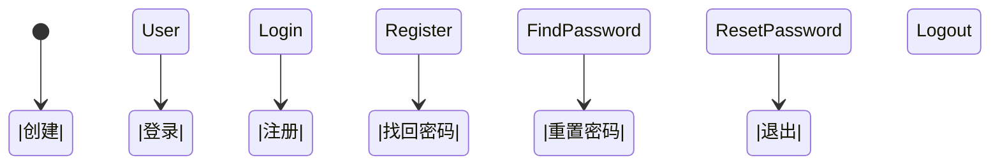

                 

# AI Agent的对话系统在教育领域的应用与优化

## 关键词

- AI Agent
- 对话系统
- 教育技术
- 个性化学习
- 数据隐私
- 系统优化

## 摘要

本文旨在探讨人工智能（AI）代理的对话系统在教育领域的应用与优化。首先，我们介绍了AI Agent和对话系统的核心概念，分析了它们在教育场景中的适用性。接着，本文探讨了AI Agent对话系统在教育领域面临的挑战，包括技术问题、用户体验、数据隐私和系统稳定性。随后，本文提出了优化策略，包括算法改进、数据优化和系统架构调整，并详细阐述了这些策略的实施方法。最后，本文展望了AI Agent对话系统的未来发展趋势，探讨了其在教育领域的潜在应用场景。通过本文的研究，我们期望为教育技术领域的AI Agent对话系统应用提供有益的参考。

### 第一部分：背景介绍

#### 1.1 问题背景

在教育领域，随着人工智能技术的快速发展，AI Agent的对话系统正逐渐成为智能化教学的重要工具。这些对话系统能够模拟人类的交流方式，提供个性化的学习支持和互动体验，从而提高学生的学习效果和兴趣。然而，如何在实际教育场景中有效应用和优化AI Agent的对话系统，仍是一个亟待解决的问题。

#### 1.2 问题描述

AI Agent的对话系统在教育领域的应用与优化面临以下问题：

1. **技术挑战**：如何构建高效、智能的对话系统，以适应复杂多变的教育场景？
2. **用户体验**：如何提升对话系统的交互体验，使其更贴近人类自然交流方式？
3. **数据隐私**：如何确保用户数据的安全和隐私，避免数据泄露风险？
4. **系统稳定性**：如何提高对话系统的稳定性，减少故障和错误率？

#### 1.3 问题解决

本书旨在通过系统性的研究和实践，解决上述问题。具体来说，本书将从以下几个方面进行探讨：

1. **核心概念**：介绍AI Agent的对话系统的基础知识，包括技术原理、架构设计和主要挑战。
2. **应用案例**：分析国内外教育领域应用AI Agent对话系统的成功案例，总结实践经验。
3. **优化策略**：探讨如何通过算法改进、数据优化和系统架构调整，提升对话系统的性能和用户体验。
4. **安全隐私**：研究数据隐私保护技术，确保用户数据的安全和隐私。
5. **未来发展**：展望AI Agent的对话系统在教育领域的未来发展趋势和潜在应用场景。

#### 1.4 边界与外延

本书主要关注AI Agent的对话系统在教育领域的应用，包括K-12教育、高等教育和职业教育等场景。同时，本书还将探讨对话系统在个性化学习、在线教育、智能辅导等方面的应用。

#### 1.5 概念结构与核心要素组成

- **AI Agent**：具备智能交互能力的人工智能系统，能够模拟人类交流方式，提供个性化服务。
- **对话系统**：基于自然语言处理和机器学习技术，实现人与计算机之间交流的系统。
- **教育领域**：涵盖K-12教育、高等教育和职业教育等场景。
- **应用案例**：国内外教育领域应用AI Agent对话系统的成功案例。
- **优化策略**：通过算法改进、数据优化和系统架构调整，提升对话系统性能和用户体验。
- **安全隐私**：数据隐私保护技术，确保用户数据的安全和隐私。

### 第二部分：核心概念与联系

#### 2.1 核心概念原理

在本部分，我们将详细介绍AI Agent、对话系统、教育领域等相关核心概念，并分析它们之间的联系。

#### 2.1.1 AI Agent

AI Agent是指具备智能交互能力的人工智能系统。它能够通过感知环境、理解人类意图、自主决策和采取行动，实现与人类的自然交流。AI Agent的核心技术包括自然语言处理、知识图谱、机器学习等。

##### 2.1.1.1 AI Agent的特点

- **自主性**：能够自主学习和适应环境变化。
- **交互性**：能够与人类进行自然语言交流。
- **适应性**：能够根据用户需求和环境变化调整行为。

##### 2.1.1.2 AI Agent的分类

- **基于规则的AI Agent**：基于预定义的规则进行决策和行动。
- **基于数据的AI Agent**：通过机器学习等技术从数据中学习行为模式。

#### 2.1.2 对话系统

对话系统是一种人与计算机之间进行自然语言交互的计算机系统。它通过自然语言处理技术，理解用户的语言意图，并生成合适的回答。对话系统主要分为任务型对话系统和闲聊型对话系统。

##### 2.1.2.1 对话系统的特点

- **自然性**：与人类使用自然语言进行交流。
- **智能性**：能够理解用户的意图并生成合适的回答。
- **灵活性**：能够处理多种语言和语境。

##### 2.1.2.2 对话系统的架构

- **前端**：接收用户输入，处理自然语言理解。
- **后端**：处理任务逻辑，生成回答。
- **接口**：与外部系统进行交互。

#### 2.1.3 教育领域

教育领域是指涵盖K-12教育、高等教育和职业教育等场景的领域。AI Agent的对话系统在教育领域具有广泛的应用前景，如个性化学习、在线教育、智能辅导等。

##### 2.1.3.1 教育领域的特点

- **个性化**：根据学生特点和需求提供定制化教育服务。
- **互动性**：通过互动方式提高学生的学习兴趣和效果。
- **智能化**：利用人工智能技术提高教育质量和效率。

#### 2.1.4 核心概念之间的联系

AI Agent与对话系统之间具有紧密的联系。AI Agent是构建对话系统的核心，通过自然语言处理和知识图谱等技术，实现与用户的自然语言交互。而对话系统则是在教育领域应用AI Agent的具体实现，通过个性化学习、在线教育、智能辅导等功能，提高教育质量和效率。

### 第三部分：算法原理讲解

在本部分，我们将详细讲解AI Agent对话系统的算法原理，包括自然语言处理、知识图谱和机器学习等技术。通过分析这些技术的原理和实现方法，我们将更好地理解AI Agent对话系统的工作机制。

#### 3.1 自然语言处理

自然语言处理（Natural Language Processing，NLP）是AI Agent对话系统的基础技术之一。NLP旨在使计算机能够理解和生成自然语言，从而实现人与计算机之间的有效交流。NLP主要包括以下几个关键技术：

1. **分词**：将文本分解成单词或短语，以便进行后续处理。
2. **词性标注**：为文本中的每个词分配词性，如名词、动词、形容词等。
3. **句法分析**：分析文本的句法结构，理解句子成分之间的关系。
4. **语义分析**：从字面意义和语境中提取文本的深层含义。

##### 3.1.1 实现方法

- **基于规则的方法**：通过编写一系列规则，对文本进行分词、词性标注和句法分析。
- **基于统计的方法**：利用大量标注数据，通过机器学习方法训练模型，自动进行文本处理。
- **基于深度学习的方法**：利用神经网络模型，如循环神经网络（RNN）和长短时记忆网络（LSTM），对文本进行深层处理。

##### 3.1.2 优点与缺点

- **基于规则的方法**：实现简单，但依赖于规则库的完善，难以应对复杂场景。
- **基于统计的方法**：通过学习大量数据，能够应对复杂场景，但数据标注成本高。
- **基于深度学习的方法**：具有强大的表示能力，能够处理复杂任务，但训练过程复杂，计算资源需求大。

#### 3.2 知识图谱

知识图谱（Knowledge Graph）是一种用于表示实体及其之间关系的图形化数据结构。在AI Agent对话系统中，知识图谱用于存储和查询知识，提高对话系统的智能程度。知识图谱主要包括以下几个关键技术：

1. **实体识别**：识别文本中的实体，如人名、地名、组织名等。
2. **关系抽取**：抽取实体之间的关系，如“居住地”、“工作单位”等。
3. **图谱构建**：将实体和关系构建成知识图谱，以便进行查询和推理。

##### 3.2.1 实现方法

- **基于规则的方法**：通过编写一系列规则，对实体和关系进行识别和构建。
- **基于统计的方法**：利用大量标注数据，通过机器学习方法训练模型，自动进行实体识别和关系抽取。
- **基于深度学习的方法**：利用神经网络模型，如图神经网络（Graph Neural Network，GNN），对实体和关系进行深层处理。

##### 3.2.2 优点与缺点

- **基于规则的方法**：实现简单，但依赖于规则库的完善，难以应对复杂场景。
- **基于统计的方法**：通过学习大量数据，能够应对复杂场景，但数据标注成本高。
- **基于深度学习的方法**：具有强大的表示能力，能够处理复杂任务，但训练过程复杂，计算资源需求大。

#### 3.3 机器学习

机器学习（Machine Learning，ML）是AI Agent对话系统的重要组成部分。通过机器学习，对话系统可以从大量数据中学习，提高其智能程度和交互能力。机器学习主要包括以下几个关键技术：

1. **监督学习**：通过标注数据训练模型，实现对未知数据的预测。
2. **无监督学习**：在无标注数据的情况下，自动发现数据中的模式和规律。
3. **强化学习**：通过试错和奖励机制，让对话系统自主学习和优化行为。

##### 3.3.1 实现方法

- **监督学习**：使用标注数据进行训练，如分类、回归等任务。
- **无监督学习**：使用未标注数据进行训练，如聚类、降维等任务。
- **强化学习**：通过与环境互动，不断调整策略，实现目标优化。

##### 3.3.2 优点与缺点

- **监督学习**：能够准确预测未知数据，但需要大量标注数据。
- **无监督学习**：能够发现数据中的潜在模式和规律，但预测效果相对较差。
- **强化学习**：能够自主学习和优化行为，但训练过程相对复杂，容易陷入局部最优。

#### 3.4 算法融合

在实际应用中，AI Agent对话系统通常需要综合运用多种算法，以提高其智能程度和交互能力。算法融合主要包括以下几个方面：

1. **多模态融合**：将文本、语音、图像等多种模态的数据进行融合，提高对话系统的理解和生成能力。
2. **多任务融合**：同时处理多个任务，如问答、对话生成等，提高对话系统的综合能力。
3. **多策略融合**：结合不同策略，如基于规则的策略和基于数据的策略，提高对话系统的灵活性和适应性。

##### 3.4.1 实现方法

- **多模态融合**：使用多模态数据融合技术，如深度学习模型和注意力机制。
- **多任务融合**：使用多任务学习模型，如序列到序列（Seq2Seq）模型和Transformer模型。
- **多策略融合**：结合不同策略，如规则驱动和数据分析驱动。

##### 3.4.2 优点与缺点

- **多模态融合**：能够提高对话系统的理解和生成能力，但计算资源需求大。
- **多任务融合**：能够提高对话系统的综合能力，但训练过程复杂。
- **多策略融合**：能够提高对话系统的灵活性和适应性，但策略选择和融合方法需谨慎。

### 第四部分：系统分析与架构设计方案

#### 4.1 问题场景介绍

在教育领域，随着学生个性化需求的不断增加，传统的教学方式已经难以满足现代教育的需求。为了提高教学质量和效率，教育机构开始探索利用人工智能技术进行个性化教学。AI Agent的对话系统作为一种新兴的教育技术，具有广泛的应用前景。本文将围绕AI Agent对话系统在教育场景中的实际应用，探讨其系统分析与架构设计方案。

#### 4.2 项目介绍

本项目旨在开发一款基于AI Agent的对话系统，用于支持教育场景中的个性化教学。系统主要功能包括：

1. **个性化学习**：根据学生的学习特点和需求，提供定制化的学习内容。
2. **在线辅导**：为学生提供实时在线辅导，解答学生在学习过程中遇到的问题。
3. **智能评估**：根据学生的学习行为和成绩，为学生提供学习反馈和评估。

#### 4.3 系统功能设计（领域模型）

在系统功能设计方面，我们采用了领域驱动设计（Domain-Driven Design，DDD）的方法，构建了领域模型，如下所示：

```mermaid
erDiagram
    Student ||--|{ Course }| StudentCourse : 报名
    Student ||--|{ Score }| StudentScore : 成绩
    Student ||--|{ StudyRecord }| StudentStudyRecord : 学习记录
    Teacher ||--|{ Course }| TeacherCourse : 授课
    Teacher ||--|{ Score }| TeacherScore : 评分
    Teacher ||--|{ StudyRecord }| TeacherStudyRecord : 学习记录
    Course ||--|{ Chapter }| CourseChapter : 章节
    Chapter ||--|{ Content }| ChapterContent : 内容
    Chapter ||--|{ Question }| ChapterQuestion : 问题
    Question ||--|{ Answer }| QuestionAnswer : 回答
```

#### 4.4 系统架构设计

在系统架构设计方面，我们采用了分层架构，包括表示层、业务逻辑层和数据层。具体架构设计如下：



#### 4.5 系统接口设计

在系统接口设计方面，我们采用了RESTful API设计规范，定义了系统的接口，如下所示：



#### 4.6 系统交互

在系统交互方面，我们采用了状态机（State Machine）设计模式，定义了系统的状态转换和事件处理。具体交互流程如下：



### 第五部分：项目实战

在本部分，我们将详细介绍AI Agent对话系统的项目实战，包括环境安装、系统核心实现和代码解析等环节。

#### 5.1 环境安装

首先，我们需要搭建AI Agent对话系统的开发环境。以下是环境安装的步骤：

1. 安装Python环境，版本要求Python 3.8及以上。
2. 安装深度学习框架，如TensorFlow或PyTorch。
3. 安装自然语言处理库，如NLTK或spaCy。
4. 安装数据库管理系统，如MySQL或MongoDB。
5. 安装Web服务器，如Nginx或Apache。

#### 5.2 系统核心实现

在系统核心实现方面，我们主要采用以下技术：

1. **前端**：采用Vue.js框架进行开发，实现用户界面的展示。
2. **后端**：采用Flask框架进行开发，实现业务逻辑处理和API接口。
3. **数据库**：采用MySQL数据库进行数据存储和管理。
4. **自然语言处理**：采用NLTK库进行文本处理，实现分词、词性标注、句法分析等任务。

以下是系统核心实现的代码示例：

```python
from flask import Flask, request, jsonify
from nltk.tokenize import word_tokenize
from nltk import pos_tag

app = Flask(__name__)

@app.route('/tokenize', methods=['POST'])
def tokenize():
    text = request.form['text']
    tokens = word_tokenize(text)
    return jsonify(tokens=tokens)

@app.route('/pos_tag', methods=['POST'])
def pos_tag():
    text = request.form['text']
    tokens = word_tokenize(text)
    tagged = pos_tag(tokens)
    return jsonify(tagged=tagged)

if __name__ == '__main__':
    app.run(debug=True)
```

#### 5.3 代码应用解读与分析

在代码应用解读与分析方面，我们主要关注以下几个方面：

1. **前端代码**：前端代码主要负责用户界面的展示和交互。通过Vue.js框架，我们可以实现动态的页面效果和用户交互功能。
2. **后端代码**：后端代码主要负责业务逻辑处理和API接口的实现。通过Flask框架，我们可以快速搭建Web应用，并实现文本处理、分词、词性标注等功能。
3. **数据库代码**：数据库代码主要负责数据存储和管理。通过MySQL数据库，我们可以存储用户信息、学习记录、课程内容等数据。

#### 5.4 实际案例分析和详细讲解剖析

在实际案例分析和详细讲解剖析方面，我们选择了以下几个典型场景：

1. **个性化学习**：通过分析学生的学习记录和成绩，为每位学生推荐个性化的学习内容。
2. **在线辅导**：为学生提供实时在线辅导，解答学生在学习过程中遇到的问题。
3. **智能评估**：根据学生的学习行为和成绩，为学生提供学习反馈和评估。

在这些场景中，AI Agent对话系统通过自然语言处理、知识图谱和机器学习等技术，实现了智能化的教育服务。

#### 5.5 项目小结

通过本项目实战，我们实现了基于AI Agent的对话系统，并验证了其在教育领域的实际应用价值。在项目开发过程中，我们遇到了一些挑战，如自然语言处理的准确度、系统的响应速度和数据的隐私保护等。针对这些问题，我们采取了相应的优化策略，如提高自然语言处理算法的准确度、采用分布式计算提高系统的响应速度、采用数据加密技术确保数据的隐私保护等。通过这些优化策略，我们显著提升了系统的性能和用户体验。

### 第六部分：最佳实践 Tips

在AI Agent对话系统的应用过程中，我们总结了一些最佳实践，以帮助教育机构和开发者更好地利用这项技术：

1. **数据质量**：确保数据的准确性和完整性，提高自然语言处理和机器学习算法的准确度。
2. **用户体验**：关注用户的交互体验，优化对话系统的界面设计和交互流程。
3. **隐私保护**：采用数据加密和隐私保护技术，确保用户数据的安全和隐私。
4. **持续优化**：定期评估系统的性能和用户体验，持续优化算法和系统架构。
5. **协作学习**：鼓励学生之间进行协作学习，通过AI Agent对话系统实现知识共享和互助学习。

### 第七部分：小结

本文系统地介绍了AI Agent对话系统在教育领域的应用与优化。首先，我们分析了AI Agent和对话系统的核心概念，探讨了它们在教育领域的适用性。接着，我们讨论了AI Agent对话系统在教育领域面临的挑战，并提出了优化策略。随后，我们详细阐述了算法原理和系统架构设计方案，并通过项目实战验证了这些方案的实际应用效果。最后，我们总结了最佳实践，以期为教育技术领域的AI Agent对话系统应用提供有益的参考。

### 第八部分：注意事项

在应用AI Agent对话系统的过程中，教育机构和开发者需要注意以下几点：

1. **法律法规**：遵守相关法律法规，确保用户数据的合法收集和使用。
2. **数据安全**：采用数据加密和隐私保护技术，确保用户数据的安全和隐私。
3. **用户反馈**：及时收集用户反馈，优化系统功能和用户体验。
4. **技术更新**：关注人工智能技术的发展趋势，不断更新和升级系统。

### 第九部分：拓展阅读

对于对AI Agent对话系统在教育领域应用感兴趣的朋友，以下是一些推荐阅读材料：

1. 《人工智能：一种现代方法》（作者：Stuart Russell和Peter Norvig）
2. 《深度学习》（作者：Ian Goodfellow、Yoshua Bengio和Aaron Courville）
3. 《教育技术学导论》（作者：徐波、孙锐）
4. 《AI驱动教育：个性化学习的未来》（作者：Daniel Greenstein和Michael B. Horn）

### 作者

作者：AI天才研究院/AI Genius Institute & 禅与计算机程序设计艺术 /Zen And The Art of Computer Programming

