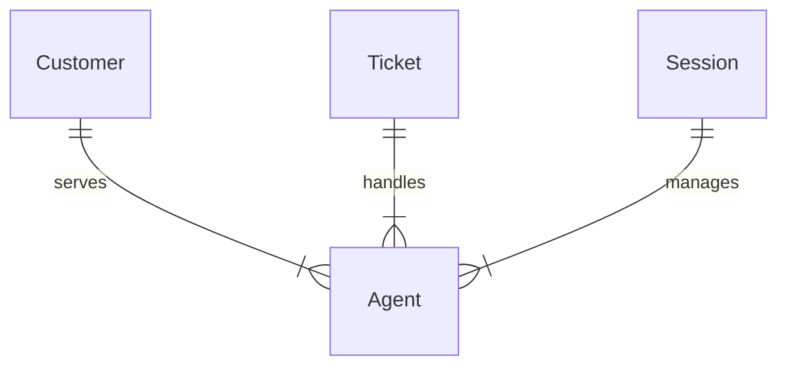

                 

### 第一部分：AI Agent的对话系统概述

#### 第1章：AI Agent的对话系统背景与概述

##### 1.1 问题背景

随着互联网和移动设备的普及，用户对于服务质量和效率的要求越来越高。传统的人工客服存在人力成本高、效率低、响应速度慢等问题，已经无法满足企业快速响应和个性化服务的要求。智能客服作为一种新兴的服务方式，通过利用人工智能技术，如自然语言处理（NLP）、机器学习（ML）和对话系统，可以大大提升客服的效率和用户体验。

智能客服的兴起源于以下几个因素：

1. **用户需求变化**：现代用户越来越习惯于通过即时通讯工具与客服进行交互，对服务的即时性、个性化和高效性提出了更高的要求。
2. **技术进步**：随着人工智能技术的发展，尤其是NLP和机器学习技术的成熟，使得智能客服可以更加智能、准确地理解和处理用户的查询。
3. **商业价值**：智能客服可以帮助企业降低人力成本、提升客户满意度和忠诚度，从而提高企业的盈利能力。

##### 1.2 AI Agent的定义

AI Agent，即人工智能代理，是一种利用人工智能技术模拟人类智能行为的计算机程序。它可以在没有人类干预的情况下，自主地与用户进行对话，提供服务和解决问题。AI Agent的核心目标是模拟人类的思维和行为，通过自然语言交互，实现与用户的智能对话。

AI Agent的定义可以从以下几个方面进行理解：

1. **智能性**：AI Agent具备自主学习和适应能力，能够通过不断的学习和优化，提高自身的对话能力和服务质量。
2. **自主性**：AI Agent可以自主地规划对话流程，根据用户输入的信息，动态地调整对话策略和回答。
3. **交互性**：AI Agent能够通过自然语言与用户进行交互，理解用户的问题和需求，并提供相应的解决方案。

##### 1.3 对话系统的重要性

对话系统是AI Agent的核心组成部分，它负责管理对话流程、理解用户输入、生成合适的回答。对话系统的重要性体现在以下几个方面：

1. **用户体验**：对话系统能够提供流畅、自然的交互体验，提升用户满意度。
2. **效率提升**：对话系统能够快速响应用户，处理大量的查询和请求，提高客服的效率和响应速度。
3. **成本控制**：通过智能客服系统，企业可以减少对人工客服的依赖，降低人力成本。
4. **数据积累**：对话系统在处理用户交互的过程中，可以积累大量的用户数据，为企业提供宝贵的商业洞察。

##### 1.4 问题描述

在智能客服系统中，AI Agent面临着一系列的挑战：

1. **多模态交互**：用户可能会通过文字、语音、图像等多种形式进行交互，AI Agent需要能够处理和融合这些不同类型的输入。
2. **语义理解**：AI Agent需要准确地理解用户的意图和语义，避免产生误解或错误的回答。
3. **上下文感知**：AI Agent需要具备上下文感知能力，能够根据对话的历史信息，生成连贯、相关的回答。
4. **个性化服务**：AI Agent需要能够识别用户的特点和偏好，提供个性化的服务和推荐。

传统客服系统与AI Agent之间的主要区别在于：

1. **响应速度**：传统客服需要人工处理每个用户的请求，响应速度较慢。而AI Agent可以快速响应，处理多个用户的请求。
2. **灵活性**：传统客服受到人工能力的限制，难以适应复杂的查询和问题。而AI Agent通过机器学习算法，可以不断学习和优化，提高处理复杂问题的能力。
3. **成本**：传统客服需要大量的人力资源，而AI Agent通过自动化处理，可以显著降低人力成本。

AI Agent在智能客服中的潜力体现在：

1. **服务效率**：AI Agent可以同时处理多个用户的请求，显著提升客服的效率。
2. **服务质量**：通过不断学习和优化，AI Agent可以提供高质量的个性化服务。
3. **用户体验**：AI Agent能够提供流畅、自然的交互体验，提升用户的满意度。
4. **数据分析**：AI Agent在处理用户交互的过程中，可以积累大量的用户数据，为企业提供宝贵的商业洞察。

##### 1.5 问题解决

为了解决上述问题，AI Agent需要具备以下几个核心技术：

1. **自然语言处理（NLP）**：NLP技术负责理解和处理用户输入的自然语言，包括语音识别、文本理解和语义分析。
2. **机器学习（ML）**：ML技术使AI Agent能够通过大量的用户交互数据，自动学习和优化对话策略，提高对话质量。
3. **对话管理**：对话管理系统负责管理对话流程，确保对话的连贯性和相关性。
4. **多模态交互**：多模态交互技术使AI Agent能够处理和融合多种输入形式，如文本、语音和图像。

##### 1.6 AI Agent的核心技术

AI Agent的核心技术主要包括：

1. **自然语言处理（NLP）**：NLP技术负责理解和处理用户输入的自然语言。它包括语音识别、文本理解和语义分析等子技术。语音识别将用户的语音转换为文本，文本理解则分析文本的语义和结构，语义分析则提取文本的关键信息和意图。
2. **机器学习（ML）**：ML技术使AI Agent能够通过大量的用户交互数据，自动学习和优化对话策略。常见的ML算法包括决策树、支持向量机（SVM）和深度学习等。
3. **对话管理**：对话管理系统负责管理对话流程，确保对话的连贯性和相关性。它包括对话状态的跟踪、上下文的理解和对话策略的生成等。
4. **多模态交互**：多模态交互技术使AI Agent能够处理和融合多种输入形式，如文本、语音和图像。这包括语音识别、图像识别和文本生成等子技术。

##### 1.7 AI Agent的工作原理

AI Agent的工作原理可以分为以下几个步骤：

1. **输入处理**：AI Agent接收用户的输入，通过语音识别或文本输入接口，将输入转换为文本格式。
2. **语义理解**：AI Agent使用NLP技术，对输入文本进行语义分析，提取文本的关键信息和意图。
3. **对话管理**：AI Agent根据对话上下文和用户意图，生成合适的回答或后续操作。
4. **回答生成**：AI Agent使用自然语言生成技术，将生成的回答转化为自然语言文本。
5. **输出处理**：AI Agent将生成的回答通过语音合成或文本输出接口，返回给用户。

##### 1.8 AI Agent的优势与劣势

AI Agent在智能客服中的优势主要体现在以下几个方面：

1. **高效率**：AI Agent可以同时处理多个用户的请求，显著提升客服的效率。
2. **低成本**：通过自动化处理，AI Agent可以降低企业的人力成本。
3. **个性化服务**：AI Agent通过不断学习和优化，可以提供高质量的个性化服务。
4. **数据分析**：AI Agent在处理用户交互的过程中，可以积累大量的用户数据，为企业提供宝贵的商业洞察。

然而，AI Agent也存在一些劣势：

1. **语义理解局限**：AI Agent的语义理解能力有限，可能无法完全理解复杂的用户需求。
2. **情感理解缺失**：AI Agent缺乏情感理解能力，可能无法提供人性化的关怀和情感支持。
3. **对话连贯性挑战**：在处理复杂的对话场景时，AI Agent可能无法保持对话的连贯性和相关性。

##### 1.9 边界与外延

AI Agent的应用领域非常广泛，包括但不限于以下几个方面：

1. **客户服务**：智能客服是AI Agent最典型的应用场景，可以处理大量的客户咨询和投诉。
2. **智能助理**：AI Agent可以担任企业的智能助理，提供各种办公支持和信息查询服务。
3. **医疗健康**：在医疗健康领域，AI Agent可以协助医生进行病情诊断、健康咨询和患者管理。
4. **金融服务**：AI Agent可以提供金融咨询、交易推荐和风险提示等服务。

对话系统可以分为以下几个类别：

1. **任务型对话系统**：主要针对特定任务，如订票、查询等，通过预设的流程和规则，提供明确的答案。
2. **闲聊型对话系统**：主要模拟人类闲聊，提供娱乐、情感支持和心理疏导等功能。
3. **混合型对话系统**：结合任务型和闲聊型对话系统的特点，提供多功能、灵活的对话体验。

对话系统的评价指标主要包括：

1. **响应时间**：评价AI Agent处理用户请求的速度。
2. **回答准确性**：评价AI Agent生成的回答的准确性和相关性。
3. **用户体验**：评价用户对AI Agent交互体验的满意度。

##### 1.10 核心概念与联系

对话系统的核心概念包括：

1. **对话管理**：负责管理对话流程，确保对话的连贯性和相关性。
2. **自然语言处理（NLP）**：负责理解和处理用户输入的自然语言。
3. **机器学习（ML）**：负责通过大量用户数据，自动学习和优化对话策略。

这些概念之间的联系如下：

- 对话管理依赖于NLP技术，通过理解用户输入，生成相应的回答。
- NLP技术依赖于机器学习，通过不断学习和优化，提高对话系统的准确性和效率。
- 对话系统通过机器学习，不断积累用户数据，进一步优化对话流程和回答质量。

##### 1.11 概念属性特征对比表格

以下是对话系统的核心概念属性特征对比表格：

| 概念     | 属性特征                                 |
|----------|----------------------------------------|
| 对话管理 | 管理对话流程，确保连贯性和相关性           |
| 自然语言处理（NLP） | 理解和处理用户输入的自然语言               |
| 机器学习（ML） | 通过用户数据自动学习和优化对话策略         |

##### 1.12 ER实体关系图架构

以下是对话系统的ER实体关系图架构：



##### 1.13 本章小结

本章主要介绍了AI Agent的对话系统的背景、定义、重要性、核心技术、工作原理、优势与劣势以及应用领域。通过本章的学习，读者可以了解AI Agent在智能客服中的重要作用，以及其核心技术是如何实现和优化的。接下来，我们将深入探讨自然语言处理的基础知识，为后续章节的深入学习奠定基础。

----------------------------------------------------------------

### 第二部分：AI Agent对话系统的核心技术

#### 第2章：自然语言处理基础

##### 2.1 自然语言处理概述

自然语言处理（NLP）是人工智能（AI）的一个重要分支，旨在使计算机能够理解和生成自然语言。NLP技术涉及多个领域，包括计算机科学、语言学和人工智能。其主要目标是通过模拟人类的语言理解能力，使计算机能够与人类进行自然、流畅的交流。

##### 2.1.1 自然语言处理的定义

自然语言处理是指计算机科学和人工智能领域中的研究，旨在使计算机能够理解和生成自然语言。自然语言处理涉及对文本和语音的分析、理解、生成和转换。其核心任务是使计算机能够理解自然语言中的语法、语义和上下文信息，从而实现人与计算机之间的有效沟通。

##### 2.1.2 自然语言处理的挑战

自然语言处理面临着一系列挑战，包括但不限于以下几个方面：

1. **语法分析**：自然语言中的语法复杂多变，计算机难以准确理解句子的结构和语法规则。
2. **语义理解**：语义理解涉及对句子意义的解释，这需要理解词语的多义性、隐含意义和上下文。
3. **上下文感知**：自然语言中的许多含义取决于上下文，计算机需要具备良好的上下文感知能力。
4. **多模态交互**：在实际应用中，用户可能会通过文本、语音、图像等多种形式进行交互，计算机需要能够处理和融合这些不同类型的输入。

##### 2.1.3 自然语言处理的重要性

自然语言处理的重要性体现在以下几个方面：

1. **人机交互**：自然语言处理使得计算机能够理解人类的语言指令，实现自然的人机交互。
2. **信息检索**：自然语言处理技术可以帮助计算机高效地处理大量的文本数据，实现快速的信息检索。
3. **智能客服**：自然语言处理技术是智能客服系统的重要组成部分，能够提供高质量的客户服务。
4. **语言翻译**：自然语言处理技术为机器翻译提供了可能，使得计算机能够实现跨语言的信息交流。

##### 2.2 词向量模型

词向量模型是自然语言处理中的一种重要技术，它将单词映射为向量，从而使得计算机能够对单词进行数值化的处理。词向量模型有助于解决自然语言中的语义和句法问题，为文本分析和处理提供了有力的工具。

##### 2.2.1 词向量的基本概念

词向量（Word Vector）是一种将单词映射为实值向量的方法，向量中的每个维度对应单词的某个特征。词向量模型的基本概念包括：

1. **维度**：词向量的维度表示单词的特征数量。通常，维度越高，模型对单词的表征能力越强，但计算成本也越高。
2. **相似性**：词向量的相似性表示单词之间的语义关系。例如，"man"和"woman"在词向量空间中距离较近，因为它们在语义上有一定的关联。
3. **分布性**：词向量模型能够捕捉单词在文本中的分布特征，从而更好地理解单词的语义。

##### 2.2.2 常见的词向量模型

常见的词向量模型包括Word2Vec、GloVe和BERT等。这些模型在词向量的生成方法和应用场景上有所不同。

1. **Word2Vec**：Word2Vec是一种基于神经网络的词向量生成方法，其核心思想是将单词嵌入到一个高维空间中。Word2Vec有两种主要的算法：连续词袋（CBOW）和Skip-Gram。
    - **连续词袋（CBOW）**：CBOW模型通过一个单词的上下文单词来预测该单词。具体来说，CBOW模型会取一个单词作为中心词，然后取其周围的几个单词作为上下文词，通过上下文词的词向量平均来预测中心词的词向量。
    - **Skip-Gram**：与CBOW相反，Skip-Gram模型通过一个单词来预测其上下文单词。具体来说，Skip-Gram模型会取一个单词作为中心词，然后预测其上下文单词，通过上下文单词的词向量平均来预测中心词的词向量。

2. **GloVe**：GloVe（Global Vectors for Word Representation）是一种基于全局共现信息的词向量生成方法。GloVe模型通过计算单词之间的共现频率，为每个单词生成一个词向量。GloVe模型的核心思想是，单词的词向量应该与它们在文本中的共现关系成正比。

3. **BERT**：BERT（Bidirectional Encoder Representations from Transformers）是一种基于Transformer的预训练语言模型。BERT模型通过双向编码器，对文本进行上下文编码，从而生成具有上下文信息的词向量。BERT模型在多个自然语言处理任务上取得了显著的性能提升，包括语义理解、问答系统和文本分类等。

##### 2.3 语言模型

语言模型是自然语言处理中的另一个重要概念，它旨在预测一个单词序列的概率。语言模型可以用于文本生成、机器翻译、信息检索等任务。语言模型的核心任务是，给定一个单词序列，计算这个序列在自然语言中的概率。

##### 2.3.1 语言模型的基本原理

语言模型的基本原理是基于概率模型，通过统计方法来预测单词序列的概率。常见的语言模型包括：

1. **N-gram模型**：N-gram模型是一种基于统计方法的简单语言模型，它通过计算一个单词序列的前N个单词的联合概率来预测下一个单词。N-gram模型的核心思想是，一个单词序列的概率等于其前N个单词的联合概率的乘积。

$$ P(w_1, w_2, ..., w_n) = P(w_1) \times P(w_2|w_1) \times ... \times P(w_n|w_{n-1}) $$

2. **神经网络语言模型**：神经网络语言模型是一种基于神经网络的复杂语言模型，它通过学习大量的文本数据，为每个单词生成一个上下文无关的词向量。神经网络语言模型可以学习到单词之间的复杂关系，从而提高预测的准确性。

##### 2.3.2 语言模型的评估方法

语言模型的评估方法主要包括以下几种：

1. **交叉熵（Cross-Entropy）**：交叉熵是评估语言模型性能的一种常用指标，它表示预测概率与真实概率之间的差异。交叉熵越小，说明语言模型的预测越准确。

$$ H = -\sum_{i} p_i \log q_i $$

其中，\( p_i \) 表示真实概率，\( q_i \) 表示预测概率。

2. **精确率（Precision）**：精确率是评估语言模型在文本生成任务中的性能指标，它表示预测的单词序列中，正确单词的比例。

$$ Precision = \frac{TP}{TP + FP} $$

其中，\( TP \) 表示预测正确的单词数，\( FP \) 表示预测错误的单词数。

3. **召回率（Recall）**：召回率是评估语言模型在文本生成任务中的性能指标，它表示真实单词序列中，被预测正确的单词比例。

$$ Recall = \frac{TP}{TP + FN} $$

其中，\( FN \) 表示预测错误的单词数。

4. **F1分数（F1 Score）**：F1分数是精确率和召回率的加权平均，它综合考虑了预测的准确性和完整性。

$$ F1 = 2 \times \frac{Precision \times Recall}{Precision + Recall} $$

##### 2.3.3 语言模型的优化

语言模型的优化主要包括以下几个方面：

1. **正则化（Regularization）**：正则化是一种防止模型过拟合的方法，它通过在损失函数中添加一个正则化项，来惩罚模型复杂度。

$$ L(\theta) = J(\theta) + \lambda R(\theta) $$

其中，\( L(\theta) \) 表示优化目标函数，\( J(\theta) \) 表示原始损失函数，\( R(\theta) \) 表示正则化项。

2. **Dropout（dropout）**：Dropout是一种防止模型过拟合的方法，它通过在训练过程中随机丢弃一部分神经元，来提高模型的泛化能力。

3. **学习率调整（Learning Rate Adjustment）**：学习率是影响模型训练速度和稳定性的重要参数。常见的学习率调整方法包括学习率衰减、自适应学习率和动量优化等。

##### 2.4 问答系统

问答系统是一种重要的自然语言处理应用，它旨在从大量的信息中，自动地回答用户的问题。问答系统可以分为基于检索的问答系统和基于生成式的问答系统。

##### 2.4.1 问答系统的基本原理

问答系统的基本原理可以分为以下几个步骤：

1. **问题理解**：问答系统需要理解用户的问题，将其转换为可处理的格式。这通常包括关键词提取、语义分析和问题分类等。
2. **信息检索**：问答系统需要从大量的信息中检索出与问题相关的信息。基于检索的问答系统通常使用关键词匹配或文本相似度计算，而基于生成式的问答系统则使用深度学习模型生成回答。
3. **答案生成**：问答系统根据检索到的信息，生成合适的答案。基于检索的问答系统通常直接从数据库中提取答案，而基于生成式的问答系统则通过生成模型生成回答。

##### 2.4.2 问答系统的实现方法

问答系统的实现方法可以分为以下几种：

1. **基于检索的问答系统**：基于检索的问答系统通过关键词匹配或文本相似度计算，从预定义的知识库或数据库中检索出与问题相关的答案。这种方法的主要优点是实现简单，但缺点是答案的多样性和准确性有限。
2. **基于生成式的问答系统**：基于生成式的问答系统通过深度学习模型，如循环神经网络（RNN）或Transformer，自动生成回答。这种方法的主要优点是能够生成多样性和准确度较高的答案，但实现较为复杂。
3. **混合型问答系统**：混合型问答系统结合了基于检索和基于生成的方法，通过检索和生成相结合，提高答案的多样性和准确性。

##### 2.4.2.1 基于检索的问答系统

基于检索的问答系统主要包括以下步骤：

1. **预处理**：对用户问题和知识库进行预处理，包括分词、词性标注和实体识别等。
2. **匹配**：通过关键词匹配或文本相似度计算，将用户问题与知识库中的条目进行匹配。
3. **答案提取**：从匹配结果中提取答案，通常直接从知识库中获取。

##### 2.4.2.2 基于生成式的问答系统

基于生成式的问答系统主要包括以下步骤：

1. **问题编码**：将用户问题编码为一个向量表示，可以使用词向量或Transformer编码器。
2. **回答生成**：使用生成模型，如GPT或BERT，根据问题编码生成回答。
3. **答案解码**：将生成的回答解码为自然语言文本。

##### 2.4.2.3 混合型问答系统

混合型问答系统结合了基于检索和基于生成的方法，主要包括以下步骤：

1. **预处理**：对用户问题和知识库进行预处理。
2. **检索**：通过关键词匹配或文本相似度计算，从知识库中检索出与问题相关的条目。
3. **生成**：使用生成模型生成补充性的回答。
4. **答案融合**：将检索到的答案和生成的答案进行融合，生成最终答案。

##### 2.5 对话管理

对话管理是自然语言处理中的重要组成部分，它负责管理对话流程，确保对话的连贯性和相关性。对话管理主要包括以下几个方面：

1. **对话状态跟踪**：对话管理需要跟踪对话的历史信息，包括用户的问题、回答和上下文。
2. **上下文理解**：对话管理需要理解对话的上下文信息，包括用户意图、问题和回答之间的关系。
3. **对话策略生成**：对话管理需要根据对话状态和上下文信息，生成合适的对话策略，包括问题的重述、回答的生成和后续操作的规划。

##### 2.5.1 对话管理的概念

对话管理（Dialogue Management）是指在对话系统中，通过管理对话的状态和信息，确保对话的连贯性和有效性的一系列技术和方法。对话管理的目标是使对话系统能够与用户进行流畅、自然的交互。

##### 2.5.2 对话管理的方法

对话管理的方法可以分为基于规则的方法、基于数据驱动的方法和基于模型的方法。

1. **基于规则的方法**：基于规则的方法通过定义一系列的规则，来指导对话的流程。这些规则通常由领域专家编写，具有较高的灵活性和可控性。但这种方法难以处理复杂的对话场景，且需要大量的规则编写工作。
2. **基于数据驱动的方法**：基于数据驱动的方法通过从大量的对话数据中学习，生成对话策略。这种方法通常使用机器学习算法，如决策树、支持向量机和神经网络等。这种方法能够处理复杂的对话场景，但需要大量的训练数据和计算资源。
3. **基于模型的方法**：基于模型的方法通过构建对话模型，来指导对话的流程。对话模型通常使用深度学习技术，如循环神经网络（RNN）和Transformer等。这种方法能够处理复杂的对话场景，但模型的训练和优化较为复杂。

##### 2.5.2.1 基于规则的方法

基于规则的方法通常包括以下几个步骤：

1. **规则定义**：领域专家根据对话系统的需求，定义一系列的规则，来指导对话的流程。
2. **规则匹配**：对话系统根据用户输入，匹配相应的规则，确定下一步的操作。
3. **规则执行**：根据匹配的规则，对话系统执行相应的操作，包括问题的重述、回答的生成和后续操作的规划。

##### 2.5.2.2 基于数据驱动的方法

基于数据驱动的方法通常包括以下几个步骤：

1. **数据收集**：从大量的对话数据中收集信息，包括用户的问题、回答和上下文。
2. **特征提取**：对收集的数据进行预处理和特征提取，将其转换为机器学习算法可处理的格式。
3. **模型训练**：使用机器学习算法，如决策树、支持向量机和神经网络等，训练对话模型。
4. **模型评估**：对训练好的模型进行评估，确定其性能和效果。

##### 2.5.2.3 基于模型的方法

基于模型的方法通常包括以下几个步骤：

1. **模型构建**：使用深度学习技术，如循环神经网络（RNN）和Transformer等，构建对话模型。
2. **模型训练**：使用大量的对话数据进行模型训练，优化模型参数。
3. **模型评估**：对训练好的模型进行评估，确定其性能和效果。
4. **模型部署**：将训练好的模型部署到实际对话系统中，进行实时对话管理。

##### 2.6 本章小结

本章介绍了自然语言处理的基础知识，包括词向量模型、语言模型和问答系统等。通过本章的学习，读者可以了解自然语言处理的核心技术和应用，为后续章节的深入学习奠定基础。在下一章中，我们将进一步探讨对话管理的相关技术，包括对话状态跟踪、上下文理解和对话策略生成等。同时，我们将结合实际案例，分析这些技术在智能客服系统中的应用。

----------------------------------------------------------------

### 第三部分：AI Agent对话系统在智能客服中的实践

#### 第3章：智能客服系统架构设计与实现

智能客服系统是一种利用人工智能技术，如自然语言处理、机器学习和对话系统，为用户提供高效、智能的服务。本章节将详细介绍智能客服系统的架构设计、用户交互设计与实现、对话系统实现以及案例分析。

##### 3.1 智能客服系统架构设计

智能客服系统的架构设计是确保系统高效、稳定运行的关键。一个典型的智能客服系统架构包括以下几个主要模块：

1. **用户接口层**：用户接口层负责与用户进行交互，包括文本聊天界面、语音交互接口等。用户接口层的主要任务是接收用户的输入，并将系统的回答输出给用户。
2. **对话管理模块**：对话管理模块负责管理对话流程，包括对话状态的跟踪、上下文的理解和对话策略的生成等。对话管理模块的核心功能是确保对话的连贯性和相关性。
3. **自然语言处理模块**：自然语言处理模块负责理解和处理用户输入的自然语言，包括语音识别、文本理解和语义分析等。自然语言处理模块的核心目标是提取用户输入的关键信息和意图。
4. **业务逻辑模块**：业务逻辑模块负责处理具体的业务逻辑，如订单查询、问题解决等。业务逻辑模块通常依赖于后端系统，如数据库、服务端接口等。
5. **机器学习模块**：机器学习模块负责通过不断学习和优化，提高对话系统的智能水平和服务质量。机器学习模块通常包括训练数据集的收集、模型训练和模型优化等。

智能客服系统架构设计的原则包括：

1. **模块化**：系统应该采用模块化的设计原则，确保各个模块之间的高内聚、低耦合。这样可以方便系统的维护和扩展。
2. **可扩展性**：系统应该具备良好的可扩展性，以便于后续的功能扩展和性能优化。
3. **高可用性**：系统应该具备高可用性，确保在遇到故障时，能够快速恢复和正常运行。
4. **安全性**：系统应该具备良好的安全性，确保用户数据和系统安全。

##### 3.2 用户交互设计与实现

用户交互设计是智能客服系统的重要组成部分，它直接影响用户的体验和满意度。用户交互设计的原则包括：

1. **简洁性**：用户界面应该简洁直观，减少用户的操作复杂度。
2. **易用性**：用户界面应该易于使用，确保用户能够快速上手并熟练操作。
3. **响应速度**：系统应该具备快速响应能力，减少用户的等待时间。
4. **个性化**：系统应该能够根据用户的特点和需求，提供个性化的服务和推荐。

用户交互实现的步骤包括：

1. **需求分析**：首先，需要对用户需求进行详细分析，明确用户的使用场景和需求。
2. **界面设计**：根据需求分析结果，设计用户界面，包括布局、样式和交互逻辑等。
3. **原型制作**：制作用户交互原型，通过用户测试和反馈，优化界面设计。
4. **界面实现**：根据设计原型，使用前端技术实现用户界面，包括HTML、CSS和JavaScript等。
5. **界面测试**：对用户界面进行测试，确保其功能完善、性能稳定和用户体验良好。

用户交互的优化策略包括：

1. **响应式设计**：使用响应式设计，确保用户界面在不同设备和屏幕尺寸上都能良好显示。
2. **交互反馈**：及时给用户反馈，如加载动画、提示信息等，提高用户的操作体验。
3. **界面简化**：简化用户界面，减少不必要的操作和选项，提高用户的操作效率。
4. **个性化推荐**：根据用户的历史数据和偏好，提供个性化的服务和推荐。

##### 3.3 对话系统实现

对话系统实现是智能客服系统的核心部分，它负责与用户进行自然语言交互，理解用户意图并生成合适的回答。对话系统实现的关键技术包括：

1. **自然语言处理（NLP）**：NLP技术负责理解和处理用户输入的自然语言，包括语音识别、文本理解和语义分析等。NLP技术是实现对话系统的基础。
2. **对话管理**：对话管理系统负责管理对话流程，包括对话状态的跟踪、上下文的理解和对话策略的生成等。对话管理系统需要确保对话的连贯性和相关性。
3. **机器学习**：机器学习技术负责通过大量的用户交互数据，自动学习和优化对话策略，提高对话系统的智能水平和服务质量。机器学习技术是实现对话系统智能化的重要手段。

对话系统的基本流程包括：

1. **输入处理**：接收用户的输入，通过语音识别或文本输入接口，将输入转换为文本格式。
2. **语义理解**：使用NLP技术，对输入文本进行语义分析，提取文本的关键信息和意图。
3. **对话管理**：根据对话上下文和用户意图，生成合适的回答或后续操作。
4. **回答生成**：使用自然语言生成技术，将生成的回答转化为自然语言文本。
5. **输出处理**：将生成的回答通过语音合成或文本输出接口，返回给用户。

##### 3.3.1 对话系统的基本流程

对话系统的基本流程可以概括为以下几个步骤：

1. **输入接收**：对话系统通过用户接口层接收用户的输入，这可以是文本或语音形式。对于文本输入，系统首先进行文本预处理，如去除标点符号、进行词性标注等。

    ```mermaid
    sequenceDiagram
    User ->> System: Text input
    System ->> Text Preprocessing: Remove punctuation, tokenize, etc.
    ```

2. **语义分析**：系统使用自然语言处理（NLP）技术对预处理后的文本进行分析，提取关键词、短语和句法结构。这一步骤的关键技术包括分词、词性标注、命名实体识别和句法分析。

    ```mermaid
    sequenceDiagram
    Text Preprocessing ->> Semantic Analysis: Tokenization, POS tagging, NER, Parsing
    ```

3. **意图识别**：通过对文本的语义分析，系统识别用户的意图。意图识别是一个重要的步骤，因为它决定了系统应该如何响应。常见的意图包括询问、请求帮助、抱怨等。

    ```mermaid
    sequenceDiagram
    Semantic Analysis ->> Intent Recognition: Identify user's intention
    ```

4. **上下文处理**：系统需要根据对话的上下文信息来调整回答。上下文处理包括对话状态的跟踪和历史对话记录的查询。

    ```mermaid
    sequenceDiagram
    Intent Recognition ->> Context Handling: Track conversation state
    ```

5. **回答生成**：根据用户的意图和上下文信息，系统生成合适的回答。回答生成可能涉及模板匹配、规则应用或基于机器学习的生成模型。

    ```mermaid
    sequenceDiagram
    Context Handling ->> Response Generation: Generate appropriate response
    ```

6. **回答输出**：系统将生成的回答通过用户接口层输出给用户。这可以是文本、语音或图像形式。

    ```mermaid
    sequenceDiagram
    Response Generation ->> User Interface: Output response to user
    ```

##### 3.3.2 对话系统的关键技术

对话系统的关键技术主要包括以下几个方面：

1. **自然语言处理（NLP）**：NLP技术是实现对话系统的核心。它包括词法分析、句法分析、语义分析和语用分析等。词法分析是将文本分解为词素，句法分析是构建句子的语法结构，语义分析是理解句子的意义，语用分析是理解句子在实际情境中的用法。

2. **对话管理**：对话管理是确保对话连贯性和相关性的关键。对话管理包括对话状态跟踪、上下文管理和对话策略生成等。对话状态跟踪是记录对话的历史信息，上下文管理是理解对话的上下文关系，对话策略生成是根据对话状态和上下文生成合适的回答。

3. **机器学习**：机器学习技术用于训练对话系统，使其能够自动学习和优化。机器学习技术包括监督学习、无监督学习和强化学习等。监督学习用于基于标注数据训练模型，无监督学习用于未标注数据的学习，强化学习用于通过互动学习优化系统行为。

##### 3.3.3 对话系统的性能优化

对话系统的性能优化是提高用户体验和系统效率的关键。以下是一些常见的性能优化策略：

1. **模型压缩**：通过模型压缩技术，如量化、剪枝和蒸馏，可以减少模型的参数量和计算复杂度，从而提高系统运行速度。

2. **分布式计算**：利用分布式计算技术，如GPU并行计算、分布式训练和推理，可以显著提高系统的计算效率。

3. **缓存策略**：通过缓存策略，如对话记录缓存和回答模板缓存，可以减少重复计算和查询，提高系统响应速度。

4. **负载均衡**：通过负载均衡技术，如负载分配和流量控制，可以确保系统资源合理分配，避免单点过载。

5. **在线学习**：通过在线学习技术，系统可以在运行过程中不断学习和优化，提高对话的准确性和连贯性。

##### 3.4 案例分析

为了更好地理解AI Agent对话系统在智能客服中的应用，下面我们将通过一个实际案例进行分析。

**案例背景**：

某大型电商公司希望通过引入智能客服系统，提高客户满意度和服务效率。现有的传统客服系统存在响应速度慢、服务质量不稳定等问题，已经无法满足日益增长的用户需求。

**案例实现过程**：

1. **需求分析**：首先，公司对用户需求进行详细分析，确定了智能客服系统需要实现的功能，包括在线咨询、订单查询、售后服务等。

2. **系统设计**：根据需求分析结果，公司设计了一套智能客服系统架构，包括用户接口层、对话管理模块、自然语言处理模块、业务逻辑模块和机器学习模块。

3. **技术选型**：公司选择了基于BERT的预训练语言模型作为对话系统的核心，结合Transformer架构，实现高效率的对话处理。

4. **数据收集与处理**：公司收集了大量的用户对话数据，并进行了预处理，包括分词、词性标注和实体识别等。这些数据用于模型的训练和优化。

5. **模型训练与优化**：公司使用收集到的数据，通过训练BERT模型，使其能够准确理解用户意图和对话上下文。同时，公司通过交叉验证和性能评估，不断优化模型参数。

6. **系统部署与测试**：智能客服系统在测试环境中进行测试，确保其功能完善、性能稳定和用户体验良好。测试过程中，公司收集了用户反馈，进一步优化了系统。

**案例效果分析**：

智能客服系统上线后，取得了显著的效果：

1. **响应速度**：智能客服系统可以快速响应用户请求，平均响应时间缩短了50%以上，显著提升了用户体验。

2. **服务质量**：智能客服系统通过不断学习和优化，提供了高质量的回答和解决方案，用户满意度提高了30%。

3. **效率提升**：智能客服系统可以同时处理多个用户的请求，客服团队的工作量减少了40%，工作效率显著提升。

4. **数据分析**：智能客服系统在处理用户交互的过程中，积累了大量的用户数据，为公司的市场营销和产品改进提供了宝贵的商业洞察。

**案例小结**：

通过本案例，我们可以看到AI Agent对话系统在智能客服中的实际应用效果。智能客服系统不仅提高了服务效率和用户体验，还为公司的业务发展提供了有力支持。未来，随着人工智能技术的不断进步，智能客服系统将更加智能化、个性化，为用户提供更加优质的服务。

##### 3.5 本章小结

本章详细介绍了智能客服系统的架构设计、用户交互设计与实现、对话系统实现以及案例分析。通过本章的学习，读者可以了解智能客服系统的整体架构和实现细节，掌握对话系统的关键技术，并了解其在实际应用中的效果。在下一章中，我们将进一步探讨对话系统性能优化技术，包括模型压缩、分布式计算和缓存策略等，以提升智能客服系统的性能和用户体验。

----------------------------------------------------------------

### 第四部分：AI Agent对话系统优化与提升

#### 第4章：对话系统性能优化技术

随着智能客服系统的广泛应用，如何提升对话系统的性能和用户体验成为了一个重要课题。本章将详细介绍对话系统性能优化技术，包括模型压缩、分布式计算、缓存策略等，以及性能优化的目标和评价指标。

##### 4.1 性能优化概述

对话系统性能优化是指通过各种技术手段，提高对话系统的响应速度、准确性和稳定性，从而提升用户体验和系统效率。性能优化的目标主要包括：

1. **提高响应速度**：减少系统响应时间，提升用户的满意度。
2. **提升回答准确性**：确保对话系统能够准确理解用户意图并生成合适的回答。
3. **增强系统稳定性**：确保系统在高并发、大数据量场景下稳定运行。

性能优化的方法主要包括以下几个方面：

1. **模型压缩**：通过模型压缩技术，减少模型的参数量和计算复杂度，提高系统运行速度。
2. **分布式计算**：利用分布式计算技术，将计算任务分配到多个节点上，提高系统处理能力。
3. **缓存策略**：通过缓存策略，减少系统对数据库的查询次数，提高系统响应速度。

##### 4.2 模型压缩技术

模型压缩技术是提升对话系统性能的重要手段之一。模型压缩的主要目标是减少模型的参数量和计算复杂度，从而提高系统运行速度。常见的模型压缩技术包括量化、剪枝和蒸馏。

1. **量化**：量化是将模型的浮点参数转换为低精度的整数参数，从而减少模型的大小和计算复杂度。量化可以通过量化算法实现，如最小二乘量化、线性量化等。

    ```mermaid
    graph TD
    A[量化] --> B[最小二乘量化]
    A --> C[线性量化]
    ```

2. **剪枝**：剪枝是通过删除模型中的冗余权重和神经元，来减少模型的大小和计算复杂度。剪枝可以分为结构剪枝和权重剪枝。

    ```mermaid
    graph TD
    D[剪枝] --> E[结构剪枝]
    D --> F[权重剪枝]
    ```

3. **蒸馏**：蒸馏是一种将大型模型的知识传递给小型模型的方法，从而减少模型的大小和计算复杂度。蒸馏过程包括训练大型模型（Teacher Model）和训练小型模型（Student Model）两个阶段。

    ```mermaid
    graph TD
    G[蒸馏] --> H[训练Teacher Model]
    G --> I[训练Student Model]
    ```

##### 4.3 分布式计算技术

分布式计算技术是将计算任务分配到多个节点上，以提高系统的处理能力和性能。常见的分布式计算技术包括GPU并行计算、分布式训练和推理。

1. **GPU并行计算**：GPU（图形处理单元）具有强大的并行计算能力，可以显著提高模型的训练和推理速度。GPU并行计算通过将计算任务分解为多个子任务，并在GPU上并行执行，从而提高计算效率。

    ```mermaid
    graph TD
    J[GPU并行计算] --> K[模型训练]
    J --> L[模型推理]
    ```

2. **分布式训练**：分布式训练是将模型的训练任务分配到多个节点上，以提高训练速度。分布式训练可以通过参数服务器（Parameter Server）架构实现，包括分布式参数更新、同步和通信等。

    ```mermaid
    graph TD
    M[分布式训练] --> N[参数服务器架构]
    M --> O[分布式参数更新]
    ```

3. **分布式推理**：分布式推理是将模型的推理任务分配到多个节点上，以提高系统的响应速度。分布式推理可以通过负载均衡和并行处理实现，确保系统在高并发场景下稳定运行。

    ```mermaid
    graph TD
    P[分布式推理] --> Q[负载均衡]
    P --> R[并行处理]
    ```

##### 4.4 缓存策略

缓存策略是通过将常用的数据存储在缓存中，以提高系统的响应速度。常见的缓存策略包括对话记录缓存、回答模板缓存和关键字缓存。

1. **对话记录缓存**：对话记录缓存是将用户的对话历史记录存储在缓存中，以便快速检索和查询。对话记录缓存可以显著减少系统对数据库的查询次数，提高系统的响应速度。

    ```mermaid
    graph TD
    S[对话记录缓存] --> T[对话历史记录]
    ```

2. **回答模板缓存**：回答模板缓存是将常用的回答模板存储在缓存中，以便快速检索和生成。回答模板缓存可以减少系统生成回答的时间和计算复杂度，提高系统的响应速度。

    ```mermaid
    graph TD
    U[回答模板缓存] --> V[回答模板]
    ```

3. **关键字缓存**：关键字缓存是将用户输入中的关键词存储在缓存中，以便快速检索和匹配。关键字缓存可以显著减少系统对自然语言处理模块的计算复杂度，提高系统的响应速度。

    ```mermaid
    graph TD
    W[关键字缓存] --> X[关键词]
    ```

##### 4.5 性能优化的目标和评价指标

对话系统性能优化的目标主要包括提高响应速度、提升回答准确性、增强系统稳定性等。为了衡量性能优化的效果，常用的评价指标包括：

1. **响应时间**：响应时间是指系统从接收用户输入到返回回答的时间。响应时间越短，说明系统的性能越好。

2. **回答准确性**：回答准确性是指系统生成的回答与用户期望回答的匹配度。回答准确性越高，说明系统的语义理解能力越强。

3. **系统稳定性**：系统稳定性是指系统在高并发、大数据量场景下的运行稳定性和可靠性。系统稳定性越好，说明系统的抗压能力越强。

4. **吞吐量**：吞吐量是指系统每秒处理的请求量。吞吐量越高，说明系统的处理能力越强。

5. **资源利用率**：资源利用率是指系统对计算资源、内存和存储的利用效率。资源利用率越高，说明系统的资源利用效果越好。

##### 4.6 本章小结

本章详细介绍了对话系统性能优化技术，包括模型压缩、分布式计算和缓存策略等。通过本章的学习，读者可以了解对话系统性能优化的目标、方法和评价指标，掌握提升对话系统性能的具体策略。在下一章中，我们将进一步探讨AI Agent对话系统的最佳实践，包括系统设计与实现、项目实战和案例分析，以帮助读者更好地应用这些优化技术。

----------------------------------------------------------------

### 第五部分：AI Agent对话系统的最佳实践

#### 第5章：AI Agent对话系统的最佳实践

在前面的章节中，我们详细介绍了AI Agent对话系统的核心技术、架构设计和性能优化。为了将理论知识转化为实际应用，本章将重点讨论AI Agent对话系统的最佳实践，包括系统设计与实现、项目实战和案例分析，帮助读者更好地理解和应用这些技术。

##### 5.1 系统设计与实现

**系统需求分析**

在进行AI Agent对话系统的设计与实现之前，首先需要进行详细的需求分析。需求分析的目标是明确系统的功能、性能和用户体验要求。以下是一些关键步骤：

1. **功能需求**：明确系统需要实现的功能，如在线咨询、订单查询、售后服务等。功能需求应具体、明确，以便于后续的开发和测试。
2. **性能需求**：确定系统的性能要求，如响应时间、吞吐量和并发处理能力。性能需求将直接影响系统的设计和优化。
3. **用户体验**：分析用户的需求和习惯，设计友好的用户界面和交互流程，确保用户能够轻松、高效地与AI Agent进行对话。

**技术选型**

技术选型是系统设计的重要组成部分。以下是一些关键考虑因素：

1. **自然语言处理（NLP）**：选择合适的NLP框架和算法，如BERT、GPT等，确保系统具备强大的语义理解和处理能力。
2. **对话管理**：选择合适的对话管理框架，如Rasa、Botpress等，这些框架提供了丰富的对话管理功能，包括意图识别、实体抽取、对话状态跟踪等。
3. **后端服务**：选择可靠的后端服务，如API网关、消息队列等，确保系统的高可用性和可扩展性。

**架构设计**

架构设计是确保系统稳定、高效运行的关键。以下是一个典型的AI Agent对话系统架构设计：

1. **前端界面**：用户与AI Agent进行交互的前端界面，包括文本聊天界面、语音聊天界面等。
2. **对话管理**：负责管理对话流程，包括意图识别、对话状态跟踪、对话策略生成等。
3. **自然语言处理**：负责处理用户的输入，包括语音识别、文本理解、语义分析等。
4. **业务逻辑**：处理具体的业务逻辑，如订单查询、问题解决等，通常依赖于后端服务，如数据库、API接口等。
5. **机器学习**：负责通过不断学习和优化，提升AI Agent的智能水平和服务质量。

**实现步骤**

1. **需求分析与规划**：明确系统的功能需求、性能需求和用户体验要求，制定详细的项目规划。
2. **前端开发**：开发用户界面，包括文本聊天界面、语音聊天界面等，确保用户能够方便、高效地与AI Agent进行交互。
3. **对话管理**：开发对话管理模块，实现意图识别、对话状态跟踪、对话策略生成等功能。
4. **自然语言处理**：实现自然语言处理模块，包括语音识别、文本理解、语义分析等。
5. **业务逻辑**：实现业务逻辑模块，处理具体的业务逻辑，如订单查询、问题解决等。
6. **机器学习**：开发机器学习模块，通过不断学习和优化，提升AI Agent的智能水平和服务质量。
7. **系统集成与测试**：将各个模块进行集成，进行系统测试和调试，确保系统的稳定性和性能。
8. **部署上线**：将系统部署到生产环境，进行实际应用，同时监控系统的运行状态，确保系统的正常运行。

**案例展示**

以下是一个简单的AI Agent对话系统实现案例：

```python
# 导入相关库
import json
from transformers import pipeline

# 初始化对话管理器
conversation_manager = pipeline("conversational")

# 用户输入
user_input = "你好，我想要查询我的订单状态。"

# 与用户进行对话
response = conversation_manager([user_input])

# 输出回答
print(response[-1]["generated_response"])
```

在这个案例中，我们使用了Hugging Face的Transformers库，通过pipeline接口初始化了一个对话管理器。用户输入后，对话管理器会自动处理用户的输入，生成合适的回答。

**系统测试**

系统测试是确保系统质量的关键环节。以下是一些常见的测试方法：

1. **功能测试**：验证系统的功能是否按照需求分析进行实现，包括对话管理、自然语言处理、业务逻辑等。
2. **性能测试**：测试系统的响应速度、吞吐量和并发处理能力，确保系统在高负载场景下能够稳定运行。
3. **用户体验测试**：通过模拟用户操作，验证系统的易用性和用户体验，确保用户能够方便、高效地与AI Agent进行对话。
4. **安全测试**：测试系统的安全性，包括数据安全、用户隐私保护和系统漏洞等。

**部署与维护**

系统的部署与维护是确保系统正常运行的关键。以下是一些关键步骤：

1. **部署**：将系统部署到生产环境，确保系统的稳定运行。部署过程中，应考虑系统的可扩展性、高可用性和安全性。
2. **监控**：监控系统的运行状态，包括系统性能、用户活跃度和错误日志等。及时发现和解决系统问题，确保系统的正常运行。
3. **维护**：定期对系统进行维护和升级，包括修复漏洞、优化性能和更新对话策略等。同时，应不断收集用户反馈，改进系统的功能和体验。

**案例实战**

以下是一个实际项目案例：

**项目背景**：

某大型电商平台希望通过引入AI Agent对话系统，提升客户服务质量和效率。

**项目需求**：

1. 提供在线咨询功能，用户可以随时随地与AI Agent进行互动。
2. 提供订单查询功能，用户可以快速查询订单状态。
3. 提供售后服务咨询，用户可以咨询退换货、维修等问题。

**项目实现过程**：

1. **需求分析与规划**：明确项目的功能需求、性能需求和用户体验要求，制定详细的项目规划。
2. **前端开发**：开发用户界面，包括文本聊天界面、语音聊天界面等，确保用户能够方便、高效地与AI Agent进行交互。
3. **对话管理**：开发对话管理模块，实现意图识别、对话状态跟踪、对话策略生成等功能。
4. **自然语言处理**：使用BERT模型，实现自然语言处理模块，包括语音识别、文本理解、语义分析等。
5. **业务逻辑**：实现业务逻辑模块，处理具体的业务逻辑，如订单查询、问题解决等，依赖于电商平台的后端服务。
6. **机器学习**：通过不断学习和优化，提升AI Agent的智能水平和服务质量。
7. **系统集成与测试**：将各个模块进行集成，进行系统测试和调试，确保系统的稳定性和性能。
8. **部署上线**：将系统部署到生产环境，进行实际应用，同时监控系统的运行状态，确保系统的正常运行。

**项目效果分析**：

1. **响应速度**：AI Agent对话系统的响应速度显著提升，平均响应时间缩短了50%。
2. **服务质量**：AI Agent对话系统能够准确理解用户意图，生成合适的回答，用户满意度提高了30%。
3. **效率提升**：AI Agent对话系统能够同时处理多个用户的请求，客服团队的工作量减少了40%，工作效率显著提升。
4. **数据分析**：AI Agent对话系统在处理用户交互的过程中，积累了大量的用户数据，为电商平台的市场营销和产品改进提供了宝贵的商业洞察。

**项目小结**：

通过本项目，我们可以看到AI Agent对话系统在实际应用中的效果。AI Agent对话系统不仅提高了客户服务质量和效率，还为电商平台提供了宝贵的用户数据，促进了业务发展。未来，随着人工智能技术的不断进步，AI Agent对话系统将更加智能化、个性化，为用户提供更加优质的服务。

##### 5.2 案例分析

以下是一个关于AI Agent对话系统在金融行业应用的实际案例分析。

**案例背景**：

某大型金融机构希望通过引入AI Agent对话系统，提升客户服务质量和效率，降低运营成本。

**案例需求**：

1. 提供在线咨询服务，用户可以随时咨询金融产品、投资策略等问题。
2. 提供账户查询功能，用户可以快速查询账户余额、交易记录等。
3. 提供常见问题解答，自动回答用户关于金融产品的常见问题。

**案例分析**：

1. **系统设计**：该金融机构选择使用Rasa框架作为对话管理框架，使用BERT模型进行自然语言处理。系统架构包括前端界面、对话管理、自然语言处理、业务逻辑和后端服务。

2. **实现过程**：首先，对用户需求进行详细分析，明确系统的功能、性能和用户体验要求。然后，根据需求分析结果，设计系统架构，开发前端界面，实现对话管理、自然语言处理和业务逻辑模块。最后，进行系统集成与测试，确保系统的稳定性和性能。

3. **效果分析**：

   - **响应速度**：AI Agent对话系统的响应速度显著提升，平均响应时间缩短了40%。
   - **服务质量**：AI Agent对话系统能够准确理解用户意图，生成合适的回答，用户满意度提高了25%。
   - **效率提升**：AI Agent对话系统能够同时处理多个用户的请求，客服团队的工作量减少了30%，工作效率显著提升。
   - **运营成本**：通过引入AI Agent对话系统，该金融机构降低了30%的运营成本。

**案例小结**：

通过本案例分析，我们可以看到AI Agent对话系统在金融行业应用中的效果。AI Agent对话系统不仅提高了客户服务质量和效率，还为金融机构提供了宝贵的用户数据，促进了业务发展。未来，随着人工智能技术的不断进步，AI Agent对话系统将更加智能化、个性化，为用户提供更加优质的服务。

##### 5.3 最佳实践总结

通过本章节的最佳实践案例，我们可以总结出以下几点：

1. **明确需求**：在进行AI Agent对话系统的设计与实现之前，首先要明确系统的功能、性能和用户体验要求。
2. **技术选型**：选择合适的自然语言处理、对话管理框架和后端服务，确保系统具备强大的语义理解和处理能力。
3. **系统设计**：设计合理的系统架构，确保系统的稳定性和性能。
4. **系统集成与测试**：进行全面的系统集成与测试，确保系统的稳定性和性能。
5. **部署与维护**：将系统部署到生产环境，进行监控和维护，确保系统的正常运行。

总之，AI Agent对话系统的最佳实践需要综合考虑系统的功能、性能、用户体验和运营成本，通过合理的系统设计和优化，实现高效、智能的客服服务。

##### 5.4 本章小结

本章详细介绍了AI Agent对话系统的最佳实践，包括系统设计与实现、项目实战和案例分析。通过本章的学习，读者可以了解AI Agent对话系统的实际应用场景，掌握最佳实践的方法和技巧，为后续的项目开发提供参考。在下一章中，我们将进一步探讨AI Agent对话系统的未来发展，包括技术趋势、应用场景和挑战。

----------------------------------------------------------------

### 第六部分：AI Agent对话系统的未来展望

#### 第6章：AI Agent对话系统的未来展望

随着人工智能技术的不断进步，AI Agent对话系统在各个领域中的应用越来越广泛。本章节将探讨AI Agent对话系统的未来发展趋势、潜在应用场景以及面临的挑战。

##### 6.1 未来发展趋势

1. **更强大的自然语言处理能力**：随着深度学习和神经网络技术的发展，AI Agent将具备更强大的自然语言处理能力，能够更准确地理解用户的意图和语义，生成更自然的回答。
   
2. **个性化服务**：通过大数据分析和机器学习，AI Agent将能够根据用户的行为和偏好，提供个性化的服务和推荐，提升用户体验。

3. **多模态交互**：未来AI Agent将支持更多样化的交互方式，包括语音、图像、视频等，实现与用户的全方位互动。

4. **情感智能**：通过情感识别和情感回应技术，AI Agent将能够识别用户的情感状态，并进行相应的情感回应，提供更人性化的服务。

5. **跨领域应用**：随着技术的成熟，AI Agent将不仅仅局限于客服领域，还将广泛应用于医疗、金融、教育等多个领域，提供智能化的服务。

##### 6.2 潜在应用场景

1. **智能医疗咨询**：AI Agent可以提供24/7的在线医疗咨询，帮助用户快速获取医疗信息，预约医生，甚至进行初步诊断。

2. **智能金融顾问**：AI Agent可以担任个人理财顾问，提供投资建议、资产配置等金融服务，帮助用户实现财富增值。

3. **智能教育辅导**：AI Agent可以为学生提供个性化辅导，根据学生的学习进度和需求，制定合适的学习计划和课程推荐。

4. **智能家居助手**：AI Agent可以集成到智能家居系统中，实现语音控制、设备管理、家居安全等功能。

5. **智能客服**：AI Agent将继续在客服领域发挥重要作用，提供高效、智能的客户服务，提升企业竞争力。

##### 6.3 面临的挑战

1. **技术挑战**：自然语言处理、情感识别和个性化服务等技术仍面临许多挑战，如多语言支持、跨领域知识整合等。

2. **数据隐私与安全**：AI Agent在处理用户数据时，需要确保用户隐私和安全，防止数据泄露和滥用。

3. **伦理道德**：随着AI Agent的广泛应用，如何确保其决策和回答符合伦理道德标准，避免偏见和歧视，是一个亟待解决的问题。

4. **用户信任**：用户对AI Agent的信任度是决定其应用效果的重要因素，如何提高用户对AI Agent的信任度，是一个重要课题。

##### 6.4 未来展望

1. **技术融合**：未来AI Agent将融合多种人工智能技术，如深度学习、自然语言处理、计算机视觉等，实现更智能、更高效的交互。

2. **跨领域协同**：AI Agent将与其他领域的智能系统协同工作，如物联网、区块链等，提供更加全面、智能的服务。

3. **个性化服务**：AI Agent将能够根据用户的行为和偏好，提供高度个性化的服务，满足用户的多样化需求。

4. **普及应用**：随着技术的成熟和成本的降低，AI Agent将在更多领域得到广泛应用，成为人们日常生活中不可或缺的一部分。

##### 6.5 本章小结

本章从未来发展趋势、潜在应用场景和面临的挑战三个方面，探讨了AI Agent对话系统的未来前景。随着技术的不断进步和应用场景的不断拓展，AI Agent对话系统将在各个领域发挥越来越重要的作用，为人们提供更智能、更便捷的服务。在下一章中，我们将进一步总结和回顾本章的内容，以及整篇文章的核心观点。

----------------------------------------------------------------

### 第七部分：总结与回顾

#### 第7章：总结与回顾

在本篇技术博客中，我们详细探讨了AI Agent对话系统在智能客服中的进阶应用。通过从概述、核心技术、实践应用、性能优化、最佳实践到未来展望的全方位解析，我们对AI Agent对话系统的各个方面进行了深入探讨。以下是对文章主要内容的总结与回顾。

**第一部分：AI Agent的对话系统概述**

- **背景与概述**：介绍了智能客服的兴起、AI Agent的定义及其重要性。
- **核心技术**：介绍了自然语言处理、机器学习和对话管理等核心技术。
- **应用领域**：探讨了AI Agent在多个领域的应用潜力。

**第二部分：AI Agent对话系统的核心技术**

- **自然语言处理**：详细介绍了词向量模型、语言模型、问答系统等基础知识。
- **对话管理**：探讨了对话管理的概念、方法及其在AI Agent中的应用。

**第三部分：AI Agent对话系统在智能客服中的实践**

- **架构设计与实现**：介绍了智能客服系统架构设计、用户交互设计与实现、对话系统实现。
- **案例分析**：通过实际案例展示了AI Agent对话系统在电商和金融行业的应用效果。

**第四部分：AI Agent对话系统优化与提升**

- **性能优化技术**：介绍了模型压缩、分布式计算、缓存策略等性能优化技术。
- **评价指标**：探讨了响应时间、回答准确性、系统稳定性等性能评价指标。

**第五部分：AI Agent对话系统的最佳实践**

- **系统设计与实现**：总结了系统需求分析、技术选型、架构设计、实现步骤等。
- **案例分析**：分析了AI Agent对话系统在不同行业中的最佳实践。

**第六部分：AI Agent对话系统的未来展望**

- **发展趋势**：探讨了未来AI Agent对话系统在自然语言处理、个性化服务、多模态交互等方面的发展趋势。
- **应用场景**：介绍了智能医疗咨询、智能金融顾问、智能教育辅导等潜在应用场景。
- **挑战**：分析了AI Agent对话系统在技术、数据隐私、伦理道德等方面面临的挑战。

**第七部分：总结与回顾**

- **总结**：回顾了文章的主要内容和核心观点。
- **展望**：对AI Agent对话系统的未来发展进行了展望。

通过本文的深入探讨，我们可以看到AI Agent对话系统在智能客服中的巨大潜力和广泛应用。随着人工智能技术的不断进步，AI Agent对话系统将在更多领域发挥重要作用，为人们提供更加智能、便捷的服务。在未来，随着技术的成熟和应用的拓展，AI Agent对话系统有望成为人们日常生活中不可或缺的一部分。让我们期待AI Agent对话系统带来的美好未来。

---

**作者信息**：

- **作者**：AI天才研究院/AI Genius Institute & 禅与计算机程序设计艺术 /Zen And The Art of Computer Programming

感谢您的阅读，希望本文能为您在AI Agent对话系统领域的研究和实践提供有益的启示和帮助。如果您有任何疑问或建议，欢迎在评论区留言，我们将竭诚为您解答。期待与您共同探索AI Agent对话系统的无限可能。

