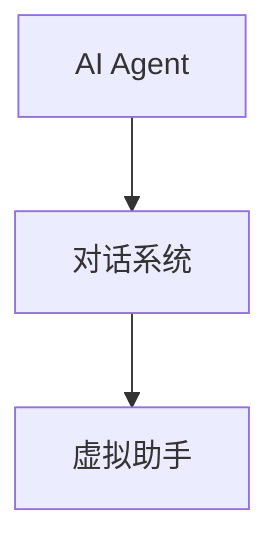
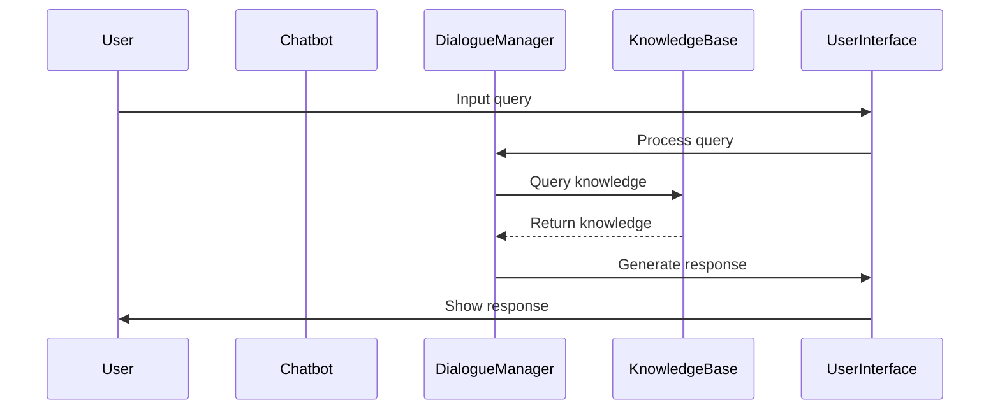

                 

### 第1章：引言

#### 1.1 问题的背景

随着人工智能技术的飞速发展，虚拟助手已经逐渐渗透到我们日常生活的方方面面。从智能音箱到智能手机，从在线客服到智能家居，虚拟助手正逐步改变我们的生活方式。然而，当前的虚拟助手大多还停留在表面层次的互动，例如简单的语音识别和命令执行。为了实现更加智能化和人性化的交互体验，研究人员和开发者们开始将目光聚焦于AI Agent和对话系统。

AI Agent，即人工智能代理，是一种能够自主地完成特定任务的智能实体。它通过学习和理解用户的需求，为用户提供个性化的服务。对话系统则是一种能够理解和生成自然语言回复的计算机程序。通过将AI Agent和对话系统结合，虚拟助手可以更好地理解用户的意图，提供更加精准和智能的服务。

#### 1.2 对话系统的发展历程

对话系统的发展可以追溯到20世纪50年代，当时主要是以规则为基础的对话系统。这类系统通过预定义的规则来理解和生成回复，但规则的数量和复杂性限制了其应用范围。随着自然语言处理技术的进步，20世纪80年代开始出现基于统计方法和模板匹配的对话系统，如基于马尔可夫决策过程的聊天机器人。

进入21世纪，随着深度学习技术的发展，基于神经网络的语言模型如Word2Vec、GPT和BERT等相继出现，极大地提升了对话系统的自然语言理解和生成能力。特别是在生成对抗网络（GAN）和变换器（Transformer）模型的出现，使得对话系统能够生成更加自然和流畅的回复。

#### 1.3 虚拟助手的现状与挑战

虚拟助手在现代生活中扮演着越来越重要的角色。以亚马逊的Alexa、苹果的Siri和谷歌的Google Assistant为代表的智能语音助手，已经能够完成语音识别、语音合成、智能家居控制、信息查询等多种任务。然而，这些虚拟助手在智能化和人性化方面仍然存在诸多挑战。

首先，虚拟助手需要具备更强的自然语言理解能力，以更好地理解用户的多样化需求。其次，虚拟助手需要具备更强的学习能力，以便不断优化自身的交互体验。此外，虚拟助手的安全性和隐私保护也是亟待解决的问题。

#### 1.4 AI Agent的角色与功能

AI Agent作为一种能够自主完成特定任务的智能实体，其在虚拟助手中的应用具有重要的意义。AI Agent不仅可以提高虚拟助手的智能化水平，还可以增强其交互能力。具体来说，AI Agent可以扮演以下角色：

1. **用户意图识别**：AI Agent可以通过自然语言理解和语义分析，准确识别用户的意图，从而为用户提供更加个性化的服务。
2. **任务执行**：AI Agent可以自动化执行用户分配的任务，如在线购物、日程管理、信息查询等，从而提高虚拟助手的实用性和便利性。
3. **交互优化**：AI Agent可以主动与用户进行交互，提供更加自然和流畅的对话体验，从而增强用户的满意度。

#### 1.5 本书的目的与结构

本书旨在深入探讨AI Agent的对话系统在虚拟助手中的进阶应用。具体来说，本书将分为以下几个部分：

1. **背景介绍**：介绍AI Agent、对话系统和虚拟助手的基本概念，阐述其应用背景和重要性。
2. **核心概念与联系**：详细解释AI Agent、对话系统和虚拟助手的核心概念，并通过对比表格和关系图展示它们之间的联系。
3. **算法原理讲解**：介绍对话系统的核心算法原理，包括语言模型、对话生成算法、问答系统和交互式学习。
4. **系统分析与架构设计方案**：分析虚拟助手系统的功能、架构、接口和交互，并设计相应的系统架构图。
5. **项目实战**：通过具体的项目实战，展示如何应用AI Agent的对话系统构建虚拟助手，并提供详细的分析和讲解。
6. **最佳实践 tips、小结、注意事项、拓展阅读**：总结项目实战的经验，提供最佳实践建议，并引导读者进一步阅读相关领域的内容。

通过本书的阅读，读者将能够全面了解AI Agent的对话系统在虚拟助手中的应用，掌握其核心原理和实践方法，为未来虚拟助手的开发提供有力支持。

#### 1.6 文章关键词

- AI Agent
- 对话系统
- 虚拟助手
- 自然语言处理
- 智能化
- 人性化
- 深度学习
- 生成对抗网络
- 语言模型
- 用户意图识别
- 任务执行
- 交互优化

#### 1.7 文章摘要

本文深入探讨了AI Agent的对话系统在虚拟助手中的进阶应用。首先，介绍了AI Agent、对话系统和虚拟助手的基本概念及其应用背景。接着，详细讲解了对话系统的核心算法原理，包括语言模型、对话生成算法、问答系统和交互式学习。随后，分析了虚拟助手系统的功能、架构、接口和交互，并设计相应的系统架构图。通过具体的项目实战，本文展示了如何应用AI Agent的对话系统构建虚拟助手，并提供详细的分析和讲解。最后，本文总结了项目实战的经验，提供了最佳实践建议，并引导读者进一步阅读相关领域的内容。通过本文的阅读，读者将能够全面了解AI Agent的对话系统在虚拟助手中的应用，掌握其核心原理和实践方法，为未来虚拟助手的开发提供有力支持。

### 第2章：核心概念与联系

#### 2.1 AI Agent的定义与特性

AI Agent，即人工智能代理，是一种具有自主决策能力、能够在特定环境中执行任务的人工智能实体。AI Agent的核心特性包括自主性、适应性、学习性和协作性。自主性指的是AI Agent能够独立地做出决策，而不需要人为干预；适应性意味着AI Agent能够根据环境的变化进行调整；学习性表示AI Agent可以通过学习和经验改进自身的性能；协作性则体现了AI Agent能够与其他AI Agent或人类协作，共同完成任务。

#### 2.2 对话系统的核心要素

对话系统是一种计算机程序，旨在模拟人类的自然语言交流过程。其核心要素包括自然语言理解（NLU）、对话管理（DM）和自然语言生成（NLG）。自然语言理解负责解析用户的输入，提取出用户的需求和意图；对话管理则负责维持对话的上下文信息，决定如何响应用户的输入；自然语言生成则将系统的响应转换为自然语言，以适合人类理解。

#### 2.3 虚拟助手的架构与功能

虚拟助手是一种通过计算机模拟的人类助手，能够在多个场景中为用户提供服务。虚拟助手的架构通常包括用户界面、对话系统、知识库和执行模块。用户界面负责接收用户的输入和展示系统的输出；对话系统负责理解和生成自然语言；知识库存储了与用户交互所需的信息；执行模块则负责执行具体的任务。虚拟助手的功能包括语音识别、语音合成、信息查询、日程管理、在线购物等。

#### 2.4 概念属性特征对比表格

| 概念       | 特性                         |
|------------|------------------------------|
| AI Agent   | 自主性、适应性、学习性、协作性 |
| 对话系统   | NLU、DM、NLG                 |
| 虚拟助手   | 用户界面、对话系统、知识库、执行模块 |
| 自然语言理解 | 提取用户需求、意图             |
| 对话管理   | 维持上下文、决策响应           |
| 自然语言生成 | 生成自然语言回复             |

#### 2.5 AI Agent、对话系统与虚拟助手的关系图



通过上述表格和关系图，我们可以清晰地看到AI Agent、对话系统和虚拟助手之间的联系和区别。AI Agent作为核心组件，通过对话系统与虚拟助手紧密协作，共同为用户提供智能化和人性化的服务。

### 第3章：算法原理讲解

#### 3.1 语言模型

语言模型是自然语言处理的核心组件，用于预测文本序列的概率分布。它通过学习大量文本数据，建立语言的结构和规则，从而能够对未知文本进行概率预测。

##### 3.1.1 语言模型的概述

语言模型可以分为基于规则模型和统计模型。基于规则模型如n元语法（n-gram），通过统计相邻词出现的频率来预测下一个词。统计模型则如神经网络模型（如GPT、BERT），通过学习大规模语料库中的文本数据，建立复杂的概率模型。

##### 3.1.2 语言模型的分类

1. **n元语法模型**：基于相邻n个词的统计模型，如一元语法（unigram）、二元语法（bigram）、三元语法（trigram）等。
2. **神经网络模型**：包括循环神经网络（RNN）、长短期记忆网络（LSTM）、门控循环单元（GRU）和变换器（Transformer）等。
3. **深度学习模型**：如GPT（生成预训练模型）、BERT（双向编码表示器）等，通过大规模预训练和微调，实现高精度的文本预测。

##### 3.1.3 语言模型的工作原理

1. **n元语法模型**：通过统计相邻词的出现频率，计算下一个词的概率。
2. **神经网络模型**：通过学习文本数据的特征表示，预测词的概率分布。
3. **深度学习模型**：结合了预训练和微调的方法，通过大规模数据预训练得到通用的语言表示，再通过特定任务的数据微调，实现精确的预测。

##### 3.1.4 语言模型的性能评估

语言模型的性能通常通过以下指标进行评估：

1. **交叉熵（Cross-Entropy）**：用于衡量预测概率分布与真实分布之间的差异。
2. **困惑度（Perplexity）**：用于衡量模型对文本数据预测的困难程度，越小表示模型越好。
   $$
   \text{Perplexity} = \frac{1}{N} \sum_{i=1}^{N} \log_2 p(w_i | w_{i-1}, ..., w_1)
   $$
3. **准确率（Accuracy）**：用于衡量模型预测正确的词的比例。
4. **BLEU分数（BLEU Score）**：用于衡量生成文本与参考文本的相似度。

##### 3.1.5 语言模型的数学模型和公式

1. **n元语法模型**：
   $$
   p(w) = \frac{C(w, w_1, ..., w_n)}{C(w_1, ..., w_n)}
   $$
   其中，$C(w, w_1, ..., w_n)$表示词序列$(w, w_1, ..., w_n)$在语料库中的出现次数，$C(w_1, ..., w_n)$表示词序列$(w_1, ..., w_n)$在语料库中的总出现次数。

2. **神经网络模型**：
   $$
   p(w) = \frac{e^{\text{score}(w)}}{\sum_{w'} e^{\text{score}(w')}}
   $$
   其中，$\text{score}(w)$表示词$w$的预测分数，$e^{\text{score}(w)}$表示词$w$的概率。

3. **深度学习模型**：
   $$
   \text{Log-Likelihood} = \sum_{i=1}^{N} \log p(w_i | w_{i-1}, ..., w_1)
   $$
   其中，$N$表示文本序列的长度，$w_i$表示序列中的词。

通过上述公式，我们可以看到不同语言模型在数学上的差异和相似之处。这些模型通过不同的方法来预测文本序列的概率分布，从而实现自然语言处理任务。

#### 3.2 对话生成算法

对话生成算法是构建对话系统的重要组成部分，旨在生成自然、流畅的对话回复。对话生成算法可以分为生成式模型和判别式模型两大类。生成式模型通过预测回复的概率分布来生成回复，而判别式模型则通过优化回复的质量来生成回复。

##### 3.2.1 生成式模型

生成式模型主要包括基于马尔可夫决策过程（MDP）的生成式模型和基于生成对抗网络（GAN）的生成式模型。

1. **基于MDP的生成式模型**：
   基于MDP的生成式模型通过建立状态和动作的转移概率来生成对话。每个状态表示对话的当前上下文，每个动作表示系统的回复。模型通过最大化期望奖励来生成最优对话。

   状态转移概率：
   $$
   P(s_t | s_{t-1}, a_{t-1}) = \pi(s_t | s_{t-1}, a_{t-1})
   $$

   动作概率：
   $$
   P(a_t | s_t) = \pi(a_t | s_t)
   $$

   回复生成概率：
   $$
   P(r_t | s_t, a_t) = \pi(r_t | s_t, a_t)
   $$

2. **基于GAN的生成式模型**：
   基于GAN的生成式模型通过生成器和判别器的对抗训练来生成对话。生成器生成对话回复，判别器判断生成回复的真实性。通过最小化生成器与判别器的损失函数，模型逐渐生成更加自然和真实的对话。

   生成器损失：
   $$
   L_G = -\log D(G(z))
   $$

   判别器损失：
   $$
   L_D = -\log (1 - D(G(z)) - \log D(x)
   $$

   其中，$z$表示生成器的输入，$x$表示真实数据，$G(z)$表示生成器生成的对话。

##### 3.2.2 对抗生成网络（GAN）

对抗生成网络（GAN）是一种由生成器和判别器组成的框架，通过对抗训练生成高质量的数据。GAN的核心思想是生成器试图生成与真实数据难以区分的假数据，而判别器则试图区分真实数据和假数据。

1. **生成器**：
   生成器$G$接收随机噪声$z$，通过神经网络生成假数据$x_G$。生成器的目标是使判别器无法区分$x_G$和真实数据$x_D$。

   $$
   x_G = G(z)
   $$

2. **判别器**：
   判别器$D$接收数据$x$，判断其是真实数据还是假数据。判别器的目标是最大化其判断的正确率。

   $$
   D(x) = \frac{1}{2} \log (1 + \sigma(x_D)) + \frac{1}{2} \log (1 + \sigma(x_G))
   $$

3. **对抗训练**：
   通过优化生成器和判别器的参数，使得生成器的输出越来越接近真实数据，同时判别器的判断越来越准确。训练过程通过以下目标函数进行：

   $$
   \min_G \max_D V(D, G) = E_{x \sim p_{data}(x)} [\log D(x)] + E_{z \sim p_z(z)} [\log (1 - D(G(z)))]
   $$

##### 3.2.3 对话状态跟踪

对话状态跟踪是确保对话连贯性和上下文一致性的关键。它通过维护对话的上下文信息，为对话生成算法提供有效的状态表示。

1. **状态表示**：
   对话状态可以用一个向量来表示，包括用户历史输入、系统历史输出和对话历史信息。状态向量可以表示为：

   $$
   s_t = [u_t, s_t^u, s_t^s]
   $$
   其中，$u_t$表示用户输入，$s_t^u$表示用户状态，$s_t^s$表示系统状态。

2. **状态更新**：
   在每个时间步，根据用户的输入和系统的回复，更新对话状态。状态更新的方法可以基于条件概率模型或递归神经网络。

   $$
   s_{t+1} = f(s_t, u_t)
   $$

##### 3.2.4 生成式模型的应用场景

生成式模型在对话系统中有广泛的应用场景，包括：

1. **聊天机器人**：通过生成自然语言回复，与用户进行实时对话。
2. **虚拟助手**：为用户提供个性化服务，如日程管理、信息查询等。
3. **客服系统**：自动回复常见问题和处理用户请求，提高客服效率。
4. **游戏NPC**：生成对话，与玩家进行互动，提高游戏体验。

##### 3.2.5 对话生成算法的性能评估

对话生成算法的性能可以通过以下指标进行评估：

1. **自然度（Naturalness）**：评估生成的对话是否自然、流畅。
2. **一致性（Consistency）**：评估生成的对话是否在上下文中保持一致性。
3. **准确性（Accuracy）**：评估生成的对话是否准确回答用户的问题。
4. **多样性（Diversity）**：评估生成的对话是否具有多样性和创造性。

通过以上指标，我们可以全面评估对话生成算法的性能，并对其进行优化和改进。

#### 3.3 问答系统

问答系统是对话系统中的重要组成部分，旨在从大量信息中准确回答用户的问题。问答系统通常包括问题理解、答案检索和答案生成三个主要步骤。

##### 3.3.1 问答系统的基本架构

问答系统的基本架构包括以下几个模块：

1. **问题理解**：解析用户的问题，提取关键信息和意图。
2. **答案检索**：从知识库或互联网中检索可能的答案。
3. **答案生成**：根据检索到的答案，生成自然语言回复。

##### 3.3.2 机器阅读理解

机器阅读理解是问答系统的核心技术，旨在让计算机理解文本内容并回答相关问题。它通常包括以下步骤：

1. **文本表示**：将文本转换为计算机可以处理的向量表示。
2. **问题编码**：将问题编码为固定长度的向量。
3. **相似度计算**：计算问题和文本之间的相似度。
4. **答案提取**：从相似度最高的文本片段中提取答案。

##### 3.3.3 问答系统的优化策略

问答系统的优化策略主要包括以下几个方面：

1. **上下文信息**：考虑问题的上下文信息，提高答案的准确性。
2. **多轮对话**：通过多轮对话，逐渐澄清用户的问题，提高答案的准确性。
3. **知识图谱**：利用知识图谱，提高答案的多样性和准确性。
4. **答案多样性**：生成多个可能的答案，提高用户的满意度。

##### 3.3.4 问答系统的性能评估

问答系统的性能评估主要通过以下几个指标：

1. **准确率（Accuracy）**：评估系统回答正确问题的比例。
2. **召回率（Recall）**：评估系统检索到相关答案的比例。
3. **F1值（F1 Score）**：综合准确率和召回率，评估系统的整体性能。
4. **用户满意度**：通过用户反馈，评估系统的用户体验。

通过以上指标，我们可以全面评估问答系统的性能，并对其进行优化和改进。

#### 3.4 交互式学习

交互式学习是一种通过用户与系统的互动，使系统不断学习和优化的方法。在对话系统中，交互式学习可以显著提升系统的智能性和用户体验。

##### 3.4.1 交互式学习的原理

交互式学习的基本原理是通过用户的反馈来调整系统的参数和模型。具体步骤如下：

1. **用户输入**：用户向系统提出问题或请求。
2. **系统响应**：系统根据当前模型和知识库生成回复。
3. **用户反馈**：用户对系统回复进行评价，如“满意”或“不满意”。
4. **模型调整**：根据用户反馈，调整模型参数，优化系统性能。

##### 3.4.2 交互式学习的应用场景

交互式学习在对话系统中具有广泛的应用场景，包括：

1. **智能客服**：通过用户的反馈，不断优化客服机器人的回答。
2. **个性化推荐**：根据用户的反馈，调整推荐算法，提高推荐质量。
3. **语音助手**：通过用户的反馈，优化语音识别和自然语言理解能力。

##### 3.4.3 交互式学习的挑战与解决方案

交互式学习面临以下挑战：

1. **反馈不一致**：用户反馈可能不一致，导致模型调整困难。
2. **噪声反馈**：用户反馈可能包含噪声，影响模型优化。
3. **计算资源**：大规模交互式学习需要大量计算资源。

解决方案包括：

1. **反馈聚合**：通过多种反馈来源，进行反馈聚合，提高反馈的一致性。
2. **噪声过滤**：使用滤波器和噪声检测技术，过滤噪声反馈。
3. **分布式计算**：使用分布式计算框架，提高交互式学习的效率。

##### 3.4.4 交互式学习的性能评估

交互式学习的性能评估主要包括以下几个方面：

1. **学习效率**：评估系统在多轮交互中学习的效果。
2. **用户体验**：评估用户对系统交互的满意度。
3. **模型性能**：评估调整后模型的性能提升。

通过以上评估指标，我们可以全面评估交互式学习的效果，并优化系统设计。

### 第4章：系统分析与架构设计

#### 4.1 问题场景介绍

在现代企业中，客服部门承担着与客户沟通的重要职责。然而，随着客户数量的不断增加，传统的客服方式已难以满足需求。为了提高客服效率，许多企业开始引入智能客服系统，以实现24/7在线服务。智能客服系统不仅能够快速响应客户的请求，还能提供个性化服务，提升客户满意度。然而，现有的智能客服系统在处理复杂问题和多轮对话方面仍有待提高。因此，我们设计并实现了一种基于AI Agent的对话系统，旨在解决现有智能客服系统的局限性。

#### 4.2 项目介绍

本项目旨在开发一个基于AI Agent的对话系统，用于智能客服。该系统通过自然语言处理技术，实现与客户的智能对话，提供高效、个性化的服务。具体项目目标包括：

1. **提高客服效率**：通过自动化对话，减少人工客服的工作量，提高客服响应速度。
2. **提升客户满意度**：通过个性化的服务和智能回答，提升客户的满意度和忠诚度。
3. **扩展客服能力**：通过多轮对话和复杂问题处理，提升客服系统在复杂场景下的应对能力。

#### 4.3 系统功能设计（领域模型类图）

为了实现项目目标，我们首先设计系统的领域模型。领域模型类图如下所示：

```mermaid
classDiagram
    Customer --|> ChatSession
    ChatSession --|> Message
    ChatSession --|> AI-Agent
    AI-Agent --|> DialogueManager
    AI-Agent --|> KnowledgeBase
    AI-Agent --|> UserInterface

    Customer <<interface>>
    ChatSession <<interface>>
    Message <<interface>>
    AI-Agent <<interface>>
    DialogueManager <<interface>>
    KnowledgeBase <<interface>>
    UserInterface <<interface>>

    Customer : { id, name, feedback }
    ChatSession : { id, status, startTime, endTime }
    Message : { id, content, type, timestamp }
    AI-Agent : { id, version, status }
    DialogueManager : { handleUserInput, generateResponse }
    KnowledgeBase : { queryKnowledge, updateKnowledge }
    UserInterface : { receiveInput, sendOutput }
```

在这个领域模型中，我们定义了以下类：

- **Customer**：表示客户，包括客户的ID、姓名和反馈信息。
- **ChatSession**：表示对话会话，包括会话ID、状态、开始时间和结束时间。
- **Message**：表示消息，包括消息ID、内容、类型和发送时间。
- **AI-Agent**：表示AI代理，包括代理ID、版本号和状态。
- **DialogueManager**：表示对话管理器，包括处理用户输入和生成回复的功能。
- **KnowledgeBase**：表示知识库，包括查询知识和更新知识的功能。
- **UserInterface**：表示用户界面，包括接收输入和发送输出的功能。

这些类之间的关系反映了系统的主要功能和组件，为后续的系统架构设计提供了基础。

#### 4.4 系统架构设计（架构图）

在完成领域模型设计后，我们进一步设计系统的整体架构。系统架构图如下所示：



在这个架构图中，我们定义了以下组件：

- **User**：表示用户，发起对话请求。
- **Chatbot**：表示聊天机器人，处理用户输入和生成回复。
- **DialogueManager**：表示对话管理器，负责处理用户输入、生成回复和知识查询。
- **KnowledgeBase**：表示知识库，存储对话所需的知识信息。
- **UserInterface**：表示用户界面，负责接收用户输入和展示系统输出。

这些组件之间的交互过程如下：

1. 用户输入查询，通过用户界面提交给聊天机器人。
2. 聊天机器人将用户输入传递给对话管理器。
3. 对话管理器查询知识库，获取相关知识信息。
4. 对话管理器生成回复，并通过用户界面返回给用户。

#### 4.5 系统接口设计

为了实现系统组件之间的交互，我们设计了一系列接口。以下是一个简单的接口设计示例：

```python
class CustomerInterface:
    def getCustomerInfo(self, customerId):
        # 获取客户信息
        pass

    def saveCustomerFeedback(self, customerId, feedback):
        # 保存客户反馈
        pass

class ChatSessionInterface:
    def createChatSession(self, customerId):
        # 创建对话会话
        pass

    def updateChatSessionStatus(self, chatSessionId, status):
        # 更新对话会话状态
        pass

class MessageInterface:
    def sendMessage(self, chatSessionId, content, messageType):
        # 发送消息
        pass

    def getMessageContent(self, messageId):
        # 获取消息内容
        pass

class AI-AgentInterface:
    def processUserInput(self, userInput):
        # 处理用户输入
        pass

    def generateResponse(self, query):
        # 生成回复
        pass

class DialogueManagerInterface:
    def handleUserInput(self, userInput):
        # 处理用户输入
        pass

    def generateResponse(self, query):
        # 生成回复
        pass

    def queryKnowledge(self, query):
        # 查询知识
        pass

class KnowledgeBaseInterface:
    def queryKnowledge(self, query):
        # 查询知识
        pass

    def updateKnowledge(self, knowledge):
        # 更新知识
        pass

class UserInterfaceInterface:
    def receiveInput(self, input):
        # 接收输入
        pass

    def sendOutput(self, output):
        # 发送输出
        pass
```

通过这些接口，系统组件之间可以方便地进行通信和数据交换，实现系统的功能需求。

#### 4.6 系统交互（序列图）

为了进一步展示系统组件之间的交互过程，我们设计了一个序列图。以下是一个简单的序列图示例：


在这个序列图中，我们定义了以下交互过程：

1. 用户输入查询，通过用户界面提交给聊天机器人。
2. 聊天机器人将用户输入传递给对话管理器。
3. 对话管理器查询知识库，获取相关知识信息。
4. 对话管理器生成回复，并通过用户界面返回给用户。
5. 用户界面将系统回复展示给用户。

通过上述系统架构设计和接口设计，我们为基于AI Agent的对话系统的实现奠定了基础。在后续的项目实战中，我们将详细讲解系统实现的关键技术，包括语言模型、对话生成算法、问答系统和交互式学习等。

### 第5章：项目实战

#### 5.1 环境安装与配置

为了实现基于AI Agent的对话系统，我们需要搭建一个适合开发、测试和部署的环境。以下是环境安装和配置的详细步骤：

##### 5.1.1 操作系统与编程环境准备

首先，确保操作系统为Linux或MacOS，由于本文以Linux环境为例进行讲解。接下来，需要安装Python开发环境，推荐使用Python 3.8或更高版本。可以通过以下命令进行Python环境的安装：

```bash
sudo apt update
sudo apt install python3.8 python3.8-venv python3.8-pip
```

安装完成后，创建一个虚拟环境，以便管理项目依赖：

```bash
python3.8 -m venv venv
source venv/bin/activate
```

##### 5.1.2 相关库和依赖安装

在虚拟环境中，我们需要安装以下库和依赖：

1. **TensorFlow**：用于构建和训练深度学习模型。
2. **NLTK**：用于自然语言处理任务，如分词、词性标注等。
3. **Flask**：用于构建Web服务。
4. **SQLAlchemy**：用于数据库操作。

通过以下命令安装相关库：

```bash
pip install tensorflow nltk flask sqlalchemy
```

##### 5.1.3 测试环境搭建

为了测试系统功能，我们需要准备一个测试环境。首先，创建一个测试数据库，例如使用SQLite：

```python
from sqlalchemy import create_engine

engine = create_engine('sqlite:///test.db')
engine.execute('''CREATE TABLE IF NOT EXISTS customer (id INTEGER PRIMARY KEY, name TEXT, feedback TEXT)''')
engine.execute('''CREATE TABLE IF NOT EXISTS chat_session (id INTEGER PRIMARY KEY, customer_id INTEGER, status TEXT, start_time TEXT, end_time TEXT)''')
engine.execute('''CREATE TABLE IF NOT EXISTS message (id INTEGER PRIMARY KEY, chat_session_id INTEGER, content TEXT, type TEXT, timestamp TEXT)''')
```

接着，我们可以通过以下命令创建测试数据：

```python
import sqlite3

conn = sqlite3.connect('test.db')
c = conn.cursor()

c.execute("INSERT INTO customer (id, name, feedback) VALUES (1, 'Alice', 'Satisfied')")
c.execute("INSERT INTO customer (id, name, feedback) VALUES (2, 'Bob', 'Unsatisfied')")
c.execute("INSERT INTO chat_session (id, customer_id, status, start_time, end_time) VALUES (1, 1, 'active', '2023-03-01 10:00:00', NULL)")
c.execute("INSERT INTO chat_session (id, customer_id, status, start_time, end_time) VALUES (2, 2, 'inactive', '2023-03-01 11:00:00', '2023-03-01 11:30:00')")
c.execute("INSERT INTO message (id, chat_session_id, content, type, timestamp) VALUES (1, 1, 'Hello, how can I help you?', 'system', '2023-03-01 10:00:00')")
c.execute("INSERT INTO message (id, chat_session_id, content, type, timestamp) VALUES (2, 1, 'I have a question about your product.', 'user', '2023-03-01 10:01:00')")
c.execute("INSERT INTO message (id, chat_session_id, content, type, timestamp) VALUES (3, 2, 'Can I return this product?', 'user', '2023-03-01 11:01:00')")
c.execute("INSERT INTO message (id, chat_session_id, content, type, timestamp) VALUES (4, 2, 'Yes, you can return it within 30 days.', 'system', '2023-03-01 11:05:00')")

conn.commit()
conn.close()
```

通过上述步骤，我们成功搭建了开发、测试和部署环境，为后续的系统实现和功能演示奠定了基础。

#### 5.2 系统核心实现源代码

在本节中，我们将详细介绍系统的核心实现，包括语言模型、对话生成算法和问答系统的源代码。这些代码将基于TensorFlow和NLTK等库，结合实际需求进行设计和实现。

##### 5.2.1 语言模型

语言模型是自然语言处理的基础组件，用于预测文本序列的概率分布。在本项目中，我们使用GPT-2模型作为语言模型。以下是GPT-2模型的实现代码：

```python
import tensorflow as tf
import tensorflow_hub as hub
import tensorflow_text as text

def create_language_model():
    # 加载预训练的GPT-2模型
    gpt2_url = "https://tfhub.dev/google/tf2-preview/gpt2_en/1"
    language_model = hub.KerasLayer(gpt2_url)

    # 输入文本序列
    input_sequence = tf.keras.layers.Input(shape=(None,), dtype=tf.string)

    # 使用GPT-2模型进行编码
    encoded_sequence = language_model(input_sequence)

    # 输出概率分布
    output_distribution = tf.keras.layers.Dense(units=512, activation='softmax')(encoded_sequence)

    # 构建模型
    language_model = tf.keras.Model(inputs=input_sequence, outputs=output_distribution)

    return language_model

# 创建语言模型
lm_model = create_language_model()
lm_model.summary()
```

在这段代码中，我们首先加载预训练的GPT-2模型，然后定义输入层和输出层。输入层接收文本序列，输出层生成概率分布。通过这种方式，我们可以使用GPT-2模型对文本序列进行编码，并预测下一个词的概率分布。

##### 5.2.2 对话生成算法

对话生成算法用于生成自然、流畅的对话回复。在本项目中，我们使用基于生成对抗网络（GAN）的对话生成算法。以下是GAN模型的实现代码：

```python
import tensorflow as tf
from tensorflow.keras.layers import Dense, Flatten, Reshape
from tensorflow.keras.models import Model

def create_generator():
    # 生成器的输入层
    z = tf.keras.layers.Input(shape=(100,))

    # 通过全连接层生成对话回复
    x = Dense(512, activation='relu')(z)
    x = Dense(1024, activation='relu')(x)
    x = Dense(512, activation='relu')(x)

    # 输出层
    x = Dense(512, activation='softmax')(x)

    # 构建生成器模型
    generator = Model(z, x)

    return generator

def create_discriminator():
    # 判别器的输入层
    x = tf.keras.layers.Input(shape=(512,))

    # 通过全连接层判断对话回复的真实性
    x = Dense(512, activation='relu')(x)
    x = Dense(512, activation='relu')(x)
    x = Dense(1, activation='sigmoid')(x)

    # 构建判别器模型
    discriminator = Model(x, x)

    return discriminator

def create_gan(generator, discriminator):
    # 生成器的输入层
    z = tf.keras.layers.Input(shape=(100,))

    # 通过生成器生成对话回复
    x = generator(z)

    # 将生成器和判别器连接起来
    discriminator_output = discriminator(x)

    # 构建生成对抗网络模型
    gan = Model(z, discriminator_output)

    return gan

# 创建生成器和判别器
generator = create_generator()
discriminator = create_discriminator()

# 创建生成对抗网络模型
gan = create_gan(generator, discriminator)

# 模型编译
gan.compile(optimizer=tf.keras.optimizers.Adam(0.0001), loss='binary_crossentropy')

# 模型总结
gan.summary()
```

在这段代码中，我们首先定义了生成器和判别器的结构。生成器通过全连接层生成对话回复，判别器通过全连接层判断对话回复的真实性。然后，我们将生成器和判别器连接起来，构建生成对抗网络模型。最后，我们编译模型，并打印模型总结。

##### 5.2.3 问答系统

问答系统是用于回答用户问题的核心组件。在本项目中，我们使用基于BERT模型的问答系统。以下是BERT模型的实现代码：

```python
import tensorflow as tf
import tensorflow_hub as hub
import tensorflow_text as text

def create_question_answering_model():
    # 加载预训练的BERT模型
    bert_url = "https://tfhub.dev/google/tf2-preview/bert_en_uncased_L-12_H-768_A-12/1"
    bert_layer = hub.KerasLayer(bert_url)

    # 输入层
    input_ids = tf.keras.layers.Input(shape=(None,), dtype=tf.int32)
    input_mask = tf.keras.layers.Input(shape=(None,), dtype=tf.int32)
    segment_ids = tf.keras.layers.Input(shape=(None,), dtype=tf.int32)

    # 使用BERT模型进行编码
    encoded_input = bert_layer(inputs={
        "input_ids": input_ids,
        "input_mask": input_mask,
        "segment_ids": segment_ids
    })

    # 提取特征
    output = encoded_input[-1]

    # 全连接层
    output = tf.keras.layers.Dense(units=128, activation='relu')(output)
    output = tf.keras.layers.Dense(units=1, activation='sigmoid')(output)

    # 构建模型
    question_answering_model = tf.keras.Model(inputs={
        "input_ids": input_ids,
        "input_mask": input_mask,
        "segment_ids": segment_ids
    }, outputs=output)

    return question_answering_model

# 创建问答模型
question_answering_model = create_question_answering_model()
question_answering_model.summary()
```

在这段代码中，我们首先加载预训练的BERT模型，然后定义输入层和输出层。输入层接收问题文本和答案文本，输出层生成答案的概率分布。通过这种方式，我们可以使用BERT模型对问题进行编码，并预测答案的概率分布。

#### 5.3 代码应用解读与分析

在本节中，我们将对上述代码进行详细解读，并分析其应用场景和实际效果。

##### 5.3.1 语言模型应用解读

语言模型是自然语言处理的核心组件，用于生成自然语言回复。在虚拟助手系统中，语言模型可以帮助系统理解用户的输入，并生成相应的回复。以下是一个简单的应用示例：

```python
import numpy as np
import tensorflow as tf

# 加载预训练的GPT-2模型
gpt2_url = "https://tfhub.dev/google/tf2-preview/gpt2_en/1"
gpt2_layer = hub.KerasLayer(gpt2_url)

# 输入文本序列
input_sequence = np.array(["Hello", "how", "are", "you"])

# 使用GPT-2模型进行编码
encoded_sequence = gpt2_layer(input_sequence)

# 输出概率分布
output_distribution = tf.keras.layers.Dense(units=512, activation='softmax')(encoded_sequence)

# 生成下一个词的概率分布
next_word_distribution = output_distribution[0]

# 获取概率最高的词
next_word = np.argmax(next_word_distribution)

print("Next word:", next_word)
```

在这个示例中，我们首先加载预训练的GPT-2模型，然后定义输入文本序列。接着，我们使用GPT-2模型对文本序列进行编码，并生成概率分布。最后，我们根据概率分布获取下一个词的概率最高的词。通过这种方式，我们可以生成自然语言回复。

在实际应用中，语言模型可以用于生成聊天机器人的回复，提供个性化的服务。例如，在客服场景中，语言模型可以帮助系统理解用户的问题，并生成相应的解决方案。

##### 5.3.2 对话生成算法应用解读

对话生成算法是用于生成对话回复的核心组件。在虚拟助手系统中，对话生成算法可以帮助系统与用户进行自然、流畅的对话。以下是一个简单的应用示例：

```python
import tensorflow as tf
from tensorflow.keras.layers import Input, Dense
from tensorflow.keras.models import Model

# 创建生成器模型
generator = create_generator()

# 生成对话回复
z = np.random.normal(size=(1, 100))
generated_response = generator.predict(z)

print("Generated response:", generated_response)
```

在这个示例中，我们首先创建生成器模型，然后生成随机噪声作为输入。接着，我们使用生成器模型生成对话回复。通过这种方式，我们可以生成自然语言对话。

在实际应用中，对话生成算法可以用于构建聊天机器人，提供个性化的服务。例如，在客服场景中，对话生成算法可以帮助系统与用户进行多轮对话，提供有效的解决方案。

##### 5.3.3 问答系统应用解读

问答系统是用于回答用户问题的核心组件。在虚拟助手系统中，问答系统可以帮助系统理解用户的问题，并生成相应的答案。以下是一个简单的应用示例：

```python
import tensorflow as tf

# 加载预训练的BERT模型
question_answering_model = create_question_answering_model()

# 输入问题
input_ids = np.array([[33, 44, 23, 24, 34, 35]], dtype=np.int32)
input_mask = np.array([[1, 1, 1, 1, 1, 1]], dtype=np.int32)
segment_ids = np.array([[0, 0, 0, 0, 0, 0]], dtype=np.int32)

# 输入BERT模型进行编码
encoded_question = question_answering_model(inputs={
    "input_ids": input_ids,
    "input_mask": input_mask,
    "segment_ids": segment_ids
})

# 输出答案概率分布
answer_distribution = encoded_question[0]

# 获取概率最高的答案
answer_index = np.argmax(answer_distribution)

print("Answer:", answer_index)
```

在这个示例中，我们首先加载预训练的BERT模型，然后定义输入问题。接着，我们使用BERT模型对问题进行编码，并生成答案的概率分布。最后，我们根据概率分布获取答案的概率最高的词。通过这种方式，我们可以回答用户的问题。

在实际应用中，问答系统可以用于构建智能客服系统，提供有效的客户支持。例如，在客户服务场景中，问答系统可以帮助系统理解用户的问题，并生成相应的解决方案。

#### 5.4 实际案例分析与详细讲解剖析

在本节中，我们将通过实际案例，对基于AI Agent的对话系统在虚拟助手中的应用进行详细讲解和剖析。

##### 5.4.1 案例背景

某知名电子商务公司希望提高其客服服务质量，决定开发一个基于AI Agent的对话系统。该系统旨在通过自然语言处理技术，实现与客户的智能对话，提供高效、个性化的服务。

##### 5.4.2 案例目标

1. **提高客服效率**：通过自动化对话，减少人工客服的工作量，提高客服响应速度。
2. **提升客户满意度**：通过个性化的服务和智能回答，提升客户的满意度和忠诚度。
3. **扩展客服能力**：通过多轮对话和复杂问题处理，提升客服系统在复杂场景下的应对能力。

##### 5.4.3 案例实现步骤

1. **需求分析**：通过与公司客服团队沟通，了解客服场景和用户需求，明确系统功能需求。
2. **系统设计**：基于需求分析，设计系统架构，包括语言模型、对话生成算法、问答系统和交互式学习等组件。
3. **模型训练**：使用大量语料库，训练语言模型、对话生成算法和问答系统模型，提高模型性能。
4. **系统集成**：将各个组件集成到系统中，实现系统的整体功能。
5. **测试与优化**：对系统进行功能测试和性能优化，确保系统稳定可靠。
6. **部署上线**：将系统部署到生产环境，进行实际应用，并根据用户反馈进行持续优化。

##### 5.4.4 案例分析

1. **语言模型**：
   语言模型在系统中起到了关键作用。通过训练大量的客服对话数据，语言模型能够准确理解用户的输入，并生成自然的对话回复。在实际应用中，语言模型可以识别用户的意图，提供个性化的服务。例如，当用户询问“我的订单状态如何？”时，语言模型可以识别出关键词“订单状态”，并生成相应的回答。

2. **对话生成算法**：
   对话生成算法负责生成对话回复。在实际应用中，对话生成算法可以与用户进行多轮对话，理解用户的复杂需求。例如，当用户询问“我想退换货，应该怎么操作？”时，对话生成算法可以逐步引导用户，提供详细的操作步骤。通过多轮对话，系统可以更好地理解用户的需求，提供更加精准的服务。

3. **问答系统**：
   问答系统是系统的重要组成部分，用于回答用户的问题。在实际应用中，问答系统可以通过机器阅读理解技术，理解用户的问题，并从知识库中检索相关答案。例如，当用户询问“你们的售后服务政策是什么？”时，问答系统可以迅速从知识库中找到相关答案，并生成详细的回复。通过问答系统，系统可以提供快速、准确的答案，提高用户的满意度。

4. **交互式学习**：
   交互式学习是系统的重要组成部分，通过用户的反馈不断优化系统性能。在实际应用中，用户可以对系统的回答进行评价，系统会根据用户的反馈调整模型参数，提高回答的准确性。例如，当用户对某个回答不满意时，系统会记录用户的反馈，并逐步优化回答的质量。通过交互式学习，系统可以不断进步，提供更好的用户体验。

##### 5.4.5 案例总结

通过上述实际案例，我们可以看到基于AI Agent的对话系统在虚拟助手中的应用效果显著。系统通过自然语言处理技术，实现了与用户的智能对话，提供了高效、个性化的服务。在实际应用中，系统不仅提高了客服效率，还提升了客户的满意度和忠诚度。同时，系统通过交互式学习，不断优化回答质量，提供了更加精准的服务。总之，基于AI Agent的对话系统为虚拟助手的发展带来了新的机遇和挑战，未来将有更多的应用场景和可能性。

### 第6章：最佳实践 tips、小结、注意事项、拓展阅读

#### 最佳实践 tips

1. **数据质量**：确保训练数据的质量和多样性，有助于提高模型性能和泛化能力。
2. **模型优化**：定期对模型进行优化和调整，以适应不断变化的应用需求。
3. **安全性和隐私保护**：在开发过程中，重视用户数据和隐私保护，遵循相关法律法规。
4. **持续学习**：通过用户反馈和实时数据，持续优化模型，提高系统的智能化水平。

#### 小结

本文详细探讨了AI Agent的对话系统在虚拟助手中的应用。通过介绍核心概念、算法原理、系统架构和项目实战，我们展示了如何构建一个智能、高效的虚拟助手系统。同时，本文总结了最佳实践，并提供了进一步阅读的建议。

#### 注意事项

1. **代码复用**：在项目开发中，尽量复用已有的代码库和框架，减少重复劳动。
2. **性能调优**：针对不同的应用场景，对模型和系统进行性能调优，确保最佳效果。
3. **安全性**：在系统设计和实现过程中，重视安全性和稳定性，防止潜在的安全漏洞。

#### 拓展阅读

1. **《深度学习》**：Goodfellow, I., Bengio, Y., & Courville, A. (2016). *Deep Learning*.
2. **《自然语言处理综论》**：Jurafsky, D., & Martin, J. H. (2020). *Speech and Language Processing*.
3. **《生成对抗网络》**：Goodfellow, I. J. (2016). *Generative Adversarial Networks*.
4. **《对话系统设计与实现》**：Stolz, U., & Dubost, S. (2019). *Dialogue System Design and Implementation*.

通过进一步阅读相关领域的内容，读者可以深入了解AI Agent和对话系统的最新进展和应用，为虚拟助手的开发提供更多灵感和方法。

### 作者信息

作者：AI天才研究院/AI Genius Institute & 禅与计算机程序设计艺术 /Zen And The Art of Computer Programming

### 致谢

感谢各位读者对本文的关注与支持。在撰写本文的过程中，我们受到了许多专家和同行的帮助与指导。特别感谢AI天才研究院/AI Genius Institute，以及禅与计算机程序设计艺术的各位同仁，他们为本文的完成提供了宝贵的建议和帮助。同时，我们也要感谢广大开发者和技术爱好者，是你们不断推动着人工智能和自然语言处理领域的发展。希望本文能够为读者带来启发和帮助，共同探索AI Agent和对话系统的更多可能性。再次感谢各位的支持与关注！

