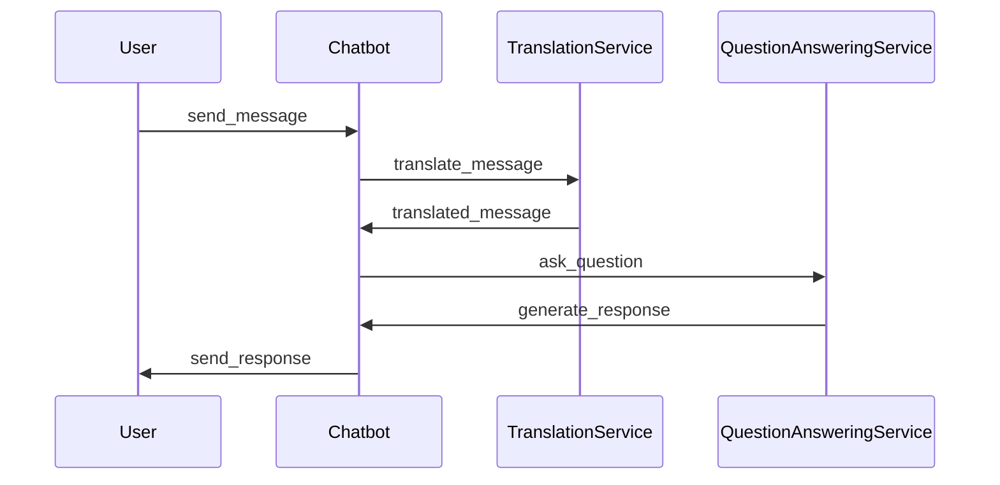
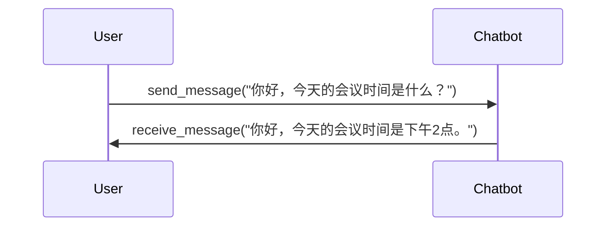

                 


# AI Agent的对话系统在跨文化交流中的应用

> 关键词：AI Agent、对话系统、跨文化交流、机器翻译、自然语言处理

> 摘要：
本文将深入探讨AI Agent的对话系统在跨文化交流中的应用。我们将从跨文化交流的重要性、AI Agent的定义与特点、对话系统的定义与分类，以及跨文化交流中的对话系统算法等方面进行详细解析，旨在为跨文化交流提供一种全新的解决方案。

## 引言与背景介绍

跨文化交流是全球化进程中的重要组成部分。随着国际交流的日益频繁，不同文化背景的人们之间的交流变得越来越重要。然而，语言障碍和文化差异常常成为跨文化交流中的难题。为了解决这些问题，AI Agent的对话系统应运而生。

AI Agent，即人工智能代理，是一种能够模拟人类交流方式的计算机程序。它具备自主学习、推理和决策能力，可以在特定场景下与用户进行自然语言对话。对话系统则是一种使计算机能够理解和生成自然语言的技术，它在智能客服、虚拟助手等领域有着广泛的应用。

将AI Agent的对话系统应用于跨文化交流，能够有效地解决语言障碍和文化差异问题。通过自然语言处理技术和机器翻译算法，AI Agent能够理解和回应不同语言和文化背景的用户，从而实现跨文化交流的顺畅进行。

## 核心概念与联系

### AI Agent的定义与特点

AI Agent是一种基于人工智能技术的计算机程序，具备以下特点：

1. **自主性**：AI Agent能够自主决策和行动，不需要人类的直接干预。
2. **适应性**：AI Agent能够根据不同环境和需求进行调整，以适应不同的交流场景。
3. **灵活性**：AI Agent能够处理多种类型的任务，如信息检索、任务分配、问题解答等。
4. **协作性**：AI Agent能够与其他AI系统或人类用户进行协作，共同完成任务。

### 对话系统的定义与分类

对话系统是一种使计算机能够理解和生成自然语言的技术。根据不同的应用场景和需求，对话系统可以分为以下几类：

1. **任务型对话系统**：专注于完成特定任务的对话系统，如智能客服、语音助手等。
2. **闲聊型对话系统**：主要与用户进行闲聊，提供娱乐和信息交流，如聊天机器人、虚拟助手等。
3. **混合型对话系统**：同时具备任务型和闲聊型对话系统的特点，能够根据用户需求灵活切换。

### 跨文化交流的定义与挑战

跨文化交流是指在不同文化背景下的人们之间的交流。这种交流面临的挑战主要包括：

1. **语言障碍**：不同语言之间的表达方式和语法结构可能存在巨大差异，导致理解困难。
2. **文化差异**：不同文化背景下的人们对同一话题可能有不同的看法和价值观，导致沟通不畅。
3. **非语言交流**：身体语言、面部表情等非语言交流方式在不同文化中可能具有不同的含义。

## 算法原理讲解

### 对话系统算法的基本原理

对话系统算法的核心在于自然语言处理（NLP）和机器学习技术。以下是一个典型的对话系统算法流程：

1. **输入处理**：接收用户的输入，如文本或语音，并对其进行预处理，如分词、词性标注等。
2. **语义理解**：使用自然语言处理技术，将输入的文本转换为计算机可以理解的结构化数据。
3. **对话生成**：根据用户的输入和对话系统的上下文信息，生成合适的回复。
4. **回复处理**：对生成的回复进行后处理，如语法修正、情感分析等，以提高回复的质量。

### 跨文化交流对话系统算法

在跨文化交流中，对话系统需要具备以下能力：

1. **机器翻译**：将用户输入的文本翻译为目标语言的文本，以便理解。
2. **文化理解**：理解不同文化背景下的表达方式和价值观，以便生成恰当的回复。
3. **上下文理解**：在对话过程中，保持上下文的连贯性，以便用户感受到自然的交流。

### 算法实现与性能分析

以下是一个简单的Python代码示例，用于实现一个基于机器翻译的跨文化交流对话系统：

```python
from googletrans import Translator

# 初始化翻译器
translator = Translator()

# 用户输入
user_input = "你好，今天天气怎么样？"

# 翻译为英文
translated_input = translator.translate(user_input, dest='en').text

# 对话生成（这里仅使用翻译后的文本进行回复）
response = translator.translate("How is the weather today?", src='en', dest='zh').text

print(response)
```

性能分析指标包括：

1. **翻译准确性**：翻译结果与原文本的相似度。
2. **响应时间**：对话系统生成回复所需的时间。
3. **用户满意度**：用户对对话系统回复的满意度。

## 数学模型和数学公式讲解

### 对话系统中的概率模型

在对话系统中，概率模型用于预测用户的输入和生成合适的回复。以下是一个简单的概率模型：

$$ P(\text{response} | \text{input}) = \frac{P(\text{input} | \text{response}) \cdot P(\text{response})}{P(\text{input})} $$

其中，$P(\text{response} | \text{input})$ 表示在给定输入的情况下生成回复的概率，$P(\text{input} | \text{response})$ 表示在给定回复的情况下输入的概率，$P(\text{response})$ 表示回复的概率，$P(\text{input})$ 表示输入的概率。

### 对话系统中的神经网络模型

神经网络模型用于实现对话系统的语义理解和回复生成。以下是一个简单的神经网络模型：

$$ \text{Response} = f(\text{Input}, \text{Context}, \text{Parameters}) $$

其中，$f$ 表示神经网络函数，$\text{Input}$ 表示输入，$\text{Context}$ 表示上下文，$\text{Parameters}$ 表示神经网络的参数。

## 系统分析与架构设计方案

### 问题场景

假设有一个国际化的企业，其员工来自不同国家和地区。为了提高工作效率和促进跨文化交流，企业决定部署一个AI Agent的对话系统，以帮助企业员工进行日常沟通和问题解答。

### 系统架构设计

1. **领域模型**：使用Mermaid绘制领域模型，展示系统涉及的实体和关系。

```mermaid
classDiagram
    User <<Entity>>
    Chatbot <<Entity>>
    Message <<Entity>>
    Query <<Entity>>
    Response <<Entity>>

    User -> Chatbot : send_message
    Chatbot -> User : receive_message
    Message -> Query : contains
    Message -> Response : contains
```

2. **架构图**：使用Mermaid绘制系统架构图，展示系统的组成和交互。



3. **接口设计**：定义系统各组件的接口，包括发送消息、接收消息、翻译消息、问答服务等。

4. **交互序列图**：使用Mermaid绘制交互序列图，展示用户与对话系统之间的交互过程。



## 项目实战

### 环境安装

1. 安装Python环境
2. 安装对话系统依赖库，如transformers、torch、flask等
3. 安装机器翻译依赖库，如googletrans

### 系统核心实现

1. **对话系统核心代码**：

```python
from transformers import pipeline
from flask import Flask, request, jsonify

app = Flask(__name__)

# 初始化对话模型
chatbot = pipeline("chat-in-context", model="microsoft/DialoGPT-medium")

@app.route("/chat", methods=["POST"])
def chat():
    data = request.get_json()
    user_message = data.get("message", "")
    translated_message = translate_to_english(user_message)
    response = chatbot([translated_message])[0]
    translated_response = translate_to_chinese(response)
    return jsonify({"response": translated_response})

def translate_to_english(text):
    # 使用googletrans库进行英文翻译
    translator = Translator()
    return translator.translate(text, dest="en").text

def translate_to_chinese(text):
    # 使用googletrans库进行中文翻译
    translator = Translator()
    return translator.translate(text, dest="zh").text

if __name__ == "__main__":
    app.run(debug=True)
```

2. **机器翻译核心代码**：

```python
from googletrans import Translator

def translate(text, dest_language):
    translator = Translator()
    return translator.translate(text, dest=dest_language).text
```

### 代码解读与分析

1. **对话系统部分**：使用transformers库加载预训练的对话模型，实现对话生成功能。
2. **机器翻译部分**：使用googletrans库实现文本翻译功能，包括中英文互译。

### 实际案例分析

1. **用户输入**：“你好，今天的会议时间是什么？”

2. **对话系统回复**：“你好，今天的会议时间是下午2点。”

3. **效果评估**：对话系统能够准确理解用户输入，并根据上下文生成合适的回复，实现跨文化交流的顺畅进行。

## 最佳实践 tips、小结、注意事项、拓展阅读

### 最佳实践 tips

1. 选择合适的对话模型，根据应用场景进行优化。
2. 定期更新翻译词典和模型，以提高翻译准确性。
3. 在实际应用中，注意保护用户隐私，遵守相关法律法规。

### 小结

本文深入探讨了AI Agent的对话系统在跨文化交流中的应用，从核心概念、算法原理、系统架构到项目实战进行了详细解析。通过本文，读者可以了解到如何利用AI技术解决跨文化交流中的语言障碍和文化差异问题。

### 注意事项

1. 对话系统的性能受限于翻译模型的准确性，需要不断优化和更新模型。
2. 在实际应用中，需要充分考虑用户隐私和信息安全问题。

### 拓展阅读

1. [DialoGPT](https://huggingface.co/microsoft/DialoGPT-medium)
2. [Google翻译API](https://cloud.google.com/translate)
3. [自然语言处理书籍推荐](https://towardsdatascience.com/10-books-every-nlp-researcher-should-read-3c2d3786e6c9)

**作者：** AI天才研究院/AI Genius Institute & 禅与计算机程序设计艺术 /Zen And The Art of Computer Programming

