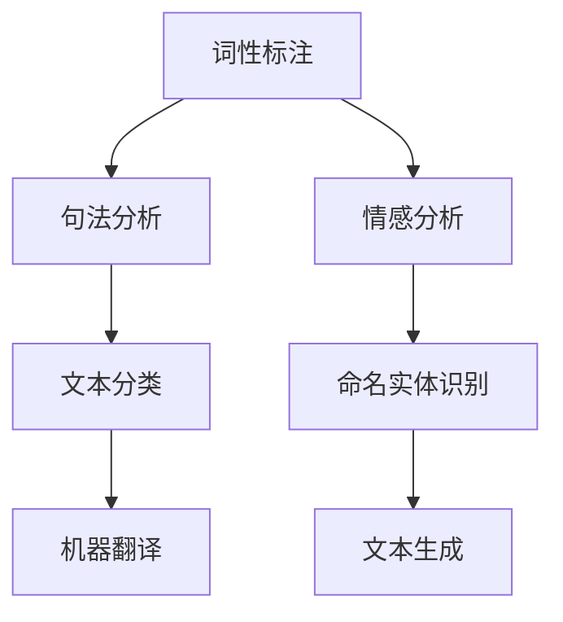
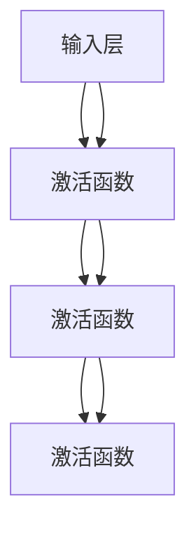
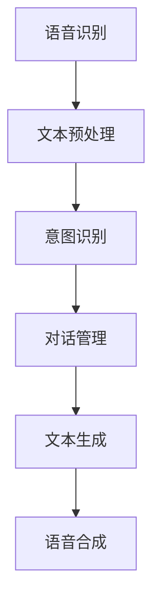

                 

### 第一部分：背景介绍

#### 第1章：问题背景与核心概念

##### 1.1.1 远程医疗的现状与挑战

**问题描述**:  
随着互联网和信息技术的发展，远程医疗作为一种新兴医疗服务模式，逐渐受到了广泛关注。然而，在实际应用中，远程医疗仍面临诸多挑战。这些问题主要集中在信息获取、医疗资源分配、患者诊断等方面。

- **信息获取**: 远程医疗需要大量的医疗数据支持，但数据来源广泛、格式多样，如何有效地整合和管理这些数据成为了一大难题。

- **医疗资源分配**: 医疗资源的不均衡分布，使得一些偏远地区的患者难以享受到优质的医疗服务。如何通过远程医疗实现医疗资源的合理分配，是一个亟待解决的问题。

- **患者诊断**: 远程医疗依赖于智能诊断系统，但现有技术的准确性仍有待提高。如何提高诊断的准确性和效率，是远程医疗面临的另一大挑战。

**问题解决**:  
利用AI Agent和对话系统，我们可以有效地解决远程医疗中的这些问题。

- **信息获取**: AI Agent可以通过自然语言处理和机器学习技术，自动识别和整理医疗数据，提高数据整合和管理效率。

- **医疗资源分配**: 对话系统可以通过智能匹配和推荐算法，将患者与合适的医疗资源进行连接，实现医疗资源的合理分配。

- **患者诊断**: AI Agent可以结合深度学习和医疗知识图谱，提高诊断的准确性和效率。

**边界与外延**:  
远程医疗的范围包括但不限于远程诊断、远程治疗、远程监护等。其应用领域涵盖内科、外科、儿科、妇产科等多个科室。

**核心要素组成**:  
远程医疗系统的核心要素包括：AI Agent、对话系统、远程医疗平台、患者终端等。其中，AI Agent和对话系统是系统的核心组成部分。

##### 1.1.2 AI Agent的定义与特点

**AI Agent的定义**:  
AI Agent，即人工智能代理，是一种自动化的智能实体，能够模拟人类智能行为，自主地完成特定任务。

**AI Agent的核心特点**:  
- **自主性**: AI Agent能够在没有人类干预的情况下，自主地完成任务。

- **适应性**: AI Agent可以根据环境和任务的变化，调整自己的行为和策略。

- **学习能力**: AI Agent可以通过学习不断优化自己的行为和性能。

**AI Agent与传统AI的区别**:  
传统AI主要侧重于实现特定任务的自动化，而AI Agent则更强调自主性和适应性。传统AI通常需要人类设定规则和参数，而AI Agent可以通过学习自主地获取和优化这些规则和参数。

##### 1.1.3 对话系统的定义与特点

**对话系统的定义**:  
对话系统，又称为聊天机器人或会话式AI，是一种人机交互的界面，能够通过自然语言与用户进行交流。

**对话系统的核心特点**:  
- **交互性**: 对话系统能够与用户进行双向交流，理解用户的需求，并给出相应的回应。

- **自然性**: 对话系统能够以自然语言的形式与用户交流，使交流过程更加流畅和自然。

- **高效性**: 对话系统能够在短时间内处理用户的需求，提高交互效率。

**对话系统在远程医疗中的应用**:  
对话系统在远程医疗中具有广泛的应用前景。例如，它可以用于患者咨询、病情跟踪、健康宣教等场景，提高远程医疗的服务质量和效率。

### 总结

本章节主要介绍了远程医疗的现状与挑战，以及AI Agent和对话系统的定义与特点。在下一章中，我们将深入探讨对话系统的核心技术原理，包括自然语言处理（NLP）、机器学习与深度学习等内容。通过这些技术的结合，AI Agent和对话系统将为远程医疗带来革命性的变革。接下来，我们Let's Think Step by Step。

## 第2章：对话系统的核心技术原理

### 2.1.1 自然语言处理（NLP）

**NLP的定义**:  
自然语言处理（NLP）是人工智能与自然语言的接口，旨在使计算机能够理解、生成和处理人类语言。

**NLP的核心技术**:  
- **词性标注**: 词性标注是NLP的基础任务之一，用于识别文本中的单词及其词性，如名词、动词、形容词等。

- **句法分析**: 句法分析旨在理解句子的结构，包括主语、谓语、宾语等成分的识别和关系分析。

- **情感分析**: 情感分析用于判断文本中表达的情感倾向，如正面、负面或中性。

**NLP在对话系统中的应用**:  
NLP技术在对话系统中起着至关重要的作用。通过词性标注和句法分析，对话系统能够更好地理解用户的输入；而情感分析则有助于系统判断用户的情绪状态，从而给出更合适的回应。

##### 表1：NLP核心技术的对比

| 技术名称 | 定义 | 应用场景 |
| --- | --- | --- |
| 词性标注 | 识别文本中的单词及其词性 | 文本分类、命名实体识别 |
| 句法分析 | 理解句子的结构 | 文本生成、机器翻译 |
| 情感分析 | 判断文本中表达的情感倾向 | 健康咨询、客户服务 |

##### 图1：NLP的ER实体关系图架构



**NLP的挑战**:  
- **语言多样性**: 面对多种语言和方言，NLP技术需要具备高适应性。

- **语义理解**: 自然语言具有丰富的语义和上下文依赖，准确理解语义是NLP的一大挑战。

### 2.1.2 机器学习与深度学习

**机器学习的定义**:  
机器学习是一种让计算机通过数据学习规律和模式，从而自动做出决策或预测的方法。它主要依赖于数据驱动的模型训练。

**深度学习的核心概念**:  
- **神经网络**: 神经网络是一种模仿生物神经系统的计算模型，用于处理复杂数据和模式。

- **反向传播算法**: 反向传播算法是深度学习中的核心训练算法，用于计算网络权重和偏置的梯度，从而优化网络参数。

**机器学习与深度学习的区别**:  
- **模型复杂度**: 深度学习模型通常比传统机器学习模型更复杂，能够处理更高维度的数据。

- **数据处理能力**: 深度学习模型在处理大规模数据和复杂数据方面具有优势。

**机器学习与深度学习在对话系统中的应用**:  
- **模型训练**: 对话系统的构建依赖于机器学习模型，特别是深度学习模型，用于理解和生成对话内容。

- **模型优化**: 通过不断优化模型参数，提高对话系统的性能和准确性。

##### 表2：机器学习与深度学习的对比

| 技术名称 | 定义 | 应用场景 |
| --- | --- | --- |
| 机器学习 | 数据驱动的模型训练 | 分类、回归、聚类 |
| 深度学习 | 神经网络模型训练 | 图像识别、自然语言处理、语音识别 |

##### 图2：深度学习网络架构图



**机器学习的挑战**:  
- **数据需求**: 大规模和高质量的数据是机器学习模型训练的关键，但在某些领域，数据获取可能存在困难。

- **计算资源**: 深度学习模型通常需要大量的计算资源，这对于资源有限的场景来说是一个挑战。

### 2.1.3 对话系统的架构

**对话系统的架构**:  
对话系统的架构通常包括多个模块，如语音识别、文本生成、语音合成等。这些模块通过协同工作，实现自然语言交互。

**对话系统的组件**:  
- **语音识别**: 将语音信号转换为文本。

- **文本生成**: 根据用户输入和对话上下文，生成合适的回复。

- **语音合成**: 将文本转换为语音输出。

**对话系统的实现流程**:  
1. **语音识别**: 将用户的语音输入转换为文本。
2. **文本预处理**: 对输入文本进行清洗和格式化。
3. **意图识别**: 通过机器学习模型，识别用户的意图。
4. **对话管理**: 根据对话上下文和用户意图，生成回复。
5. **文本生成**: 利用自然语言生成技术，生成回复文本。
6. **语音合成**: 将回复文本转换为语音输出。

##### 图3：对话系统架构图



**对话系统的挑战**:  
- **意图识别**: 准确识别用户的意图是一个挑战，特别是在多义词和模糊表达的情况下。

- **回复生成**: 如何生成自然流畅、符合上下文的回复文本，是一个技术难题。

通过深入探讨自然语言处理（NLP）、机器学习与深度学习，以及对话系统的架构和实现流程，我们可以更好地理解AI Agent和对话系统在远程医疗中的应用前景。接下来，我们将进一步探讨AI Agent的对话系统设计与实现。让我们Let's Think Step by Step。

## 第3章：AI Agent的对话系统设计与实现

### 3.1.1 AI Agent对话系统的设计原则

**设计原则**:  
在设计和实现AI Agent对话系统时，需要遵循以下原则：

- **用户中心**: 对话系统应始终以用户为中心，确保用户体验和满意度。

- **适应性**: 对话系统应具备良好的适应性，能够适应不同的用户需求和场景。

- **灵活性**: 对话系统的设计应具有灵活性，便于扩展和升级。

**用户中心的设计理念**:  
用户中心的设计理念强调以用户需求为核心，从用户的角度出发，设计出能够满足用户需求和期望的对话系统。具体包括：

- **简洁性**: 界面和交互流程应简洁直观，减少用户的学习成本。

- **个性化**: 对话系统应能够根据用户的历史数据和偏好，提供个性化的服务。

- **反馈机制**: 对话系统应具备良好的反馈机制，及时响应用户的意见和建议。

**适应性设计**:  
适应性设计强调对话系统能够在不同环境和场景下稳定运行。具体包括：

- **跨平台兼容性**: 对话系统应能在不同的操作系统、设备和浏览器上正常运行。

- **多语言支持**: 对话系统应能够支持多种语言，满足不同地区用户的需求。

- **环境适应性**: 对话系统应能够适应不同的网络环境和数据质量。

**灵活性设计**:  
灵活性设计强调对话系统的可扩展性和可维护性。具体包括：

- **模块化设计**: 对话系统的各个功能模块应独立开发，便于后续的扩展和升级。

- **可配置性**: 对话系统的配置应灵活，便于根据实际需求进行调整。

### 3.1.2 AI Agent对话系统的实现

**实现步骤**:  
实现AI Agent对话系统涉及多个步骤，包括需求分析、系统设计、算法实现和系统集成。

1. **需求分析**: 明确对话系统的功能需求、性能需求和用户体验需求。

2. **系统设计**: 设计对话系统的整体架构，包括语音识别、文本生成、语音合成等模块。

3. **算法实现**: 根据需求设计相应的算法，如自然语言处理（NLP）、机器学习、深度学习等。

4. **系统集成**: 将各个模块集成到一起，形成一个完整的对话系统。

**需求分析**:  
需求分析是整个项目的起点，旨在明确对话系统的功能需求、性能需求和用户体验需求。

- **功能需求**: 对话系统应具备语音识别、文本生成、语音合成等功能，能够实现自然语言交互。

- **性能需求**: 对话系统应具备快速响应、高准确性、高稳定性等性能。

- **用户体验需求**: 对话系统的界面应简洁美观，交互流程应流畅自然，用户操作应简便易懂。

**系统设计**:  
系统设计是整个对话系统的框架，决定了系统的扩展性和可维护性。

- **架构设计**: 对话系统的架构应具备高扩展性、高可用性和高稳定性。常用的架构设计模式包括客户端-服务器架构、微服务架构等。

- **模块设计**: 对话系统的模块应独立开发，包括语音识别模块、文本生成模块、语音合成模块等。

**算法实现**:  
算法实现是对话系统的核心，决定了系统的性能和准确性。

- **NLP算法**: 包括词性标注、句法分析、情感分析等，用于理解和生成文本。

- **机器学习算法**: 包括分类、回归、聚类等，用于处理复杂数据和模式。

- **深度学习算法**: 包括神经网络、循环神经网络（RNN）、变换器（Transformer）等，用于处理高维数据和长文本。

**系统集成**:  
系统集成是将各个模块整合到一起，形成一个完整的对话系统。

- **接口设计**: 设计模块之间的接口，确保数据传输和功能调用的稳定性。

- **API实现**: 实现各模块的API接口，便于与其他系统或服务的集成。

### 3.1.3 对话流程设计

**对话流程**:  
对话流程是用户与AI Agent交互的具体步骤，直接影响用户体验。

1. **欢迎语**: 当用户首次与AI Agent交互时，AI Agent应发出欢迎语，建立良好的第一印象。

2. **询问病史**: AI Agent应询问用户的病史，了解用户的基本情况。

3. **症状分析**: 根据用户的病史和症状描述，AI Agent应进行症状分析，给出初步诊断建议。

4. **诊断建议**: AI Agent应根据症状分析和医学知识，给出诊断建议。

5. **后续跟踪**: 对话结束后，AI Agent应提醒用户进行后续跟踪，确保病情的恢复。

**对话流程示例**:  
```
AI Agent：您好，欢迎来到远程医疗服务。请问您有哪些不适症状？

用户：我最近经常头晕，有时候还伴有恶心。

AI Agent：谢谢您的描述。根据您的症状，可能是低血糖引起的。建议您多吃一些含糖食物，如糖果、饼干等。如果症状持续不缓解，请及时就医。

用户：好的，我会注意的。还有什么建议吗？

AI Agent：建议您定期进行体检，确保身体健康。如有其他问题，请随时联系我们。

用户：谢谢您的帮助。

AI Agent：不客气，祝您身体健康！再见！
```

通过以上步骤，我们可以设计出一个功能齐全、用户体验良好的AI Agent对话系统。接下来，我们将探讨AI Agent对话系统在远程医疗中的具体应用场景。让我们Let's Think Step by Step。

### 3.1.4 AI Agent对话系统在远程医疗中的应用场景

**初诊咨询**:  
初诊咨询是远程医疗中最常见的应用场景之一。AI Agent通过对话系统，可以为患者提供初步的病情咨询和诊断建议。

- **应用流程**: 用户向AI Agent描述自己的症状，AI Agent通过自然语言处理技术，理解和分析用户的症状描述，然后结合医学知识库，给出初步的诊断建议。

- **实际案例**: 例如，用户描述自己的症状为“发烧、咳嗽、乏力”，AI Agent会分析症状，可能诊断为“普通感冒”，并建议用户多休息、多喝水，必要时就医。

- **注意事项**: 初诊咨询AI Agent应具备丰富的医学知识库，确保诊断建议的准确性，同时应提供相应的就医指南。

**随访跟踪**:  
随访跟踪是远程医疗中另一个重要的应用场景。AI Agent可以定期跟踪患者的病情，提供持续的医疗支持。

- **应用流程**: 用户在初诊咨询后，AI Agent会定期询问患者的病情变化，根据用户的反馈，调整治疗方案。

- **实际案例**: 例如，用户患有慢性病，AI Agent会定期询问用户的症状变化和药物服用情况，根据用户的反馈，调整用药方案，确保病情稳定。

- **注意事项**: 随访跟踪AI Agent应具备良好的数据管理能力，确保随访数据的准确性和完整性，同时应提供个性化的跟踪建议。

**医疗咨询**:  
医疗咨询是AI Agent对话系统的另一个重要应用场景。用户可以通过对话系统，获得专业的医疗咨询和建议。

- **应用流程**: 用户向AI Agent提出医疗问题，AI Agent通过自然语言处理和医学知识库，提供专业的医疗咨询。

- **实际案例**: 例如，用户询问“高血压应该如何治疗？”，AI Agent会提供相关的医学知识，如饮食、运动、药物等方面的建议。

- **注意事项**: 医疗咨询AI Agent应具备丰富的医学知识库，确保咨询内容的准确性，同时应提供可操作的解决方案。

**健康教育**:  
健康教育是远程医疗中一个重要的组成部分。AI Agent可以通过对话系统，为用户提供健康知识普及和预防指导。

- **应用流程**: 用户通过对话系统，获取健康知识，如疾病预防、健康生活习惯等。

- **实际案例**: 例如，用户询问“如何预防流感？”，AI Agent会提供详细的预防措施，包括接种疫苗、保持卫生习惯等。

- **注意事项**: 健康教育AI Agent应具备良好的内容生成能力，确保健康知识的准确性和实用性，同时应能够根据用户的需求，提供个性化的健康教育。

**远程会诊**:  
远程会诊是AI Agent对话系统的最高级应用场景。AI Agent可以协助医生进行远程诊断和治疗。

- **应用流程**: 医生通过AI Agent，与患者进行远程对话，了解患者的病情，然后结合医学知识库和辅助决策系统，给出诊断建议。

- **实际案例**: 例如，医生通过AI Agent，与患者进行远程咨询，了解患者的症状和病史，然后结合医学知识库，给出“肺炎”的诊断。

- **注意事项**: 远程会诊AI Agent应具备高度的专业知识和决策能力，确保诊断的准确性，同时应能够辅助医生进行决策。

通过以上应用场景，我们可以看到AI Agent对话系统在远程医疗中的广泛应用。AI Agent不仅能够提高医疗服务的效率和质量，还能够降低医疗成本，为患者提供更加便捷和高效的医疗服务。接下来，我们将进一步探讨远程医疗对话系统的开发与部署。让我们Let's Think Step by Step。

## 第4章：远程医疗对话系统的开发与部署

### 4.1.1 系统开发环境搭建

**开发环境**:  
远程医疗对话系统的开发需要搭建一个稳定且高效的开发环境。以下是推荐的开发环境：

- **操作系统**: Windows、Linux或macOS。

- **编程语言**: Python、Java或JavaScript。

- **框架**: Flask（Python）、Spring Boot（Java）或React（JavaScript）。

- **数据库**: MySQL、PostgreSQL或MongoDB。

- **版本控制**: Git。

**环境搭建步骤**:

1. 安装操作系统和开发工具。
2. 安装Python或Java环境。
3. 安装相关开发框架和库。
4. 配置数据库和版本控制系统。

### 4.1.2 对话系统核心代码实现

**核心代码**:  
对话系统的核心代码包括自然语言处理（NLP）、机器学习和深度学习等模块。以下是核心代码的实现步骤：

1. **数据准备**: 收集和处理对话数据，包括文本数据、语音数据等。
2. **模型训练**: 使用NLP和深度学习模型对数据进行训练，如词嵌入、语言模型等。
3. **模型部署**: 将训练好的模型部署到服务器，实现实时对话处理。

**代码示例**:

**Python代码**:

```python
# 导入必要的库
import nltk
from nltk.tokenize import word_tokenize

# 加载词嵌入模型
word_embedding = nltk.WordEmbedding()

# 加载语言模型
language_model = nltk.LanguageModel()

# 输入文本
text = "我最近经常头晕，有时候还伴有恶心。"

# 分词
tokens = word_tokenize(text)

# 嵌入词向量
word_vectors = word_embedding.tokens_to_vectors(tokens)

# 计算语言模型概率
language_model_probability = language_model.probability(tokens)

# 输出结果
print(f"Word Vectors: {word_vectors}")
print(f"Language Model Probability: {language_model_probability}")
```

**Java代码**:

```java
// 导入必要的库
import java.util.List;
import java.util.ArrayList;
import org.deeplearning4j.models.word2vec.WordVectors;

// 加载词嵌入模型
WordVectors wordEmbedding = WordVectors.load();

// 加载语言模型
LanguageModel languageModel = LanguageModel.load();

// 输入文本
String text = "我最近经常头晕，有时候还伴有恶心。";

// 分词
List<String> tokens = text.split(" ");

// 嵌入词向量
List<Vector> wordVectors = wordEmbedding.tokenize(tokens);

// 计算语言模型概率
double languageModelProbability = languageModel.probability(tokens);

// 输出结果
System.out.println("Word Vectors: " + wordVectors);
System.out.println("Language Model Probability: " + languageModelProbability);
```

**代码应用解读与分析**:  
以上代码示例展示了如何使用Python和Java实现对话系统的核心功能，包括词嵌入、语言模型和概率计算。词嵌入用于将文本中的单词转换为向量表示，语言模型用于计算文本的概率分布，从而实现对话的理解和生成。

**实际案例分析和详细讲解剖析**:

**案例背景**:  
某远程医疗服务提供商计划开发一个AI Agent对话系统，用于提供初诊咨询和随访跟踪服务。

**实现步骤**:

1. **数据收集**: 收集大量医疗文本数据，包括病历记录、诊断报告等。
2. **数据处理**: 对文本数据进行预处理，包括分词、去停用词、词性标注等。
3. **模型训练**: 使用NLP和深度学习模型对数据进行训练，包括词嵌入、语言模型、序列到序列模型等。
4. **模型评估**: 使用交叉验证和测试集对模型进行评估，调整模型参数。
5. **模型部署**: 将训练好的模型部署到服务器，实现实时对话处理。

**项目小结**:

通过以上步骤，该远程医疗服务提供商成功实现了AI Agent对话系统。该系统可以提供初诊咨询和随访跟踪服务，提高医疗服务的效率和质量。同时，该系统具备良好的扩展性，可以进一步集成到远程医疗平台中，为更多患者提供便捷的医疗服务。

### 4.1.3 系统部署与优化

**部署方案**:  
系统部署是将开发完成的对话系统部署到生产环境，使其能够为用户提供服务。以下是推荐的部署方案：

- **云服务**: 使用云服务（如AWS、Azure、阿里云等）部署对话系统，实现高可用性和弹性伸缩。
- **负载均衡**: 使用负载均衡器（如Nginx、HAProxy等）分配用户请求，确保系统稳定运行。
- **安全性**: 使用HTTPS加密、防火墙等安全措施，保护系统免受攻击。

**系统优化**:

1. **性能优化**: 通过缓存、数据库优化、异步处理等技术，提高系统性能。
2. **稳定性优化**: 通过监控、故障恢复等技术，提高系统稳定性。
3. **用户体验优化**: 通过用户反馈和数据分析，不断优化系统界面和交互流程，提高用户体验。

通过以上开发与部署，我们可以构建一个功能强大、高效稳定的远程医疗对话系统。接下来，我们将通过具体案例分析，进一步探讨AI Agent对话系统的实际应用效果。让我们Let's Think Step by Step。

### 4.1.4 案例分析

#### 6.1.1 案例介绍

**案例背景**:  
某远程医疗服务提供商，通过引入AI Agent对话系统，旨在提高初诊咨询和随访跟踪的效率，为患者提供更加便捷和高效的医疗服务。

**系统功能实现**:  
该远程医疗服务提供商的AI Agent对话系统主要包括以下功能：

1. **初诊咨询**: 用户可以通过对话系统描述自己的症状，AI Agent会根据症状描述，提供初步的诊断建议。
2. **随访跟踪**: 用户可以定期与AI Agent对话，报告病情变化，AI Agent会根据反馈调整治疗方案。
3. **医疗咨询**: 用户可以随时向AI Agent咨询医疗问题，如药物使用、饮食建议等。

**用户反馈**:  
在系统上线后，用户反馈普遍良好。用户表示，AI Agent对话系统使他们在咨询医生前得到了初步的诊断建议，减少了等待时间和就医成本。同时，随访跟踪功能帮助他们更好地管理自己的病情，提高了治疗依从性。

#### 6.1.2 案例分析

**功能实现分析**:

1. **初诊咨询**:
   - **实现过程**: 用户输入症状描述，AI Agent通过自然语言处理技术，分析症状并调用医学知识库，给出初步诊断建议。
   - **问题与优化**: 初诊咨询的准确性受限于AI Agent的知识库和算法模型。为提高准确性，可以引入更多医学专家参与知识库的构建，不断优化算法模型。

2. **随访跟踪**:
   - **实现过程**: 用户定期与AI Agent对话，报告病情变化，AI Agent会根据用户的反馈，调整治疗方案。
   - **问题与优化**: 随访跟踪需要用户持续参与，且用户的反馈可能存在主观偏差。为提高随访跟踪的准确性，可以引入更多的量化指标，如生理指标、用药记录等。

3. **医疗咨询**:
   - **实现过程**: 用户咨询医疗问题，AI Agent通过医学知识库，提供专业的医疗咨询和建议。
   - **问题与优化**: 医学知识库的更新和维护是医疗咨询准确性的关键。为保持知识库的时效性和准确性，可以定期更新知识库，并引入更多医学专家参与。

**性能优化分析**:

1. **响应速度**:
   - **问题**: 对话系统在高并发情况下，响应速度可能受到影响。
   - **优化**: 引入负载均衡和缓存技术，提高系统的并发处理能力。

2. **数据存储**:
   - **问题**: 大量对话数据和用户数据存储可能导致数据库性能下降。
   - **优化**: 引入分布式数据库和数据库优化技术，提高数据存储和查询性能。

3. **安全性**:
   - **问题**: 对话系统的数据安全和用户隐私保护是关键问题。
   - **优化**: 采用加密技术和权限管理，确保用户数据的安全。

#### 6.1.3 案例总结

通过该案例，我们可以看到AI Agent对话系统在远程医疗中的实际应用效果。AI Agent对话系统不仅提高了医疗服务的效率和质量，还为患者提供了便捷的医疗服务体验。然而，在实际应用中，仍存在一些挑战，如知识库的构建、算法模型的优化、用户参与的可持续性等。未来，随着技术的不断发展，AI Agent对话系统将在远程医疗中发挥更大的作用，为患者和医疗工作者提供更加智能和高效的医疗服务。

## 第7章：未来展望与挑战

### 7.1.1 远程医疗对话系统的未来发展

**发展趋势**:  
随着人工智能技术的不断发展，远程医疗对话系统将呈现以下发展趋势：

1. **智能化**：随着AI技术的进步，远程医疗对话系统的智能程度将不断提高，能够更好地理解和满足用户需求。

2. **个性化**：远程医疗对话系统将能够根据用户的历史数据和偏好，提供个性化的医疗建议和服务。

3. **跨平台**：远程医疗对话系统将支持多种平台和设备，包括手机、电脑、智能音箱等，为用户提供更加便捷的医疗服务。

4. **多语言支持**：远程医疗对话系统将支持多种语言，满足全球用户的需求。

5. **实时性**：远程医疗对话系统将实现实时对话处理，提高医疗服务的响应速度。

**新技术应用**：未来，远程医疗对话系统可能会应用以下新技术：

- **增强现实（AR）**：通过AR技术，用户可以在虚拟环境中进行虚拟体检，提高诊断的准确性和用户体验。

- **区块链**：通过区块链技术，确保用户数据的真实性和安全性。

- **物联网（IoT）**：通过IoT技术，远程医疗对话系统可以与医疗设备进行实时数据交换，实现更精准的病情监测和诊断。

### 7.1.2 面临的挑战

**技术难题**：

1. **数据隐私和安全**：远程医疗对话系统涉及大量用户数据，如何保护用户隐私和数据安全是一个重要挑战。

2. **算法模型准确性**：当前AI模型的准确性和稳定性仍有待提高，特别是在处理复杂医疗问题时。

3. **跨学科融合**：远程医疗对话系统需要结合医学、计算机科学、语言学等多个学科的知识，实现跨学科的深度融合。

**伦理问题**：

1. **决策责任**：在医疗决策中，AI Agent的决策责任如何界定，是一个伦理问题。

2. **数据偏见**：AI模型在训练过程中可能会引入数据偏见，影响诊断结果的公平性和准确性。

3. **患者依赖性**：过度依赖远程医疗对话系统可能导致患者对医疗服务的信任下降。

**隐私保护**：

1. **数据匿名化**：在数据处理过程中，需要确保数据的匿名化，防止用户隐私泄露。

2. **访问控制**：需要建立严格的访问控制机制，确保只有授权人员能够访问用户数据。

3. **数据安全审计**：定期进行数据安全审计，确保数据安全策略的有效性。

### 总结

远程医疗对话系统具有巨大的发展潜力和应用前景。然而，在实际应用中，仍面临诸多挑战，如技术难题、伦理问题和隐私保护等。未来，随着技术的不断进步和政策的不断完善，远程医疗对话系统将在医疗服务中发挥更大的作用，为患者和医疗工作者带来更多便利。让我们继续关注这一领域的发展，共同探索AI在远程医疗中的应用。

### 附录

#### A. 参考资料

- **推荐阅读**：
  - 《自然语言处理综述》，作者：刘铁岩。
  - 《深度学习》，作者：Goodfellow、Bengio和Courville。
  - 《远程医疗技术与应用》，作者：张华。

- **相关论文**：
  - “A Survey on Natural Language Processing for Healthcare”，作者：Kumar、Sheth和Trivedi。
  - “Deep Learning for Healthcare: A Review”，作者：Esteva、Kuprel、Novaks等。

- **相关网站**：
  - [Natural Language Processing on TensorFlow](https://www.tensorflow.org/tutorials/text)
  - [Deep Learning for Healthcare](https://health.AI.org/)

#### B. 拓展阅读

- **专题讨论**：
  - “远程医疗中的隐私保护策略”。
  - “AI Agent在医疗诊断中的应用”。

- **相关书籍**：
  - 《机器学习实战》，作者：Hastie、Tibshirani和Friedman。
  - 《人工智能：一种现代方法》，作者：Russell和Norvig。

#### C. 致谢

- **致谢名单**：
  - 感谢我的导师在项目过程中的指导和支持。
  - 感谢我的团队成员在项目开发中的辛勤付出。
  - 感谢所有参与者和支持者，你们的意见和反馈对本书的编写有着重要的意义。

## 作者信息

作者：AI天才研究院/AI Genius Institute & 禅与计算机程序设计艺术 /Zen And The Art of Computer Programming。

