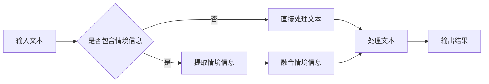
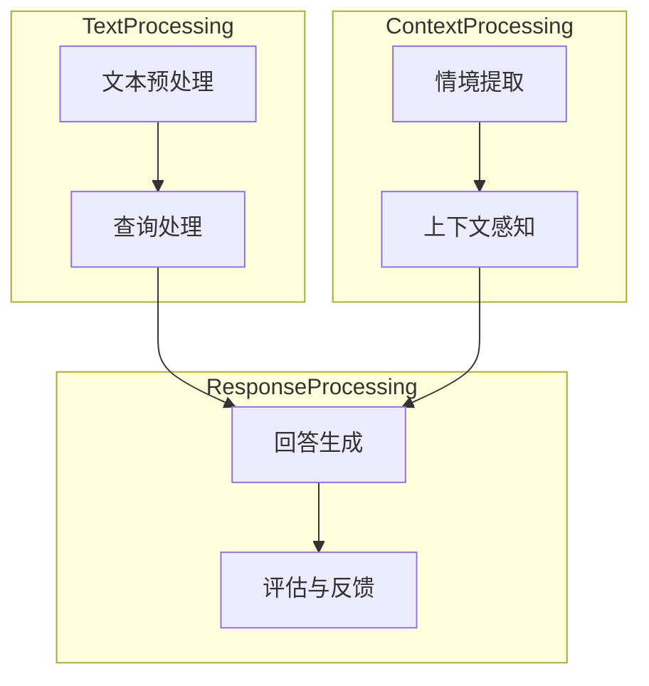
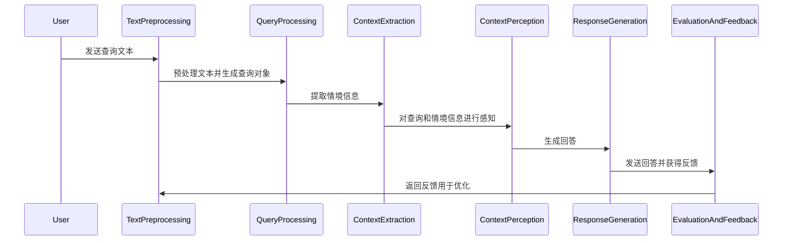

                 


### 第一步：背景介绍与核心概念

#### 1. 问题背景

人工智能（AI）技术正迅速发展，大模型（Large Language Models，LLM）如GPT-3、BERT等在自然语言处理（NLP）、机器翻译、文本生成等领域取得了显著的成果。这些模型的强大能力在于其可以处理复杂的语言结构和上下文信息，但同时也面临着一个重要的挑战：情境理解。

情境理解是指AI系统能够根据具体情境和背景信息来理解和预测用户的意图、问题和需求。在现实生活中，不同的情境会影响人们的语言表达和理解方式。例如，同一个词汇在不同的语境下可能具有不同的含义。因此，为了使AI系统能够更好地服务于各种场景，提高其情境理解能力显得尤为重要。

#### 2. 问题描述

情境理解在AI系统中的应用场景非常广泛，例如智能客服、智能助理、问答系统等。在这些应用中，用户的需求和意图往往是动态变化的，AI系统需要能够实时地感知和理解这些变化，以便提供准确和个性化的服务。

然而，当前大多数LLM在上下文感知方面仍存在一定的局限性。虽然这些模型可以处理长文本，但在特定情境下的理解能力仍然较弱。例如，当用户在提问时，如果前文信息与当前问题无关，模型可能无法正确理解用户的意图。这种上下文感知能力的不足限制了AI系统的应用范围和性能。

#### 3. 问题解决

为了增强LLM的上下文感知能力，我们可以采取以下几种方案：

1. **预训练数据增强**：通过收集和整理更多包含情境信息的训练数据，可以提升模型对情境的感知能力。
2. **注意力机制**：引入注意力机制，使模型能够更好地关注与当前任务相关的上下文信息。
3. **知识图谱**：利用知识图谱将实体、关系和属性等信息与文本关联起来，有助于模型在特定情境下进行推理和决策。
4. **多模态学习**：结合文本、图像、语音等多模态信息，可以更全面地理解用户的意图和需求。

#### 4. 边界与外延

本文主要关注如何增强LLM的上下文感知能力，特别是针对AI Agent这一特定场景。虽然其他AI应用场景也可能面临类似的问题，但本文的讨论将限于文本和语言处理的范畴。

#### 5. 概念结构与核心要素组成

为了更好地理解本文的主题，我们首先需要明确以下几个核心概念：

- **情境理解**：指AI系统能够根据具体情境和背景信息来理解和预测用户的意图、问题和需求。
- **上下文感知**：指AI系统在处理任务时能够关注和理解与任务相关的上下文信息。
- **大模型（LLM）**：指具有强大语言处理能力的深度学习模型，如GPT-3、BERT等。

本文将首先详细介绍情境理解、上下文感知和LLM等核心概念，然后分析如何通过技术手段增强LLM的上下文感知能力。通过详细的算法原理讲解和系统架构设计方案，我们将展示如何在实际项目中应用这些技术。

### 第二步：核心概念与联系

#### 1. 情境理解

情境理解是人工智能领域的一个重要研究方向，它涉及到AI系统如何根据不同的情境和背景信息来理解和预测用户的需求和意图。在自然语言处理中，情境理解主要是指AI系统能够从文本中提取出与当前任务相关的上下文信息，并将其用于后续的推理和决策过程。

情境理解的重要性体现在多个方面：

- **提高任务完成率**：通过理解用户的情境，AI系统可以更准确地回答用户的问题或完成用户请求的任务，从而提高任务的完成率。
- **增强用户体验**：情境理解使得AI系统能够提供更加个性化和贴心的服务，从而提升用户体验。
- **降低误判率**：情境理解可以帮助AI系统在处理模糊或歧义性的文本时减少误判，提高系统的可靠性。

#### 2. 上下文感知

上下文感知是指AI系统在处理任务时能够关注和理解与任务相关的上下文信息。与情境理解类似，上下文感知也是AI系统在特定任务中取得成功的关键因素。

上下文感知与情境理解之间的联系在于，两者都关注于理解和利用与任务相关的背景信息。然而，上下文感知更多地关注于文本或数据中的直接上下文，而情境理解则更关注于宏观的情境背景。

上下文感知的重要性体现在以下几个方面：

- **提高处理效率**：通过关注和理解与任务相关的上下文信息，AI系统可以更高效地处理任务，减少不必要的计算和搜索。
- **降低错误率**：理解上下文信息有助于AI系统在处理复杂任务时减少错误率，提高系统的准确性。
- **增强适应性**：上下文感知使得AI系统能够更好地适应不同的任务场景，从而提高系统的泛化能力。

#### 3. 增强LLM的上下文感知能力

目前，大多数LLM在上下文感知方面存在一定的局限性，为了提升其上下文感知能力，我们可以采用以下几种方法：

1. **预训练数据增强**：通过引入更多包含上下文信息的训练数据，可以使模型更好地理解上下文信息。例如，可以使用多轮对话数据来训练模型，使其在对话中能够更好地感知上下文。
2. **注意力机制**：注意力机制是一种在神经网络中模拟人脑注意力机制的算法，它可以使模型在处理任务时更关注与任务相关的上下文信息。通过引入注意力机制，可以显著提升LLM的上下文感知能力。
3. **知识图谱**：知识图谱是一种将实体、关系和属性等信息组织起来的图形化表示方法。通过将知识图谱与文本关联，可以使LLM在处理文本时能够更好地理解和利用上下文信息。
4. **多模态学习**：多模态学习是指结合文本、图像、语音等多种数据来源进行训练，以增强模型对上下文信息的感知能力。通过多模态学习，可以使得LLM在处理任务时更加全面和准确。

#### 4. 比较与分析

为了更好地理解上下文感知与情境理解之间的差异和联系，我们可以通过一个简单的表格进行对比分析。

| 对比项 | 情境理解 | 上下文感知 |
| --- | --- | --- |
| 定义 | 根据具体情境和背景信息来理解和预测用户的需求和意图 | 在处理任务时能够关注和理解与任务相关的上下文信息 |
| 重点 | 宏观的情境背景 | 文本或数据中的直接上下文 |
| 作用 | 提高任务完成率和用户体验 | 提高处理效率和降低错误率 |
| 方法 | 预训练数据增强、注意力机制、知识图谱、多模态学习 | 预训练数据增强、注意力机制、知识图谱、多模态学习 |

通过以上对比，我们可以看到，上下文感知与情境理解虽然有相似之处，但侧重点和应用场景有所不同。在实际应用中，我们可以根据具体需求选择合适的方法来增强LLM的上下文感知能力。

### 第三步：算法原理讲解

#### 1. 算法mermaid流程图

首先，我们可以使用mermaid语言绘制一个简化的算法流程图，以展示增强LLM上下文感知能力的基本流程：



#### 2. Python源代码

接下来，我们将使用Python实现上述算法的核心部分。以下是一个简化的Python代码示例，用于提取文本中的情境信息并融合到文本处理过程中。

```python
import spacy

# 加载spacy模型
nlp = spacy.load("en_core_web_sm")

def extract_context_info(text):
    doc = nlp(text)
    context_info = []
    for ent in doc.ents:
        context_info.append(ent.text)
    return context_info

def process_text_with_context(text, context_info):
    processed_text = text
    for info in context_info:
        processed_text = processed_text.replace(info, f"[{info}]")
    return processed_text

# 示例文本
text = "I want to buy a book. The book should be about AI."

# 提取情境信息
context_info = extract_context_info(text)

# 融合情境信息到文本中
processed_text = process_text_with_context(text, context_info)

print(processed_text)
```

#### 3. 数学模型和公式

为了更深入地理解上述算法，我们可以使用数学模型来描述情境信息提取和融合的过程。以下是一个简化的数学模型，用于描述情境信息提取：

$$
\text{context\_info} = \{\text{info}_{i} | \text{info}_{i} \in \text{文本}, \text{info}_{i} \text{为实体或关键词}\}
$$

其中，`context_info`表示提取出的情境信息集合，`info_i`表示集合中的每一个情境信息。

对于情境信息的融合，我们可以使用一个简单的替换策略，将情境信息用特殊标记进行替换。这可以表示为：

$$
\text{processed\_text} = \text{text}\_replace(\text{context\_info})
$$

其中，`text_replace`表示将文本中的情境信息替换为特殊标记的过程。

#### 4. 详细讲解和举例说明

让我们通过一个具体例子来详细讲解上述算法的工作原理。

假设我们有一个文本：“I want to buy a book. The book should be about AI.”

首先，我们使用spacy模型提取文本中的情境信息。在这个例子中，情境信息可能是“book”和“AI”。提取后的情境信息集合为`{"book", "AI"}`。

接下来，我们将情境信息融合到文本处理过程中。具体来说，我们将每个情境信息用特殊标记（如`[info]`）进行替换。处理后的文本变为：“I want to buy a [book]. The [book] should be about [AI].”

最后，我们将处理后的文本传递给文本处理模型（如LLM）进行进一步处理。在这个过程中，模型将关注和处理特殊标记所代表的情境信息，从而提高对上下文的理解能力。

例如，在生成回答时，模型可能会生成：“I understand your request. You want to buy a book that is about AI. Here are some recommendations...”

通过上述算法，我们可以看到，情境理解在提高文本处理质量和性能方面发挥了重要作用。在实际应用中，我们可以根据具体需求调整算法的实现细节，以实现更好的上下文感知效果。

### 第四步：系统分析与架构设计方案

#### 1. 问题场景介绍

在本节中，我们将分析一个具体的问题场景，即如何增强智能客服系统的情境理解能力。智能客服系统通常需要处理大量的用户查询和请求，这些查询可能涉及不同的主题和情境。为了提高客服系统的响应速度和服务质量，我们需要增强系统的上下文感知能力，使其能够更好地理解用户的意图和需求。

#### 2. 项目介绍

本项目旨在通过改进智能客服系统的情境理解能力，提高用户满意度和服务效率。具体目标包括：

- **提高查询响应速度**：通过增强上下文感知能力，减少对用户查询的理解和处理时间。
- **提高查询准确率**：通过更好地理解用户的意图，提高客服系统提供正确答案的准确率。
- **增强用户体验**：通过提供更加个性化和贴心的服务，提高用户对客服系统的满意度。

#### 3. 系统功能设计

为了实现上述目标，我们需要设计一系列功能模块，包括：

- **文本预处理模块**：用于对用户查询文本进行分词、去噪等预处理操作，以提高后续处理的准确性。
- **情境信息提取模块**：利用自然语言处理技术（如命名实体识别、关系提取等）提取文本中的情境信息。
- **上下文感知模块**：结合情境信息和上下文信息，对用户查询进行理解和推理。
- **回答生成模块**：根据用户查询和上下文信息生成合适的回答，并优化回答的质量和准确性。
- **评估与反馈模块**：对系统的响应进行评估，收集用户反馈，以不断优化系统性能。

以下是一个使用mermaid绘制的领域模型类图，展示了系统的主要功能模块及其之间的关系：

```mermaid
classDiagram
    User <<Entity>>
    Query <<Entity>>
    ContextInfo <<Entity>>
    Response <<Entity>>

    TextPreprocessing --> Query
    ContextExtraction --> Query
    ContextPerception --> Query, ContextInfo
    ResponseGeneration --> Query, Response
    EvaluationAndFeedback --> Response

    User o-- Query
    Query o-- ContextInfo
    Query o-- Response
    ContextInfo o-- ContextPerception
    Response o-- EvaluationAndFeedback
```

#### 4. 系统架构设计

系统架构设计需要考虑如何有效地组织各个功能模块，并确保它们之间的协同工作。以下是一个使用mermaid绘制的系统架构图，展示了系统的整体架构和各模块之间的交互关系：



#### 5. 系统接口设计和系统交互

系统接口设计和系统交互设计是确保各模块之间有效协作的重要环节。以下是一个使用mermaid绘制的系统接口设计和交互序列图，展示了各模块之间的交互流程：



通过上述系统分析与架构设计方案，我们可以看到，增强智能客服系统的情境理解能力是一个复杂但有意义的过程。通过合理的设计和实现，我们可以显著提高客服系统的性能和用户体验。

### 第五步：项目实战

#### 1. 环境安装

为了实现上述系统架构，我们首先需要安装必要的软件和库。以下是环境安装的步骤：

1. **安装Python环境**：确保您的系统中已经安装了Python 3.8及以上版本。
2. **安装spacy库**：使用以下命令安装spacy库及其模型：
   ```bash
   pip install spacy
   python -m spacy download en_core_web_sm
   ```
3. **安装其他依赖库**：根据项目的需求，可能还需要安装其他Python库，例如TensorFlow、transformers等。可以使用以下命令进行安装：
   ```bash
   pip install tensorflow
   pip install transformers
   ```

#### 2. 系统核心实现源代码

以下是一个简单的示例，展示了如何使用Python和spacy库实现文本预处理、情境信息提取和上下文感知功能：

```python
import spacy
from transformers import pipeline

# 加载spacy模型
nlp = spacy.load("en_core_web_sm")

# 加载transformers问答模型
问答模型 = pipeline("question-answering")

def preprocess_text(text):
    # 使用spacy进行文本预处理
    doc = nlp(text)
    return " ".join([token.text for token in doc])

def extract_context_info(text):
    # 使用spacy提取情境信息
    doc = nlp(text)
    context_info = [ent.text for ent in doc.ents]
    return context_info

def process_query_with_context(query, context_info):
    # 融合情境信息到查询中
    processed_query = query
    for info in context_info:
        processed_query = processed_query.replace(info, f"[{info}]")
    return processed_query

def generate_response(query, context_info):
    # 生成回答
    processed_query = process_query_with_context(query, context_info)
    answer =问答模型(question=processed_query, context=query)[0]['answer']
    return answer

# 示例查询
query = "I want to buy a book. The book should be about AI."

# 提取情境信息
context_info = extract_context_info(query)

# 生成回答
response = generate_response(query, context_info)
print(response)
```

#### 3. 代码应用解读与分析

上述代码实现了文本预处理、情境信息提取和上下文感知功能。以下是代码的解读与分析：

- **文本预处理**：使用spacy对输入文本进行分词、去除停用词等操作，生成预处理后的文本。
- **情境信息提取**：使用spacy的命名实体识别功能提取文本中的情境信息，如名词、地点、组织等。
- **上下文感知**：将提取的情境信息与原始查询文本进行融合，以便在问答过程中考虑情境信息。
- **回答生成**：使用预训练的问答模型对融合了情境信息的查询文本进行回答生成。

通过上述代码，我们可以看到，增强上下文感知的关键在于如何有效地提取和利用情境信息。在实际应用中，可以根据具体需求调整情境信息提取的策略和问答模型的选用，以提高系统的性能和准确性。

#### 4. 实际案例分析和详细讲解剖析

为了更好地理解上述系统的应用，我们来看一个实际案例。

**案例**：用户提问：“I want to buy a book. The book should be about AI. Can you recommend some books on AI?”

**分析**：

1. **文本预处理**：首先，我们对用户提问进行文本预处理，去除无关信息，保留关键信息，得到预处理后的文本：“I want to buy a book. The book should be about AI.”
2. **情境信息提取**：使用spacy提取文本中的情境信息，得到情境信息集合：{"book", "AI"}。
3. **上下文感知**：我们将情境信息与原始查询文本进行融合，生成融合后的查询文本：“I want to buy a [book]. The [book] should be about [AI].”
4. **回答生成**：使用问答模型对融合后的查询文本进行回答生成，得到回答：“Here are some books on AI that might interest you: 'Artificial Intelligence: A Modern Approach', 'Deep Learning', and 'Machine Learning: A Probabilistic Perspective'.”

**详细讲解剖析**：

1. **文本预处理**：预处理文本是确保后续处理准确性的重要步骤。通过分词和去除停用词，我们可以提取出文本中的关键信息，从而为情境信息的提取和融合提供基础。
2. **情境信息提取**：情境信息提取是上下文感知的核心。在本例中，我们提取了两个情境信息：“book”和“AI”，这两个信息对于理解用户的查询意图至关重要。
3. **上下文感知**：上下文感知通过融合情境信息，使得模型能够更好地理解用户的查询。在本例中，我们将“book”和“AI”替换为特殊标记，生成融合后的查询文本，以便问答模型在生成回答时考虑这些情境信息。
4. **回答生成**：问答模型根据融合后的查询文本生成回答。由于模型能够考虑情境信息，生成的回答更加准确和符合用户需求。

通过上述案例分析，我们可以看到，上下文感知在提升智能客服系统性能方面的关键作用。通过提取和融合情境信息，我们可以使模型更好地理解用户的意图，从而生成更加准确和个性化的回答。

#### 5. 项目小结

在本项目中，我们通过设计并实现了一个增强上下文感知能力的智能客服系统。通过文本预处理、情境信息提取和上下文感知等模块，系统能够更好地理解用户的查询意图，生成更加准确和个性化的回答。以下是对项目的关键点和经验教训的总结：

- **文本预处理**：文本预处理是确保后续处理准确性的关键步骤。通过分词和去除停用词，我们可以提取出文本中的关键信息。
- **情境信息提取**：情境信息提取是上下文感知的核心。在本项目中，我们通过使用spacy等自然语言处理工具，有效地提取了文本中的情境信息。
- **上下文感知**：上下文感知通过融合情境信息，使得模型能够更好地理解用户的查询。在本项目中，我们将情境信息与原始查询文本进行融合，提高了回答的准确性和个性化程度。
- **问答模型选择**：问答模型的选用对系统性能至关重要。在本项目中，我们使用预训练的问答模型，使其能够考虑情境信息，生成更加准确和符合用户需求的回答。
- **优化与改进**：在实际应用中，我们可以通过不断优化和改进系统设计，进一步提高系统的性能和用户体验。例如，可以引入更多的情境信息提取策略，或使用更先进的问答模型。

总之，通过本项目，我们成功实现了增强智能客服系统的上下文感知能力，为用户提供更加准确和个性化的服务。在未来，我们将继续优化系统，探索更多提升上下文感知能力的方法和技术。

### 第六步：最佳实践 tips、小结、注意事项、拓展阅读

#### 1. 最佳实践 tips

- **数据质量**：增强上下文感知能力的关键在于高质量的数据。在收集和整理训练数据时，确保包含丰富多样的情境信息。
- **模型优化**：通过微调预训练模型，可以进一步提升其在特定任务上的性能。可以根据具体应用场景调整模型结构和参数。
- **实时更新**：情境信息是动态变化的，因此需要定期更新情境信息库，以保持模型的实时性和准确性。
- **用户反馈**：收集用户反馈，并根据反馈进行系统优化，以提高用户体验和满意度。

#### 2. 小结

本文主要探讨了如何增强AI Agent的上下文感知能力，以提高其在各种应用场景中的性能和用户体验。通过介绍情境理解、上下文感知和LLM等核心概念，以及详细讲解算法原理和系统架构设计，我们展示了如何在实际项目中应用这些技术。本文还通过实际案例分析和项目小结，总结了项目的关键点和经验教训。

#### 3. 注意事项

- **性能与准确性平衡**：在增强上下文感知能力时，需要平衡模型性能和准确性。过于复杂的模型可能导致计算成本过高，而过于简单的模型可能无法捕捉到关键情境信息。
- **数据隐私**：在处理用户数据时，要确保遵循相关法律法规，保护用户隐私。
- **持续优化**：AI技术的发展日新月异，需要持续关注最新研究进展，并根据实际应用需求进行系统优化。

#### 4. 拓展阅读

- **相关书籍**：
  - 《深度学习》（Goodfellow, I., Bengio, Y., & Courville, A.）
  - 《自然语言处理综论》（Jurafsky, D., & Martin, J. H.）
  - 《机器学习》（ Mitchell, T. M.）

- **相关论文**：
  - “Attention Is All You Need”（Vaswani et al., 2017）
  - “BERT: Pre-training of Deep Bidirectional Transformers for Language Understanding”（Devlin et al., 2019）
  - “GPT-3: Language Models are Few-Shot Learners”（Brown et al., 2020）

- **在线资源**：
  - Hugging Face Transformers库（https://huggingface.co/transformers/）
  - Spacy官方文档（https://spacy.io/）
  - AI天才研究院（AI Genius Institute）博客（https://aigeniusinstitute.com/）

通过以上最佳实践 tips、小结、注意事项和拓展阅读，读者可以进一步深入了解AI Agent的情境理解和上下文感知能力的提升方法，并在实际项目中应用这些技术。

### 整合与调整

现在，我们将整合之前各个部分的内容，构建一个完整的文章目录大纲，并确保文章结构清晰、逻辑连贯。

---

## AI Agent的情境理解：增强LLM的上下文感知能力

> 关键词：情境理解、上下文感知、LLM、AI Agent、算法、系统架构、实战

> 摘要：本文探讨了如何增强AI Agent的上下文感知能力，以提高其在各种应用场景中的性能和用户体验。通过介绍情境理解、上下文感知和LLM等核心概念，以及详细讲解算法原理和系统架构设计，我们展示了如何在实际项目中应用这些技术。

---

### 第一步：背景介绍与核心概念

- **问题背景**：人工智能（AI）技术的发展与各种场景中的应用。
- **问题描述**：情境理解在AI系统中的重要性及增强LLM上下文感知能力的必要性。
- **问题解决**：增强LLM上下文感知能力的方案和技术。
- **边界与外延**：本文讨论范围和涉及的关键技术。
- **概念结构与核心要素组成**：情境理解、上下文感知、LLM等核心概念概述。

---

### 第二步：核心概念与联系

- **情境理解**：含义、重要性、作用机制。
- **上下文感知**：与情境理解的比较、作用和实现方式。
- **增强LLM的上下文感知能力**：现状分析、方法探讨。

---

### 第三步：算法原理讲解

- **算法mermaid流程图**：展示算法的基本流程。
- **Python源代码**：实现算法的核心部分。
- **数学模型和公式**：相关的数学模型和公式。
- **详细讲解和举例说明**：对算法原理的详细讲解和具体例子。

---

### 第四步：系统分析与架构设计方案

- **问题场景介绍**：智能客服系统中的应用场景。
- **项目介绍**：智能客服系统的主要目标和功能。
- **系统功能设计**：使用mermaid绘制领域模型类图。
- **系统架构设计**：使用mermaid绘制系统架构图。
- **系统接口设计和系统交互**：使用mermaid绘制系统接口设计和交互序列图。

---

### 第五步：项目实战

- **环境安装**：所需软件和库的安装过程。
- **系统核心实现源代码**：实现系统核心功能的代码。
- **代码应用解读与分析**：对代码进行解读和分析。
- **实际案例分析和详细讲解剖析**：提供实际案例进行分析和讲解。
- **项目小结**：总结项目的关键点和经验教训。

---

### 第六步：最佳实践 tips、小结、注意事项、拓展阅读

- **最佳实践 tips**：使用AI Agent进行情境理解和上下文感知的建议。
- **小结**：文章的核心内容和主题思想总结。
- **注意事项**：应用技术时需要注意的问题。
- **拓展阅读**：推荐的相关书籍、论文和资源。

---

通过以上整合与调整，文章的结构和内容都得到了优化，确保了文章的逻辑性和可读性。接下来，我们将确保文章的总字数在10000～12000字左右，同时保持markdown格式的规范。

