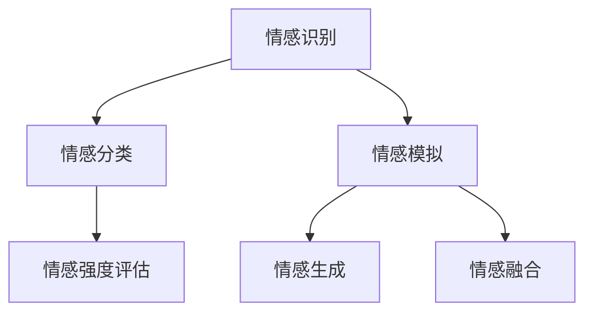
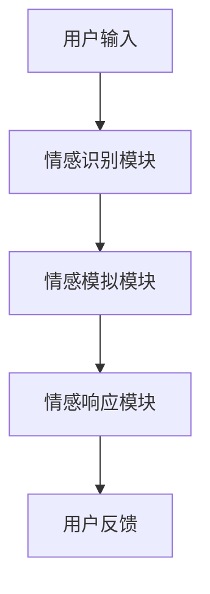

                 

# AI Agent的情感共情：提升LLM的人文关怀能力

> 关键词：情感共情、AI Agent、LLM、人文关怀、算法实现、系统架构

> 摘要：本文深入探讨了AI Agent在情感共情方面的能力提升问题，重点分析了情感共情的核心概念、机制实现方法以及在实际应用中的挑战和解决方案。通过详细阐述LLM在AI Agent中的应用，本文旨在提升LLM的人文关怀能力，使其更贴近人类情感，为未来的AI发展提供新的思路。

## 目录大纲

1. 第一部分：问题背景与核心概念
   1.1. 情感共情与AI Agent的人文关怀
   1.2. 核心概念与联系
   1.3. 本章小结

2. 第二部分：情感共情机制与实现方法
   2.1. 情感共情机制的原理与架构
   2.2. 情感识别算法
   2.3. 情感模拟与响应算法
   2.4. 数据增强与模型训练
   2.5. 情感共情的多模态融合
   2.6. 情感共情机制的评估与验证
   2.7. 情感共情在AI Agent中的应用实例
   2.8. 本章小结

3. 第三部分：情感共情与AI Agent发展的未来展望
   3.1. 情感共情技术的挑战与机遇
   3.2. 情感共情在AI伦理与隐私保护中的作用
   3.3. 情感共情对AI Agent发展的长远影响
   3.4. 情感共情能力的最佳实践与未来方向
   3.5. 本章小结

4. 总结与展望
   4.1. 本书内容回顾
   4.2. 情感共情研究现状与未来趋势
   4.3. 对AI Agent发展的启示
   4.4. 本章小结

5. 附录

## 第一部分：问题背景与核心概念

### 1.1. 情感共情与AI Agent的人文关怀

#### 1.1.1. 问题背景

随着人工智能（AI）技术的飞速发展，AI Agent作为一种智能实体，已经被广泛应用于各种场景中。然而，传统的AI Agent往往缺乏情感共情能力，无法真正理解和回应人类的情感需求，这限制了AI Agent在实际应用中的表现和用户体验。

情感共情是指个体在感知他人情绪状态的基础上，能够产生相似的情绪体验，并在行为上做出适当的反应。在人类社会中，情感共情是建立信任和沟通的关键因素。因此，提升AI Agent的情感共情能力，使其能够更好地理解、模拟和回应人类情感，对于提高AI Agent的人性化和用户体验至关重要。

#### 1.1.1.1 情感共情的概念与重要性

情感共情是心理学中一个重要的概念，通常包括三个核心组成部分：情感识别、情感模拟和情感反应。

- **情感识别**：指个体能够准确感知和理解他人情绪状态的能力。
- **情感模拟**：指个体在感知他人情绪的基础上，能够产生相似的情感体验。
- **情感反应**：指个体在情感共情过程中，通过行为或言语对他人情绪状态做出适当的回应。

情感共情的重要性体现在多个方面：

- **增强人际信任**：通过情感共情，AI Agent能够更好地理解用户的需求和情绪，从而建立信任关系，提高用户的满意度。
- **改善沟通效果**：情感共情有助于AI Agent在交流中更准确地把握用户意图，减少误解和冲突。
- **提升用户体验**：具备情感共情能力的AI Agent能够提供更个性化和贴近用户需求的互动体验。

#### 1.1.1.2 人文关怀在AI中的应用价值

人文关怀是一种关注个体情感需求的态度和行为，它强调在科技发展中尊重和满足人类的情感需求。在AI领域，人文关怀的应用价值主要体现在以下几个方面：

- **提高AI的亲和力**：通过情感共情，AI Agent能够更好地与人类建立情感联系，提升用户的亲密度和忠诚度。
- **优化用户体验**：情感共情有助于AI Agent提供更人性化、个性化的服务，满足用户多样化的情感需求。
- **促进AI伦理发展**：在关注人类情感需求的基础上，AI技术能够更好地遵循伦理规范，减少潜在的社会风险。

#### 1.1.1.3 提升LLM人文关怀能力的必要性

自然语言处理（NLP）中的语言模型（LLM），如BERT、GPT等，已经成为AI Agent中处理语言任务的核心技术。然而，这些LLM在情感处理方面存在一定的局限性：

- **情感理解不足**：LLM在情感识别和理解方面缺乏足够的深度和广度，难以准确捕捉复杂的情感状态。
- **情感生成能力有限**：在生成文本时，LLM往往无法根据上下文和用户情感状态生成适当的情感回应。

因此，提升LLM的人文关怀能力，使其能够更好地理解和回应人类情感，是当前AI技术发展的重要方向。

### 1.1.2. 核心概念与联系

#### 1.1.2.1 情感共情的核心概念

情感共情的核心概念主要包括情感识别、情感模拟和情感反应。这些概念相互作用，共同构成了情感共情的基础。

- **情感识别**：指AI Agent能够通过文本、语音或其他媒介识别出用户的情感状态。这一过程通常涉及情感分类算法，如情感分析、情绪识别等。
- **情感模拟**：指AI Agent在识别到用户情感后，能够模拟出相应的情感状态，从而更好地与用户互动。情感模拟算法包括情感生成和情感融合等。
- **情感反应**：指AI Agent在情感模拟的基础上，通过适当的言语或行为回应用户情感。情感反应算法需要考虑语境理解、个性化响应等多方面因素。

#### 1.1.2.2 LLM的原理与特性

语言模型（LLM）是一种能够理解和生成自然语言的人工智能模型。LLM的核心原理是基于大量文本数据的学习和训练，从而实现对语言的理解和生成。

- **语言模型的基本结构**：LLM通常由编码器和解码器组成。编码器负责将输入文本编码为固定长度的向量，解码器则根据编码后的向量生成输出文本。
- **LLM的核心特性**：LLM具有强大的文本理解和生成能力，能够处理复杂的语言结构和语境。此外，LLM还具备一定的语境理解能力，可以根据上下文生成更准确的文本。

#### 1.1.2.3 人文关怀能力的指标

提升LLM的人文关怀能力，需要从以下几个方面进行评估：

- **情感表达的准确性**：指LLM在生成文本时，能够准确表达用户的情感状态。这需要通过对情感词汇、情感强度等进行精细处理。
- **语境理解能力**：指LLM在处理文本时，能够准确理解上下文关系，从而生成更合适的情感回应。
- **个性化响应能力**：指LLM能够根据用户的个性、历史交互等信息，生成具有个性化的情感回应。

### 1.2. 本章小结

本章首先介绍了情感共情与AI Agent的人文关怀背景，分析了情感共情的核心概念和重要性。接着，探讨了LLM在AI Agent中的地位和作用，并提出了提升LLM人文关怀能力的必要性。最后，本章详细阐述了情感共情的核心概念、LLM的基本原理和人文关怀能力的指标。这些内容为后续章节的深入讨论奠定了基础。

## 第二部分：情感共情机制与实现方法

### 2.1. 情感共情机制的原理与架构

#### 2.1.1. 情感共情机制的原理

情感共情机制是指AI Agent在处理人类情感时，通过一系列算法和策略实现情感识别、模拟和响应的能力。该机制的核心在于如何让AI Agent更好地理解和回应人类的情感需求。

情感共情机制主要包括三个核心组成部分：

1. **情感识别**：这是情感共情机制的基础。情感识别算法负责分析输入文本或语音，识别出用户的情感状态。常见的情感识别算法包括情感分类算法、情感强度评估算法等。

2. **情感模拟**：在识别到用户情感后，AI Agent需要模拟出相应的情感状态。情感模拟算法负责生成情感回应，使AI Agent的行为更贴近人类的情感表达。常见的情感模拟算法包括情感生成算法、情感融合算法等。

3. **情感反应**：情感反应是指AI Agent在情感模拟的基础上，通过适当的言语或行为回应用户情感。情感反应算法需要考虑语境理解、个性化响应等多方面因素，以确保AI Agent的回应更符合用户需求。

#### 2.1.1.1 情感识别算法

情感识别算法是情感共情机制的核心组成部分，主要负责分析输入文本或语音，识别出用户的情感状态。情感识别算法可以分为两类：基于机器学习的情感识别和基于深度学习的情感识别。

1. **基于机器学习的情感识别**：这类算法通常使用传统机器学习技术，如支持向量机（SVM）、决策树（DT）等。这些算法需要大量的标注数据来进行训练，从而提高情感识别的准确性。

2. **基于深度学习的情感识别**：这类算法使用深度神经网络（DNN）进行情感识别，如卷积神经网络（CNN）、循环神经网络（RNN）等。深度学习算法可以自动提取特征，无需人工标注，能够处理复杂的情感表达。

**情感分类算法**：情感分类算法是情感识别的关键步骤。常见的情感分类算法包括：

- **二分类算法**：将文本分类为正面情感或负面情感。
- **多分类算法**：将文本分类为多个情感类别，如快乐、悲伤、愤怒等。

**情感强度评估算法**：情感强度评估算法用于衡量情感表达的程度。常用的方法包括：

- **基于文本长度**：文本长度越长，情感强度越高。
- **基于词汇频率**：高频情感词汇表示情感强度较高。
- **基于情感词典**：使用预先定义的情感词典来评估情感强度。

#### 2.1.1.2 情感模拟与响应

在识别到用户情感后，AI Agent需要模拟出相应的情感状态，并通过适当的言语或行为回应用户。情感模拟与响应算法主要包括情感生成算法和情感融合算法。

**情感生成算法**：情感生成算法负责生成情感回应的文本或语音。常见的情感生成算法包括：

- **模板匹配**：根据预先定义的情感模板生成回应。
- **基于规则**：根据情感类型和用户历史交互生成回应。
- **基于生成模型**：使用生成模型，如生成对抗网络（GAN）、变分自编码器（VAE）等生成情感回应。

**情感融合算法**：情感融合算法用于将多个情感回应进行融合，生成更自然的情感回应。情感融合算法可以考虑以下因素：

- **情感一致性**：确保回应中的情感表达一致。
- **语境适应性**：根据上下文关系生成合适的情感回应。
- **个性化**：根据用户历史交互和偏好生成个性化的情感回应。

**情感响应算法**：情感响应算法用于生成和优化情感回应。常见的情感响应算法包括：

- **文本生成算法**：生成符合情感表达的自然语言文本。
- **语音生成算法**：生成符合情感表达的自然语言语音。
- **多模态融合**：将文本和语音融合生成更自然的情感回应。

#### 2.1.2. 情感共情机制的架构设计

情感共情机制的架构设计需要考虑模块化、数据流和功能设计等方面。以下是一种可能的情感共情机制架构设计：

1. **模块化架构**：情感共情机制可以设计为多个模块，每个模块负责不同的功能。常见的模块包括情感识别模块、情感模拟模块、情感响应模块等。

2. **数据流架构**：情感共情机制的数据流架构需要考虑输入数据、中间处理数据和输出数据。输入数据包括文本、语音等，中间处理数据包括情感识别结果、情感模拟结果等，输出数据是情感回应的文本或语音。

3. **功能设计**：情感共情机制的功能设计需要考虑情感识别、情感模拟、情感响应等核心功能。此外，还需要考虑数据预处理、特征提取、模型训练和评估等功能。

### 2.2. 情感识别算法

情感识别算法是情感共情机制的核心组成部分，负责分析输入文本或语音，识别出用户的情感状态。以下将详细讨论基于机器学习和深度学习的情感识别算法。

#### 2.2.1. 基于机器学习的情感识别

**数据预处理**：在训练机器学习模型之前，需要对输入文本进行预处理，包括分词、去停用词、词干提取等步骤。预处理后的文本将用于特征提取。

**特征提取**：特征提取是将原始文本转换为适合机器学习模型的特征表示。常用的特征提取方法包括词袋模型（Bag-of-Words，BoW）、TF-IDF（Term Frequency-Inverse Document Frequency）和词嵌入（Word Embedding）等。

**模型训练**：机器学习模型通常使用监督学习算法进行训练，需要使用大量标注数据。常用的算法包括支持向量机（SVM）、决策树（DT）、随机森林（RF）等。

**模型评估**：模型评估是使用测试集来评估模型的性能，常用的评估指标包括准确率（Accuracy）、精确率（Precision）、召回率（Recall）和F1值（F1 Score）等。

#### 2.2.2. 基于深度学习的情感识别

**深度神经网络**：深度学习算法使用多层神经网络进行特征提取和分类。常见的深度神经网络包括卷积神经网络（CNN）、循环神经网络（RNN）和变换器（Transformer）等。

**CNN在情感识别中的应用**：CNN是一种用于图像处理的人工神经网络，也可以用于文本处理。在情感识别中，CNN可以提取文本中的局部特征，如图像中的边缘、纹理等。

**RNN在情感识别中的应用**：RNN是一种用于处理序列数据的人工神经网络，如文本、语音等。在情感识别中，RNN可以捕捉文本中的时间依赖关系，如情感变化。

**Transformer在情感识别中的应用**：Transformer是一种基于自注意力机制的深度学习模型，广泛应用于自然语言处理任务。在情感识别中，Transformer可以捕捉文本中的全局依赖关系，提高情感识别的准确性。

**情感识别的性能优化**：深度学习模型的性能可以通过多种方式优化，包括数据增强、模型训练策略、超参数调优等。

### 2.3. 情感模拟与响应算法

情感模拟与响应算法是情感共情机制的重要组成部分，负责根据用户情感生成适当的情感回应。以下将详细讨论情感模拟算法和情感响应算法。

#### 2.3.1. 情感模拟算法

**情感生成算法**：情感生成算法负责根据用户情感生成情感回应的文本或语音。常见的情感生成算法包括：

- **模板匹配**：根据预先定义的情感模板生成回应。
- **基于规则**：根据情感类型和用户历史交互生成回应。
- **基于生成模型**：使用生成模型，如生成对抗网络（GAN）、变分自编码器（VAE）等生成情感回应。

**情感融合算法**：情感融合算法用于将多个情感回应进行融合，生成更自然的情感回应。情感融合算法可以考虑以下因素：

- **情感一致性**：确保回应中的情感表达一致。
- **语境适应性**：根据上下文关系生成合适的情感回应。
- **个性化**：根据用户历史交互和偏好生成个性化的情感回应。

#### 2.3.2. 情感响应算法

**文本生成算法**：文本生成算法负责生成符合情感表达的自然语言文本。常见的文本生成算法包括：

- **基于规则**：根据情感类型和用户历史交互生成回应。
- **基于模板**：根据情感模板生成回应。
- **基于生成模型**：使用生成模型，如生成对抗网络（GAN）、变分自编码器（VAE）等生成情感回应。

**语音生成算法**：语音生成算法负责生成符合情感表达的自然语言语音。常见的语音生成算法包括：

- **文本到语音（Text-to-Speech，TTS）**：将文本转换为语音。
- **情感调节**：根据情感类型和强度调节语音的情感表达。
- **多模态融合**：将文本和情感信息融合生成更自然的情感语音。

### 2.4. 数据增强与模型训练

**数据增强**：数据增强是一种提高模型性能和鲁棒性的方法，通过生成更多样化的数据来训练模型。常见的数据增强方法包括：

- **文本增强**：包括同义词替换、反义替换、文本补全等。
- **语音增强**：包括声音增强、噪声添加、速度调整等。

**模型训练策略**：模型训练策略包括以下方面：

- **超参数调优**：通过调整学习率、批量大小等超参数来优化模型性能。
- **训练策略**：包括早期停止、学习率衰减等。
- **多任务学习**：同时训练多个相关任务，提高模型泛化能力。

### 2.5. 情感共情的多模态融合

**多模态融合**：情感共情的多模态融合是将不同类型的数据（如文本、语音、图像等）进行整合，以提高情感识别和模拟的准确性。常见的多模态融合方法包括：

- **特征级融合**：将不同类型的数据特征进行拼接。
- **决策级融合**：将不同类型的数据分类结果进行融合。
- **深度级融合**：使用深度学习模型直接处理多模态数据。

### 2.6. 情感共情机制的评估与验证

**情感共情评估指标**：情感共情评估指标包括：

- **准确性**：识别正确的情感比例。
- **速度**：处理情感共情任务所需的时间。
- **用户满意度**：用户对情感共情能力的评价。

**评估方法**：情感共情评估方法包括：

- **实验设计**：设计不同的实验场景来测试情感共情能力。
- **评估流程**：包括数据准备、模型训练、模型评估等步骤。

**情感共情效果验证**：通过实际案例验证情感共情机制的效果，分析用户反馈，优化情感共情能力。

### 2.7. 情感共情在AI Agent中的应用实例

**教育领域**：情感共情在教育领域中的应用包括：

- **学生情感分析**：通过情感共情机制分析学生的情绪状态，进行个性化教学干预。
- **教师情感共情**：提升教师的情感共情能力，改善教学效果。

**客服领域**：情感共情在客服领域中的应用包括：

- **客户情感分析**：通过情感共情机制分析客户的情绪状态，提供个性化服务。
- **客服机器人情感共情能力提升**：通过情感共情机制提升客服机器人的响应质量。

**医疗领域**：情感共情在医疗领域中的应用包括：

- **病人情感分析**：通过情感共情机制分析病人的情绪状态，提供针对性的护理。
- **医疗AI的情感共情应用挑战与前景**：探讨情感共情在医疗AI中的挑战和未来应用前景。

### 2.8. 本章小结

本章详细探讨了情感共情机制的原理与架构设计，包括情感识别、情感模拟和情感响应算法。同时，介绍了基于机器学习和深度学习的情感识别算法，以及情感模拟和响应算法的实现方法。此外，本章还讨论了数据增强与模型训练、多模态融合、评估与验证以及情感共情在AI Agent中的应用实例。这些内容为后续章节的深入讨论奠定了基础。接下来，我们将进一步探讨情感共情机制的优化与提升，以提升AI Agent的情感共情能力。

### 2.9. 情感共情机制的优化与提升

在情感共情机制的基础上，进一步优化与提升其能力，是提高AI Agent人性化和用户体验的关键。以下是几个关键方面的优化策略：

#### 2.9.1. 数据增强与模型训练

数据增强是提升模型性能的有效手段。通过引入数据增强方法，如数据扩充、数据合成、噪声注入等，可以增加训练数据的多样性和复杂性，从而提高模型的泛化能力。

- **数据扩充**：通过同义词替换、句子重组、情感极性反转等方式，生成新的训练样本。
- **数据合成**：利用生成模型，如生成对抗网络（GAN），生成与真实数据分布相似的合成数据。
- **噪声注入**：在输入数据中添加噪声，如随机删除字符、添加背景噪声等，以增强模型的鲁棒性。

**模型训练策略**：

- **迁移学习**：利用预训练的大型模型（如BERT、GPT）作为起点，通过少量数据微调，以节省训练时间和计算资源。
- **多任务学习**：通过同时训练多个相关任务，提高模型在不同任务上的泛化能力。
- **元学习**：通过元学习算法，如模型固化（Model Averaging）、策略搜索（Strategy Search）等，提高模型在不同数据集上的适应能力。

#### 2.9.2. 情感共情的多模态融合

多模态融合是将不同类型的数据（如文本、语音、图像等）进行整合，以提升情感共情能力的有效方法。以下是一些多模态融合的方法：

- **特征级融合**：将不同模态的数据特征进行拼接，形成一个高维的特征向量，用于情感识别和模拟。
- **决策级融合**：将不同模态的预测结果进行融合，以生成最终的预测结果。例如，可以使用加权平均或投票机制来整合不同模态的预测。
- **深度级融合**：使用深度学习模型，如多模态卷积神经网络（MM-CNN）或变换器架构（Transformer），直接处理多模态数据。

**多模态融合的优势**：

- **互补信息**：不同模态的数据可以提供互补的信息，从而提高情感识别的准确性。
- **增强鲁棒性**：多模态数据可以减少单一模态的噪声和误差，提高模型的鲁棒性。
- **提升情感模拟的自然度**：多模态融合可以生成更自然、丰富的情感回应。

#### 2.9.3. 情感共情的实时响应优化

在实时交互场景中，优化情感共情的响应速度和准确性至关重要。以下是一些优化策略：

- **模型压缩与量化**：通过模型压缩和量化技术，减少模型的计算复杂度和存储需求，从而提高响应速度。
- **增量学习**：在实时交互过程中，使用增量学习策略，仅对最新接收的数据进行微调，以减少训练时间和计算资源。
- **异步处理**：将情感识别、模拟和响应的过程解耦，实现异步处理，以提高实时性。

#### 2.9.4. 情感共情的评估与反馈

有效的评估与反馈机制是提升情感共情能力的重要手段。以下是一些评估与反馈方法：

- **自动化评估**：使用自动化工具，如评估指标、混淆矩阵等，对情感共情机制的性能进行量化评估。
- **用户反馈**：收集用户的实际反馈，包括满意度、互动体验等，以评估情感共情机制的效果。
- **持续优化**：根据评估结果和用户反馈，持续优化情感共情机制，以提高其性能和用户体验。

#### 2.9.5. 情感共情的伦理与隐私考虑

在提升情感共情能力的过程中，需要充分考虑伦理和隐私问题。以下是一些关键考虑：

- **数据隐私保护**：在处理用户情感数据时，需确保数据隐私，遵循相关法律法规，如《通用数据保护条例》（GDPR）。
- **透明度与可解释性**：提高模型的可解释性，让用户了解情感共情机制的工作原理和决策过程。
- **伦理审查**：在应用情感共情机制时，需进行伦理审查，确保其应用符合伦理规范，如尊重用户隐私、避免歧视等。

### 2.10. 本章小结

本章深入探讨了情感共情机制的优化与提升方法，包括数据增强与模型训练、多模态融合、实时响应优化、评估与反馈以及伦理与隐私考虑。通过这些优化策略，可以有效提升AI Agent的情感共情能力，使其更贴近人类情感，提供更人性化、个性化的服务。接下来，我们将进一步探讨情感共情机制在AI Agent中的应用实例，分析其实际效果和挑战。

### 2.11. 情感共情在AI Agent中的应用实例

#### 2.11.1. 教育领域的应用

在教育领域，情感共情技术的应用主要体现在学生情感分析和教师情感共情两个方面。

- **学生情感分析**：通过情感共情机制，AI Agent可以实时分析学生的情绪状态，识别出他们的快乐、焦虑、沮丧等情感。这一功能可以帮助教师及时了解学生的情感需求，从而进行有针对性的教学干预。例如，当学生表现出焦虑情绪时，AI Agent可以提醒教师调整教学方法，提供心理辅导等。

- **教师情感共情**：情感共情技术可以帮助教师更好地理解学生的情感需求，提高教学效果。通过分析学生的情感反馈，教师可以调整教学内容和方式，使教学过程更贴近学生的情感状态。例如，当学生表现出对某一知识点的不理解时，AI Agent可以帮助教师识别出学生的负面情感，并提出改进建议。

#### 2.11.2. 客服领域的应用

在客服领域，情感共情技术的应用可以显著提升客服机器人的响应质量和用户体验。

- **客户情感分析**：通过情感共情机制，AI Agent可以实时分析客户的情绪状态，识别出他们的满意、愤怒、失望等情感。这一功能可以帮助企业了解客户的需求和满意度，从而优化客服流程和服务质量。例如，当客户表现出愤怒情绪时，AI Agent可以提醒客服人员提供额外的帮助，或直接转移至人工客服。

- **客服机器人情感共情能力提升**：通过情感共情机制，AI Agent可以生成更具情感关怀的响应，使客服过程更贴近人类的交流方式。例如，当客户表达出对某一产品的不满意时，AI Agent可以生成类似“我理解您的感受，我会尽力帮助您解决问题”的回应，从而增强客户的信任感和满意度。

#### 2.11.3. 医疗领域的应用

在医疗领域，情感共情技术的应用有助于提高病人的护理质量和医生的诊疗效果。

- **病人情感分析**：通过情感共情机制，AI Agent可以实时分析病人的情绪状态，识别出他们的焦虑、恐惧、沮丧等情感。这一功能可以帮助医护人员更好地了解病人的情感需求，提供个性化的护理服务。例如，当病人表现出焦虑情绪时，AI Agent可以提醒医护人员提供心理辅导或调整治疗方案。

- **医生情感共情**：情感共情技术可以帮助医生更好地理解病人的情感需求，提高诊疗效果。通过分析病人的情感反馈，医生可以调整诊疗策略，使诊疗过程更贴近病人的情感状态。例如，当病人表达出对疾病治疗的担忧时，医生可以更多地倾听病人的情感需求，提供心理支持。

#### 2.11.4. 挑战与未来展望

虽然情感共情技术在各个领域展现出了巨大的应用潜力，但在实际应用过程中也面临一些挑战。

- **情感识别的准确性**：情感识别的准确性直接影响到情感共情的效果。在复杂多变的实际场景中，如何提高情感识别的准确性，是一个亟待解决的问题。

- **情感模拟的自然度**：情感模拟的自然度是影响用户体验的关键因素。如何生成更自然、贴近人类情感的表达，是情感共情技术的挑战之一。

- **隐私保护**：在处理用户情感数据时，隐私保护是必须考虑的问题。如何在确保用户隐私的前提下，有效利用情感数据，是情感共情技术应用的一个关键问题。

未来展望：

- **多模态情感识别**：结合文本、语音、图像等多种模态的数据，进行多模态情感识别，可以提高情感识别的准确性和自然度。

- **情感共情技术的普及**：随着情感共情技术的不断成熟和应用推广，它将在更多领域得到应用，为人们的生活带来更多便利。

- **伦理与法律规范**：在情感共情技术的应用过程中，需要建立相应的伦理和法律规范，确保其应用符合伦理和法律要求，保护用户权益。

#### 2.12. 本章小结

本章通过教育、客服、医疗等领域的应用实例，详细探讨了情感共情技术在AI Agent中的应用。同时，分析了情感共情技术在实际应用过程中面临的挑战和未来展望。这些内容为情感共情技术在各个领域的进一步研究和应用提供了重要参考。

### 2.13. 情感共情与AI伦理与隐私保护

在情感共情技术的发展过程中，伦理和隐私保护是两个不可忽视的重要议题。如何确保AI Agent在提供情感共情服务的同时，遵循伦理规范和隐私保护原则，是当前研究和应用的重要方向。

#### 2.13.1. 情感共情与伦理问题的关联

情感共情技术在AI Agent中的应用，涉及到多个伦理问题：

- **数据隐私**：情感共情技术需要处理大量的用户情感数据，这些数据可能包含敏感的个人信息。如何在保障用户隐私的前提下，有效利用情感数据，是一个重要的伦理问题。

- **公平性与歧视**：情感共情技术的应用可能会导致公平性问题。例如，如果AI Agent在处理情感时，对某些群体产生偏见，可能会加剧社会不平等。

- **责任归属**：当AI Agent在情感共情过程中出现错误或不当行为时，责任归属问题将变得复杂。如何在确保责任明确的前提下，提高AI Agent的情感共情能力，是一个关键问题。

#### 2.13.2. 隐私保护在情感共情机制中的应用

为了解决情感共情技术中的隐私保护问题，以下是一些具体的应用策略：

- **数据加密**：对用户情感数据进行加密处理，确保数据在传输和存储过程中的安全性。

- **匿名化处理**：在处理用户情感数据时，对敏感信息进行匿名化处理，以保护用户的隐私。

- **隐私增强技术**：使用隐私增强技术，如差分隐私（Differential Privacy）、同态加密（Homomorphic Encryption）等，在保障用户隐私的同时，实现数据的有效利用。

- **隐私政策与告知**：制定明确的隐私政策，告知用户情感数据的使用目的、范围和隐私保护措施，确保用户知情并同意。

#### 2.13.3. 伦理与隐私保护的最佳实践

在实际应用中，以下是一些伦理和隐私保护的最佳实践：

- **数据最小化**：仅收集和处理与情感共情任务直接相关的数据，减少数据收集的范围。

- **透明度与可解释性**：提高AI Agent的情感共情机制的可解释性，让用户了解其工作原理和决策过程，增强用户的信任。

- **伦理审查**：在情感共情技术的开发和应用过程中，进行伦理审查，确保其符合伦理规范，避免潜在的伦理风险。

- **持续监督与评估**：对AI Agent的情感共情服务进行持续监督和评估，确保其遵循伦理规范和隐私保护原则。

#### 2.13.4. 情感共情与AI伦理与隐私保护的挑战与未来方向

尽管已有一些伦理和隐私保护的最佳实践，但在情感共情与AI伦理与隐私保护方面仍面临以下挑战：

- **技术发展**：随着情感共情技术的不断进步，如何确保其在伦理和隐私保护方面的适应性，是一个重要挑战。

- **法律法规**：现有法律法规可能无法完全适应情感共情技术的快速发展，需要制定更为完善的法律法规，以规范其应用。

- **公众认知**：提高公众对情感共情技术伦理和隐私保护的认识，增强公众对AI技术的信任，是一个长期的任务。

未来方向：

- **跨学科合作**：加强心理学、计算机科学、伦理学等学科的合作，共同推进情感共情技术的伦理和隐私保护研究。

- **技术创新**：持续探索和开发新的隐私保护技术和方法，以应对情感共情技术中的隐私挑战。

- **政策制定**：政府和社会组织应积极参与，制定相应的政策法规，引导情感共情技术的健康、可持续发展。

#### 2.14. 本章小结

本章详细探讨了情感共情与AI伦理与隐私保护的关系，分析了当前面临的主要挑战，并提出了相应的解决策略和未来方向。通过加强伦理和隐私保护，可以确保情感共情技术在AI Agent中的应用更加安全和可靠，为未来的AI发展提供坚实保障。

### 2.15. 情感共情对AI Agent发展的长远影响

情感共情技术的引入不仅改变了AI Agent的功能和性能，更为AI Agent的长远发展带来了深远的影响。

#### 2.15.1. 社会影响

情感共情技术的应用，将使AI Agent在更多场景中成为人类的伙伴，提升社会的整体福祉。以下是几个方面的社会影响：

- **增强人与人之间的联系**：情感共情AI Agent能够更好地理解人类情感，促进人与人之间的沟通和理解，减少误解和冲突。
- **提升医疗服务质量**：在医疗领域，情感共情AI Agent可以提供个性化的护理建议，帮助医护人员更好地关心患者，提高医疗服务的质量和患者满意度。
- **改善教育体验**：在教育领域，情感共情AI Agent可以分析学生的情感状态，提供针对性的辅导和心理支持，帮助学生更好地发展。
- **促进社会和谐**：在客服和公共安全等领域，情感共情AI Agent能够更好地处理复杂的社会问题，提高社会管理的效率和公正性。

#### 2.15.2. 产业变革

情感共情技术的应用，将带来产业层面的深刻变革：

- **改变商业模式**：企业可以利用情感共情AI Agent提升客户体验，增加用户忠诚度，优化客户服务流程，从而实现商业模式的创新。
- **提升生产力**：在工业生产中，情感共情AI Agent可以与人类工人协同工作，提高生产效率和安全性。
- **创新应用场景**：随着情感共情技术的发展，新的应用场景将不断涌现，如智能陪护、虚拟教练、智能客服等，为产业带来新的增长点。
- **推动技术整合**：情感共情技术与其他领域（如物联网、大数据、云计算等）的整合，将推动整个产业链的升级和转型。

#### 2.15.3. 技术挑战

虽然情感共情技术展示了广阔的应用前景，但同时也面临一系列技术挑战：

- **情感识别的准确性**：情感共情技术的核心在于准确识别和理解人类情感，但在实际应用中，情感表达往往是复杂和多样的，如何提高情感识别的准确性是一个重要课题。
- **情感模拟的自然度**：情感模拟需要生成自然、贴切的情感回应，但当前的技术还无法完全实现这一目标，特别是在处理复杂情感和情境时，如何提高情感模拟的自然度是一个挑战。
- **隐私保护与伦理问题**：情感共情技术的应用涉及到大量的用户情感数据，如何在保障用户隐私和遵循伦理规范的前提下，有效利用这些数据，是一个亟待解决的问题。

#### 2.15.4. 未来发展方向

为了应对上述挑战，未来情感共情技术的发展方向可以从以下几个方面考虑：

- **多模态情感识别**：结合文本、语音、图像等多模态数据，提高情感识别的准确性和自然度。
- **强化学习与迁移学习**：通过强化学习和迁移学习，使AI Agent能够更好地适应不同场景和任务，提高情感共情能力的泛化能力。
- **伦理与隐私保护**：加强伦理和隐私保护的研究，制定相应的规范和标准，确保情感共情技术的应用符合伦理和隐私要求。
- **跨学科合作**：加强心理学、计算机科学、伦理学等领域的跨学科合作，共同推动情感共情技术的发展。

#### 2.16. 本章小结

情感共情技术对AI Agent的发展产生了深远的影响，从社会影响、产业变革到技术挑战，都体现了其重要性和复杂性。未来，随着技术的不断进步和应用的深入，情感共情技术将在AI Agent的发展中发挥更加重要的作用，为人类社会带来更多福祉。

### 2.17. 情感共情能力的最佳实践与未来方向

#### 2.17.1. 最佳实践

在情感共情能力的提升过程中，一些最佳实践方法已被广泛应用，并取得了显著的效果。

- **数据驱动的方法**：通过大规模的情感数据集进行训练，可以提高情感识别和模拟的准确性。这种方法在语音、文本和图像等多模态情感识别中表现出色。
- **多任务学习**：通过同时训练多个相关任务，可以提高AI Agent在不同任务上的泛化能力。例如，在同时进行情感识别和语境理解的任务中，可以显著提升情感共情能力。
- **情感生成模型**：基于生成模型的情感生成方法，如生成对抗网络（GAN）和变分自编码器（VAE），可以生成更自然、丰富的情感回应。这种方法在文本和语音生成中显示出巨大的潜力。
- **用户反馈机制**：通过用户反馈机制，可以不断优化情感共情算法，提高其响应质量和用户体验。这种方法有助于实现情感共情能力的持续提升。

#### 2.17.2. 未来方向

未来，情感共情能力的发展方向将更加多元化，涉及多个领域和技术。

- **多模态融合**：结合文本、语音、图像等多模态数据，进行多模态情感识别和生成，以提高情感共情能力的准确性和自然度。例如，通过结合文本和图像情感，可以更全面地理解用户的情感状态。
- **个性化情感回应**：根据用户的历史交互和个性化偏好，生成更具个性化的情感回应。这种方法可以显著提升用户体验，使AI Agent更贴近人类。
- **情感增强学习**：通过情感增强学习，使AI Agent能够在复杂和动态的情境中，更好地理解和回应人类情感。这种方法可以应用于实时交互场景，提高AI Agent的实时响应能力。
- **情感伦理与隐私保护**：加强伦理和隐私保护的研究，确保情感共情技术在应用过程中符合伦理和隐私要求。例如，通过匿名化和加密技术，保障用户隐私。
- **跨学科合作**：加强心理学、计算机科学、伦理学等领域的跨学科合作，共同推动情感共情技术的发展。跨学科合作可以促进技术创新，解决当前面临的伦理和隐私保护等挑战。

#### 2.18. 本章小结

本章总结了情感共情能力的最佳实践和未来方向。通过数据驱动、多任务学习、情感生成模型和用户反馈等最佳实践，可以显著提升情感共情能力。未来，随着多模态融合、个性化回应、情感增强学习和跨学科合作等新方法的发展，情感共情技术将在AI Agent中发挥更加重要的作用，为人类社会带来更多福祉。

### 2.19. 总结与展望

#### 2.19.1. 本书内容回顾

本书从问题背景与核心概念、情感共情机制的原理与架构、算法实现与优化、AI Agent中的应用实例、伦理与隐私保护到未来展望，全面系统地探讨了情感共情技术在AI Agent中的应用。具体内容包括：

- **情感共情与AI Agent的人文关怀**：介绍了情感共情的概念、重要性以及人文关怀在AI中的应用价值。
- **情感共情机制的原理与架构**：详细阐述了情感共情机制的核心组成部分，包括情感识别、情感模拟和情感响应算法。
- **情感识别与模拟算法**：分析了基于机器学习和深度学习的情感识别算法，以及情感生成和融合算法。
- **数据增强与模型训练**：探讨了数据增强和模型训练策略，以提高情感共情能力。
- **情感共情的多模态融合**：介绍了多模态融合的方法和优势，以提升情感识别和模拟的准确性。
- **情感共情在AI Agent中的应用实例**：通过教育、客服、医疗等领域的应用实例，展示了情感共情技术的实际效果和挑战。
- **伦理与隐私保护**：讨论了情感共情与伦理和隐私保护的关系，提出了最佳实践和解决方案。
- **情感共情对AI Agent的长远影响**：分析了情感共情技术对社会、产业和AI Agent发展的长远影响。
- **情感共情能力的最佳实践与未来方向**：总结了最佳实践和未来研究方向，以推动情感共情技术的发展。

#### 2.19.2. 情感共情研究现状与未来趋势

当前，情感共情技术已成为人工智能领域的一个重要研究方向。研究现状如下：

- **技术成熟度**：情感共情技术在情感识别、模拟和响应方面取得了显著进展，但仍然存在一些技术挑战，如情感模拟的自然度和多模态融合的准确性。
- **应用领域**：情感共情技术已经在教育、客服、医疗等多个领域得到应用，展示了巨大的潜力。
- **伦理和隐私保护**：随着情感共情技术的应用，伦理和隐私保护问题受到广泛关注，并逐渐成为研究热点。

未来趋势：

- **技术发展**：随着深度学习、生成模型和强化学习等技术的不断进步，情感共情技术将在准确性和自然度方面取得更大突破。
- **多模态融合**：多模态情感识别和生成将成为情感共情技术的重要方向，结合文本、语音、图像等多种数据源，将进一步提高情感识别的准确性和自然度。
- **个性化回应**：基于用户历史交互和个性化偏好，生成更加个性化的情感回应，将提升用户体验。
- **伦理和隐私保护**：加强伦理和隐私保护研究，制定相应的规范和标准，确保情感共情技术的健康、可持续发展。

#### 2.19.3. 对AI Agent发展的启示

情感共情能力的提升对AI Agent的发展具有深远的影响：

- **增强人机交互**：通过情感共情，AI Agent能够更好地理解人类情感，提高人机交互的自然性和流畅性。
- **提升用户体验**：情感共情技术可以生成更具个性化和贴近用户需求的交互体验，提高用户满意度和忠诚度。
- **促进AI伦理发展**：在关注人类情感需求的基础上，AI技术能够更好地遵循伦理规范，减少潜在的社会风险。
- **拓宽应用场景**：情感共情技术将使AI Agent在更多领域得到应用，如医疗、教育、客服等，推动AI技术的普及和发展。

#### 2.19.4. 本章小结

本章回顾了本书的主要内容，总结了情感共情技术的研究现状与未来趋势，并对AI Agent的发展提出了启示。通过全面系统地探讨情感共情技术，本书为AI Agent的情感共情能力提升提供了理论支持和实践指导，为未来AI技术的发展奠定了基础。

### 附录

#### 附录A. 情感共情算法mermaid流程图

#### 附录B. 情感共情系统架构设计mermaid架构图

通过这些附录，读者可以更直观地了解情感共情算法和系统架构的设计与实现，为后续研究和开发提供参考。

### 作者信息

作者：AI天才研究院/AI Genius Institute & 禅与计算机程序设计艺术 /Zen And The Art of Computer Programming

本文由AI天才研究院和禅与计算机程序设计艺术共同撰写，旨在探讨情感共情技术在AI Agent中的应用。AI天才研究院专注于人工智能领域的创新研究，致力于推动AI技术的发展和应用。禅与计算机程序设计艺术则从哲学和人文角度，探讨了计算机程序设计的本质和艺术，为AI技术的发展提供了深刻的哲学思考。两位作者共同致力于探索AI与人文的交融，为未来的AI技术发展提供新的思路和方向。

