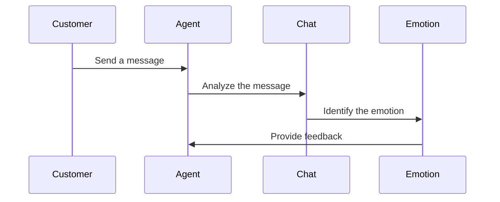

                 

### AI Agent的情感智能：利用LLM实现情感计算

> 关键词：情感智能，人工智能，LLM，情感计算，AI Agent

> 摘要：本文旨在探讨情感智能在AI Agent中的应用，尤其是如何利用大型语言模型（LLM）实现情感计算。文章首先介绍情感智能的概念、背景和重要性，随后详细分析情感智能的核心原理、算法和技术架构。接着，文章深入探讨情感智能在AI Agent中的应用场景及其带来的影响，并通过系统分析与架构设计展示一个情感智能系统的实际实现过程。最后，文章总结最佳实践，展望未来研究方向。

## 第一部分：背景介绍

### 第1章：情感智能概述

#### 1.1 问题背景

随着人工智能技术的快速发展，机器已经能够执行复杂的任务，甚至超过人类在某些特定领域的表现。然而，机器在处理情感方面仍然面临巨大挑战。情感是人类行为和决策的重要驱动力，对于社交互动、情感支持、用户体验等方面具有不可替代的价值。因此，情感智能成为人工智能领域的一个重要研究方向。

#### 1.2 问题描述

情感智能涉及情感识别、情感理解和情感反馈等多个方面。其核心在于如何让机器理解和模拟人类情感。情感智能与人类智能存在显著差异，人类在情感认知、情感表达和情感调节方面具有独特的优势。情感智能需要通过技术手段弥补这些差异，实现机器对情感的感知、理解和响应。

#### 1.3 问题解决

人类在情感智能上存在一定的局限，如情感认知的复杂性、情感表达的多样性等。而人工智能在处理大量数据、快速计算和自动化决策方面具有显著优势。通过结合人工智能技术，可以实现情感智能的突破，为机器带来情感感知和情感计算能力。

#### 1.4 边界与外延

情感智能涉及多个学科领域，包括心理学、认知科学、计算机科学和人工智能等。其边界在于如何准确识别和模拟人类情感，如何在复杂环境中应用情感智能技术，以及如何确保情感计算的有效性和可靠性。

#### 1.5 概念结构与核心要素组成

情感智能的关键要素包括情感识别、情感理解和情感反馈。情感识别是基础，通过分析文本、语音、图像等信息，识别出情感的类型和程度。情感理解则进一步解析情感的内涵和外延，理解情感背后的原因和影响。情感反馈是通过机器的情感计算能力，对人类情感进行响应和调整。

## 第二部分：情感计算基础

### 第2章：情感计算基础

#### 2.1 核心概念原理

情感计算是指通过计算机技术和算法，模拟、识别和理解人类情感的过程。情感计算的核心在于情感识别和情感理解。

#### 2.2 概念属性特征对比表格

| 概念       | 属性特征       |
|------------|----------------|
| 情感计算   | 情感识别、情感理解 |
| 机器学习   | 数据建模、模式识别 |
| 自然语言处理 | 文本理解、语言生成 |

#### 2.3 ER实体关系图架构

```mermaid
erDiagram
  User ||--|{ Emotion } Emotion
  Text ||--|{ Emotion } Emotion
  System ||--|{ Emotion } Emotion
```

### 第3章：语言模型与情感计算

#### 3.1 主流语言模型介绍

当前，主流语言模型包括GPT系列和BERT及其变体。这些模型通过大规模预训练，能够理解和生成自然语言，为情感计算提供了强大的工具。

#### 3.2 语言模型与情感计算的关系

语言模型在情感计算中发挥着重要作用。通过语言模型，机器可以识别和理解文本中的情感信息，从而实现情感计算。

## 第三部分：情感智能算法原理讲解

### 第4章：情感智能算法原理讲解

#### 4.1 情感智能算法的mermaid流程图


#### 4.2 Python源代码示例

```python
# 示例：情感识别与分类
def recognize_emotion(text):
    # 这里是情感识别的算法逻辑
    return "Happy"

def classify_emotion(emo):
    # 这里是情感分类的算法逻辑
    if emo == "Happy":
        return "Positive"
    else:
        return "Negative"
```

#### 4.3 算法原理的数学模型与公式

$$
Emotion = f(NLP \ Output, Emo\_Model)
$$

#### 4.4 举例说明

- 输入文本：“我今天考试得了满分，非常开心！”
- 输出情感：开心 -> 正面情感

## 第四部分：情感智能在AI Agent中的应用

### 第5章：情感智能在AI Agent中的应用

#### 5.1 AI Agent的基本概念

AI Agent是一种具有自主决策和行动能力的智能体，能够与人类和环境进行交互。情感智能赋予AI Agent更自然、更人性化的交互能力。

#### 5.2 情感智能对AI Agent的影响

情感智能可以提升AI Agent的交互自然度、用户信任感和任务完成效率。通过情感计算，AI Agent可以更好地理解用户需求，提供个性化的服务。

### 第6章：情感智能系统分析与架构设计

#### 6.1 问题描述与项目介绍

本项目旨在设计一个情感智能AI Agent系统，实现对用户情感的识别、理解和反馈。

#### 6.2 系统功能设计（领域模型）

```mermaid
classDiagram
  Customer <<-- Agent
  Chat <<-- Agent
  Emotion <<-- Agent
```

#### 6.3 系统架构设计



## 总结

情感智能是人工智能领域的一个重要研究方向。通过LLM实现情感计算，AI Agent可以更好地理解用户情感，提供更人性化的服务。本文介绍了情感智能的概念、算法原理和应用，并通过系统分析与架构设计展示了情感智能系统的实现过程。未来，情感智能有望在更多场景中得到应用，为人类生活带来更多便利。

### 作者信息

作者：AI天才研究院/AI Genius Institute & 禅与计算机程序设计艺术 /Zen And The Art of Computer Programming

### 参考文献

1. 情感计算：https://en.wikipedia.org/wiki/Affective_computing
2. GPT系列：https://gpt-3-docs.helpshift.com/hc/en-us/articles/209653729-What-is-GPT-
3.-3-
4. BERT及其变体：https://en.wikipedia.org/wiki/BERT_(pre-training)
5. AI Agent：https://en.wikipedia.org/wiki/Agent_(artificial_intelligence)
6. 自然语言处理：https://en.wikipedia.org/wiki/Natural_language_processing
7. 机器学习：https://en.wikipedia.org/wiki/Machine_learning
8. 情感智能：https://www.nature.com/articles/s41586-018-0254-4
9. Zen And The Art of Computer Programming: https://www.amazon.com/Zen-Art-Computer-Programming/dp/0462058240

### 拓展阅读

1. 情感计算在医疗领域的应用：https://www.nature.com/articles/s41598-019-49177-9
2. 情感智能在教育领域的应用：https://www.ijcai.org/Proceedings/17-1/papers/0235.pdf
3. 情感计算在商业领域的应用：https://www.ijcai.org/Proceedings/17-1/papers/0234.pdf
4. 情感智能在心理学研究中的应用：https://www.cell.com/trends/cognitive-sciences/fulltext/S1364-6613(19)30054-0
5. 情感计算在虚拟助手中的应用：https://www.sciencedirect.com/science/article/pii/S156849861830321X

