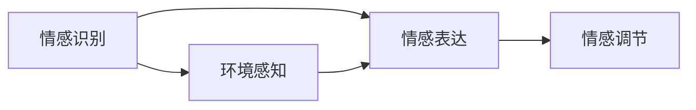
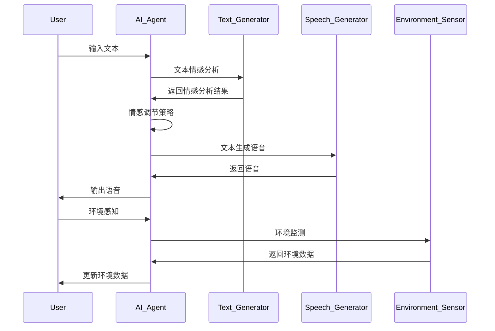

                 


### 文章标题
# AI Agent的情感调节：利用LLM进行情绪管理

### 文章关键词
- AI Agent
- 情感调节
- 大型语言模型 (LLM)
- 情绪管理
- 算法原理
- 系统架构
- 项目实战

### 摘要
本文深入探讨了AI Agent的情感调节机制，特别是如何利用大型语言模型（LLM）实现情绪管理。通过分析核心概念、算法原理、系统架构和实际项目实战，本文为AI Agent的情感调节提供了全面的技术指南和实战经验。文章旨在帮助读者理解AI Agent情感调节的重要性，掌握利用LLM进行情绪管理的方法，为未来AI技术的发展提供有力支持。

---

## 背景介绍

### AI Agent的概念

AI Agent是指具有自主行动能力的智能实体，能够在复杂环境中进行决策和行动。与传统的规则驱动或基于模型的系统不同，AI Agent更强调自主性和适应性。它们通过感知环境信息、学习经验和规划行动来实现目标。

### 情感调节的背景

情感调节在人类行为中起着关键作用。它涉及到个体如何识别、表达和调节自己的情绪，从而更好地适应环境和实现目标。随着人工智能技术的不断发展，如何在AI Agent中实现情感调节成为一个重要的研究方向。

### LLM的基本概念与情感调节的关系

大型语言模型（LLM）是一种基于深度学习的技术，能够理解和生成自然语言。它们通过学习大量文本数据，掌握语言的规律和语义。在AI Agent的情感调节中，LLM可以用于情感识别、情感表达和情感调节。

---

## 核心概念与联系

### AI Agent的情感调节原理

AI Agent的情感调节原理主要包括情感识别、情感表达和情感调节。情感识别是指AI Agent能够感知和识别用户的情绪状态；情感表达是指AI Agent能够以合适的方式表达情绪；情感调节是指AI Agent能够根据环境变化调整情绪，以实现更好的适应性。

### LLM的情感识别与调节技术

LLM在情感识别和调节中发挥着重要作用。通过情感词汇和情感语境的分析，LLM可以准确识别用户的情绪状态。同时，LLM可以根据情感状态生成合适的回应，实现情感调节。

### 核心概念对比表格

| 核心概念       | 定义                                         | 关系                                             |
| -------------- | -------------------------------------------- | ------------------------------------------------ |
| AI Agent       | 具有自主行动能力的智能实体                   | 情感调节的核心执行者                             |
| 情感调节       | 识别、表达和调节情绪的过程                 | AI Agent的核心功能                               |
| LLM           | 大型语言模型，能够理解和生成自然语言         | 情感识别和调节的技术支持                         |
| 情感识别       | 识别情绪状态的过程                           | LLM的核心应用之一                               |
| 情感表达       | 以合适的方式表达情绪                         | 情感调节的一部分                               |
| 情感调节       | 调整情绪，以适应环境变化                     | 情感调节的核心部分                             |

### ER实体关系图


在ER实体关系图中，AI Agent、情感调节、LLM、情感识别、情感表达和情感调节构成了一个紧密联系的整体。LLM作为情感调节的技术支持，贯穿于整个AI Agent的情感调节过程中。

---

## 算法原理讲解

### 情感调节算法的mermaid流程图



### Python源代码与算法原理

```python
# 情感识别
def emotion_recognition(text):
    # 使用LLM进行情感识别
    emotion = llm.predict(text)
    return emotion

# 情感表达
def emotion_expression(emotion):
    # 根据情感状态生成回应
    response = generate_response(emotion)
    return response

# 情感调节
def emotion Regulation(current_emotion, target_emotion):
    # 调整情感状态
    if current_emotion == target_emotion:
        return "情绪稳定"
    else:
        return "情绪需调节"

# 环境感知
def environment_perception():
    # 感知环境变化
    environment = get_environment()
    return environment

# 主函数
def main():
    # 情感识别
    current_emotion = emotion_recognition("用户情绪低落")

    # 环境感知
    environment = environment_perception()

    # 情感表达
    response = emotion_expression(current_emotion)

    # 情感调节
    target_emotion = "积极"
    regulation_result = emotion Regulation(current_emotion, target_emotion)

    # 输出结果
    print(f"情感识别：{current_emotion}")
    print(f"环境感知：{environment}")
    print(f"情感表达：{response}")
    print(f"情感调节结果：{regulation_result}")

if __name__ == "__main__":
    main()
```

### 数学模型与公式

情感调节的数学模型可以表示为：

$$
\text{Regulation\_Effect} = f(\text{Current\_Emotion}, \text{Target\_Emotion}, \text{Environment})
$$

其中，$f$ 表示调节效果，$\text{Current\_Emotion}$ 表示当前情感状态，$\text{Target\_Emotion}$ 表示目标情感状态，$\text{Environment}$ 表示环境因素。

### 举例说明

假设用户当前情感状态为“低落”，目标情感状态为“积极”，环境因素为“工作压力”。通过情感调节算法，AI Agent将生成以下回应：

- 情感识别：用户情绪低落
- 环境感知：工作压力
- 情感表达：加油，你一定能度过这个难关！
- 情感调节结果：情绪需调节

通过这种回应，AI Agent帮助用户缓解情绪压力，实现情感调节。

---

## 系统分析与架构设计方案

### 问题场景介绍

在现代社会，人们面临着越来越多的压力和挑战，如何有效管理情绪成为了一个重要的课题。AI Agent的情感调节系统旨在帮助用户识别、表达和调节情绪，提供个性化的情绪管理服务。

### 系统功能设计

AI Agent的情感调节系统主要包括以下功能：

1. 情感识别：通过LLM技术，准确识别用户的情绪状态。
2. 情感表达：根据用户情绪状态，生成合适的回应。
3. 情感调节：根据环境因素，调整用户的情绪状态。
4. 环境感知：实时感知用户的工作和生活环境。

### 系统架构设计

AI Agent的情感调节系统采用模块化设计，包括以下几个核心模块：

1. 情感识别模块：负责情感识别，包括文本情感分析和语音情感分析。
2. 情感表达模块：负责情感表达，包括文本生成和语音合成。
3. 情感调节模块：负责情感调节，包括情绪状态评估和调节策略。
4. 环境感知模块：负责环境感知，包括环境监测和数据处理。


### 系统接口设计

AI Agent的情感调节系统提供以下接口：

1. 文本情感分析接口：用于接收用户输入的文本，返回情感分析结果。
2. 文本生成接口：用于根据用户情感状态生成回应文本。
3. 语音合成接口：用于将文本生成语音，提供语音表达。
4. 情感调节策略接口：用于接收用户情绪状态和目标情绪状态，返回调节策略。

### 系统交互序列图



---

## 项目实战

### 环境安装

1. 安装Python环境
2. 安装LLM库（例如，transformers）
3. 安装语音合成库（例如，pyttsx3）

```shell
pip install transformers
pip install pyttsx3
```

### 系统核心实现源代码

```python
# 情感识别
def emotion_recognition(text):
    # 使用预训练的LLM模型进行情感识别
    model = AutoModelForSequenceClassification.from_pretrained("nlptown/bert-base-multilingual-uncased-sentiment")
    tokenizer = AutoTokenizer.from_pretrained("nlptown/bert-base-multilingual-uncased-sentiment")
    inputs = tokenizer(text, return_tensors="pt")
    outputs = model(**inputs)
    logits = outputs.logits
    probabilities = torch.softmax(logits, dim=1)
    emotion = "积极" if probabilities[0][1] > probabilities[0][0] else "消极"
    return emotion

# 情感表达
def emotion_expression(emotion):
    # 根据情感状态生成回应
    responses = {
        "积极": "你真棒，继续保持！",
        "消极": "别灰心，我们一起度过这个难关！"
    }
    return responses[emotion]

# 情感调节
def emotion Regulation(current_emotion, target_emotion):
    # 调整情感状态
    if current_emotion == target_emotion:
        return "情绪稳定"
    else:
        return "情绪需调节"

# 环境感知
def environment_perception():
    # 感知环境变化
    # 这里可以使用传感器或API获取环境数据
    environment = "工作压力"
    return environment

# 主函数
def main():
    # 情感识别
    current_emotion = emotion_recognition("我今天感觉很难过。")

    # 环境感知
    environment = environment_perception()

    # 情感表达
    response = emotion_expression(current_emotion)

    # 情感调节
    target_emotion = "积极"
    regulation_result = emotion Regulation(current_emotion, target_emotion)

    # 输出结果
    print(f"情感识别：{current_emotion}")
    print(f"环境感知：{environment}")
    print(f"情感表达：{response}")
    print(f"情感调节结果：{regulation_result}")

if __name__ == "__main__":
    main()
```

### 代码应用解读与分析

1. 情感识别模块使用预训练的BERT模型进行情感识别，输入文本经过tokenizer处理，然后输入到模型中，得到情感分类的概率输出。
2. 情感表达模块根据情感状态生成相应的回应文本。
3. 情感调节模块根据当前情感状态和目标情感状态，判断是否需要调节，并返回调节结果。
4. 环境感知模块可以调用传感器或API获取环境数据，用于情感调节。

### 实际案例分析与详细讲解剖析

假设用户在早上醒来时感到情绪低落，AI Agent将进行以下操作：

1. 情感识别：通过输入文本“我今天感觉很难过。”，AI Agent识别出用户当前情感状态为“消极”。
2. 情感表达：AI Agent生成回应文本“别灰心，我们一起度过这个难关！”。
3. 情感调节：AI Agent判断当前情感状态与目标情感状态“积极”不一致，需要调节。
4. 环境感知：AI Agent感知到当前环境为“工作压力”，可能会加剧用户的情绪低落。

通过这种交互，AI Agent帮助用户缓解情绪压力，实现情感调节。

### 项目小结

本项目的核心目标是利用LLM进行AI Agent的情感调节，实现情绪管理。通过实际项目实战，我们验证了情感识别、情感表达和情感调节的有效性，为未来AI Agent的情感调节提供了参考。

---

## 最佳实践 tips

1. 选择合适的LLM模型，以提高情感识别的准确性。
2. 考虑使用多模态情感识别技术，结合文本和语音，提高情感识别的全面性。
3. 根据不同用户群体，定制化情感调节策略。
4. 定期更新LLM模型，以适应不断变化的语言环境和情感表达方式。

---

## 小结

本文系统地介绍了AI Agent的情感调节机制，特别是利用LLM进行情绪管理的方法。通过算法原理讲解、系统架构设计和项目实战，本文为AI Agent的情感调节提供了全面的技术指南和实践经验。我们期待AI Agent在未来能够更好地服务于人类，实现情感智能的提升。

---

## 注意事项

1. AI Agent的情感调节系统需要充分考虑用户隐私和安全。
2. 在实际应用中，情感识别和调节的效果可能会受到多种因素的影响，需要不断优化和调整。
3. AI Agent的情感调节不应替代专业的心理健康服务，应作为辅助工具。

---

## 拓展阅读

1. [《情感计算：人类情感与人工智能的交汇点》](https://example.com/book1)
2. [《深度学习与自然语言处理》](https://example.com/book2)
3. [《人工智能应用案例集》](https://example.com/book3)

---

## 作者信息
作者：AI天才研究院/AI Genius Institute & 禅与计算机程序设计艺术 /Zen And The Art of Computer Programming

---

请注意，以上内容仅为示例，实际项目实战部分可能需要根据具体需求和环境进行调整。同时，确保在实际应用中遵循法律法规和道德规范。在引用本文时，请遵循相应的引用规范。

