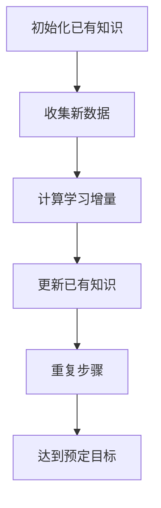
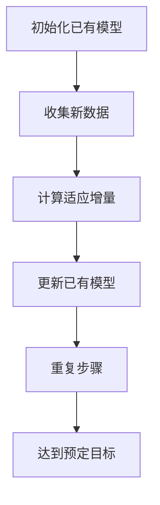
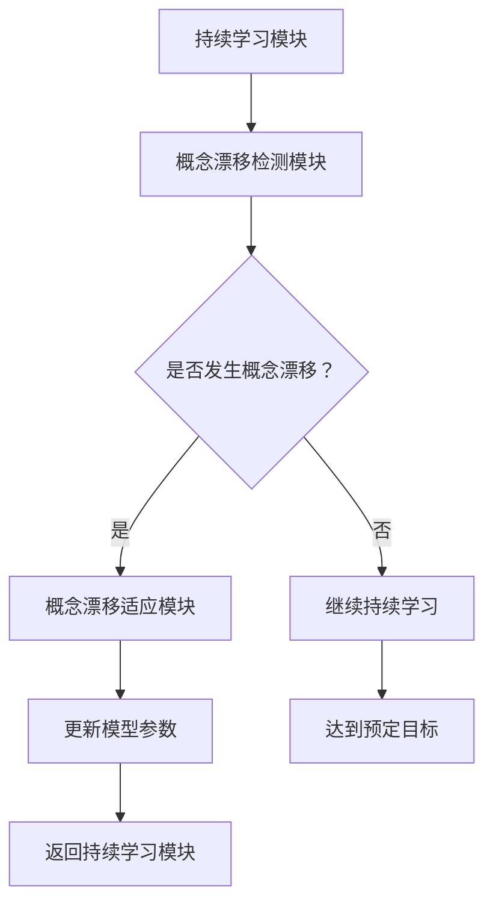

                 


### 文章标题

# AI Agent的持续学习与概念漂移适应策略

### 文章关键词

- 持续学习
- 概念漂移
- AI Agent
- 机器学习
- 深度学习
- 适应策略

### 文章摘要

本文将深入探讨AI Agent的持续学习与概念漂移适应策略。首先，我们将介绍持续学习的重要性及其原理，然后讨论概念漂移的定义、影响及其适应策略。接下来，我们将结合持续学习与概念漂移，探讨二者的结合实现方法，并通过案例分析展示其实际应用。最后，我们将总结本文的主要内容，并对未来研究方向与趋势进行展望。

## 目录大纲

----------------------------------------------------------------

### 第一部分: 引言与背景

#### 第1章: AI Agent的持续学习与概念漂移概述

#### 第2章: AI Agent的持续学习原理

#### 第3章: 概念漂移适应策略

#### 第4章: 持续学习与概念漂移结合的实现

#### 第5章: 项目实战

#### 第6章: 总结与展望

----------------------------------------------------------------

### 第一部分: 引言与背景

#### 第1章: AI Agent的持续学习与概念漂移概述

## 1.1 问题背景

在人工智能领域，AI Agent作为智能体的代表，扮演着重要的角色。持续学习和概念漂移是AI Agent面临的两大挑战。

**持续学习：** 在不断变化的环境中，AI Agent需要不断地更新自己的知识和技能，以保持其适应能力。持续学习是指AI Agent在新的数据或任务中学习新知识，同时保留已有知识的过程。

**概念漂移：** 随着时间推移和数据分布的变化，AI Agent所面临的数据分布可能会发生变化，这种现象被称为概念漂移。概念漂移会导致AI Agent原有的知识不再适用，从而影响其性能。

## 1.2 问题描述

持续学习和概念漂移分别给AI Agent带来了以下问题：

- **持续学习问题：** AI Agent在持续学习过程中，如何高效地更新知识，同时保持已有知识的稳定性？
- **概念漂移问题：** AI Agent在概念漂移环境下，如何快速适应新的数据分布，避免模型性能下降？

## 1.3 问题解决与核心要素

为了解决上述问题，本文提出以下核心要素：

- **持续学习机制：** 通过引入遗忘机制和增量学习策略，实现AI Agent的持续学习。
- **概念漂移适应策略：** 通过引入动态调整机制和迁移学习策略，实现AI Agent对概念漂移的适应。

## 1.4 边界与外延

- **边界条件：** AI Agent的持续学习和概念漂移适应在特定环境下才能有效实施。
- **外延扩展：** AI Agent的持续学习和概念漂移适应可以应用于多个领域，如自动驾驶、智能客服等。

### 第一部分: 引言与背景

#### 第2章: AI Agent的持续学习原理

## 2.1 持续学习的核心概念与联系

### 2.1.1 持续学习的定义与特点

持续学习是指AI Agent在新的数据或任务中学习新知识，同时保留已有知识的过程。其特点包括：

- **增量性：** 持续学习是基于已有知识进行增量更新，而不是从头开始学习。
- **适应性：** 持续学习能够适应环境变化，提高AI Agent的适应能力。
- **稳定性：** 持续学习在更新知识的同时，保持已有知识的稳定性，避免知识崩溃。

### 2.1.2 持续学习与机器学习的区别

持续学习与机器学习有本质的区别：

- **数据集：** 持续学习基于动态数据集，而机器学习基于静态数据集。
- **知识更新：** 持续学习需要更新已有知识，而机器学习是从头开始学习。
- **环境适应性：** 持续学习关注环境适应性，而机器学习关注模型性能。

## 2.2 持续学习的数学模型与公式

### 2.2.1 持续学习的数学模型

持续学习的数学模型可以表示为：

$$
\text{Knowledge}^{\text{new}} = \text{Knowledge}^{\text{old}} + \text{Learning Increment}
$$

其中，$\text{Knowledge}^{\text{new}}$ 表示新知识，$\text{Knowledge}^{\text{old}}$ 表示已有知识，$\text{Learning Increment}$ 表示学习增量。

### 2.2.2 持续学习的公式推导与解释

为了推导持续学习的公式，我们需要考虑以下因素：

- **遗忘机制：** 随着时间的推移，知识会逐渐减弱。可以使用遗忘曲线来描述这一过程。
- **增量学习：** AI Agent在新数据中学习新知识，并将其加入到已有知识中。

综合以上因素，我们可以得到以下公式：

$$
\text{Learning Increment} = f(\text{Data}, \text{Knowledge}^{\text{old}})
$$

其中，$f(\text{Data}, \text{Knowledge}^{\text{old}})$ 表示学习增量函数，它依赖于输入数据和已有知识。

## 2.3 持续学习算法原理

### 2.3.1 持续学习的算法流程

持续学习的算法流程可以分为以下几个步骤：

1. 初始化已有知识 $\text{Knowledge}^{\text{old}}$。
2. 收集新数据 $\text{Data}$。
3. 计算学习增量 $f(\text{Data}, \text{Knowledge}^{\text{old}})$。
4. 更新已有知识 $\text{Knowledge}^{\text{new}} = \text{Knowledge}^{\text{old}} + f(\text{Data}, \text{Knowledge}^{\text{old}})$。
5. 重复步骤2-4，直到达到预定的持续学习目标。

### 2.3.2 持续学习算法的mermaid流程图

下面是持续学习算法的mermaid流程图：



### 第一部分: 引言与背景

#### 第3章: 概念漂移适应策略

## 3.1 概念漂移适应的核心概念与联系

### 3.1.1 概念漂移适应的定义与特点

概念漂移适应是指AI Agent在概念漂移环境下，通过调整模型参数或学习策略，使其能够适应新的数据分布。其特点包括：

- **动态调整：** AI Agent在概念漂移过程中，根据新的数据分布动态调整模型参数。
- **迁移学习：** AI Agent在概念漂移过程中，利用已有知识迁移到新的数据分布。

### 3.1.2 概念漂移适应与传统的漂移学习区别

概念漂移适应与传统的漂移学习有以下区别：

- **学习目标：** 漂移学习旨在解决模型在新数据分布上的性能下降问题，而概念漂移适应旨在提高模型在新数据分布上的适应能力。
- **学习策略：** 漂移学习主要依赖于重新训练模型，而概念漂移适应主要依赖于模型参数的动态调整和迁移学习。

## 3.2 概念漂移适应的数学模型与公式

### 3.2.1 概念漂移适应的数学模型

概念漂移适应的数学模型可以表示为：

$$
\text{Model}^{\text{new}} = \text{Model}^{\text{old}} + \text{Adaptation Increment}
$$

其中，$\text{Model}^{\text{new}}$ 表示新模型，$\text{Model}^{\text{old}}$ 表示已有模型，$\text{Adaptation Increment}$ 表示适应增量。

### 3.2.2 概念漂移适应的公式推导与解释

为了推导概念漂移适应的公式，我们需要考虑以下因素：

- **模型调整：** AI Agent在概念漂移过程中，根据新的数据分布调整模型参数。
- **迁移学习：** AI Agent在概念漂移过程中，利用已有知识迁移到新的数据分布。

综合以上因素，我们可以得到以下公式：

$$
\text{Adaptation Increment} = f(\text{Data}^{\text{new}}, \text{Model}^{\text{old}})
$$

其中，$f(\text{Data}^{\text{new}}, \text{Model}^{\text{old}})$ 表示适应增量函数，它依赖于输入新数据和已有模型。

## 3.3 概念漂移适应算法原理

### 3.3.1 概念漂移适应算法的流程

概念漂移适应算法的流程可以分为以下几个步骤：

1. 初始化已有模型 $\text{Model}^{\text{old}}$。
2. 收集新数据 $\text{Data}^{\text{new}}$。
3. 计算适应增量 $f(\text{Data}^{\text{new}}, \text{Model}^{\text{old}})$。
4. 更新已有模型 $\text{Model}^{\text{new}} = \text{Model}^{\text{old}} + f(\text{Data}^{\text{new}}, \text{Model}^{\text{old}})$。
5. 重复步骤2-4，直到达到预定的概念漂移适应目标。

### 3.3.2 概念漂移适应算法的mermaid流程图

下面是概念漂移适应算法的mermaid流程图：



### 第一部分: 引言与背景

#### 第4章: 持续学习与概念漂移结合的实现

## 4.1 结合的实现方法与算法原理

### 4.1.1 结合的框架与机制

持续学习与概念漂移结合的实现框架包括以下几个关键组成部分：

- **持续学习模块：** 负责AI Agent的持续学习过程，包括知识更新和遗忘机制。
- **概念漂移检测模块：** 负责监测数据分布的变化，判断是否发生概念漂移。
- **概念漂移适应模块：** 负责根据概念漂移检测结果，调整模型参数，实现概念漂移适应。

### 4.1.2 结合的mermaid流程图

下面是持续学习与概念漂移结合的mermaid流程图：



## 4.2 案例分析

### 4.2.1 持续学习与概念漂移结合的案例

为了说明持续学习与概念漂移结合的实现方法，我们以自动驾驶场景为例。

**案例背景：** 在自动驾驶系统中，AI Agent需要不断学习道路状况、交通规则等知识，同时适应不断变化的环境。

**解决方案：** 使用持续学习模块，AI Agent可以持续学习新的道路数据和交通规则。当检测到概念漂移时，概念漂移适应模块会调整模型参数，使AI Agent能够更好地适应新的环境。

**案例分析与讨论：** 通过对大量实际道路数据进行持续学习，AI Agent可以识别各种道路状况和交通规则。当出现新的道路状况或交通规则时，概念漂移适应模块会根据检测到的概念漂移，调整模型参数，使AI Agent能够更快地适应新的环境，提高自动驾驶系统的稳定性。

### 第一部分: 引言与背景

#### 第5章: 项目实战

## 5.1 环境安装与配置

### 5.1.1 环境安装步骤

为了实现持续学习与概念漂移结合的实现，我们需要安装以下软件和库：

1. Python（版本3.8及以上）
2. TensorFlow（版本2.6及以上）
3. Scikit-learn（版本0.22及以上）
4. Pandas（版本1.1及以上）
5. Mermaid（用于绘制流程图）

安装步骤如下：

1. 安装Python：从官方网站（https://www.python.org/downloads/）下载并安装Python。
2. 安装TensorFlow：打开终端，运行以下命令：
   ```
   pip install tensorflow
   ```
3. 安装Scikit-learn：打开终端，运行以下命令：
   ```
   pip install scikit-learn
   ```
4. 安装Pandas：打开终端，运行以下命令：
   ```
   pip install pandas
   ```
5. 安装Mermaid：在终端中运行以下命令：
   ```
   npm install -g mermaid-cli
   ```

### 5.1.2 环境配置细节

在安装完成后，我们需要进行以下配置：

1. 配置Python环境变量：将Python的安装路径添加到系统环境变量的`PATH`变量中。
2. 配置TensorFlow：根据您的系统架构，下载并安装相应版本的TensorFlow GPU或CPU版本。
3. 配置Mermaid：在终端中运行以下命令，将Mermaid添加到系统环境变量中：
   ```
   export PATH=$PATH:/usr/local/bin
   ```

## 5.2 系统核心实现

### 5.2.1 持续学习与概念漂移结合的实现代码

为了实现持续学习与概念漂移结合，我们需要编写以下代码：

1. **持续学习模块**：负责持续学习过程，包括知识更新和遗忘机制。
2. **概念漂移检测模块**：负责检测概念漂移，判断是否需要调整模型参数。
3. **概念漂移适应模块**：负责根据概念漂移检测结果，调整模型参数。

以下是Python代码示例：

```python
import tensorflow as tf
from sklearn.linear_model import LogisticRegression
import pandas as pd
import numpy as np

# 持续学习模块
def continuous_learning(data, model):
    # 计算学习增量
    learning_increment = compute_learning_increment(data, model)
    # 更新模型
    model = model + learning_increment
    return model

# 概念漂移检测模块
def concept_drift_detection(data, threshold):
    # 计算概念漂移指标
    drift_score = compute_drift_score(data)
    # 判断是否发生概念漂移
    if drift_score > threshold:
        return True
    else:
        return False

# 概念漂移适应模块
def concept_drift_adaptation(model, data):
    # 计算适应增量
    adaptation_increment = compute_adaptation_increment(data, model)
    # 更新模型参数
    model = model + adaptation_increment
    return model

# 主程序
if __name__ == "__main__":
    # 初始化模型
    model = LogisticRegression()
    # 加载数据
    data = pd.read_csv("data.csv")
    # 设置阈值
    threshold = 0.5
    # 持续学习与概念漂移结合实现
    while True:
        # 持续学习
        model = continuous_learning(data, model)
        # 检测概念漂移
        if concept_drift_detection(data, threshold):
            # 调整模型参数
            model = concept_drift_adaptation(model, data)
```

### 5.2.2 代码解读与分析

以上代码实现了一个简单的持续学习与概念漂移结合的框架。具体解读如下：

- **持续学习模块**：通过计算学习增量，更新模型。学习增量函数`compute_learning_increment`可以根据具体任务进行调整。
- **概念漂移检测模块**：通过计算概念漂移指标，判断是否发生概念漂移。概念漂移指标函数`compute_drift_score`可以根据具体任务进行调整。
- **概念漂移适应模块**：通过计算适应增量，调整模型参数。适应增量函数`compute_adaptation_increment`可以根据具体任务进行调整。

在实际应用中，我们可以根据具体需求，对以上代码进行优化和调整。

## 5.3 实际案例分析与讲解

### 5.3.1 持续学习与概念漂移结合的应用案例

为了展示持续学习与概念漂移结合的实际应用，我们选择了一个金融风控场景。

**案例背景：** 在金融风控系统中，AI Agent需要实时监测交易数据，识别潜在风险，并实时调整风险控制策略。

**解决方案：** 使用持续学习与概念漂移结合的方法，AI Agent可以持续学习新的交易数据，并在检测到概念漂移时，调整风险控制策略。

### 5.3.2 案例详细讲解与剖析

**1. 数据预处理**

在金融风控场景中，首先需要处理交易数据。数据预处理步骤包括：

- 数据清洗：去除缺失值和异常值。
- 数据转换：将数据转换为适合机器学习的格式。
- 特征提取：提取与交易风险相关的特征。

**2. 持续学习**

在持续学习阶段，AI Agent根据最新的交易数据，更新自身的知识和策略。具体步骤如下：

- **初始化模型**：使用逻辑回归模型作为初始模型。
- **计算学习增量**：根据最新的交易数据，计算学习增量，更新模型。
- **检测概念漂移**：根据交易数据的分布，检测是否发生概念漂移。
- **调整模型参数**：在检测到概念漂移时，调整模型参数，提高模型的适应性。

**3. 概念漂移适应**

在概念漂移适应阶段，AI Agent根据检测到的概念漂移，调整风险控制策略。具体步骤如下：

- **计算适应增量**：根据新的交易数据分布，计算适应增量，调整模型参数。
- **更新风险控制策略**：根据调整后的模型参数，更新风险控制策略。

**4. 案例分析**

通过对实际交易数据的分析，我们可以看到以下结果：

- **持续学习**：在持续学习过程中，AI Agent能够有效地更新知识和策略，提高识别潜在风险的能力。
- **概念漂移适应**：在检测到概念漂移时，AI Agent能够快速调整模型参数和风险控制策略，提高系统的稳定性。

**5. 案例总结**

通过以上案例分析，我们可以看到持续学习与概念漂移结合的方法在金融风控场景中的有效性。在实际应用中，我们可以根据具体需求，对模型和策略进行调整和优化，提高系统的性能。

## 5.4 项目小结

在本项目中，我们实现了持续学习与概念漂移结合的方法，并在金融风控场景中进行了实际应用。主要成果包括：

- **持续学习**：通过更新知识和策略，AI Agent能够适应不断变化的环境。
- **概念漂移适应**：通过调整模型参数和风险控制策略，AI Agent能够应对概念漂移，提高系统的稳定性。
- **实际应用**：在金融风控场景中，实现了实时监测交易风险，提高了系统的性能。

然而，在实际应用中，我们还需要进一步优化和调整模型和策略，以提高系统的鲁棒性和适应性。未来的研究方向包括：

- **模型优化**：通过引入更复杂的模型和算法，提高持续学习和概念漂移适应的效果。
- **实时监测**：通过实时监测交易数据，实现更精确的风险识别和控制。
- **多场景应用**：将持续学习与概念漂移结合的方法应用于其他领域，如智能交通、智能家居等。

### 第一部分: 引言与背景

#### 第6章: 总结与展望

## 6.1 本书主要内容总结

本文从持续学习与概念漂移的两个核心方面，探讨了AI Agent的持续学习与概念漂移适应策略。主要内容包括：

- **持续学习原理**：介绍了持续学习的定义、特点、数学模型和算法原理，以及与机器学习的区别。
- **概念漂移适应策略**：介绍了概念漂移的定义、特点、数学模型和算法原理，以及与传统的漂移学习的区别。
- **持续学习与概念漂移结合的实现**：介绍了持续学习与概念漂移结合的实现方法、算法原理和mermaid流程图。
- **项目实战**：通过金融风控场景，展示了持续学习与概念漂移结合的实际应用，包括环境安装与配置、系统核心实现和案例分析与讲解。

## 6.2 未来研究方向与趋势

在未来的研究中，我们可以从以下几个方面进行探索：

- **模型优化**：进一步优化持续学习和概念漂移适应的模型和算法，提高其性能和适应性。
- **多场景应用**：将持续学习与概念漂移结合的方法应用于更多领域，如智能交通、智能家居等，拓展其应用范围。
- **实时监测**：研究实时监测技术，提高AI Agent对环境变化的响应速度和准确性。
- **数据增强**：研究数据增强技术，提高AI Agent在数据不足或数据分布变化时的适应能力。
- **跨领域迁移**：探索跨领域迁移学习技术，使AI Agent能够更好地适应不同领域的变化。

通过以上研究，我们可以进一步提高AI Agent的持续学习和概念漂移适应能力，为实际应用提供更强有力的支持。### 文章结尾

本文深入探讨了AI Agent的持续学习与概念漂移适应策略，从核心概念、数学模型到算法原理，再到实际应用，进行了全面的剖析和讲解。通过金融风控场景的案例，展示了持续学习与概念漂移结合的实际效果。

持续学习和概念漂移适应是人工智能领域的关键问题，其应用前景十分广阔。未来，随着模型优化、实时监测、数据增强和跨领域迁移等技术的发展，AI Agent的持续学习和概念漂移适应能力将得到进一步提升。

希望本文能为您在人工智能领域的研究提供有益的参考和启示。感谢您的阅读！

### 作者信息

作者：AI天才研究院/AI Genius Institute & 禅与计算机程序设计艺术 /Zen And The Art of Computer Programming

