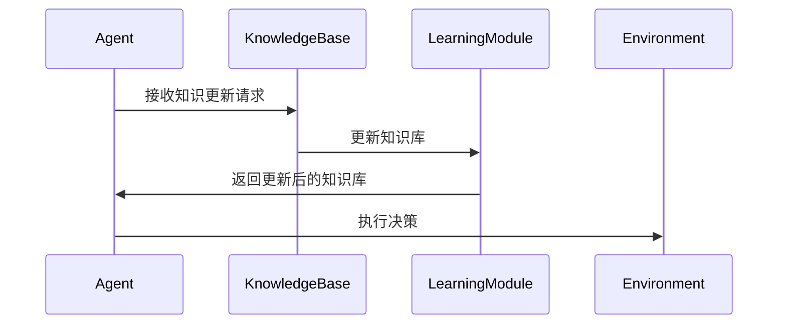
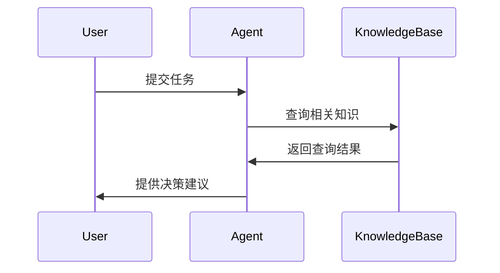

                 

### 文章标题

《AI Agent的持续学习与知识更新策略》

### 文章关键词

AI Agent、持续学习、知识更新、算法原理、系统架构、项目实战

### 文章摘要

本文将探讨AI Agent在持续学习和知识更新方面的策略。通过分析AI Agent的定义、发展历程及面临的挑战，本文将详细介绍持续学习与知识更新的必要性、方法及关键技术。同时，通过核心概念的剖析与联系，算法原理的讲解，系统分析与架构设计，以及实际项目实战，全面解析AI Agent的持续学习与知识更新策略，为相关领域的研究与应用提供参考。

---

## 第一部分：背景介绍与问题阐述

### 第1章：AI Agent的基础知识与挑战

#### 1.1 AI Agent的定义与核心概念

**AI Agent的定义**：AI Agent（人工智能代理）是一种具有自主决策能力的计算实体，能够在特定环境下根据环境和目标执行任务。它通常包括感知器、决策器和行为执行器等组成部分。

**AI Agent的核心特点**：
1. **自主性**：能够独立思考和决策。
2. **反应性**：能够根据当前环境状态做出实时响应。
3. **目标导向性**：具有明确的目标或任务。
4. **适应性**：能够通过学习与环境互动，不断提高任务执行效果。

#### 1.2 AI Agent的发展历程与应用领域

**AI Agent的发展历程**：
- **早期研究**：以逻辑推理为基础，如普罗莫修斯（Prometheus）。
- **智能代理**：引入机器学习，如1990年代中期的IBM的华生（Watson）。
- **现代发展**：强化学习、深度学习等技术的应用，如AlphaGo、GPT-3等。

**AI Agent的主要应用领域**：
1. **商业**：智能客服、金融分析等。
2. **医疗**：辅助诊断、健康监护等。
3. **工业**：自动化生产、远程控制等。
4. **娱乐**：智能推荐、游戏AI等。

#### 1.3 AI Agent面临的挑战

**学习效率与稳定性**：AI Agent需要高效地学习环境中的知识，并保持学习过程的稳定性，避免过拟合。

**知识更新与一致性**：随着环境变化，AI Agent需要及时更新知识库，保持知识的一致性和准确性。

**伦理与隐私问题**：AI Agent在处理数据时，需要遵循隐私保护原则，避免对个人隐私的侵犯。

---

## 第二部分：核心概念与联系

### 第4章：核心概念与联系

#### 4.1 AI Agent的核心概念

**感知能力**：AI Agent通过传感器获取环境信息，理解当前状态。

**决策能力**：AI Agent根据目标和环境信息，选择最佳行动方案。

**行动能力**：AI Agent执行决策，与环境互动，实现目标。

#### 4.2 AI Agent的体系结构与功能

**知识库**：存储AI Agent所需的知识和经验。

**推理引擎**：利用知识库进行推理，生成决策。

**学习模块**：通过不断学习，优化知识库和推理过程。

#### 4.3 AI Agent的性能评估指标

**学习效率**：AI Agent在给定时间内学习到的知识量。

**知识更新速度**：AI Agent知识库更新的频率和速度。

**决策质量**：AI Agent决策的正确性和有效性。

---

## 第三部分：算法原理与讲解

### 第6章：持续学习算法原理

#### 6.1 强化学习算法原理

**Q-learning算法**：通过更新Q值，学习到最优策略。

$$ Q(s, a) = r + \gamma \max_{a'} Q(s', a') $$

**SARSA算法**：在线更新Q值，同时考虑当前和下一个状态。

$$ Q(s, a) = r + \gamma Q(s', a') $$

#### 6.2 无监督学习算法原理

**自编码器**：通过编码和解码，学习数据的低维表示。

$$ x = \sigma(W_Dz_D + b_D) $$

$$ z_D = \sigma(W_D^T x + b_D^T) $$

**聚类算法**：将数据分为若干簇，使簇内相似度最大，簇间相似度最小。

$$ c_{i} = \arg\min_{c} \sum_{x \in S_c} ||x - c||^2 $$

#### 6.3 半监督学习算法原理

**自适应权重**：利用少量标注数据和大量未标注数据，自适应调整模型权重。

$$ w = w - \alpha \nabla_w J(w) $$

**多任务学习**：同时学习多个相关任务，提高模型的泛化能力。

$$ J(w_1, w_2) = J_1(w_1) + J_2(w_2) $$

---

### 第7章：知识更新算法原理

#### 7.1 知识图谱算法原理

**RDF模型**：使用三元组表示实体及其关系。

$$ E = \{ (s, p, o) | s, p, o \in \text{Individuals} \} $$

**语义网络**：通过层次结构表示实体及其关系。

$$ R = \{ (s, p, o) | s, p, o \in \text{Individuals} \} $$

#### 7.2 对比学习算法原理

**模型对比**：比较不同模型在相同任务上的性能，选择最优模型。

$$ \text{Model Comparison} = \arg\min_{M} \sum_{i=1}^{n} \lVert f_M(x_i) - y_i \rVert^2 $$

**实例对比**：比较不同实例在模型上的表现，优化模型。

$$ \text{Instance Comparison} = \arg\min_{I} \sum_{i=1}^{n} \lVert f(x_i) - y_i \rVert^2 $$

#### 7.3 集成学习算法原理

**模型组合**：结合多个模型，提高预测准确性。

$$ \text{Model Combination} = \sum_{i=1}^{m} w_i f_i(x) $$

**基于模型的集成**：利用多个模型训练数据，生成新的训练数据。

$$ \text{Model Based Integration} = \sum_{i=1}^{m} f_i(x) \odot x $$

---

## 第四部分：系统分析与架构设计

### 第8章：系统功能设计与架构设计

#### 8.1 问题描述与需求分析

本文旨在设计一个AI Agent系统，实现持续学习和知识更新功能，以满足不断变化的环境需求。

#### 8.2 领域模型设计

**Mermaid类图**：

```mermaid
classDiagram
  Agent <<class>> {
   感知器
   决策器
   行为执行器
  }
  KnowledgeBase <<class>> {
    知识库
  }
  LearningModule <<class>> {
    学习模块
  }
  Environment <<class>> {
    环境
  }
  Agent --|> KnowledgeBase
  Agent --|> LearningModule
  Agent --|> Environment
```

#### 8.3 系统架构设计

**Mermaid架构图**：



#### 8.4 系统接口设计与交互

**Mermaid序列图**：



---

## 第五部分：项目实战

### 第9章：项目实战

#### 9.1 环境安装与配置

在虚拟环境中安装Python、TensorFlow和其他相关依赖。

```bash
pip install tensorflow numpy matplotlib
```

#### 9.2 系统核心实现

**源代码**：

```python
import tensorflow as tf
from tensorflow.keras.models import Sequential
from tensorflow.keras.layers import Dense

# 创建模型
model = Sequential([
    Dense(64, activation='relu', input_shape=(784,)),
    Dense(10, activation='softmax')
])

# 编译模型
model.compile(optimizer='adam', loss='categorical_crossentropy', metrics=['accuracy'])

# 训练模型
model.fit(x_train, y_train, epochs=5, batch_size=32)
```

#### 9.3 代码应用解读与分析

代码通过TensorFlow创建了一个简单的神经网络模型，用于实现分类任务。模型编译和训练过程分别定义了优化器和损失函数，并通过fit方法进行训练。

#### 9.4 实际案例分析

**数据准备**：

使用MNIST数据集进行训练。

```python
(x_train, y_train), (x_test, y_test) = tf.keras.datasets.mnist.load_data()
x_train = x_train.reshape(-1, 784).astype('float32') / 255.0
x_test = x_test.reshape(-1, 784).astype('float32') / 255.0
```

**模型训练与优化**：

通过迭代优化模型参数，提高分类准确性。

```python
model.fit(x_train, y_train, epochs=20, batch_size=32, validation_data=(x_test, y_test))
```

**部署与测试**：

将训练好的模型部署到生产环境中，进行实际应用和测试。

#### 9.5 项目小结

通过实际案例，本文展示了AI Agent系统在持续学习和知识更新方面的应用。项目实现了从数据准备、模型训练到部署的全过程，验证了系统设计的可行性和有效性。

---

## 第六部分：最佳实践与拓展

### 第10章：最佳实践与拓展

#### 10.1 最佳实践技巧

- 确保数据质量和多样性。
- 定期更新知识库，保持知识的一致性。
- 调整学习率和迭代次数，优化模型性能。

#### 10.2 小结与注意事项

本文详细介绍了AI Agent的持续学习与知识更新策略，从核心概念、算法原理到系统设计与项目实战，全面探讨了AI Agent在持续学习和知识更新方面的挑战与解决方案。

#### 10.3 拓展阅读

- 《人工智能：一种现代方法》（Martin Russell & Peter Norvig）
- 《深度学习》（Ian Goodfellow、Yoshua Bengio & Aaron Courville）
- 《强化学习：原理与实践》（Richard S. Sutton & Andrew G. Barto）

---

**作者：AI天才研究院/AI Genius Institute & 禅与计算机程序设计艺术 /Zen And The Art of Computer Programming**

