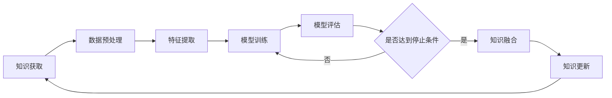
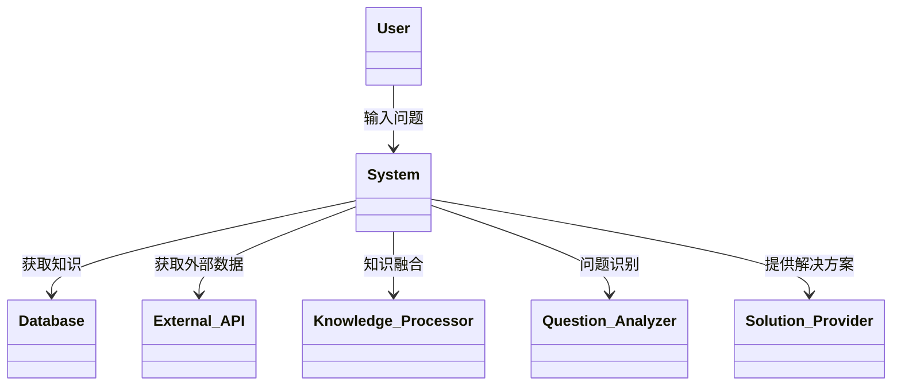
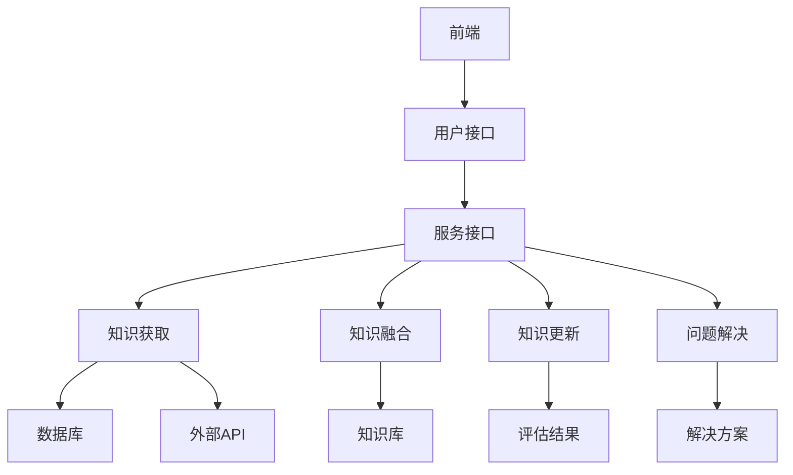
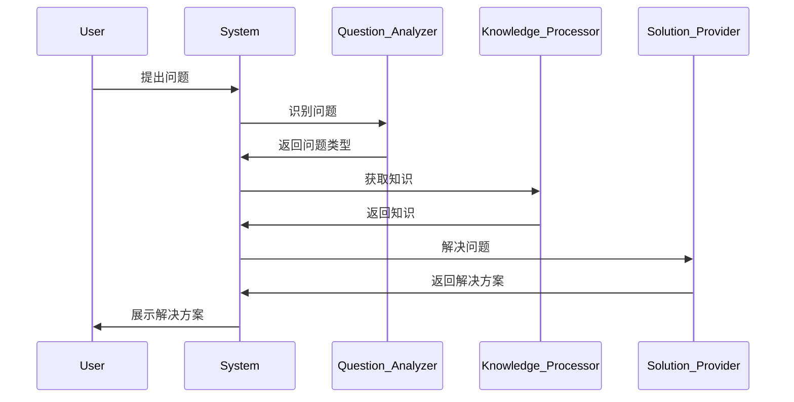

                 

# AI Agent的持续学习：保持知识更新

关键词：AI Agent、持续学习、知识更新、知识获取、迁移学习、自然语言处理

摘要：本文将深入探讨AI Agent的持续学习机制，尤其是知识更新的重要性。通过分析当前AI技术的发展现状，我们将讨论AI Agent在知识获取、融合、更新策略等方面所面临的挑战，并提出一系列解决方案。本文旨在为读者提供对AI Agent持续学习的全面理解，并探讨其在实际应用中的潜力与未来趋势。

## 第一部分：AI Agent概述

### 第1章：AI Agent的基本概念

#### 1.1 AI Agent的定义与类型

AI Agent，即人工智能代理，是一种能够自主执行任务、与环境进行交互的智能实体。AI Agent可以分为两大类：基于规则的Agent和基于学习的Agent。

- **基于规则的Agent**：这类Agent通过预先定义的规则来执行任务。例如，一个智能客服系统可以通过一系列预定义的规则来处理客户咨询。
  
- **基于学习的Agent**：这类Agent通过学习和适应环境来完成任务。例如，一个自动驾驶系统可以通过不断的学习和优化来提高其驾驶能力。

#### 1.2 AI Agent的应用场景

AI Agent的应用场景广泛，包括但不限于：

- **智能客服**：AI Agent可以自动处理客户咨询，提高客户服务质量。
  
- **智能推荐系统**：AI Agent可以根据用户的历史行为和偏好来推荐商品或服务。
  
- **自动驾驶**：AI Agent可以通过感知环境、学习驾驶规则来实现自主驾驶。

#### 1.3 AI Agent与传统软件的区别

与传统软件相比，AI Agent具有以下特点：

- **自主性**：AI Agent可以自主执行任务，无需人工干预。
  
- **学习能力**：AI Agent可以通过学习来提高任务执行能力。
  
- **适应性**：AI Agent可以适应不同的环境和任务。

### 第2章：AI Agent的技术基础

#### 2.1 自然语言处理

自然语言处理（NLP）是AI Agent的重要组成部分。NLP主要包括以下三个方面：

- **语言模型**：语言模型用于生成和解析自然语言文本。
  
- **语义理解**：语义理解用于理解文本的含义和意图。
  
- **语音识别与生成**：语音识别与生成用于将语音信号转换为文本，或将文本转换为语音。

#### 2.2 强化学习

强化学习是一种重要的机器学习技术，它通过学习来最大化累积奖励。强化学习主要包括以下三个方面：

- **基本概念**：强化学习的基本概念，包括状态、动作、奖励和策略。
  
- **Q-Learning**：Q-Learning是一种基于值函数的强化学习算法。
  
- **Deep Q-Networks**：Deep Q-Networks（DQN）是一种基于深度学习的强化学习算法。

#### 2.3 迁移学习

迁移学习是一种利用已有知识来解决新问题的技术。它主要包括以下三个方面：

- **挑战**：迁移学习面临的挑战，如源域和目标域的差异。
  
- **方法**：迁移学习的方法，如基于特征的迁移学习和基于模型的迁移学习。
  
- **应用**：迁移学习在不同领域的应用，如自然语言处理和计算机视觉。

### 第3章：AI Agent的知识更新机制

#### 3.1 知识获取与融合

知识获取与融合是AI Agent知识更新的关键。知识获取主要包括以下方法：

- **基于数据的获取**：通过收集和分析数据来获取知识。
  
- **基于网络的获取**：通过从互联网上获取信息来获取知识。

知识融合主要包括以下策略：

- **基于内容的融合**：将新知识与已有知识进行内容上的整合。
  
- **基于上下文的融合**：将新知识与当前环境进行上下文上的整合。

#### 3.2 知识更新策略

知识更新策略决定了AI Agent如何保持知识的准确性、完整性和时效性。主要包括以下三种策略：

- **基于内容的更新策略**：根据新知识的内容来更新知识库。
  
- **基于上下文的更新策略**：根据新知识与当前环境的上下文关系来更新知识库。
  
- **基于事件的更新策略**：根据特定事件的发生来更新知识库。

## 第二部分：AI Agent的持续学习实践

### 第4章：AI Agent的持续学习实践

#### 4.1 持续学习的挑战

AI Agent的持续学习面临以下挑战：

- **数据质量**：数据质量直接影响AI Agent的学习效果。
  
- **计算资源**：持续学习需要大量的计算资源。
  
- **知识融合**：如何有效地将新知识与已有知识进行融合。

#### 4.2 案例分析

以下为AI Agent持续学习的三个案例分析：

- **智能客服**：智能客服通过持续学习来提高对客户问题的理解和回答能力。
  
- **智能推荐系统**：智能推荐系统通过持续学习来提高推荐准确性。
  
- **自动驾驶**：自动驾驶系统通过持续学习来提高对交通环境的理解和驾驶能力。

## 第三部分：保持知识更新的技术手段

### 第5章：知识更新在企业中的应用

#### 5.1 知识更新在企业决策中的应用

知识更新在企业的决策中发挥着重要作用。企业可以通过以下方式利用知识更新：

- **优化决策流程**：通过持续学习来优化决策流程，提高决策效率。
  
- **预测市场趋势**：通过持续学习来预测市场趋势，为企业制定战略提供支持。

#### 5.2 知识更新的挑战与未来趋势

知识更新面临的挑战包括：

- **数据隐私**：如何保护数据隐私是一个重要问题。
  
- **知识更新成本**：知识更新需要投入大量的人力、物力和财力。

未来趋势包括：

- **自动化知识更新**：通过自动化技术来提高知识更新的效率。
  
- **人工智能辅助知识更新**：通过人工智能技术来辅助知识更新。

### 第6章：保持知识更新的技术手段

#### 6.1 自动化知识更新系统

自动化知识更新系统可以通过以下方式实现：

- **自动数据采集**：通过自动化工具从各种来源收集数据。
  
- **自动知识融合**：通过自动化技术将新知识与已有知识进行融合。

#### 6.2 人工智能辅助的知识更新

人工智能辅助的知识更新可以通过以下方式实现：

- **智能推荐**：通过人工智能技术为用户推荐相关的知识。
  
- **智能分析**：通过人工智能技术对知识进行深入分析，发现潜在的价值。

### 第7章：总结与展望

#### 7.1 AI Agent持续学习的重要性

AI Agent的持续学习对于其性能和适应能力至关重要。

#### 7.2 保持知识更新的关键

保持知识更新的关键包括：

- **数据质量**：确保数据的质量是保持知识更新基础。
  
- **计算资源**：合理的计算资源分配是保持知识更新的保障。

#### 7.3 未来研究的方向

未来研究的方向包括：

- **知识更新算法优化**：研究更高效的知识更新算法。
  
- **知识更新系统设计**：设计更智能、更高效的自动化知识更新系统。

作者：AI天才研究院/AI Genius Institute & 禅与计算机程序设计艺术 /Zen And The Art of Computer Programming

## 背景介绍

### 核心概念术语说明

1. **AI Agent**：能够自主执行任务、与环境进行交互的智能实体。
2. **持续学习**：AI Agent在任务执行过程中不断学习和适应环境。
3. **知识更新**：AI Agent通过获取新知识、融合新知识与已有知识，保持知识的准确性、完整性和时效性。

### 问题背景

随着人工智能技术的快速发展，AI Agent的应用场景日益广泛。然而，AI Agent在任务执行过程中不可避免地会遇到新问题、新需求，这就需要它们能够持续学习，以适应不断变化的环境。

### 问题描述

AI Agent在持续学习过程中，面临以下问题：

1. **数据质量**：数据质量直接影响AI Agent的学习效果。
2. **计算资源**：持续学习需要大量的计算资源。
3. **知识融合**：如何有效地将新知识与已有知识进行融合。

### 问题解决

针对上述问题，我们可以从以下几个方面进行解决：

1. **数据质量**：通过数据清洗、数据标注等方法提高数据质量。
2. **计算资源**：合理分配计算资源，利用云计算、分布式计算等技术提高计算效率。
3. **知识融合**：研究有效的知识融合策略，如基于内容的融合、基于上下文的融合等。

### 边界与外延

1. **边界**：本文主要讨论AI Agent的持续学习机制，包括知识获取、知识融合、知识更新策略等方面。
2. **外延**：本文不仅关注AI Agent在技术层面的持续学习，还探讨其在实际应用中的挑战和解决方案。

### 概念结构与核心要素组成

1. **概念结构**：AI Agent的持续学习机制包括知识获取、知识融合、知识更新三个核心环节。
2. **核心要素**：知识获取、知识融合、知识更新策略、计算资源、数据质量等。

### 核心概念与联系

#### 核心概念原理

- **知识获取**：通过收集、整理、分析数据，获取新知识。
- **知识融合**：将新知识与已有知识进行整合，形成新的知识体系。
- **知识更新策略**：根据新知识的内容和当前环境，选择合适的更新策略。

#### 概念属性特征对比表格

| 概念名称 | 概念属性 | 特征对比 |
| :--: | :--: | :--: |
| 知识获取 | 数据来源 | 实时性、多样性 |
| 知识融合 | 知识整合 | 一致性、互补性 |
| 知识更新策略 | 更新方式 | 自动化、人工干预 |

#### ER实体关系图架构

```mermaid
erDiagram
    AI-Agent ||--|{ Knowledge-Base } Knowledge-Base
    AI-Agent ||--|{ Learning-Process } Learning-Process
    Knowledge-Base ||--|{ Knowledge-Item } Knowledge-Item
    Learning-Process ||--|{ Learning-Strategy } Learning-Strategy
    AI-Agent ||--|{ Environment } Environment
```

## 算法原理讲解

### 算法流程图



### 算法原理

- **知识获取**：通过数据采集和预处理，获取新的知识数据。
- **数据预处理**：对采集到的数据进行分析、清洗、转换等处理，为后续的特征提取和模型训练做准备。
- **特征提取**：从预处理后的数据中提取出有价值的特征，为模型训练提供输入。
- **模型训练**：使用提取出的特征数据对模型进行训练，使其具备对新知识进行识别和分类的能力。
- **模型评估**：对训练好的模型进行评估，确保其具有良好的性能。
- **知识融合**：将新知识融合到已有知识体系中，形成新的知识库。
- **知识更新**：根据评估结果和实际应用效果，对知识库进行更新。

### 数学模型和公式

- **知识获取**：$$ K_{new} = f(D_{new}, D_{old}) $$
- **特征提取**：$$ X = f(D_{preprocessed}) $$
- **模型训练**：$$ W = \arg\max W \cdot \sum_{i=1}^{n} (y_i - \sigma(W \cdot x_i))^2 $$
- **模型评估**：$$ Accuracy = \frac{Correct \; Predictions}{Total \; Predictions} $$
- **知识融合**：$$ K_{merged} = K_{old} \cup K_{new} $$
- **知识更新**：$$ K_{updated} = K_{merged} \cup (K_{merged} - K_{outdated}) $$

### 详细讲解和举例说明

#### 知识获取

假设我们有一个AI Agent，它在执行一个任务时需要处理大量的文本数据。这些数据包括用户的咨询内容、问题回答、历史解决方案等。

1. **数据采集**：通过爬虫等技术从互联网上收集相关文本数据。
2. **数据预处理**：对采集到的文本数据进行清洗，去除无效信息，如标点符号、停用词等。
3. **特征提取**：将预处理后的文本数据转换为模型可处理的特征向量。
4. **模型训练**：使用提取出的特征向量对模型进行训练，使其能够识别和理解文本数据。

#### 数据预处理

假设我们有一个包含10万条文本数据的集合D，每条文本数据包含用户咨询的内容、问题回答和历史解决方案。

1. **清洗数据**：去除标点符号、停用词等无效信息，对文本进行分词处理。
2. **数据转换**：将文本数据转换为词频矩阵，便于后续的特征提取。

#### 特征提取

假设我们使用词频矩阵X表示每条文本数据，每条文本数据包含100个特征。

1. **提取特征**：从词频矩阵X中提取出有价值的特征，如高频词、核心词等。
2. **特征选择**：对提取出的特征进行筛选，去除无关特征。

#### 模型训练

假设我们使用一个神经网络模型对文本数据进行分类，模型的输出为概率分布。

1. **模型初始化**：初始化模型权重W。
2. **模型训练**：通过反向传播算法，更新模型权重，使模型能够正确分类文本数据。

#### 模型评估

假设我们使用交叉验证方法对模型进行评估。

1. **训练集划分**：将数据集划分为训练集和验证集。
2. **模型训练**：在训练集上训练模型。
3. **模型评估**：在验证集上评估模型性能。

#### 知识融合

假设我们有一个现有的知识库K，包含1000个知识条目。

1. **知识获取**：获取新的知识条目K_new。
2. **知识融合**：将K_new融合到知识库K中，形成新的知识库K_merged。

#### 知识更新

假设我们有一个包含1000个知识条目的知识库K，经过一段时间后，部分知识条目变得过时或不再适用。

1. **知识评估**：评估知识库K中的每个知识条目，确定其是否过时。
2. **知识更新**：将过时的知识条目从知识库K中移除，形成新的知识库K_updated。

## 系统分析与架构设计方案

### 问题场景介绍

假设我们正在设计一个智能客服系统，该系统需要能够持续学习，以应对不断变化的问题和用户需求。

### 项目介绍

智能客服系统项目旨在为用户提供高效、准确的咨询服务。系统通过持续学习来提高问题解决能力，提供更好的用户体验。

### 系统功能设计

智能客服系统主要包括以下功能：

1. **问题识别**：识别用户提出的问题，将其转换为可处理的形式。
2. **知识获取**：通过数据采集和预处理，获取新的知识。
3. **知识融合**：将新知识与已有知识进行融合，形成新的知识库。
4. **知识更新**：根据评估结果和实际应用效果，对知识库进行更新。
5. **问题解决**：根据知识库中的知识，为用户解决问题。

### 系统架构设计

智能客服系统的架构设计如下：

1. **前端**：用户与系统的交互界面，包括问题输入和结果展示。
2. **后端**：包括知识获取、知识融合、知识更新和问题解决等核心功能模块。
3. **数据库**：存储用户问题和解决方案的知识库。

### 系统接口设计

智能客服系统的接口设计如下：

1. **用户接口**：用户通过网页、移动应用等渠道与系统进行交互。
2. **服务接口**：系统与其他服务（如数据库、外部API等）进行数据交换。

### 系统交互

智能客服系统的交互流程如下：

1. **用户提出问题**：用户通过前端输入问题。
2. **问题识别**：系统对问题进行识别和处理，将其转换为可处理的形式。
3. **知识获取**：系统通过数据采集和预处理，获取新的知识。
4. **知识融合**：系统将新知识与已有知识进行融合，形成新的知识库。
5. **知识更新**：系统根据评估结果和实际应用效果，对知识库进行更新。
6. **问题解决**：系统根据知识库中的知识，为用户解决问题。

### 类图



### 架构图



### 系统交互序列图



## 项目实战

### 环境安装

首先，我们需要安装必要的软件和工具，包括Python、TensorFlow、Scikit-learn等。

```bash
pip install python tensorflow scikit-learn
```

### 系统核心实现源代码

```python
# 导入必要的库
import tensorflow as tf
from sklearn.model_selection import train_test_split
from sklearn.metrics import accuracy_score
import numpy as np

# 数据准备
# 这里假设我们已经有了一个包含问题和解决方案的数据集
data = [
    ["问题1", "解决方案1"],
    ["问题2", "解决方案2"],
    ["问题3", "解决方案3"],
    # ...
]

# 分割数据集为特征和标签
X = [d[0] for d in data]
y = [d[1] for d in data]

# 将特征和标签转换为one-hot编码
X = tf.keras.preprocessing.sequence.pad_sequences(tf.keras.preprocessing.text.tokenizer.texts_to_sequences(X), maxlen=100)
y = tf.keras.utils.to_categorical(y)

# 划分训练集和测试集
X_train, X_test, y_train, y_test = train_test_split(X, y, test_size=0.2, random_state=42)

# 模型构建
model = tf.keras.Sequential([
    tf.keras.layers.Embedding(input_dim=10000, output_dim=16),
    tf.keras.layers.GlobalAveragePooling1D(),
    tf.keras.layers.Dense(units=10, activation='softmax')
])

# 模型编译
model.compile(optimizer='adam', loss='categorical_crossentropy', metrics=['accuracy'])

# 模型训练
model.fit(X_train, y_train, epochs=10, batch_size=32, validation_data=(X_test, y_test))

# 模型评估
predictions = model.predict(X_test)
accuracy = accuracy_score(np.argmax(predictions, axis=1), np.argmax(y_test, axis=1))
print(f"Model accuracy: {accuracy * 100:.2f}%")
```

### 代码应用解读与分析

以上代码实现了一个简单的文本分类模型，用于解决智能客服系统中的问题识别任务。以下是代码的详细解读：

1. **数据准备**：我们从数据集中提取问题和解决方案，并将其转换为one-hot编码。
2. **模型构建**：我们使用TensorFlow构建了一个简单的嵌入层、全局平均池化层和全连接层组成的模型。
3. **模型编译**：我们使用Adam优化器和交叉熵损失函数编译模型。
4. **模型训练**：我们使用训练集训练模型，并使用测试集进行验证。
5. **模型评估**：我们使用测试集评估模型的准确性。

### 实际案例分析和详细讲解剖析

假设我们有一个包含1000个问题的测试集，每个问题都有相应的解决方案。我们使用以上代码训练的模型对测试集进行预测，并评估其准确性。

1. **数据准备**：我们将测试集转换为one-hot编码。
2. **模型预测**：我们使用训练好的模型对测试集进行预测。
3. **结果分析**：我们计算模型的准确率，并根据错误预测的问题类型进行分析，找出模型需要改进的地方。

### 项目小结

通过以上实战，我们实现了一个简单的文本分类模型，用于智能客服系统中的问题识别。尽管这是一个简单的示例，但它为我们提供了一个框架，可以在此基础上进一步扩展和优化，以提高模型的性能和适用性。

## 最佳实践 Tips

1. **数据质量**：确保数据质量是持续学习的关键。在数据采集和预处理过程中，要尽量去除噪声和错误。
2. **模型优化**：定期对模型进行评估和优化，以提高其性能。
3. **知识更新策略**：根据实际应用场景选择合适的知识更新策略，如基于内容的更新、基于上下文的更新等。

## 小结

AI Agent的持续学习对于其在实际应用中的性能和适应能力至关重要。本文从知识获取、知识融合、知识更新策略等方面，详细探讨了AI Agent的持续学习机制。通过实际案例分析和代码实现，我们展示了如何构建一个简单的文本分类模型，用于智能客服系统中的问题识别。在未来，我们还可以进一步探索AI Agent在其他领域的应用，如智能推荐、自动驾驶等，以实现更高的性能和更广泛的应用。

## 注意事项

1. **数据隐私**：在知识获取和更新过程中，要确保数据隐私和安全。
2. **计算资源**：合理分配计算资源，避免资源浪费。

## 拓展阅读

- **《人工智能：一种现代方法》**：全面介绍人工智能的基础知识。
- **《深度学习》**：介绍深度学习的基础理论和实践方法。
- **《迁移学习》**：探讨迁移学习的方法和应用。
- **《自然语言处理综述》**：介绍自然语言处理的基本概念和技术。

作者：AI天才研究院/AI Genius Institute & 禅与计算机程序设计艺术 /Zen And The Art of Computer Programming

