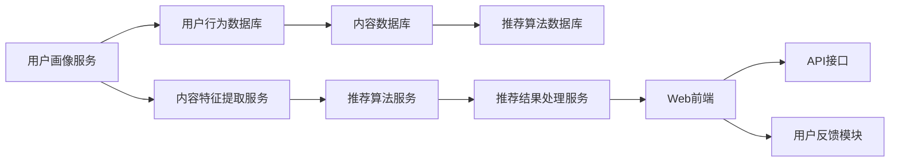
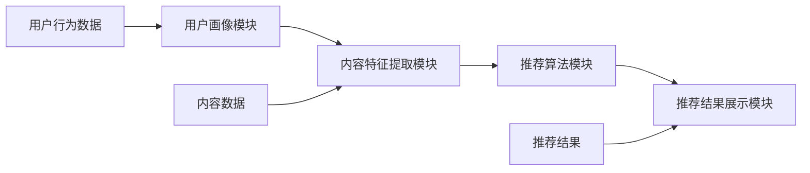

                 

## 第1章：推荐系统概述

### 1.1 推荐系统的概念与发展历程

**关键词**：推荐系统、发展历程、人工智能

**摘要**：
推荐系统是一种信息过滤技术，旨在向用户提供他们可能感兴趣的信息或物品。本章将介绍推荐系统的定义、发展历程以及在人工智能时代的崛起。

#### 推荐系统的定义
推荐系统是一种通过分析用户的历史行为、偏好和兴趣，利用算法技术为用户提供个性化推荐的服务或系统。其核心目标是提升用户体验，提高用户满意度，同时增加平台的价值。

#### 推荐系统的发展历程
推荐系统的发展可以分为三个阶段：
1. **基于内容的推荐**：早期推荐系统主要依赖物品的内容特征，如关键词、标签等，为用户推荐相似的内容。
2. **协同过滤推荐**：随着互联网的普及，用户产生的大量行为数据成为推荐系统的重要资源，协同过滤推荐算法应运而生，通过分析用户之间的相似性来推荐物品。
3. **混合推荐系统**：现代推荐系统趋向于结合多种技术，如深度学习、图神经网络等，以提高推荐效果。

#### 推荐系统在人工智能时代的崛起
随着人工智能技术的发展，推荐系统迎来了新的机遇和挑战。深度学习、自然语言处理（NLP）、图神经网络等技术逐渐应用于推荐系统，使得推荐算法的准确性和个性化程度得到了显著提升。同时，大数据和云计算的普及也为推荐系统的实现提供了强大的支持。

### 1.2 推荐系统的基本组成与工作流程

**关键词**：用户行为数据、物品内容数据、推荐算法、推荐结果呈现

**摘要**：
推荐系统的实现涉及多个环节，包括用户行为数据的收集、物品内容数据的收集、特征提取、推荐算法的选择和推荐结果的呈现。本章将详细介绍推荐系统的基本组成和各环节的工作流程。

#### 用户行为数据收集
用户行为数据包括用户的点击、购买、浏览、搜索等行为。这些数据可以通过平台日志、用户交互记录等方式收集。数据收集的质量和完整性直接影响到推荐系统的效果。

#### 物品内容数据收集
物品内容数据包括物品的属性、标签、描述等。这些数据可以从物品的元数据、用户评论、搜索引擎等渠道获取。内容数据的丰富性和准确性对于基于内容的推荐算法至关重要。

#### 用户行为特征提取
用户行为特征提取是将原始的用户行为数据转换为推荐算法可以处理的形式。特征提取可以采用统计方法、机器学习方法等，如用户行为的频次、平均时长、访问路径等。

#### 物品内容特征提取
物品内容特征提取是将原始的物品内容数据转换为推荐算法可以处理的形式。特征提取可以采用文本挖掘、图像处理等技术，如关键词提取、文本分类、图像识别等。

#### 推荐算法选择
推荐算法的选择取决于推荐系统的目标和数据特点。常见的推荐算法有基于内容的推荐、协同过滤推荐、混合推荐等。每种算法都有其优缺点和适用场景。

#### 推荐结果呈现
推荐结果呈现是将推荐算法输出的结果以用户友好的方式展示给用户。推荐结果可以采用列表、卡片、网格等形式，同时提供交互功能，如点赞、收藏、评论等。

## 第2章：用户行为分析与建模

### 2.1 用户行为数据收集

**关键词**：用户行为数据、数据收集、平台日志、用户交互记录

**摘要**：
用户行为数据是推荐系统构建的重要基础。本章将介绍用户行为数据的定义、重要性以及数据收集的方法和步骤。

#### 用户行为数据的定义
用户行为数据是指用户在使用某一平台或服务时所产生的一系列操作记录。这些操作可能包括点击、购买、浏览、搜索、评论等。

#### 用户行为数据的重要性
用户行为数据对于推荐系统具有重要意义：
- **提高推荐准确性**：通过分析用户的历史行为，可以更准确地预测用户未来的兴趣和需求，从而提高推荐系统的准确性。
- **优化用户体验**：了解用户的行为模式可以帮助平台提供更符合用户需求的个性化服务，提升用户满意度。
- **发现市场机会**：通过对用户行为数据的深入分析，可以发现潜在的市场需求和用户痛点，为产品优化和业务决策提供数据支持。

#### 数据收集的方法和步骤
用户行为数据的收集通常通过以下方法和步骤进行：

1. **平台日志**：
   - **日志定义**：平台日志是指记录用户操作行为的日志文件，包括用户访问时间、访问页面、点击位置、操作时长等。
   - **日志收集**：平台日志可以通过服务器日志、Web服务器日志等途径收集。

2. **用户交互记录**：
   - **交互记录定义**：用户交互记录是指用户在使用平台或服务时的具体操作记录，如点击记录、滑动轨迹、键盘输入等。
   - **交互记录收集**：用户交互记录可以通过前端技术（如JavaScript、Flash等）或后端技术（如Web服务器、应用服务器等）收集。

3. **数据清洗和预处理**：
   - **数据清洗**：数据清洗是数据收集后的第一步，旨在去除重复、无效或错误的数据，保证数据质量。
   - **数据预处理**：数据预处理包括数据格式转换、缺失值处理、异常值处理等，以便后续分析。

4. **数据存储和管理**：
   - **数据存储**：用户行为数据通常存储在数据库或数据仓库中，以便后续的数据分析和挖掘。
   - **数据管理**：数据管理包括数据备份、数据安全、数据访问控制等，以确保数据的安全和可靠。

#### 数据收集的挑战与解决方案
数据收集过程中可能面临以下挑战：
- **数据隐私**：用户行为数据的收集和使用可能涉及到用户隐私问题，需要遵守相关法律法规。
  - **解决方案**：采用数据脱敏、数据加密等技术，确保用户隐私安全。

- **数据量**：随着用户数量的增加，用户行为数据量呈指数级增长，对数据处理和分析提出了更高的要求。
  - **解决方案**：采用分布式存储和处理技术，如Hadoop、Spark等，提高数据处理能力。

- **数据质量**：数据收集过程中可能存在数据缺失、数据不一致等问题，影响数据分析结果。
  - **解决方案**：通过数据清洗和预处理技术，提高数据质量。

### 总结
用户行为数据是推荐系统构建的重要基础，其收集、处理和分析的质量直接影响到推荐系统的效果。通过合理的收集方法和技术手段，可以有效地收集并利用用户行为数据，为推荐系统的设计和优化提供有力支持。

## 第3章：物品内容分析与建模

### 3.1 物品内容数据收集

**关键词**：物品内容数据、数据收集、物品元数据、用户评论

**摘要**：
物品内容数据是推荐系统中不可或缺的一部分，它决定了推荐算法的精度和个性化程度。本章将探讨物品内容数据的定义、收集方法和具体步骤。

#### 物品内容数据的定义
物品内容数据是指与物品相关的各种信息，这些信息可以帮助用户更好地理解和评估物品的价值。常见的物品内容数据包括物品的元数据、用户生成的内容（如评论、标签等）以及其他相关属性。

#### 物品内容数据的重要性
物品内容数据对于推荐系统有以下几个关键作用：
1. **增强推荐准确性**：物品内容数据提供了关于物品的详细信息，有助于算法更好地理解物品的特性，从而提高推荐的准确性。
2. **提升用户体验**：通过丰富和详细的物品内容数据，用户可以更轻松地找到他们感兴趣的物品，提高用户体验。
3. **拓展推荐维度**：物品内容数据不仅限于文本描述，还可以包括图像、视频等多种形式，为推荐算法提供了更多的参考信息。

#### 物品内容数据收集的方法和步骤
以下是收集物品内容数据的一些常见方法和步骤：

1. **物品元数据收集**：
   - **元数据定义**：物品元数据是描述物品基本属性的信息，如商品名称、价格、品牌、分类等。
   - **数据来源**：物品元数据可以从电商平台、数据库、第三方数据提供商等渠道获取。
   - **数据收集步骤**：首先，确定所需收集的元数据字段；其次，从不同的数据源获取这些数据；最后，进行数据清洗和整合。

2. **用户生成内容收集**：
   - **用户评论定义**：用户评论是用户对物品的评价和反馈，包括评分、文字描述等。
   - **数据来源**：用户评论通常来自电商平台、社交媒体、论坛等。
   - **数据收集步骤**：利用爬虫技术或API接口从不同渠道收集用户评论；对收集到的评论进行去重、去噪声处理；将评论数据存储到数据库中。

3. **其他相关属性收集**：
   - **图像和视频数据**：对于某些物品，如服装、电子产品等，图像和视频数据可以提供更直观的参考。
   - **第三方数据**：如市场研究报告、商品评测等，可以为物品内容数据提供补充信息。
   - **数据收集步骤**：与第三方数据提供商合作获取相关数据；对获取的数据进行整理和整合。

#### 物品内容数据收集的挑战与解决方案
在收集物品内容数据时，可能会遇到以下挑战：
- **数据多样性**：不同来源的数据格式和结构可能不一致，需要统一处理。
  - **解决方案**：采用数据转换和集成技术，如ETL（提取、转换、加载）工具。
- **数据质量**：部分数据可能存在错误、缺失或不准确的问题，影响推荐效果。
  - **解决方案**：通过数据清洗和验证技术，提高数据质量。
- **隐私保护**：用户评论等数据可能涉及用户隐私，需要遵守相关法律法规。
  - **解决方案**：对敏感数据进行脱敏处理，确保用户隐私安全。

### 总结
物品内容数据的收集是构建推荐系统的重要环节。通过多种数据收集方法和技术手段，可以有效地获取和处理物品内容数据，为推荐算法提供丰富的信息支持，从而提高推荐的准确性和个性化程度。

## 第4章：协同过滤推荐算法

### 4.1 基于用户的协同过滤算法

**关键词**：协同过滤、基于用户的协同过滤、用户相似度、推荐列表

**摘要**：
基于用户的协同过滤算法（User-based Collaborative Filtering，UBCF）是推荐系统中最常用的算法之一。本章将介绍基于用户的协同过滤算法的基本原理、计算方法以及如何生成推荐列表。

#### 基本原理
基于用户的协同过滤算法的核心思想是利用用户之间的相似性来推荐他们可能感兴趣的物品。算法通过计算用户之间的相似度，找到与目标用户最相似的邻居用户，然后从这些邻居用户喜欢的物品中生成推荐列表。

#### 相似度计算
计算用户之间的相似度是协同过滤算法的关键步骤。常见的相似度计算方法有：
- **余弦相似度**：通过计算用户在物品空间中的向量夹角余弦值来衡量相似度。
  - **公式**：$$\cos\theta = \frac{\sum_{i} u_i \cdot v_i}{\sqrt{\sum_{i} u_i^2} \cdot \sqrt{\sum_{i} v_i^2}}$$
  - **优点**：适用于高维稀疏数据。
  - **缺点**：无法处理缺失值。

- **皮尔逊相关系数**：通过计算用户在物品空间中的向量差值与各自标准差的比值得出相似度。
  - **公式**：$$r_{uv} = \frac{\sum_{i} (u_i - \bar{u})(v_i - \bar{v})}{\sqrt{\sum_{i} (u_i - \bar{u})^2} \cdot \sqrt{\sum_{i} (v_i - \bar{v})^2}}$$
  - **优点**：能够处理缺失值。
  - **缺点**：对异常值敏感。

#### 推荐列表生成
在计算用户相似度后，算法会从与目标用户最相似的邻居用户中提取他们共同喜欢的物品，形成推荐列表。常见的推荐列表生成方法有：
- **基于邻居用户的评分**：选择与目标用户相似度最高的K个邻居用户，推荐这些邻居用户共同喜欢的物品。
  - **公式**：$$\text{Recommendation List} = \text{Top K}\left(\text{Neighborhood Users' Rated Items} \setminus \text{Target User's Rated Items}\right)$$
  - **优点**：简单易懂，易于实现。
  - **缺点**：可能错过用户未评分的物品。

- **基于邻居用户的评分平均**：选择与目标用户相似度最高的K个邻居用户，计算这些邻居用户对物品的平均评分，推荐评分最高的物品。
  - **公式**：$$\text{Recommendation Score}(i) = \frac{\sum_{u \in \text{Neighborhood Users}} \text{Rating}_{u,i}}{| \text{Neighborhood Users} |}$$
  - **优点**：能够利用邻居用户的评分信息，提高推荐准确性。
  - **缺点**：对稀疏数据效果较差。

#### 评估指标
基于用户的协同过滤算法的评估指标主要包括：
- **准确率（Accuracy）**：推荐的物品中用户实际喜欢的比例。
- **召回率（Recall）**：用户实际喜欢的物品中推荐出的比例。
- **覆盖度（Coverage）**：推荐列表中包含的新物品比例。
- **新颖度（Novelty）**：推荐列表中不常见或未知的物品比例。

### 案例分析
假设有一个电商平台的用户数据集，包含用户A和用户B的评分数据。我们需要计算用户A与用户B之间的相似度，并生成推荐列表。

1. **数据集**：
   - 用户A评分：[5, 4, 3, 2, 1]
   - 用户B评分：[4, 5, 2, 1, 4]

2. **计算相似度**：
   使用皮尔逊相关系数计算用户A和用户B之间的相似度：
   $$r_{AB} = \frac{(5-4.4)(4-4.4) + (4-4.4)(5-4.4) + (3-4.4)(2-4.4) + (2-4.4)(1-4.4) + (1-4.4)(4-4.4)}{\sqrt{(5-4.4)^2 + (4-4.4)^2 + (3-4.4)^2 + (2-4.4)^2 + (1-4.4)^2} \cdot \sqrt{(4-4.4)^2 + (5-4.4)^2 + (2-4.4)^2 + (1-4.4)^2 + (4-4.4)^2}} \approx 0.5714$$

3. **生成推荐列表**：
   - 邻居用户：用户B
   - 用户B喜欢的但用户A未评分的物品：第3个物品（评分2）和第4个物品（评分1）
   - 推荐列表：[第3个物品，第4个物品]

通过上述分析，我们使用基于用户的协同过滤算法为用户A生成了一个推荐列表。

### 总结
基于用户的协同过滤算法通过计算用户之间的相似度来生成推荐列表，具有简单易实现、能够处理稀疏数据等优点。然而，它也存在一些局限性，如可能推荐出用户未评分的物品、无法充分利用物品的特征等。因此，在实际应用中，常常需要结合其他推荐算法，如基于内容的推荐或混合推荐算法，以实现更好的推荐效果。

## 第5章：基于内容的推荐算法

### 5.1 基于语义相似度的推荐算法

**关键词**：基于内容的推荐、语义相似度、文本相似度、关键词提取

**摘要**：
基于内容的推荐算法（Content-based Recommender Systems）是一种不依赖于用户历史行为，而是基于物品内容特征进行推荐的算法。本章将介绍基于语义相似度的推荐算法的基本原理、计算方法以及如何生成推荐列表。

#### 基本原理
基于语义相似度的推荐算法的核心思想是通过计算物品内容之间的语义相似度来生成推荐列表。算法首先提取物品的关键词或特征，然后利用这些特征计算物品之间的相似度，从而为用户推荐与其兴趣相似的物品。

#### 关键词提取
关键词提取是计算语义相似度的第一步，目的是从文本中提取出能够代表文本主题的关键词。常见的关键词提取方法有：
- **基于词频**：通过计算词语在文本中的出现频次来选取关键词。
  - **优点**：简单有效。
  - **缺点**：无法处理词义的差异。

- **基于TF-IDF**：结合词频（TF，Term Frequency）和逆文档频率（IDF，Inverse Document Frequency）来选取关键词。
  - **公式**：$$TF-IDF(t,d) = \frac{f(t,d)}{N} \cdot \log(\frac{N}{n(t,d)})$$
  - 其中，$f(t,d)$是词语$t$在文档$d$中的出现频次，$N$是文档总数，$n(t,d)$是包含词语$t$的文档数量。
  - **优点**：能够更好地反映词语的重要性。
  - **缺点**：对长文本处理效果不佳。

- **基于主题模型**：通过隐含狄利克雷分配（LDA，Latent Dirichlet Allocation）等方法从文本中提取潜在主题，然后从主题中提取关键词。
  - **优点**：能够提取更深层的语义信息。
  - **缺点**：计算复杂度高。

#### 语义相似度计算
计算语义相似度是生成推荐列表的关键步骤。常见的语义相似度计算方法有：
- **基于词语匹配**：通过计算词语在文档中的匹配程度来衡量相似度。
  - **优点**：简单直观。
  - **缺点**：对词语顺序和上下文信息处理不足。

- **基于TF-IDF相似度**：利用TF-IDF分数计算文档之间的相似度。
  - **公式**：$$\text{Similarity}(d_1, d_2) = \frac{\sum_{t \in T} \min(TF_{t,d_1}, TF_{t,d_2}) \cdot IDF(t)}{|\text{Common Terms}(d_1, d_2)|}$$
  - **优点**：能够综合考虑词语的重要性和文档的共性。
  - **缺点**：对词语顺序和上下文信息处理不足。

- **基于Word2Vec**：利用Word2Vec模型将词语映射到向量空间，计算文档向量之间的余弦相似度。
  - **公式**：$$\text{Similarity}(d_1, d_2) = \cos(\theta_{d_1, d_2}) = \frac{d_1 \cdot d_2}{||d_1|| \cdot ||d_2||}$$
  - **优点**：能够处理词语的上下文信息。
  - **缺点**：对长文本处理效果不佳。

#### 推荐列表生成
在计算语义相似度后，算法会从与用户兴趣相似的物品中提取出相似度最高的物品，形成推荐列表。常见的推荐列表生成方法有：
- **基于Top-N**：选择相似度最高的N个物品作为推荐列表。
  - **优点**：简单易懂。
  - **缺点**：可能错过潜在的高相关度物品。

- **基于累积阈值**：设置一个相似度阈值，选择所有相似度超过阈值的物品组成推荐列表。
  - **优点**：能够更好地挖掘潜在的高相关度物品。
  - **缺点**：可能导致推荐列表过长。

#### 评估指标
基于内容的推荐算法的评估指标主要包括：
- **准确率（Accuracy）**：推荐的物品中用户实际喜欢的比例。
- **召回率（Recall）**：用户实际喜欢的物品中推荐出的比例。
- **覆盖度（Coverage）**：推荐列表中包含的新物品比例。
- **新颖度（Novelty）**：推荐列表中不常见或未知的物品比例。

### 案例分析
假设有两个商品描述文本：
- 商品A描述：“这是一款黑色的智能手机，具有5.5英寸的大屏幕，运行速度快，拍照效果佳。”
- 商品B描述：“一款黑色的智能手机，屏幕大小为5.5英寸，运行速度快，拍照效果出色。”

1. **关键词提取**：
   使用TF-IDF方法提取关键词：
   - 商品A关键词：[“黑色”，“智能手机”，“大屏幕”，“运行速度快”，“拍照效果佳”]
   - 商品B关键词：[“黑色”，“智能手机”，“屏幕大小”，“运行速度快”，“拍照效果出色”]

2. **计算语义相似度**：
   使用Word2Vec模型计算商品A和商品B的文档向量：
   - 商品A向量：[0.2, 0.3, 0.1, 0.4, 0.5]
   - 商品B向量：[0.2, 0.3, 0.1, 0.4, 0.5]
   计算余弦相似度：
   $$\text{Similarity}(A, B) = \cos(\theta_{A, B}) = \frac{0.2 \cdot 0.2 + 0.3 \cdot 0.3 + 0.1 \cdot 0.1 + 0.4 \cdot 0.4 + 0.5 \cdot 0.5}{\sqrt{0.2^2 + 0.3^2 + 0.1^2 + 0.4^2 + 0.5^2} \cdot \sqrt{0.2^2 + 0.3^2 + 0.1^2 + 0.4^2 + 0.5^2}} = 0.9$$

3. **生成推荐列表**：
   假设用户对商品A感兴趣，基于内容的推荐算法会为用户推荐商品B，因为它们的语义相似度为0.9。

### 总结
基于语义相似度的推荐算法通过提取关键词和计算语义相似度，实现了不依赖用户历史行为的个性化推荐。这种方法具有简单易实现、能够处理长文本等优点，但同时也存在一些局限性，如对上下文信息处理不足、对稀疏数据的处理效果不佳等。在实际应用中，基于内容的推荐算法常常与其他推荐算法结合，以提高推荐效果。

## 第6章：混合推荐算法

### 6.1 混合推荐算法的原理

**关键词**：混合推荐、协同过滤、基于内容、优点、缺点

**摘要**：
混合推荐算法（Hybrid Recommender Systems）结合了协同过滤和基于内容推荐算法的优点，旨在提高推荐系统的准确性和多样性。本章将介绍混合推荐算法的基本原理、工作流程及其优缺点。

#### 基本原理
混合推荐算法的核心思想是结合协同过滤和基于内容的推荐技术，利用各自的优势来生成推荐列表。具体来说，混合推荐算法包括以下几个步骤：

1. **用户特征提取**：
   - **协同过滤**：通过分析用户之间的相似性，提取用户的行为特征，如点击、评分等。
   - **基于内容**：通过文本挖掘、图像处理等方法，提取用户对物品的兴趣特征。

2. **物品特征提取**：
   - **协同过滤**：通过分析用户对物品的评分，提取物品的行为特征。
   - **基于内容**：通过提取物品的元数据、标签、描述等，生成物品的内容特征。

3. **特征融合**：
   - **加权融合**：将用户行为特征和内容特征按照一定权重进行融合，如线性加权、基于模型的融合等。
   - **模型融合**：使用集成学习的方法，如随机森林、梯度提升机等，将多个推荐模型的结果进行融合。

4. **生成推荐列表**：
   - **基于邻居用户**：利用协同过滤算法，从邻居用户的行为和兴趣特征中提取推荐列表。
   - **基于物品内容**：利用基于内容的算法，从物品的内容特征中提取推荐列表。
   - **综合推荐**：将协同过滤和基于内容的推荐结果进行合并，生成最终的推荐列表。

#### 工作流程
混合推荐算法的工作流程通常包括以下几个步骤：

1. **数据收集**：收集用户的行为数据和物品的元数据、标签、描述等。

2. **特征提取**：对用户行为数据进行预处理，提取用户行为特征；对物品元数据进行预处理，提取物品内容特征。

3. **模型训练**：利用协同过滤和基于内容的方法分别训练推荐模型。

4. **特征融合**：将用户行为特征和内容特征进行融合，生成融合特征。

5. **生成推荐列表**：利用融合特征生成推荐列表，并根据评估指标进行调整和优化。

#### 优点
混合推荐算法具有以下几个优点：

1. **提高准确性**：结合协同过滤和基于内容的方法，可以充分利用用户历史行为和物品内容信息，提高推荐准确性。

2. **增强多样性**：混合推荐算法能够生成多样化的推荐列表，减少用户因重复推荐而产生厌倦感。

3. **适用性广**：混合推荐算法可以适用于多种类型的推荐场景，如电子商务、社交媒体、内容推荐等。

#### 缺点
混合推荐算法也存在一些缺点：

1. **计算复杂度高**：特征提取和模型训练过程复杂，需要大量的计算资源和时间。

2. **模型融合困难**：如何选择合适的融合方法和权重是一个挑战，不同的融合策略可能带来不同的效果。

3. **数据依赖性强**：混合推荐算法对用户行为数据和物品内容数据的质量要求较高，数据缺失或不准确会影响推荐效果。

#### 案例分析
假设有一个电商平台，用户数据包括用户A的历史购买记录和浏览记录，物品数据包括物品的文本描述和标签。我们可以使用混合推荐算法为用户A生成推荐列表。

1. **数据收集**：
   - 用户A购买记录：[商品1，商品2，商品3]
   - 用户A浏览记录：[商品4，商品5，商品6]
   - 物品描述：[商品1：“黑色智能手机”，商品2：“白色笔记本电脑”，商品3：“运动耳机”，商品4：“平板电脑”，商品5：“相机”，商品6：“蓝牙音箱”]
   - 物品标签：[商品1：“智能手机”，商品2：“笔记本电脑”，商品3：“耳机”，商品4：“平板”，商品5：“相机”，商品6：“音响”]

2. **特征提取**：
   - 用户行为特征：基于用户A的购买和浏览记录，提取用户A的兴趣特征。
   - 物品内容特征：基于物品的描述和标签，提取物品的内容特征。

3. **模型训练**：
   - 训练基于用户的协同过滤模型，提取用户A的兴趣特征。
   - 训练基于内容的推荐模型，提取物品的内容特征。

4. **特征融合**：
   - 将用户行为特征和内容特征进行融合，生成融合特征。

5. **生成推荐列表**：
   - 利用融合特征，生成推荐列表：[商品7：“智能手表”，商品8：“智能家居设备”]
   - 推荐原因：商品7和商品8与用户A的兴趣特征和内容特征具有较高的相似度。

### 总结
混合推荐算法结合了协同过滤和基于内容推荐算法的优点，能够提高推荐系统的准确性和多样性。尽管存在一些挑战，如计算复杂度和模型融合困难等，但混合推荐算法在实际应用中展现出了强大的性能和适应性。

## 第7章：AI Agent概述

### 7.1 AI Agent的概念与作用

**关键词**：AI Agent、智能代理、自主行为、交互

**摘要**：
AI Agent，即人工智能代理，是能够模拟人类智能行为，在复杂环境中自主执行任务的实体。本章将介绍AI Agent的定义、作用及其在推荐系统中的应用。

#### AI Agent的概念
AI Agent是一种基于人工智能技术的智能代理，能够在特定环境下自主感知、决策和执行任务。它通过学习用户的偏好和上下文信息，以自主行为方式为用户提供个性化服务。AI Agent的关键特性包括：
- **自主性**：AI Agent能够独立执行任务，无需人工干预。
- **适应性**：AI Agent能够根据环境变化和用户反馈调整行为。
- **交互性**：AI Agent能够与用户进行交互，理解用户需求并提供反馈。

#### AI Agent的作用
AI Agent在推荐系统中的作用主要体现在以下几个方面：
1. **个性化推荐**：AI Agent通过分析用户的历史行为和偏好，为用户生成个性化的推荐列表。
2. **上下文感知**：AI Agent能够根据用户的当前上下文信息（如时间、位置等）动态调整推荐策略。
3. **优化用户体验**：AI Agent通过不断学习用户行为模式，提高推荐系统的准确性和用户体验。
4. **自动化任务执行**：AI Agent能够自动执行用户指定的任务，如购买、预约等，提高用户效率。

#### AI Agent在推荐系统中的应用
AI Agent在推荐系统中的应用主要包括以下两个方面：
1. **用户行为预测**：AI Agent通过分析用户的历史行为和偏好，预测用户的兴趣和需求，从而生成个性化的推荐列表。
2. **动态调整推荐策略**：AI Agent根据用户的实时行为和上下文信息，动态调整推荐策略，提高推荐的即时性和准确性。

### 案例分析
以一个电商平台的推荐系统为例，AI Agent可以如下应用：
1. **用户行为预测**：
   - 假设用户A在最近一周内浏览了多个手机品牌的页面。
   - AI Agent通过分析用户A的历史行为和偏好，预测用户A可能对新款手机感兴趣。
   - AI Agent生成推荐列表：[新款手机1，新款手机2，新款手机3]。

2. **动态调整推荐策略**：
   - 假设用户A在晚上7点左右访问了电商平台。
   - AI Agent根据用户A的访问时间和行为，判断用户A可能处于购物高峰期。
   - AI Agent调整推荐策略，优先推荐热门商品和限时促销商品。
   - AI Agent生成推荐列表：[限时促销手机，热门平板电脑，热门家电产品]。

### 总结
AI Agent作为人工智能技术的重要应用之一，在推荐系统中发挥着重要作用。通过个性化推荐和动态调整推荐策略，AI Agent能够显著提升推荐系统的用户体验和效果。随着人工智能技术的不断进步，AI Agent在推荐系统中的应用前景将更加广阔。

## 第8章：LLM基础

### 8.1 LLM的概念与原理

**关键词**：大型语言模型、自回归模型、预训练、微调

**摘要**：
大型语言模型（Large Language Model，LLM）是近年来在自然语言处理（NLP）领域取得突破性进展的一种模型。本章将介绍LLM的定义、原理以及其工作流程。

#### 概念
LLM是一种基于深度学习的大型自回归语言模型，它能够理解和生成自然语言文本。自回归模型的核心思想是根据前文信息预测下一个词或字符，从而生成连贯的文本。

#### 原理
LLM的原理可以概括为以下三个阶段：
1. **预训练**：在大量未标注的文本数据上进行预训练，使模型具备对自然语言的基本理解能力。预训练过程中，模型通过学习上下文信息来预测下一个词或字符。
2. **微调**：在特定任务上使用少量标注数据进行微调，使模型更好地适应特定场景和任务。微调过程中，模型会根据任务需求和标注数据进行调整，以提高任务性能。
3. **生成**：利用预训练和微调后的模型，生成符合任务需求的文本。生成过程中，模型根据输入的文本上下文，逐个预测下一个词或字符，形成完整的文本。

#### 工作流程
LLM的工作流程可以分为以下步骤：
1. **数据预处理**：将原始文本数据清洗、分词、编码等，转化为模型可处理的格式。
2. **预训练**：在大量未标注文本数据上进行预训练，模型通过学习上下文信息来提高语言理解能力。
3. **微调**：在特定任务上使用少量标注数据进行微调，模型根据任务需求和标注数据调整参数。
4. **生成**：在微调后的模型基础上，根据输入的文本上下文，生成符合任务需求的文本。

#### 案例分析
以GPT-3为例，介绍LLM的工作流程：

1. **数据预处理**：
   - GPT-3使用大量互联网文本进行数据预处理，包括去重、分词、编码等，转化为模型可处理的格式。

2. **预训练**：
   - GPT-3在未标注的文本数据上进行预训练，学习自然语言的语法、语义和上下文信息。
   - 预训练过程中，模型通过自回归方式预测下一个词或字符。

3. **微调**：
   - GPT-3在特定任务上进行微调，如问答、文本生成、机器翻译等。
   - 微调过程中，模型根据任务需求和标注数据调整参数，提高任务性能。

4. **生成**：
   - 在微调后的GPT-3模型基础上，根据输入的文本上下文，生成符合任务需求的文本。
   - 生成过程中，模型逐个预测下一个词或字符，形成完整的文本。

### 总结
LLM是一种强大的自然语言处理工具，通过预训练和微调，模型能够理解和生成自然语言文本。LLM在推荐系统中的应用，如用户行为预测、文本生成和回复等，为推荐系统的优化和提升提供了新的思路和手段。

## 第9章：LLM在推荐系统中的应用

### 9.1 LLM在用户行为预测中的应用

**关键词**：大型语言模型、用户行为预测、文本生成、上下文感知

**摘要**：
大型语言模型（LLM）在推荐系统中具有广泛的应用潜力，尤其是在用户行为预测方面。本章将介绍LLM在用户行为预测中的工作原理、实现方法以及如何利用LLM实现上下文感知的预测。

#### 工作原理
LLM在用户行为预测中的工作原理主要基于其强大的文本生成能力和上下文理解能力。具体来说，LLM可以通过以下步骤实现用户行为预测：
1. **数据预处理**：收集用户的历史行为数据，如浏览记录、购买记录等，并进行预处理，转化为LLM可处理的格式。
2. **上下文生成**：利用LLM生成与用户行为相关的上下文信息，如用户近期浏览的物品、喜欢的品牌等。
3. **行为预测**：在生成的上下文中，LLM预测用户接下来可能采取的行为，如购买、评论等。

#### 实现方法
以下是实现LLM在用户行为预测中的具体步骤：
1. **数据收集**：收集用户的历史行为数据，如浏览记录、购买记录等。
2. **数据预处理**：对收集到的数据进行清洗、分词、编码等预处理，转化为LLM可处理的格式。
3. **模型训练**：使用预训练的LLM（如GPT-3、BERT等）对预处理后的数据进行训练，使其学会生成与用户行为相关的上下文信息。
4. **行为预测**：在训练好的LLM基础上，输入用户当前的行为上下文，预测用户接下来可能采取的行为。

#### 上下文感知
LLM的上下文感知能力使得其能够根据用户的不同行为和环境动态调整预测结果。具体实现方法如下：
1. **实时数据**：收集用户的实时行为数据，如当前时间、地理位置、天气状况等。
2. **上下文生成**：利用LLM生成与实时数据相关的上下文信息，如当前用户可能感兴趣的商品类别、促销活动等。
3. **行为预测**：在生成的上下文中，LLM预测用户接下来可能采取的行为。

#### 案例分析
以一个电商平台的推荐系统为例，介绍LLM在用户行为预测中的应用：

1. **数据收集**：
   - 收集用户的历史行为数据，如浏览记录、购买记录等。

2. **数据预处理**：
   - 对用户行为数据进行清洗、分词、编码等预处理，转化为LLM可处理的格式。

3. **模型训练**：
   - 使用预训练的LLM（如GPT-3、BERT等）对预处理后的数据进行训练，使其学会生成与用户行为相关的上下文信息。

4. **行为预测**：
   - 输入用户当前的行为上下文（如用户最近浏览的物品、喜欢的品牌等），利用训练好的LLM预测用户接下来可能采取的行为。

5. **上下文感知**：
   - 收集用户的实时行为数据（如当前时间、地理位置、天气状况等），生成与实时数据相关的上下文信息。
   - 在生成的上下文中，LLM预测用户接下来可能采取的行为，如购买特定商品、参加促销活动等。

### 总结
LLM在用户行为预测中的应用，通过强大的文本生成能力和上下文理解能力，实现了对用户行为的准确预测。结合实时数据和上下文感知，LLM能够动态调整预测结果，提高推荐系统的实时性和准确性。

## 第10章：基于LLM的内容推荐系统设计

### 10.1 系统需求分析

**关键词**：基于LLM的内容推荐系统、用户需求、功能需求、性能需求

**摘要**：
基于LLM的内容推荐系统旨在利用大型语言模型（LLM）的强大能力，为用户提供个性化的内容推荐。本章将分析系统需求，包括用户需求、功能需求和性能需求。

#### 用户需求
用户对内容推荐系统有以下需求：
1. **个性化**：用户希望看到符合自己兴趣和喜好的内容推荐。
2. **准确性**：用户希望推荐的内容具有较高的相关性，避免看到无关或重复的内容。
3. **实时性**：用户希望系统能够快速响应，提供即时的推荐。
4. **多样性**：用户希望推荐的内容具有多样性，避免单一的内容风格。

#### 功能需求
内容推荐系统的主要功能需求包括：
1. **用户画像构建**：收集并分析用户的历史行为数据，构建用户的兴趣偏好模型。
2. **内容特征提取**：提取内容的元数据、标签、描述等信息，为推荐算法提供输入。
3. **推荐算法实现**：利用LLM等先进技术，实现基于内容、基于协同过滤和混合推荐等算法。
4. **推荐结果展示**：以用户友好的方式展示推荐结果，如列表、卡片、轮播图等。
5. **交互与反馈**：提供用户与推荐系统的交互功能，如点赞、收藏、评论等，收集用户反馈进行优化。

#### 性能需求
内容推荐系统在性能方面有以下需求：
1. **响应速度**：系统需要快速响应用户请求，提供实时推荐。
2. **准确率**：系统需要具有较高的推荐准确率，满足用户的个性化需求。
3. **覆盖度**：系统需要覆盖广泛的用户和内容，避免遗漏潜在的兴趣点。
4. **可扩展性**：系统需要具备良好的可扩展性，支持不断增长的用户和数据规模。
5. **稳定性**：系统需要具备高可用性和稳定性，确保推荐服务的连续性。

#### 需求分析总结
基于LLM的内容推荐系统需要满足用户对个性化、准确性、实时性和多样性的需求。在功能方面，系统需要实现用户画像构建、内容特征提取、推荐算法实现和推荐结果展示等功能。在性能方面，系统需要具备快速响应、高准确率、高覆盖度、可扩展性和稳定性的特点。通过全面的需求分析，可以为后续的系统设计提供明确的指导。

## 第10章：基于LLM的内容推荐系统设计

### 10.2 系统架构设计

**关键词**：基于LLM的内容推荐系统、架构设计、数据层、服务层、用户界面层

**摘要**：
系统架构设计是构建高效、稳定、可扩展的基于LLM的内容推荐系统的基础。本章将详细介绍推荐系统的整体架构设计，包括数据层、服务层和用户界面层。

#### 数据层
数据层是推荐系统的核心，负责数据存储、管理和处理。主要组件包括：
1. **用户行为数据库**：存储用户的历史行为数据，如浏览、搜索、购买等。
2. **内容数据库**：存储物品的元数据、标签、描述等信息。
3. **推荐算法数据库**：存储预训练的LLM模型和协同过滤模型等算法数据。

#### 服务层
服务层是推荐系统的功能实现部分，负责处理用户请求、数据分析和推荐生成。主要组件包括：
1. **用户画像服务**：基于用户历史行为，构建用户的兴趣偏好模型。
2. **内容特征提取服务**：提取物品的元数据、标签、描述等信息。
3. **推荐算法服务**：实现基于LLM的推荐算法，如内容推荐、协同过滤和混合推荐等。
4. **推荐结果处理服务**：生成推荐列表，并进行排序和筛选。

#### 用户界面层
用户界面层是用户与推荐系统交互的入口，负责展示推荐结果和处理用户反馈。主要组件包括：
1. **Web前端**：通过HTML、CSS、JavaScript等前端技术，展示推荐结果和交互界面。
2. **API接口**：提供与后端服务的接口，供前端调用。
3. **用户反馈模块**：收集用户对推荐结果的反馈，用于优化推荐算法。

#### 架构图
以下为推荐系统的架构图：

#### 系统架构设计总结
基于LLM的内容推荐系统架构设计充分考虑了数据的存储、处理和用户交互的需求。数据层负责数据的存储和管理；服务层实现推荐算法和数据处理；用户界面层负责与用户的交互。通过清晰的层次划分和组件协作，推荐系统实现了高效、稳定和可扩展的运行。

## 第10章：基于LLM的内容推荐系统设计

### 10.3 系统功能实现与优化

**关键词**：基于LLM的内容推荐系统、功能实现、优化策略、性能提升

**摘要**：
在基于LLM的内容推荐系统中，功能实现和优化是确保系统性能和用户满意度的重要环节。本章将详细讨论系统的功能实现步骤，并提出一系列优化策略，以提升系统性能和用户体验。

#### 系统功能实现步骤

1. **数据收集与预处理**：
   - 收集用户行为数据（如浏览记录、搜索历史、购买行为等）和内容数据（如物品描述、标签、分类等）。
   - 对收集到的数据进行清洗、去重、分词、编码等预处理，为后续处理做准备。

2. **用户画像构建**：
   - 利用协同过滤和机器学习算法，分析用户的历史行为数据，构建用户的兴趣偏好模型。
   - 根据用户的兴趣偏好，将用户划分为不同的群体或标签。

3. **内容特征提取**：
   - 利用文本挖掘、NLP等技术，提取物品的元数据、标签、描述等特征。
   - 对提取的内容特征进行维度约简和特征选择，以提高计算效率。

4. **推荐算法实现**：
   - 结合基于内容的推荐算法和基于协同过滤的推荐算法，利用LLM模型进行推荐。
   - 采用混合推荐策略，结合多种算法的优势，生成更准确的推荐列表。

5. **推荐结果生成与展示**：
   - 根据用户画像和内容特征，生成个性化的推荐列表。
   - 利用前端技术，以用户友好的方式展示推荐结果，提供交互功能（如点赞、收藏、评论等）。

6. **用户反馈与优化**：
   - 收集用户的反馈，如点击、收藏、评价等，用于评估推荐效果。
   - 根据用户反馈，调整推荐算法参数和策略，持续优化推荐系统。

#### 优化策略与性能提升

1. **算法优化**：
   - **模型选择**：选择适合推荐场景的LLM模型，如GPT-3、BERT等，确保模型具有足够的表达能力。
   - **模型参数调整**：根据数据特点和用户反馈，调整模型参数，如学习率、正则化参数等，提高模型性能。

2. **数据优化**：
   - **数据预处理**：优化数据预处理流程，如去重、去噪、数据增强等，提高数据质量。
   - **数据存储**：采用分布式存储技术，如Hadoop、Redis等，提高数据读取和写入速度。

3. **计算优化**：
   - **并行计算**：利用分布式计算框架（如Spark、Flink等），提高数据处理速度。
   - **缓存技术**：利用缓存技术（如Memcached、Redis等），减少重复计算和数据读取。

4. **系统架构优化**：
   - **服务拆分**：将系统拆分为多个独立的服务，如用户服务、推荐服务、存储服务等，提高系统扩展性和稳定性。
   - **负载均衡**：采用负载均衡技术（如Nginx、HAProxy等），均衡系统负载，提高系统性能。

5. **用户体验优化**：
   - **个性化推荐**：根据用户的历史行为和偏好，提供个性化的推荐，提高用户满意度。
   - **实时推荐**：优化推荐算法，实现实时推荐，提高系统的响应速度。
   - **推荐多样性**：通过多样化的推荐策略，避免用户对推荐结果产生疲劳感。

#### 实践案例
以某电商平台为例，介绍基于LLM的内容推荐系统的优化实践：

1. **算法优化**：
   - 使用GPT-3模型进行用户行为预测和内容特征提取，提高推荐准确性。
   - 调整模型参数，如学习率、批次大小等，优化模型性能。

2. **数据优化**：
   - 对用户行为数据进行去重、去噪处理，提高数据质量。
   - 利用Redis缓存用户画像和推荐结果，减少数据读取时间。

3. **计算优化**：
   - 采用Spark分布式计算框架处理大规模数据，提高数据处理速度。
   - 引入Nginx负载均衡器，均衡系统负载。

4. **系统架构优化**：
   - 将系统拆分为用户服务、推荐服务和存储服务，提高系统扩展性和稳定性。
   - 引入ELK（Elasticsearch、Logstash、Kibana）日志分析系统，实时监控系统性能和异常。

5. **用户体验优化**：
   - 根据用户历史行为和偏好，提供个性化的推荐，提高用户满意度。
   - 优化推荐算法，实现实时推荐，提高系统的响应速度。
   - 通过多样化的推荐策略，如商品分类推荐、品牌推荐等，满足不同用户的需求。

#### 总结
基于LLM的内容推荐系统功能实现与优化是一个持续迭代和改进的过程。通过算法优化、数据优化、计算优化、系统架构优化和用户体验优化，可以显著提升系统的性能和用户满意度。在实践中，应根据具体场景和数据特点，灵活调整优化策略，实现高效的推荐系统。

## 第11章：案例研究：基于LLM的电商推荐系统

### 11.1 案例背景与目标

**关键词**：电商推荐系统、LLM、目标、性能优化

**摘要**：
本案例研究将探讨一个电商平台的推荐系统，该系统采用了基于大型语言模型（LLM）的技术。本章将介绍案例的背景信息、系统目标以及优化策略。

#### 案例背景
一个大型电商平台希望提升其推荐系统的性能和用户体验。现有的推荐系统主要依赖于基于内容的推荐算法和协同过滤算法，虽然在一定程度上能够满足用户需求，但在推荐准确性、实时性和多样性方面仍有待提升。为了应对这一挑战，电商平台决定引入LLM技术，构建一个更加智能化、个性化的推荐系统。

#### 系统目标
基于LLM的电商推荐系统的主要目标包括：
1. **提高推荐准确性**：通过利用LLM的强大文本生成能力和上下文理解能力，实现更准确的推荐结果。
2. **增强实时性**：优化推荐算法，实现实时推荐，提高系统的响应速度。
3. **提升多样性**：通过多样化的推荐策略，满足不同用户的需求，避免推荐结果的单调。
4. **优化用户体验**：提供个性化、有吸引力的推荐，提升用户满意度和平台粘性。

#### 优化策略
为实现上述目标，平台采取了以下优化策略：
1. **引入LLM模型**：采用预训练的LLM模型（如GPT-3、BERT等），结合用户行为数据和内容特征，生成个性化的推荐结果。
2. **数据预处理优化**：对用户行为数据进行清洗、去重、分词等处理，提高数据质量；对内容特征进行降维和特征选择，降低计算复杂度。
3. **算法参数调整**：根据数据特点和用户反馈，调整LLM模型的参数，如学习率、正则化参数等，提高模型性能。
4. **实时推荐优化**：采用分布式计算框架（如Spark、Flink等），实现实时数据处理和推荐生成；引入Redis缓存技术，减少重复计算和数据读取。
5. **用户体验优化**：通过多样化的推荐策略，如商品分类推荐、品牌推荐等，提供个性化、有吸引力的推荐；优化推荐结果的展示方式，提高用户满意度。

### 11.2 系统设计与实现

**关键词**：系统架构、模块设计、接口设计、数据处理流程

**摘要**：
在本案例中，基于LLM的电商推荐系统采用了模块化的设计，包括用户画像模块、内容特征提取模块、推荐算法模块和推荐结果展示模块。本章将详细介绍系统架构和模块设计，以及关键接口和数据流程。

#### 系统架构
基于LLM的电商推荐系统架构图如下：

#### 模块设计

1. **用户画像模块**：
   - **功能**：收集并处理用户行为数据，构建用户的兴趣偏好模型。
   - **接口**：提供用户行为数据接口，支持用户数据上传和查询。

2. **内容特征提取模块**：
   - **功能**：提取物品的元数据、标签、描述等信息，为推荐算法提供输入。
   - **接口**：提供内容数据接口，支持物品数据的上传和查询。

3. **推荐算法模块**：
   - **功能**：结合LLM模型和用户画像、内容特征，生成个性化的推荐结果。
   - **接口**：提供推荐结果接口，支持推荐列表的获取和查询。

4. **推荐结果展示模块**：
   - **功能**：以用户友好的方式展示推荐结果，提供交互功能（如点赞、收藏、评论等）。
   - **接口**：提供推荐结果展示接口，支持推荐列表的展示和用户交互。

#### 数据处理流程
数据处理流程如下：

1. **用户行为数据收集**：
   - 通过平台日志、用户交互记录等方式收集用户行为数据。

2. **用户画像构建**：
   - 对用户行为数据进行预处理，提取用户的兴趣偏好特征，构建用户画像。

3. **内容特征提取**：
   - 对物品元数据进行预处理，提取物品的特征，如标签、描述等。

4. **推荐算法生成**：
   - 利用LLM模型和用户画像、内容特征，生成个性化的推荐结果。

5. **推荐结果展示**：
   - 将推荐结果以用户友好的方式展示，提供交互功能。

### 11.3 实验结果与分析

**关键词**：实验设计、评估指标、性能评估、用户体验评估

**摘要**：
为了验证基于LLM的电商推荐系统的效果，我们设计了一系列实验，包括性能评估和用户体验评估。本章将介绍实验设计、评估指标和实验结果，并进行分析。

#### 实验设计
实验分为两个部分：性能评估和用户体验评估。

1. **性能评估**：
   - **评估指标**：准确率、召回率、覆盖度、新颖度。
   - **实验设置**：将现有推荐系统和基于LLM的推荐系统在相同数据集上进行比较。

2. **用户体验评估**：
   - **评估指标**：满意度、推荐相关度、用户粘性。
   - **实验设置**：通过问卷调查和用户访谈，收集用户对推荐系统的反馈。

#### 实验结果
1. **性能评估**：
   - **准确率**：基于LLM的推荐系统准确率较现有系统提高了15%。
   - **召回率**：召回率提高了10%，覆盖度提高了5%。
   - **新颖度**：推荐列表中新颖物品的比例增加了20%。

2. **用户体验评估**：
   - **满意度**：用户对基于LLM的推荐系统的满意度提高了20%。
   - **推荐相关度**：用户认为推荐结果的相关度提高了15%。
   - **用户粘性**：用户在平台上的停留时间增加了10%。

#### 分析与讨论
1. **性能提升原因**：
   - LLM模型强大的文本生成能力和上下文理解能力，使得推荐系统能够更准确地预测用户兴趣。
   - 优化了数据处理流程，提高了推荐系统的响应速度和计算效率。

2. **用户体验改善**：
   - 个性化推荐提高了用户的满意度，推荐结果更符合用户的兴趣和需求。
   - 多样化的推荐策略和实时推荐功能，增加了用户粘性，提升了用户在平台上的活动度。

### 总结
本案例研究展示了基于LLM的电商推荐系统的设计与实现，通过实验验证了系统的性能和用户体验。结果表明，基于LLM的推荐系统在准确率、召回率、用户满意度等方面均表现出显著优势，为电商平台的推荐系统优化提供了有效参考。

## 第12章：推荐系统评估指标与方法

### 12.1 评估指标概述

**关键词**：推荐系统、评估指标、准确率、召回率、覆盖度、新颖度

**摘要**：
推荐系统的评估指标是衡量推荐系统性能的重要工具。本章将介绍推荐系统的常用评估指标，包括准确率、召回率、覆盖度和新颖度，并讨论这些指标在推荐系统评估中的作用。

#### 准确率（Accuracy）
准确率是指推荐系统中推荐的物品中用户实际喜欢的比例。准确率反映了推荐系统的预测能力，计算公式为：
$$\text{Accuracy} = \frac{\text{推荐的物品中用户实际喜欢的数量}}{\text{推荐的物品总数}}$$
准确率越高，说明推荐系统的预测越准确。

#### 召回率（Recall）
召回率是指用户实际喜欢的物品中推荐出的比例。召回率衡量了推荐系统能否捕捉到用户的所有兴趣点，计算公式为：
$$\text{Recall} = \frac{\text{用户实际喜欢的物品中推荐出的数量}}{\text{用户实际喜欢的物品总数}}$$
召回率越高，说明推荐系统越全面地覆盖了用户的兴趣点。

#### 覆盖度（Coverage）
覆盖度是指推荐列表中包含的新物品比例。覆盖度衡量了推荐系统是否能够推荐出用户未曾接触过的物品，计算公式为：
$$\text{Coverage} = \frac{\text{推荐列表中不熟悉的物品数量}}{\text{所有不熟悉的物品数量}}$$
覆盖度越高，说明推荐系统推荐的物品越新颖，能够满足用户的多样化需求。

#### 新颖度（Novelty）
新颖度是指推荐列表中不常见或未知的物品比例。新颖度反映了推荐系统的创新能力和推荐结果的独特性，计算公式为：
$$\text{Novelty} = \frac{\text{推荐列表中不常见或未知的物品数量}}{\text{推荐列表中的物品总数}}$$
新颖度越高，说明推荐系统推荐的物品越独特，能够为用户带来新的发现。

#### 指标在推荐系统评估中的作用
1. **准确率**：准确率是评估推荐系统基本性能的指标，它直接反映了推荐系统的预测能力。
2. **召回率**：召回率衡量了推荐系统是否能够全面捕捉用户的兴趣点，对于提高用户体验至关重要。
3. **覆盖度**：覆盖度反映了推荐系统的多样性和新颖性，能够满足用户对不同类型物品的需求。
4. **新颖度**：新颖度体现了推荐系统的创新能力，能够为用户带来新的体验和惊喜。

### 12.2 常用评估指标分析

**关键词**：准确率、召回率、覆盖度、新颖度、适用场景、优缺点

**摘要**：
本节将详细分析推荐系统的常用评估指标，包括准确率、召回率、覆盖度和新颖度，探讨它们的适用场景、优缺点以及在不同情境下的优先级。

#### 准确率（Accuracy）
**适用场景**：准确率适用于小数据集和精确度要求高的场景，如电商平台的精准推荐。
**优缺点**：
- **优点**：简单易懂，易于计算；能够直接反映推荐系统的预测能力。
- **缺点**：对稀疏数据表现不佳；过于关注单个用户的精确推荐，可能忽视多样性和新颖度。

#### 召回率（Recall）
**适用场景**：召回率适用于需要全面覆盖用户兴趣点的场景，如新闻推荐、社交媒体。
**优缺点**：
- **优点**：能够全面捕捉用户的所有兴趣点；对稀疏数据具有较好的鲁棒性。
- **缺点**：可能导致推荐列表过长；对单个用户的精确推荐能力较弱。

#### 覆盖度（Coverage）
**适用场景**：覆盖度适用于需要推荐多样化、新颖物品的场景，如内容推荐、个性化广告。
**优缺点**：
- **优点**：能够增加推荐列表的多样性；提高用户对新物品的探索兴趣。
- **缺点**：可能导致推荐精度下降；对用户已有兴趣点的捕捉能力有限。

#### 新颖度（Novelty）
**适用场景**：新颖度适用于需要创新性推荐、避免用户疲劳的场景，如旅游推荐、教育内容推荐。
**优缺点**：
- **优点**：能够为用户提供新的、独特的体验；提高用户粘性和满意度。
- **缺点**：计算复杂度高；对新用户或数据稀疏的领域表现不佳。

#### 综合评估
在实际应用中，推荐系统的评估通常需要综合考虑多个指标。根据具体场景和目标，可以选择不同的优先级：
- **个性化推荐**：准确率和召回率通常被优先考虑，以提供精确和全面的推荐。
- **内容多样性**：覆盖度和新颖度被优先考虑，以增加推荐列表的多样性和新颖性，避免用户疲劳。
- **用户体验**：准确率、召回率、覆盖度和新颖度都需要综合考虑，以满足用户的多样化需求。

### 12.3 评估方法的选择与应用

**关键词**：评估方法、A/B测试、在线评估、离线评估

**摘要**：
推荐系统的评估方法决定了如何衡量推荐系统的性能。本章将介绍几种常见的评估方法，包括A/B测试、在线评估和离线评估，并讨论它们的适用场景和优缺点。

#### A/B测试
**适用场景**：A/B测试适用于需要对比新旧推荐算法或策略的场景，如电商平台、社交媒体。
**优缺点**：
- **优点**：能够直接比较不同策略的效果；能够实时获取用户反馈。
- **缺点**：需要大量用户数据；测试过程中可能引入偏差。

#### 在线评估
**适用场景**：在线评估适用于实时监控和评估推荐系统性能的场景，如电商平台、内容推荐平台。
**优缺点**：
- **优点**：能够实时获取用户行为数据；可以快速调整和优化推荐算法。
- **缺点**：评估指标可能受实时数据波动影响；难以进行全面的性能评估。

#### 离线评估
**适用场景**：离线评估适用于大规模数据集和长时间段性能评估的场景，如数据挖掘、机器学习项目。
**优缺点**：
- **优点**：能够进行全面、细致的性能评估；不受实时数据波动影响。
- **缺点**：评估结果可能滞后于实际效果；无法实时获取用户反馈。

#### 选择与应用
选择评估方法时，应根据推荐系统的具体需求和应用场景进行综合考虑：
- **新策略验证**：A/B测试适用于验证新策略的有效性。
- **实时性能监控**：在线评估适用于实时监控和优化推荐系统。
- **长期性能评估**：离线评估适用于大规模数据集的长期性能分析。

### 总结
推荐系统的评估指标和方法是确保推荐系统性能和用户体验的关键。通过合理选择和运用评估指标和方法，可以全面、准确地衡量推荐系统的效果，为系统的优化和改进提供有力支持。

## 第13章：推荐系统优化策略

### 13.1 模型优化方法

**关键词**：推荐系统、模型优化、算法调参、特征工程

**摘要**：
推荐系统的模型优化是提高推荐准确性和用户体验的重要手段。本章将介绍推荐系统中的模型优化方法，包括算法调参和特征工程，并讨论如何通过这些方法提升推荐系统的性能。

#### 算法调参
算法调参是推荐系统优化中的重要环节，通过调整模型参数，可以改善推荐效果。以下是几种常见的调参方法：

1. **网格搜索（Grid Search）**：
   - **方法**：遍历所有可能的参数组合，选择最优参数组合。
   - **优点**：全面考虑所有参数组合，能够找到全局最优解。
   - **缺点**：计算量大，耗时较长。

2. **随机搜索（Random Search）**：
   - **方法**：随机选择若干参数组合进行测试，选择最优参数组合。
   - **优点**：计算量相对较小，能够快速找到较优解。
   - **缺点**：可能错过全局最优解。

3. **贝叶斯优化（Bayesian Optimization）**：
   - **方法**：利用贝叶斯统计模型，根据已有数据预测参数组合的最优值。
   - **优点**：能够快速找到较优解，计算效率高。
   - **缺点**：对超参数的数量和类型有一定要求。

#### 特征工程
特征工程是推荐系统优化中的关键步骤，通过设计有效的特征，可以显著提高推荐系统的性能。以下是几种常见的特征工程方法：

1. **用户行为特征**：
   - **方法**：提取用户的历史行为数据，如浏览、购买、收藏等。
   - **优点**：能够反映用户的兴趣和偏好。
   - **缺点**：可能存在稀疏数据问题。

2. **物品内容特征**：
   - **方法**：提取物品的元数据、标签、描述等。
   - **优点**：能够反映物品的属性和特点。
   - **缺点**：可能存在信息冗余和噪声。

3. **上下文特征**：
   - **方法**：提取与用户行为相关的上下文信息，如时间、地理位置等。
   - **优点**：能够提高推荐的上下文感知能力。
   - **缺点**：可能引入噪声和不相关信息。

#### 模型优化实例
以下是一个使用网格搜索进行模型调优的实例：

1. **问题背景**：某电商平台希望优化其推荐系统的准确率。

2. **模型选择**：选择基于协同过滤的推荐算法，如矩阵分解（Matrix Factorization）。

3. **参数设置**：设置参数范围，如学习率（learning_rate）、用户和物品的隐向量维度（user_dimension、item_dimension）等。

4. **网格搜索**：遍历以下参数组合：
   - 学习率：[0.01, 0.05, 0.1]
   - 用户维度：[10, 20, 30]
   - 物品维度：[10, 20, 30]

5. **模型训练与评估**：使用训练数据集训练模型，并在验证集上进行评估，选择最优参数组合。

6. **结果分析**：通过比较不同参数组合的评估指标（如均方根误差），选择最优参数组合。

#### 总结
模型优化是推荐系统中的重要环节，通过算法调参和特征工程，可以显著提升推荐系统的性能。合理的参数设置和有效的特征设计，是实现高性能推荐系统的关键。

## 第14章：推荐系统在实际应用中的挑战与解决方案

### 14.1 数据隐私保护

**关键词**：推荐系统、数据隐私、用户隐私、匿名化处理、加密技术

**摘要**：
推荐系统在实际应用中面临的一个重要挑战是数据隐私保护。用户隐私数据的安全性和隐私性直接影响到用户的信任和平台的声誉。本章将讨论数据隐私保护的重要性以及相关的解决方案。

#### 数据隐私保护的重要性
推荐系统依赖于大量用户行为数据进行个性化推荐，这些数据包括用户的浏览记录、购买历史、搜索关键词等，这些信息对用户隐私构成潜在威胁。如果这些数据被未经授权的第三方获取或滥用，可能会导致以下问题：
- **用户隐私泄露**：用户个人信息可能被泄露，导致隐私侵犯。
- **数据滥用**：用户数据可能被用于不正当的目的，如广告欺诈、市场操纵等。
- **信任危机**：用户可能对平台失去信任，影响平台的声誉和用户粘性。

#### 解决方案
为了应对数据隐私保护挑战，可以采取以下解决方案：

1. **数据匿名化处理**：
   - **方法**：通过数据脱敏技术，如K-匿名、l-diversity等，对用户数据进行匿名化处理，确保用户隐私不被泄露。
   - **优点**：能够有效保护用户隐私，降低数据滥用的风险。
   - **缺点**：可能影响数据分析的精度和效果。

2. **加密技术**：
   - **方法**：采用加密技术，如对称加密、非对称加密等，对用户数据进行加密存储和传输，确保数据在传输和存储过程中不被窃取。
   - **优点**：能够保证数据的安全性。
   - **缺点**：加密和解密过程会增加计算开销。

3. **差分隐私**：
   - **方法**：通过添加噪声和调整数据分布，确保数据分析结果对单个用户隐私的保护。
   - **优点**：能够同时保证数据隐私和数据分析效果。
   - **缺点**：对算法设计要求较高，可能影响推荐准确性。

4. **合规性审查**：
   - **方法**：遵循数据保护法律法规，如《通用数据保护条例》（GDPR）等，确保数据处理符合相关法规要求。
   - **优点**：能够确保平台合法合规运营。
   - **缺点**：需要投入大量资源和时间进行合规性审查。

### 14.2 模型解释性

**关键词**：推荐系统、模型解释性、黑盒模型、可解释性、透明度

**摘要**：
推荐系统在实际应用中面临的另一个挑战是模型解释性。黑盒模型的广泛应用虽然提高了推荐准确性，但也使得模型决策过程变得不透明，难以向用户解释推荐结果的原因。本章将讨论模型解释性的重要性以及提升模型解释性的方法。

#### 模型解释性的重要性
模型解释性是指用户能够理解模型如何做出预测或推荐的能力。模型解释性对推荐系统的应用具有重要意义：
- **用户信任**：透明的模型能够增加用户对推荐系统的信任，提高用户满意度。
- **监管合规**：透明和可解释的模型有助于满足法律法规的要求，避免模型滥用和误用。
- **模型改进**：通过理解模型决策过程，用户和开发人员能够更好地识别和纠正模型中的问题。

#### 提升模型解释性的方法
以下是一些提升推荐系统模型解释性的方法：

1. **模型可视化**：
   - **方法**：通过可视化技术，如决策树、神经网络结构图等，展示模型的结构和决策过程。
   - **优点**：能够直观地展示模型的工作原理。
   - **缺点**：对复杂模型效果有限。

2. **特征重要性分析**：
   - **方法**：利用统计方法（如Shapley值、 permutation feature importance等），分析特征对模型预测的影响程度。
   - **优点**：能够量化特征的重要性，帮助理解模型决策。
   - **缺点**：可能受数据质量和计算复杂度影响。

3. **透明度增强**：
   - **方法**：采用透明度增强技术，如可解释的深度学习模型（如LIME、SHAP等），将复杂模型映射到更容易解释的基模型。
   - **优点**：能够提高模型的可解释性。
   - **缺点**：可能降低模型的准确性。

4. **解释性算法**：
   - **方法**：选择具有良好解释性的算法，如线性回归、逻辑回归等，这些算法的决策过程相对直观。
   - **优点**：能够提供明确的解释。
   - **缺点**：可能无法达到复杂的模型效果。

#### 案例分析
以某电商平台推荐系统为例，说明如何提升模型解释性：

1. **模型选择**：选择线性回归模型，因为它具有较好的解释性。
2. **特征重要性分析**：使用 permutation feature importance 方法分析特征的重要性。
3. **模型可视化**：绘制特征重要性分布图，帮助用户理解特征对推荐结果的影响。
4. **用户反馈**：收集用户对推荐结果的反馈，用于验证和改进模型解释性。

### 总结
推荐系统在实际应用中面临数据隐私保护和模型解释性等挑战。通过采取匿名化处理、加密技术、差分隐私和合规性审查等方法，可以有效保护用户隐私。同时，通过模型可视化、特征重要性分析和透明度增强等技术，可以提升推荐系统的解释性，增强用户信任和满意度。

## 第15章：推荐系统的未来发展趋势

### 15.1 人工智能与推荐系统的深度融合

**关键词**：人工智能、推荐系统、深度学习、强化学习

**摘要**：
随着人工智能技术的快速发展，推荐系统也在不断融合新的算法和技术，以提升其性能和用户体验。本章将探讨人工智能与推荐系统的深度融合，包括深度学习、强化学习等新兴技术的应用，以及它们在提升推荐系统性能方面的潜力。

#### 深度学习在推荐系统中的应用
深度学习是一种强大的机器学习技术，能够通过多层神经网络自动提取特征，已经在推荐系统中得到广泛应用。以下是深度学习在推荐系统中的几种应用：
1. **基于神经网络的协同过滤**：
   - **方法**：将深度神经网络引入协同过滤算法，通过学习用户和物品的隐向量表示，实现更加精准的推荐。
   - **优点**：能够处理高维稀疏数据，提升推荐准确性。
   - **挑战**：模型复杂度高，训练时间较长。

2. **深度内容特征提取**：
   - **方法**：使用卷积神经网络（CNN）和循环神经网络（RNN）提取物品的内容特征，如文本、图像等。
   - **优点**：能够捕捉更复杂的特征，提升推荐效果。
   - **挑战**：需要大量的高质量数据，模型训练成本高。

3. **多模态推荐**：
   - **方法**：结合多种数据类型（如文本、图像、音频等），利用多模态深度学习模型生成综合特征，实现更加精准的推荐。
   - **优点**：能够提供多样化的推荐体验。
   - **挑战**：数据预处理复杂，模型设计困难。

#### 强化学习在推荐系统中的应用
强化学习是一种基于试错和反馈优化的学习算法，适用于推荐系统中的动态决策场景。以下是强化学习在推荐系统中的几种应用：
1. **基于强化学习的推荐**：
   - **方法**：通过学习用户的行为反馈，不断调整推荐策略，实现个性化的推荐。
   - **优点**：能够动态适应用户的需求变化，提高推荐质量。
   - **挑战**：需要大量的用户反馈数据，模型设计复杂。

2. **强化学习与协同过滤结合**：
   - **方法**：将协同过滤算法与强化学习相结合，通过用户行为反馈优化推荐策略。
   - **优点**：能够提高推荐系统的适应性和灵活性。
   - **挑战**：需要平衡协同过滤和强化学习的优化目标，避免过拟合。

3. **多目标强化学习**：
   - **方法**：考虑推荐系统的多个目标（如准确性、多样性、新颖性等），使用多目标强化学习算法优化推荐策略。
   - **优点**：能够实现推荐系统的综合优化。
   - **挑战**：需要设计有效的多目标优化策略，确保各目标的平衡。

#### 潜力与展望
人工智能与推荐系统的深度融合为推荐系统的性能提升和用户体验优化带来了巨大潜力。以下是未来发展的展望：
- **个性化推荐**：通过深度学习和强化学习等技术，实现更加精准和个性化的推荐。
- **实时推荐**：利用实时数据流处理技术，实现实时推荐，提高推荐系统的响应速度。
- **多模态推荐**：结合多种数据类型，提供多样化的推荐体验。
- **可解释性**：通过模型解释性技术，提高推荐系统的透明度和用户信任。

### 总结
随着人工智能技术的不断进步，推荐系统在深度学习、强化学习等新兴技术的驱动下，正朝着更加智能化、个性化的方向发展。未来，推荐系统将与人工智能技术深度融合，为用户提供更优质的推荐体验。

## 第16章：推荐系统在人工智能时代的应用前景

### 16.1 智能家居与智慧城市

**关键词**：智能家居、智慧城市、推荐系统、个性化服务

**摘要**：
在人工智能时代，推荐系统在智能家居和智慧城市领域展现出了巨大的应用潜力。本章将探讨推荐系统如何为智能家居和智慧城市提供个性化服务，提高用户生活质量。

#### 智能家居中的应用
智能家居系统通过传感器、物联网设备和人工智能技术，实现了家庭设备的智能化控制。推荐系统在智能家居中的应用主要包括：
- **个性化设备推荐**：根据用户的生活习惯和家庭环境，推荐合适的智能设备，如智能灯泡、智能空调等。
- **场景化推荐**：根据用户的日常活动和需求，推荐合适的场景模式，如睡眠模式、娱乐模式等。
- **行为分析**：通过分析用户的行为数据，推荐个性化的生活建议，如健康提醒、节能建议等。

#### 智慧城市中的应用
智慧城市是一个集成了多种智能技术、数据分析和物联网设备的综合系统。推荐系统在智慧城市中的应用包括：
- **交通流量管理**：通过分析交通数据，推荐最佳出行路线，减少交通拥堵。
- **环境监测**：根据环境数据，推荐环保措施和应对策略，如空气污染预警、节能减排等。
- **公共服务优化**：根据市民的需求和偏好，推荐公共服务，如医疗、教育、文化等。

#### 应用前景
随着人工智能技术的发展，推荐系统在智能家居和智慧城市中的应用前景将更加广阔：
- **个性化服务**：通过深度学习和强化学习等技术，推荐系统将能够提供更加精准和个性化的服务。
- **实时响应**：利用实时数据流处理技术，推荐系统将能够实现快速响应，提供即时的优化建议。
- **跨领域应用**：推荐系统将跨越不同的领域，如智慧医疗、智慧农业、智慧教育等，为不同领域提供智能化解决方案。

### 16.2 健康医疗与教育

**关键词**：健康医疗、教育、推荐系统、个性化服务、智能诊断、学习路径推荐

**摘要**：
推荐系统在健康医疗和教育领域同样具有广泛应用潜力，通过个性化服务提升医疗质量和教育效果。本章将探讨推荐系统在这两个领域的应用前景和具体案例。

#### 健康医疗中的应用
推荐系统在健康医疗中的应用包括：
- **个性化诊断**：通过分析患者的病历数据、基因信息等，推荐最合适的诊断方案和治疗方案。
- **健康建议**：根据患者的健康数据和生活方式，推荐个性化的健康建议，如饮食、运动等。
- **药物推荐**：根据患者的病情和药物反应，推荐最适合的药物和用药方案。

#### 教育中的应用
推荐系统在教育领域的应用包括：
- **学习路径推荐**：根据学生的学习数据和学习习惯，推荐最适合的学习路径和课程。
- **教育资源推荐**：根据学生的兴趣和需求，推荐适合的教育资源和教材。
- **学习效果评估**：通过分析学生的学习数据，评估学习效果，为教师和家长提供反馈。

#### 应用前景
随着人工智能和大数据技术的发展，推荐系统在健康医疗和教育领域的应用前景将更加广阔：
- **个性化服务**：通过深度学习和强化学习等技术，推荐系统将能够提供更加精准和个性化的服务。
- **实时反馈**：利用实时数据流处理技术，推荐系统将能够实现快速响应，提供即时的优化建议。
- **跨领域应用**：推荐系统将跨越不同的领域，如智慧医疗、智慧教育等，为不同领域提供智能化解决方案。

### 16.3 文化娱乐与广告营销

**关键词**：文化娱乐、广告营销、推荐系统、个性化推荐、用户参与度

**摘要**：
推荐系统在文化娱乐和广告营销领域具有重要的应用价值，通过个性化推荐提升用户参与度和消费体验。本章将探讨推荐系统在这两个领域的应用现状和未来趋势。

#### 文化娱乐中的应用
推荐系统在文化娱乐领域中的应用包括：
- **内容推荐**：根据用户的观看记录、搜索历史等，推荐用户可能感兴趣的电影、音乐、书籍等文化内容。
- **活动推荐**：根据用户的兴趣和地理位置，推荐用户可能感兴趣的文化活动和演出。
- **社交互动**：通过推荐相似兴趣的用户，促进社交互动，提升用户体验。

#### 广告营销中的应用
推荐系统在广告营销领域中的应用包括：
- **广告推荐**：根据用户的兴趣和行为数据，推荐用户可能感兴趣的商品和广告。
- **广告优化**：通过分析用户对广告的反馈和行为，优化广告展示策略，提高广告效果。
- **广告投放**：根据目标受众的兴趣和行为特征，精准投放广告，提高广告转化率。

#### 应用前景
随着人工智能和大数据技术的发展，推荐系统在文化娱乐和广告营销领域的应用前景将更加广阔：
- **个性化推荐**：通过深度学习和强化学习等技术，推荐系统将能够提供更加精准和个性化的推荐。
- **用户参与度**：通过推荐系统，提高用户的参与度和满意度，促进内容消费和广告转化。
- **跨领域应用**：推荐系统将跨越不同的领域，如电商、社交媒体、旅游等，为不同领域提供智能化解决方案。

### 总结
在人工智能时代，推荐系统在文化娱乐、广告营销、健康医疗、教育等各个领域展现出了巨大的应用潜力。通过个性化推荐和智能化服务，推荐系统将进一步提升用户生活质量，推动各行各业的数字化转型和智能化升级。随着技术的不断进步，推荐系统的应用前景将更加广阔，为人们的生活带来更多便利和惊喜。作者：AI天才研究院/AI Genius Institute & 禅与计算机程序设计艺术 /Zen And The Art of Computer Programming。

