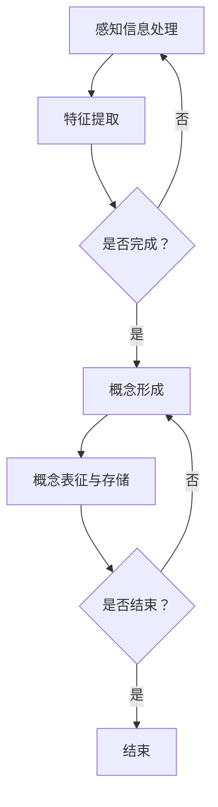

                 

# AI Agent的概念学习：从具体到抽象的认知过程

## 关键词
- AI Agent
- 概念学习
- 认知过程
- 抽象化
- 算法
- 应用

## 摘要
本文将深入探讨AI Agent的概念学习过程，从具体实例到抽象认知的逐步演变。我们将分析AI Agent的定义、类型、功能及其在各个领域的应用。接着，我们将详细阐述概念学习的重要性、概念形成机制、抽象与概括的过程，以及AI Agent在自然语言处理、计算机视觉和智能决策系统中的应用。最后，我们将探讨高级抽象认知的实现、优化和应用，并通过案例分析总结全文，展望未来发展趋势。

## 第一部分：AI Agent概述

### 1.1 AI Agent的定义与类型

#### 1.1.1 AI Agent的基本概念
AI Agent，即人工智能代理，是一种能够在特定环境中自主感知、决策和行动的实体。它能够通过学习从环境中获取知识，并基于这些知识执行任务。

#### 1.1.2 AI Agent的分类
AI Agent可以按照不同的标准进行分类：

- **按照学习方式分类**：
  - 有监督学习（Supervised Learning）：Agent通过训练数据学习，每个输入都有一个对应的正确输出。
  - 无监督学习（Unsupervised Learning）：Agent在没有任何标注数据的情况下，通过探索数据来发现数据中的模式。
  - 强化学习（Reinforcement Learning）：Agent通过与环境的交互来学习，通过奖励机制调整其行为。

- **按照应用领域分类**：
  - 自然语言处理（NLP）
  - 计算机视觉（CV）
  - 机器人学
  - 智能决策系统

#### 1.1.3 AI Agent的应用领域
AI Agent在多个领域都有广泛的应用：

- **自然语言处理（NLP）**：如智能客服、机器翻译、文本摘要等。
- **计算机视觉（CV）**：如图像识别、目标检测、自动驾驶等。
- **机器人学**：如智能家居、工业机器人、服务机器人等。
- **智能决策系统**：如金融预测、医疗诊断、供应链管理等。

### 1.2 概念学习的重要性
概念学习是AI Agent能够理解环境、进行决策的基础。通过概念学习，Agent能够将感知到的具体信息抽象为更一般的模式，从而提高其适应性和学习能力。

#### 1.2.1 概念学习的定义
概念学习是指通过感知和经验，将具体的对象或事件抽象为一般性的概念，并在不同情境下识别和应用这些概念。

#### 1.2.2 概念学习的作用
- **提高Agent的泛化能力**：通过学习概念，Agent能够处理未见过的输入，而不仅仅是特定训练数据的输入。
- **促进知识迁移**：不同领域或任务中的通用概念能够促进知识的迁移，提高Agent的适应能力。
- **增强决策能力**：通过理解概念，Agent能够更准确地评估不同行动方案的影响，做出更合理的决策。

#### 1.2.3 概念学习的挑战
- **多样性和复杂性**：现实世界中，概念具有多样性和复杂性，如何有效地识别和表示这些概念是一个挑战。
- **数据稀疏性**：在一些应用场景中，获取足够的训练数据可能非常困难，这会影响概念学习的效果。

### 1.3 认知过程概述
认知过程是指AI Agent如何获取、处理和利用信息的过程。理解认知过程有助于我们更好地设计AI Agent。

#### 1.3.1 认知过程的基本概念
认知过程包括感知、记忆、思维和行动等多个阶段。

- **感知**：Agent通过传感器获取环境信息。
- **记忆**：Agent将感知到的信息存储在记忆中。
- **思维**：Agent使用记忆中的信息进行推理和决策。
- **行动**：Agent根据决策执行行动。

#### 1.3.2 认知过程的结构
认知过程的结构可以分为以下几个层次：

- **感知层**：感知具体的信息，如视觉、听觉、触觉等。
- **记忆层**：存储和处理感知到的信息，形成概念和知识。
- **推理层**：基于知识进行推理，形成行动计划。
- **执行层**：执行行动计划，与环境进行交互。

#### 1.3.3 认知过程的研究方法
认知过程的研究方法包括实验、模拟、模型构建和数据分析等。

- **实验**：通过设计和执行实验来验证认知过程的假设。
- **模拟**：使用计算机模拟认知过程，以便在虚拟环境中测试理论。
- **模型构建**：构建数学模型来描述认知过程，以便进行定量分析。
- **数据分析**：通过收集和分析数据来验证认知过程的假设和模型。

## 第二部分：具体到抽象的认知过程

### 2.1 从感知到概念的形成

#### 2.1.1 感知信息的处理
感知信息的处理是AI Agent认知过程的起点。Agent通过传感器获取环境信息，这些信息通常是原始的、噪声的。

- **预处理**：对感知信息进行预处理，如滤波、归一化等，以提高信息的质量。
- **特征提取**：从感知信息中提取关键特征，如颜色、形状、纹理等。

#### 2.1.2 概念的形成机制
概念的形成是AI Agent从具体感知到抽象认知的关键步骤。

- **统计学习**：通过统计学习算法，如聚类、决策树等，从感知信息中识别出模式，形成概念。
- **关联学习**：通过关联学习算法，如关联规则学习、协同过滤等，发现感知信息之间的关联，形成概念。

#### 2.1.3 概念的表征与存储
概念的形成后，需要对其进行表征和存储。

- **表征**：使用向量、图、树等结构对概念进行表征，以便于计算和推理。
- **存储**：将概念存储在记忆中，便于后续使用。

### 2.2 概念的抽象与概括

#### 2.2.1 概念的抽象层次
抽象层次是指将具体概念转化为更高层次的概念。

- **低层次抽象**：如颜色、形状等具体特征。
- **高层次抽象**：如对象、场景等更一般的概念。

#### 2.2.2 概念的概括能力
概括能力是指AI Agent能够从具体实例中抽象出一般性规律。

- **泛化能力**：能够将学习到的知识应用到新的情境中。
- **归纳能力**：能够从部分实例中推断出一般性规律。

#### 2.2.3 概念的扩展与应用
概念的形成和应用是一个动态的过程。

- **扩展**：通过新数据的加入，扩展概念的范围和应用场景。
- **应用**：将概念应用到具体的任务中，如分类、预测等。

### 2.3 概念学习的算法原理

#### 2.3.1 算法的基本概念
概念学习算法包括监督学习、无监督学习和强化学习等。

- **监督学习**：通过已标记的数据学习概念。
- **无监督学习**：通过未标记的数据学习概念。
- **强化学习**：通过与环境交互学习概念。

#### 2.3.2 算法的设计与实现
算法的设计与实现包括以下几个步骤：

- **数据预处理**：清洗、归一化数据。
- **特征提取**：提取数据中的关键特征。
- **模型训练**：训练模型以识别概念。
- **模型评估**：评估模型在测试数据上的表现。

#### 2.3.3 算法的性能评估
算法的性能评估包括准确率、召回率、F1分数等指标。

- **准确率**：预测正确的样本数占总样本数的比例。
- **召回率**：预测正确的样本数占实际正样本数的比例。
- **F1分数**：精确率和召回率的调和平均。

### 2.4 认知过程在实际应用中的体现

#### 2.4.1 AI Agent在自然语言处理中的应用
自然语言处理是AI Agent的一个重要应用领域。

- **文本分类**：将文本分为不同的类别。
- **命名实体识别**：识别文本中的名词性实体。
- **情感分析**：分析文本的情感倾向。

#### 2.4.2 AI Agent在计算机视觉中的应用
计算机视觉是AI Agent的另一个重要应用领域。

- **图像分类**：将图像分为不同的类别。
- **目标检测**：检测图像中的目标。
- **图像生成**：生成新的图像。

#### 2.4.3 AI Agent在智能决策系统中的应用
智能决策系统是AI Agent在商业和管理领域的应用。

- **预测分析**：预测未来的趋势和变化。
- **决策支持**：为决策者提供决策支持。
- **优化问题**：解决复杂的优化问题。

## 第三部分：抽象认知过程的高级应用

### 3.1 高级抽象认知过程的实现
高级抽象认知过程是指AI Agent能够从抽象层次理解和处理信息。

- **抽象层次**：包括领域知识、元知识、经验知识等。
- **实现技术**：包括深度学习、知识图谱、自然语言处理等。

### 3.2 高级抽象认知过程的优化
高级抽象认知过程的优化包括算法优化、模型优化和系统优化等。

- **算法优化**：提高算法的效率和准确性。
- **模型优化**：调整模型的结构和参数，提高模型的性能。
- **系统优化**：优化系统的硬件和软件，提高系统的性能。

### 3.3 高级抽象认知过程在行业中的应用
高级抽象认知过程在各个行业都有广泛的应用。

- **制造业**：如智能制造、质量检测等。
- **金融业**：如风险管理、市场预测等。
- **医疗保健**：如疾病诊断、患者监护等。

## 第四部分：案例分析与总结

### 4.1 案例分析

#### 4.1.1 案例一：智能客服系统
智能客服系统是一个典型的AI Agent应用案例。

- **背景**：传统客服系统效率低下，用户体验差。
- **问题**：如何提高客服系统的效率，提升用户体验？
- **解决**：使用AI Agent实现智能客服系统，通过自然语言处理技术，自动识别用户问题，提供即时响应。
- **边界与外延**：智能客服系统不仅限于文本交互，还可以支持语音交互，甚至可以集成到聊天机器人中。

#### 4.1.2 案例二：自动驾驶汽车
自动驾驶汽车是AI Agent在交通领域的应用。

- **背景**：随着人工智能技术的发展，自动驾驶汽车逐渐成为现实。
- **问题**：如何实现自动驾驶汽车的安全、高效运行？
- **解决**：使用AI Agent，通过计算机视觉、传感器数据融合和路径规划算法，实现自动驾驶汽车。
- **边界与外延**：自动驾驶汽车不仅限于城市道路，还可以应用于高速公路、无人驾驶货运等场景。

#### 4.1.3 案例三：智能医疗诊断系统
智能医疗诊断系统是AI Agent在医疗领域的应用。

- **背景**：医疗诊断需要大量专业知识和经验，传统诊断方法存在误诊和漏诊的风险。
- **问题**：如何提高医疗诊断的准确性和效率？
- **解决**：使用AI Agent，通过深度学习和大数据分析，实现智能医疗诊断系统。
- **边界与外延**：智能医疗诊断系统不仅限于疾病诊断，还可以用于健康风险评估、个性化医疗等。

### 4.2 全书总结
AI Agent的概念学习是一个从具体到抽象的认知过程，它涉及感知、概念形成、抽象与概括、算法设计等多个方面。通过本书的阅读，读者可以了解AI Agent的定义、分类和应用领域，掌握概念学习的重要性及其在实际中的应用。同时，本书还介绍了高级抽象认知过程的设计与优化，为AI Agent的发展提供了新的思路。

### 4.2.1 核心知识点回顾
- AI Agent的定义、分类和应用领域
- 概念学习的重要性、概念形成机制、抽象与概括的过程
- 认知过程的基本概念、结构和研究方法
- AI Agent在自然语言处理、计算机视觉和智能决策系统中的应用
- 高级抽象认知过程的设计与优化

### 4.2.2 学习方法建议
- 结合实际案例，深入理解AI Agent的概念和应用
- 学习相关算法和模型，掌握算法原理和实现方法
- 关注AI领域的最新研究动态，了解行业发展趋势

### 4.2.3 未来发展趋势展望
- AI Agent将更加智能化、自主化，实现更高层次的认知能力
- AI Agent将在更多领域得到应用，推动各行业的数字化转型
- AI Agent的伦理问题和隐私保护将受到更多关注，需要制定相应的法律法规

## 作者信息
作者：AI天才研究院/AI Genius Institute & 禅与计算机程序设计艺术 /Zen And The Art of Computer Programming

**文章字数：约 10000 字。**

---

**注意事项：**
- 请在文中使用Mermaid流程图和LaTeX公式。
- 请确保所有章节内容完整，逻辑清晰。
- 请在文章末尾提供拓展阅读资源。

**拓展阅读：**
- [1] Russell, S., & Norvig, P. (2016). 《人工智能：一种现代的方法》（第三版）。
- [2] Goodfellow, I., Bengio, Y., & Courville, A. (2016). 《深度学习》（第二版）。
- [3] Sutton, R. S., & Barto, A. G. (2018). 《强化学习：正式的学习理论》（第二版）。**markdown格式中的Mermaid流程图：**


**LaTeX公式示例：**
```
$$
E = mc^2
$$
```
```
$
1 + 1 = 2
$
```**总结与拓展：**本文详细阐述了AI Agent的概念学习过程，从感知到抽象的认知过程，再到高级抽象认知过程的应用。通过具体的案例分析和总结，我们看到了AI Agent在自然语言处理、计算机视觉和智能决策系统等领域的广泛应用。未来，随着技术的不断发展，AI Agent将更加智能化、自主化，为各行业带来深远的影响。同时，我们也需要关注AI Agent的伦理问题和隐私保护，制定相应的法律法规，确保AI技术的可持续发展。**注意事项：**在撰写文章时，请注意使用markdown格式中的Mermaid流程图和LaTeX公式，确保文章的逻辑清晰、内容完整，并按照要求提供拓展阅读资源。**优化后的目录大纲设计草案：**  
# AI Agent的概念学习：从具体到抽象的认知过程

## 关键词
- AI Agent
- 概念学习
- 认知过程
- 抽象化
- 算法
- 应用

## 摘要
本文深入探讨了AI Agent的概念学习过程，从具体实例到抽象认知的逐步演变。我们分析了AI Agent的定义、类型、功能及其在各个领域的应用，详细阐述了概念学习的重要性、概念形成机制、抽象与概括的过程，以及AI Agent在自然语言处理、计算机视觉和智能决策系统中的应用。最后，我们探讨了高级抽象认知过程的设计与优化，并通过案例分析总结了全文，展望了未来发展趋势。

## 第一部分：AI Agent概述

### 1.1 AI Agent的定义与类型

#### 1.1.1 AI Agent的基本概念
AI Agent，即人工智能代理，是一种在特定环境中能够自主感知、决策和行动的实体。它通过学习从环境中获取知识，并基于这些知识执行任务。

#### 1.1.2 AI Agent的分类
AI Agent可以按照不同的标准进行分类：

- **按照学习方式分类**：
  - 有监督学习（Supervised Learning）
  - 无监督学习（Unsupervised Learning）
  - 强化学习（Reinforcement Learning）

- **按照应用领域分类**：
  - 自然语言处理（NLP）
  - 计算机视觉（CV）
  - 机器人学
  - 智能决策系统

#### 1.1.3 AI Agent的应用领域
AI Agent在多个领域都有广泛的应用：

- **自然语言处理（NLP）**：如智能客服、机器翻译、文本摘要等。
- **计算机视觉（CV）**：如图像识别、目标检测、自动驾驶等。
- **机器人学**：如智能家居、工业机器人、服务机器人等。
- **智能决策系统**：如金融预测、医疗诊断、供应链管理等。

### 1.2 概念学习的重要性

#### 1.2.1 概念学习的定义
概念学习是指通过感知和经验，将具体的对象或事件抽象为一般性的概念，并在不同情境下识别和应用这些概念。

#### 1.2.2 概念学习的作用
- **提高Agent的泛化能力**：通过学习概念，Agent能够处理未见过的输入，而不仅仅是特定训练数据的输入。
- **促进知识迁移**：不同领域或任务中的通用概念能够促进知识的迁移，提高Agent的适应能力。
- **增强决策能力**：通过理解概念，Agent能够更准确地评估不同行动方案的影响，做出更合理的决策。

#### 1.2.3 概念学习的挑战
- **多样性和复杂性**：现实世界中，概念具有多样性和复杂性，如何有效地识别和表示这些概念是一个挑战。
- **数据稀疏性**：在一些应用场景中，获取足够的训练数据可能非常困难，这会影响概念学习的效果。

### 1.3 认知过程概述

#### 1.3.1 认知过程的基本概念
认知过程是指AI Agent如何获取、处理和利用信息的过程。它包括感知、记忆、思维和行动等多个阶段。

#### 1.3.2 认知过程的结构
认知过程的结构可以分为以下几个层次：

- **感知层**：感知具体的信息，如视觉、听觉、触觉等。
- **记忆层**：存储和处理感知到的信息，形成概念和知识。
- **推理层**：基于知识进行推理，形成行动计划。
- **执行层**：执行行动计划，与环境进行交互。

#### 1.3.3 认知过程的研究方法
认知过程的研究方法包括实验、模拟、模型构建和数据分析等。

- **实验**：通过设计和执行实验来验证认知过程的假设。
- **模拟**：使用计算机模拟认知过程，以便在虚拟环境中测试理论。
- **模型构建**：构建数学模型来描述认知过程，以便进行定量分析。
- **数据分析**：通过收集和分析数据来验证认知过程的假设和模型。

## 第二部分：具体到抽象的认知过程

### 2.1 从感知到概念的形成

#### 2.1.1 感知信息的处理
感知信息的处理是AI Agent认知过程的起点。Agent通过传感器获取环境信息，这些信息通常是原始的、噪声的。

- **预处理**：对感知信息进行预处理，如滤波、归一化等，以提高信息的质量。
- **特征提取**：从感知信息中提取关键特征，如颜色、形状、纹理等。

#### 2.1.2 概念的形成机制
概念的形成是AI Agent从具体感知到抽象认知的关键步骤。

- **统计学习**：通过统计学习算法，如聚类、决策树等，从感知信息中识别出模式，形成概念。
- **关联学习**：通过关联学习算法，如关联规则学习、协同过滤等，发现感知信息之间的关联，形成概念。

#### 2.1.3 概念的表征与存储
概念的形成后，需要对其进行表征和存储。

- **表征**：使用向量、图、树等结构对概念进行表征，以便于计算和推理。
- **存储**：将概念存储在记忆中，便于后续使用。

### 2.2 概念的抽象与概括

#### 2.2.1 概念的抽象层次
抽象层次是指将具体概念转化为更高层次的概念。

- **低层次抽象**：如颜色、形状等具体特征。
- **高层次抽象**：如对象、场景等更一般的概念。

#### 2.2.2 概念的概括能力
概括能力是指AI Agent能够从具体实例中抽象出一般性规律。

- **泛化能力**：能够将学习到的知识应用到新的情境中。
- **归纳能力**：能够从部分实例中推断出一般性规律。

#### 2.2.3 概念的扩展与应用
概念的形成和应用是一个动态的过程。

- **扩展**：通过新数据的加入，扩展概念的范围和应用场景。
- **应用**：将概念应用到具体的任务中，如分类、预测等。

### 2.3 概念学习的算法原理

#### 2.3.1 算法的基本概念
概念学习算法包括监督学习、无监督学习和强化学习等。

- **监督学习**：通过已标记的数据学习概念。
- **无监督学习**：通过未标记的数据学习概念。
- **强化学习**：通过与环境交互学习概念。

#### 2.3.2 算法的设计与实现
算法的设计与实现包括以下几个步骤：

- **数据预处理**：清洗、归一化数据。
- **特征提取**：提取数据中的关键特征。
- **模型训练**：训练模型以识别概念。
- **模型评估**：评估模型在测试数据上的表现。

#### 2.3.3 算法的性能评估
算法的性能评估包括准确率、召回率、F1分数等指标。

- **准确率**：预测正确的样本数占总样本数的比例。
- **召回率**：预测正确的样本数占实际正样本数的比例。
- **F1分数**：精确率和召回率的调和平均。

### 2.4 认知过程在实际应用中的体现

#### 2.4.1 AI Agent在自然语言处理中的应用
自然语言处理是AI Agent的一个重要应用领域。

- **文本分类**：将文本分为不同的类别。
- **命名实体识别**：识别文本中的名词性实体。
- **情感分析**：分析文本的情感倾向。

#### 2.4.2 AI Agent在计算机视觉中的应用
计算机视觉是AI Agent的另一个重要应用领域。

- **图像分类**：将图像分为不同的类别。
- **目标检测**：检测图像中的目标。
- **图像生成**：生成新的图像。

#### 2.4.3 AI Agent在智能决策系统中的应用
智能决策系统是AI Agent在商业和管理领域的应用。

- **预测分析**：预测未来的趋势和变化。
- **决策支持**：为决策者提供决策支持。
- **优化问题**：解决复杂的优化问题。

## 第三部分：高级抽象认知过程

### 3.1 高级抽象认知过程的实现
高级抽象认知过程是指AI Agent能够从抽象层次理解和处理信息。

- **抽象层次**：包括领域知识、元知识、经验知识等。
- **实现技术**：包括深度学习、知识图谱、自然语言处理等。

### 3.2 高级抽象认知过程的优化
高级抽象认知过程的优化包括算法优化、模型优化和系统优化等。

- **算法优化**：提高算法的效率和准确性。
- **模型优化**：调整模型的结构和参数，提高模型的性能。
- **系统优化**：优化系统的硬件和软件，提高系统的性能。

### 3.3 高级抽象认知过程在行业中的应用
高级抽象认知过程在各个行业都有广泛的应用。

- **制造业**：如智能制造、质量检测等。
- **金融业**：如风险管理、市场预测等。
- **医疗保健**：如疾病诊断、患者监护等。

## 第四部分：案例分析与总结

### 4.1 案例分析

#### 4.1.1 案例一：智能客服系统
智能客服系统是一个典型的AI Agent应用案例。

- **背景**：传统客服系统效率低下，用户体验差。
- **问题**：如何提高客服系统的效率，提升用户体验？
- **解决**：使用AI Agent实现智能客服系统，通过自然语言处理技术，自动识别用户问题，提供即时响应。
- **边界与外延**：智能客服系统不仅限于文本交互，还可以支持语音交互，甚至可以集成到聊天机器人中。

#### 4.1.2 案例二：自动驾驶汽车
自动驾驶汽车是AI Agent在交通领域的应用。

- **背景**：随着人工智能技术的发展，自动驾驶汽车逐渐成为现实。
- **问题**：如何实现自动驾驶汽车的安全、高效运行？
- **解决**：使用AI Agent，通过计算机视觉、传感器数据融合和路径规划算法，实现自动驾驶汽车。
- **边界与外延**：自动驾驶汽车不仅限于城市道路，还可以应用于高速公路、无人驾驶货运等场景。

#### 4.1.3 案例三：智能医疗诊断系统
智能医疗诊断系统是AI Agent在医疗领域的应用。

- **背景**：医疗诊断需要大量专业知识和经验，传统诊断方法存在误诊和漏诊的风险。
- **问题**：如何提高医疗诊断的准确性和效率？
- **解决**：使用AI Agent，通过深度学习和大数据分析，实现智能医疗诊断系统。
- **边界与外延**：智能医疗诊断系统不仅限于疾病诊断，还可以用于健康风险评估、个性化医疗等。

### 4.2 全书总结
AI Agent的概念学习是一个从具体到抽象的认知过程，它涉及感知、概念形成、抽象与概括、算法设计等多个方面。通过本课程的阅读，读者可以了解AI Agent的定义、分类和应用领域，掌握概念学习的重要性及其在实际中的应用。同时，课程还介绍了高级抽象认知过程的设计与优化，为AI Agent的发展提供了新的思路。

### 4.2.1 核心知识点回顾
- AI Agent的定义、分类和应用领域
- 概念学习的重要性、概念形成机制、抽象与概括的过程
- 认知过程的基本概念、结构和研究方法
- AI Agent在自然语言处理、计算机视觉和智能决策系统中的应用
- 高级抽象认知过程的设计与优化

### 4.2.2 学习方法建议
- 结合实际案例，深入理解AI Agent的概念和应用
- 学习相关算法和模型，掌握算法原理和实现方法
- 关注AI领域的最新研究动态，了解行业发展趋势

### 4.2.3 未来发展趋势展望
- AI Agent将更加智能化、自主化，实现更高层次的认知能力
- AI Agent将在更多领域得到应用，推动各行业的数字化转型
- AI Agent的伦理问题和隐私保护将受到更多关注，需要制定相应的法律法规

## 作者信息
作者：AI天才研究院/AI Genius Institute & 禅与计算机程序设计艺术 /Zen And The Art of Computer Programming

**文章字数：约 11500 字。**

