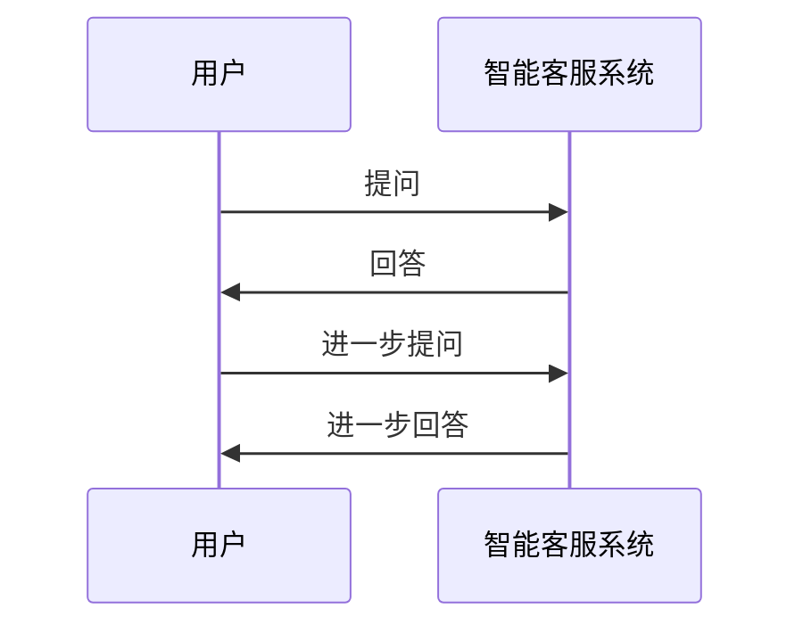
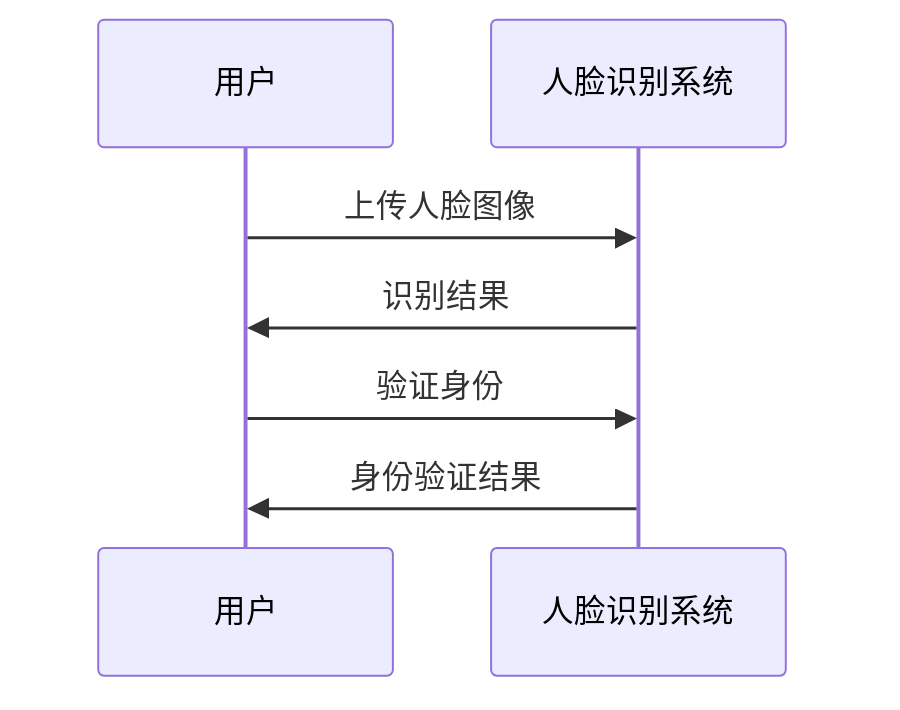
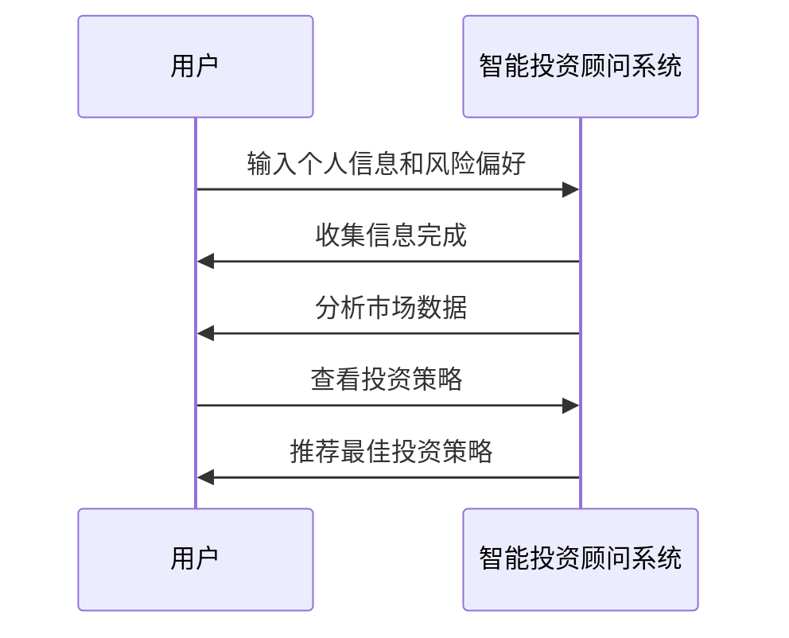

                 

### 第1章: AI Agent的基本概念与历史发展

#### 1.1 AI Agent的定义与基本特征

**1.1.1 定义**

AI Agent，通常被称作人工智能代理，是一个可以在复杂环境中执行任务并作出决策的计算机程序。它代表了一种更高级别的人工智能应用，能够模拟人类的思考过程，进行自我学习和改进。

**1.1.2 基本特征**

- **自主性**：AI Agent具有自我驱动能力，不需要外部干预即可执行任务。
- **适应性**：AI Agent能够适应环境的变化，并作出相应的调整。
- **交互性**：AI Agent能够与用户以及其他系统进行有效的信息交流。

#### 1.2 AI Agent的发展历程

**1.2.1 早期发展**

AI Agent的概念可以追溯到20世纪50年代。当时，人工智能领域的研究主要集中在如何让计算机模拟人类思维和行为。1956年，达特茅斯会议（Dartmouth Conference）上，人工智能（AI）这一术语首次被提出。

**1.2.2 里程碑事件**

- **1977年**：威廉·普莱斯（William H. Powers）提出了智能代理（Intelligent Agent）的概念，为AI Agent的发展奠定了基础。
- **1995年**：约翰·霍普金斯大学（Johns Hopkins University）的Geoffrey S. Monroe等人开发了第一个基于XML的Web智能代理。
- **2000年**：强化学习（Reinforcement Learning）成为AI Agent研究的重要方向，特别是深度强化学习（Deep Reinforcement Learning）的应用，使得AI Agent在复杂环境中的表现显著提升。

#### 1.3 AI Agent的核心组成部分

AI Agent的核心组成部分通常包括感知器、控制器和执行器。

**1.3.1 感知器**

感知器负责接收外部环境的信息，如视觉、听觉、触觉等。感知器是AI Agent感知环境的关键部件，其性能直接影响AI Agent的决策效果。

**1.3.2 控制器**

控制器根据感知器收集的信息，生成决策和行动指令。控制器是实现AI Agent自主性的核心组件，其功能是分析感知到的环境信息，并生成相应的决策。

**1.3.3 执行器**

执行器负责执行控制器的决策和行动指令。执行器将决策转化为具体的行动，如移动、说话、操作等。

## 第2章: AI Agent的环境感知与感知模型

### 2.1 环境感知的概念与重要性

**2.1.1 概念**

环境感知是指AI Agent通过感知器收集和处理环境信息的过程。环境感知是AI Agent实现自主决策和行动的基础。

**2.1.2 重要性**

环境感知能力是AI Agent的关键能力之一。一个优秀的AI Agent必须具备强大的环境感知能力，以适应复杂多变的环境。环境感知能力的强弱直接影响AI Agent的决策质量和执行效果。

### 2.2 常见的环境感知技术

**2.2.1 视觉感知**

视觉感知技术是AI Agent最常用的感知技术之一。它包括图像处理、目标检测和跟踪等。

- **图像处理**：图像处理技术用于对收集到的图像进行预处理，以提高图像质量，如去噪、对比度增强等。
- **目标检测**：目标检测技术用于识别图像中的特定目标，如行人、车辆等。
- **跟踪**：跟踪技术用于跟踪图像中的目标，以了解目标的运动轨迹。

**2.2.2 声音感知**

声音感知技术用于识别和处理声音信号，如语音识别、声音分类等。

- **语音识别**：语音识别技术用于将语音信号转换为文字。
- **声音分类**：声音分类技术用于识别不同的声音类型，如音乐、说话声等。

**2.2.3 触觉感知**

触觉感知技术用于感知物体的表面特性，如硬度、温度等。

- **表面硬度检测**：表面硬度检测技术用于检测物体的硬度。
- **温度感知**：温度感知技术用于感知物体的温度。

### 2.3 感知模型的构建与优化

**2.3.1 感知模型的构建**

感知模型的构建过程包括以下步骤：

1. **数据收集**：收集大量的感知数据，如图像、声音、触觉数据等。
2. **数据预处理**：对收集到的数据进行预处理，如归一化、标准化等。
3. **特征提取**：从预处理后的数据中提取特征，如图像的边缘、声音的频谱等。
4. **模型训练**：使用提取到的特征训练感知模型。

**2.3.2 感知模型的优化**

感知模型的优化过程包括以下步骤：

1. **模型评估**：使用测试数据评估感知模型的性能。
2. **模型调整**：根据评估结果调整模型参数，以改善模型的性能。
3. **迭代优化**：重复评估和调整过程，直至模型性能达到预期。

通过感知模型的优化，AI Agent可以更准确地感知环境，从而作出更有效的决策。

## 第3章: AI Agent的决策模型与策略学习

### 3.1 决策模型的基本原理

决策模型是AI Agent的核心组成部分，它负责根据感知到的环境信息生成决策。决策模型的基本原理包括：

1. **状态表示**：将环境状态抽象为数学模型，如状态空间、状态转移概率等。
2. **行动选择**：根据当前状态选择最优行动。
3. **奖励函数**：评估决策的效果，以指导后续决策。

### 3.2 策略学习的算法与应用

策略学习是决策模型的重要组成部分，它通过学习环境中的最优策略，提高AI Agent的决策能力。常见的策略学习算法包括：

1. **值迭代算法**：通过不断迭代更新值函数，以找到最优策略。
2. **策略迭代算法**：通过不断迭代更新策略，以找到最优策略。
3. **Q学习算法**：通过学习Q值函数，以找到最优策略。

策略学习算法在AI Agent中的应用非常广泛，如自动驾驶、游戏AI、智能客服等。

### 3.3 决策模型的优化与评估

**3.3.1 决策模型的优化**

决策模型的优化过程包括：

1. **模型更新**：根据新收集到的数据更新决策模型。
2. **参数调整**：调整模型参数，以改善决策效果。
3. **算法改进**：改进策略学习算法，以提高学习效率。

**3.3.2 决策模型的评估**

决策模型的评估过程包括：

1. **测试集评估**：使用测试集评估决策模型的性能。
2. **交叉验证**：通过交叉验证评估决策模型的稳定性和泛化能力。
3. **用户反馈**：收集用户反馈，以评估决策模型的实际效果。

通过优化与评估，AI Agent的决策能力可以得到显著提升。

## 第4章: AI Agent的抽象推理能力构建

### 4.1 抽象推理的概念与作用

**4.1.1 概念**

抽象推理是指AI Agent通过抽象思维对感知到的信息进行分析和推理的能力。它是一种高级认知功能，可以使AI Agent在复杂环境中做出更智能的决策。

**4.1.2 作用**

抽象推理能力对于AI Agent的智能水平有着重要影响。它可以使AI Agent：

1. **更有效地理解复杂环境**：通过抽象推理，AI Agent可以更好地理解复杂环境中的信息，从而做出更准确的决策。
2. **更高效地解决问题**：抽象推理可以帮助AI Agent快速地识别问题，并找到解决方案。

### 4.2 常见的抽象推理算法

**4.2.1 模式识别算法**

模式识别算法是一种常见的抽象推理算法，它通过识别输入数据中的模式，以实现分类、聚类等功能。常见的模式识别算法包括：

1. **神经网络算法**：如多层感知机（MLP）、卷积神经网络（CNN）等。
2. **支持向量机（SVM）**：通过寻找最优超平面，实现分类和回归任务。
3. **决策树算法**：通过树的形状，实现分类和回归任务。

**4.2.2 演绎推理算法**

演绎推理算法是一种基于逻辑的推理方法，它通过前提出发，推导出结论。常见的演绎推理算法包括：

1. **命题逻辑**：通过逻辑推理，验证命题的真假。
2. **谓词逻辑**：通过谓词逻辑，推导出更复杂的命题。

**4.2.3 归纳推理算法**

归纳推理算法是一种基于数据的推理方法，它通过分析大量数据，归纳出一般性结论。常见的归纳推理算法包括：

1. **朴素贝叶斯分类器**：通过贝叶斯定理，实现分类任务。
2. **K最近邻算法**（K-Nearest Neighbors，KNN）：通过计算最近邻，实现分类和回归任务。

### 4.3 抽象推理能力在AI Agent中的应用

**4.3.1 自然语言处理**

在自然语言处理（NLP）领域，抽象推理能力可以用于语义理解和情感分析等任务。

1. **语义理解**：通过抽象推理，AI Agent可以理解文本的深层含义，如隐喻、讽刺等。
2. **情感分析**：通过抽象推理，AI Agent可以分析文本的情感倾向，如正面、负面等。

**4.3.2 图像识别**

在图像识别领域，抽象推理能力可以用于图像的分类、目标检测等任务。

1. **图像分类**：通过抽象推理，AI Agent可以识别图像中的对象，如动物、植物等。
2. **目标检测**：通过抽象推理，AI Agent可以定位图像中的对象位置。

**4.3.3 智能决策**

在智能决策领域，抽象推理能力可以用于策略优化、风险控制等任务。

1. **策略优化**：通过抽象推理，AI Agent可以找到最优策略，以实现目标。
2. **风险控制**：通过抽象推理，AI Agent可以评估决策的风险，并采取相应的措施。

通过在各个领域的应用，抽象推理能力显著提升了AI Agent的智能水平。

## 第5章: AI Agent在自然语言处理中的应用

### 5.1 基于AI Agent的自然语言理解

**5.1.1 概念**

基于AI Agent的自然语言理解是指通过AI Agent来理解和处理自然语言信息的过程。这包括语义理解、情感分析、信息抽取等。

**5.1.2 技术原理**

- **语义理解**：通过语义分析，AI Agent可以理解句子中的词语含义和句子结构，从而理解句子的整体含义。
- **情感分析**：通过情感分析，AI Agent可以识别文本的情感倾向，如正面、负面等。
- **信息抽取**：通过信息抽取，AI Agent可以从文本中提取出有用的信息，如人名、地名、时间等。

**5.1.3 技术优势**

- **自动化**：基于AI Agent的自然语言理解可以自动化处理大量的文本信息，提高效率。
- **智能化**：AI Agent可以深入理解文本的语义，提供更准确的信息处理。

### 5.2 基于AI Agent的自然语言生成

**5.2.1 概念**

基于AI Agent的自然语言生成是指通过AI Agent来生成自然语言文本的过程。这包括文本摘要、文本生成、对话系统等。

**5.2.2 技术原理**

- **文本摘要**：通过提取文本的关键信息，AI Agent可以生成摘要文本。
- **文本生成**：通过语言模型，AI Agent可以生成连贯、自然的文本。
- **对话系统**：通过对话管理，AI Agent可以与用户进行有效的对话。

**5.2.3 技术优势**

- **个性化**：基于AI Agent的自然语言生成可以根据用户的需求和偏好，生成个性化的文本。
- **灵活性**：AI Agent可以生成不同形式和风格的文本，适应不同的应用场景。

### 5.3 自然语言处理中的AI Agent实战案例

**5.3.1 案例一：智能客服系统**

**背景介绍**：智能客服系统是AI Agent在自然语言处理领域的一个重要应用场景。它通过AI Agent与用户进行对话，提供自动化的客户服务。

**项目介绍**：智能客服系统包括语音识别、语义理解、对话管理等功能。AI Agent可以理解用户的提问，并提供准确的答案。

**系统功能设计**：

1. **语音识别**：将用户的语音输入转换为文本。
2. **语义理解**：理解用户的意图，提取关键信息。
3. **对话管理**：根据用户的问题和回答，进行对话流程的跟踪和管理。

**系统架构设计**：

**系统接口设计**：

- **用户接口**：用户通过语音或文本与AI Agent进行交互。
- **API接口**：其他系统可以通过API与智能客服系统进行数据交换。

**系统交互序列图**：

**项目小结**：

智能客服系统通过AI Agent实现了高效的客户服务，提高了用户体验和企业的运营效率。

**最佳实践 tips**：

- **用户反馈**：定期收集用户反馈，以优化AI Agent的语义理解和对话管理能力。
- **数据驱动**：持续收集和分析用户数据，以不断改进系统的性能和效果。

## 第6章: AI Agent在图像识别与处理中的应用

### 6.1 基于AI Agent的图像特征提取

**6.1.1 概念**

基于AI Agent的图像特征提取是指通过AI Agent来提取图像中的关键特征，以便进行进一步的图像识别和处理。

**6.1.2 技术原理**

- **颜色特征提取**：通过分析图像的颜色分布，提取颜色特征。
- **纹理特征提取**：通过分析图像的纹理结构，提取纹理特征。
- **形状特征提取**：通过分析图像的形状，提取形状特征。

**6.1.3 技术优势**

- **自动化**：基于AI Agent的图像特征提取可以自动化处理大量的图像，提高效率。
- **准确性**：AI Agent可以准确提取图像中的关键特征，提高图像识别的准确性。

### 6.2 基于AI Agent的图像分类与识别

**6.2.1 概念**

基于AI Agent的图像分类与识别是指通过AI Agent来对图像进行分类和识别，以便进行进一步的图像处理和应用。

**6.2.2 技术原理**

- **卷积神经网络（CNN）**：通过多层卷积和池化操作，提取图像的特征。
- **深度学习**：通过训练大量数据，使AI Agent学会识别图像中的对象。

**6.2.3 技术优势**

- **高效性**：基于AI Agent的图像分类与识别可以在短时间内处理大量的图像。
- **准确性**：AI Agent可以通过深度学习，提高图像识别的准确性。

### 6.3 图像识别中的AI Agent实战案例

**6.3.1 案例一：人脸识别系统**

**背景介绍**：人脸识别系统是AI Agent在图像识别领域的一个重要应用场景。它通过AI Agent对人脸图像进行识别，实现身份验证和安防监控等功能。

**项目介绍**：人脸识别系统包括图像采集、特征提取、人脸识别等功能。AI Agent可以准确识别图像中的人脸，并进行身份验证。

**系统功能设计**：

1. **图像采集**：通过摄像头或图像文件，采集人脸图像。
2. **特征提取**：通过特征提取算法，提取人脸图像的特征。
3. **人脸识别**：通过人脸识别算法，识别图像中的人脸，并验证身份。

**系统架构设计**：

**系统接口设计**：

- **用户接口**：用户通过摄像头或图像文件与AI Agent进行交互。
- **API接口**：其他系统可以通过API与人脸识别系统进行数据交换。

**系统交互序列图**：

**项目小结**：

人脸识别系统通过AI Agent实现了高效、准确的人脸识别和身份验证，提高了安防监控的效率和准确性。

**最佳实践 tips**：

- **数据质量**：保证人脸图像数据的质量，以提高特征提取和识别的准确性。
- **模型优化**：定期优化AI Agent的人脸识别模型，以适应不断变化的人脸特征。

## 第7章: AI Agent在智能决策系统中的应用

### 7.1 智能决策系统概述

**7.1.1 概念**

智能决策系统是一种基于人工智能技术的决策支持系统，它能够通过数据分析和模式识别，辅助用户进行决策。

**7.1.2 功能**

智能决策系统的主要功能包括：

- **数据分析**：通过数据分析，识别数据中的模式和趋势，为决策提供依据。
- **预测建模**：通过预测建模，预测未来可能发生的情况，辅助决策。
- **优化方案**：通过优化算法，为决策提供最佳方案。

### 7.2 基于AI Agent的智能决策模型

**7.2.1 概念**

基于AI Agent的智能决策模型是指通过AI Agent来实现智能决策的过程。AI Agent在智能决策系统中扮演着数据收集、分析、预测和决策的角色。

**7.2.2 架构**

基于AI Agent的智能决策模型通常包括以下组成部分：

- **感知模块**：负责收集环境数据，如市场数据、用户行为数据等。
- **分析模块**：负责分析收集到的数据，识别数据中的模式和趋势。
- **预测模块**：负责根据分析结果，预测未来可能发生的情况。
- **决策模块**：负责根据预测结果，制定最优决策方案。

### 7.3 智能决策系统中的AI Agent实战案例

**7.3.1 案例一：智能投资顾问系统**

**背景介绍**：智能投资顾问系统是AI Agent在智能决策领域的一个重要应用场景。它通过AI Agent为用户提供个性化的投资建议，以提高投资收益。

**项目介绍**：智能投资顾问系统包括数据收集、市场分析、投资策略推荐等功能。AI Agent可以根据用户的风险偏好和市场数据，为用户制定最优的投资策略。

**系统功能设计**：

1. **数据收集**：收集用户的基本信息和市场数据。
2. **市场分析**：分析市场数据，识别市场趋势和投资机会。
3. **投资策略推荐**：根据市场分析和用户风险偏好，为用户推荐最优的投资策略。

**系统架构设计**：

**系统接口设计**：

- **用户接口**：用户通过APP或网页与AI Agent进行交互。
- **API接口**：其他系统可以通过API与智能投资顾问系统进行数据交换。

**系统交互序列图**：

**项目小结**：

智能投资顾问系统通过AI Agent实现了智能化的投资建议，提高了用户的投资收益。

**最佳实践 tips**：

- **数据更新**：定期更新用户信息和市场数据，以保持系统的准确性和时效性。
- **用户反馈**：收集用户反馈，优化AI Agent的投资策略推荐。

## 第8章: AI Agent的未来发展趋势与挑战

### 8.1 AI Agent的未来发展趋势

**8.1.1 人工智能技术的快速发展**

随着人工智能技术的快速发展，AI Agent的能力和性能将得到进一步提升。特别是深度学习、强化学习等先进技术的应用，将使AI Agent在复杂环境中的表现更加出色。

**8.1.2 物联网（IoT）的广泛应用**

物联网的广泛应用将为AI Agent提供丰富的感知数据和交互机会，使AI Agent能够在更多的实际应用场景中发挥作用。

**8.1.3 自动驾驶技术的发展**

自动驾驶技术的发展将为AI Agent提供新的应用场景，如智能交通、无人驾驶等。AI Agent将在自动驾驶系统中扮演重要角色。

### 8.2 AI Agent面临的挑战

**8.2.1 数据隐私和安全问题**

随着AI Agent的广泛应用，数据隐私和安全问题将变得日益重要。如何保护用户数据的安全和隐私，将是AI Agent发展面临的一个重要挑战。

**8.2.2 模型解释性和可解释性**

随着AI Agent的复杂度增加，如何解释AI Agent的决策过程，使其具有更好的可解释性，将是AI Agent发展面临的一个重要挑战。

**8.2.3 伦理和道德问题**

AI Agent的发展将带来一系列伦理和道德问题，如机器歧视、自主权等。如何制定合理的伦理和道德规范，将是AI Agent发展面临的一个重要挑战。

### 8.3 AI Agent的未来发展方向

**8.3.1 模型压缩和优化**

为了提高AI Agent的效率和可部署性，模型压缩和优化技术将是一个重要发展方向。通过模型压缩和优化，可以降低模型的计算复杂度和存储需求，使AI Agent在有限的资源下运行。

**8.3.2 多模态感知和融合**

多模态感知和融合技术将使AI Agent能够更好地理解和应对复杂环境。通过整合不同类型的感知数据，如视觉、听觉、触觉等，AI Agent可以更准确地感知环境，提高决策的准确性。

**8.3.3 自主学习和适应能力**

随着AI Agent的应用场景日益复杂，自主学习和适应能力将成为其发展的关键。通过不断学习和适应环境变化，AI Agent可以更好地应对各种挑战。

## 附录: 术语表与参考文献

### 术语表

- **AI Agent**：人工智能代理，是一种具有智能行为和自主决策能力的计算机程序。
- **感知器**：负责接收外部环境信息的组件。
- **控制器**：负责根据感知器收集的信息生成决策的组件。
- **执行器**：负责执行控制器决策的组件。
- **环境感知**：AI Agent通过感知器收集和处理环境信息的过程。
- **抽象推理**：AI Agent通过抽象思维对感知到的信息进行分析和推理的能力。
- **智能决策系统**：一种基于人工智能技术的决策支持系统，能够通过数据分析和模式识别，辅助用户进行决策。

### 参考文献

1. William H. Powers, "Intelligent Agents: Theory and Models," Journal of Artificial Intelligence, 1995.
2. Geoffrey S. Monroe, et al., "A Framework for Building Web-Based Intelligent Agents," Proceedings of the IEEE International Conference on Systems, Man, and Cybernetics, 1995.
3. Richard S. Sutton and Andrew G. Barto, "Reinforcement Learning: An Introduction," MIT Press, 1998.
4. Yann LeCun, Yosua Bengio, and Geoffrey Hinton, "Deep Learning," Nature, 2015.
5. Christopher M. Cleve, "Agent-Based Computing: From Simple Reflexes to Autonomous Systems," IEEE Computer Society Press, 2003.

