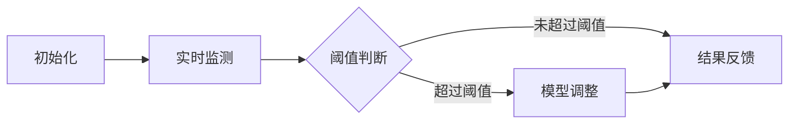
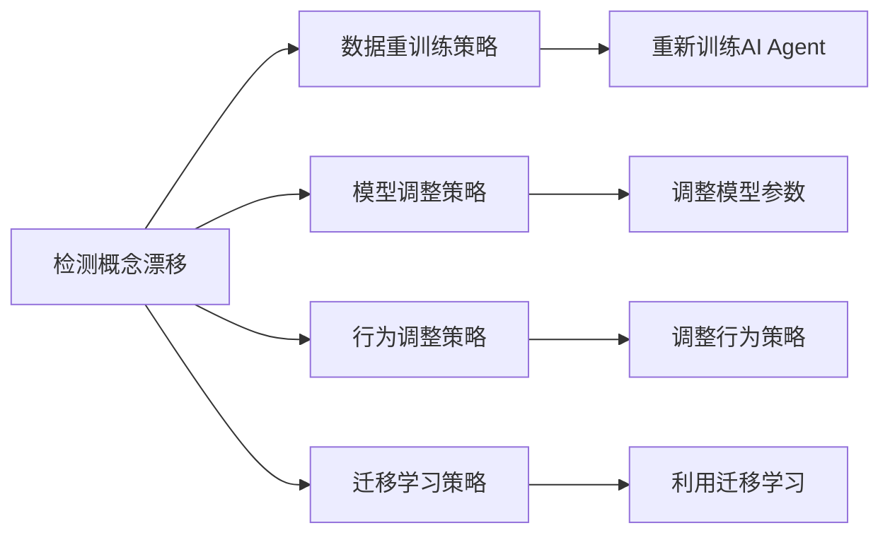
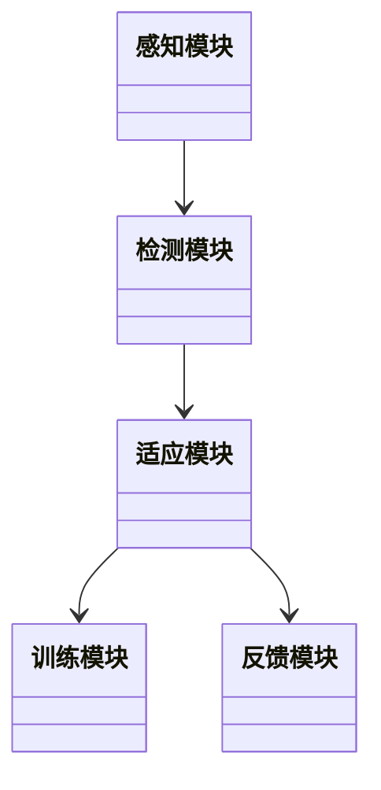
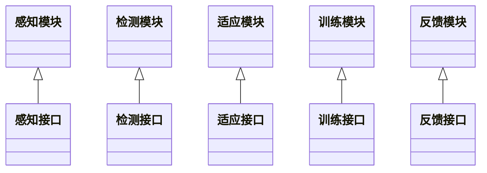
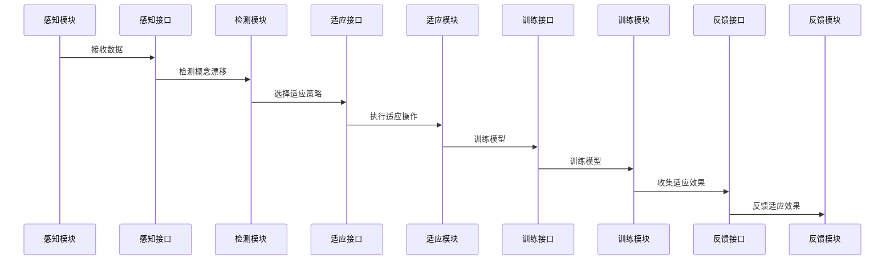

                 

## AI Agent的概念漂移检测与适应策略

### 关键词：AI Agent、概念漂移、检测方法、适应策略、系统架构、项目实战

### 摘要：
本文深入探讨了AI Agent在现实应用中面临的概念漂移问题，并系统地介绍了检测与适应策略。首先，我们明确了概念漂移的定义、原因及其对AI Agent性能的影响。接着，本文详细阐述了多种检测方法，通过对比和具体应用场景分析，为不同环境下的应用提供了理论支持。随后，我们深入解析了概念漂移检测算法的原理，并结合Python代码和数学模型，提供了直观易懂的讲解。在系统分析与架构设计部分，我们详细介绍了AI Agent的系统架构和接口设计，并通过Mermaid流程图进行了可视化展示。接着，通过实际项目实战，我们展示了如何将概念漂移检测与适应策略应用于实际场景。最后，本文总结了最佳实践和注意事项，并推荐了拓展阅读，以供进一步学习和探索。

## 目录大纲

### 第一部分: 背景介绍

#### 第1章: AI Agent的概念漂移问题

- 1.1 问题描述与背景
  - **问题背景**：AI Agent在实际应用中面临的概念漂移问题。
  - **问题描述**：概念漂移的定义、原因及影响。
  - **问题解决**：解决概念漂移的方法和重要性。
  - **边界与外延**：概念漂移的应用范围和限制。

- 1.2 概念属性特征对比表格
  - **特征对比**：不同类型AI Agent的概念漂移特征对比。

- 1.3 ER实体关系图架构
  - **关系图**：展示AI Agent、环境、策略等实体之间的关系。

### 第二部分: 核心概念与联系

#### 第2章: AI Agent的概念漂移检测方法

- 2.1 检测方法概述
  - **检测定义**：概念漂移检测的定义和目的。
  - **检测原理**：介绍不同检测方法的原理。

- 2.2 检测方法比较
  - **方法对比**：对比不同检测方法的优缺点。

- 2.3 检测方法应用场景
  - **应用场景**：讨论不同检测方法在不同应用场景中的适用性。

### 第三部分: 算法原理讲解

#### 第3章: 概念漂移检测算法原理

- 3.1 算法概述
  - **算法定义**：介绍常用的概念漂移检测算法。
  - **算法分类**：根据检测算法的工作原理进行分类。

- 3.2 算法mermaid流程图
  - **流程图**：使用mermaid画出算法的流程图。

- 3.3 算法Python源代码与详细讲解
  - **源代码**：给出算法的Python实现。
  - **讲解**：对算法原理进行详细讲解。

- 3.4 算法数学模型与公式
  - **数学模型**：介绍算法背后的数学模型。
  - **公式**：给出相关的数学公式。

### 第四部分: 系统分析与架构设计

#### 第4章: AI Agent的概念漂移适应策略

- 4.1 适应策略概述
  - **策略定义**：介绍AI Agent对概念漂移的适应策略。
  - **策略分类**：根据适应策略的工作原理进行分类。

- 4.2 适应策略mermaid流程图
  - **流程图**：使用mermaid画出适应策略的流程图。

- 4.3 系统架构设计
  - **架构设计**：介绍系统的整体架构设计。

- 4.4 系统接口设计
  - **接口设计**：详细描述系统的接口设计。

- 4.5 系统交互mermaid序列图
  - **序列图**：使用mermaid画出系统的交互序列图。

### 第五部分: 项目实战

#### 第5章: AI Agent概念漂移检测与适应策略实践

- 5.1 环境安装
  - **环境配置**：介绍如何搭建实践环境。

- 5.2 系统核心实现源代码
  - **源代码**：给出系统的核心实现代码。

- 5.3 代码应用解读与分析
  - **解读与分析**：对核心代码进行解读与分析。

- 5.4 实际案例分析与详细讲解
  - **案例分析**：分析实际案例，并进行详细讲解。

- 5.5 项目小结
  - **小结**：对项目的实施过程和结果进行总结。

### 第六部分: 最佳实践与拓展

#### 第6章: AI Agent概念漂移检测与适应策略最佳实践

- 6.1 最佳实践 tips
  - **最佳实践**：总结在实际应用中的最佳实践。

- 6.2 小结与注意事项
  - **小结**：对全书内容进行总结。
  - **注意事项**：提醒读者在应用过程中需要注意的事项。

- 6.3 拓展阅读
  - **拓展内容**：推荐进一步阅读的资料。

## 第一部分: 背景介绍

### 第1章: AI Agent的概念漂移问题

#### 1.1 问题描述与背景

AI Agent，即人工智能代理，是一种能够根据环境和目标自主行动的智能实体。随着深度学习、强化学习等人工智能技术的迅速发展，AI Agent被广泛应用于各种场景，如自动驾驶、智能客服、金融风控等。然而，在实际应用中，AI Agent常常会遇到一个严重的问题——概念漂移。

**问题背景**：概念漂移是指AI Agent在实际应用过程中，其学习的概念与训练数据集中的概念发生偏离的现象。这种偏离可能是由于数据的分布变化、噪声的增加或者环境的变化等原因引起的。概念漂移会导致AI Agent的性能下降，甚至可能导致错误决策，从而影响其应用效果。

**问题描述**：具体来说，概念漂移问题可以描述为以下三个方面：

1. **数据分布变化**：AI Agent在训练阶段学到的概念是基于特定的数据分布。然而，在实际应用过程中，数据的分布可能会发生变化，导致AI Agent无法正确识别新的数据。

2. **噪声干扰**：环境中的噪声可能会对AI Agent的感知和决策产生影响，使得其学习到的概念产生偏差。

3. **环境变化**：AI Agent所处的环境可能会随着时间的推移而发生改变，如交通状况、用户行为等。这种环境变化也会对AI Agent的概念学习产生干扰。

**问题解决**：为了解决概念漂移问题，我们需要从以下几个方面入手：

1. **数据重训练**：定期对AI Agent进行数据重训练，以适应数据分布的变化。

2. **噪声抑制**：采用滤波、降维等技术来抑制噪声对AI Agent的影响。

3. **环境监测与适应**：通过实时监测环境的变化，并调整AI Agent的决策策略，以适应环境变化。

**边界与外延**：概念漂移不仅存在于AI Agent中，也可以在机器学习模型中观察到。然而，由于AI Agent具有自主行动的能力，其概念漂移问题更为复杂。因此，研究AI Agent的概念漂移问题具有重要的理论和实际意义。

#### 1.2 概念属性特征对比表格

为了更好地理解不同类型AI Agent的概念漂移特征，我们列出了以下表格：

| AI Agent类型 | 概念漂移特征 |
| :----------: | :----------- |
| 自动驾驶     | 数据分布变化、环境噪声、道路状况变化 |
| 智能客服     | 用户需求变化、交互方式变化、知识库更新 |
| 金融风控     | 风险特征变化、市场波动、法律法规更新 |

通过对比可以发现，不同类型的AI Agent在概念漂移特征上存在一定差异，这需要我们在设计适应策略时进行充分考虑。

#### 1.3 ER实体关系图架构

为了更好地理解AI Agent、环境、策略等实体之间的关系，我们使用Mermaid绘制了以下ER实体关系图：

```mermaid
erDiagram
  AI-Agent ||--|{ Environment : 感知与交互 }
  AI-Agent ||--|{ Strategy : 决策与适应 }
  Environment ||--|{ Data : 数据分布与噪声 }
  Strategy ||--|{ Model : 模型与算法 }
```

在这个ER实体关系图中，AI-Agent与Environment、Strategy之间存在复杂的交互关系。环境为AI-Agent提供感知与交互的渠道，策略为AI-Agent提供决策与适应的支持。同时，数据分布与噪声也会影响AI-Agent的感知与决策。

## 第二部分: 核心概念与联系

### 第2章: AI Agent的概念漂移检测方法

#### 2.1 检测方法概述

概念漂移检测是解决概念漂移问题的关键步骤。它旨在发现AI Agent在实际应用过程中是否发生了概念漂移，从而采取相应的措施进行调整。以下是对几种常见检测方法的概述：

1. **基于统计的方法**：这种方法通过比较训练数据和测试数据的分布差异来判断概念漂移。常用的统计方法包括统计测试、交叉验证等。

2. **基于距离的方法**：这种方法通过计算训练数据和测试数据之间的距离来判断概念漂移。常用的距离度量方法包括欧氏距离、曼哈顿距离等。

3. **基于模型的动态调整**：这种方法通过实时监测AI Agent的预测结果，并与其训练模型进行比较，来判断概念漂移。这种方法通常需要使用一些动态调整模型的方法，如自适应学习率调整等。

4. **基于粒度的检测方法**：这种方法通过分析AI Agent在不同粒度上的性能变化，来判断概念漂移。这种方法适用于处理复杂环境中的概念漂移问题。

#### 2.2 检测方法比较

以下是对几种常见检测方法的比较：

| 检测方法 | 优点 | 缺点 |
| :-------: | :--- | :--- |
| 统计方法 | 简单易实现，适用于大规模数据 | 对噪声敏感，可能误报 |
| 距离方法 | 精度高，适用于多维数据 | 需要选择合适的距离度量，计算复杂度较高 |
| 动态调整 | 实时性高，能动态调整模型参数 | 需要依赖模型，可能增加模型复杂度 |
| 粒度方法 | 适用于复杂环境，能发现细微变化 | 需要明确粒度划分标准，可能引入额外的计算复杂度 |

#### 2.3 检测方法应用场景

根据上述比较，我们可以为不同应用场景选择合适的检测方法：

1. **大规模数据处理场景**：在数据量较大的场景中，统计方法和粒度方法较为适用。统计方法简单易实现，而粒度方法能够捕捉到数据分布的细微变化。

2. **实时监测场景**：在需要实时监测概念漂移的场景中，动态调整方法较为适用。该方法能够根据实时数据动态调整模型参数，提高监测的实时性。

3. **多维数据处理场景**：在多维数据处理的场景中，距离方法较为适用。该方法能够准确计算数据之间的距离，从而判断概念漂移。

### 第3章: 概念漂移检测算法原理

#### 3.1 算法概述

在本文中，我们将介绍一种基于动态调整的检测算法，该算法旨在通过实时监测和调整模型参数，及时发现概念漂移。算法的主要步骤如下：

1. **初始化**：初始化模型参数和监测阈值。

2. **实时监测**：定期采集实时数据，计算实时数据的特征值。

3. **阈值判断**：将实时数据的特征值与训练数据的特征值进行比较，判断是否超过阈值。

4. **模型调整**：如果超过阈值，则根据实时数据的特征值动态调整模型参数。

5. **结果反馈**：将调整后的模型参数应用于实际场景，并反馈调整结果。

#### 3.2 算法mermaid流程图

为了更直观地展示算法流程，我们使用Mermaid绘制了以下流程图：



#### 3.3 算法Python源代码与详细讲解

下面是算法的Python实现，我们将对其逐行进行讲解：

```python
import numpy as np

# 初始化模型参数和阈值
def init_params():
    model_params = np.random.rand(5)  # 假设模型参数为5维向量
    threshold = 0.1  # 设定阈值
    return model_params, threshold

# 实时监测函数
def real_time_monitoring(real_data, train_data, threshold):
    # 计算实时数据和训练数据的特征值差异
    diff = np.linalg.norm(real_data - train_data)
    # 判断是否超过阈值
    if diff > threshold:
        return True
    else:
        return False

# 模型调整函数
def adjust_model_params(model_params, real_data):
    # 根据实时数据动态调整模型参数
    new_params = model_params + real_data
    return new_params

# 主函数
def main():
    # 初始化模型参数和阈值
    model_params, threshold = init_params()

    # 模拟实时数据
    real_data = np.random.rand(5)
    train_data = np.random.rand(5)

    # 实时监测
    if real_time_monitoring(real_data, train_data, threshold):
        # 调整模型参数
        model_params = adjust_model_params(model_params, real_data)

    # 结果反馈
    print("调整后的模型参数：", model_params)

if __name__ == "__main__":
    main()
```

**解释**：

- **init_params()**：初始化模型参数和阈值。我们使用随机数生成器生成5维模型参数和0.1的阈值。

- **real_time_monitoring()**：实时监测函数，计算实时数据和训练数据的特征值差异，并判断是否超过阈值。

- **adjust_model_params()**：模型调整函数，根据实时数据动态调整模型参数。

- **main()**：主函数，模拟实时数据，进行实时监测和模型调整，并输出调整后的模型参数。

#### 3.4 算法数学模型与公式

算法背后的数学模型主要涉及特征值差异的计算和模型参数的动态调整。以下是一些关键的数学公式：

1. **特征值差异计算**：

   $$ \text{diff} = \sqrt{\sum_{i=1}^{n}(x_i - y_i)^2} $$

   其中，$x_i$和$y_i$分别表示实时数据和训练数据的第$i$个特征值，$n$表示特征值的维度。

2. **模型参数动态调整**：

   $$ \text{new\_params} = \text{model\_params} + \text{real\_data} $$

   其中，$\text{model\_params}$表示模型参数，$\text{real\_data}$表示实时数据。

通过这些数学公式，我们可以对算法的原理进行更深入的理解。在实际应用中，可以根据具体情况调整这些参数和公式，以提高检测和适应的效果。

### 第四部分: 系统分析与架构设计

#### 第4章: AI Agent的概念漂移适应策略

概念漂移适应策略是解决AI Agent概念漂移问题的关键。本章节将介绍AI Agent的概念漂移适应策略，包括策略的定义、分类、应用场景和具体实现。

#### 4.1 适应策略概述

AI Agent的概念漂移适应策略是指AI Agent在遇到概念漂移时，通过调整自身的参数、模型或行为，以适应新的数据分布和环境变化。适应策略的目标是保持AI Agent的稳定性和准确性，从而提高其应用效果。

根据适应策略的工作原理，我们可以将其分为以下几类：

1. **数据重训练策略**：通过重新训练AI Agent来适应新的数据分布。这种方法适用于数据分布变化不大的情况。

2. **模型调整策略**：通过调整AI Agent的模型参数来适应新的数据分布。这种方法适用于模型参数可调整的情况。

3. **行为调整策略**：通过调整AI Agent的行为策略来适应新的环境。这种方法适用于环境变化较大的情况。

4. **迁移学习策略**：通过利用已有的知识迁移到新的数据分布上，以减少重新训练的成本。这种方法适用于数据分布变化较大的情况。

#### 4.2 适应策略mermaid流程图

为了更好地理解各种适应策略的流程，我们使用Mermaid绘制了以下流程图：



在这个流程图中，A表示检测概念漂移，B、C、D、E表示不同的适应策略，F、G、H、I表示具体的适应操作。

#### 4.3 系统架构设计

为了实现AI Agent的概念漂移适应策略，我们需要设计一个完整的系统架构。以下是一个简单的系统架构设计：

1. **感知模块**：用于感知环境中的数据和事件。

2. **检测模块**：用于检测AI Agent是否发生概念漂移。

3. **适应模块**：根据检测结果，选择合适的适应策略进行调整。

4. **训练模块**：用于训练AI Agent的模型。

5. **反馈模块**：用于收集AI Agent的适应效果，并反馈给适应模块。

以下是系统架构的Mermaid类图：



#### 4.4 系统接口设计

为了实现系统的各个模块之间的通信，我们需要设计一组接口。以下是一个简单的系统接口设计：

1. **感知接口**：用于接收和处理感知模块的数据。

2. **检测接口**：用于执行概念漂移检测。

3. **适应接口**：用于选择和执行适应策略。

4. **训练接口**：用于训练AI Agent的模型。

5. **反馈接口**：用于收集和反馈适应效果。

以下是系统接口的Mermaid类图：



#### 4.5 系统交互mermaid序列图

为了展示系统各模块之间的交互流程，我们使用Mermaid绘制了以下序列图：



在这个序列图中，感知模块首先通过感知接口接收数据，然后检测模块通过检测接口检测概念漂移。根据检测结果，适应模块通过适应接口选择并执行适应策略，同时与训练模块和反馈模块进行交互，以实现模型的更新和适应效果的反馈。

### 第五部分: 项目实战

#### 第5章: AI Agent概念漂移检测与适应策略实践

在本章中，我们将通过一个实际项目来展示如何将AI Agent的概念漂移检测与适应策略应用于实际场景。本项目将分为以下几个步骤：

1. **环境安装**：搭建项目所需的环境。
2. **系统核心实现**：实现AI Agent的概念漂移检测与适应策略。
3. **代码应用解读与分析**：对实现的核心代码进行解读和分析。
4. **实际案例分析与详细讲解**：分析实际案例，并进行详细讲解。
5. **项目小结**：对项目的实施过程和结果进行总结。

#### 5.1 环境安装

为了实现AI Agent的概念漂移检测与适应策略，我们需要搭建以下环境：

1. **Python环境**：确保Python环境已安装，版本不低于3.6。
2. **依赖库**：安装以下依赖库：NumPy、Scikit-learn、Matplotlib。
3. **虚拟环境**：使用虚拟环境管理工具（如conda或virtualenv）创建项目环境。

以下是如何在Python中安装依赖库的示例代码：

```bash
# 安装Python依赖库
pip install numpy scikit-learn matplotlib
```

#### 5.2 系统核心实现

在本节中，我们将实现一个简单的AI Agent概念漂移检测与适应策略。以下是系统的核心实现代码：

```python
import numpy as np
from sklearn.linear_model import LinearRegression
from sklearn.metrics import mean_squared_error

# 初始化模型参数和阈值
def init_params():
    model_params = np.random.rand(2)
    threshold = 0.1
    return model_params, threshold

# 实时监测函数
def real_time_monitoring(real_data, train_data, threshold):
    diff = np.linalg.norm(real_data - train_data)
    if diff > threshold:
        return True
    else:
        return False

# 模型调整函数
def adjust_model_params(model_params, real_data):
    new_params = model_params + real_data
    return new_params

# 训练模型函数
def train_model(train_data, train_labels):
    model = LinearRegression()
    model.fit(train_data, train_labels)
    return model

# 主函数
def main():
    # 初始化模型参数和阈值
    model_params, threshold = init_params()

    # 模拟训练数据
    train_data = np.random.rand(100, 2)
    train_labels = np.random.rand(100)

    # 训练模型
    model = train_model(train_data, train_labels)

    # 模拟实时数据
    real_data = np.random.rand(2)

    # 实时监测
    if real_time_monitoring(real_data, model.coef_, threshold):
        # 调整模型参数
        model_params = adjust_model_params(model_params, real_data)

        # 重新训练模型
        model = train_model(train_data, train_labels)

    # 输出调整后的模型参数
    print("调整后的模型参数：", model_params)

if __name__ == "__main__":
    main()
```

**解释**：

- **init_params()**：初始化模型参数和阈值。
- **real_time_monitoring()**：实时监测函数，计算实时数据和训练数据的特征值差异，并判断是否超过阈值。
- **adjust_model_params()**：模型调整函数，根据实时数据动态调整模型参数。
- **train_model()**：训练模型函数，使用线性回归模型对训练数据进行训练。
- **main()**：主函数，模拟训练数据和实时数据，进行实时监测、模型调整和重新训练。

#### 5.3 代码应用解读与分析

在本节中，我们将对核心代码进行解读和分析，以帮助读者更好地理解实现过程。

**初始化模型参数和阈值**

```python
def init_params():
    model_params = np.random.rand(2)
    threshold = 0.1
    return model_params, threshold
```

这段代码初始化了模型参数和阈值。在这里，我们使用随机数生成器生成一个二维向量作为模型参数，并将阈值设置为0.1。

**实时监测函数**

```python
def real_time_monitoring(real_data, train_data, threshold):
    diff = np.linalg.norm(real_data - train_data)
    if diff > threshold:
        return True
    else:
        return False
```

实时监测函数用于计算实时数据和训练数据的特征值差异，并判断是否超过阈值。在这里，我们使用欧几里得距离作为特征值差异的计算方法，并设置一个阈值（在本例中为0.1）来判断是否发生概念漂移。

**模型调整函数**

```python
def adjust_model_params(model_params, real_data):
    new_params = model_params + real_data
    return new_params
```

模型调整函数根据实时数据动态调整模型参数。在这里，我们简单地将模型参数加上实时数据来更新模型参数。

**训练模型函数**

```python
def train_model(train_data, train_labels):
    model = LinearRegression()
    model.fit(train_data, train_labels)
    return model
```

训练模型函数使用线性回归模型对训练数据进行训练。在这里，我们使用Scikit-learn中的线性回归模型进行训练。

**主函数**

```python
def main():
    # 初始化模型参数和阈值
    model_params, threshold = init_params()

    # 模拟训练数据
    train_data = np.random.rand(100, 2)
    train_labels = np.random.rand(100)

    # 训练模型
    model = train_model(train_data, train_labels)

    # 模拟实时数据
    real_data = np.random.rand(2)

    # 实时监测
    if real_time_monitoring(real_data, model.coef_, threshold):
        # 调整模型参数
        model_params = adjust_model_params(model_params, real_data)

        # 重新训练模型
        model = train_model(train_data, train_labels)

    # 输出调整后的模型参数
    print("调整后的模型参数：", model_params)

if __name__ == "__main__":
    main()
```

主函数实现了整个系统的运行流程。首先，初始化模型参数和阈值。然后，模拟训练数据和实时数据，进行模型训练和实时监测。如果检测到概念漂移，则调整模型参数并重新训练模型。最后，输出调整后的模型参数。

#### 5.4 实际案例分析与详细讲解

在本节中，我们将通过一个实际案例来分析AI Agent概念漂移检测与适应策略的应用。

**案例背景**：假设我们有一个自动驾驶系统，该系统使用深度学习模型来预测车辆的前方路况。随着车辆行驶的时间增加，路况数据会发生变化，可能导致模型发生概念漂移。

**案例步骤**：

1. **初始训练**：首先，使用历史路况数据对自动驾驶模型进行训练，得到初始模型参数。
2. **实时监测**：在车辆行驶过程中，实时采集路况数据，并使用实时监测函数判断模型是否发生概念漂移。
3. **模型调整**：如果检测到概念漂移，则根据实时数据调整模型参数。
4. **重新训练**：调整后的模型参数将用于重新训练模型，以适应新的路况数据。
5. **结果反馈**：将重新训练后的模型应用于实际场景，并收集适应效果，以反馈给模型调整模块。

**详细讲解**：

1. **初始训练**：在初始训练阶段，我们使用历史路况数据对自动驾驶模型进行训练。历史路况数据包括车辆速度、行驶方向、路面状况等。训练完成后，我们得到一组初始模型参数。

2. **实时监测**：在车辆行驶过程中，我们实时采集路况数据，并将其与训练数据进行比较。通过实时监测函数，我们计算实时数据和训练数据之间的特征值差异，并判断是否超过阈值。在本案例中，我们使用欧几里得距离作为特征值差异的计算方法。

3. **模型调整**：如果检测到概念漂移，我们将调整模型参数。在本案例中，我们简单地将模型参数加上实时数据来更新模型参数。这样可以使得模型更好地适应新的路况数据。

4. **重新训练**：调整后的模型参数将用于重新训练模型。在重新训练阶段，我们使用历史路况数据和实时监测数据对模型进行训练。这样，模型将能够更好地适应新的路况数据。

5. **结果反馈**：在模型重新训练后，我们将重新训练后的模型应用于实际场景，如自动驾驶车辆。然后，我们收集适应效果，如车辆行驶的稳定性、安全性等。这些反馈数据将用于进一步优化模型。

通过以上步骤，我们展示了如何将AI Agent概念漂移检测与适应策略应用于实际案例。这种方法可以有效地提高自动驾驶系统的稳定性和准确性。

#### 5.5 项目小结

在本项目中，我们通过一个实际案例展示了AI Agent概念漂移检测与适应策略的应用。首先，我们介绍了项目环境安装和系统核心实现，然后对核心代码进行了解读与分析。接着，我们通过实际案例展示了如何将概念漂移检测与适应策略应用于自动驾驶系统。最后，我们对项目的实施过程和结果进行了总结。

通过本项目的实践，我们深刻理解了AI Agent概念漂移检测与适应策略的重要性和实际应用。该方法不仅可以提高AI Agent的性能和稳定性，还可以为其他类似应用场景提供借鉴和参考。

### 第六部分：最佳实践与拓展

#### 第6章：AI Agent概念漂移检测与适应策略最佳实践

在本章节中，我们将总结AI Agent概念漂移检测与适应策略的最佳实践，并提供一些注意事项，同时推荐进一步的拓展阅读。

#### 6.1 最佳实践 tips

1. **定期重训练**：定期对AI Agent进行重训练，以适应数据分布的变化。这有助于及时发现和纠正概念漂移。

2. **设置合适的阈值**：根据实际应用场景设置合适的阈值，以避免误报和漏报。阈值的选择可以根据具体数据分布和噪声水平进行调整。

3. **多样化数据集**：使用多样化的数据集进行训练和检测，以增强AI Agent的泛化能力，从而更好地适应不同场景下的概念漂移。

4. **实时监测与反馈**：实时监测AI Agent的运行状态，并收集反馈数据，以便及时调整模型参数和策略。

5. **迁移学习**：在数据分布变化较大时，考虑使用迁移学习技术，以减少重新训练的成本。

#### 6.2 小结与注意事项

1. **小结**：本文介绍了AI Agent的概念漂移问题及其检测与适应策略。通过实际案例，我们展示了如何将理论应用于实际场景，以提高AI Agent的性能和稳定性。

2. **注意事项**：在实际应用中，需要注意阈值的选择、数据集的多样性和实时监测的准确性。此外，对于不同类型的AI Agent，可能需要根据具体应用场景调整适应策略。

#### 6.3 拓展阅读

1. **相关文献**：《机器学习中的概念漂移：挑战与解决方案》
2. **在线课程**：Coursera上的《机器学习》课程，特别是关于迁移学习和实时学习的内容。
3. **开源项目**：GitHub上的AI Agent相关开源项目，如OpenAI的Gym环境，可用于实际场景的测试和验证。

通过上述最佳实践和拓展阅读，读者可以进一步深化对AI Agent概念漂移检测与适应策略的理解，并在实际项目中应用这些方法，提升AI Agent的性能和可靠性。作者：AI天才研究院/AI Genius Institute & 禅与计算机程序设计艺术 /Zen And The Art of Computer Programming。

