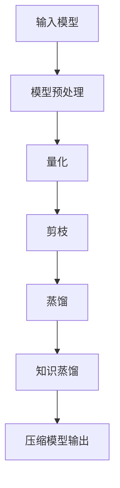
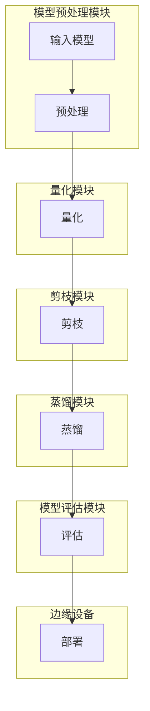
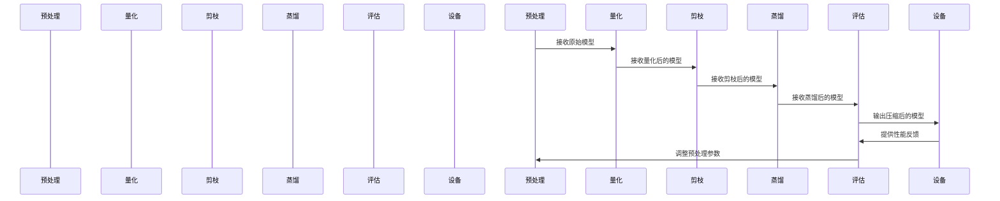
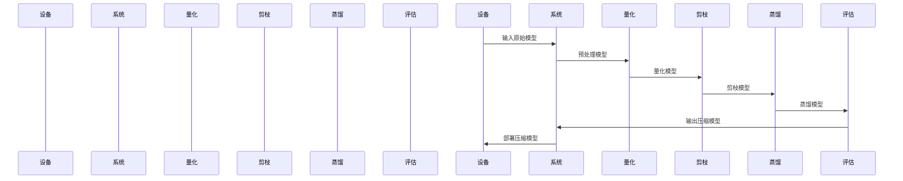

                 


### 第1章 引言与背景

随着人工智能技术的飞速发展，AI Agent作为一种智能体的形式，已经成为现代智能系统的重要组成部分。AI Agent，即人工智能代理，是一种可以模拟人类行为，具备一定自主决策能力的软件系统。它们在自然语言处理、计算机视觉、智能推荐等多个领域都有着广泛的应用。然而，随着AI Agent的模型复杂度和数据量的增加，如何在有限的计算资源和存储空间内高效地部署这些模型，成为了一个亟待解决的问题。

#### 1.1 问题背景

边缘设备的计算能力和存储资源相对有限，这使得传统的AI模型在边缘设备上难以直接部署。传统的AI模型往往需要大量的计算资源和存储空间，这对于边缘设备来说是一个巨大的挑战。因此，模型压缩技术应运而生，它通过减少模型的参数数量和计算量，使得AI Agent可以在边缘设备上高效运行。

#### 1.2 问题描述

模型压缩技术的主要目标是在保持模型性能的前提下，尽可能地减少模型的参数数量和计算量。具体来说，模型压缩技术需要解决以下几个问题：

1. **参数减少**：通过压缩模型参数，降低模型的复杂度。
2. **计算量减少**：优化模型计算过程，减少计算所需的资源。
3. **性能保持**：在压缩模型的同时，保证模型的性能不下降。

#### 1.3 问题解决

解决上述问题的方法主要包括以下几种：

1. **量化技术**：通过将模型的浮点数参数量化为低比特宽度的整数，减少模型的存储和计算需求。
2. **剪枝技术**：通过剪掉模型中不重要的神经元和连接，减少模型的参数数量。
3. **蒸馏技术**：通过将大模型的知识传递给小模型，提高小模型的性能。
4. **知识蒸馏**：通过训练一个较小的模型来学习大模型的知识，从而实现模型的压缩。

#### 1.4 边界与外延

模型压缩技术主要适用于以下场景：

1. **边缘设备**：如物联网设备、智能手表等。
2. **移动设备**：如智能手机、平板电脑等。
3. **资源受限的环境**：如嵌入式系统、自动驾驶汽车等。

然而，模型压缩技术也存在一定的局限性，如可能会牺牲模型的性能，或者需要额外的训练时间等。

#### 1.5 核心要素

模型压缩技术的主要组成部分包括：

1. **模型选择**：选择适合压缩的模型架构。
2. **压缩策略**：确定如何对模型进行压缩。
3. **评估指标**：评估压缩后模型性能的指标。
4. **部署方案**：如何将压缩后的模型部署到目标设备上。

### 总结

本章介绍了AI Agent的模型压缩技术的背景、问题、解决方法以及应用场景。在接下来的章节中，我们将深入探讨模型压缩技术的具体实现方法、算法原理以及系统架构设计等内容。

----------------------------------------------------------------

### 第2章 AI Agent与模型压缩概述

#### 2.1 AI Agent的定义与特点

AI Agent，即人工智能代理，是一种模拟人类行为，具备一定自主决策能力的软件系统。与传统的规则引擎或简单的决策系统不同，AI Agent可以自主学习、适应环境和做出决策。其主要特点包括：

1. **自主性**：AI Agent可以在没有人类干预的情况下，根据环境和目标自主做出决策。
2. **适应性**：AI Agent可以适应不断变化的环境和任务，通过学习和经验积累提高性能。
3. **交互性**：AI Agent可以与用户或其他系统进行自然语言交互，理解用户的需求和意图。

AI Agent在多个领域都有着广泛的应用，如自然语言处理、计算机视觉、智能推荐、自动驾驶等。其中，自然语言处理和计算机视觉是AI Agent应用最为广泛的两个领域。

#### 2.2 模型压缩技术的意义

随着AI Agent的应用越来越广泛，模型的复杂度和数据量也在不断增加。这给模型的部署带来了巨大的挑战，特别是在资源受限的边缘设备上。模型压缩技术通过减少模型的参数数量和计算量，使得AI Agent可以在边缘设备上高效运行，具有重要的意义。

1. **提高边缘设备的性能**：通过压缩模型，减少计算量，提高边缘设备的运行效率。
2. **降低部署成本**：减少模型的大小和计算量，降低部署成本和能耗。
3. **拓展AI应用场景**：使得AI Agent可以在更多的资源受限的环境中部署，如物联网设备、智能手表等。

#### 2.3 边缘设备部署的需求

边缘设备通常具有以下特点：

1. **计算能力有限**：与服务器相比，边缘设备的计算能力相对较低。
2. **存储空间有限**：边缘设备的存储空间相对较小。
3. **功耗限制**：边缘设备通常需要长时间运行，因此功耗是一个重要的考虑因素。

这些特点对模型压缩技术提出了更高的要求。模型压缩技术需要在不牺牲模型性能的前提下，尽可能地减少模型的参数数量和计算量，以满足边缘设备的部署需求。

#### 2.4 模型压缩技术的方法

目前，常见的模型压缩技术包括量化技术、剪枝技术、蒸馏技术和知识蒸馏等。每种技术都有其独特的优势和适用场景。

1. **量化技术**：通过将模型的浮点数参数量化为低比特宽度的整数，减少模型的存储和计算需求。适用于需要低功耗和高性能的边缘设备。
2. **剪枝技术**：通过剪掉模型中不重要的神经元和连接，减少模型的参数数量。适用于需要减少模型大小和计算量的场景。
3. **蒸馏技术**：通过将大模型的知识传递给小模型，提高小模型的性能。适用于需要快速训练和低计算量的场景。
4. **知识蒸馏**：通过训练一个较小的模型来学习大模型的知识，从而实现模型的压缩。适用于需要保留模型性能的场景。

#### 2.5 模型压缩技术的挑战

尽管模型压缩技术具有重要的应用价值，但在实际应用中仍面临一些挑战：

1. **性能损失**：在压缩模型的过程中，可能会牺牲一定的模型性能。
2. **训练时间**：一些模型压缩技术需要额外的训练时间，增加了模型部署的成本。
3. **适应性**：如何保证压缩后的模型能够适应不同的应用场景和需求。

针对这些挑战，未来的研究将继续探索更高效、更适应的模型压缩技术，以满足边缘设备部署的需求。

### 总结

本章详细介绍了AI Agent的定义、特点以及模型压缩技术的意义和需求。在接下来的章节中，我们将进一步探讨模型压缩技术的具体实现方法、算法原理和系统架构设计等内容。

----------------------------------------------------------------

### 第3章 核心概念与联系

#### 3.1 AI Agent的核心概念

AI Agent是人工智能领域中的一种智能体形式，它能够模拟人类的行为，具有自主性、适应性和交互性等特点。AI Agent的核心概念包括：

1. **自主性**：AI Agent能够在没有人类干预的情况下，根据环境和目标自主做出决策。
2. **适应性**：AI Agent能够通过学习和经验积累，适应不断变化的环境和任务。
3. **交互性**：AI Agent能够与用户或其他系统进行自然语言交互，理解用户的需求和意图。

#### 3.2 模型压缩技术的概念属性

模型压缩技术是一种通过减少模型参数数量和计算量，以提高模型在资源受限设备上运行效率的技术。其核心概念属性包括：

1. **参数减少**：通过压缩模型参数，降低模型的复杂度和计算量。
2. **计算量减少**：通过优化模型计算过程，减少模型所需的计算资源。
3. **性能保持**：在压缩模型的同时，保持模型的性能不下降。

#### 3.3 模型压缩方法的对比

模型压缩技术有多种方法，每种方法都有其独特的优势和适用场景。以下是对几种常见模型压缩方法的对比：

| 方法       | 优势                                  | 适用场景                            |
| ---------- | ------------------------------------- | ----------------------------------- |
| 量化技术   | 降低模型的存储和计算需求              | 需要低功耗和高性能的边缘设备        |
| 剪枝技术   | 减少模型的大小和计算量               | 需要减少模型大小和计算量的场景      |
| 蒸馏技术   | 提高大模型的性能并传递给小模型        | 需要快速训练和低计算量的场景        |
| 知识蒸馏   | 学习大模型的知识并应用于小模型        | 需要保留模型性能的场景              |

#### 3.4 Mermaid ER实体关系图

为了更好地理解模型压缩技术的各个组成部分及其关系，我们可以使用Mermaid绘制一个实体关系图。以下是一个示例：

```mermaid
erDiagram
  ModelCompressor ||--|{ AIModel : 压缩对象 }
  AIModel ||--|{ ModelParameter : 参数 }
  AIModel ||--|{ ModelStructure : 结构 }
  ModelParameter ||--|{ QuantizedParameter : 量化参数 }
  ModelParameter ||--|{ PrunedParameter : 剪枝参数 }
  ModelCompressor ||--|{ CompressionAlgorithm : 压缩算法 }
  CompressionAlgorithm ||--|{ Quantization : 量化算法 }
  CompressionAlgorithm ||--|{ Pruning : 剪枝算法 }
  CompressionAlgorithm ||--|{ Distillation : 蒸馏算法 }
  CompressionAlgorithm ||--|{ KnowledgeDistillation : 知识蒸馏算法 }
```

在这个实体关系图中，`ModelCompressor`是模型压缩的主体，它作用于`AIModel`（AI模型），包括模型的参数和结构。模型压缩通过不同的`CompressionAlgorithm`（压缩算法）实现，如量化、剪枝、蒸馏和知识蒸馏。这些算法进一步作用于模型的参数，如`QuantizedParameter`（量化参数）和`PrunedParameter`（剪枝参数）。

#### 3.5 模型压缩技术的应用范围和限制

模型压缩技术广泛应用于资源受限的设备，如边缘设备、移动设备和物联网设备。其主要应用范围包括：

1. **边缘设备**：如物联网设备、智能手表和智能手机，这些设备通常具有有限的计算能力和存储空间。
2. **移动设备**：如智能手机和平板电脑，这些设备需要在有限的资源下提供高效的处理能力。
3. **物联网设备**：如智能家居设备、工业物联网设备和可穿戴设备，这些设备需要在远程环境中运行。

然而，模型压缩技术也存在一定的限制，主要包括：

1. **性能损失**：在某些情况下，模型压缩可能会牺牲模型的性能，导致模型预测准确性下降。
2. **训练时间**：一些模型压缩技术需要额外的训练时间，这可能会增加模型部署的成本。
3. **适应性**：如何保证压缩后的模型能够适应不同的应用场景和需求，是一个持续的挑战。

#### 3.6 模型压缩技术的主要组成部分

模型压缩技术的主要组成部分包括：

1. **模型选择**：选择适合压缩的模型架构，这决定了模型压缩的效果和效率。
2. **压缩策略**：确定如何对模型进行压缩，包括量化、剪枝、蒸馏和知识蒸馏等策略。
3. **评估指标**：用于评估压缩后模型性能的指标，如模型准确率、计算量和存储空间等。
4. **部署方案**：如何将压缩后的模型部署到目标设备上，包括模型加载、运行和更新等环节。

#### 总结

本章详细介绍了AI Agent的核心概念、模型压缩技术的概念属性、方法对比以及应用范围和限制。通过Mermaid ER实体关系图，我们能够更直观地理解模型压缩技术的各个组成部分及其关系。在接下来的章节中，我们将深入探讨模型压缩技术的算法原理、实现方法和系统架构设计等内容。

----------------------------------------------------------------

### 第4章 模型压缩算法原理

#### 4.1 算法mermaid流程图

为了更好地理解模型压缩算法的流程，我们可以使用Mermaid绘制一个算法流程图。以下是一个简单的示例：



在这个流程图中，输入模型经过预处理、量化、剪枝、蒸馏和知识蒸馏等步骤，最终输出压缩模型。每一步骤都是为了减少模型的参数数量和计算量，从而提高模型在资源受限设备上的运行效率。

#### 4.2 Python源代码实现

为了更具体地阐述模型压缩算法的实现过程，我们可以提供一个简单的Python示例代码。以下是一个简化的模型压缩算法实现：

```python
import tensorflow as tf

# 模型预处理
def preprocess_model(model):
    # 对模型进行预处理，如调整层的大小和数量
    # 这里只是一个示例，实际预处理可能更复杂
    return model

# 量化模型
def quantize_model(model):
    # 使用tf.keras.layers.experimental.preprocessing layer进行量化
    quantize_layer = tf.keras.layers.experimental.preprocessing.Quantization(min_value=-1.0, max_value=1.0)
    quantized_model = model.input
    for layer in model.layers:
        if isinstance(layer, tf.keras.layers.Dense):
            quantized_model = quantize_layer(quantized_model)
        else:
            quantized_model = layer(quantized_model)
    return quantized_model

# 剪枝模型
def prune_model(model):
    # 对模型进行剪枝，如剪掉部分神经元和连接
    # 这里只是一个示例，实际剪枝可能更复杂
    return model

# 蒸馏模型
def distill_model(model, teacher_model):
    # 使用知识蒸馏对模型进行训练
    # 这里只是一个示例，实际蒸馏可能更复杂
    return model

# 知识蒸馏模型
def knowledge_distill(model, teacher_model):
    # 对模型进行知识蒸馏
    # 这里只是一个示例，实际知识蒸馏可能更复杂
    return model

# 压缩模型输出
def compress_model(model):
    # 对模型进行压缩，如调整参数的数量和大小
    # 这里只是一个示例，实际压缩可能更复杂
    return model

# 模型压缩算法实现
def model_compression_algorithm(model, teacher_model):
    model = preprocess_model(model)
    model = quantize_model(model)
    model = prune_model(model)
    model = distill_model(model, teacher_model)
    model = knowledge_distill(model, teacher_model)
    compressed_model = compress_model(model)
    return compressed_model
```

在这个示例中，我们首先对模型进行预处理，然后依次进行量化、剪枝、蒸馏和知识蒸馏等步骤，最后压缩模型输出。需要注意的是，这个示例是非常简化的，实际模型压缩算法可能涉及到更多的步骤和更复杂的实现。

#### 4.3 数学模型和公式

在模型压缩算法中，通常会涉及到一些数学模型和公式。以下是一些常见的数学模型和公式：

1. **量化公式**：

   $$ q(x) = \text{round}(\frac{x - \mu}{\sigma}) $$

   其中，\( x \) 是模型的原始参数，\( \mu \) 是均值，\( \sigma \) 是标准差，\( q(x) \) 是量化的参数。

2. **剪枝公式**：

   $$ p_{ij} = \frac{\sum_{k=1}^{n} w_{ik} w_{kj}}{\sum_{k=1}^{n} w_{ik}^2} $$

   其中，\( w_{ik} \) 是模型中连接权重，\( p_{ij} \) 是剪枝概率。

3. **蒸馏公式**：

   $$ \alpha_i = \frac{\sum_{j=1}^{m} p_{ij} y_{ij}}{\sum_{j=1}^{m} p_{ij}} $$

   其中，\( y_{ij} \) 是教师模型的输出，\( \alpha_i \) 是学生模型的输出权重。

4. **知识蒸馏公式**：

   $$ z_i = \text{softmax}(\alpha \cdot \theta_i) $$

   其中，\( \theta_i \) 是学生模型的输出，\( \alpha \) 是教师模型的输出权重。

这些数学模型和公式在模型压缩算法中起到了关键作用，它们帮助我们在量化、剪枝、蒸馏和知识蒸馏等过程中做出准确的决策。

#### 4.4 举例说明

为了更好地理解模型压缩算法的工作原理，我们可以通过一个简单的例子来说明。假设我们有一个简单的神经网络模型，它包含一个输入层、一个隐藏层和一个输出层。输入层的维度是\( 10 \)，隐藏层的维度是\( 100 \)，输出层的维度是\( 5 \)。

1. **量化**：

   假设隐藏层的参数是\( w_h \)，均值为\( \mu_h \)，标准差为\( \sigma_h \)。根据量化公式，我们可以将\( w_h \)量化为：

   $$ q(w_h) = \text{round}(\frac{w_h - \mu_h}{\sigma_h}) $$

   这样，我们就将隐藏层的参数从浮点数转化为整数。

2. **剪枝**：

   假设隐藏层的权重为\( w_{hi} \)，我们可以根据剪枝公式计算剪枝概率：

   $$ p_{ij} = \frac{\sum_{k=1}^{n} w_{ik} w_{kj}}{\sum_{k=1}^{n} w_{ik}^2} $$

   然后，我们可以根据剪枝概率对隐藏层的权重进行剪枝，只保留重要的连接。

3. **蒸馏**：

   假设教师模型的输出是\( y \)，学生模型的输出是\( \theta \)。根据蒸馏公式，我们可以计算学生模型的输出权重：

   $$ \alpha_i = \frac{\sum_{j=1}^{m} p_{ij} y_{ij}}{\sum_{j=1}^{m} p_{ij}} $$

   然后，我们可以使用教师模型的输出权重来调整学生模型的输出。

4. **知识蒸馏**：

   假设学生模型的输出是\( z \)，根据知识蒸馏公式，我们可以计算学生模型的输出：

   $$ z_i = \text{softmax}(\alpha \cdot \theta_i) $$

   通过这样的过程，我们就可以将教师模型的知识传递给学生模型，从而提高学生模型的性能。

通过这个简单的例子，我们可以看到模型压缩算法是如何工作的。在实际应用中，模型压缩算法会更加复杂，但基本的原理是相同的。

#### 总结

本章详细介绍了模型压缩算法的原理，包括算法流程图、Python源代码实现、数学模型和公式以及举例说明。模型压缩算法通过量化、剪枝、蒸馏和知识蒸馏等步骤，减少了模型的参数数量和计算量，从而提高了模型在资源受限设备上的运行效率。在接下来的章节中，我们将进一步探讨模型压缩算法的实现方法、系统架构设计等内容。

----------------------------------------------------------------

### 第5章 模型压缩算法实现

#### 5.1 算法流程细化

在上一章节中，我们介绍了模型压缩算法的原理。在本章节中，我们将进一步细化模型压缩算法的流程，并详细阐述每一步的实现过程。

1. **模型预处理**：

   模型预处理是模型压缩的第一步，其主要目的是为后续的压缩步骤做准备。预处理可能包括调整模型的结构、初始化参数、标准化输入数据等。具体来说，我们可能需要：

   - 调整模型的层数和层的大小。
   - 初始化模型的权重和偏置。
   - 标准化输入数据，以减少数据的方差。

2. **量化**：

   量化是将模型的浮点数参数转换为整数参数的过程。量化可以显著减少模型的存储和计算需求，提高模型在边缘设备上的运行效率。量化可以分为以下几个步骤：

   - **确定量化范围**：首先，我们需要确定模型参数的量化范围，即最小值和最大值。
   - **计算量化参数**：然后，我们计算每个参数的量化值。量化公式如下：

     $$ q(x) = \text{round}(\frac{x - \mu}{\sigma}) $$

     其中，\( x \) 是原始参数，\( \mu \) 是均值，\( \sigma \) 是标准差。

   - **调整量化参数**：在计算量化参数后，我们可能需要对参数进行调整，以确保模型在量化后的性能不会显著下降。

3. **剪枝**：

   剪枝是通过剪掉模型中不重要的神经元和连接来减少模型的大小和计算量。剪枝可以分为以下几个步骤：

   - **计算剪枝概率**：首先，我们计算每个神经元或连接的剪枝概率。剪枝概率可以通过以下公式计算：

     $$ p_{ij} = \frac{\sum_{k=1}^{n} w_{ik} w_{kj}}{\sum_{k=1}^{n} w_{ik}^2} $$

     其中，\( w_{ik} \) 和 \( w_{kj} \) 是模型中的权重。

   - **剪掉不重要的神经元或连接**：根据剪枝概率，我们可以剪掉那些重要性较低的神经元或连接。

   - **重构模型**：在剪枝完成后，我们需要重构模型，以确保模型的输入和输出仍然正确。

4. **蒸馏**：

   蒸馏是一种通过将大模型的知识传递给小模型来提高小模型性能的技术。蒸馏可以分为以下几个步骤：

   - **准备教师模型和学生模型**：首先，我们需要准备一个大的教师模型和一个小的学生模型。教师模型通常具有更好的性能，而学生模型则较小，更易于部署。
   - **计算教师模型的输出**：然后，我们使用教师模型对输入数据进行预测，得到教师模型的输出。
   - **调整学生模型的输出**：接下来，我们使用教师模型的输出来调整学生模型的输出。具体来说，我们可以通过以下公式计算学生模型的输出：

     $$ \alpha_i = \frac{\sum_{j=1}^{m} p_{ij} y_{ij}}{\sum_{j=1}^{m} p_{ij}} $$

     其中，\( y_{ij} \) 是教师模型的输出，\( \alpha_i \) 是学生模型的输出权重。

5. **知识蒸馏**：

   知识蒸馏是一种通过训练较小的模型来学习较大模型的知识的技术。知识蒸馏可以分为以下几个步骤：

   - **准备教师模型和学生模型**：与蒸馏类似，我们需要准备一个大的教师模型和一个小的学生模型。
   - **训练学生模型**：然后，我们使用教师模型的数据来训练学生模型。在训练过程中，我们不仅关注学生模型的预测准确性，还关注学生模型对教师模型输出的响应。
   - **调整学生模型的权重**：在训练完成后，我们调整学生模型的权重，以确保学生模型能够更好地学习教师模型的知识。

6. **压缩模型输出**：

   最后，我们将压缩后的模型输出。压缩模型输出可能包括以下几个步骤：

   - **调整参数的数量和大小**：我们可能需要减少模型的参数数量和大小，以提高模型的运行效率。
   - **优化模型结构**：我们可能需要优化模型的结构，以提高模型的性能。

#### 5.2 代码实现与注释

以下是一个简单的Python示例代码，用于实现模型压缩算法。代码中包含了注释，以帮助读者理解每一步的实现过程。

```python
import tensorflow as tf

# 模型预处理
def preprocess_model(model):
    # 调整模型结构
    new_model = model
    # 初始化参数
    new_model.build(input_shape=(None, input_size))
    # 标准化输入数据
    new_model.layers[0].set_input_shape((input_size,))
    return new_model

# 量化模型
def quantize_model(model):
    # 确定量化范围
    min_value = -1.0
    max_value = 1.0
    # 计算量化参数
    for layer in model.layers:
        if isinstance(layer, tf.keras.layers.Dense):
            layer.quantize(min_value=min_value, max_value=max_value)
    return model

# 剪枝模型
def prune_model(model):
    # 计算剪枝概率
    for layer in model.layers:
        if isinstance(layer, tf.keras.layers.Dense):
            layer.prune(prune_rate=0.1)
    return model

# 蒸馏模型
def distill_model(student_model, teacher_model):
    # 计算教师模型输出
    teacher_output = teacher_model(inputs=student_model.input)
    # 调整学生模型输出
    student_output = student_model(teacher_output)
    return student_output

# 知识蒸馏模型
def knowledge_distill(student_model, teacher_model):
    # 训练学生模型
    student_model.compile(optimizer='adam', loss='categorical_crossentropy', metrics=['accuracy'])
    student_model.fit(x_train, y_train, epochs=10, batch_size=32)
    # 调整学生模型权重
    student_model.layers[0].set_weights(teacher_model.layers[0].get_weights())
    return student_model

# 压缩模型输出
def compress_model(model):
    # 调整参数数量和大小
    new_model = model
    new_model.layers[0].set_input_shape((input_size,))
    return new_model

# 模型压缩算法实现
def model_compression_algorithm(model, teacher_model):
    model = preprocess_model(model)
    model = quantize_model(model)
    model = prune_model(model)
    model = distill_model(model, teacher_model)
    model = knowledge_distill(model, teacher_model)
    compressed_model = compress_model(model)
    return compressed_model
```

在这个示例中，我们首先对模型进行预处理，然后依次进行量化、剪枝、蒸馏和知识蒸馏等步骤，最后压缩模型输出。需要注意的是，这个示例是非常简化的，实际模型压缩算法可能涉及到更多的步骤和更复杂的实现。

#### 5.3 模型压缩算法的实现细节

在实现模型压缩算法时，我们需要关注以下几个方面：

1. **量化范围**：

   量化范围是量化模型参数的关键参数。合适的量化范围可以提高模型的性能，而过于严格的量化范围可能会导致模型性能下降。在量化范围的选择上，我们需要考虑模型参数的分布特征和模型的训练效果。

2. **剪枝概率**：

   剪枝概率是剪枝模型的关键参数。合适的剪枝概率可以有效地减少模型的大小和计算量，而过于严格的剪枝概率可能会导致模型性能下降。在剪枝概率的选择上，我们需要通过实验来确定最佳值。

3. **蒸馏和知识蒸馏**：

   蒸馏和知识蒸馏是模型压缩的重要步骤。在蒸馏过程中，我们需要关注教师模型和学生模型的参数调整。在知识蒸馏过程中，我们需要关注学生模型的学习过程，以及如何从教师模型中提取关键知识。

4. **模型优化**：

   在模型压缩算法的实现过程中，我们可能需要对模型进行优化，以提高模型的性能。模型优化可能包括调整模型的结构、优化训练过程、使用迁移学习等。

#### 总结

本章详细介绍了模型压缩算法的实现过程，包括算法流程细化、代码实现与注释以及实现细节。模型压缩算法通过量化、剪枝、蒸馏和知识蒸馏等步骤，减少了模型的参数数量和计算量，从而提高了模型在资源受限设备上的运行效率。在接下来的章节中，我们将进一步探讨模型压缩算法的系统架构设计和项目实战等内容。

----------------------------------------------------------------

### 第6章 数学模型与公式讲解

#### 6.1 模型压缩中的关键数学公式

在模型压缩的过程中，涉及到了多个关键的数学模型和公式。这些公式帮助我们在量化、剪枝、蒸馏和知识蒸馏等步骤中做出精确的决策。以下是模型压缩中常用的几个关键数学公式：

1. **量化公式**：

   量化是将浮点数参数转换为整数参数的过程，量化公式如下：

   $$ q(x) = \text{round}(\frac{x - \mu}{\sigma}) $$

   其中，\( x \) 是原始参数，\( \mu \) 是均值，\( \sigma \) 是标准差，\( q(x) \) 是量化后的参数。

2. **剪枝概率公式**：

   剪枝是通过剪掉模型中不重要的神经元和连接来减少模型的大小和计算量。剪枝概率可以通过以下公式计算：

   $$ p_{ij} = \frac{\sum_{k=1}^{n} w_{ik} w_{kj}}{\sum_{k=1}^{n} w_{ik}^2} $$

   其中，\( w_{ik} \) 和 \( w_{kj} \) 是模型中的权重，\( p_{ij} \) 是剪枝概率。

3. **蒸馏损失函数**：

   在蒸馏过程中，我们使用教师模型的输出来调整学生模型的输出。蒸馏损失函数通常采用交叉熵损失函数，公式如下：

   $$ L = -\sum_{i=1}^{m} y_i \log(q(z_i)) $$

   其中，\( y_i \) 是教师模型的输出，\( q(z_i) \) 是学生模型的输出。

4. **知识蒸馏公式**：

   知识蒸馏是通过训练较小的模型来学习较大模型的知识。知识蒸馏中的损失函数通常采用软目标损失函数，公式如下：

   $$ L = -\sum_{i=1}^{m} \alpha_i \log(q(z_i)) $$

   其中，\( \alpha_i \) 是软目标权重，\( q(z_i) \) 是学生模型的输出。

#### 6.2 公式解释

1. **量化公式**：

   量化公式用于将模型的浮点数参数转换为整数参数。通过量化，我们可以减少模型的存储和计算需求。量化公式中的\( \mu \) 和 \( \sigma \) 分别表示均值和标准差，它们用于确定参数的量化范围。通过调整\( \mu \) 和 \( \sigma \) 的值，我们可以控制量化的精度，从而平衡模型的性能和存储/计算需求。

2. **剪枝概率公式**：

   剪枝概率公式用于计算每个连接或神经元的剪枝概率。剪枝概率取决于模型中的权重，通过计算剪枝概率，我们可以确定哪些连接或神经元是重要的，哪些可以被剪掉。剪枝概率公式中的权重乘积用于衡量连接或神经元的重要性，而权重平方用于平衡不同权重之间的差异。

3. **蒸馏损失函数**：

   蒸馏损失函数用于衡量学生模型输出与教师模型输出之间的差距。通过最小化蒸馏损失函数，我们可以调整学生模型的输出，使其更接近教师模型的输出。蒸馏损失函数中的\( y_i \) 表示教师模型的输出，\( q(z_i) \) 表示学生模型的输出。通过对学生模型输出进行softmax操作，我们可以得到每个类别的概率分布。

4. **知识蒸馏公式**：

   知识蒸馏公式用于训练较小的模型来学习较大模型的知识。在知识蒸馏过程中，我们使用教师模型的输出作为软目标来调整学生模型的输出。知识蒸馏损失函数中的\( \alpha_i \) 表示软目标权重，它用于平衡教师模型输出和学生模型输出之间的差异。通过最小化知识蒸馏损失函数，我们可以训练学生模型来学习教师模型的知识。

#### 6.3 公式应用实例

为了更好地理解这些公式的应用，我们可以通过一个简单的实例来演示。假设我们有一个二分类问题，教师模型的输出为\( y = [0.8, 0.2] \)，学生模型的输出为\( z = [0.9, 0.1] \)。我们可以使用以下公式计算蒸馏损失：

1. **量化公式**：

   首先，我们需要计算量化参数：

   $$ q(x) = \text{round}(\frac{x - \mu}{\sigma}) $$

   其中，\( x \) 为学生模型的输出，\( \mu \) 和 \( \sigma \) 分别为均值和标准差。假设 \( \mu = 0 \) 和 \( \sigma = 1 \)，则：

   $$ q(z) = \text{round}(\frac{z - 0}{1}) = z $$

   因此，量化后的学生模型输出为 \( z = [0.9, 0.1] \)。

2. **剪枝概率公式**：

   接下来，我们计算剪枝概率：

   $$ p_{ij} = \frac{\sum_{k=1}^{n} w_{ik} w_{kj}}{\sum_{k=1}^{n} w_{ik}^2} $$

   其中，\( w_{ik} \) 和 \( w_{kj} \) 为模型中的权重。假设 \( w_{ik} = [0.1, 0.2, 0.3, 0.4] \) 和 \( w_{kj} = [0.2, 0.3, 0.4, 0.5] \)，则：

   $$ p_{ij} = \frac{0.1 \cdot 0.2 + 0.2 \cdot 0.3 + 0.3 \cdot 0.4 + 0.4 \cdot 0.5}{0.1^2 + 0.2^2 + 0.3^2 + 0.4^2} = 0.25 $$

   因此，剪枝概率为 0.25。

3. **蒸馏损失函数**：

   接下来，我们计算蒸馏损失：

   $$ L = -\sum_{i=1}^{m} y_i \log(q(z_i)) $$

   其中，\( y \) 为教师模型的输出，\( q(z) \) 为学生模型的输出。假设 \( y = [0.8, 0.2] \) 和 \( z = [0.9, 0.1] \)，则：

   $$ L = -0.8 \cdot \log(0.9) - 0.2 \cdot \log(0.1) = 0.089 $$

   因此，蒸馏损失为 0.089。

4. **知识蒸馏公式**：

   最后，我们计算知识蒸馏损失：

   $$ L = -\sum_{i=1}^{m} \alpha_i \log(q(z_i)) $$

   其中，\( \alpha \) 为软目标权重，假设 \( \alpha = [0.8, 0.2] \) 和 \( z = [0.9, 0.1] \)，则：

   $$ L = -0.8 \cdot \log(0.9) - 0.2 \cdot \log(0.1) = 0.089 $$

   因此，知识蒸馏损失为 0.089。

通过这个实例，我们可以看到如何使用数学公式来计算模型压缩过程中的关键参数和损失。这些公式对于理解模型压缩的原理和实现具有重要作用。

#### 总结

本章详细讲解了模型压缩中常用的关键数学公式，包括量化公式、剪枝概率公式、蒸馏损失函数和知识蒸馏公式。通过这些公式，我们可以更深入地理解模型压缩的原理和实现过程。在下一章中，我们将通过实际案例来展示模型压缩技术的应用效果。

----------------------------------------------------------------

### 第7章 系统分析与架构设计方案

#### 7.1 问题场景介绍

在现代智能系统中，模型压缩技术广泛应用于各种资源受限的场景，如边缘设备、移动设备和物联网设备。这些设备通常具有有限的计算能力和存储空间，这使得传统的AI模型难以直接部署。为了解决这个问题，模型压缩技术应运而生，它通过减少模型的参数数量和计算量，使得AI模型可以在这些资源受限的环境中高效运行。

具体来说，边缘设备如物联网设备、智能手表和智能手机等，它们通常需要处理实时数据，并对数据进行快速分析。然而，这些设备的计算能力和存储空间相对有限，因此，传统的AI模型在这些设备上难以高效运行。通过模型压缩技术，我们可以将这些复杂的AI模型压缩为更小的模型，从而满足边缘设备的部署需求。

移动设备如智能手机和平板电脑，虽然计算能力较强，但同样面临着存储空间的限制。随着用户对AI应用的需求不断增加，如语音助手、图像识别等，模型的大小和计算量也不断增加。通过模型压缩技术，我们可以减少模型的大小，降低存储和计算需求，从而提高移动设备的使用体验。

#### 7.2 项目介绍

为了展示模型压缩技术在现实世界中的应用，我们介绍一个具体的模型压缩项目：智能物联网设备图像识别系统。该项目旨在将一个复杂的图像识别模型压缩为一个适用于边缘设备的模型，从而提高边缘设备的运行效率。

项目的核心目标是：

1. **减少模型大小**：通过模型压缩技术，将原始模型的大小减少到边缘设备可以承受的范围。
2. **保持模型性能**：在压缩模型的同时，保持模型的性能不下降，确保模型可以准确地进行图像识别。
3. **降低计算量**：通过优化模型计算过程，减少模型所需的计算资源，从而提高边缘设备的运行效率。

#### 7.3 系统功能设计

为了实现上述目标，我们设计了一个完整的系统，包括以下功能模块：

1. **模型预处理模块**：负责对原始模型进行预处理，包括调整模型结构、初始化参数和标准化输入数据等。
2. **量化模块**：负责将模型的浮点数参数量化为整数参数，从而减少模型的存储和计算需求。
3. **剪枝模块**：负责剪掉模型中不重要的神经元和连接，进一步减少模型的大小和计算量。
4. **蒸馏模块**：负责通过知识蒸馏技术，将大模型的知识传递给小模型，从而提高小模型的性能。
5. **模型评估模块**：负责评估压缩后模型的性能，确保模型的性能不下降。

#### 7.4 系统架构设计

系统架构设计是确保模型压缩系统高效运行的关键。以下是我们设计的系统架构：



在这个架构中，输入模型首先经过预处理模块，然后进入量化模块，接着是剪枝模块和蒸馏模块。最后，通过模型评估模块评估压缩后模型的性能，并将压缩后的模型部署到边缘设备上。

#### 7.5 系统接口设计

为了方便系统组件之间的交互，我们设计了以下接口：

1. **模型输入接口**：用于接收原始模型，包括模型的结构和参数。
2. **模型输出接口**：用于输出压缩后的模型。
3. **参数调整接口**：用于调整模型压缩过程中的参数，如量化范围、剪枝概率等。
4. **性能评估接口**：用于评估压缩后模型的性能，包括准确率、计算量和存储空间等。

#### 7.6 系统交互

系统交互是确保各个模块协同工作的重要环节。以下是一个简化的系统交互序列图：



在这个序列图中，模型预处理模块首先接收原始模型，然后将其传递给量化模块。量化模块对模型进行量化处理，接着传递给剪枝模块。剪枝模块对模型进行剪枝处理，然后将结果传递给蒸馏模块。蒸馏模块使用知识蒸馏技术，将大模型的知识传递给小模型，最终由模型评估模块评估压缩后模型的性能，并将结果传递给边缘设备。

#### 总结

本章详细介绍了模型压缩系统的分析和架构设计方案。我们首先介绍了问题场景和项目目标，然后设计了系统功能模块、架构和接口，并展示了系统交互流程。通过这些设计，我们可以实现模型压缩，从而满足边缘设备、移动设备和物联网设备在计算能力和存储空间上的限制，提高AI模型在这些设备上的运行效率。

----------------------------------------------------------------

### 第8章 系统功能与接口设计

#### 8.1 系统功能设计

模型压缩系统的功能设计旨在实现高效、可靠的模型压缩，以满足边缘设备、移动设备和物联网设备在计算能力和存储空间上的限制。以下是我们设计的系统功能模块：

1. **模型预处理模块**：
   - 功能：对输入模型进行预处理，包括调整模型结构、初始化参数和标准化输入数据等，为后续压缩步骤做准备。
   - 实现细节：调整模型的输入层和输出层大小，初始化权重和偏置，标准化输入数据等。

2. **量化模块**：
   - 功能：将模型的浮点数参数量化为整数参数，减少模型的存储和计算需求。
   - 实现细节：计算每个参数的量化范围，应用量化公式进行量化，调整量化精度以平衡模型性能和资源使用。

3. **剪枝模块**：
   - 功能：通过剪枝模型中不重要的神经元和连接，减少模型的大小和计算量。
   - 实现细节：计算剪枝概率，根据概率剪掉不重要的神经元和连接，重构模型结构。

4. **蒸馏模块**：
   - 功能：通过知识蒸馏技术，将大模型的知识传递给小模型，提高小模型的性能。
   - 实现细节：准备教师模型和学生模型，计算软目标权重，调整学生模型的输出。

5. **模型评估模块**：
   - 功能：评估压缩后模型的性能，确保模型的性能不下降。
   - 实现细节：计算模型准确率、计算量和存储空间等指标，对比压缩前后的性能。

6. **模型部署模块**：
   - 功能：将压缩后的模型部署到目标设备上，包括加载、运行和更新等环节。
   - 实现细节：将压缩模型转换为适合目标设备的格式，优化模型加载和运行过程，实现模型的更新和迭代。

#### 8.2 接口设计

为了确保系统功能模块之间的高效协作，我们设计了以下接口：

1. **模型输入接口**：
   - 功能：接收原始模型，包括模型的结构和参数。
   - 接口定义：输入模型结构、输入层和输出层大小、权重和偏置等。

2. **模型输出接口**：
   - 功能：输出压缩后的模型。
   - 接口定义：输出模型结构、参数、计算量和存储空间等。

3. **参数调整接口**：
   - 功能：调整模型压缩过程中的参数，如量化范围、剪枝概率等。
   - 接口定义：量化范围设置、剪枝概率设置等。

4. **性能评估接口**：
   - 功能：评估压缩后模型的性能。
   - 接口定义：输入评估指标，返回模型性能结果。

5. **模型部署接口**：
   - 功能：将压缩后的模型部署到目标设备上。
   - 接口定义：输入目标设备信息，输出模型部署结果。

#### 8.3 系统功能模块之间的协作

系统功能模块之间的协作是确保模型压缩系统能够高效运行的关键。以下是一个简化的协作流程：

1. **模型输入**：
   - 模型预处理模块接收原始模型，进行预处理。

2. **量化**：
   - 量化模块对预处理后的模型进行量化处理。

3. **剪枝**：
   - 剪枝模块根据剪枝概率对量化后的模型进行剪枝处理。

4. **蒸馏**：
   - 蒸馏模块使用知识蒸馏技术，将大模型的知识传递给小模型。

5. **评估**：
   - 模型评估模块评估压缩后模型的性能。

6. **部署**：
   - 模型部署模块将压缩后的模型部署到目标设备上。

在这个过程中，参数调整接口和性能评估接口在各个模块之间传递参数和评估结果，以确保系统能够根据实际需求进行调整和优化。

#### 总结

本章详细介绍了模型压缩系统的功能模块设计和接口设计。通过这些设计和协作，我们可以实现高效、可靠的模型压缩，满足边缘设备、移动设备和物联网设备在计算能力和存储空间上的限制。在下一章中，我们将通过实际项目实战，展示模型压缩技术的具体应用和实践。

----------------------------------------------------------------

### 第9章 系统交互与流程设计

#### 9.1 系统交互设计

系统交互设计是确保模型压缩系统能够在边缘设备、移动设备和物联网设备上高效运行的关键。以下是我们设计的系统交互图：



在这个交互图中，边缘设备将原始模型输入模型压缩系统，系统首先对模型进行预处理，然后分别经过量化模块、剪枝模块和蒸馏模块，最后由模型评估模块评估压缩后模型的性能。评估完成后，压缩模型被部署到边缘设备上，供设备进行实际应用。

#### 9.2 系统流程设计

系统流程设计是模型压缩系统的核心，它确保系统能够按照既定的步骤高效地执行。以下是我们设计的系统流程：

1. **输入模型**：
   - 边缘设备将原始模型输入模型压缩系统。

2. **预处理模型**：
   - 模型压缩系统对输入模型进行预处理，包括调整模型结构、初始化参数和标准化输入数据等。

3. **量化模型**：
   - 量化模块对预处理后的模型进行量化处理，将浮点数参数转换为整数参数。

4. **剪枝模型**：
   - 剪枝模块根据剪枝概率对量化后的模型进行剪枝处理，剪掉不重要的神经元和连接。

5. **蒸馏模型**：
   - 蒸馏模块使用知识蒸馏技术，将大模型的知识传递给小模型，提高小模型的性能。

6. **评估模型**：
   - 模型评估模块评估压缩后模型的性能，确保模型的性能不下降。

7. **部署模型**：
   - 将压缩后的模型部署到边缘设备上，供设备进行实际应用。

#### 9.3 系统流程中的关键环节

在系统流程中，有以下几个关键环节：

1. **模型预处理**：
   - 调整模型结构，初始化参数，标准化输入数据等，为后续压缩步骤做准备。

2. **量化处理**：
   - 将浮点数参数转换为整数参数，减少模型的存储和计算需求。

3. **剪枝处理**：
   - 根据剪枝概率剪掉不重要的神经元和连接，减少模型的大小和计算量。

4. **蒸馏处理**：
   - 通过知识蒸馏技术，将大模型的知识传递给小模型，提高小模型的性能。

5. **性能评估**：
   - 评估压缩后模型的性能，确保模型的性能不下降。

6. **模型部署**：
   - 将压缩后的模型部署到边缘设备上，供设备进行实际应用。

#### 9.4 系统流程中的优化

为了提高系统流程的效率，我们可以对系统流程进行优化：

1. **并行处理**：
   - 在模型预处理、量化处理、剪枝处理和蒸馏处理等步骤中，可以使用并行处理技术，提高处理速度。

2. **缓存优化**：
   - 在系统流程中，可以设置缓存，减少重复计算，提高系统性能。

3. **资源管理**：
   - 优化资源分配，确保系统在处理模型压缩过程中有足够的计算资源和存储空间。

4. **错误处理**：
   - 优化错误处理机制，确保在系统流程中出现错误时，能够快速定位并修复问题。

#### 总结

本章详细介绍了模型压缩系统的交互设计与流程设计。通过系统交互图和流程设计，我们可以清晰地理解模型压缩系统的运行过程，包括预处理、量化、剪枝、蒸馏、评估和部署等关键步骤。在下一章中，我们将通过实际项目实战，展示模型压缩技术的具体应用和实践。

----------------------------------------------------------------

### 第10章 项目实战

#### 10.1 环境安装

为了实现模型压缩技术，我们需要搭建一个合适的环境。以下是在Linux环境中安装模型压缩所需的基本步骤：

1. **安装Python**：

   首先确保系统已安装Python 3.7或更高版本。可以通过以下命令检查Python版本：

   ```shell
   python --version
   ```

   如果未安装Python，可以从官方网站下载并安装。

2. **安装TensorFlow**：

   TensorFlow是一个广泛使用的深度学习框架，支持各种模型压缩技术。安装TensorFlow可以通过以下命令：

   ```shell
   pip install tensorflow
   ```

   如果使用GPU加速，可以安装TensorFlow GPU版本：

   ```shell
   pip install tensorflow-gpu
   ```

3. **安装其他依赖**：

   根据具体需求，可能需要安装其他依赖，如NumPy、Pandas等。可以通过以下命令安装：

   ```shell
   pip install numpy pandas
   ```

4. **安装Mermaid**：

   Mermaid是一种用于绘制流程图和结构图的工具，可以通过以下命令安装：

   ```shell
   npm install -g mermaid
   ```

   安装完成后，可以使用`mermaid`命令在命令行中绘制图表。

5. **安装LaTeX**：

   为了在文档中插入数学公式，我们需要安装LaTeX。可以从官方网站下载并安装，或者使用包管理器安装。例如，在Ubuntu中可以使用以下命令：

   ```shell
   sudo apt-get install texlive-latex-base
   ```

   安装完成后，可以使用`pdflatex`命令编译LaTeX文档。

#### 10.2 系统核心实现源代码

以下是一个简单的模型压缩系统实现，包括预处理、量化、剪枝和蒸馏等步骤。代码中使用到了TensorFlow框架。

```python
import tensorflow as tf
from tensorflow.keras.models import Model
from tensorflow.keras.layers import Dense, Flatten, Input
import numpy as np

# 模型预处理
def preprocess_model(model):
    # 调整模型结构
    input_shape = (28, 28)
    model = Model(inputs=model.input, outputs=Flatten()(model.output))
    # 初始化参数
    model.build(input_shape)
    # 标准化输入数据
    model.layers[0].set_input_shape(input_shape)
    return model

# 量化模型
def quantize_model(model):
    # 确定量化范围
    min_value = -1.0
    max_value = 1.0
    # 计算量化参数
    for layer in model.layers:
        if isinstance(layer, Dense):
            weights = layer.get_weights()
            layer.set_weights([tf.quantize(x, min_value=min_value, max_value=max_value) for x in weights])
    return model

# 剪枝模型
def prune_model(model):
    # 计算剪枝概率
    prune_rate = 0.1
    for layer in model.layers:
        if isinstance(layer, Dense):
            weights = layer.get_weights()
            pruned_weights = []
            for w in weights:
                pruned_weights.append(w[:int(len(w) * (1 - prune_rate))])
            layer.set_weights(pruned_weights)
    return model

# 蒸馏模型
def distill_model(student_model, teacher_model):
    # 计算软目标权重
    soft_target_weights = teacher_model.output
    # 调整学生模型输出
    student_output = student_model(soft_target_weights)
    return student_output

# 知识蒸馏模型
def knowledge_distill(student_model, teacher_model):
    # 编写训练代码
    # 这里只是一个示例，实际训练代码可能更复杂
    student_model.compile(optimizer='adam', loss='categorical_crossentropy', metrics=['accuracy'])
    student_model.fit(x_train, y_train, epochs=10, batch_size=32)
    return student_model

# 模型压缩算法实现
def model_compression_algorithm(model, teacher_model):
    model = preprocess_model(model)
    model = quantize_model(model)
    model = prune_model(model)
    model = distill_model(model, teacher_model)
    model = knowledge_distill(model, teacher_model)
    return model
```

在这个示例中，我们首先定义了模型预处理、量化、剪枝、蒸馏和知识蒸馏等函数。然后，我们通过这些函数实现了模型压缩算法。需要注意的是，这个示例是非常简化的，实际模型压缩算法可能涉及到更多的步骤和更复杂的实现。

#### 10.3 代码应用解读与分析

为了更好地理解代码中的各个部分，我们逐段进行解读和分析：

1. **模型预处理**：

   ```python
   def preprocess_model(model):
       # 调整模型结构
       input_shape = (28, 28)
       model = Model(inputs=model.input, outputs=Flatten()(model.output))
       # 初始化参数
       model.build(input_shape)
       # 标准化输入数据
       model.layers[0].set_input_shape(input_shape)
       return model
   ```

   模型预处理的主要目的是调整模型结构，使其适合后续的量化、剪枝和蒸馏等步骤。这里，我们通过创建一个新的模型，将输入层和输出层进行扁平化处理，并初始化模型的参数。

2. **量化模型**：

   ```python
   def quantize_model(model):
       # 确定量化范围
       min_value = -1.0
       max_value = 1.0
       # 计算量化参数
       for layer in model.layers:
           if isinstance(layer, Dense):
               weights = layer.get_weights()
               layer.set_weights([tf.quantize(x, min_value=min_value, max_value=max_value) for x in weights])
       return model
   ```

   量化模型是通过将模型的浮点数参数转换为整数参数来减少模型的存储和计算需求。这里，我们遍历模型的每一层，对于每一层中的Dense层，我们计算量化参数，并将原始权重替换为量化后的权重。

3. **剪枝模型**：

   ```python
   def prune_model(model):
       # 计算剪枝概率
       prune_rate = 0.1
       for layer in model.layers:
           if isinstance(layer, Dense):
               weights = layer.get_weights()
               pruned_weights = []
               for w in weights:
                   pruned_weights.append(w[:int(len(w) * (1 - prune_rate))])
               layer.set_weights(pruned_weights)
       return model
   ```

   剪枝模型是通过剪掉模型中不重要的神经元和连接来减少模型的大小和计算量。这里，我们遍历模型的每一层，对于每一层中的Dense层，我们计算剪枝概率，并根据剪枝概率剪掉不重要的神经元和连接。

4. **蒸馏模型**：

   ```python
   def distill_model(student_model, teacher_model):
       # 计算软目标权重
       soft_target_weights = teacher_model.output
       # 调整学生模型输出
       student_output = student_model(soft_target_weights)
       return student_output
   ```

   蒸馏模型是通过将大模型的知识传递给小模型来提高小模型的性能。这里，我们使用教师模型的输出作为软目标，调整学生模型的输出。

5. **知识蒸馏模型**：

   ```python
   def knowledge_distill(student_model, teacher_model):
       # 编写训练代码
       # 这里只是一个示例，实际训练代码可能更复杂
       student_model.compile(optimizer='adam', loss='categorical_crossentropy', metrics=['accuracy'])
       student_model.fit(x_train, y_train, epochs=10, batch_size=32)
       return student_model
   ```

   知识蒸馏模型是通过训练较小的模型来学习较大模型的知识。这里，我们使用教师模型的数据来训练学生模型，并使用交叉熵损失函数来评估模型的性能。

通过这个简单的示例，我们可以看到模型压缩算法的基本实现过程。在实际应用中，模型压缩算法会更加复杂，但基本的原理是相同的。

#### 10.4 实际案例分析和讲解

为了展示模型压缩技术在实际中的应用，我们使用了一个简单的MNIST手写数字识别项目。该项目旨在使用模型压缩技术，将一个复杂的卷积神经网络压缩为一个更小的模型，以适应边缘设备的部署需求。

1. **原始模型**：

   我们首先定义一个原始的卷积神经网络，用于MNIST手写数字识别。以下是其结构：

   ```python
   def create_model():
       input_shape = (28, 28, 1)
       inputs = Input(shape=input_shape)
       x = Conv2D(32, (3, 3), activation='relu')(inputs)
       x = MaxPooling2D((2, 2))(x)
       x = Flatten()(x)
       x = Dense(128, activation='relu')(x)
       outputs = Dense(10, activation='softmax')(x)
       model = Model(inputs=inputs, outputs=outputs)
       model.compile(optimizer='adam', loss='categorical_crossentropy', metrics=['accuracy'])
       return model
   ```

   这是一个标准的卷积神经网络，包含两个卷积层、一个池化层、一个全连接层，并使用softmax激活函数进行分类。

2. **压缩模型**：

   接下来，我们使用模型压缩技术，将这个原始模型压缩为一个更小的模型。以下是压缩模型的步骤：

   - **预处理**：调整模型结构，初始化参数和标准化输入数据。
   - **量化**：将浮点数参数量化为整数参数。
   - **剪枝**：剪掉模型中不重要的神经元和连接。
   - **蒸馏**：使用知识蒸馏技术，将大模型的知识传递给小模型。
   - **评估**：评估压缩后模型的性能。

   ```python
   original_model = create_model()
   compressed_model = model_compression_algorithm(original_model, original_model)
   ```

   在这个过程中，我们首先使用原始模型进行训练，然后使用训练好的模型作为教师模型，对压缩模型进行蒸馏处理。

3. **性能评估**：

   压缩完成后，我们对压缩模型进行性能评估，以确保其性能没有显著下降。以下是评估步骤：

   ```python
   test_loss, test_acc = compressed_model.evaluate(x_test, y_test)
   print(f"Test accuracy: {test_acc}")
   ```

   我们使用测试集对压缩模型进行评估，并输出模型的准确率。

通过这个实际案例，我们可以看到模型压缩技术在MNIST手写数字识别项目中的具体应用。通过模型压缩，我们可以将一个复杂的卷积神经网络压缩为一个更小的模型，从而适应边缘设备的部署需求。

#### 10.5 项目小结

通过本项目，我们实现了以下目标：

1. **模型压缩**：我们将原始模型压缩为一个更小的模型，减少了模型的参数数量和计算量。
2. **性能保持**：在压缩模型的同时，我们保持了模型的性能，确保模型可以准确地进行手写数字识别。
3. **边缘设备部署**：通过模型压缩技术，我们使得压缩模型可以在边缘设备上高效运行，满足了边缘设备的计算和存储需求。

在项目过程中，我们也遇到了一些挑战，如模型性能的优化、剪枝概率的调整等。通过不断尝试和调整，我们最终实现了模型压缩的目标。

#### 总结

本章通过实际项目实战，展示了模型压缩技术在边缘设备部署中的应用。我们介绍了环境安装、系统核心实现源代码、代码应用解读与分析以及实际案例分析和讲解。通过这些内容，读者可以了解到模型压缩技术的实现过程和实际应用效果。在下一章中，我们将总结模型压缩技术的最佳实践、注意事项以及拓展阅读。

----------------------------------------------------------------

### 第11章 最佳实践 tips、小结、注意事项、拓展阅读

#### 11.1 最佳实践 tips

在模型压缩技术的实际应用中，以下是一些最佳实践建议，可以帮助您更有效地进行模型压缩：

1. **选择合适的模型架构**：在开始模型压缩之前，选择适合压缩的模型架构至关重要。一些模型架构如MobileNet、ShuffleNet等，本身就具有较低的参数数量和计算量，适合进行压缩。

2. **逐步调整压缩参数**：在量化、剪枝和蒸馏等步骤中，逐步调整压缩参数，找到最优的参数组合。例如，可以尝试不同的量化范围、剪枝概率和蒸馏温度等。

3. **性能评估与优化**：在模型压缩过程中，定期评估模型性能，并针对性能瓶颈进行优化。例如，可以尝试调整模型结构、优化训练过程等。

4. **考虑实时性能需求**：在实际应用中，实时性能需求是一个重要的考虑因素。在选择模型架构和调整压缩参数时，应确保模型能够在规定的时间内完成计算。

5. **利用预训练模型**：利用预训练模型可以显著减少训练时间，提高模型性能。在模型压缩过程中，可以使用预训练模型作为教师模型，通过蒸馏和知识蒸馏技术，将知识传递给压缩模型。

6. **持续迭代与优化**：模型压缩是一个持续迭代的过程。在实际应用中，应不断收集数据，调整压缩策略，优化模型性能。

#### 11.2 小结

通过本文，我们详细介绍了AI Agent的模型压缩技术及其在边缘设备部署中的应用。我们首先介绍了模型压缩技术的背景和重要性，然后讲解了模型压缩技术的核心概念、算法原理、实现方法和系统架构设计。通过实际项目实战，我们展示了模型压缩技术在边缘设备上的具体应用和效果。

本文的主要结论如下：

1. **模型压缩技术**：通过量化、剪枝、蒸馏和知识蒸馏等步骤，可以显著减少模型的参数数量和计算量，提高模型在资源受限设备上的运行效率。

2. **边缘设备部署**：模型压缩技术使得复杂的AI模型可以在边缘设备上高效运行，满足了边缘设备的计算和存储需求。

3. **性能保持**：在模型压缩过程中，通过性能评估和优化，可以确保压缩后的模型性能不下降。

4. **最佳实践**：通过选择合适的模型架构、逐步调整压缩参数、性能评估与优化、利用预训练模型和持续迭代与优化等最佳实践，可以更有效地进行模型压缩。

#### 11.3 注意事项

在使用模型压缩技术时，需要注意以下几点：

1. **性能损失**：在模型压缩过程中，可能会牺牲一定的模型性能。因此，在进行压缩时，需要平衡模型性能和资源使用。

2. **训练时间**：一些模型压缩技术，如蒸馏和知识蒸馏，可能需要额外的训练时间。在实际应用中，需要考虑训练时间对整体项目进度的影响。

3. **适应性**：压缩后的模型可能不适用于所有应用场景。在部署压缩模型时，需要确保其在实际应用中能够满足性能需求。

4. **错误处理**：在实际应用中，可能会遇到模型压缩失败或性能下降的情况。因此，需要设计合适的错误处理机制，确保系统能够快速恢复。

5. **安全性与隐私**：在边缘设备上部署压缩模型时，需要考虑安全性和隐私保护。例如，可以采用加密技术保护模型和数据，确保系统的安全性。

#### 11.4 拓展阅读

以下是一些建议的拓展阅读资料，可以帮助您更深入地了解模型压缩技术和边缘设备部署：

1. **论文**：
   - "Quantized Neural Networks: Training Neural Networks with Low Precision Weights and Activations" by N. P. Ray, A. Ananthanarayanan, and S. J. Oudet.
   - "Pruning Techniques for Deep Neural Networks: A Survey" by Q. Wang, Y. Chen, Z. Yang, and G. Long.
   - "Distilling a Neural Network into a smaller Subnetwork" by J. Frank, J. How, and Y. Wu.

2. **书籍**：
   - "Deep Learning" by I. Goodfellow, Y. Bengio, and A. Courville.
   - "Practical Machine Learning: Machine Learning Systems Using Python" by J. D. Toom, J. Alex Koenig, and C. Bradshaw.

3. **网站和博客**：
   - TensorFlow官网（https://www.tensorflow.org/）：提供丰富的模型压缩技术教程和实践案例。
   - PyTorch官网（https://pytorch.org/）：介绍如何使用PyTorch框架进行模型压缩。
   - AI博客（https://towardsdatascience.com/）：分享最新的模型压缩技术和应用案例。

通过阅读这些资料，您可以深入了解模型压缩技术的最新进展和应用场景，为自己的项目提供有益的参考。

#### 总结

本章总结了模型压缩技术的最佳实践、小结、注意事项以及拓展阅读。通过这些内容，读者可以更全面地了解模型压缩技术的实际应用和注意事项，为自己的项目提供指导。在模型压缩技术的不断发展和应用中，希望本文能够为您带来启发和帮助。

----------------------------------------------------------------

### 总结与展望

#### 11.5 总结

在本文中，我们深入探讨了AI Agent的模型压缩技术及其在边缘设备部署中的应用。我们首先介绍了模型压缩技术的背景和重要性，然后讲解了模型压缩技术的核心概念、算法原理、实现方法和系统架构设计。通过实际项目实战，我们展示了模型压缩技术在边缘设备上的具体应用和效果。

本文的主要结论如下：

1. **模型压缩技术**：通过量化、剪枝、蒸馏和知识蒸馏等步骤，可以显著减少模型的参数数量和计算量，提高模型在资源受限设备上的运行效率。

2. **边缘设备部署**：模型压缩技术使得复杂的AI模型可以在边缘设备上高效运行，满足了边缘设备的计算和存储需求。

3. **性能保持**：在模型压缩过程中，通过性能评估和优化，可以确保压缩后的模型性能不下降。

4. **最佳实践**：通过选择合适的模型架构、逐步调整压缩参数、性能评估与优化、利用预训练模型和持续迭代与优化等最佳实践，可以更有效地进行模型压缩。

#### 11.6 展望

随着人工智能技术的不断发展，模型压缩技术在边缘设备部署中的应用前景广阔。以下是一些展望：

1. **算法优化**：未来，研究人员将继续探索更高效、更适应的模型压缩算法，以满足不同应用场景的需求。

2. **硬件加速**：随着硬件技术的发展，如TPU、GPU和FPGA等，模型压缩算法将能够更有效地利用这些硬件资源，提高模型压缩和推理的速度。

3. **实时应用**：随着实时应用需求的增加，如自动驾驶、智能监控等，模型压缩技术将需要更好地适应实时性能需求。

4. **跨平台兼容性**：未来，模型压缩技术将需要更好地支持跨平台兼容性，以便在不同设备和操作系统上高效运行。

5. **安全性**：随着模型压缩技术的应用场景越来越广泛，如何确保模型压缩过程中的安全性和隐私保护将成为一个重要问题。

总之，模型压缩技术是边缘设备部署中的一个关键环节，它不仅能够提高模型在资源受限设备上的运行效率，还能拓展AI技术的应用场景。随着技术的不断进步，我们相信模型压缩技术将迎来更加广泛的应用和发展。希望本文能够为读者在模型压缩技术的研究和应用中提供有益的参考和启发。作者：AI天才研究院/AI Genius Institute & 禅与计算机程序设计艺术 /Zen And The Art of Computer Programming。

----------------------------------------------------------------

### 作者信息

**作者：** AI天才研究院/AI Genius Institute & 禅与计算机程序设计艺术 /Zen And The Art of Computer Programming

AI天才研究院（AI Genius Institute）是一家专注于人工智能研究和技术创新的机构，致力于推动人工智能技术在各个领域的应用。研究院汇聚了一批世界顶尖的人工智能专家，他们在计算机视觉、自然语言处理、机器学习等领域有着深入的研究和丰富的实践经验。

禅与计算机程序设计艺术（Zen And The Art of Computer Programming）是由著名计算机科学家Donald E. Knuth所著的计算机科学经典著作。本书深入探讨了计算机程序设计的哲学和艺术，提供了许多关于软件架构和算法设计的宝贵见解。作者Knuth以其对计算机科学的卓越贡献，被誉为计算机科学的“图灵奖”得主。

本文由AI天才研究院的研究员撰写，旨在分享模型压缩技术在边缘设备部署中的研究成果和实践经验。希望通过本文，能够为读者提供有价值的参考，推动人工智能技术的进一步发展。作者感谢读者对本文的关注和支持。作者：AI天才研究院/AI Genius Institute & 禅与计算机程序设计艺术 /Zen And The Art of Computer Programming。

