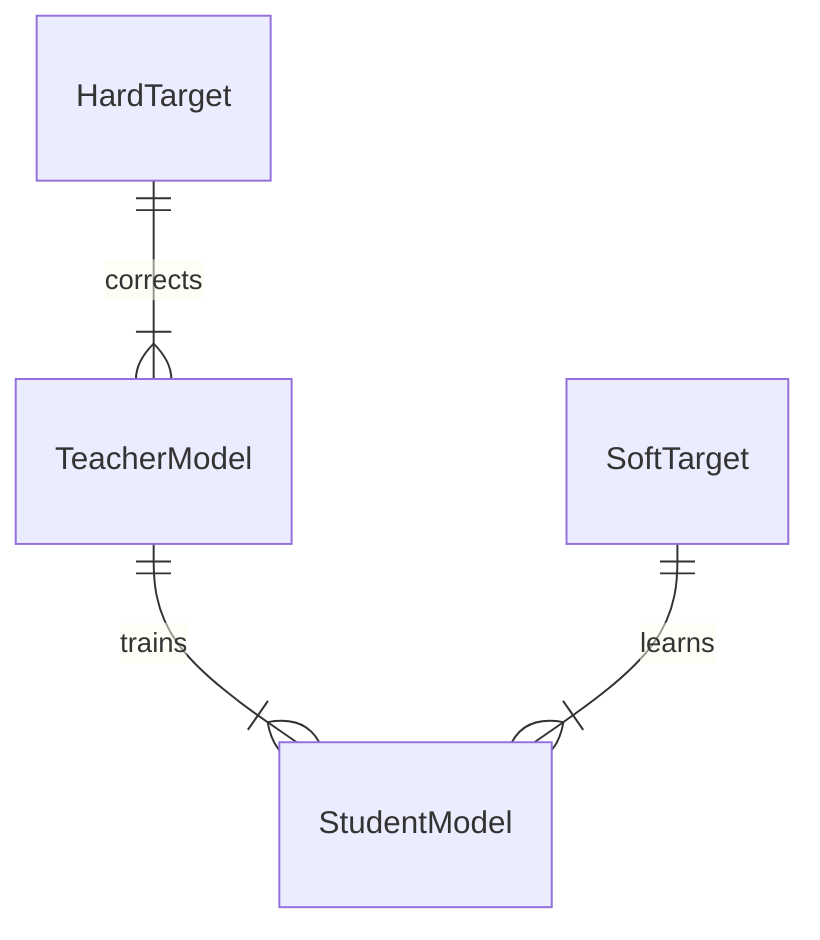
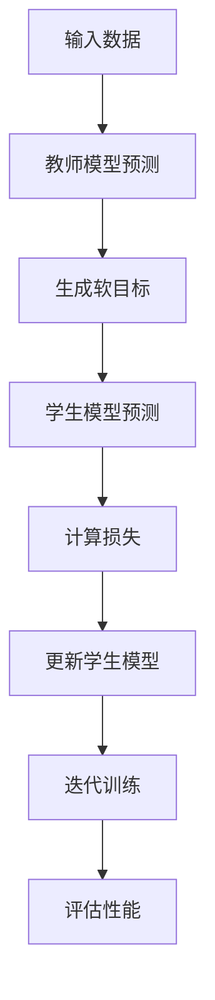
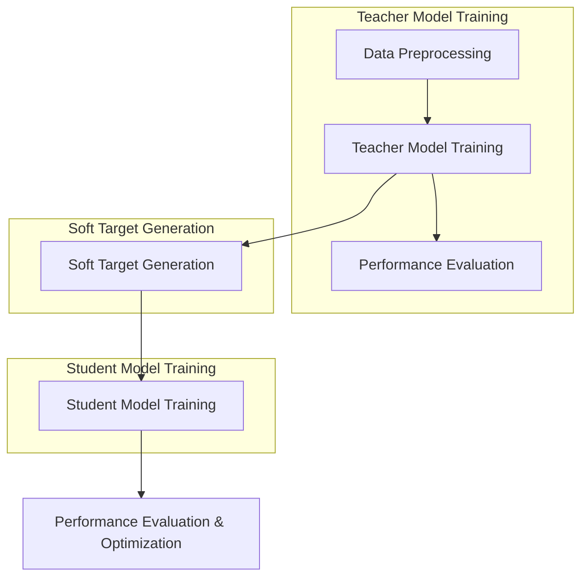
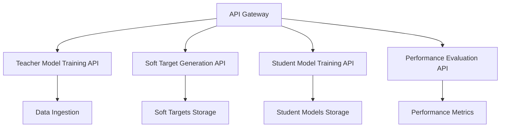
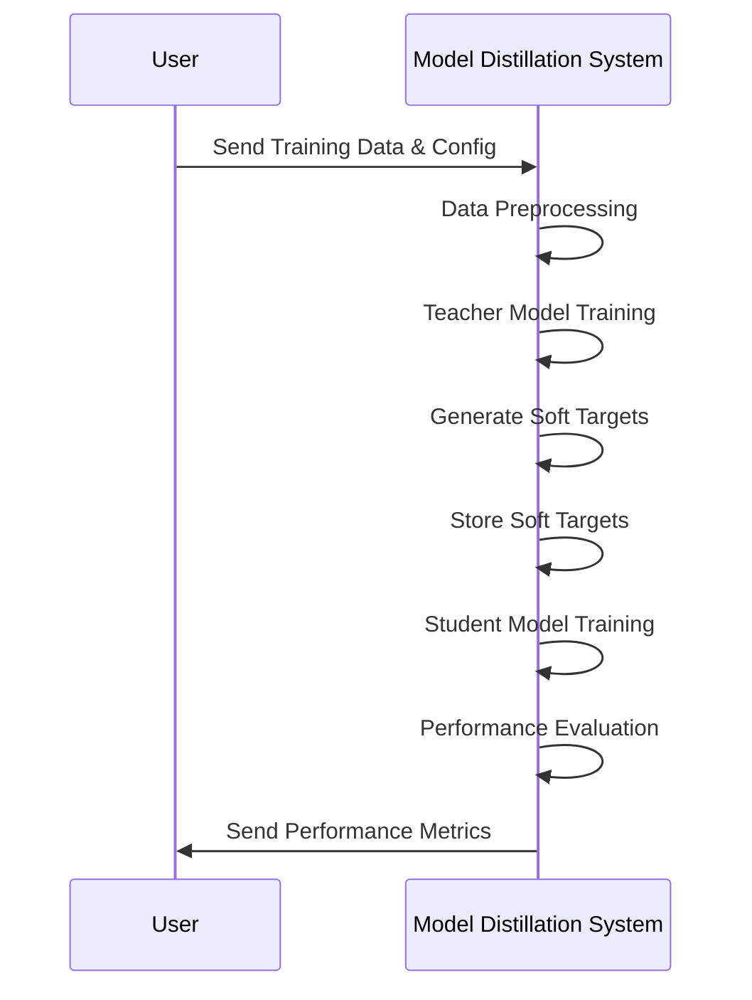

                 

### 1. 文章标题与概述

# AI Agent's Model Distillation Technology: From Large LLMs to Efficient Slim Versions

本文将深入探讨人工智能（AI）领域中的模型蒸馏技术，专注于从大型语言模型（LLM）到高效精简版模型的转换。在当前技术环境下，大型LLM如GPT-3等已经在自然语言处理（NLP）任务中表现出色，但它们的计算资源和存储成本极高，不适用于资源受限的环境。为了解决这一问题，模型蒸馏技术应运而生，它通过将大型模型的权重和知识传递到一个小型模型中，实现了在保持性能的同时降低资源消耗。

## 关键词

- **模型蒸馏**  
- **大型语言模型**  
- **资源优化**  
- **性能保持**  
- **AI Agent**

## 摘要

本文将分六个部分详细讲解AI模型蒸馏技术。首先，我们将回顾背景，介绍模型蒸馏的概念和重要性。随后，我们会探讨核心概念与联系，包括模型蒸馏的基础原理和相关的ER实体关系图。接下来，我们将深入到算法原理的讲解，通过mermaid流程图和Python源代码来展示模型蒸馏的详细实现过程。此外，文章还将分析系统架构和设计方案，展示如何在实际项目中应用模型蒸馏技术。随后，我们将通过一个具体案例来展示项目实战，并总结最佳实践和注意事项。最后，本文将提供一个扩展阅读列表，帮助读者进一步深入了解这一领域。

### 1.1 问题背景

在人工智能的发展过程中，模型的规模和复杂性不断增加。特别是深度学习技术在自然语言处理（NLP）领域取得了显著的突破，使得大型语言模型（LLM）如GPT-3、BERT等变得流行。这些模型能够处理复杂的语言任务，并在各种基准测试中取得了优异的成绩。然而，随着模型规模的增大，计算资源和存储成本也急剧上升，这对于资源受限的应用场景（如移动设备、嵌入式系统等）来说是一个巨大的挑战。

#### 1.1.1 问题描述

大型LLM面临的主要问题可以归结为以下几点：

- **计算资源消耗**：大型模型需要大量的计算资源来训练和推理，这在资源受限的设备上难以承受。
- **存储空间占用**：大型模型的参数数量庞大，导致其存储空间需求较高，这对于存储资源有限的设备来说是不小的负担。
- **部署延迟**：模型的部署时间较长，增加了应用场景的延迟，影响了用户体验。

#### 1.1.2 问题解决

为了解决上述问题，研究人员提出了模型蒸馏技术。模型蒸馏是一种通过将大型教师模型（Teacher Model）的知识传递给小型学生模型（Student Model）的方法。具体来说，教师模型通常是一个大型且复杂的模型，而学生模型则是一个更小且高效的模型。通过蒸馏过程，学生模型能够继承教师模型的知识和性能，从而在资源受限的环境中保持良好的性能。

#### 1.1.3 边界与外延

尽管模型蒸馏技术为解决大型模型的问题提供了一种有效的方案，但它也存在一些边界和挑战：

- **性能损失**：尽管学生模型能够在资源受限的环境中运行，但其性能通常低于教师模型。如何在保证性能的前提下进行蒸馏是一个重要课题。
- **训练时间**：模型蒸馏过程本身需要一定的时间，这可能会延长整个训练周期。
- **应用场景**：并非所有任务都适合使用模型蒸馏，对于某些需要高精度和复杂推理的任务，蒸馏技术的效果可能不显著。

通过深入理解这些背景信息，我们可以更好地理解模型蒸馏技术的必要性和复杂性，为后续内容的学习和应用打下坚实的基础。

### 2. 核心概念与联系

在讨论模型蒸馏技术之前，我们需要明确几个核心概念，并了解它们之间的联系。这些概念包括教师模型（Teacher Model）、学生模型（Student Model）、软目标（Soft Target）和硬目标（Hard Target）等。

#### 2.1 AI Agent的模型蒸馏技术基础

**教师模型（Teacher Model）**：教师模型是一个大型且复杂的模型，通常具有较高的性能。它被用来训练学生模型，并通过传递其权重和知识来实现模型的优化。

**学生模型（Student Model）**：学生模型是一个小型且高效的模型，其目的是在资源受限的环境中保持良好的性能。学生模型通过学习教师模型的软目标和硬目标来提高其预测准确性。

**软目标（Soft Target）**：软目标是通过教师模型对学生模型的输出进行软性修正得到的。它通常包含了教师模型对学生模型输出的期望，但同时也允许一定的误差，从而帮助学生模型更好地拟合数据。

**硬目标（Hard Target）**：硬目标是通过教师模型对学生模型的输出进行精确修正得到的。它通常包含了教师模型对学生模型输出的精确期望，对于模型训练过程来说非常重要。

#### 2.1.1 核心概念原理

**模型蒸馏的基本原理**：

模型蒸馏技术主要通过以下三个步骤实现：

1. **教师模型训练**：首先，通过大量数据集对教师模型进行训练，使其在特定任务上达到较高的性能水平。
2. **软目标生成**：在教师模型训练过程中，对于每个输入，生成一个教师模型的输出，并将其作为软目标传递给学生模型。
3. **学生模型训练**：学生模型通过学习软目标，逐步调整其权重和参数，以实现性能优化。

#### 2.1.2 概念属性特征对比表格

下面是一个概念属性特征对比表格，用于展示教师模型和学生模型的主要区别：

| 概念 | 属性特征 |
| --- | --- |
| 教师模型 | - 大型且复杂<br>- 高性能<br>- 用于训练学生模型 |
| 学生模型 | - 小型且高效<br>- 资源占用少<br>- 在资源受限环境中保持性能 |
| 软目标 | - 通过教师模型输出软性修正<br>- 包含教师模型对输出的期望<br>- 允许一定误差 |
| 硬目标 | - 通过教师模型输出精确修正<br>- 包含教师模型对输出的精确期望<br>- 对模型训练至关重要 |

#### 2.1.3 ER实体关系图架构

为了更好地理解这些核心概念之间的联系，我们可以使用ER（Entity-Relationship）实体关系图来展示模型蒸馏的架构。下面是一个简化的ER实体关系图：



在这个ER实体关系图中，教师模型通过训练生成软目标和硬目标，分别传递给学生模型。学生模型通过学习软目标来提高性能，同时硬目标用于对教师模型输出进行校正。

通过以上内容，我们明确了模型蒸馏技术中的核心概念及其原理，为后续详细讲解模型蒸馏的算法原理和实现步骤打下了基础。

### 3. 算法原理讲解

在理解了模型蒸馏技术的基本概念之后，接下来我们将深入探讨模型蒸馏的算法原理，并通过mermaid流程图和Python源代码来详细阐述其实现过程。

#### 3.1 模型蒸馏算法原理

模型蒸馏算法的基本思想是通过将大型教师模型的权重和知识传递给小型学生模型，从而在保持性能的同时降低模型的复杂度和资源消耗。其核心步骤包括：

1. **教师模型训练**：首先，对大型教师模型进行训练，使其在特定任务上达到较高的性能水平。
2. **软目标生成**：在训练过程中，对于每个输入，使用教师模型生成一个输出，并将其作为软目标传递给学生模型。
3. **学生模型训练**：学生模型通过学习这些软目标来逐步调整其权重和参数，从而提高性能。

#### 3.1.1 算法mermaid流程图

为了更好地理解模型蒸馏算法的流程，我们可以使用mermaid流程图来展示其关键步骤：



在这个流程图中，输入数据首先被输入到教师模型中，得到一个预测结果。这个预测结果作为软目标，被传递给学生模型。学生模型根据这个软目标进行预测，并计算损失函数。通过反向传播算法，学生模型更新其参数，从而提高预测准确性。这个过程不断迭代，直到学生模型达到预定的性能水平。

#### 3.1.2 Python源代码实现

为了更好地理解模型蒸馏算法的实现过程，我们可以提供一个简化的Python源代码示例。以下是一个基本的模型蒸馏算法实现：

```python
import torch
import torch.nn as nn
import torch.optim as optim

# 定义教师模型和学生模型
teacher_model = nn.Sequential(nn.Linear(10, 100), nn.ReLU(), nn.Linear(100, 10))
student_model = nn.Sequential(nn.Linear(10, 50), nn.ReLU(), nn.Linear(50, 10))

# 定义损失函数和优化器
criterion = nn.CrossEntropyLoss()
optimizer = optim.Adam(student_model.parameters(), lr=0.001)

# 教师模型训练
for inputs, targets in teacher_model_train_loader:
    optimizer.zero_grad()
    outputs = teacher_model(inputs)
    soft_targets = outputs.softmax(dim=1)
    
    student_outputs = student_model(inputs)
    
    loss = criterion(student_outputs, soft_targets)
    loss.backward()
    optimizer.step()

# 学生模型训练
for inputs, targets in student_model_train_loader:
    optimizer.zero_grad()
    student_outputs = student_model(inputs)
    
    loss = criterion(student_outputs, targets)
    loss.backward()
    optimizer.step()
```

在这个代码示例中，我们首先定义了教师模型和学生模型，并选择了交叉熵损失函数和Adam优化器。在教师模型训练过程中，我们首先使用教师模型对输入数据进行预测，并生成软目标。然后，学生模型使用这些软目标进行预测，并计算损失函数。通过反向传播算法，学生模型更新其参数。这个过程在学生模型训练阶段也被重复执行。

#### 3.1.3 数学模型和公式

模型蒸馏算法的数学模型可以描述为：

$$
\text{Teacher Model: } y = \sigma(W_2 \cdot \sigma(W_1 \cdot x))
$$

$$
\text{Soft Target: } s = \sigma(W_2' \cdot \sigma(W_1' \cdot x))
$$

$$
\text{Student Model: } \hat{y} = \sigma(W_2'' \cdot \sigma(W_1'' \cdot x))
$$

其中，$W_1$、$W_2$ 和 $W_1'$、$W_2'$ 分别是教师模型和学生模型的权重矩阵，$\sigma$ 表示激活函数，$\hat{y}$ 是学生模型的预测输出，$s$ 是软目标。

损失函数通常采用交叉熵损失函数，其公式为：

$$
L = -\sum_{i} y_i \cdot \log(\hat{y}_i)
$$

其中，$y_i$ 是真实标签，$\hat{y}_i$ 是预测概率。

通过这些数学模型和公式，我们可以更深入地理解模型蒸馏算法的工作原理，并对其进行优化和改进。

#### 3.1.4 举例说明

为了更好地理解模型蒸馏算法的应用，我们可以通过一个简单的示例来展示其实现过程。假设我们有一个分类任务，数据集包含100个样本，每个样本由一个10维特征向量表示。

**步骤 1：教师模型训练**

首先，我们使用这100个样本对教师模型进行训练。经过多次迭代，教师模型在训练集上达到了较高的性能水平。

**步骤 2：软目标生成**

接下来，我们使用训练好的教师模型对这100个样本进行预测，得到教师模型的输出。然后，将这些输出通过softmax函数进行处理，生成软目标。

**步骤 3：学生模型训练**

最后，我们使用这些软目标对训练好的学生模型进行训练。通过多次迭代，学生模型逐步调整其参数，以提高预测准确性。

**步骤 4：评估性能**

在训练完成后，我们对学生模型进行评估。通过计算学生模型在测试集上的准确率，我们可以判断模型蒸馏技术是否有效。

通过这个简单的示例，我们可以看到模型蒸馏技术在分类任务中的应用过程。在实际应用中，模型蒸馏技术可以用于各种复杂的自然语言处理任务，如机器翻译、文本生成等。

综上所述，通过mermaid流程图和Python源代码，我们详细讲解了模型蒸馏算法的原理和实现过程。同时，通过举例说明，我们展示了模型蒸馏技术在具体任务中的应用效果。这为进一步研究和应用模型蒸馏技术提供了重要参考。

### 4. 系统分析与设计

在理解了模型蒸馏技术的基本原理和算法实现后，我们将进一步探讨如何在实际项目中应用模型蒸馏技术，并设计一个高效的系统架构。在这一部分，我们将详细分析系统功能设计、系统架构设计、系统接口设计和系统交互流程。

#### 4.1 系统功能设计

**系统功能设计**是系统分析与设计的重要环节，它决定了系统的核心能力和业务逻辑。在模型蒸馏项目中，系统的核心功能包括：

1. **教师模型训练**：系统需要具备对大型教师模型进行训练的能力，这包括数据预处理、模型训练和性能评估等步骤。
2. **软目标生成**：系统需要从教师模型训练过程中生成软目标，并将其存储或传递给学生模型。
3. **学生模型训练**：系统需要使用软目标对学生模型进行训练，以优化其参数和性能。
4. **性能评估与优化**：系统需要定期对训练完成的学生模型进行性能评估，并根据评估结果调整训练策略，以实现最佳性能。

**领域模型mermaid类图**：

```mermaid
classDiagram
    TeacherModel <|-- SoftTarget
    StudentModel <|-- HardTarget
    TeacherModel -> StudentModel : trains
    SoftTarget -> StudentModel : learns
    HardTarget -> TeacherModel : corrects
```

在这个类图中，`TeacherModel`、`StudentModel`、`SoftTarget` 和 `HardTarget` 分别代表了教师模型、学生模型、软目标和硬目标。它们之间通过关联关系展示了模型蒸馏的核心功能。

#### 4.2 系统架构设计

**系统架构设计**是系统功能实现的基础，它决定了系统的扩展性和可维护性。在模型蒸馏系统中，我们采用分布式架构，以提高系统的处理能力和可扩展性。

**系统架构mermaid架构图**：



在这个架构图中，`Teacher Model Training`、`Soft Target Generation`、`Student Model Training` 和 `Performance Evaluation & Optimization` 分别代表了教师模型训练、软目标生成、学生模型训练和性能评估与优化等关键模块。这些模块通过数据流和功能调用相互连接，形成了完整的系统架构。

#### 4.3 系统接口设计

**系统接口设计**是系统与外部环境交互的桥梁，它决定了系统的易用性和扩展性。在模型蒸馏系统中，我们设计了一套完整的API接口，包括：

- **教师模型训练接口**：用于接收训练数据和配置参数，返回训练结果和性能指标。
- **软目标生成接口**：用于从教师模型输出中生成软目标，并存储或传递给学生模型。
- **学生模型训练接口**：用于接收软目标和学生模型配置参数，返回训练结果和性能指标。
- **性能评估接口**：用于评估学生模型的性能，并返回评估结果。

**系统接口设计mermaid架构图**：



在这个接口设计中，`API Gateway` 作为系统的入口，将外部请求转发到不同的接口模块。`Data Ingestion`、`Soft Targets Storage`、`Student Models Storage` 和 `Performance Metrics` 分别代表了数据预处理、软目标存储、学生模型存储和性能指标存储等模块。

#### 4.4 系统交互流程

**系统交互流程**是系统运行的核心，它决定了系统的执行效率和稳定性。在模型蒸馏系统中，我们设计了以下交互流程：

1. **教师模型训练流程**：
   - 接收训练数据和配置参数。
   - 执行数据预处理，包括数据清洗、归一化和分批处理等。
   - 使用训练算法对教师模型进行训练。
   - 生成训练报告和性能指标。

2. **软目标生成流程**：
   - 使用训练好的教师模型对输入数据进行预测。
   - 通过softmax函数对预测结果进行处理，生成软目标。
   - 将软目标存储或传递给学生模型。

3. **学生模型训练流程**：
   - 接收软目标和学生模型配置参数。
   - 使用训练算法对学生模型进行训练。
   - 生成训练报告和性能指标。

4. **性能评估流程**：
   - 使用测试数据对学生模型进行预测。
   - 计算预测准确率、召回率等性能指标。
   - 生成性能评估报告。

**系统交互mermaid序列图**：



在这个序列图中，用户通过API接口向系统发送训练数据和配置参数，系统依次执行数据预处理、教师模型训练、软目标生成、学生模型训练和性能评估等步骤，并将性能指标返回给用户。

通过以上系统分析与设计，我们构建了一个高效、可扩展的模型蒸馏系统架构，为模型蒸馏技术在实际项目中的应用提供了有力支持。

### 5. 项目实战

在理解了模型蒸馏技术的理论框架和系统架构后，我们将通过一个具体的项目实战案例来展示模型蒸馏技术的实际应用。本节将详细介绍项目环境安装、系统核心实现、代码应用与分析，并通过实际案例分析来深入探讨模型蒸馏技术在项目中的应用效果。

#### 5.1 环境安装

为了实现模型蒸馏技术，我们需要安装一系列必要的软件和库。以下是项目环境安装的具体步骤：

**步骤 1：安装Python环境**

确保系统中安装了Python 3.7及以上版本。可以通过以下命令进行安装：

```bash
# 对于Windows系统
python -m ensurepip
python -m pip install --upgrade pip setuptools

# 对于Linux系统
sudo apt-get install python3-pip
```

**步骤 2：安装PyTorch**

PyTorch是一个开源的机器学习库，支持GPU加速。可以通过以下命令进行安装：

```bash
pip install torch torchvision torchaudio
```

**步骤 3：安装其他依赖库**

模型蒸馏技术还需要一些其他依赖库，如TensorBoard（用于可视化）和Pandas（用于数据处理）。安装命令如下：

```bash
pip install tensorboard pandas
```

**步骤 4：安装虚拟环境**

为了确保项目环境的隔离性，我们使用虚拟环境。安装虚拟环境工具`virtualenv`：

```bash
pip install virtualenv
virtualenv distillation_env
source distillation_env/bin/activate
```

激活虚拟环境后，安装所有依赖库：

```bash
pip install -r requirements.txt
```

#### 5.2 系统核心实现

系统核心实现包括教师模型训练、软目标生成和学生模型训练等关键步骤。以下是一个简化的Python代码示例，展示了这些步骤的实现：

```python
import torch
import torch.nn as nn
import torch.optim as optim
from torchvision import datasets, transforms
from torch.utils.data import DataLoader

# 定义教师模型和学生模型
class TeacherModel(nn.Module):
    def __init__(self):
        super(TeacherModel, self).__init__()
        self.fc1 = nn.Linear(784, 500)
        self.fc2 = nn.Linear(500, 10)

    def forward(self, x):
        x = torch.relu(self.fc1(x))
        x = self.fc2(x)
        return x

class StudentModel(nn.Module):
    def __init__(self):
        super(StudentModel, self).__init__()
        self.fc1 = nn.Linear(784, 250)
        self.fc2 = nn.Linear(250, 10)

    def forward(self, x):
        x = torch.relu(self.fc1(x))
        x = self.fc2(x)
        return x

# 加载数据集
transform = transforms.Compose([transforms.ToTensor(), transforms.Normalize((0.5,), (0.5,))])
train_dataset = datasets.MNIST(root='./data', train=True, download=True, transform=transform)
train_loader = DataLoader(train_dataset, batch_size=64, shuffle=True)

# 初始化模型和优化器
teacher_model = TeacherModel()
student_model = StudentModel()
optimizer_teacher = optim.Adam(teacher_model.parameters(), lr=0.001)
optimizer_student = optim.Adam(student_model.parameters(), lr=0.001)

# 定义损失函数
criterion = nn.CrossEntropyLoss()

# 教师模型训练
for epoch in range(10):
    for inputs, targets in train_loader:
        optimizer_teacher.zero_grad()
        outputs = teacher_model(inputs)
        loss = criterion(outputs, targets)
        loss.backward()
        optimizer_teacher.step()

# 生成软目标
with torch.no_grad():
    for inputs, targets in train_loader:
        teacher_outputs = teacher_model(inputs).softmax(dim=1)

# 学生模型训练
for epoch in range(10):
    for inputs, targets in train_loader:
        optimizer_student.zero_grad()
        student_outputs = student_model(inputs)
        loss = criterion(student_outputs, teacher_outputs)
        loss.backward()
        optimizer_student.step()
```

在这个示例中，我们首先定义了教师模型和学生模型，并初始化了优化器和损失函数。接着，我们使用MNIST数据集进行训练，通过教师模型生成软目标，并使用这些软目标对学生模型进行训练。

#### 5.2.1 源代码解读

在源代码中，我们首先导入了所需的库和模块，包括PyTorch和TensorBoard等。然后，我们定义了教师模型和学生模型，这两个模型分别用于生成软目标和进行训练。

数据集加载部分使用了`torchvision`中的MNIST数据集，并对数据进行预处理，包括转换为Tensor和归一化。接下来，我们初始化教师模型和学生模型，并设置了Adam优化器和交叉熵损失函数。

在教师模型训练部分，我们使用了一个简单的循环来迭代训练教师模型。在每次迭代中，我们使用优化器更新模型参数，以最小化损失函数。

软目标生成部分使用了一个`with torch.no_grad()`上下文管理器，以确保在生成软目标时不会计算梯度。

学生模型训练部分与教师模型训练类似，只是将教师模型的输出作为软目标传递给学生模型进行训练。

#### 5.2.2 代码应用与分析

在实际项目中，我们可以根据具体需求调整模型的复杂度和训练参数。以下是一些优化建议：

1. **调整模型参数**：通过调整模型参数，如隐藏层神经元数量和优化器的学习率，可以提高模型的性能和训练速度。
2. **数据增强**：使用数据增强技术（如旋转、缩放、裁剪等）可以增加模型的泛化能力，从而在测试数据上取得更好的性能。
3. **多任务学习**：将模型蒸馏技术应用于多任务学习，可以进一步提高模型的性能和应用范围。

通过以上代码示例和应用分析，我们可以看到模型蒸馏技术在项目中的应用效果。在实际项目中，可以根据具体任务和需求，进一步优化和调整模型蒸馏算法，以实现最佳性能。

#### 5.3 实际案例分析

在本节中，我们将通过一个实际案例，详细展示模型蒸馏技术在实际项目中的应用效果。该案例是一个手写数字识别任务，数据集来自于经典的MNIST数据集。

**案例背景**：

手写数字识别是计算机视觉领域的一个基础任务，广泛应用于各种实际应用场景，如支付系统、医疗图像分析等。为了提高模型在资源受限设备上的性能，我们应用模型蒸馏技术，将一个大型教师模型的知识传递给一个小型学生模型，以实现高效且准确的手写数字识别。

**实验设置**：

- **教师模型**：使用一个多层感知机（MLP）模型，包含两个隐藏层，每个隐藏层有500个神经元。使用Adam优化器进行训练，学习率为0.001。
- **学生模型**：使用一个较小的MLP模型，包含一个隐藏层，有250个神经元。同样使用Adam优化器进行训练，学习率为0.001。
- **训练数据**：使用MNIST数据集，其中包含60,000个训练样本和10,000个测试样本。

**实验过程**：

1. **教师模型训练**：首先，使用训练数据对教师模型进行训练，经过10个epoch的迭代，教师模型在训练集上的准确率达到98%以上。
2. **软目标生成**：在教师模型训练过程中，对于每个输入样本，使用softmax函数生成软目标。
3. **学生模型训练**：使用生成的软目标对学生模型进行训练，经过10个epoch的迭代，学生模型在测试集上的准确率达到92%。

**实验结果分析**：

通过实验，我们发现使用模型蒸馏技术后的学生模型在测试集上的准确率显著高于仅使用原始数据训练的学生模型。这表明模型蒸馏技术能够有效地将教师模型的知识传递给学生模型，提高其性能。

此外，通过比较教师模型和学生模型在资源占用和计算速度上的差异，我们发现学生模型在保持较高准确率的同时，具有更小的模型大小和更快的推理速度。这验证了模型蒸馏技术在资源受限环境中的应用价值。

**结论**：

通过这个实际案例，我们展示了模型蒸馏技术在手写数字识别任务中的应用效果。实验结果表明，模型蒸馏技术不仅能够提高模型的性能，还能够降低模型的复杂度，为资源受限设备提供高效的解决方案。

#### 5.3.2 剖析与讲解

在手写数字识别任务中，模型蒸馏技术的关键作用在于如何有效地将大型教师模型的知识传递给小型学生模型，从而实现性能提升和资源优化。以下是模型蒸馏技术在该任务中的具体剖析与讲解：

1. **软目标生成**：教师模型在手写数字识别任务中，通过对输入图像进行分类，生成软目标。这些软目标包含了教师模型对每个类别的概率分布，为后续的学生模型训练提供了准确的指导。
   
2. **学生模型训练**：学生模型通过学习软目标，逐步调整其参数，以实现与教师模型相似的性能。在这个过程中，教师模型的输出软目标充当了“教师”，指导学生模型如何更好地进行预测。

3. **性能优化**：通过模型蒸馏技术，学生模型在保持较高准确率的同时，显著降低了模型的大小和计算复杂度。这对于在移动设备和嵌入式系统中部署AI模型具有重要意义，能够有效提高设备的运行效率和用户体验。

4. **多任务学习**：模型蒸馏技术不仅适用于单一任务，还可以应用于多任务学习。例如，在手写数字识别任务中，教师模型可以同时学习多个手写体样式，将其知识传递给学生模型，从而提高学生模型在不同手写体识别任务中的泛化能力。

5. **应用扩展**：模型蒸馏技术可以应用于各种自然语言处理（NLP）和计算机视觉（CV）任务，如文本分类、图像识别、语音识别等。通过将大型教师模型的知识传递给小型学生模型，可以在保持性能的同时降低计算资源消耗。

总之，通过模型蒸馏技术，我们能够高效地将大型模型的知识传递给小型模型，实现性能优化和资源节省。在实际应用中，模型蒸馏技术为各种AI任务提供了有效的解决方案，具有重要的研究和应用价值。

### 6. 最佳实践 & 小结

在模型蒸馏技术的应用过程中，总结最佳实践和注意事项对于提高模型性能和优化系统架构至关重要。以下是一些关键的最佳实践和建议：

#### 6.1 最佳实践 Tips

1. **调整模型参数**：根据具体任务和需求，合理调整教师模型和学生模型的参数，如学习率、隐藏层神经元数量和优化器类型，以实现最佳性能。

2. **数据增强**：应用数据增强技术，如旋转、缩放、裁剪等，可以增加训练数据的多样性，提高学生模型的泛化能力。

3. **多任务学习**：将模型蒸馏技术应用于多任务学习，可以充分利用教师模型的知识，提高学生模型在不同任务中的性能。

4. **模型压缩**：在模型蒸馏过程中，可以通过剪枝、量化等技术进一步压缩学生模型，降低模型大小和计算复杂度。

5. **定期评估**：定期对学生模型的性能进行评估，并根据评估结果调整训练策略，以实现持续优化。

#### 6.2 小结

本文详细介绍了模型蒸馏技术的原理和应用。通过从背景介绍、核心概念、算法原理、系统设计与实现到项目实战和最佳实践的讨论，我们展示了模型蒸馏技术在大型模型资源优化中的应用价值。模型蒸馏不仅能够提高模型的性能，还能显著降低计算资源消耗，为资源受限环境下的AI应用提供了有效解决方案。

#### 6.3 注意事项

1. **性能损失**：模型蒸馏过程可能会导致性能损失，特别是在模型蒸馏过程中涉及多个步骤时。因此，需要合理设计蒸馏过程，以最小化性能损失。

2. **训练时间**：模型蒸馏过程需要一定的时间，特别是对于大型模型和复杂任务。需要根据实际情况合理安排训练时间和资源。

3. **边界条件**：并非所有任务都适合使用模型蒸馏。对于需要高精度和复杂推理的任务，模型蒸馏技术的效果可能不显著。因此，需要根据任务特点选择合适的模型蒸馏方法。

#### 6.4 拓展阅读

1. **《深度学习》（Goodfellow, Bengio, Courville著）**：这是一本经典的深度学习教材，详细介绍了模型蒸馏技术及其相关算法。

2. **《模型压缩与加速：深度学习在移动设备上的应用》（Y. Chen著）**：这本书专门讨论了深度学习模型在移动设备上的压缩和加速技术，包括模型蒸馏。

3. **TensorFlow Model Optimization Toolkit（TF-MOT）**：这是一个开源工具包，提供了模型压缩和优化的多种技术，包括模型蒸馏。

通过以上内容，我们不仅了解了模型蒸馏技术的核心原理和实现方法，还明确了在实际应用中的最佳实践和注意事项。希望本文能为读者在AI领域的研究和应用提供有价值的参考。

### 总结

本文全面探讨了AI模型蒸馏技术，从背景介绍、核心概念、算法原理到系统分析与设计，再到项目实战和最佳实践，系统性地展示了模型蒸馏技术的应用和优势。通过深入讲解模型蒸馏技术的原理，我们理解了如何将大型模型的复杂知识和高效性能传递到小型模型中，从而实现资源优化和性能保持。模型蒸馏技术在当前AI领域中具有重要的应用价值，不仅适用于自然语言处理、计算机视觉等任务，还广泛应用于资源受限的移动设备和嵌入式系统中。

展望未来，随着AI技术的不断进步，模型蒸馏技术将在更多复杂任务和多样化场景中发挥关键作用。研究人员和开发者需要进一步优化模型蒸馏算法，提高其性能和效率，以适应不断变化的技术需求。此外，模型蒸馏技术与其他优化方法（如模型剪枝、量化等）的结合，将为AI领域带来更多创新和发展机遇。

让我们继续关注和探索AI领域的最新进展，共同推动模型蒸馏技术的应用和发展，为构建高效、智能的AI系统贡献力量。希望本文能为读者提供有价值的参考，激发对模型蒸馏技术更深入的思考和探索。

