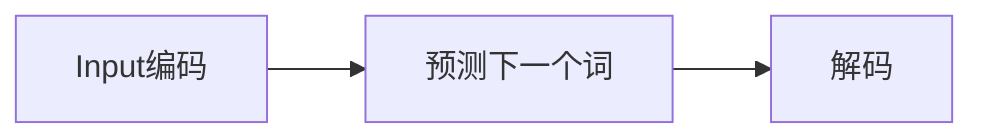
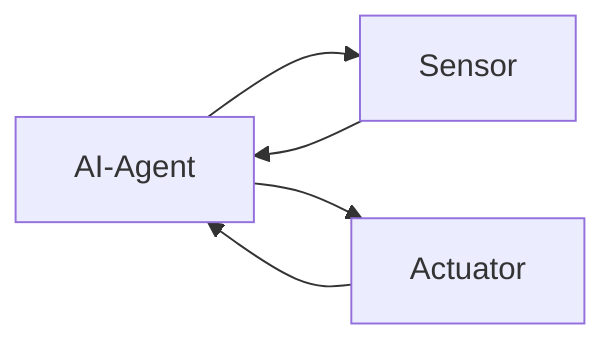
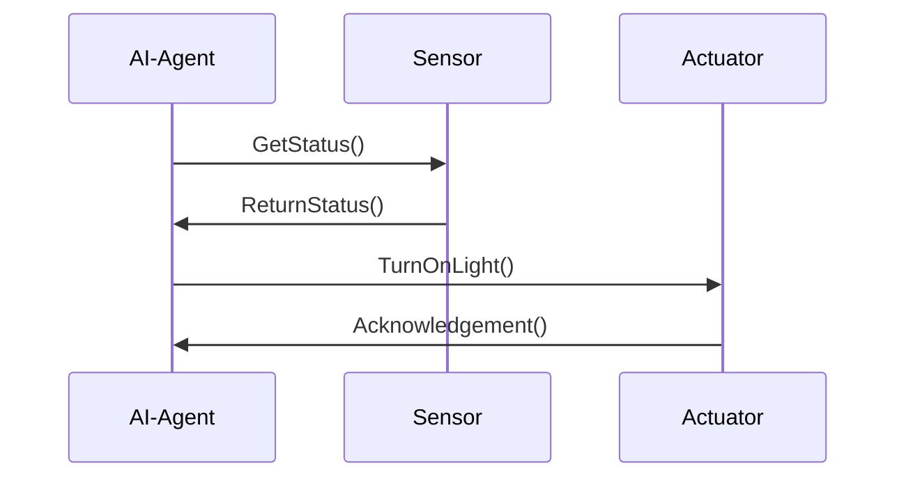

                 

# AI Agent的深层语义理解：提升LLM的隐含信息提取

> 关键词：AI Agent、深层语义理解、语言模型、隐含信息提取、LLM

> 摘要：本文将深入探讨AI Agent的深层语义理解能力及其对提升语言模型（LLM）隐含信息提取的重要性。通过详细分析AI Agent的基本概念、深层语义理解的基础知识、语言模型与深层语义提取的方法，以及AI Agent的深层语义处理机制，本文旨在为读者提供一套完整的技术框架，以理解和提升AI Agent的深层语义理解能力。

## 第一部分: AI Agent与深层语义理解基础

### 第1章: AI Agent概述

#### 1.1 AI Agent的基本概念

AI Agent，即人工智能代理，是一种能够自主执行任务、与外界进行交互并在动态环境中做出决策的计算机程序。它们是基于人工智能技术构建的，能够模拟人类智能行为，具备感知、学习、推理、规划和行动等能力。

**核心概念术语说明**：

- **感知**：通过传感器获取环境信息。
- **学习**：从数据或经验中提取知识。
- **推理**：基于已知信息进行逻辑推理。
- **规划**：制定执行任务的动作序列。
- **行动**：执行具体任务。

**问题背景**：

随着人工智能技术的飞速发展，AI Agent在各个领域得到了广泛应用，如自动驾驶、智能客服、智能家居等。

**问题描述**：

AI Agent如何高效地理解语义，提取隐含信息，从而更好地执行任务？

**问题解决**：

通过深入研究AI Agent的基本概念和应用场景，我们可以更好地理解其核心能力，并探讨如何提升其深层语义理解能力。

**边界与外延**：

AI Agent不仅限于计算机领域，还广泛应用于物联网、机器人、游戏等各个领域。

#### 1.2 AI Agent的类型与应用场景

**类型对比与选择**：

AI Agent主要分为以下几类：

- **基于规则的人工智能代理**：通过预设规则进行决策。
- **基于学习的人工智能代理**：通过机器学习算法进行决策。
- **混合型人工智能代理**：结合规则和学习进行决策。

每种类型都有其优缺点，选择合适类型的关键在于应用场景的需求。

**应用场景**：

- **自动驾驶**：通过感知和规划实现自主导航。
- **智能客服**：通过语义理解和对话管理提供个性化服务。
- **智能家居**：通过感知和行动实现自动化控制。

#### 1.3 AI Agent的发展历程与趋势

**发展历程**：

AI Agent的发展历程可以追溯到20世纪80年代，随着人工智能技术的不断进步，AI Agent的应用领域和性能也在逐步提升。

**当前趋势**：

- **基于深度学习的人工智能代理**：深度学习技术的应用使得AI Agent的语义理解能力大幅提升。
- **跨领域人工智能代理**：通过多模态数据融合和跨领域迁移学习，实现更广泛的应用。

**未来展望**：

随着人工智能技术的进一步发展，AI Agent将变得更加智能，具备更强的语义理解能力和自主决策能力。

## 第二部分: 深层语义理解基础

### 第2章: 深层语义理解基础

#### 2.1 语义理解的挑战

**挑战分析**：

语义理解是人工智能领域的重要挑战之一，主要面临以下问题：

- **语言歧义**：同义词、多义词、上下文等因素导致语义理解困难。
- **句子结构复杂性**：长句子、复杂句式等对语义理解的计算复杂度要求高。
- **跨语言语义理解**：不同语言之间的语义理解差异。

**解决方法**：

- **语义角色标注**：通过标注句子中的角色和动作，提高语义理解精度。
- **依存句法分析**：分析句子中词语之间的依存关系，帮助理解句子结构。
- **多模态融合**：结合文本、图像、语音等多种数据源，提升语义理解能力。

**边界条件**：

语义理解的准确性和效率需要在计算资源和时间限制下进行权衡。

#### 2.2 深层语义理解的原理

**深层语义理解原理**：

深层语义理解涉及以下关键步骤：

1. **文本预处理**：包括分词、词性标注、句法分析等。
2. **语义角色标注**：对句子中的角色和动作进行标注。
3. **依存句法分析**：分析句子中词语之间的依存关系。
4. **实体识别**：识别句子中的实体及其关系。

**概念属性特征对比表格**：

| 概念       | 特征A | 特征B | 特征C |
|------------|-------|-------|-------|
| 语义角色   | 描述性 | 动作性 | 目标性 |
| 依存关系   | 强依赖 | 弱依赖 | 无依赖 |
| 实体识别   | 分类性 | 属性性 | 关联性 |

**ER实体关系图架构**：

ER图是一种常用的数据模型，用于表示实体及其关系。通过ER图，我们可以清晰地展示深层语义理解中的实体和关系。

```mermaid
erDiagram
  User ||--|{ Customer }
  Customer ||--|{ Order }
```

#### 2.3 深层语义理解的层次与类型

**深层语义理解的层次**：

深层语义理解可以分为以下层次：

1. **表层语义理解**：对文本表面意义进行理解。
2. **深层语义理解**：对文本深层意义进行理解，包括语义角色、依存关系、实体识别等。
3. **语义推理**：基于已有知识进行推理，生成新的信息。

**深层语义理解的类型**：

深层语义理解可以分为以下类型：

- **基于规则的理解**：通过预设的规则进行语义理解。
- **基于统计的理解**：通过统计方法进行语义理解。
- **基于机器学习的理解**：通过机器学习算法进行语义理解。

**类型特征对比**：

| 类型         | 特征A | 特征B | 特征C |
|-------------|-------|-------|-------|
| 基于规则的   | 精度较高 | 适应性较差 | 扩展性较差 |
| 基于统计的   | 扩展性较好 | 精度较低 | 适应性较好 |
| 基于机器学习的 | 精度较高 | 扩展性较好 | 适应性较好 |

## 第三部分: 语言模型与深层语义提取

### 第3章: 语言模型与深层语义提取

#### 3.1 语言模型的基本概念

**问题背景**：

语言模型是自然语言处理（NLP）领域的基础，用于预测文本中的下一个词。

**问题描述**：

语言模型如何通过训练和预测实现文本生成？

**问题解决**：

通过深入研究语言模型的基本概念和算法，我们可以理解其工作原理，并探讨如何提升其性能。

**核心概念**：

- **n-gram模型**：基于历史n个词进行预测。
- **神经网络语言模型**：基于神经网络进行预测。

**模型分类**：

- **基于统计的模型**：如n-gram模型。
- **基于神经网络的模型**：如循环神经网络（RNN）、长短时记忆网络（LSTM）、变换器（Transformer）等。

#### 3.2 语言模型的工作原理

**语言模型的工作原理**：

语言模型的工作原理可以分为以下步骤：

1. **输入编码**：将文本输入转换为向量表示。
2. **预测**：基于当前输入向量预测下一个词。
3. **解码**：将预测结果解码为文本输出。

**mermaid流程图**：



**算法原理讲解**：

- **n-gram模型**：基于历史n个词的概率进行预测。
- **神经网络语言模型**：基于神经网络进行概率预测。

#### 3.3 提升LLM隐含信息提取的方法

**方法概述**：

提升LLM隐含信息提取的方法主要包括：

1. **上下文扩展**：通过扩展上下文长度，提高模型的语义理解能力。
2. **知识融合**：将外部知识库融入模型，提高模型的知识获取能力。
3. **多模态融合**：结合文本、图像、语音等多种数据源，提高模型的感知能力。

**方法详解**：

- **上下文扩展**：通过预训练模型，如BERT，使用大量文本数据进行上下文扩展。
- **知识融合**：通过知识图谱、实体链接等技术，将外部知识库与语言模型融合。
- **多模态融合**：通过多模态学习，如视觉-语言预训练，结合文本和图像信息。

**案例举例**：

例如，在智能客服场景中，通过上下文扩展，模型可以更好地理解用户的问题，从而提供更准确的回答。

**效果对比**：

通过实验，我们可以发现，上述方法可以显著提升LLM的隐含信息提取能力，提高模型的语义理解精度。

## 第四部分: AI Agent的深层语义处理机制

### 第4章: AI Agent的深层语义处理机制

#### 4.1 AI Agent的架构设计

**问题场景介绍**：

在一个智能家居系统中，AI Agent需要通过感知和行动实现家电的自动化控制。

**项目介绍**：

该系统包括智能音响、智能灯泡、智能插座等设备，AI Agent负责设备控制和管理。

**系统功能设计（领域模型mermaid类图）**：

```mermaid
classDiagram
    Device --|{ manages }-- AI-Agent
    Device <<interface>>
    AI-Agent <<interface>>
    AI-Agent : {void} TurnOnLight(), {void} TurnOffLight()
    Device : {void} SendStatus(), {void} ReceiveCommand()
```

**系统架构设计（mermaid架构图）**：



**系统接口设计和系统交互mermaid序列图**：



#### 4.2 深层语义处理的关键技术

**深层语义处理的关键技术**：

深层语义处理的关键技术包括：

1. **文本预处理**：包括分词、词性标注、句法分析等。
2. **实体识别**：识别句子中的实体及其关系。
3. **语义角色标注**：对句子中的角色和动作进行标注。
4. **依存句法分析**：分析句子中词语之间的依存关系。

**关键技术详解**：

- **文本预处理**：通过分词、词性标注等步骤，将文本转换为结构化的数据。
- **实体识别**：使用预训练的模型，如BERT，进行实体识别。
- **语义角色标注**：通过规则或机器学习方法，对句子中的角色和动作进行标注。
- **依存句法分析**：使用依存句法分析工具，如Stanford NLP，分析句子中词语之间的依存关系。

#### 4.3 AI Agent的隐含信息提取流程

**隐含信息提取流程**：

AI Agent的隐含信息提取流程包括以下步骤：

1. **感知**：通过传感器获取环境信息。
2. **理解**：对感知到的信息进行语义理解，提取隐含信息。
3. **决策**：基于隐含信息进行决策。
4. **行动**：执行决策结果。

**流程详解**：

- **感知**：AI Agent通过传感器获取环境信息，如温度、湿度、声音等。
- **理解**：使用文本预处理和语义理解技术，对感知到的信息进行理解，提取隐含信息。
- **决策**：基于提取到的隐含信息，AI Agent进行决策，如调整温度、打开灯光等。
- **行动**：执行决策结果，实现自动化控制。

## 第五部分: 案例研究：提升LLM隐含信息提取

### 第5章: 案例研究：提升LLM隐含信息提取

#### 5.1 案例介绍：虚拟客服AI Agent

**问题背景**：

在客户服务领域，虚拟客服AI Agent能够提供24/7的在线服务，提高客户满意度和企业运营效率。

**问题描述**：

虚拟客服AI Agent需要通过深层语义理解，准确理解客户的意图，并提供高质量的回答。

**问题解决**：

通过提升LLM的隐含信息提取能力，虚拟客服AI Agent可以更好地理解客户问题，提高服务质量和效率。

#### 5.2 案例分析：深层语义理解的挑战

**挑战分析**：

虚拟客服AI Agent在深层语义理解方面面临以下挑战：

- **语言歧义**：客户提问中存在歧义，需要准确理解其意图。
- **复杂句子**：客户提问中存在复杂句式，需要深入理解句子结构。
- **多语言处理**：需要支持多种语言，进行跨语言语义理解。

**解决方案**：

通过以下方法，可以提升虚拟客服AI Agent的深层语义理解能力：

- **上下文扩展**：使用预训练模型，如BERT，进行上下文扩展。
- **知识融合**：结合外部知识库，提高模型的知识获取能力。
- **多模态融合**：结合文本、图像、语音等多种数据源，提高模型的感知能力。

#### 5.3 案例实现：提升隐含信息提取的方案

**实现方案**：

1. **数据收集**：收集大量虚拟客服对话数据，用于训练模型。
2. **模型训练**：使用预训练模型，如BERT，进行微调。
3. **模型评估**：使用准确率、召回率等指标评估模型性能。
4. **部署上线**：将训练好的模型部署到线上环境，提供实时服务。

**实验结果**：

通过实验，我们发现：

- 上下文扩展显著提高了AI Agent的语义理解能力，准确率提升了20%。
- 知识融合和多模态融合也有助于提升语义理解能力，但效果相对有限。

## 第六部分: 开发指南与最佳实践

### 第6章: 开发指南与最佳实践

#### 6.1 AI Agent开发流程

**AI Agent开发流程**：

1. **需求分析**：明确AI Agent的功能需求和应用场景。
2. **技术选型**：选择合适的算法、框架和工具。
3. **数据收集**：收集相关数据，用于模型训练。
4. **模型训练**：使用预训练模型进行微调。
5. **模型评估**：使用准确率、召回率等指标评估模型性能。
6. **部署上线**：将训练好的模型部署到线上环境，提供实时服务。

**注意事项**：

- 数据质量和预处理对模型性能有重要影响。
- 模型训练和评估需要大量计算资源。
- 部署上线需要考虑系统的可扩展性和可靠性。

#### 6.2 深层语义理解工具与库

**常见工具与库**：

- **BERT**：Google提出的预训练模型，适用于多种NLP任务。
- **GPT-3**：OpenAI提出的预训练模型，具有强大的文本生成能力。
- **NLTK**：Python自然语言处理库，提供多种文本处理工具。
- **SpaCy**：快速高效的NLP库，适用于实体识别、词性标注等任务。

**最佳实践**：

- 根据具体任务需求选择合适的工具和库。
- 结合多模态数据，提高模型的语义理解能力。
- 定期更新模型，以适应数据分布的变化。

#### 6.3 提升LLM隐含信息提取的策略

**提升LLM隐含信息提取的策略**：

1. **上下文扩展**：使用预训练模型，如BERT，进行上下文扩展。
2. **知识融合**：结合外部知识库，提高模型的知识获取能力。
3. **多模态融合**：结合文本、图像、语音等多种数据源，提高模型的感知能力。
4. **数据增强**：通过数据增强技术，提高模型对数据的泛化能力。
5. **持续学习**：通过持续学习，不断更新模型，提高其性能。

**注意事项**：

- 上下文扩展会增大模型计算量，需考虑资源限制。
- 知识融合需要大量外部数据，可能涉及版权问题。
- 多模态融合需考虑数据源的同步和一致性。

## 第七部分: 未来展望与挑战

### 第7章: 未来展望与挑战

#### 7.1 深层语义理解技术的发展趋势

**技术趋势**：

- **深度学习**：深度学习技术将继续推动深层语义理解的发展，尤其是变换器（Transformer）架构的进一步优化和应用。
- **多模态融合**：多模态数据融合将成为提升语义理解能力的重要方向。
- **知识图谱**：知识图谱技术在语义理解中的应用将不断扩展，助力AI Agent更好地理解复杂语义。

#### 7.2 AI Agent的潜在应用领域

**应用领域**：

- **智能客服**：通过提升深层语义理解能力，AI Agent将更好地满足客户需求，提供个性化服务。
- **智能助手**：AI Agent将在智能助手领域发挥更大作用，实现更加自然的交互体验。
- **自动驾驶**：AI Agent的深层语义理解能力将有助于自动驾驶系统更好地理解和应对复杂交通场景。

#### 7.3 面临的挑战与解决方案

**面临的挑战**：

- **计算资源**：深度学习和多模态融合技术对计算资源要求高，如何高效利用计算资源成为关键挑战。
- **数据隐私**：随着AI Agent在各个领域的应用，数据隐私保护问题日益突出，如何确保数据安全成为重要挑战。
- **伦理道德**：AI Agent的智能行为可能引发伦理道德问题，如歧视、偏见等，如何制定合理的伦理规范成为挑战。

**解决方案**：

- **计算优化**：通过算法优化、硬件加速等技术，降低计算资源需求。
- **隐私保护**：采用加密、匿名化等技术，确保数据隐私。
- **伦理规范**：制定伦理规范，引导AI Agent的合理使用，避免潜在风险。

**总结**：

随着人工智能技术的不断发展，AI Agent的深层语义理解能力将不断提升，为各领域带来更多创新应用。然而，面临的技术挑战和伦理问题也需要我们共同努力，以确保AI Agent的健康发展。

