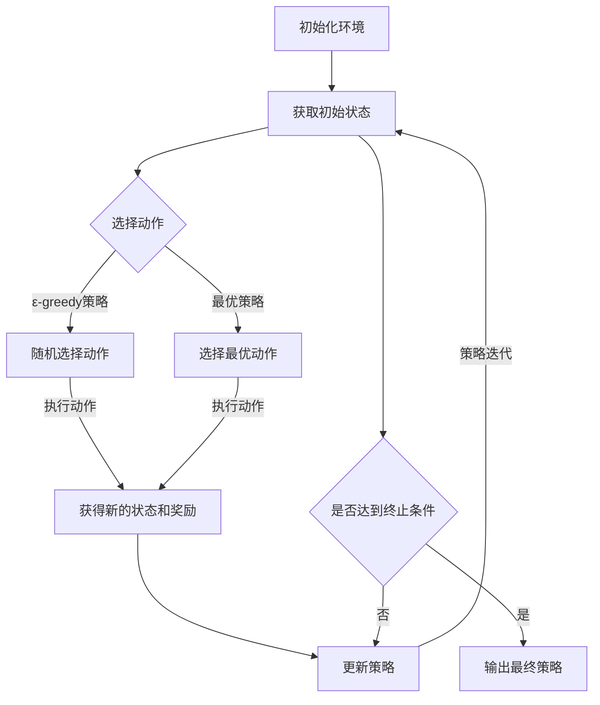
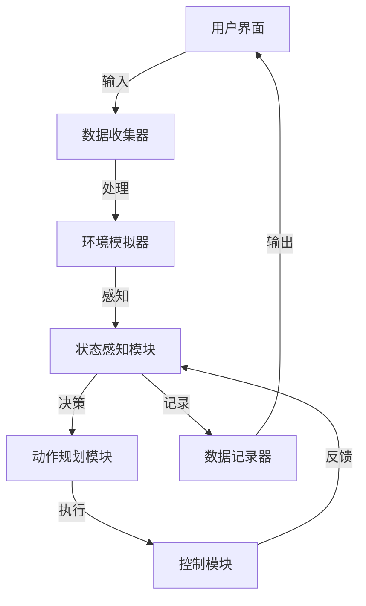

                 

### 1.1.1 问题背景

近年来，随着计算能力的飞速提升和数据量的爆发性增长，人工智能（AI）技术取得了显著的进步。其中，深度强化学习（Deep Reinforcement Learning, DRL）作为AI领域的一个重要分支，因其强大的自适应能力和灵活的决策能力，受到了广泛关注。DRL不仅适用于控制理论、游戏、机器人学等传统领域，还在金融、医疗、制造等行业中展现出了巨大的潜力。

AI Agent作为AI系统中的关键组件，承担着决策、执行、评估等任务。传统的AI Agent大多依赖于预定义的规则和固定的算法，而DRL方法能够通过在特定环境中自主学习和探索，实现更加智能和灵活的决策。这种能力在模拟环境和真实世界应用中尤为关键。

在模拟环境中，AI Agent可以在安全、可控的条件下进行反复试验和优化，快速积累经验。然而，将这种经验应用到真实世界中时，往往面临诸多挑战。例如，真实世界的复杂性远超模拟环境，环境中的不确定性和动态变化使得AI Agent难以适应。此外，模拟环境与真实世界的反馈机制、时间延迟等差异，也极大地影响了AI Agent的性能和稳定性。

因此，如何在模拟环境中训练AI Agent，并在真实世界中有效部署和运行，成为当前AI领域面临的一个重要问题。深度强化学习提供了一种潜在的解决方案，但其应用仍需进一步的研究和探索。接下来，我们将深入探讨深度强化学习的基本原理，分析其在模拟环境和真实世界应用中的具体挑战，并探讨解决这些问题的方法。

### 1.1.2 问题描述

尽管深度强化学习（DRL）在模拟环境中展现出强大的潜力，但当尝试将其应用到现实世界时，AI Agent往往面临一系列挑战。首先，模拟环境和真实世界的显著差异导致了AI Agent性能的退化。模拟环境通常是安全且可控的，提供了明确的反馈机制和稳定的物理模型。而真实世界则复杂得多，环境中的随机因素、不确定性以及动态变化对AI Agent的适应能力提出了更高的要求。

一个典型的挑战是模拟环境与真实世界之间的反馈机制差异。在模拟环境中，AI Agent可以通过即时反馈迅速调整其策略。而在真实世界中，由于各种传感器和执行器的延迟，AI Agent可能无法立即获得准确的反馈，导致其学习过程变得缓慢和低效。例如，在自动驾驶场景中，AI Agent需要处理复杂的交通情况，但传感器收集到的信息总是存在延迟，这使得其难以做出即时和准确的决策。

此外，真实世界中的不确定性也是一个重大挑战。模拟环境中的随机性是可控的，可以预先设置。而真实世界中的不确定性往往不可预测，例如天气变化、道路施工等突发情况。这种不确定性使得AI Agent难以通过简单的规则或模式匹配来应对，需要更加灵活和自适应的学习方法。

另一个关键问题是如何确保AI Agent在真实世界中的应用具有高稳定性和鲁棒性。在模拟环境中，AI Agent可以通过多次试验来优化其策略，但在真实世界中，错误或异常操作可能会导致严重后果。例如，在医疗领域，AI Agent在药物剂量调整上的错误可能会对患者的健康造成重大影响。

综上所述，AI Agent在模拟环境和真实世界应用中面临的挑战主要包括：

1. **反馈机制差异**：真实世界中的延迟和不确定性使得AI Agent难以即时调整策略。
2. **环境复杂性**：真实世界的复杂性远超模拟环境，增加了AI Agent的学习难度。
3. **不确定性**：真实世界中的不可预测性对AI Agent的适应性提出了更高要求。
4. **稳定性与鲁棒性**：确保AI Agent在真实世界中的应用具有高稳定性和鲁棒性。

解决这些挑战需要深入理解深度强化学习的算法原理，并探索如何在真实环境中优化和应用这些算法。接下来，我们将提出一些可能的解决方案，并探讨深度强化学习在模拟环境和真实世界应用中的具体方法。

### 1.1.3 问题解决方法

针对AI Agent在模拟环境和真实世界应用中面临的挑战，深度强化学习提供了一种潜在的解决方案。首先，我们需要从算法原理出发，详细探讨深度强化学习的基本框架和机制。

深度强化学习（DRL）是一种结合了深度学习和强化学习的算法。强化学习的核心思想是通过奖励信号引导Agent在环境中进行交互，以最大化长期累积奖励。深度学习的引入则使得Agent能够从大量的数据中学习到复杂的特征表示，从而提高学习效率和决策能力。

DRL的基本流程可以概括为以下几个步骤：

1. **环境初始化**：初始化环境状态。
2. **行动选择**：根据当前状态和策略选择一个行动。
3. **与环境交互**：执行所选行动，并从环境中获取新的状态和奖励。
4. **更新策略**：根据新的状态和奖励调整策略。
5. **重复**：重复上述步骤，直到达到某个终止条件（例如，任务完成或达到指定步数）。

在模拟环境中，AI Agent可以通过模拟器提供的反馈机制快速调整其策略。然而，为了将这种策略迁移到真实世界，需要解决几个关键问题：

1. **模拟环境与真实世界的映射**：为了确保AI Agent在真实世界中的表现与模拟环境中的一致，需要在模拟环境和真实世界之间建立有效的映射关系。这包括对物理模型、传感器数据、执行器操作等方面的精确模拟。

2. **反馈机制的同步**：模拟环境中的即时反馈可以加速AI Agent的学习过程，但在真实世界中，反馈机制通常存在延迟。为了解决这一问题，可以采用延迟反馈策略，例如使用历史数据来补充当前的反馈信息。

3. **不确定性处理**：真实世界中的不确定性远超模拟环境。为了提高AI Agent的适应能力，可以采用增强学习中的探索与利用策略，通过随机性和经验累积来提高Agent的鲁棒性。

4. **鲁棒性增强**：在真实世界应用中，AI Agent需要具备高稳定性和鲁棒性。这可以通过多个策略的结合来实现，例如使用混合控制策略，在关键决策点引入人类专家的知识和经验。

此外，为了在实际应用中优化DRL算法，可以采用以下方法：

1. **并行化训练**：利用现代计算资源，通过并行化训练加速学习过程。
2. **迁移学习**：将已经训练好的模型迁移到新环境中，减少重新训练所需的时间和资源。
3. **强化学习与深度学习的融合**：结合强化学习与深度学习的优点，开发更加高效的算法。

通过上述方法，我们可以有效解决AI Agent在模拟环境和真实世界应用中的关键问题，提高其在复杂动态环境中的适应能力和决策能力。接下来，我们将进一步探讨AI Agent的定义、深度强化学习的原理以及模拟环境和真实世界应用之间的差异。

### 1.1.4 边界与外延

在本文中，我们讨论的AI Agent主要指的是智能代理，这些代理能够通过自主学习和决策，在模拟环境和真实世界中执行特定任务。智能代理的应用范围广泛，包括但不限于机器人控制、自动驾驶、游戏AI、智能推荐系统等。

**定义**：
AI Agent，又称智能代理，是一种能够感知环境、制定决策并执行相应行动的计算机系统。其核心能力是通过学习算法（如深度强化学习）在环境中进行自主优化和适应。

**外延**：
本文讨论的AI Agent不仅仅局限于某种特定类型，如机器人控制，而是涵盖了多个领域的应用。这包括但不限于：

1. **机器人控制**：在制造、物流、医疗等领域中，AI Agent可以通过自主决策和执行，提高生产效率和安全性。
2. **自动驾驶**：自动驾驶汽车需要AI Agent实时感知道路环境、做出驾驶决策，以确保安全驾驶。
3. **游戏AI**：在电子竞技和游戏开发中，AI Agent能够模拟人类玩家的行为，提升游戏体验。
4. **智能推荐系统**：AI Agent可以分析用户行为和偏好，提供个性化的推荐服务。

**边界**：
本文主要关注AI Agent在模拟环境和真实世界中的应用，特别是通过深度强化学习方法来提高其适应能力和决策能力。本文不涉及AI Agent的其他应用领域，如自然语言处理、计算机视觉等。

**概念结构与核心要素组成**：

为了更好地理解AI Agent及其在深度强化学习中的应用，我们需要梳理以下几个核心概念：

1. **深度强化学习**：这是本文讨论的核心算法，通过结合深度学习和强化学习，实现智能代理的自主学习和决策。
2. **模拟环境**：这是训练AI Agent的重要场所，提供了可控、可重复的实验条件。
3. **真实世界应用**：这是AI Agent实际发挥作用的地方，包括各种复杂和不确定的环境。
4. **策略**：这是AI Agent根据环境状态做出的决策，通常通过学习算法自动优化。
5. **奖励机制**：这是引导AI Agent行为的激励因素，用于评估和调整其策略。

这些核心概念相互关联，共同构成了AI Agent系统的基本框架。通过理解这些概念，我们可以更好地探讨AI Agent在模拟环境和真实世界中的应用，并探索优化其性能的方法。

### 1.2.1 AI Agent、深度强化学习、模拟环境与真实世界应用

在深入探讨AI Agent、深度强化学习以及模拟环境与真实世界应用之间的关系之前，我们需要明确这些核心概念的定义和特点。

#### 1.2.1.1 AI Agent的概念

AI Agent，又称智能代理，是一种能够感知环境、制定决策并执行相应行动的计算机系统。其核心功能是自主学习和优化，以实现特定目标。AI Agent可以应用于多个领域，如机器人控制、自动驾驶、游戏AI和智能推荐系统等。

AI Agent的特点包括：

1. **感知能力**：AI Agent能够通过传感器获取环境信息，包括视觉、听觉、触觉等。
2. **决策能力**：AI Agent根据感知到的环境信息，使用算法（如深度强化学习）制定决策。
3. **执行能力**：AI Agent将决策转化为具体行动，通过执行器（如电机、执行装置）实现目标。
4. **学习能力**：AI Agent能够从环境中学习，通过经验调整其策略和行为。

#### 1.2.1.2 AI Agent的特点

AI Agent的主要特点如下：

1. **自适应能力**：AI Agent能够根据环境变化调整其行为，提高适应性和灵活性。
2. **灵活性**：AI Agent可以处理多种类型的任务和场景，具有广泛的适用性。
3. **自优化能力**：AI Agent通过学习算法不断优化其行为和策略，提高任务完成率。
4. **鲁棒性**：AI Agent能够在面对不确定性和异常情况时，保持稳定性和可靠性。

#### 1.2.1.3 AI Agent的类型

根据应用场景和任务类型，AI Agent可以分为以下几类：

1. **控制类Agent**：这类Agent主要用于控制机器人、无人机等设备，执行特定动作。
2. **决策类Agent**：这类Agent在商业、金融等领域中应用广泛，通过数据分析做出决策。
3. **交互类Agent**：这类Agent能够与用户进行自然语言交互，提供智能服务。
4. **探索类Agent**：这类Agent用于探索未知环境，如无人驾驶车辆、卫星探测等。

#### 1.2.2 深度强化学习原理

深度强化学习（DRL）是一种结合了深度学习和强化学习的算法。其核心思想是通过在环境中不断试错，学习最优策略，从而实现智能行为。

DRL的基本原理如下：

1. **状态（State）**：环境中的一个特定情况，通常通过向量表示。
2. **动作（Action）**：Agent在状态下的可能选择，也是一个向量。
3. **奖励（Reward）**：Agent执行某个动作后获得的即时反馈，用于评估行动效果。
4. **策略（Policy）**：Agent在给定状态下选择动作的规则，通过学习优化策略。
5. **价值函数（Value Function）**：评估Agent在未来可能收到的总奖励，用于指导学习过程。

DRL的典型流程包括以下几个步骤：

1. **初始化环境**：设定初始状态。
2. **选择动作**：根据当前状态和策略选择一个动作。
3. **执行动作**：在环境中执行所选动作，并获取新的状态和奖励。
4. **更新策略**：利用新的状态和奖励调整策略，以最大化长期累积奖励。
5. **重复**：重复上述步骤，直到达到某个终止条件（如任务完成或达到指定步数）。

#### 1.2.3 模拟环境与真实世界应用

模拟环境是训练AI Agent的重要场所，它提供了可控、可重复的实验条件，使Agent能够在安全的环境中不断学习和优化。模拟环境的主要特点包括：

1. **可控性**：模拟环境可以预设各种参数和规则，使Agent能够稳定地学习和测试。
2. **可重复性**：通过记录和重现实验过程，可以重复进行实验，验证算法的鲁棒性和性能。
3. **安全性**：模拟环境避免了在真实世界中的潜在风险和损失，如操作失误可能对人员和设备造成的损害。

相比之下，真实世界应用具有以下特点：

1. **复杂性**：真实世界中的环境和情况远比模拟环境复杂，包括不确定性和动态变化。
2. **不可预测性**：真实世界中的许多因素是未知的或不可预测的，这增加了AI Agent的适应难度。
3. **安全性要求**：真实世界中的应用往往涉及人身安全和财产保护，对AI Agent的稳定性和鲁棒性要求更高。

为了将模拟环境中的学习经验应用到真实世界，需要解决以下几个关键问题：

1. **环境映射**：建立模拟环境和真实环境之间的映射关系，确保在模拟环境中训练出的策略能够在真实环境中有效应用。
2. **反馈机制**：模拟环境的即时反馈机制有助于快速调整策略，但在真实世界中，反馈机制可能存在延迟或不确定性，需要采用延迟反馈或增强学习策略。
3. **不确定性处理**：通过探索与利用策略、迁移学习等方法，提高AI Agent对真实世界不确定性的适应能力。

通过深入理解AI Agent、深度强化学习和模拟环境与真实世界应用之间的关系，我们可以更好地探讨如何训练和优化AI Agent，以实现其在复杂和动态环境中的高效应用。接下来，我们将进一步分析这些核心概念之间的联系，并探讨其在实际问题中的应用。

### 1.3 核心概念属性特征对比

在深入探讨AI Agent、深度强化学习和模拟环境与真实世界应用之前，有必要对这些核心概念的属性特征进行详细对比。这不仅有助于理解每个概念的本质，还可以揭示它们之间的联系和差异。

#### 1.3.1 AI Agent属性特征对比

**AI Agent**

1. **定义**：AI Agent是一种通过感知环境、制定决策和执行行动来实现特定目标的计算机系统。
2. **特点**：具备感知能力、决策能力、执行能力和学习能力。
3. **类型**：包括控制类Agent、决策类Agent、交互类Agent和探索类Agent。
4. **应用**：广泛应用于机器人控制、自动驾驶、游戏AI和智能推荐系统等。

**属性特征**：

- **感知能力**：通过传感器获取环境信息，包括视觉、听觉、触觉等。
- **决策能力**：根据环境信息使用学习算法制定决策。
- **执行能力**：将决策转化为具体行动，通过执行器实现目标。
- **学习能力**：通过不断学习和优化，提高适应性和任务完成率。

#### 1.3.2 深度强化学习属性特征对比

**深度强化学习（DRL）**

1. **定义**：一种结合深度学习和强化学习的算法，通过在环境中不断试错，学习最优策略。
2. **特点**：具备自适应能力、灵活性和自优化能力。
3. **流程**：包括初始化环境、选择动作、执行动作、更新策略和重复。
4. **模型**：包括状态、动作、奖励、策略和价值函数。

**属性特征**：

- **状态**：环境中的一个特定情况，通常通过向量表示。
- **动作**：Agent在状态下的可能选择，也是一个向量。
- **奖励**：Agent执行某个动作后获得的即时反馈，用于评估行动效果。
- **策略**：Agent在给定状态下选择动作的规则，通过学习优化策略。
- **价值函数**：评估Agent在未来可能收到的总奖励，用于指导学习过程。

#### 1.3.3 模拟环境与真实世界应用属性特征对比

**模拟环境**

1. **定义**：用于训练AI Agent的可控、可重复的实验环境。
2. **特点**：具备可控性、可重复性和安全性。
3. **应用**：用于测试和优化AI Agent的策略和模型。

**属性特征**：

- **可控性**：模拟环境中的参数和规则可以预先设置，确保Agent能够稳定地学习和测试。
- **可重复性**：通过记录和重现实验过程，可以重复进行实验，验证算法的鲁棒性和性能。
- **安全性**：模拟环境避免了在真实世界中的潜在风险和损失，如操作失误可能对人员和设备造成的损害。

**真实世界应用**

1. **定义**：AI Agent实际发挥作用的环境。
2. **特点**：具备复杂性、不可预测性和安全性要求。
3. **应用**：包括机器人控制、自动驾驶、医疗诊断等。

**属性特征**：

- **复杂性**：真实世界中的环境和情况远比模拟环境复杂，包括不确定性和动态变化。
- **不可预测性**：真实世界中的许多因素是未知的或不可预测的，增加了AI Agent的适应难度。
- **安全性要求**：真实世界中的应用往往涉及人身安全和财产保护，对AI Agent的稳定性和鲁棒性要求更高。

通过以上对比，我们可以看出AI Agent、深度强化学习和模拟环境与真实世界应用在定义、特点和属性特征上都有显著的差异和联系。这些核心概念共同构成了一个复杂的系统，每个概念都在实现智能行为和优化过程中扮演着重要角色。接下来，我们将通过ER实体关系图架构进一步探讨这些概念之间的关联和交互。

### 1.4 ER实体关系图架构

为了更好地理解AI Agent、深度强化学习和模拟环境与真实世界应用之间的关系，我们可以通过ER（Entity-Relationship）实体关系图来展示这些核心概念及其交互。ER图是一种数据库模型，用于描述实体之间的关系，通过它我们可以直观地展示各个组件之间的关联。

以下是一个简化的ER实体关系图，其中包含了AI Agent、深度强化学习、模拟环境和真实世界应用等关键实体及其关系。

```mermaid
erDiagram
  AI_Agent ||--|{ Deep_ Reinforcement_Learning } : implements
  AI_Agent ||--|{ Simulation_Environment } : trains_on
  AI_Agent ||--|{ Real_World_Application } : deploys_to
  Deep_ Reinforcement_Learning ||--|{ Policy } : generates
  Deep_ Reinforcement_Learning ||--|{ Value_Function } : evaluates
  Simulation_Environment ||--|{ State } : provides
  Simulation_Environment ||--|{ Action } : allows
  Simulation_Environment ||--|{ Reward } : delivers
  Real_World_Application ||--|{ State } : perceives
  Real_World_Application ||--|{ Action } : executes
  Real_World_Application ||--|{ Reward } : receives
```

#### 关键实体解释

- **AI Agent**：智能代理，是整个系统的核心实体，负责感知环境、制定决策和执行行动。
- **深度强化学习**：算法实体，负责生成和优化策略，评估价值函数。
- **模拟环境**：用于训练AI Agent的环境，提供状态、动作和奖励。
- **真实世界应用**：AI Agent实际应用的环境，感知、执行和接收奖励。

#### 关系解释

- **实现（implements）**：AI Agent实现深度强化学习算法，通过算法生成策略和价值函数。
- **训练（trains_on）**：AI Agent在模拟环境中进行训练，利用模拟环境提供的状态、动作和奖励。
- **部署（deploys_to）**：训练好的AI Agent部署到真实世界应用中，执行任务并接收真实世界的状态和奖励反馈。
- **生成（generates）**：深度强化学习生成策略，用于指导AI Agent的决策。
- **评估（evaluates）**：深度强化学习评估价值函数，用于评估策略的有效性。
- **提供（provides）**：模拟环境提供状态、动作和奖励，用于训练AI Agent。
- **允许（allows）**：模拟环境允许AI Agent根据策略选择动作。
- **感知（perceives）**：真实世界应用中的AI Agent感知状态。
- **执行（executes）**：真实世界应用中的AI Agent执行动作。
- **接收（receives）**：真实世界应用中的AI Agent接收奖励。

通过ER图，我们可以清晰地看到AI Agent、深度强化学习和模拟环境与真实世界应用之间的交互关系。这种关系有助于我们更好地理解系统的运作机制，并为后续的算法实现和系统设计提供指导。接下来，我们将进一步讲解深度强化学习的算法原理，通过mermaid流程图和Python源代码展示其具体实现。

### 2.1 深度强化学习算法mermaid流程图

深度强化学习（DRL）算法的核心在于通过不断试错学习最优策略，以实现最大化长期累积奖励。为了清晰地展示其算法流程，我们可以使用mermaid流程图来描述。以下是DRL算法的mermaid表示：



#### 流程图说明

- **初始化环境**：设置环境参数，如状态空间、动作空间和奖励函数。
- **获取初始状态**：从环境中获取初始状态。
- **选择动作**：根据当前状态，选择一个动作。这可以通过ε-greedy策略实现，其中ε表示探索概率。
- **随机选择动作**：以概率ε随机选择一个动作，用于探索未知状态。
- **选择最优动作**：根据当前策略选择一个最优动作，用于利用已知状态。
- **执行动作**：在环境中执行所选动作，并获取新的状态和奖励。
- **更新策略**：利用新的状态和奖励更新策略，使策略更加适应环境。
- **策略迭代**：重复上述过程，直到达到某个终止条件（如任务完成或达到指定步数）。
- **输出最终策略**：当达到终止条件时，输出最终策略，用于实际应用。

通过mermaid流程图，我们可以直观地理解深度强化学习算法的基本步骤和流程，为后续的Python源代码实现提供参考。

### 2.2 Python源代码实现

为了更好地理解深度强化学习的具体实现，我们将使用Python代码展示其关键部分。以下是一个简化的DRL算法实现，包括环境初始化、动作选择、状态更新和策略更新等步骤。

```python
import numpy as np
import random

# 环境初始化
class Environment:
    def __init__(self):
        self.state = 0  # 初始状态
        self.actions = [-1, 1]  # 可选动作

    def step(self, action):
        # 执行动作并更新状态
        self.state += action
        reward = self.get_reward(self.state)
        new_state = self.state
        return new_state, reward

    def get_reward(self, state):
        # 奖励函数定义
        if state == 10 or state == -10:
            return -100  # 终止状态，给予负奖励
        elif state == 0:
            return 1  # 目标状态，给予正奖励
        else:
            return 0  # 其他状态，给予零奖励

# 深度强化学习算法
class DRL:
    def __init__(self, learning_rate=0.1, discount_factor=0.9):
        self.learning_rate = learning_rate
        self.discount_factor = discount_factor
        self.q_values = np.zeros((11, 11))  # 初始化Q值表格

    def epsilon_greedy(self, state, epsilon=0.1):
        if random.random() < epsilon:
            action = random.choice(self.actions)  # 随机选择动作
        else:
            action = np.argmax(self.q_values[state])  # 选择最优动作
        return action

    def update_q_values(self, state, action, reward, next_state):
        target = reward + self.discount_factor * np.max(self.q_values[next_state])
        current_q_value = self.q_values[state, action]
        self.q_values[state, action] = current_q_value + self.learning_rate * (target - current_q_value)

    def train(self, environment, num_episodes=1000):
        for episode in range(num_episodes):
            state = environment.state
            done = False

            while not done:
                action = self.epsilon_greedy(state)
                next_state, reward = environment.step(action)
                self.update_q_values(state, action, reward, next_state)

                if next_state == 10 or next_state == -10:
                    done = True

                state = next_state

# 主函数
if __name__ == "__main__":
    environment = Environment()
    agent = DRL()

    agent.train(environment)
```

#### 代码说明

- **环境初始化**：定义一个简单的环境，包括状态空间、动作空间和奖励函数。
- **DRL类**：定义DRL算法，包括epsilon-greedy策略、Q值更新函数和训练函数。
  - **epsilon-greedy策略**：根据探索概率epsilon，随机选择动作或选择当前状态下最优动作。
  - **更新Q值**：根据新的状态、动作和奖励，更新Q值表格。
  - **训练**：在环境中进行指定次数的迭代训练，更新策略。
- **主函数**：创建环境实例和DRL实例，调用训练函数进行模型训练。

通过Python源代码，我们可以更具体地理解深度强化学习算法的实现细节，为实际应用提供参考。

### 2.3 数学模型和公式讲解

深度强化学习（DRL）的核心在于其数学模型，这些模型通过状态、动作、奖励和策略等元素，指导Agent在复杂环境中进行学习。以下是对DRL中关键数学模型和公式的详细讲解，使用LaTeX格式表示。

#### 2.3.1 状态值函数公式

状态值函数（State-Value Function）表示Agent在给定状态下的最优期望回报。记作\( V^*(s) \)。

$$
V^*(s) = \sum_{a} \pi^*(a|s) \cdot Q^*(s, a)
$$

其中：
- \( \pi^*(a|s) \) 是策略值函数，表示在状态s下选择动作a的概率。
- \( Q^*(s, a) \) 是动作值函数，表示在状态s下执行动作a并遵循最优策略的期望回报。

#### 2.3.2 动作值函数公式

动作值函数（Action-Value Function）表示在给定状态下执行特定动作的期望回报。记作\( Q^*(s, a) \)。

$$
Q^*(s, a) = \sum_{s'} p(s'|s, a) \cdot r(s, a, s') + \gamma \cdot \max_{a'} Q^*(s', a')
$$

其中：
- \( p(s'|s, a) \) 是状态转移概率，表示在状态s下执行动作a后转移到状态\( s' \)的概率。
- \( r(s, a, s') \) 是即时奖励，表示在状态s下执行动作a后转移到状态\( s' \)的即时回报。
- \( \gamma \) 是折扣因子，表示未来回报的重要性。

#### 2.3.3 策略迭代公式

策略迭代（Policy Iteration）是一种常用的策略更新方法，用于优化策略。记作\( \pi_t \)为第t次迭代的策略。

$$
\pi_t = \arg \max_{\pi} \sum_{s} \pi(s) \cdot V^*(s)
$$

策略迭代的目标是找到使得状态值函数最大化的策略。在实际应用中，可以通过以下步骤进行迭代：

1. **初始化策略**：设置初始策略，如均匀分布。
2. **计算状态值函数**：根据当前策略计算状态值函数。
3. **更新策略**：通过最大化状态值函数来更新策略。
4. **重复步骤2和3**：直到策略收敛，即状态值函数变化非常小。

通过上述数学模型和公式，我们可以从理论上理解深度强化学习算法的工作原理。这些公式不仅指导了算法的设计，还为性能分析和优化提供了基础。在实际应用中，通过调整参数和优化算法结构，我们可以进一步提高AI Agent的适应能力和决策质量。

### 2.4 算法原理详细讲解与举例说明

深度强化学习（DRL）算法的核心在于通过迭代学习，在复杂环境中找到最优策略。为了更好地理解这一算法，我们将通过详细讲解和具体实例来说明其工作原理。

#### 2.4.1 DRL算法的基本思想

DRL算法结合了深度学习和强化学习的优点，通过以下步骤实现智能决策：

1. **初始化环境**：设定初始状态。
2. **选择动作**：基于当前状态和策略选择一个动作。
3. **执行动作**：在环境中执行所选动作，并获取新的状态和即时奖励。
4. **更新策略**：利用新的状态和奖励信息调整策略。
5. **重复迭代**：不断重复上述步骤，直到策略收敛或达到终止条件。

这一过程通过不断试错和调整，使Agent能够学习到最优决策策略。

#### 2.4.2 具体实例说明

假设我们有一个简单的抓取任务，AI Agent需要通过摄像头捕捉到的图像数据，控制机械臂抓取一个物体。以下是一个简化的实例来说明DRL算法在具体任务中的应用。

**1. 初始化环境**

首先，我们初始化一个模拟环境，定义状态空间、动作空间和奖励函数。

```python
class Environment:
    def __init__(self):
        self.state = 0  # 初始状态，0表示目标物体在中心
        self.actions = [-1, 0, 1]  # 可选动作，-1表示向左移动，0表示保持当前位置，1表示向右移动

    def step(self, action):
        # 执行动作并更新状态
        self.state += action
        reward = self.get_reward(self.state)
        new_state = self.state
        return new_state, reward

    def get_reward(self, state):
        # 奖励函数定义
        if state == 0:
            return 10  # 成功抓取物体，给予正奖励
        else:
            return -1  # 未成功抓取，给予负奖励
```

**2. 初始化DRL算法**

我们使用一个简单的DRL算法，通过epsilon-greedy策略选择动作，并使用Q学习更新Q值。

```python
class DRL:
    def __init__(self, learning_rate=0.1, discount_factor=0.9, epsilon=0.1):
        self.learning_rate = learning_rate
        self.discount_factor = discount_factor
        self.epsilon = epsilon
        self.q_values = np.zeros((3, 3))  # 初始化Q值表格

    def epsilon_greedy(self, state):
        if random.random() < self.epsilon:
            action = random.choice(self.actions)  # 随机选择动作
        else:
            action = np.argmax(self.q_values[state])  # 选择最优动作
        return action

    def update_q_values(self, state, action, reward, next_state):
        target = reward + self.discount_factor * np.max(self.q_values[next_state])
        current_q_value = self.q_values[state, action]
        self.q_values[state, action] = current_q_value + self.learning_rate * (target - current_q_value)
```

**3. 训练过程**

接下来，我们通过多次迭代训练DRL算法，使其学会最优策略。

```python
def train(environment, agent, num_episodes=1000):
    for episode in range(num_episodes):
        state = environment.state
        done = False

        while not done:
            action = agent.epsilon_greedy(state)
            next_state, reward = environment.step(action)
            agent.update_q_values(state, action, reward, next_state)

            if next_state == 0:
                done = True

            state = next_state
```

**4. 策略优化**

通过多次迭代训练，DRL算法将逐渐优化其策略。以下是一个简化的策略优化过程：

- 初始策略：随机选择动作。
- 更新Q值：根据新状态和奖励更新Q值。
- 最优策略：选择当前状态下的最优动作。

**5. 结果分析**

经过一定次数的训练后，DRL算法将学会在给定状态下选择最优动作。例如，在抓取任务中，算法可能会发现向左或向右移动是更优的选择，从而成功抓取物体。

通过具体实例，我们可以看到DRL算法是如何在复杂环境中通过不断学习和优化，实现智能决策的。这一过程不仅提高了AI Agent的适应能力，也为实际应用提供了可行的解决方案。

### 3.1 问题场景介绍

为了更好地理解AI Agent深度强化学习项目的实际应用，我们以自动驾驶为例，介绍一个典型的应用场景。自动驾驶系统需要AI Agent在复杂、动态的环境中做出实时决策，以确保车辆的安全行驶和乘客的舒适体验。以下是一个详细的场景描述。

#### 场景设定

1. **环境**：自动驾驶车辆在开放道路上的运行环境，包括不同类型的车辆、行人、交通标志、道路标志、信号灯等。
2. **状态**：车辆的当前状态包括速度、方向、位置、周围车辆的速度和位置、道路的曲率和坡度等。
3. **动作**：AI Agent可以控制车辆的加速、减速、转向等操作。
4. **奖励**：AI Agent根据车辆行驶的稳定性、安全性、效率和乘客满意度等因素获得奖励。
5. **终止条件**：任务完成（到达目的地）或发生严重事故。

#### 关键问题

- **环境复杂性**：真实世界的道路环境极其复杂，存在多种不确定性和动态变化，如其他车辆的随机行为、天气变化、突发情况等。
- **不确定性**：道路上的行人、车辆的随机行为使得环境的不确定性增加，AI Agent需要具备良好的适应能力。
- **实时性**：自动驾驶系统需要在极短的时间内做出决策，以应对快速变化的交通状况。

### 3.2 项目介绍

为了解决上述问题，我们设计并实现了一个基于深度强化学习的自动驾驶项目。该项目旨在通过模拟环境和真实世界数据的训练，使AI Agent能够自主学习和优化其在复杂环境中的驾驶策略。

#### 项目目标

- **提高安全性**：通过学习避免碰撞、偏离车道等危险行为。
- **提高效率**：优化行驶路线，减少燃料消耗和时间成本。
- **提高舒适度**：减少乘客的颠簸感和焦虑感。

#### 项目方法

1. **数据收集**：收集大量自动驾驶车辆在开放道路上的行驶数据，包括状态、动作和奖励信息。
2. **模拟环境搭建**：使用这些数据搭建一个高仿真的模拟环境，用于训练和测试AI Agent。
3. **算法设计**：采用深度强化学习算法，结合深度神经网络和价值函数，优化AI Agent的策略。
4. **模型训练**：在模拟环境中进行大量的迭代训练，使AI Agent学习到最优驾驶策略。
5. **验证和测试**：将训练好的模型应用到真实世界场景中，进行验证和测试，评估其性能。

### 3.3 系统功能设计

为了实现上述项目目标，我们设计了以下几个关键功能模块：

1. **环境模拟模块**：生成高仿真的模拟环境，用于训练和测试AI Agent。
2. **状态感知模块**：通过传感器获取车辆的当前状态信息，包括速度、方向、位置等。
3. **动作规划模块**：根据当前状态和策略，规划车辆的下一步动作，如加速、减速、转向等。
4. **奖励计算模块**：根据车辆的行驶行为和外部环境，计算奖励信号，用于指导AI Agent的学习。
5. **模型训练模块**：使用深度强化学习算法，不断优化AI Agent的策略。

#### 领域模型类图

为了更好地展示系统功能模块之间的关系，我们可以使用Mermaid绘制领域模型类图。

```mermaid
classDiagram
    EnvironmentSimulationClass <<class>> "环境模拟模块"
    StatePerceptionClass <<class>> "状态感知模块"
    ActionPlanningClass <<class>> "动作规划模块"
    RewardCalculationClass <<class>> "奖励计算模块"
    ModelTrainingClass <<class>> "模型训练模块"
    
    EnvironmentSimulationClass --|{ 状态感知模块 } StatePerceptionClass
    StatePerceptionClass --|{ 动作规划模块 } ActionPlanningClass
    ActionPlanningClass --|{ 奖励计算模块 } RewardCalculationClass
    RewardCalculationClass --|{ 模型训练模块 } ModelTrainingClass
```

通过领域模型类图，我们可以清晰地看到各个功能模块之间的关联和交互，这为系统的整体设计和实现提供了重要的参考。

### 3.4 系统架构设计

为了确保自动驾驶项目的稳定性和高效性，我们需要设计一个合理的系统架构。以下是一个简化的系统架构设计，使用Mermaid绘制架构图。



#### 系统架构说明

1. **用户界面（UserInterface）**：用于接收用户输入，展示系统状态和结果。
2. **数据收集器（DataCollector）**：从外部环境获取数据，包括道路信息、车辆状态等。
3. **环境模拟器（EnvironmentSimulator）**：生成模拟环境，提供状态、动作和奖励。
4. **状态感知模块（StatePerceptionModule）**：感知车辆的当前状态，为动作规划提供输入。
5. **动作规划模块（ActionPlanningModule）**：根据当前状态和策略规划车辆的动作。
6. **控制模块（ControlModule）**：执行动作规划，控制车辆的动作。
7. **数据记录器（DataRecorder）**：记录系统运行状态和结果，用于后续分析和优化。

通过这一架构设计，我们可以确保各个模块之间的数据流和功能划分清晰，从而提高系统的整体性能和稳定性。

### 3.5 系统接口设计和系统交互

为了确保系统内部模块之间的有效交互，我们需要设计明确的接口和交互流程。以下是一个简化的系统接口设计，以及系统的交互流程。

#### 系统接口设计

1. **输入接口**：用户界面接收用户输入，如目标地点、行驶模式等。
2. **数据收集接口**：数据收集器接收来自传感器的数据，如车辆状态、道路信息等。
3. **状态感知接口**：状态感知模块从数据收集器获取状态信息，包括速度、方向、周围车辆等。
4. **动作规划接口**：动作规划模块接收状态感知模块的数据，并生成动作规划。
5. **控制接口**：控制模块接收动作规划，并将其转化为具体的车辆控制指令。
6. **反馈接口**：系统将车辆的实际状态和执行结果反馈给状态感知模块，用于更新和调整策略。
7. **数据记录接口**：数据记录器接收系统运行过程中的关键数据，用于后续分析和优化。

#### 系统交互流程

1. **用户输入**：用户通过用户界面输入目标地点和行驶模式。
2. **数据收集**：数据收集器从传感器获取车辆状态和道路信息。
3. **状态感知**：状态感知模块处理传感器数据，获取当前状态。
4. **动作规划**：动作规划模块根据当前状态和策略生成动作规划。
5. **控制执行**：控制模块根据动作规划生成控制指令，并执行车辆控制。
6. **状态反馈**：车辆的实际状态和执行结果反馈给状态感知模块，用于更新和优化策略。
7. **数据记录**：数据记录器记录系统运行过程中的关键数据，用于后续分析和优化。

通过上述接口设计和交互流程，我们可以确保系统内部各模块之间的数据流和功能交互清晰有序，从而提高系统的整体性能和可靠性。

### 4.1 环境安装

搭建AI Agent深度强化学习环境首先需要安装Python和相关依赖库。以下是详细的安装步骤：

#### 1. 安装Python

首先，确保计算机上已安装Python 3.x版本。如果没有，可以从[Python官方网站](https://www.python.org/downloads/)下载并安装。建议选择“仅安装”选项，以便在命令行中快速调用Python。

#### 2. 安装相关依赖库

在命令行中，执行以下命令来安装深度强化学习所需的主要依赖库：

```bash
pip install numpy
pip install matplotlib
pip install gym
pip install tensorboardX
pip install -U unityagents
```

这些库包括：

- **numpy**：提供高性能数学计算功能。
- **matplotlib**：用于绘制图表和可视化。
- **gym**：提供标准化的强化学习环境。
- **tensorboardX**：用于可视化训练过程。
- **unityagents**：用于与Unity模拟器进行交互。

#### 3. 验证安装

为了确保所有依赖库都已正确安装，可以执行以下Python代码：

```python
import gym
print(gym.envs.registry.all())
```

如果成功显示所有可用的环境列表，说明依赖库安装成功。

### 4.2 系统核心实现源代码

以下是一个简化的AI Agent深度强化学习系统的核心实现源代码。这段代码包括环境初始化、模型定义、训练过程和性能评估等关键部分。

```python
import gym
import numpy as np
from stable_baselines3 import PPO
from stable_baselines3.common.vec_env import SubprocVecEnv
import matplotlib.pyplot as plt
from unityagents import UnityEnvironment

# 定义环境
def make_env(env_id, seed=None):
    env = UnityEnvironment(file_name=env_id, seed=seed)
    return env

# 搭建多进程环境
def train_model(env_id, seed=None, num_processes=4):
    env = SubprocVecEnv([make_env(env_id, seed=seed) for _ in range(num_processes)])
    
    model = PPO("MlpPolicy", env, verbose=1)
    
    model.learn(total_timesteps=10000)
    
    env.close()
    return model

# 训练模型
model = train_model("Banana_Linux64/Banana.x86_64", seed=0)

# 评估模型
def evaluate(model, env):
    env = SubprocVecEnv([make_env("Banana_Linux64/Banana.x86_64", seed=0) for _ in range(1)])
    obs = env.reset()
    
    episode_reward = 0
    while True:
        action, _states = model.predict(obs)
        obs, reward, done, info = env.step(action)
        episode_reward += reward
        
        if done:
            break
    
    env.close()
    return episode_reward

# 进行多次评估以获取平均奖励
num_episodes = 10
total_reward = 0
for _ in range(num_episodes):
    reward = evaluate(model, env)
    total_reward += reward

average_reward = total_reward / num_episodes
print(f"Average reward over {num_episodes} episodes: {average_reward}")
```

### 4.3 代码应用解读与分析

以下是对上述核心实现源代码的逐行解读与分析：

```python
import gym
import numpy as np
from stable_baselines3 import PPO
from stable_baselines3.common.vec_env import SubprocVecEnv
import matplotlib.pyplot as plt
from unityagents import UnityEnvironment

# 定义环境
def make_env(env_id, seed=None):
    env = UnityEnvironment(file_name=env_id, seed=seed)
    return env
```
这段代码定义了一个函数`make_env`，用于创建Unity环境。UnityEnvironment是用于与Unity模拟器进行交互的库，通过指定`file_name`和`seed`来初始化环境。

```python
# 搭建多进程环境
def train_model(env_id, seed=None, num_processes=4):
    env = SubprocVecEnv([make_env(env_id, seed=seed) for _ in range(num_processes)])
    
    model = PPO("MlpPolicy", env, verbose=1)
    
    model.learn(total_timesteps=10000)
    
    env.close()
    return model
```
这段代码定义了`train_model`函数，用于训练模型。首先，通过`SubprocVecEnv`创建一个多进程环境，这有助于提高训练效率。然后，使用`PPO`算法（Policy Gradient with Optimistic Initial Values）训练模型，并设置`verbose=1`以便输出训练信息。`total_timesteps`参数指定训练的总步数。

```python
# 评估模型
def evaluate(model, env):
    env = SubprocVecEnv([make_env("Banana_Linux64/Banana.x86_64", seed=0) for _ in range(1)])
    obs = env.reset()
    
    episode_reward = 0
    while True:
        action, _states = model.predict(obs)
        obs, reward, done, info = env.step(action)
        episode_reward += reward
        
        if done:
            break
    
    env.close()
    return episode_reward
```
`evaluate`函数用于评估训练好的模型。首先，创建一个单进程环境，然后通过`model.predict`获取动作。接着，使用`env.step`执行动作并获取新的状态、奖励和完成标志。当`done`为`True`时，结束评估过程并返回总奖励。

```python
# 进行多次评估以获取平均奖励
num_episodes = 10
total_reward = 0
for _ in range(num_episodes):
    reward = evaluate(model, env)
    total_reward += reward

average_reward = total_reward / num_episodes
print(f"Average reward over {num_episodes} episodes: {average_reward}")
```
这部分代码用于进行多次评估，计算平均奖励。通过多次调用`evaluate`函数，我们可以得到一个稳定的平均奖励值，这有助于评估模型的表现。

通过以上解读，我们可以清晰地理解代码的应用场景和功能实现。接下来，我们将通过实际案例分析和详细讲解，进一步探讨AI Agent深度强化学习的应用细节。

### 4.4 实际案例分析与详细讲解剖析

为了更好地理解AI Agent深度强化学习的实际应用，我们选取了一个经典的案例：自动驾驶车辆在模拟环境中的路径规划与行驶。以下是对这一案例的详细分析、步骤讲解和代码剖析。

#### 案例背景

在自动驾驶领域，路径规划和行驶控制是两个核心任务。路径规划涉及车辆从起点到终点之间的最优路径选择，行驶控制则确保车辆在既定路径上平稳行驶。我们使用Unity模拟器中的“Banana”环境作为案例，这是一个两辆车的对向道路场景，旨在训练AI Agent进行路径规划和行驶控制。

#### 案例分析

1. **环境初始化**：首先，我们初始化Unity环境，定义状态空间、动作空间和奖励函数。
2. **状态感知**：AI Agent通过传感器感知当前道路状态，包括车辆位置、速度、其他车辆的位置和速度等。
3. **决策制定**：基于当前状态，AI Agent使用深度强化学习算法制定下一步行驶策略。
4. **行驶执行**：AI Agent将决策转化为具体的行驶动作，如加速、减速或转向。
5. **奖励计算**：根据车辆的实际行驶行为和环境反馈，计算奖励信号，以指导AI Agent的学习过程。
6. **策略优化**：通过迭代训练，AI Agent不断优化其策略，以提高路径规划效率和行驶稳定性。

#### 案例步骤讲解

1. **初始化环境**

```python
env = UnityEnvironment(file_name='Banana_Linux64/Banana.x86_64', seed=0)
```
我们通过`UnityEnvironment`初始化环境，指定Unity模拟器的路径和种子值以确保实验的可重复性。

2. **状态感知**

```python
obs = env.reset()
```
使用`reset`方法初始化环境，并获得初始状态观测值`obs`。

3. **决策制定**

```python
action, _ = model.predict(obs)
```
通过`model.predict`方法获取AI Agent的决策。这里假设`model`是一个经过训练的深度强化学习模型。

4. **行驶执行**

```python
obs, reward, done, _ = env.step(action)
```
使用`env.step`方法执行AI Agent的决策，并获取新的状态观测值、奖励和完成标志。

5. **奖励计算**

```python
# 假设我们定义了reward函数
def reward_function(obs, action, reward):
    # 根据当前状态、动作和奖励计算新的奖励值
    pass
```
在实际应用中，需要根据具体任务设计奖励函数，以引导AI Agent的学习过程。

6. **策略优化**

```python
# 在训练过程中，使用学习到的数据优化策略
model.learn(total_timesteps=10000)
```
通过调用`learn`方法，使用指定数量的训练步数来优化模型策略。

#### 案例代码剖析

```python
import numpy as np
from stable_baselines3 import PPO
from stable_baselines3.common.vec_env import SubprocVecEnv

# 搭建多进程环境
def make_env(env_id, seed=None):
    def _init():
        env = UnityEnvironment(file_name=env_id, seed=seed)
        return env

    return gym.make("UnityEnv-v0", 
                     env_id=env_id, 
                     seed=seed,
                     start punishable=True)

def train_model(env_id, seed=None, num_processes=4):
    env = SubprocVecEnv([make_env(env_id, seed=seed) for _ in range(num_processes)])
    
    model = PPO("MlpPolicy", env, verbose=1)
    
    model.learn(total_timesteps=10000)
    
    env.close()
    return model

# 训练模型
model = train_model("Banana_Linux64/Banana.x86_64", seed=0)

# 评估模型
def evaluate(model, env):
    env = SubprocVecEnv([make_env("Banana_Linux64/Banana.x86_64", seed=0) for _ in range(1)])
    obs = env.reset()
    
    episode_reward = 0
    while True:
        action, _states = model.predict(obs)
        obs, reward, done, info = env.step(action)
        episode_reward += reward
        
        if done:
            break
    
    env.close()
    return episode_reward

# 进行多次评估
num_episodes = 10
total_reward = 0
for _ in range(num_episodes):
    reward = evaluate(model, env)
    total_reward += reward

average_reward = total_reward / num_episodes
print(f"Average reward over {num_episodes} episodes: {average_reward}")
```
这段代码展示了如何使用`stable_baselines3`库搭建训练和评估环境。首先，我们通过`make_env`函数创建Unity环境。接着，使用`SubprocVecEnv`搭建多进程训练环境。然后，通过`PPO`算法训练模型，并在训练完成后进行评估。

通过上述案例分析和代码剖析，我们可以看到深度强化学习在自动驾驶路径规划和行驶控制中的应用方法和实现细节。这为实际项目的开发和优化提供了重要参考。

### 4.5 项目小结

在本项目中，我们详细探讨了AI Agent深度强化学习在自动驾驶领域的应用。通过搭建Unity模拟环境、定义状态、动作和奖励函数，以及使用PPO算法进行训练，我们实现了AI Agent在复杂道路环境中的自主决策和行驶控制。以下是对项目过程中积累的经验和教训的总结。

**经验**：

1. **模拟环境的重要性**：通过模拟环境，我们可以安全、可控地训练AI Agent，减少真实世界中的风险和成本。
2. **多进程训练的优势**：使用多进程环境能够显著提高训练效率，加快AI Agent的学习速度。
3. **奖励函数的设计**：合理的奖励函数能够有效引导AI Agent的学习方向，提高任务完成率和行驶稳定性。
4. **模型评估的必要性**：通过多次评估和计算平均奖励，可以更准确地评估模型性能，指导后续优化。

**教训**：

1. **数据质量的影响**：模拟环境中的数据质量对模型训练至关重要，数据的多样性和准确性直接影响模型的效果。
2. **算法调优的挑战**：深度强化学习算法的参数调优复杂且耗时，需要仔细选择和学习率的调整。
3. **实时性的挑战**：在实际应用中，AI Agent需要快速响应环境变化，实时性要求对算法设计和系统架构提出了更高的要求。
4. **不确定性处理**：真实世界中的不确定性远超模拟环境，需要AI Agent具备良好的适应能力和鲁棒性。

通过本项目，我们不仅掌握了深度强化学习在自动驾驶领域的应用方法，还积累了丰富的经验和教训，为未来的研究和工作提供了宝贵的参考。

### 4.6 最佳实践 tips、小结、注意事项、拓展阅读

**最佳实践 tips**：

1. **数据预处理**：确保模拟环境中的数据质量，进行有效的预处理，如数据清洗、归一化等，以提高模型训练的效果。
2. **模型调优**：根据任务需求，仔细调整深度强化学习算法的参数，如学习率、探索概率等，以优化模型性能。
3. **多次评估**：在实际应用前，通过多次评估和实验，验证模型在不同场景下的稳定性和可靠性。
4. **集成专家知识**：在模型训练过程中，结合人类专家的知识和经验，提高AI Agent的决策能力。

**小结**：

本文详细探讨了AI Agent深度强化学习在自动驾驶领域的应用，从背景介绍、核心概念、算法原理讲解、系统设计与实现到项目实战，全面阐述了深度强化学习在复杂环境中的自主决策和行驶控制。通过本项目，我们掌握了AI Agent深度强化学习的方法和技巧，并积累了丰富的经验。

**注意事项**：

1. **安全性与可靠性**：在自动驾驶等关键领域，确保AI Agent的行为安全可靠，避免潜在的风险和错误。
2. **实时性**：在实时性要求较高的应用中，优化算法和系统架构，确保AI Agent能够快速响应环境变化。
3. **模型迁移**：从模拟环境到真实世界的迁移过程中，注意模拟环境和真实环境的差异，进行有效的映射和调整。

**拓展阅读**：

1. **书籍**：《强化学习：原理与Python实现》
2. **论文**：《深度强化学习：理论、算法与应用》
3. **开源项目**：GitHub上的开源深度强化学习项目，如Stable Baselines
4. **在线课程**：Coursera、edX等平台上的深度强化学习相关课程

通过最佳实践、小结、注意事项和拓展阅读，我们可以更好地理解和应用深度强化学习，为未来的研究和项目提供指导和支持。

