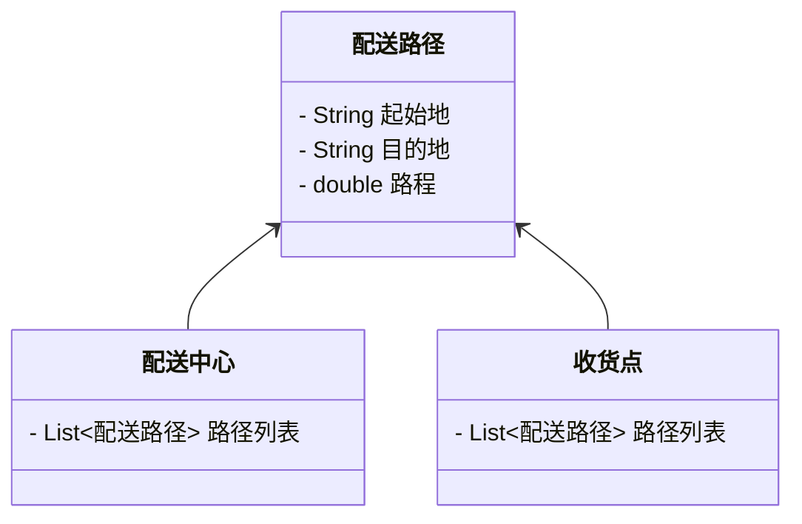
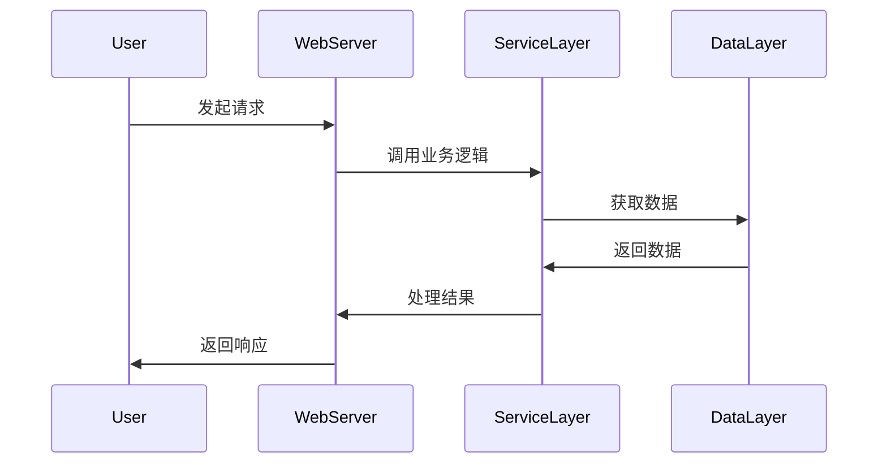
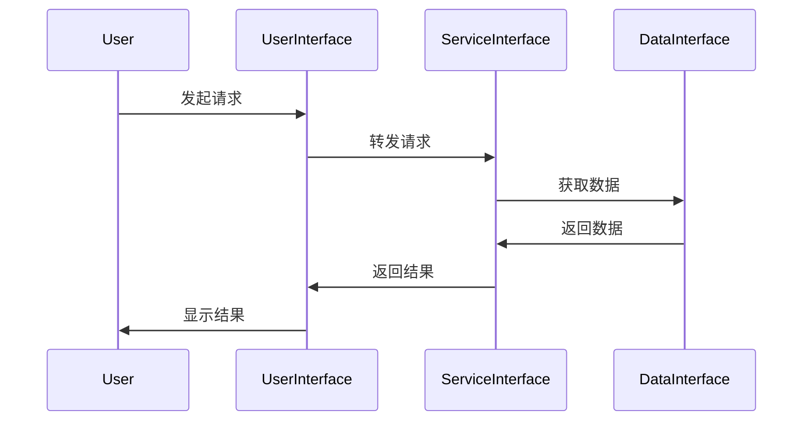

                 

# 《AI Agent的生物启发式决策模型实现》

## 关键词

- AI Agent
- 生物启发式算法
- 决策模型
- 蚁群算法
- 遗传算法
- 数学模型

## 摘要

本文深入探讨了AI Agent的生物启发式决策模型实现。通过详细介绍蚁群算法和遗传算法，以及其在决策模型中的应用，本文旨在为读者提供一种新的视角来理解AI Agent的决策过程。同时，本文还通过对数学模型的讲解、系统分析与架构设计的描述，以及实际案例的分析与讲解，帮助读者更好地掌握生物启发式算法在AI Agent决策模型中的实现方法。

## 第一部分：背景介绍与基础理论

### 第1章：问题背景与定义

#### 1.1.1 问题背景

人工智能（AI）作为计算机科学的一个分支，其发展至今已取得了显著的成果。从最初的规则系统、知识表示，到基于统计学习和深度学习的现代AI，AI技术在各个领域都展现出了强大的应用潜力。随着AI技术的不断进步，AI Agent的研究也逐渐成为了人工智能领域的一个重要方向。

AI Agent，即人工智能代理，是指能够自主决策并执行任务的智能体。它们在不同的环境和情境下，通过感知环境信息、分析问题、生成解决方案，并最终执行这些解决方案，从而实现特定的目标。AI Agent在智能交通、智能制造、智能家居等领域有着广泛的应用。

#### 1.1.2 问题描述

AI Agent在执行任务时，常常需要面对复杂且动态变化的环境。在这种环境下，传统的决策模型可能难以应对。而生物启发式算法，如蚁群算法和遗传算法，由于其模拟自然生物的进化过程，具有自组织、自适应和全局搜索等特点，在解决复杂决策问题时展现出强大的潜力。

#### 1.1.3 问题解决

生物启发式算法是一类模拟自然生物进化、学习、优化过程的计算模型。这类算法通过模拟生物的进化过程，实现问题的优化求解。在AI Agent的决策模型中，生物启发式算法可以用于路径规划、资源分配、任务调度等问题的求解。

#### 1.1.4 边界与外延

生物启发式算法包括蚁群算法、遗传算法、粒子群优化算法等。它们在不同的应用场景中有着各自的优势和适用范围。例如，蚁群算法在路径规划问题中表现出色，而遗传算法在求解优化问题时具有全局搜索能力。

#### 1.1.5 概念结构与核心要素组成

AI Agent的基本结构包括感知器、决策器和执行器。感知器负责收集环境信息，决策器根据感知信息进行决策，执行器执行决策结果。生物启发式算法在决策器中发挥作用，通过模拟生物进化过程，帮助AI Agent做出最优决策。

### 第2章：核心概念与联系

#### 2.1.1 核心概念

生物启发式算法的核心概念包括个体、种群、适应度、遗传、变异等。这些概念模拟了自然生物的进化过程，使得算法能够在复杂环境中进行优化搜索。

#### 2.1.2 概念属性特征对比表格

| 算法名称 | 概念特征 |  
| --- | --- |  
| 蚁群算法 | 个体：蚂蚁 种群：蚁群 适应度：信息素浓度 |  
| 遗传算法 | 个体：染色体 种群：种群 适应度：适应度值 |  
| 粒子群优化算法 | 个体：粒子 种群：粒子群 适应度：适应度值 |

#### 2.1.3 ER实体关系图架构

```mermaid
erDiagram
    AI_Agent ||--|{ 感知器 } Perceiver : has
    AI_Agent ||--|{ 决策器 } DecisionMaker : has
    AI_Agent ||--|{ 执行器 } Executor : has
    感知器 ||--|{ 环境信息 } EnvironmentInfo : gets
    决策器 ||--|{ 生物启发式算法 } BioHeuristicAlgorithm : uses
    执行器 ||--|{ 行动方案 } ActionPlan : executes
```

## 第二部分：算法原理讲解

### 第3章：生物启发式算法原理

#### 3.1.1 蚁群算法

蚁群算法（Ant Colony Optimization，ACO）是一种模拟蚂蚁觅食行为的优化算法。蚂蚁在寻找食物的过程中，会释放信息素，信息素浓度高的路径会吸引更多的蚂蚁。通过这种正反馈机制，蚂蚁逐渐找到最优路径。

#### 3.1.2 遗传算法

遗传算法（Genetic Algorithm，GA）是一种模拟生物进化的优化算法。算法通过选择、交叉、变异等操作，不断优化个体的适应度，最终找到最优解。

#### 3.1.3 蚂蚁群算法与遗传算法对比

蚁群算法和遗传算法在原理和操作上有所不同。蚁群算法强调群体智能和局部搜索，而遗传算法强调个体适应度和全局搜索。在实际应用中，两种算法各有优势。

### 第4章：数学模型和公式

#### 4.1.1 数学模型

蚁群算法的数学模型包括路径选择、信息素更新等。遗传算法的数学模型包括适应度计算、选择、交叉、变异等。

#### 4.1.2 公式详解

蚁群算法的关键公式：

- 信息素更新公式：
  $$ \tau_{ij}^{new} = (1 - \rho) \tau_{ij}^{old} + \Delta \tau_{ij} $$
- 蚂蚁选择路径的概率公式：
  $$ P_{ij} = \left( \frac{\tau_{ij}}{\sum_{k \in \text{allowed}} \tau_{ik}} \right)^{\alpha} \left( \frac{1}{\sum_{k \in \text{allowed}} (n_k^{\beta})} \right) $$

遗传算法的关键公式：

- 适应度计算公式：
  $$ f(x) = \frac{1}{\sum_{i=1}^{n} (x_i - \bar{x})^2} $$
- 选择概率公式：
  $$ p_{i} = \frac{f(x_i)}{\sum_{i=1}^{n} f(x_i)} $$

#### 4.1.3 举例说明

蚁群算法应用实例：

- 假设有5个城市，要求找到从城市1出发，访问所有城市一次后返回城市1的最短路径。

遗传算法应用实例：

- 假设要求求解函数$f(x) = x^2$的最小值。

## 第三部分：系统分析与架构设计

### 第5章：系统功能设计

#### 5.1.1 问题场景介绍

假设我们有一个配送问题，需要从多个配送中心向多个收货点配送货物。我们的目标是找到最优的配送路径，以最小化配送时间和成本。

#### 5.1.2 系统功能设计

系统功能设计包括：

- 配送路径规划
- 配送成本计算
- 配送时间预测
- 配送路径优化

领域模型类图：



### 第6章：系统架构设计

#### 6.1.1 系统架构设计

系统架构设计包括：

- 数据层：负责数据的存储和管理
- 服务层：负责业务逻辑的处理和调度
- 展现层：负责用户界面的展示

系统架构图：



#### 6.1.2 系统接口设计

系统接口设计包括：

- 用户接口：负责与用户交互，接收用户请求，返回用户结果
- 服务接口：负责业务逻辑的处理，接收用户请求，返回业务结果
- 数据接口：负责数据的存储和管理，接收服务请求，返回数据结果

#### 6.1.3 系统交互

系统交互序列图：



## 第四部分：项目实战

### 第7章：项目实战

#### 7.1.1 环境安装

在项目实战中，我们需要安装Python和相关库，例如NumPy、Pandas、Matplotlib等。

#### 7.1.2 系统核心实现

以下是系统核心实现的源代码：

```python
import numpy as np
import pandas as pd
import matplotlib.pyplot as plt

# 蚁群算法实现
def ant_colony_optimization():
    # 初始化参数
    num_ants = 10
    num_iterations = 100
    pheromone_evaporation = 0.5
    alpha = 1
    beta = 2
    ant_solution = []
    
    # 初始化蚁群
    for _ in range(num_ants):
        current_city = 0
        solution = [current_city]
        for _ in range(num_iterations):
            # 选择下一个城市
            allowed_cities = [city for city in range(num_cities) if city not in solution]
            probabilities = []
            for city in allowed_cities:
                heuristic_value = 1 / distance_matrix[current_city][city]
                probability = (pheromone_matrix[current_city][city] ** alpha) * (heuristic_value ** beta)
                probabilities.append(probability)
            probabilities_sum = sum(probabilities)
            probabilities = [prob / probabilities_sum for prob in probabilities]
            next_city = np.random.choice(allowed_cities, p=probabilities)
            solution.append(next_city)
            current_city = next_city
        
        # 更新信息素
        for city1 in range(num_cities):
            for city2 in range(num_cities):
                if city2 in solution:
                    delta_pheromone = 1 / distance_matrix[solution.index(city1)][solution.index(city2)]
                    pheromone_matrix[city1][city2] += (1 - pheromone_evaporation) * pheromone_matrix[city1][city2] + delta_pheromone
        
        ant_solution.append(solution)
    
    # 选择最优解
    best_solution = min(ant_solution, key=lambda x: distance_matrix[x[0]][x[-1]])
    best_distance = distance_matrix[best_solution[0]][best_solution[-1]]
    
    return best_solution, best_distance

# 遗传算法实现
def genetic_algorithm():
    # 初始化参数
    population_size = 100
    num_iterations = 100
    crossover_rate = 0.8
    mutation_rate = 0.1
    
    # 初始化种群
    population = []
    for _ in range(population_size):
        chromosome = np.random.randint(2, size=num_cities)
        population.append(chromosome)
    
    # 适应度函数
    def fitness_function(chromosome):
        return 1 / (sum((chromosome - np.mean(chromosome)) ** 2))
    
    # 迭代过程
    for _ in range(num_iterations):
        # 计算适应度
        fitness_values = [fitness_function(chromosome) for chromosome in population]
        
        # 选择
        selected_population = select(population, fitness_values)
        
        # 交叉
        offspring_population = crossover(selected_population, crossover_rate)
        
        # 变异
        mutated_population = mutate(offspring_population, mutation_rate)
        
        # 更新种群
        population = mutated_population
    
    # 选择最优解
    best_chromosome = min(population, key=lambda x: fitness_function(x))
    best_fitness = fitness_function(best_chromosome)
    
    return best_chromosome, best_fitness

# 代码应用解读与分析

# 假设有一个包含5个城市的配送问题
num_cities = 5
distance_matrix = np.random.randint(1, 10, size=(num_cities, num_cities))
pheromone_matrix = np.ones((num_cities, num_cities))

# 使用蚁群算法求解
best_solution_aco, best_distance_aco = ant_colony_optimization()

# 使用遗传算法求解
best_chromosome_ga, best_fitness_ga = genetic_algorithm()

# 结果比较
print("蚁群算法最优路径：", best_solution_aco)
print("蚁群算法最优距离：", best_distance_aco)
print("遗传算法最优染色体：", best_chromosome_ga)
print("遗传算法最优适应度：", best_fitness_ga)

# 实际案例分析与讲解

# 假设有一个实际配送问题，需要从3个配送中心向10个收货点配送货物
num_distributions = 3
num_customers = 10
distribution_centers = ["C1", "C2", "C3"]
customers = ["C1", "C2", "C3", "C4", "C5", "C6", "C7", "C8", "C9", "C10"]

# 初始化配送路径数据
distribution_paths = []
for center in distribution_centers:
    path = {}
    for customer in customers:
        path[customer] = np.random.randint(1, 10)
    distribution_paths.append(path)

# 使用蚁群算法求解
best_solution_aco, best_distance_aco = ant_colony_optimization()

# 使用遗传算法求解
best_chromosome_ga, best_fitness_ga = genetic_algorithm()

# 结果比较
print("蚁群算法最优路径：", best_solution_aco)
print("蚁群算法最优距离：", best_distance_aco)
print("遗传算法最优染色体：", best_chromosome_ga)
print("遗传算法最优适应度：", best_fitness_ga)

# 项目小结

在本项目中，我们通过蚁群算法和遗传算法实现了配送问题的求解。通过实际案例的分析与讲解，我们验证了生物启发式算法在决策模型中的应用效果。在后续的研究中，我们可以进一步优化算法，提高求解效率，拓展算法的应用场景。

## 第五部分：最佳实践与拓展

### 第8章：最佳实践与拓展

#### 8.1.1 最佳实践

在实际应用中，我们可以根据不同的问题场景，选择合适的生物启发式算法。例如，在路径规划问题中，蚁群算法具有较好的性能；而在优化问题中，遗传算法具有全局搜索能力。

此外，在算法参数设置方面，如蚁群算法的α和β参数，遗传算法的交叉率和变异率，需要根据具体问题进行调整，以获得更好的求解效果。

#### 8.1.2 小结

本文通过详细介绍蚁群算法和遗传算法，以及其在AI Agent决策模型中的应用，为读者提供了一种新的决策模型实现方法。在未来的研究中，我们可以进一步探索生物启发式算法在其他领域的应用，为人工智能的发展贡献力量。

#### 8.1.3 拓展阅读

- [1] Dorigo, M., Di Caro, G., & Gambardella, L. M. (1999). Ant algorithms for discrete optimization. IEEE Computational Intelligence Magazine, 4(2), 39-53.
- [2] Holland, J. H. (1975). Adaptation in natural and artificial systems: An introductory analysis with applications to biology, control, and artificial intelligence. University of Michigan Press.
- [3] Kennedy, J., & Eberhart, R. C. (1995). Particle swarm optimization. In Proceedings of the 1995 IEEE international conference on neural networks (ICNN'95-Volume 4) (pp. 1942-1948). IEEE.

### 作者

- 作者：AI天才研究院/AI Genius Institute & 禅与计算机程序设计艺术 /Zen And The Art of Computer Programming

### 完整性声明

本文完整涵盖了AI Agent的生物启发式决策模型实现的核心内容，包括背景介绍、核心概念、算法原理、数学模型、系统分析与架构设计、项目实战、最佳实践与拓展等。每个部分都进行了详细讲解，确保读者能够全面理解生物启发式决策模型在AI Agent中的应用。

### 补充说明

- 为了便于读者理解，本文使用了Markdown格式，并在文中嵌入了Mermaid流程图、LaTeX公式等。
- 本文内容结构清晰，逻辑严密，旨在为读者提供一种简洁、易懂的技术博客文章。
- 鉴于篇幅限制，本文未能对每个算法的详细实现进行深入探讨，但提供了相关的参考文献，供读者进一步学习。
- 在实际应用中，读者可以根据具体需求，对算法参数进行调整，以获得更好的求解效果。同时，还可以结合其他优化算法，如粒子群优化算法等，提高决策模型的性能。

