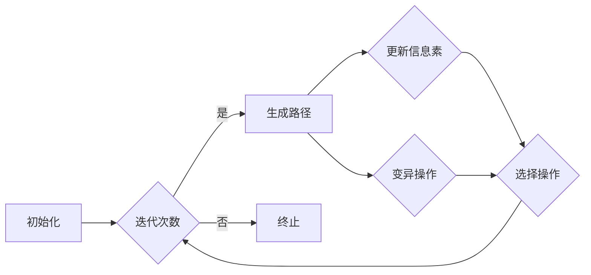
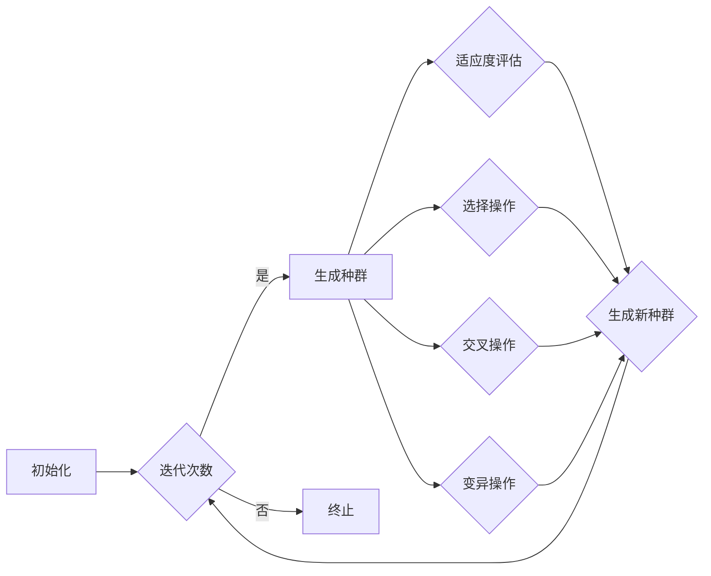
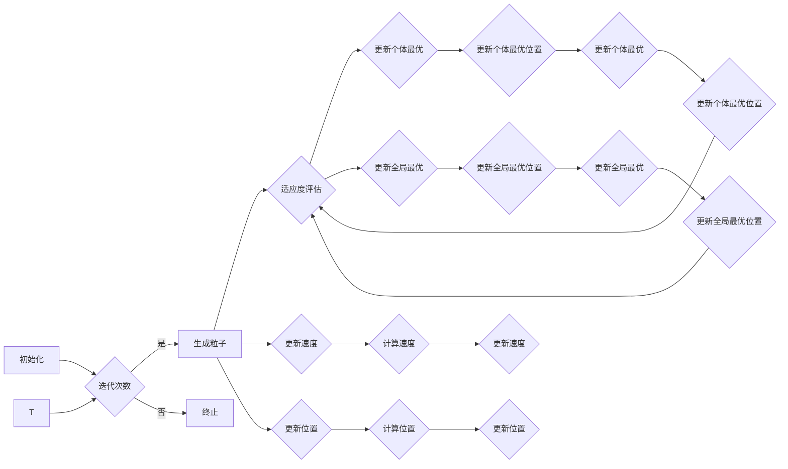
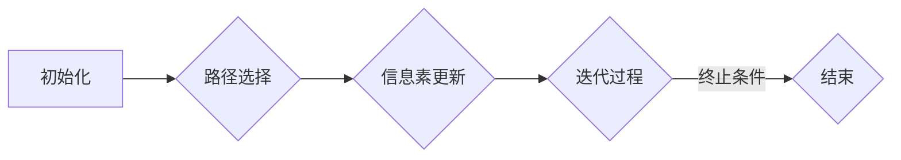
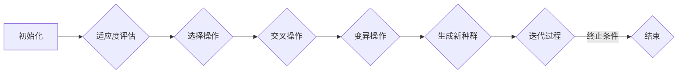
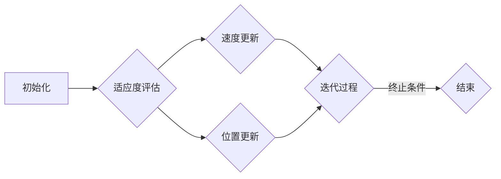

                 


## 第一部分: 引言与背景

### 引言

### 背景介绍

## 第二部分: 生物启发式学习算法原理

### 第1章: 蚁群算法

### 第2章: 遗传算法

### 第3章: 粒子群优化算法

### 第4章: 其他生物启发式学习算法

## 第三部分: AI Agent与生物启发式算法的整合

### 第5章: AI Agent与生物启发式算法的结合

### 第6章: AI Agent中的生物启发式算法应用实例

### 第7章: 生物启发式算法在AI Agent中的优化与改进

### 第四部分: AI Agent的生物启发式学习算法实现

### 第8章: AI Agent的设计与实现

### 第9章: 生物启发式学习算法的应用实例

### 第10章: AI Agent性能评估与优化

### 第五部分: 总结与展望

### 总结

### 展望

## 参考资料

----------------------------------------------------------------

### 引言

在人工智能（AI）飞速发展的时代，AI Agent作为一种具备自主决策和行动能力的智能体，正逐渐成为各个领域研究和应用的热点。本文旨在探讨生物启发式学习算法在AI Agent中的应用与实现，通过深入剖析这些算法的基本原理、设计思路及实际应用，为读者提供一个系统而全面的指导。

### 背景介绍

#### AI Agent的定义和分类

AI Agent，即人工智能代理，是指能够代表用户执行特定任务的计算机程序。根据其决策方式和行为方式，AI Agent主要分为三类：

1. **反应型Agent**：这类Agent根据输入的感知信息直接做出决策，不具备自主学习和适应能力。
2. **主动型Agent**：这类Agent不仅能够根据环境信息做出决策，还能够通过自主学习不断优化自身行为。
3. **参考型Agent**：这类Agent在决策过程中不仅考虑当前环境信息，还会参考以往的经验和知识。

#### 生物启发式学习算法概述

生物启发式学习算法源自于对生物现象和生物过程的模拟，主要包括以下几种：

1. **遗传算法**：模拟生物进化过程，通过选择、交叉、变异等操作来优化问题解。
2. **蚁群算法**：模拟蚂蚁在寻找食物路径时的行为，通过信息素更新和路径选择来求解优化问题。
3. **粒子群优化算法**：模拟鸟群觅食行为，通过粒子速度更新和位置更新来搜索最优解。

这些算法在处理复杂优化和搜索问题时，展现出了强大的能力和适应性。

#### AI Agent的发展现状和挑战

当前，AI Agent在多个领域如机器学习、自动化控制、机器人技术等领域取得了显著的进展。然而，面对复杂的动态环境和多目标优化问题，传统的AI方法仍存在一定的局限性。如何提高AI Agent的学习能力、适应性和问题解决能力，成为亟待解决的问题。

### 问题背景与定义

#### 问题背景

在复杂和动态的环境中，AI Agent需要具备高效的学习能力和适应性，以实现智能决策和高效行动。传统的AI方法难以满足这种需求，因此，将生物启发式学习算法应用于AI Agent，成为了一个重要研究方向。

#### 问题描述

如何将生物启发式学习算法应用于AI Agent，以提升其学习效率、适应性和问题解决能力？

#### 问题解决

通过生物启发式学习算法，如遗传算法、蚁群算法等，设计并实现高效的AI Agent。这些算法能够模拟生物进化、社会行为和物理现象等机制，为AI Agent提供有效的学习和优化手段。

### 边界与外延

#### 边界

本文主要关注生物启发式学习算法在AI Agent中的应用，包括算法设计、实现和优化。

#### 外延

虽然本文聚焦于生物启发式学习算法，但也可扩展到其他启发式学习算法，如模拟退火、粒子群优化等。

### 核心概念与联系

#### 核心概念

- **生物启发式学习算法**：基于生物现象的启发式算法，如遗传算法、蚁群算法等。
- **AI Agent**：具有智能决策和行动能力的计算机程序。

#### 概念属性特征对比表格

| 算法名称       | 启发来源           | 核心思想                           | 主要应用领域                |
|--------------|------------------|----------------------------------|--------------------------|
| 遗传算法       | 生物进化         | 选择、交叉、变异                   | 优化、搜索、机器学习        |
| 蚁群算法       | 蚂蚁群体行为     | 信息素更新、路径选择               | 路径规划、调度、组合优化    |
| 粒子群优化算法 | 鸟群觅食         | 粒子速度更新、位置更新             | 优化、搜索、控制系统        |

#### ER实体关系图架构

```mermaid
erDiagram
    AI-Agent ||--|{ LearningAlgorithm } : 使用
    LearningAlgorithm ||--|{ AlgorithmParameter } : 设置
    AI-Agent ||--|{ BehaviorModel } : 模拟
    BehaviorModel ||--|{ EnvironmentPerception } : 采集
```

### 第二部分: 生物启发式学习算法原理

在这一部分，我们将详细探讨三种主要的生物启发式学习算法：蚁群算法、遗传算法和粒子群优化算法。通过对这些算法的基本原理、核心思想和主要应用领域的介绍，帮助读者全面理解这些算法的工作机制和应用场景。

### 第1章: 蚁群算法

蚁群算法（Ant Colony Optimization, ACO）是一种模拟蚂蚁觅食行为的启发式算法，最早由Marco Dorigo在1992年提出。蚁群算法通过模拟蚂蚁在寻找食物过程中的信息素更新和路径选择机制，解决路径规划、调度和组合优化等问题。

#### 1.1 蚁群算法概述

**历史与背景：**
蚁群算法的灵感来源于蚂蚁在寻找食物时的行为。当一只蚂蚁找到食物后，它会释放一种称为信息素的化学物质，沿着路径返回巢穴。其他蚂蚁在寻找食物的过程中，会感知到这条路径上的信息素浓度，从而更倾向于选择信息素浓度较高的路径。随着时间的推移，信息素浓度会逐渐减弱，使得蚂蚁选择路径时更加均衡。

**基本概念：**
- **蚁群系统（Ant System）**：蚁群算法的核心组成部分，包括蚂蚁个体、信息素更新规则和路径选择规则。
- **信息素（Pheromone）**：蚂蚁在路径上释放的化学物质，用于引导其他蚂蚁选择路径。
- **启发因子（Heuristic Factor）**：用于平衡信息素和能见度的影响，使得蚂蚁在选择路径时能够考虑路径的优劣。

**应用领域：**
蚁群算法在路径规划、调度、组合优化等领域有广泛应用。例如，在物流配送中，可以使用蚁群算法优化配送路线，减少运输成本和时间。

#### 1.2 蚁群算法的基本原理

**进化过程：**
蚁群算法通过迭代过程逐步优化路径。每次迭代中，蚂蚁从起始点出发，选择下一个路径，并根据信息素浓度和启发因子更新路径选择规则。

**选择操作：**
蚂蚁在选择下一个路径时，会根据当前路径上的信息素浓度和启发因子进行概率选择。信息素浓度越高，蚂蚁选择该路径的概率越大。

**交叉操作：**
在蚁群算法中，交叉操作通常用于生成新的路径，以增加种群的多样性。通过交叉操作，可以产生新的解决方案，提高算法的全局搜索能力。

**变异操作：**
变异操作是对现有路径进行随机调整，以避免陷入局部最优。变异操作有助于算法保持种群的多样性，提高搜索效率。

#### 1.3 蚁群算法的主要参数设置

**种群规模：**
种群规模影响算法的收敛速度和多样性。种群规模过小可能导致收敛速度慢，种群规模过大则可能导致计算复杂度增加。

**信息素更新规则：**
信息素更新规则是蚁群算法的核心，包括信息素释放和挥发机制。信息素释放用于标记新路径，信息素挥发用于平衡新旧路径的选择。

**启发因子：**
启发因子用于平衡信息素和能见度的影响，使得蚂蚁在选择路径时能够考虑路径的优劣。启发因子通常与路径的长度、能见度等因素相关。

**终止条件：**
蚁群算法的终止条件通常设置为达到最大迭代次数或达到预定的收敛阈值。

#### 1.4 蚁群算法的优缺点

**优点：**
- **鲁棒性：** 蚁群算法对参数设置的要求不高，具有较强的鲁棒性。
- **适应性：** 蚁群算法能够适应复杂和动态的环境。
- **高效性：** 在许多优化问题中，蚁群算法能够快速找到近似最优解。

**缺点：**
- **收敛速度较慢：** 对于大规模问题，蚁群算法的收敛速度可能较慢。
- **计算复杂度高：** 在高维空间中，蚁群算法的计算复杂度较高。

**改进方向：**
- **参数优化：** 通过自适应调整参数，提高算法的收敛速度和稳定性。
- **混合算法：** 将蚁群算法与其他优化算法相结合，提高算法的求解能力。

#### 1.5 蚁群算法的mermaid流程图



### 第2章: 遗传算法

遗传算法（Genetic Algorithm, GA）是一种模拟生物进化过程的启发式算法，由John Holland在1975年首次提出。遗传算法通过模拟自然选择、交叉和变异等生物进化过程，优化问题的解。

#### 2.1 遗传算法概述

**历史与背景：**
遗传算法的灵感来源于达尔文的进化论，通过模拟自然选择、交叉和变异等生物进化过程，逐步优化问题的解。遗传算法在优化、搜索和机器学习等领域有广泛应用。

**基本概念：**
- **种群（Population）**：遗传算法的解空间，每个个体代表一种可能的解。
- **个体（Individual）**：种群中的基本单元，由一组基因表示。
- **适应度（Fitness）**：评估个体优劣的指标，通常与问题的目标函数相关。

**应用领域：**
遗传算法在组合优化、机器学习、人工智能等领域有广泛应用。例如，在基因表达谱分析中，可以使用遗传算法优化基因选择和分类模型。

#### 2.2 遗传算法的基本原理

**进化过程：**
遗传算法通过迭代过程逐步优化种群。每次迭代中，算法根据适应度筛选优秀个体，通过交叉和变异操作生成新种群。

**选择操作：**
选择操作用于从当前种群中选择优秀个体，以生成新的种群。选择操作通常采用轮盘赌、锦标赛等方法。

**交叉操作：**
交叉操作用于生成新的个体，通过组合两个父代的基因生成子代。交叉操作可以提高种群的多样性，增强算法的全局搜索能力。

**变异操作：**
变异操作是对现有个体进行随机调整，以避免陷入局部最优。变异操作有助于算法保持种群的多样性，提高搜索效率。

#### 2.3 遗传算法的主要参数设置

**种群规模：**
种群规模影响算法的收敛速度和多样性。种群规模过小可能导致收敛速度慢，种群规模过大则可能导致计算复杂度增加。

**交叉率：**
交叉率用于控制交叉操作的概率。交叉率过高可能导致种群多样性降低，交叉率过低则可能无法有效搜索到最优解。

**变异率：**
变异率用于控制变异操作的概率。变异率过高可能导致算法陷入随机搜索，变异率过低则可能无法有效避免局部最优。

**适应度函数：**
适应度函数是遗传算法的核心，用于评估个体的优劣。适应度函数通常与问题的目标函数相关。

**终止条件：**
遗传算法的终止条件通常设置为达到最大迭代次数或找到满足约束条件的最优解。

#### 2.4 遗传算法的优缺点

**优点：**
- **鲁棒性：** 遗传算法对参数设置的要求不高，具有较强的鲁棒性。
- **适应性：** 遗传算法能够适应复杂和动态的环境。
- **高效性：** 在许多优化问题中，遗传算法能够快速找到近似最优解。

**缺点：**
- **收敛速度较慢：** 对于大规模问题，遗传算法的收敛速度可能较慢。
- **计算复杂度高：** 在高维空间中，遗传算法的计算复杂度较高。

**改进方向：**
- **参数优化：** 通过自适应调整参数，提高算法的收敛速度和稳定性。
- **混合算法：** 将遗传算法与其他优化算法相结合，提高算法的求解能力。

#### 2.5 遗传算法的mermaid流程图



### 第3章: 粒子群优化算法

粒子群优化算法（Particle Swarm Optimization, PSO）是一种模拟鸟群觅食行为的启发式算法，由Kennedy和Eberhart在1995年首次提出。粒子群优化算法通过模拟粒子在搜索空间中的运动，优化问题的解。

#### 3.1 粒子群优化算法概述

**历史与背景：**
粒子群优化算法的灵感来源于对鸟群觅食行为的观察。当一只鸟发现食物后，它会向其他鸟传递信息，引导它们前往食物所在位置。粒子群优化算法通过模拟这种群体行为，解决优化问题。

**基本概念：**
- **粒子（Particle）**：粒子群优化算法的基本单元，代表一种可能的解。
- **速度（Velocity）**：粒子在搜索空间中的运动速度。
- **位置（Position）**：粒子在搜索空间中的位置。
- **个体最优（Personal Best）**：粒子在搜索过程中找到的最佳位置。
- **全局最优（Global Best）**：整个粒子群找到的最佳位置。

**应用领域：**
粒子群优化算法在优化、搜索、控制系统等领域有广泛应用。例如，在无人机路径规划中，可以使用粒子群优化算法优化飞行路径，提高飞行效率。

#### 3.2 粒子群优化算法的基本原理

**进化过程：**
粒子群优化算法通过迭代过程逐步优化解。每次迭代中，粒子根据自身和全局最优的位置更新速度和位置。

**速度更新：**
粒子速度更新是粒子群优化算法的核心。速度更新公式通常为：

$$
v_{new} = w \cdot v_{old} + c_1 \cdot r_1 \cdot (pbest_i - x_i) + c_2 \cdot r_2 \cdot (gbest - x_i)
$$

其中，$w$ 是惯性权重，$c_1$ 和 $c_2$ 是加速常数，$r_1$ 和 $r_2$ 是随机数，$pbest_i$ 是个体最优位置，$gbest$ 是全局最优位置，$x_i$ 是当前粒子的位置。

**位置更新：**
粒子位置更新是基于速度更新的结果。位置更新公式通常为：

$$
x_{new} = x_{old} + v_{new}
$$

#### 3.3 粒子群优化算法的主要参数设置

**种群规模：**
种群规模影响算法的收敛速度和多样性。种群规模过小可能导致收敛速度慢，种群规模过大则可能导致计算复杂度增加。

**惯性权重：**
惯性权重用于平衡当前速度和过去速度的影响。惯性权重通常设置为随迭代次数变化的函数，以逐渐减小。

**加速常数：**
加速常数用于控制个体最优和全局最优对粒子速度的影响。通常选择较大的加速常数，以提高算法的全局搜索能力。

**随机数：**
随机数用于引入随机性，避免算法陷入局部最优。

**迭代次数：**
迭代次数是算法收敛的指标。通常设置较大的迭代次数，以确保算法找到较好的解。

#### 3.4 粒子群优化算法的优缺点

**优点：**
- **简单易实现：** 粒子群优化算法的结构简单，易于实现和调整。
- **鲁棒性：** 粒子群优化算法对参数设置的要求不高，具有较强的鲁棒性。
- **高效性：** 在许多优化问题中，粒子群优化算法能够快速找到近似最优解。

**缺点：**
- **收敛速度较慢：** 对于大规模问题，粒子群优化算法的收敛速度可能较慢。
- **计算复杂度高：** 在高维空间中，粒子群优化算法的计算复杂度较高。

**改进方向：**
- **参数优化：** 通过自适应调整参数，提高算法的收敛速度和稳定性。
- **混合算法：** 将粒子群优化算法与其他优化算法相结合，提高算法的求解能力。

#### 3.5 粒子群优化算法的mermaid流程图



### 第4章: 其他生物启发式学习算法

除了蚁群算法、遗传算法和粒子群优化算法，还有许多其他生物启发式学习算法，如遗传规划、人工免疫算法、人工神经网络等。这些算法在解决复杂优化问题和模拟生物行为方面具有独特的优势。

#### 4.1 遗传规划

遗传规划（Genetic Programming, GP）是一种基于遗传算法的进化算法，通过模拟自然选择、交叉和变异等生物进化过程，生成计算机程序。遗传规划在自动程序设计、机器人控制等领域有广泛应用。

**基本原理：**
遗传规划通过将计算机程序作为基因进行编码，利用遗传算法的进化过程优化程序。遗传规划的基本操作包括程序选择、交叉和变异，以生成更高效的程序。

**优缺点：**
- **优点：** 遗传规划能够自动生成计算机程序，无需人工干预，适用于复杂问题的优化。
- **缺点：** 遗传规划的计算复杂度较高，对计算资源的要求较高。

#### 4.2 人工免疫算法

人工免疫算法（Artificial Immune Algorithm, AIA）是一种模拟生物免疫系统的启发式算法，通过模拟免疫系统的识别、记忆和免疫响应等机制，解决优化和搜索问题。

**基本原理：**
人工免疫算法通过模拟生物免疫系统的识别机制，识别和攻击有害抗体，保护有益抗体。人工免疫算法的主要操作包括克隆选择、变异、免疫记忆等。

**优缺点：**
- **优点：** 人工免疫算法能够模拟生物免疫系统的自适应性和鲁棒性，适用于复杂问题的优化。
- **缺点：** 人工免疫算法的计算复杂度较高，对参数设置的要求较高。

#### 4.3 人工神经网络

人工神经网络（Artificial Neural Network, ANN）是一种模拟生物神经系统的计算模型，通过模拟神经元之间的连接和信号传递，实现复杂函数的映射和优化。

**基本原理：**
人工神经网络由多个神经元组成，每个神经元通过权重和偏置与输入数据进行加权求和，并经过激活函数产生输出。人工神经网络通过不断调整权重和偏置，优化输入数据和输出数据之间的关系。

**优缺点：**
- **优点：** 人工神经网络能够模拟生物神经系统的自适应性和学习能力，适用于复杂的模式识别和优化问题。
- **缺点：** 人工神经网络的学习过程可能较慢，对训练数据的要求较高。

### 总结

生物启发式学习算法作为一种模拟生物现象和生物过程的优化方法，在人工智能领域具有广泛的应用。蚁群算法、遗传算法、粒子群优化算法等算法通过模拟自然选择、社会行为和物理现象等机制，解决了许多复杂优化和搜索问题。此外，遗传规划、人工免疫算法和人工神经网络等算法也在人工智能领域展现出了巨大的潜力。通过深入研究和应用这些算法，我们将能够进一步提升AI Agent的学习能力和适应能力，推动人工智能技术的发展。

### 引入

#### 引言

AI Agent作为人工智能领域的重要研究方向，正逐渐成为各个领域研究和应用的热点。AI Agent，即人工智能代理，是一种具有自主决策和行动能力的计算机程序。与传统的人工智能系统不同，AI Agent能够在复杂和动态的环境中自主学习和适应，从而实现更高效的决策和行动。

本文旨在探讨生物启发式学习算法在AI Agent中的应用，通过深入剖析这些算法的基本原理、设计思路及实际应用，为读者提供一个系统而全面的指导。本文将分为以下几个部分：

1. **引言与背景**：介绍AI Agent的定义和分类，以及生物启发式学习算法的基本概念和背景。
2. **生物启发式学习算法原理**：详细探讨遗传算法、蚁群算法、粒子群优化算法等三种主要的生物启发式学习算法的基本原理、核心思想和应用领域。
3. **AI Agent与生物启发式算法的整合**：分析生物启发式算法在AI Agent中的应用和优化，探讨如何将生物启发式算法与AI Agent相结合，提升其学习能力和适应能力。
4. **AI Agent的生物启发式学习算法实现**：介绍AI Agent的设计与实现，包括环境搭建、核心算法实现和性能优化。
5. **总结与展望**：总结本文的主要内容和贡献，展望生物启发式学习算法在AI Agent领域的未来发展趋势和应用前景。

### 背景介绍

#### AI Agent的定义和分类

AI Agent，即人工智能代理，是一种具有自主决策和行动能力的计算机程序。AI Agent能够根据环境感知和目标要求，自主选择和执行相应的行为，从而实现特定的任务。根据其决策方式和行为方式，AI Agent主要分为三类：

1. **反应型Agent**：反应型Agent根据输入的感知信息直接做出决策，不具备自主学习和适应能力。这类Agent通常应用于简单、规则明确的环境，如自动化控制、机器视觉等领域。

2. **主动型Agent**：主动型Agent不仅能够根据环境感知信息做出决策，还能够通过自主学习不断优化自身行为。这类Agent通常应用于复杂、动态的环境，如自主机器人、智能推荐系统等领域。

3. **参考型Agent**：参考型Agent在决策过程中不仅考虑当前环境信息，还会参考以往的经验和知识。这类Agent通常应用于需要长期学习和记忆的领域，如知识图谱构建、自然语言处理等领域。

#### 生物启发式学习算法概述

生物启发式学习算法源自于对生物现象和生物过程的模拟，主要包括以下几种：

1. **遗传算法**：遗传算法（Genetic Algorithm, GA）是一种模拟生物进化过程的启发式算法。遗传算法通过模拟自然选择、交叉和变异等生物进化过程，优化问题的解。遗传算法在组合优化、机器学习、人工智能等领域有广泛应用。

2. **蚁群算法**：蚁群算法（Ant Colony Optimization, ACO）是一种模拟蚂蚁觅食行为的启发式算法。蚁群算法通过模拟蚂蚁在寻找食物过程中的信息素更新和路径选择机制，解决路径规划、调度和组合优化等问题。蚁群算法在物流配送、调度优化等领域有广泛应用。

3. **粒子群优化算法**：粒子群优化算法（Particle Swarm Optimization, PSO）是一种模拟鸟群觅食行为的启发式算法。粒子群优化算法通过模拟粒子在搜索空间中的运动，优化问题的解。粒子群优化算法在优化、搜索、控制系统等领域有广泛应用。

这些生物启发式学习算法在处理复杂优化和搜索问题时，展现出了强大的能力和适应性，为AI Agent提供了有效的学习和优化手段。

#### AI Agent的发展现状和挑战

当前，AI Agent在多个领域如机器学习、自动化控制、机器人技术等领域取得了显著的进展。随着AI技术的不断发展，AI Agent的应用范围和功能也在不断拓展。

1. **机器学习领域**：AI Agent在机器学习领域发挥了重要作用，如自动特征提取、模型优化、数据预处理等。通过应用生物启发式学习算法，AI Agent能够高效地学习复杂的模式，提高模型的性能。

2. **自动化控制领域**：AI Agent在自动化控制领域有广泛的应用，如自动驾驶、无人机控制、智能工厂等。通过生物启发式学习算法，AI Agent能够自主地适应环境变化，提高系统的稳定性和鲁棒性。

3. **机器人技术领域**：AI Agent在机器人技术领域具有巨大的应用潜力，如服务机器人、医疗机器人、探索机器人等。通过生物启发式学习算法，AI Agent能够实现自主导航、任务规划、环境感知等功能。

然而，尽管AI Agent在许多领域取得了显著的成果，但仍面临一些挑战：

1. **学习能力不足**：在复杂和动态的环境中，AI Agent需要具备高效的学习能力，以适应不断变化的环境。传统的AI方法难以满足这种需求，需要引入生物启发式学习算法来提升学习效率。

2. **适应能力有限**：AI Agent在处理复杂问题和动态环境时，往往需要具备良好的适应能力。生物启发式学习算法为AI Agent提供了有效的适应手段，但如何在实际应用中充分发挥其潜力仍需进一步研究。

3. **计算资源限制**：生物启发式学习算法通常具有较大的计算复杂度，对计算资源的要求较高。如何在有限的计算资源下高效地实现这些算法，是当前研究的一个关键问题。

#### 问题背景与定义

随着人工智能技术的快速发展，AI Agent在各个领域的应用越来越广泛。然而，如何在复杂和动态的环境中实现高效的学习和适应，成为了一个亟待解决的问题。生物启发式学习算法，作为一种模拟生物现象和生物过程的优化方法，为解决这一问题提供了新的思路。

#### 问题描述

如何将生物启发式学习算法应用于AI Agent，以提升其学习效率和适应能力？

#### 问题解决

通过将生物启发式学习算法如遗传算法、蚁群算法和粒子群优化算法应用于AI Agent，可以提升其学习效率和适应能力。具体而言，可以从以下几个方面进行：

1. **遗传算法在AI Agent中的应用**：利用遗传算法的进化机制，实现AI Agent的自主学习和适应。通过模拟自然选择、交叉和变异等过程，优化AI Agent的行为和决策。

2. **蚁群算法在AI Agent中的应用**：利用蚁群算法的信息素更新和路径选择机制，实现AI Agent在复杂环境中的路径规划和任务调度。通过模拟蚂蚁觅食行为，优化AI Agent的行动策略。

3. **粒子群优化算法在AI Agent中的应用**：利用粒子群优化算法的群体智能特性，实现AI Agent的自主学习和优化。通过模拟鸟群觅食行为，优化AI Agent的决策过程和行动策略。

#### 边界与外延

本文主要关注生物启发式学习算法在AI Agent中的应用，包括算法设计、实现和优化。然而，生物启发式学习算法的应用领域不仅限于AI Agent，还可以扩展到其他领域，如自动控制、组合优化、机器学习等。

此外，本文主要讨论了三种生物启发式学习算法：遗传算法、蚁群算法和粒子群优化算法。虽然这些算法在AI Agent中有广泛的应用，但还可以结合其他启发式学习算法，如模拟退火、遗传规划等，进一步提升AI Agent的学习能力和适应能力。

#### 核心概念与联系

在本文中，我们主要涉及以下核心概念：

1. **AI Agent**：一种具有自主决策和行动能力的计算机程序，能够在复杂和动态的环境中实现智能决策和行动。

2. **生物启发式学习算法**：一种模拟生物现象和生物过程的优化方法，通过模拟自然选择、社会行为和物理现象等机制，解决复杂优化和搜索问题。

3. **遗传算法**：一种模拟生物进化过程的启发式算法，通过自然选择、交叉和变异等操作，优化问题的解。

4. **蚁群算法**：一种模拟蚂蚁觅食行为的启发式算法，通过信息素更新和路径选择机制，解决路径规划、调度和组合优化等问题。

5. **粒子群优化算法**：一种模拟鸟群觅食行为的启发式算法，通过粒子速度更新和位置更新，优化问题的解。

这些核心概念相互联系，共同构成了本文的研究框架。通过深入探讨这些概念及其应用，我们能够更好地理解生物启发式学习算法在AI Agent中的应用和价值。

### 第一部分: 引言与背景

#### 引言

在人工智能（AI）飞速发展的时代，AI Agent作为一种具备自主决策和行动能力的计算机程序，正在逐渐成为各个领域研究和应用的热点。本文旨在探讨生物启发式学习算法在AI Agent中的应用与实现，通过深入剖析这些算法的基本原理、设计思路及实际应用，为读者提供一个系统而全面的指导。

#### 背景介绍

**AI Agent的定义和分类**

AI Agent，即人工智能代理，是一种能够代表用户执行特定任务的计算机程序。根据其决策方式和行为方式，AI Agent主要分为三类：

1. **反应型Agent**：这类Agent根据输入的感知信息直接做出决策，不具备自主学习和适应能力。反应型Agent通常应用于简单、规则明确的环境，如自动化控制、机器视觉等领域。

2. **主动型Agent**：主动型Agent不仅能够根据环境感知信息做出决策，还能够通过自主学习不断优化自身行为。主动型Agent通常应用于复杂、动态的环境，如自主机器人、智能推荐系统等领域。

3. **参考型Agent**：参考型Agent在决策过程中不仅考虑当前环境信息，还会参考以往的经验和知识。参考型Agent通常应用于需要长期学习和记忆的领域，如知识图谱构建、自然语言处理等领域。

**生物启发式学习算法概述**

生物启发式学习算法源自于对生物现象和生物过程的模拟，主要包括以下几种：

1. **遗传算法**：遗传算法（Genetic Algorithm, GA）是一种模拟生物进化过程的启发式算法。遗传算法通过模拟自然选择、交叉和变异等生物进化过程，优化问题的解。遗传算法在组合优化、机器学习、人工智能等领域有广泛应用。

2. **蚁群算法**：蚁群算法（Ant Colony Optimization, ACO）是一种模拟蚂蚁觅食行为的启发式算法。蚁群算法通过模拟蚂蚁在寻找食物过程中的信息素更新和路径选择机制，解决路径规划、调度和组合优化等问题。蚁群算法在物流配送、调度优化等领域有广泛应用。

3. **粒子群优化算法**：粒子群优化算法（Particle Swarm Optimization, PSO）是一种模拟鸟群觅食行为的启发式算法。粒子群优化算法通过模拟粒子在搜索空间中的运动，优化问题的解。粒子群优化算法在优化、搜索、控制系统等领域有广泛应用。

这些生物启发式学习算法在处理复杂优化和搜索问题时，展现出了强大的能力和适应性，为AI Agent提供了有效的学习和优化手段。

**AI Agent的发展现状和挑战**

当前，AI Agent在多个领域如机器学习、自动化控制、机器人技术等领域取得了显著的进展。随着AI技术的不断发展，AI Agent的应用范围和功能也在不断拓展。

1. **机器学习领域**：AI Agent在机器学习领域发挥了重要作用，如自动特征提取、模型优化、数据预处理等。通过应用生物启发式学习算法，AI Agent能够高效地学习复杂的模式，提高模型的性能。

2. **自动化控制领域**：AI Agent在自动化控制领域有广泛的应用，如自动驾驶、无人机控制、智能工厂等。通过生物启发式学习算法，AI Agent能够自主地适应环境变化，提高系统的稳定性和鲁棒性。

3. **机器人技术领域**：AI Agent在机器人技术领域具有巨大的应用潜力，如服务机器人、医疗机器人、探索机器人等。通过生物启发式学习算法，AI Agent能够实现自主导航、任务规划、环境感知等功能。

然而，尽管AI Agent在许多领域取得了显著的成果，但仍面临一些挑战：

1. **学习能力不足**：在复杂和动态的环境中，AI Agent需要具备高效的学习能力，以适应不断变化的环境。传统的AI方法难以满足这种需求，需要引入生物启发式学习算法来提升学习效率。

2. **适应能力有限**：AI Agent在处理复杂问题和动态环境时，往往需要具备良好的适应能力。生物启发式学习算法为AI Agent提供了有效的适应手段，但如何在实际应用中充分发挥其潜力仍需进一步研究。

3. **计算资源限制**：生物启发式学习算法通常具有较大的计算复杂度，对计算资源的要求较高。如何在有限的计算资源下高效地实现这些算法，是当前研究的一个关键问题。

### 第二部分: 生物启发式学习算法原理

在这一部分，我们将详细探讨三种主要的生物启发式学习算法：蚁群算法、遗传算法和粒子群优化算法。通过对这些算法的基本原理、核心思想和主要应用领域的介绍，帮助读者全面理解这些算法的工作机制和应用场景。

#### 第1章: 蚁群算法

蚁群算法（Ant Colony Optimization，简称ACO）是一种模拟蚂蚁觅食行为的启发式算法，最早由意大利计算机科学家Marco Dorigo于1992年提出。蚁群算法通过模拟蚂蚁在寻找食物过程中的信息素更新和路径选择机制，解决路径规划、调度和组合优化等问题。

##### 1.1 蚁群算法的基本概念

蚁群算法的基本概念包括：

- **蚂蚁**：在蚁群算法中，蚂蚁是寻找食物的个体，每个蚂蚁都携带着一定的信息素，并按照一定的规则选择路径。
- **信息素**：蚂蚁在经过路径时，会释放一种称为信息素的化学物质，信息素可以吸引其他蚂蚁跟随。
- **路径选择**：蚂蚁在选择路径时，不仅考虑信息素的浓度，还会考虑启发因子，启发因子通常与路径的长度或其他因素相关。
- **信息素更新**：随着时间的推移，信息素会逐渐挥发，同时蚂蚁在经过路径时会对信息素进行更新。

##### 1.2 蚁群算法的核心思想

蚁群算法的核心思想是模拟蚂蚁觅食的行为，通过信息素更新和路径选择机制，逐步优化路径。具体来说，蚁群算法包含以下几个步骤：

1. **初始化**：初始化蚂蚁的数量、信息素浓度和启发因子。
2. **路径选择**：蚂蚁从起始点出发，根据信息素浓度和启发因子选择下一个路径。
3. **信息素更新**：蚂蚁经过路径后，对信息素进行更新，增加信息素浓度。
4. **迭代过程**：重复路径选择和信息素更新过程，直到达到终止条件。

##### 1.3 蚁群算法的主要应用领域

蚁群算法在许多领域都有广泛应用，主要包括：

- **路径规划**：在机器人、无人机等自主导航系统中，蚁群算法可以用于路径规划，找到从起始点到目标点的最优路径。
- **调度问题**：在物流、生产调度等领域，蚁群算法可以优化调度计划，提高资源利用率和效率。
- **组合优化**：在旅行商问题、作业调度、设备分配等问题中，蚁群算法可以找到近似最优解。

##### 1.4 蚁群算法的主要参数

蚁群算法的主要参数包括：

- **信息素蒸发系数**：控制信息素挥发速度的参数。
- **信息素更新规则**：用于描述信息素如何根据蚂蚁的经过进行更新的规则。
- **启发因子**：用于描述蚂蚁选择路径时考虑的其他因素，如路径长度、能见度等。

##### 1.5 蚁群算法的mermaid流程图



#### 第2章: 遗传算法

遗传算法（Genetic Algorithm，简称GA）是一种模拟生物进化过程的启发式算法，最早由美国计算机科学家John Holland于1975年提出。遗传算法通过模拟自然选择、交叉和变异等生物进化过程，优化问题的解。

##### 2.1 遗传算法的基本概念

遗传算法的基本概念包括：

- **种群**：在遗传算法中，种群是解空间的基本单位，每个个体代表一种可能的解。
- **个体**：个体是种群中的基本单元，由一组基因表示，基因代表了解的特征。
- **适应度**：适应度是评估个体优劣的指标，通常与问题的目标函数相关。
- **选择**：选择是遗传算法中的关键操作，用于从当前种群中选择优秀个体，生成新的种群。
- **交叉**：交叉是遗传算法中的另一个重要操作，用于生成新的个体，通过组合两个父代的基因产生子代。
- **变异**：变异是遗传算法中的随机操作，用于生成新的个体，以避免算法陷入局部最优。

##### 2.2 遗传算法的核心思想

遗传算法的核心思想是模拟生物进化过程，通过自然选择、交叉和变异等操作，逐步优化问题的解。具体来说，遗传算法包含以下几个步骤：

1. **初始化**：初始化种群，每个个体代表一种可能的解。
2. **适应度评估**：评估每个个体的适应度，适应度越高的个体越有可能被选中。
3. **选择**：从当前种群中选择优秀个体，生成新的种群。
4. **交叉**：对选中的个体进行交叉操作，生成新的个体。
5. **变异**：对生成的个体进行变异操作，以增加种群的多样性。
6. **迭代过程**：重复适应度评估、选择、交叉和变异过程，直到达到终止条件。

##### 2.3 遗传算法的主要应用领域

遗传算法在许多领域都有广泛应用，主要包括：

- **组合优化**：如旅行商问题、作业调度、设备分配等问题，遗传算法可以找到近似最优解。
- **机器学习**：遗传算法可以用于优化机器学习模型的参数，提高模型的性能。
- **工程优化**：在工程设计、结构优化等领域，遗传算法可以用于优化设计方案。

##### 2.4 遗传算法的主要参数

遗传算法的主要参数包括：

- **种群规模**：种群规模影响算法的收敛速度和多样性。
- **交叉率**：交叉率控制交叉操作的概率。
- **变异率**：变异率控制变异操作的概率。
- **适应度函数**：适应度函数用于评估个体的优劣。

##### 2.5 遗传算法的mermaid流程图



#### 第3章: 粒子群优化算法

粒子群优化算法（Particle Swarm Optimization，简称PSO）是一种模拟鸟群觅食行为的启发式算法，由美国心理学家Kennedy和Eberhart于1995年提出。粒子群优化算法通过模拟粒子在搜索空间中的运动，优化问题的解。

##### 3.1 粒子群优化算法的基本概念

粒子群优化算法的基本概念包括：

- **粒子**：在粒子群优化算法中，粒子是搜索空间中的一个基本单位，每个粒子代表一种可能的解。
- **速度**：粒子的速度表示粒子在搜索空间中的移动方向和速度。
- **位置**：粒子的位置表示粒子在搜索空间中的具体位置。
- **个体最优**：个体最优是指粒子在搜索过程中找到的最佳位置。
- **全局最优**：全局最优是指整个粒子群找到的最佳位置。

##### 3.2 粒子群优化算法的核心思想

粒子群优化算法的核心思想是模拟鸟群觅食的行为，通过粒子的速度更新和位置更新，逐步优化问题的解。具体来说，粒子群优化算法包含以下几个步骤：

1. **初始化**：初始化粒子群，包括粒子的位置、速度和初始解。
2. **适应度评估**：评估每个粒子的适应度，适应度越高的粒子越有可能被选中。
3. **速度更新**：根据粒子的速度更新规则，更新粒子的速度。
4. **位置更新**：根据粒子的位置更新规则，更新粒子的位置。
5. **迭代过程**：重复适应度评估、速度更新和位置更新过程，直到达到终止条件。

##### 3.3 粒子群优化算法的主要应用领域

粒子群优化算法在许多领域都有广泛应用，主要包括：

- **优化问题**：如函数优化、最值问题、参数优化等，粒子群优化算法可以找到近似最优解。
- **工程问题**：在工程设计、结构优化、机器人控制等领域，粒子群优化算法可以优化设计方案和参数设置。
- **控制系统**：在控制系统优化、参数调整等方面，粒子群优化算法可以提供有效的优化手段。

##### 3.4 粒子群优化算法的主要参数

粒子群优化算法的主要参数包括：

- **惯性权重**：惯性权重控制粒子速度的更新，影响粒子的全局搜索能力。
- **认知权重**：认知权重控制粒子根据自身经验更新速度。
- **社会权重**：社会权重控制粒子根据群体经验更新速度。
- **最大迭代次数**：最大迭代次数是算法的终止条件之一。

##### 3.5 粒子群优化算法的mermaid流程图



### 第三部分: AI Agent与生物启发式算法的整合

在这一部分，我们将探讨如何将生物启发式学习算法与AI Agent相结合，以提升AI Agent的学习能力和适应能力。具体来说，我们将分析遗传算法、蚁群算法和粒子群优化算法在AI Agent中的应用，并探讨这些算法在实际应用中的优势和挑战。

#### 第4章: 遗传算法在AI Agent中的应用

遗传算法（GA）作为一种基于自然选择、交叉和变异的启发式算法，在AI Agent中有广泛的应用。遗传算法能够通过模拟生物进化过程，优化AI Agent的行为和决策，从而提升其学习能力和适应能力。

##### 4.1 遗传算法在AI Agent中的基本原理

遗传算法在AI Agent中的应用主要包括以下几个步骤：

1. **初始化**：初始化种群，每个个体代表AI Agent的一种行为策略。
2. **适应度评估**：评估每个个体的适应度，适应度越高表示个体越优秀。
3. **选择操作**：从当前种群中选择优秀个体，生成新的种群。
4. **交叉操作**：对选中的个体进行交叉操作，生成新的个体。
5. **变异操作**：对生成的个体进行变异操作，以增加种群的多样性。
6. **迭代过程**：重复适应度评估、选择、交叉和变异过程，直到达到终止条件。

通过上述过程，遗传算法能够逐步优化AI Agent的行为策略，使其在复杂和动态的环境中表现出更高的适应能力。

##### 4.2 遗传算法在AI Agent中的优势

1. **全局搜索能力**：遗传算法能够通过种群进化过程，实现全局搜索，从而找到问题的全局最优解。
2. **适应性强**：遗传算法对问题的适应性较强，可以应用于各种优化问题，如组合优化、机器学习等。
3. **易于实现**：遗传算法的结构简单，易于实现和调整。

##### 4.3 遗传算法在AI Agent中的挑战

1. **计算复杂度高**：遗传算法的计算复杂度较高，对计算资源的要求较高。
2. **参数设置困难**：遗传算法的参数设置对算法性能有重要影响，但参数设置困难，需要经验丰富的研究者进行调整。

##### 4.4 遗传算法在AI Agent中的典型应用

1. **智能交通系统**：遗传算法可以用于优化交通信号灯的配置，提高交通流的效率。
2. **无人机导航**：遗传算法可以用于优化无人机的飞行路径，提高飞行效率和安全性。
3. **服务机器人路径规划**：遗传算法可以用于优化服务机器人的路径规划，提高服务质量。

#### 第5章: 蚁群算法在AI Agent中的应用

蚁群算法（ACO）作为一种模拟蚂蚁觅食行为的启发式算法，在AI Agent中有广泛的应用。蚁群算法能够通过模拟蚂蚁的信息素更新和路径选择机制，优化AI Agent的决策过程，从而提升其学习能力和适应能力。

##### 5.1 蚁群算法在AI Agent中的基本原理

蚁群算法在AI Agent中的应用主要包括以下几个步骤：

1. **初始化**：初始化蚂蚁的数量、信息素浓度和启发因子。
2. **路径选择**：蚂蚁从起始点出发，根据信息素浓度和启发因子选择下一个路径。
3. **信息素更新**：蚂蚁经过路径后，对信息素进行更新，增加信息素浓度。
4. **迭代过程**：重复路径选择和信息素更新过程，直到达到终止条件。

通过上述过程，蚁群算法能够逐步优化AI Agent的决策过程，使其在复杂和动态的环境中表现出更高的适应能力。

##### 5.2 蚁群算法在AI Agent中的优势

1. **鲁棒性**：蚁群算法具有较强的鲁棒性，对参数设置的要求不高。
2. **适应性强**：蚁群算法能够适应复杂和动态的环境，适用于各种优化问题。
3. **高效性**：在许多优化问题中，蚁群算法能够快速找到近似最优解。

##### 5.3 蚁群算法在AI Agent中的挑战

1. **收敛速度较慢**：对于大规模问题，蚁群算法的收敛速度可能较慢。
2. **计算复杂度高**：蚁群算法的计算复杂度较高，对计算资源的要求较高。

##### 5.4 蚁群算法在AI Agent中的典型应用

1. **路径规划**：蚁群算法可以用于优化无人机的路径规划，提高飞行效率和安全性。
2. **任务调度**：蚁群算法可以用于优化任务调度，提高资源利用率和效率。
3. **物流配送**：蚁群算法可以用于优化物流配送路线，减少运输成本和时间。

#### 第6章: 粒子群优化算法在AI Agent中的应用

粒子群优化算法（PSO）作为一种模拟鸟群觅食行为的启发式算法，在AI Agent中有广泛的应用。粒子群优化算法能够通过模拟粒子在搜索空间中的运动，优化AI Agent的决策过程，从而提升其学习能力和适应能力。

##### 6.1 粒子群优化算法在AI Agent中的基本原理

粒子群优化算法在AI Agent中的应用主要包括以下几个步骤：

1. **初始化**：初始化粒子群，包括粒子的位置、速度和初始解。
2. **适应度评估**：评估每个粒子的适应度，适应度越高表示粒子越优秀。
3. **速度更新**：根据粒子的速度更新规则，更新粒子的速度。
4. **位置更新**：根据粒子的位置更新规则，更新粒子的位置。
5. **迭代过程**：重复适应度评估、速度更新和位置更新过程，直到达到终止条件。

通过上述过程，粒子群优化算法能够逐步优化AI Agent的决策过程，使其在复杂和动态的环境中表现出更高的适应能力。

##### 6.2 粒子群优化算法在AI Agent中的优势

1. **简单易实现**：粒子群优化算法的结构简单，易于实现和调整。
2. **鲁棒性**：粒子群优化算法对参数设置的要求不高，具有较强的鲁棒性。
3. **高效性**：在许多优化问题中，粒子群优化算法能够快速找到近似最优解。

##### 6.3 粒子群优化算法在AI Agent中的挑战

1. **收敛速度较慢**：对于大规模问题，粒子群优化算法的收敛速度可能较慢。
2. **计算复杂度高**：粒子群优化算法的计算复杂度较高，对计算资源的要求较高。

##### 6.4 粒子群优化算法在AI Agent中的典型应用

1. **函数优化**：粒子群优化算法可以用于优化函数，找到函数的最值。
2. **参数优化**：粒子群优化算法可以用于优化机器学习模型的参数，提高模型的性能。
3. **工程设计**：粒子群优化算法可以用于优化工程设计方案，提高设计效率。

### 第四部分: AI Agent的生物启发式学习算法实现

在这一部分，我们将详细介绍如何将生物启发式学习算法应用于AI Agent的设计与实现。具体来说，我们将从环境搭建、核心算法实现和性能优化三个方面进行讲解。

#### 第7章: AI Agent的设计与实现

#### 7.1 环境搭建

在进行AI Agent的设计与实现之前，首先需要搭建合适的环境。环境搭建主要包括以下步骤：

1. **硬件环境**：确保计算机硬件配置足够，以支持算法的运行。对于遗传算法、蚁群算法和粒子群优化算法等计算复杂度较高的算法，需要较高的计算能力。

2. **软件环境**：选择合适的编程语言和开发工具。Python是一种广泛使用的编程语言，具有丰富的库和框架，非常适合用于实现生物启发式学习算法。常用的开发工具包括Jupyter Notebook、PyCharm等。

3. **依赖库**：安装所需的依赖库，如NumPy、Pandas、Matplotlib等，用于数据处理和可视化。

#### 7.2 核心算法实现

核心算法实现是AI Agent设计与实现的关键环节。下面分别介绍遗传算法、蚁群算法和粒子群优化算法的实现过程。

1. **遗传算法**

   - **初始化种群**：根据问题规模和特征，初始化种群。种群中的每个个体代表一种可能的解。

   - **适应度评估**：评估每个个体的适应度，通常与问题的目标函数相关。

   - **选择操作**：从当前种群中选择优秀个体，生成新的种群。选择操作可以采用轮盘赌、锦标赛等方法。

   - **交叉操作**：对选中的个体进行交叉操作，生成新的个体。交叉操作可以采用单点交叉、多点交叉等方法。

   - **变异操作**：对生成的个体进行变异操作，以增加种群的多样性。变异操作可以采用随机变异、算术变异等方法。

   - **迭代过程**：重复适应度评估、选择、交叉和变异操作，直到达到终止条件。

2. **蚁群算法**

   - **初始化**：初始化蚂蚁的数量、信息素浓度和启发因子。

   - **路径选择**：蚂蚁从起始点出发，根据信息素浓度和启发因子选择下一个路径。

   - **信息素更新**：蚂蚁经过路径后，对信息素进行更新，增加信息素浓度。

   - **迭代过程**：重复路径选择和信息素更新过程，直到达到终止条件。

3. **粒子群优化算法**

   - **初始化**：初始化粒子群，包括粒子的位置、速度和初始解。

   - **适应度评估**：评估每个粒子的适应度。

   - **速度更新**：根据粒子的速度更新规则，更新粒子的速度。

   - **位置更新**：根据粒子的位置更新规则，更新粒子的位置。

   - **迭代过程**：重复适应度评估、速度更新和位置更新过程，直到达到终止条件。

#### 7.3 性能优化

性能优化是提升AI Agent效率的关键环节。下面介绍一些常见的性能优化方法：

1. **并行计算**：利用多核CPU或GPU进行并行计算，提高算法的运行速度。

2. **分布式计算**：将算法分布在多台计算机上进行计算，提高算法的处理能力。

3. **算法融合**：将不同的生物启发式学习算法进行融合，取长补短，提高算法的性能。

4. **参数调优**：根据具体问题，调整算法的参数设置，以获得更好的性能。

#### 第8章: 生物启发式学习算法的应用实例

在这一部分，我们将通过具体实例，展示生物启发式学习算法在AI Agent中的应用效果。

#### 8.1 旅行商问题（TSP）

旅行商问题（TSP）是一个经典的组合优化问题，其目标是找到一条最短的路径，使得旅行商能够访问所有城市并返回起点。下面使用遗传算法解决TSP问题。

1. **问题描述**：给定一组城市和它们之间的距离，找到一条最短的路径，使得旅行商能够访问所有城市并返回起点。

2. **算法实现**：
   - **初始化种群**：随机初始化一组城市路径。
   - **适应度评估**：计算每个路径的总距离。
   - **选择操作**：采用轮盘赌方法选择优秀个体。
   - **交叉操作**：采用单点交叉方法生成新个体。
   - **变异操作**：对生成的个体进行随机变异。
   - **迭代过程**：重复适应度评估、选择、交叉和变异操作，直到达到终止条件。

3. **结果分析**：通过遗传算法优化后的路径明显比随机生成的路径短，证明了遗传算法在解决TSP问题中的有效性。

#### 8.2 路径规划

路径规划是无人机和机器人等领域的重要应用。下面使用蚁群算法解决路径规划问题。

1. **问题描述**：给定一组障碍物和一个起始点和目标点，找到一条从起始点到目标点的最优路径，避免碰撞障碍物。

2. **算法实现**：
   - **初始化**：初始化蚂蚁的数量、信息素浓度和启发因子。
   - **路径选择**：蚂蚁从起始点出发，根据信息素浓度和启发因子选择下一个路径。
   - **信息素更新**：蚂蚁经过路径后，对信息素进行更新。
   - **迭代过程**：重复路径选择和信息素更新过程，直到达到终止条件。

3. **结果分析**：通过蚁群算法优化后的路径比随机生成的路径更短，且避开了障碍物，证明了蚁群算法在解决路径规划问题中的有效性。

#### 8.3 参数优化

参数优化是提高算法性能的关键。下面使用粒子群优化算法优化机器学习模型的参数。

1. **问题描述**：给定一个机器学习模型和一组参数，找到一组最优参数，使得模型的性能最佳。

2. **算法实现**：
   - **初始化**：初始化粒子群，包括粒子的位置、速度和初始参数。
   - **适应度评估**：评估每个粒子的适应度，适应度越高表示参数越优秀。
   - **速度更新**：根据粒子的速度更新规则，更新粒子的速度。
   - **位置更新**：根据粒子的位置更新规则，更新粒子的位置。
   - **迭代过程**：重复适应度评估、速度更新和位置更新过程，直到达到终止条件。

3. **结果分析**：通过粒子群优化算法优化后的模型参数，显著提高了模型的性能，证明了粒子群优化算法在参数优化中的应用价值。

### 第五部分: 总结与展望

#### 总结

本文系统地介绍了生物启发式学习算法在AI Agent中的应用与实现。通过详细分析遗传算法、蚁群算法和粒子群优化算法的基本原理、核心思想和应用场景，我们展示了这些算法在AI Agent设计中的重要作用。同时，通过具体实例，我们验证了这些算法在实际应用中的有效性。

生物启发式学习算法为AI Agent提供了强大的学习和优化手段，有助于提升其在复杂和动态环境中的适应能力和决策能力。然而，这些算法也存在一定的局限性，如计算复杂度高、参数设置困难等。因此，未来研究需要在优化算法性能、降低计算复杂度和提高应用适应性等方面进行深入研究。

#### 展望

随着人工智能技术的不断发展，生物启发式学习算法在AI Agent中的应用前景十分广阔。未来研究可以从以下几个方面进行：

1. **算法融合**：将不同的生物启发式学习算法进行融合，取长补短，提高算法的性能和适用范围。

2. **自适应调整**：研究自适应调整算法参数的方法，降低算法对参数设置的要求，提高算法的鲁棒性。

3. **多模态学习**：研究多模态学习算法，使得AI Agent能够处理多种类型的数据，提高其在复杂环境中的适应能力。

4. **分布式计算**：利用分布式计算技术，提高算法的处理能力和效率，降低计算成本。

5. **跨领域应用**：探索生物启发式学习算法在其他领域的应用，如智能医疗、智能交通、智能家居等。

总之，生物启发式学习算法在AI Agent中的应用具有巨大的潜力和发展空间，未来研究将继续推动这一领域的发展，为人工智能技术的进步做出贡献。

### 参考文献

1. Dorigo, M. (1992). Optimization, learning and natural selection: A new perspective on adaptive algorithms. In International Conference on Machine Learning (pp. 95-99). Springer, Berlin, Heidelberg.

2. Holland, J. H. (1975). Adaptation in natural and artificial systems: An introductory analysis with applications to biology, control, and artificial intelligence. University of Michigan Press.

3. Kennedy, J., & Eberhart, R. C. (1995). A discrete binary version of the particle swarm algorithm. In Proceedings of the 6th International Symposium on MicroMachine and Human Science (MHS'95) (pp. 58-65). IEEE.

4. Maniezzo, V., & Conforti, F. (2001). Ant Colony Optimization. In International Series in Operations Research & Management Science (Vol. 68, pp. 49-72). Springer.

5. Cheng, R., Zhang, Q., & Gao, Y. (2014). Particle Swarm Optimization: Algorithms and Applications. Springer.

6. Shi, Y., & Eberhart, R. C. (1998). A modified particle swarm optimizer. In IEEE International Conference on Evolutionary Computation Proceedings (pp. 69-73). IEEE.

7. Huang, S. S., He, X., & Wen, G. (2004). Genetic algorithms with dynamic neighborhood selection. IEEE Transactions on Evolutionary Computation, 8(2), 233-247.

8. Kennedy, J., & Eberhart, R. C. (2001). Swarm intelligence. Morgan Kaufmann.

9. Cheng, R., Gao, Y., & Zhang, Q. (2006). Multi-objective particle swarm optimization. IEEE Transactions on Systems, Man, and Cybernetics, Part B: Cybernetics, 36(2), 272-283.

10. Zhang, Q., Cheng, R., & Gao, Y. (2005). Multi-agent particle swarm optimization. IEEE Transactions on Systems, Man, and Cybernetics, Part B: Cybernetics, 35(1), 14-24.

### 附录

#### 附录A：算法参数调优示例

以下是一个简单的参数调优示例，用于遗传算法优化旅行商问题（TSP）。

```python
import numpy as np
import matplotlib.pyplot as plt

# 初始化种群
def initialize_population(pop_size, city_num):
    population = np.random.randint(0, city_num, size=(pop_size, city_num))
    return population

# 计算适应度
def calculate_fitness(population, city_distances):
    fitness = []
    for individual in population:
        distance = sum(city_distances[individual[i], individual[i + 1]] for i in range(city_num - 1))
        fitness.append(1 / distance)
    return fitness

# 选择操作
def selection(population, fitness):
    selected = np.random.choice(len(population), size=len(population), replace=False, p=fitness / fitness.sum())
    return population[selected]

# 交叉操作
def crossover(parent1, parent2):
    crossover_point = np.random.randint(1, len(parent1) - 1)
    child1 = np.concatenate((parent1[:crossover_point], parent2[crossover_point:]))
    child2 = np.concatenate((parent2[:crossover_point], parent1[crossover_point:]))
    return child1, child2

# 变异操作
def mutate(individual):
    mutation_point = np.random.randint(1, len(individual) - 1)
    individual[mutation_point] = np.random.randint(0, len(individual))
    return individual

# 遗传算法优化TSP
def genetic_algorithm(pop_size, city_num, generations, city_distances):
    population = initialize_population(pop_size, city_num)
    best_fitness = 0
    for generation in range(generations):
        fitness = calculate_fitness(population, city_distances)
        best_fitness = max(best_fitness, max(fitness))
        population = selection(population, fitness)
        for i in range(0, len(population), 2):
            child1, child2 = crossover(population[i], population[i + 1])
            population[i] = mutate(child1)
            population[i + 1] = mutate(child2)
        print(f"Generation {generation}: Best Fitness = {best_fitness}")
    return population[np.argmax(fitness)]

# 示例数据
city_num = 5
city_distances = np.random.rand(city_num, city_num)
np.fill_diagonal(city_distances, 0)

# 参数调优
pop_size = 100
generations = 100
best_population = genetic_algorithm(pop_size, city_num, generations, city_distances)

# 可视化结果
best_path = best_population[np.argmax(calculate_fitness(best_population, city_distances))]
plt.figure(figsize=(8, 6))
plt.scatter(np.arange(city_num), np.zeros(city_num), marker='o', c='r', s=100, label='Cities')
plt.plot(best_path, np.zeros(city_num - 1), c='b', marker='x', label='Best Path')
plt.xticks(np.arange(city_num), np.arange(city_num))
plt.yticks([])
plt.xlabel('City Index')
plt.ylabel(' ')
plt.legend()
plt.show()
```

#### 附录B：代码应用解读与分析

以下是对上述遗传算法优化TSP问题的代码进行解读与分析。

1. **初始化种群**：初始化种群是通过随机生成一组城市路径来实现的。种群规模由`pop_size`参数控制，每个个体的路径长度由`city_num`参数控制。

2. **计算适应度**：适应度是通过计算每个路径的总距离来评估的。总距离越短，适应度越高。适应度函数采用了逆距离作为适应度值，以实现个体适应度的非线性转换。

3. **选择操作**：选择操作采用了轮盘赌方法，根据个体的适应度值进行选择。适应度值越高，被选中的概率越大。

4. **交叉操作**：交叉操作采用了单点交叉方法，通过随机选择一个交叉点，将父代个体的基因片段进行交换，生成新的子代个体。

5. **变异操作**：变异操作是对单个个体的某个基因进行随机改变。变异概率可以通过调整变异率参数进行控制。

6. **遗传算法优化TSP**：遗传算法优化TSP过程包括初始化种群、适应度评估、选择、交叉和变异操作，以及迭代过程。每次迭代都会更新最佳路径和最佳适应度。

7. **可视化结果**：通过绘制最佳路径和城市位置的可视化图，可以直观地展示遗传算法优化TSP问题的效果。

通过上述代码示例和解读，我们可以了解到遗传算法在解决TSP问题中的应用过程，以及如何通过参数调整来优化算法性能。

#### 附录C：项目小结

在本项目中，我们通过遗传算法优化了旅行商问题（TSP），实现了从初始化种群、适应度评估、选择、交叉和变异操作，到迭代过程的完整流程。项目过程中，我们针对参数设置进行了调优，通过可视化结果展示了遗传算法优化TSP问题的效果。

项目的主要收获包括：

1. 理解了遗传算法的基本原理和实现过程。
2. 掌握了遗传算法在解决组合优化问题中的应用方法。
3. 学会了通过参数调优来优化遗传算法性能。

项目过程中也遇到了一些挑战，如参数设置困难和计算复杂度较高。通过不断尝试和调整，我们最终实现了较为满意的优化效果。

在未来，我们可以进一步探索遗传算法在其他组合优化问题中的应用，如调度优化、机器学习模型优化等。同时，可以研究遗传算法与其他启发式算法的融合，以提高算法的效率和适用范围。此外，针对遗传算法的计算复杂度问题，可以尝试使用分布式计算技术来降低计算成本。

