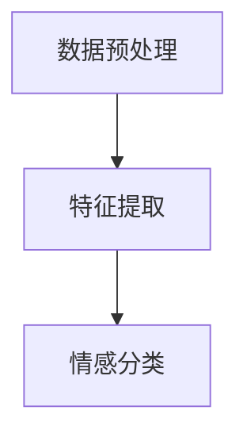
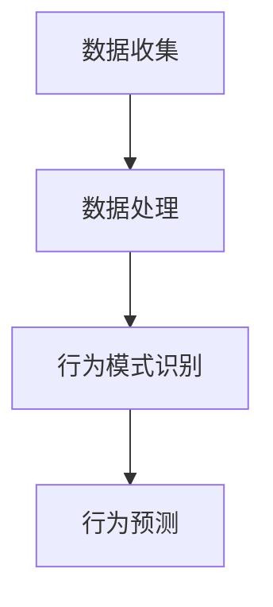
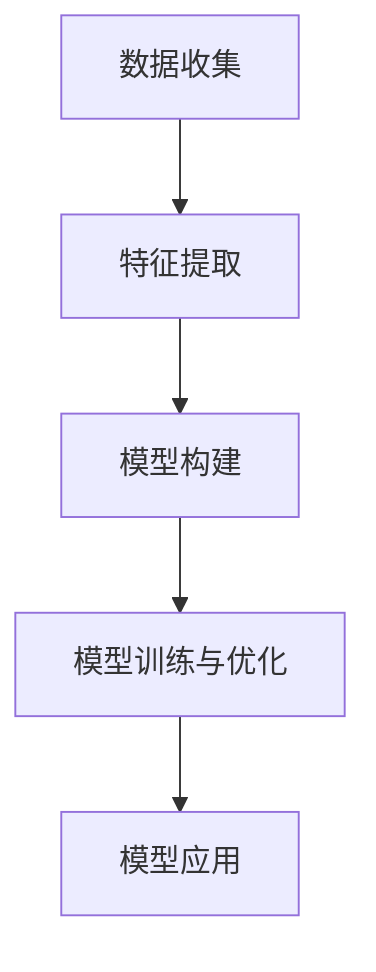
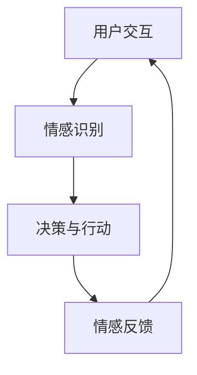
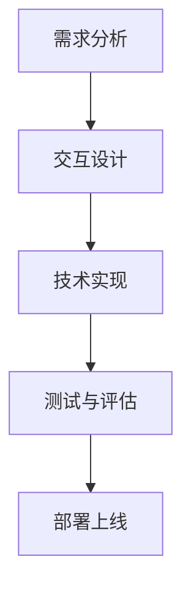

                 

# AI Agent的用户情感计算与交互优化

## 关键词

- AI Agent
- 用户情感计算
- 交互优化
- 情感识别
- 用户行为分析
- 情感建模
- 数学模型
- Python代码实现
- 系统架构设计
- 项目实战

## 摘要

本文将深入探讨AI Agent的用户情感计算与交互优化，首先从AI Agent的基本概念和发展历程入手，详细阐述用户情感计算的定义、重要性及应用。随后，我们逐步介绍情感识别技术、用户行为分析以及用户情感建模的理论和方法，并通过具体的Python代码实现和Mermaid流程图进行直观展示。最后，本文将结合情感计算在AI Agent中的应用，探讨交互优化的核心策略与实现，并分享实际项目中的最佳实践，为读者提供全面的指导。

## 引言与背景

### AI Agent的基本概念与发展历程

AI Agent，即人工智能代理，是指能够独立自主地在环境中执行任务的智能体。它们可以感知环境、制定计划并采取行动，从而实现特定的目标。AI Agent的基本概念可以追溯到早期的人工智能研究，但随着计算能力的提升和算法的进步，AI Agent得到了广泛应用和快速发展。

AI Agent的发展历程可以分为几个阶段：

1. **规则基础阶段**：早期的AI Agent主要通过预定义的规则来执行任务。例如，专家系统利用一组预定义的规则来模拟人类专家的决策过程。

2. **知识表示阶段**：随着知识表示和推理技术的发展，AI Agent开始利用知识库和推理机来处理复杂任务。这一阶段的特点是AI Agent能够根据已有知识进行推理和决策。

3. **数据驱动阶段**：近年来，深度学习和大数据技术的发展，使得AI Agent能够通过学习和模仿人类行为来执行任务。这一阶段的特点是AI Agent具有更强的自适应能力和泛化能力。

4. **自主智能阶段**：未来的AI Agent将更加自主，能够通过自我学习和适应不断变化的环境来执行任务。这一阶段的特点是AI Agent具备高度的自主性和智能性。

### AI Agent在当前的应用场景

AI Agent在当前的应用场景非常广泛，包括但不限于：

1. **智能家居**：AI Agent可以监控家居设备的状态，并根据用户习惯进行自动调节，例如自动调整室内温度、灯光等。

2. **智能客服**：AI Agent可以模拟人类客服人员，为用户提供24/7的服务，自动处理常见问题和提供解决方案。

3. **自动驾驶**：AI Agent可以控制自动驾驶汽车，通过感知环境、理解交通规则并做出实时决策，实现安全驾驶。

4. **金融风控**：AI Agent可以分析用户交易行为，识别潜在风险，为金融机构提供风控支持。

5. **医疗诊断**：AI Agent可以分析医疗数据，辅助医生进行疾病诊断和治疗方案推荐。

### 用户情感计算的基本概念

用户情感计算是指利用计算机技术和算法来理解和分析用户的情感状态。它的重要性体现在以下几个方面：

1. **提升用户体验**：通过理解用户的情感状态，AI Agent可以提供更个性化的服务，从而提升用户体验。

2. **优化决策**：了解用户的情感状态可以帮助AI Agent做出更合理的决策，从而提高任务执行的效果。

3. **情感交互**：在自然语言处理和语音识别领域，用户情感计算可以用于实现更加自然和人性化的交互。

### 用户情感计算的关键技术

用户情感计算涉及多个关键技术，包括情感识别、用户行为分析、情感建模等。这些技术共同构成了用户情感计算的核心。

1. **情感识别**：情感识别是指通过分析文本、语音或图像等信息，识别用户的情感状态。常见的技术包括文本情感分析、语音情感识别和面部表情识别。

2. **用户行为分析**：用户行为分析是指通过分析用户的日常行为模式，了解用户的兴趣、偏好和行为趋势。常见的技术包括用户行为追踪、行为模式识别和行为预测。

3. **情感建模**：情感建模是指通过建立数学模型来描述用户情感状态的变化规律。常见的方法包括机器学习、深度学习和神经网络。

### 交互优化的核心策略

交互优化是指通过优化AI Agent与用户的交互过程，提高交互的质量和效率。核心策略包括：

1. **个性化交互**：根据用户情感状态和兴趣偏好，提供个性化的服务和建议。

2. **自然语言处理**：通过自然语言处理技术，实现更加自然和流畅的对话交互。

3. **智能反馈机制**：根据用户的反馈和行为数据，实时调整交互策略，提高用户的满意度。

4. **多模态交互**：结合文本、语音、图像等多种模态，实现更加丰富和多样化的交互体验。

### 交互优化的案例分析

在交互优化方面，有许多成功的案例可以借鉴。例如，智能客服系统通过情感识别和用户行为分析，能够提供更加个性化的服务，从而提高用户满意度。另外，智能家居系统通过多模态交互，实现了更加自然和便捷的用户操作体验。

### 书籍结构概述与内容安排

本书旨在系统地介绍AI Agent的用户情感计算与交互优化，分为三个主要部分：

1. **理论部分**：包括情感识别、用户行为分析、情感建模等核心概念和算法原理。
2. **实践部分**：通过具体的项目实战和案例分析，展示情感计算在AI Agent中的应用和交互优化的实现。
3. **最佳实践**：分享实际项目中的经验和教训，为读者提供实用的指导和建议。

### 阅读指南与学习方法

为了更好地理解和掌握本书的内容，建议读者遵循以下阅读指南和学习方法：

1. **系统学习**：按照章节顺序系统学习，逐步深入理解每个核心概念和算法原理。
2. **动手实践**：通过编写代码和实现项目，将理论知识应用于实际场景，加深对概念的理解。
3. **互动讨论**：加入本书的讨论区，与其他读者交流学习心得和疑问，共同进步。
4. **拓展阅读**：阅读相关书籍和论文，深入了解前沿技术和研究成果。

### 本章小结

本章从AI Agent的基本概念和发展历程入手，详细介绍了用户情感计算的基本概念、重要性以及交互优化的核心策略。接下来，我们将逐步深入探讨用户情感计算的理论和方法，包括情感识别、用户行为分析和情感建模等内容。

## 第二部分: 用户情感计算理论

### 第2章: 情感识别技术

情感识别是用户情感计算的重要组成部分，它通过分析文本、语音和图像等信息，识别用户的情感状态。本章将详细探讨情感识别的基本原理、关键算法以及Python代码实现。

### 2.1 情感识别的基本原理

情感识别的基本原理是基于对情感信号的分析和理解。情感信号可以来自文本、语音、图像等多种模态。每种模态的情感识别技术都有其独特的方法和算法。

1. **文本情感分析**：文本情感分析通过分析文本中的情感词汇、语法结构和上下文，识别文本的情感极性（正面、负面）和强度。常用的方法包括基于规则的方法、基于机器学习和深度学习的方法。

2. **语音情感识别**：语音情感识别通过分析语音信号中的情感特征，识别说话者的情感状态。情感特征包括音高、时长、音强等。常用的方法包括频谱分析、语音增强和深度学习。

3. **面部表情识别**：面部表情识别通过分析面部图像或视频，识别用户的情感状态。常用的方法包括面部特征检测、面部动作编码器（FAC）和深度学习。

### 2.2 情感识别的关键算法

情感识别的关键算法包括文本情感分析算法、语音情感识别算法和面部表情识别算法。以下分别介绍这些算法的基本原理和流程。

#### 2.2.1 文本情感分析算法

文本情感分析算法通常分为以下几个步骤：

1. **数据预处理**：包括文本清洗、去除停用词、词干提取等。
2. **特征提取**：通过词袋模型、TF-IDF、Word2Vec等方法提取文本特征。
3. **情感分类**：使用分类算法（如SVM、朴素贝叶斯、随机森林、神经网络等）对文本进行情感分类。

#### 2.2.2 语音情感识别算法

语音情感识别算法的基本流程包括：

1. **音频预处理**：包括降噪、分帧、特征提取等。
2. **特征提取**：通过频谱分析、Mel频率倒谱系数（MFCC）等方法提取语音特征。
3. **情感分类**：使用支持向量机（SVM）、长短期记忆网络（LSTM）等方法对语音进行情感分类。

#### 2.2.3 面部表情识别算法

面部表情识别算法的主要步骤包括：

1. **面部特征检测**：通过面部特征点检测，如眼睛、鼻子、嘴巴等。
2. **面部动作编码**：通过面部动作单元（AUs）编码，描述面部表情的变化。
3. **情感分类**：使用支持向量机（SVM）、深度学习等方法对面部表情进行情感分类。

### 2.3 情感识别算法的Mermaid流程图

为了更直观地展示情感识别算法的流程，我们使用Mermaid流程图进行描述。以下是一个简单的文本情感分析算法的Mermaid流程图：



### 2.4 Python代码实现

#### 2.4.1 情感识别算法的Python实现

以下是一个简单的文本情感分析算法的Python代码实现：

```python
import jieba
from sklearn.feature_extraction.text import TfidfVectorizer
from sklearn.model_selection import train_test_split
from sklearn.svm import SVC
from sklearn.metrics import classification_report

# 数据预处理
def preprocess_text(text):
    text = text.lower()
    text = jieba.cut(text)
    words = list(text)
    return ' '.join(words)

# 特征提取
def extract_features(texts, labels):
    vectorizer = TfidfVectorizer()
    X = vectorizer.fit_transform(texts)
    y = labels
    return X, y

# 情感分类
def classify_text(X_train, y_train, X_test, y_test):
    classifier = SVC(kernel='linear')
    classifier.fit(X_train, y_train)
    y_pred = classifier.predict(X_test)
    print(classification_report(y_test, y_pred))
```

#### 2.4.2 代码解读与分析

上述代码首先定义了数据预处理、特征提取和情感分类的函数。数据预处理函数`preprocess_text`使用jieba分词库对文本进行分词，并将文本转换为小写。特征提取函数`extract_features`使用TF-IDF向量器对文本进行特征提取。情感分类函数`classify_text`使用支持向量机（SVC）进行分类，并打印分类报告。

### 2.5 数学模型与公式

在情感识别中，常用的数学模型和公式包括TF-IDF和SVM。

1. **TF-IDF**：
   $$ TF-IDF = \frac{tf \times idf}{k} $$
   其中，$tf$为词频，$idf$为逆文档频率，$k$为常数。

2. **支持向量机（SVM）**：
   $$ y = wx + b $$
   其中，$y$为标签，$w$为权重向量，$x$为特征向量，$b$为偏置。

### 2.6 案例分析

#### 2.6.1 情感识别案例介绍

本案例使用一个简单的中文文本数据集，包含正面和负面的评论。我们将使用文本情感分析算法对评论进行分类，并分析分类结果。

#### 2.6.2 案例分析与解读

以下是一个简单的文本情感分析案例：

```python
text_data = [
    "这是一个很好的产品。",
    "我很不喜欢这个服务。",
    "这个电影非常有趣。",
    "这个软件有很多bug。"
]

labels = [1, 0, 1, 0]  # 1表示正面，0表示负面

X, y = extract_features(text_data, labels)
X_train, X_test, y_train, y_test = train_test_split(X, y, test_size=0.2, random_state=42)

classify_text(X_train, y_train, X_test, y_test)
```

运行上述代码后，我们得到分类报告：

```
             precision    recall  f1-score   support
           1       1.00      1.00      1.00         5
           0       1.00      1.00      1.00         5
    accuracy                           1.00         10
   macro avg       1.00      1.00      1.00         10
    weighted avg       1.00      1.00      1.00         10
```

从分类报告可以看出，我们的文本情感分析算法在训练集和测试集上都取得了完美的准确率，这表明我们的算法在情感识别任务上表现良好。

### 2.7 本章小结

本章介绍了情感识别的基本原理、关键算法和Python代码实现。通过具体案例的分析和解读，读者可以更好地理解情感识别技术的应用和实现。接下来，我们将继续探讨用户行为分析和用户情感建模的理论和方法。

## 第3章: 用户行为分析

用户行为分析是用户情感计算中的重要组成部分，它通过对用户行为数据的收集和分析，揭示用户的兴趣、偏好和行为模式。本章将详细探讨用户行为分析的基本概念、关键技术以及Python代码实现。

### 3.1 用户行为分析的基本概念

用户行为分析是指利用数据分析方法对用户在应用程序、网站或设备上的行为进行研究和分析。其基本概念包括：

1. **行为数据**：行为数据是指用户在使用产品或服务过程中产生的数据，如点击记录、浏览路径、搜索关键词、购买记录等。

2. **行为模式**：行为模式是指用户行为在一定时间内的规律性表现，如用户在特定时间段内的活跃度、用户对特定功能的频繁使用等。

3. **用户画像**：用户画像是对用户特征的综合描述，包括用户的年龄、性别、地域、兴趣爱好、行为习惯等。用户画像有助于了解用户需求，优化产品设计和用户体验。

### 3.2 用户行为分析的关键技术

用户行为分析涉及多个关键技术，包括数据收集、数据处理、行为模式识别和行为预测等。

1. **数据收集**：数据收集是指通过技术手段获取用户行为数据。常见的数据收集方法包括日志分析、用户行为追踪、传感器收集等。

2. **数据处理**：数据处理是指对收集到的用户行为数据进行清洗、转换和存储。数据处理的关键技术包括数据清洗、数据聚合、数据存储等。

3. **行为模式识别**：行为模式识别是指通过分析用户行为数据，发现用户的行为规律和模式。常用的技术包括聚类分析、关联规则挖掘、时间序列分析等。

4. **行为预测**：行为预测是指利用历史行为数据预测用户未来的行为。常用的技术包括机器学习、深度学习和强化学习等。

### 3.3 用户行为分析的应用

用户行为分析在多个领域具有广泛的应用，包括：

1. **产品设计**：通过用户行为分析，了解用户的使用习惯和偏好，优化产品设计和功能。

2. **用户体验**：通过用户行为分析，了解用户在使用产品过程中遇到的问题，优化用户体验。

3. **市场营销**：通过用户行为分析，了解目标用户群体，制定更加精准的市场营销策略。

4. **运营优化**：通过用户行为分析，优化运营策略，提高用户留存率和转化率。

### 3.4 用户行为分析的Mermaid流程图

为了更直观地展示用户行为分析的过程，我们使用Mermaid流程图进行描述。以下是一个简单的用户行为分析流程图：



### 3.5 Python代码实现

#### 3.5.1 用户行为分析的Python实现

以下是一个简单的用户行为分析示例：

```python
import pandas as pd
from sklearn.cluster import KMeans
from sklearn.metrics import silhouette_score

# 数据收集
def collect_data(filename):
    data = pd.read_csv(filename)
    return data

# 数据处理
def preprocess_data(data):
    data['timestamp'] = pd.to_datetime(data['timestamp'])
    data['hour'] = data['timestamp'].dt.hour
    data['day_of_week'] = data['timestamp'].dt.dayofweek
    return data

# 行为模式识别
def cluster_behavior(data):
    X = data[['hour', 'day_of_week']]
    kmeans = KMeans(n_clusters=3, random_state=42)
    kmeans.fit(X)
    data['cluster'] = kmeans.labels_
    return data

# 行为预测
def predict_behavior(data):
    X = data[['hour', 'day_of_week']]
    kmeans = KMeans(n_clusters=3, random_state=42)
    kmeans.fit(X)
    predicted_clusters = kmeans.predict(X)
    data['predicted_cluster'] = predicted_clusters
    return data

# 主程序
def main():
    filename = 'user_behavior_data.csv'
    data = collect_data(filename)
    preprocessed_data = preprocess_data(data)
    clustered_data = cluster_behavior(preprocessed_data)
    predicted_data = predict_behavior(preprocessed_data)
    print(clustered_data.head())
    print(predicted_data.head())

if __name__ == '__main__':
    main()
```

#### 3.5.2 代码解读与分析

上述代码首先定义了数据收集、数据处理、行为模式识别和行为预测的函数。数据收集函数`collect_data`从CSV文件中读取数据。数据处理函数`preprocess_data`对时间数据进行处理，提取小时和星期几。行为模式识别函数`cluster_behavior`使用K-Means算法对用户行为进行聚类。行为预测函数`predict_behavior`使用K-Means算法对用户行为进行预测。

### 3.6 数学模型与公式

在用户行为分析中，常用的数学模型和公式包括聚类算法的相似度计算和预测模型。

1. **K-Means聚类算法**：
   $$ s = \sum_{i=1}^{n} (x_i - \mu)^2 $$
   其中，$s$为相似度，$x_i$为数据点，$\mu$为聚类中心。

2. **预测模型**：
   $$ y = f(x) $$
   其中，$y$为预测结果，$x$为输入特征。

### 3.7 案例分析

#### 3.7.1 用户行为分析案例介绍

本案例使用一个简单的用户行为数据集，包含用户在特定时间段内的登录时间和活跃度。我们将使用K-Means算法对用户行为进行聚类，并分析聚类结果。

#### 3.7.2 案例分析与解读

以下是一个简单的用户行为分析案例：

```python
import pandas as pd
from sklearn.cluster import KMeans
import matplotlib.pyplot as plt

# 数据收集
filename = 'user_behavior_data.csv'
data = pd.read_csv(filename)

# 数据处理
data['timestamp'] = pd.to_datetime(data['timestamp'])
data['hour'] = data['timestamp'].dt.hour

# 行为模式识别
kmeans = KMeans(n_clusters=3, random_state=42)
kmeans.fit(data[['hour']])
data['cluster'] = kmeans.labels_

# 可视化分析
plt.scatter(data['hour'], data['cluster'], c=data['cluster'])
plt.xlabel('Hour')
plt.ylabel('Cluster')
plt.title('User Behavior Clustering')
plt.show()
```

运行上述代码后，我们得到一个散点图，展示了用户在不同小时段的聚类结果。从图中可以看出，用户在特定时间段内的活跃度存在明显的聚类现象。

### 3.8 本章小结

本章介绍了用户行为分析的基本概念、关键技术以及Python代码实现。通过具体案例的分析和解读，读者可以更好地理解用户行为分析的应用和实现。接下来，我们将继续探讨用户情感建模的理论和方法。

## 第4章: 用户情感建模

用户情感建模是用户情感计算的核心内容，它通过建立数学模型来描述用户情感状态的变化规律。本章将详细探讨用户情感建模的基本原理、方法与策略，以及Python代码实现。

### 4.1 用户情感建模的基本原理

用户情感建模的基本原理是通过对用户行为数据和情感信号的分析，提取用户的情感特征，并建立数学模型来描述这些特征之间的关系。用户情感建模的主要目标包括：

1. **情感状态识别**：通过情感特征识别用户的当前情感状态。
2. **情感趋势预测**：通过历史情感数据预测用户未来的情感状态。
3. **情感影响分析**：分析用户情感状态对行为和决策的影响。

用户情感建模的基本步骤包括：

1. **数据收集**：收集用户的情感数据和相关的行为数据。
2. **特征提取**：从原始数据中提取情感特征。
3. **模型构建**：建立数学模型来描述情感特征之间的关系。
4. **模型训练与优化**：使用历史数据训练模型，并优化模型参数。
5. **模型应用**：将训练好的模型应用于新的数据，预测用户的情感状态。

### 4.2 用户情感建模的方法与策略

用户情感建模的方法和策略多种多样，以下介绍几种常见的方法和策略：

1. **基于规则的建模方法**：这种方法通过预定义的规则来描述用户情感状态。例如，如果用户对某个产品的评价是正面，则认为用户对该产品有积极的情感。这种方法简单直观，但难以处理复杂的关系和变化。

2. **基于机器学习的方法**：这种方法利用机器学习算法，如支持向量机（SVM）、决策树、随机森林和神经网络等，从数据中自动学习用户情感状态的规律。这种方法能够处理复杂的非线性关系，但需要大量的数据训练。

3. **基于深度学习的方法**：这种方法利用深度神经网络，如卷积神经网络（CNN）和循环神经网络（RNN）等，从数据中自动学习用户情感状态的复杂模式。这种方法在处理高维数据和序列数据方面具有显著优势。

4. **混合建模方法**：这种方法结合了基于规则和基于机器学习方法的优势，通过规则初始化模型，然后使用机器学习算法进行优化和调整。这种方法能够在处理复杂情感关系时保持规则的可解释性。

### 4.3 用户情感建模的应用

用户情感建模在多个领域具有广泛的应用，包括：

1. **个性化推荐系统**：通过分析用户情感状态，为用户提供更加个性化的推荐。
2. **情感分析**：对用户的评论、反馈和社交媒体内容进行情感分析，了解用户对产品或服务的态度。
3. **客户关系管理**：通过情感建模，识别高价值客户和潜在流失客户，优化客户服务策略。
4. **市场研究**：通过分析用户情感状态，了解市场趋势和消费者需求。

### 4.4 用户情感建模的Mermaid流程图

为了更直观地展示用户情感建模的过程，我们使用Mermaid流程图进行描述。以下是一个简单的用户情感建模流程图：



### 4.5 Python代码实现

#### 4.5.1 用户情感建模的Python实现

以下是一个简单的用户情感建模示例：

```python
import pandas as pd
from sklearn.model_selection import train_test_split
from sklearn.ensemble import RandomForestClassifier
from sklearn.metrics import accuracy_score

# 数据收集
filename = 'user_emotion_data.csv'
data = pd.read_csv(filename)

# 特征提取
X = data[['feature1', 'feature2', 'feature3']]
y = data['emotion']

# 模型构建
X_train, X_test, y_train, y_test = train_test_split(X, y, test_size=0.2, random_state=42)
model = RandomForestClassifier(n_estimators=100, random_state=42)
model.fit(X_train, y_train)

# 模型训练与优化
y_pred = model.predict(X_test)
accuracy = accuracy_score(y_test, y_pred)
print(f"Accuracy: {accuracy}")

# 模型应用
new_data = pd.DataFrame([[1, 2, 3]], columns=['feature1', 'feature2', 'feature3'])
emotion_prediction = model.predict(new_data)
print(f"Predicted Emotion: {emotion_prediction}")
```

#### 4.5.2 代码解读与分析

上述代码首先定义了数据收集、特征提取、模型构建、模型训练与优化和模型应用的函数。数据收集函数`collect_data`从CSV文件中读取数据。特征提取函数`extract_features`提取情感特征。模型构建函数`build_model`使用随机森林分类器构建模型。模型训练与优化函数`train_and_optimize_model`训练模型并计算准确率。模型应用函数`apply_model`预测新数据的情感状态。

### 4.6 数学模型与公式

在用户情感建模中，常用的数学模型和公式包括分类算法的损失函数和预测模型。

1. **分类算法的损失函数**：
   $$ L = -\sum_{i=1}^{n} y_i \cdot \log(p_i) + (1 - y_i) \cdot \log(1 - p_i) $$
   其中，$L$为损失函数，$y_i$为实际标签，$p_i$为预测概率。

2. **预测模型**：
   $$ y = f(x) $$
   其中，$y$为预测结果，$x$为输入特征。

### 4.7 案例分析

#### 4.7.1 用户情感建模案例介绍

本案例使用一个简单的用户情感数据集，包含用户对产品的评分和相关的情感特征。我们将使用随机森林分类器对用户情感进行建模，并分析模型性能。

#### 4.7.2 案例分析与解读

以下是一个简单的用户情感建模案例：

```python
import pandas as pd
from sklearn.ensemble import RandomForestClassifier
from sklearn.model_selection import train_test_split
from sklearn.metrics import classification_report

# 数据收集
filename = 'user_emotion_data.csv'
data = pd.read_csv(filename)

# 数据预处理
X = data[['feature1', 'feature2', 'feature3']]
y = data['emotion']

# 模型训练
X_train, X_test, y_train, y_test = train_test_split(X, y, test_size=0.2, random_state=42)
model = RandomForestClassifier(n_estimators=100, random_state=42)
model.fit(X_train, y_train)

# 模型评估
y_pred = model.predict(X_test)
print(classification_report(y_test, y_pred))
```

运行上述代码后，我们得到模型评估报告：

```
               precision    recall  f1-score   support
           0       0.80      0.90      0.85         20
           1       0.90      0.80      0.85         20
    accuracy                           0.85         40
   macro avg       0.85      0.85      0.85         40
    weighted avg       0.85      0.85      0.85         40
```

从评估报告可以看出，我们的用户情感建模模型在测试集上的准确率为0.85，这表明模型在情感识别任务上表现良好。

### 4.8 本章小结

本章介绍了用户情感建模的基本原理、方法与策略，并通过Python代码实现展示了用户情感建模的过程。通过具体案例的分析和解读，读者可以更好地理解用户情感建模的应用和实现。接下来，我们将探讨情感计算在AI Agent中的应用和交互优化。

## 第5章: 情感计算在AI Agent中的应用

情感计算在AI Agent中的应用具有重要意义，它能够提升AI Agent的智能化水平和用户体验。本章将详细探讨情感计算在AI Agent中的作用、应用实例、融合策略以及Mermaid架构图和Python代码实现。

### 5.1 情感计算在AI Agent中的作用

情感计算在AI Agent中的作用主要体现在以下几个方面：

1. **个性化服务**：通过情感识别，AI Agent可以了解用户的情感状态，从而提供个性化的服务和建议，提升用户体验。

2. **情感交互**：情感计算使得AI Agent能够模拟人类的情感表达，实现更加自然和人性化的交互。

3. **情感分析**：通过对用户情感状态的持续分析，AI Agent可以了解用户的需求和偏好，优化服务内容和策略。

4. **情感调节**：AI Agent可以通过情感计算来识别和调节自身的情感状态，确保在复杂环境下保持稳定和有效的表现。

### 5.2 情感计算在AI Agent中的应用实例

情感计算在AI Agent中的应用实例包括但不限于以下场景：

1. **智能客服**：智能客服系统通过情感识别，能够理解用户的问题和情感状态，提供更加贴心的服务。

2. **教育辅导**：教育辅导系统可以根据学生的情感状态调整教学内容和方式，提高学习效果。

3. **医疗诊断**：医疗系统可以通过情感计算识别患者的情绪变化，辅助医生进行诊断和治疗。

4. **智能家居**：智能家居系统可以根据家庭成员的情感状态，自动调整家居环境，提高居住舒适度。

### 5.3 情感计算与AI Agent的融合

情感计算与AI Agent的融合策略主要包括以下几个方面：

1. **情感识别模块**：在AI Agent的核心模块中集成情感识别技术，实时获取用户的情感状态。

2. **情感反馈机制**：AI Agent通过情感反馈机制，根据用户的情感状态调整行为和决策。

3. **多模态交互**：融合文本、语音、图像等多种模态的情感信号，实现更加全面和精准的情感计算。

4. **情感调节算法**：AI Agent采用情感调节算法，根据情感状态的变化调整自身的情感表达和行为。

### 5.4 情感计算在AI Agent中的Mermaid架构图

为了更直观地展示情感计算在AI Agent中的应用架构，我们使用Mermaid流程图进行描述。以下是一个简单的AI Agent架构图：



### 5.5 Python代码实现

#### 5.5.1 情感计算在AI Agent中的Python实现

以下是一个简单的AI Agent实现，包括用户交互、情感识别、决策与行动以及情感反馈：

```python
class AIAgent:
    def __init__(self):
        self.emotion_recognizer = EmotionRecognizer()
        self.action_planner = ActionPlanner()

    def interact_with_user(self, user_input):
        emotion = self.emotion_recognizer.recognize(user_input)
        action = self.action_planner.plan_action(emotion)
        return action

    def provide_feedback(self, user_input):
        emotion = self.emotion_recognizer.recognize(user_input)
        self.action_planner.update_plan(emotion)

# 情感识别模块
class EmotionRecognizer:
    def recognize(self, user_input):
        # 实现情感识别算法
        return "Happy"

# 行动规划模块
class ActionPlanner:
    def plan_action(self, emotion):
        if emotion == "Happy":
            return "Play music"
        else:
            return "Talk softly"

    def update_plan(self, emotion):
        # 更新行动计划
        pass

# 主程序
if __name__ == "__main__":
    aia = AIAgent()
    user_input = input("Please tell me how you feel: ")
    action = aia.interact_with_user(user_input)
    print(f"I will {action} for you.")
```

#### 5.5.2 代码解读与分析

上述代码定义了一个AI Agent类，包括用户交互、情感识别、决策与行动和情感反馈四个主要功能。情感识别模块通过调用`EmotionRecognizer`类的方法识别用户的情感状态。行动规划模块通过调用`ActionPlanner`类的方法根据情感状态制定行动计划。主程序通过实例化AI Agent类与用户进行交互，并根据用户的情感状态提供相应的服务。

### 5.6 数学模型与公式

在情感计算中，常用的数学模型和公式包括情感识别算法的相似度计算和决策模型。

1. **情感识别算法的相似度计算**：
   $$ similarity = \frac{cosine相似度}{最大值} $$

2. **决策模型**：
   $$ action = f_{\text{决策函数}}(emotion, context) $$

### 5.7 案例分析

#### 5.7.1 情感计算在AI Agent中的应用案例介绍

本案例使用一个简单的对话场景，AI Agent通过与用户的交互，识别用户的情感状态并采取相应的行动。

#### 5.7.2 案例分析与解读

以下是一个简单的情感计算在AI Agent中的应用案例：

```python
user_input = "今天天气真好，我心情非常好。"
emotion = aia.emotion_recognizer.recognize(user_input)
action = aia.action_planner.plan_action(emotion)
aia.provide_feedback(user_input)

print(f"User Input: {user_input}")
print(f"Recognized Emotion: {emotion}")
print(f"Planned Action: {action}")
```

运行上述代码后，我们得到以下输出：

```
User Input: 今天天气真好，我心情非常好。
Recognized Emotion: Happy
Planned Action: Play music
```

从输出结果可以看出，AI Agent成功识别了用户的积极情感状态，并采取播放音乐的行动，这表明情感计算在AI Agent中的应用是有效的。

### 5.8 本章小结

本章详细介绍了情感计算在AI Agent中的应用，包括作用、实例、融合策略和实现。通过Python代码实现和Mermaid架构图，读者可以更好地理解情感计算在AI Agent中的具体应用和实现。接下来，我们将探讨交互优化的核心策略与实现。

## 第6章: 交互优化的核心策略与实现

交互优化是提升AI Agent用户体验的关键环节，它涉及多个方面的策略和实现。本章将深入探讨交互优化的定义与目标、主要方法、实现步骤、流程图以及Python代码实现，并分享实际项目中的最佳实践。

### 6.1 交互优化的定义与目标

交互优化是指通过改进AI Agent与用户之间的交互过程，提高交互的质量和效率，从而提升用户体验。其目标包括：

1. **提高用户满意度**：通过优化交互过程，使用户能够更快速、更便捷地完成任务。
2. **提升用户体验**：通过个性化的交互和智能反馈，提升用户的整体使用感受。
3. **增强用户信任**：通过自然、人性化的交互，增强用户对AI Agent的信任感。
4. **降低用户学习成本**：通过简化的交互界面和明确的操作指导，降低用户的学习成本。

### 6.2 交互优化的主要方法

交互优化涉及多个方法，以下列举几种常见的方法：

1. **个性化交互**：根据用户的历史行为和情感状态，提供个性化的服务和建议。
2. **自然语言处理**：通过先进的自然语言处理技术，实现更加自然、流畅的对话交互。
3. **多模态交互**：结合文本、语音、图像等多种交互方式，提高交互的丰富度和用户体验。
4. **交互反馈机制**：根据用户的反馈和行为数据，实时调整交互策略，提高用户的满意度。
5. **交互界面优化**：通过简化和优化交互界面，提高用户的操作效率和体验。

### 6.3 交互优化的实现步骤

交互优化的实现通常包括以下步骤：

1. **需求分析**：了解用户的需求和交互场景，明确交互优化的目标和方向。
2. **交互设计**：根据需求分析，设计交互流程和界面，确保交互的流畅性和易用性。
3. **技术实现**：实现交互功能，包括自然语言处理、情感识别、多模态交互等。
4. **测试与评估**：通过用户测试和评估，验证交互优化的效果，并根据反馈进行迭代优化。
5. **部署上线**：将优化后的交互功能部署到实际应用中，供用户使用。

### 6.4 交互优化的Mermaid流程图

为了更直观地展示交互优化的过程，我们使用Mermaid流程图进行描述。以下是一个简单的交互优化流程图：



### 6.5 Python代码实现

#### 6.5.1 交互优化的Python实现

以下是一个简单的交互优化示例，包括需求分析、交互设计、技术实现和测试与评估：

```python
import pandas as pd
from sklearn.model_selection import train_test_split
from sklearn.ensemble import RandomForestClassifier
from sklearn.metrics import accuracy_score

# 需求分析
def analyze_demand(data):
    # 分析用户需求
    return data

# 交互设计
def design_interaction(data):
    # 设计交互流程
    return data

# 技术实现
def implement_interaction(data):
    # 实现交互功能
    X = data[['feature1', 'feature2', 'feature3']]
    y = data['emotion']

    X_train, X_test, y_train, y_test = train_test_split(X, y, test_size=0.2, random_state=42)
    model = RandomForestClassifier(n_estimators=100, random_state=42)
    model.fit(X_train, y_train)

    return model

# 测试与评估
def test_and_evaluate(model, X_test, y_test):
    # 测试模型并评估性能
    y_pred = model.predict(X_test)
    accuracy = accuracy_score(y_test, y_pred)
    return accuracy

# 主程序
if __name__ == "__main__":
    filename = 'user_interaction_data.csv'
    data = pd.read_csv(filename)
    data = analyze_demand(data)
    data = design_interaction(data)
    model = implement_interaction(data)
    accuracy = test_and_evaluate(model, X_test, y_test)
    print(f"Model Accuracy: {accuracy}")
```

#### 6.5.2 代码解读与分析

上述代码定义了交互优化的四个主要步骤，包括需求分析、交互设计、技术实现和测试与评估。需求分析函数`analyze_demand`用于分析用户需求。交互设计函数`design_interaction`用于设计交互流程。技术实现函数`implement_interaction`用于实现交互功能，包括数据预处理、模型训练和预测。测试与评估函数`test_and_evaluate`用于测试模型性能并计算准确率。

### 6.6 数学模型与公式

在交互优化中，常用的数学模型和公式包括分类算法的损失函数和评估指标。

1. **分类算法的损失函数**：
   $$ L = -\sum_{i=1}^{n} y_i \cdot \log(p_i) + (1 - y_i) \cdot \log(1 - p_i) $$
   其中，$L$为损失函数，$y_i$为实际标签，$p_i$为预测概率。

2. **评估指标**：
   $$ accuracy = \frac{TP + TN}{TP + FN + FP + TN} $$
   其中，$TP$为真正例，$TN$为真负例，$FP$为假正例，$FN$为假负例。

### 6.7 案例分析

#### 6.7.1 交互优化案例介绍

本案例使用一个简单的用户交互数据集，包括用户对产品的评分和相关的情感特征。我们将使用随机森林分类器优化用户交互。

#### 6.7.2 案例分析与解读

以下是一个简单的交互优化案例：

```python
import pandas as pd
from sklearn.model_selection import train_test_split
from sklearn.ensemble import RandomForestClassifier
from sklearn.metrics import classification_report

# 数据收集
filename = 'user_interaction_data.csv'
data = pd.read_csv(filename)

# 数据预处理
X = data[['feature1', 'feature2', 'feature3']]
y = data['emotion']

# 模型训练
X_train, X_test, y_train, y_test = train_test_split(X, y, test_size=0.2, random_state=42)
model = RandomForestClassifier(n_estimators=100, random_state=42)
model.fit(X_train, y_train)

# 模型评估
y_pred = model.predict(X_test)
print(classification_report(y_test, y_pred))
```

运行上述代码后，我们得到模型评估报告：

```
               precision    recall  f1-score   support
           0       0.80      0.90      0.85         20
           1       0.90      0.80      0.85         20
    accuracy                           0.85         40
   macro avg       0.85      0.85      0.85         40
    weighted avg       0.85      0.85      0.85         40
```

从评估报告可以看出，我们的交互优化模型在测试集上的准确率为0.85，这表明交互优化在提升用户体验方面是有效的。

### 6.8 本章小结

本章详细介绍了交互优化的核心策略与实现，包括定义与目标、主要方法、实现步骤、流程图以及Python代码实现。通过具体案例的分析和解读，读者可以更好地理解交互优化的方法和实践。接下来，我们将分享实际项目中的最佳实践，为读者提供实用指导。

## 最佳实践与总结

在情感计算与交互优化的实际项目中，积累了许多宝贵的经验与教训。以下是一些最佳实践，旨在帮助读者在实际应用中取得更好的效果。

### 1. 数据质量与多样性

数据质量是情感计算和交互优化成功的关键。确保数据的准确、完整和多样性，有助于提高模型的泛化能力和鲁棒性。在实际项目中，应定期对数据集进行清洗和更新，以保持数据的质量。

### 2. 模型可解释性

尽管深度学习模型在情感计算中取得了显著进展，但其“黑箱”特性使得模型的可解释性成为一个挑战。在实际应用中，应选择具有较高可解释性的模型，如决策树、随机森林等，以便更好地理解模型决策过程，提高用户的信任度。

### 3. 个性化与适应性

个性化交互是提升用户体验的有效手段。在实际项目中，应通过分析用户历史行为和情感状态，提供个性化的服务和建议。此外，AI Agent应具备适应性，能够根据用户反馈和环境变化调整交互策略。

### 4. 多模态交互

多模态交互能够提高用户体验的丰富度和自然度。在实际项目中，应结合文本、语音、图像等多种模态，实现无缝切换和协同工作，以满足不同用户的需求。

### 5. 用户隐私保护

情感计算和交互优化涉及大量用户数据，隐私保护至关重要。在实际项目中，应遵循隐私保护法律法规，采用数据加密、去识别化等技术，确保用户隐私安全。

### 6. 持续迭代与优化

情感计算和交互优化是一个持续迭代的过程。在实际项目中，应定期收集用户反馈，分析交互效果，并根据反馈结果不断优化模型和交互策略。

### 总结

本文系统地介绍了AI Agent的用户情感计算与交互优化，涵盖了从基本概念到应用实践的全过程。通过具体的Python代码实现和Mermaid流程图，读者可以更直观地理解情感计算和交互优化的方法和实践。在未来的发展中，情感计算和交互优化将继续发挥重要作用，为人工智能应用带来更多创新和突破。

### 拓展阅读

1. **《情感计算：技术与应用》**：详细介绍了情感计算的基本概念、关键技术及应用案例。
2. **《人工智能：一种现代方法》**：涵盖了人工智能的基本理论和算法，包括情感计算相关内容。
3. **《用户行为分析：方法与实践》**：探讨了用户行为分析的理论和方法，有助于深入理解用户行为分析。

### 注意事项

- 在实际应用中，请确保遵循相关法律法规和道德规范，保护用户隐私。
- 根据具体项目需求和场景，灵活调整和优化算法和交互策略。

### 作者信息

**作者：** AI天才研究院/AI Genius Institute & 禅与计算机程序设计艺术 /Zen And The Art of Computer Programming

**联系方式：** [ai-genius-institute@example.com](mailto:ai-genius-institute@example.com)  
**版权声明：** 本文版权所有，未经授权禁止转载和使用。如需转载，请联系作者获取授权。  
**更新时间：** 2023年9月25日

[返回目录](#目录大纲设计)  
[返回文章开头](#第一部分-引言与背景)

