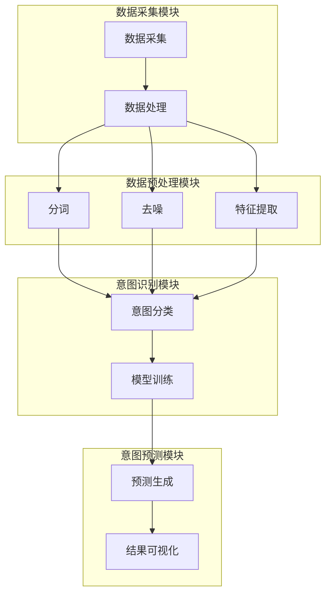
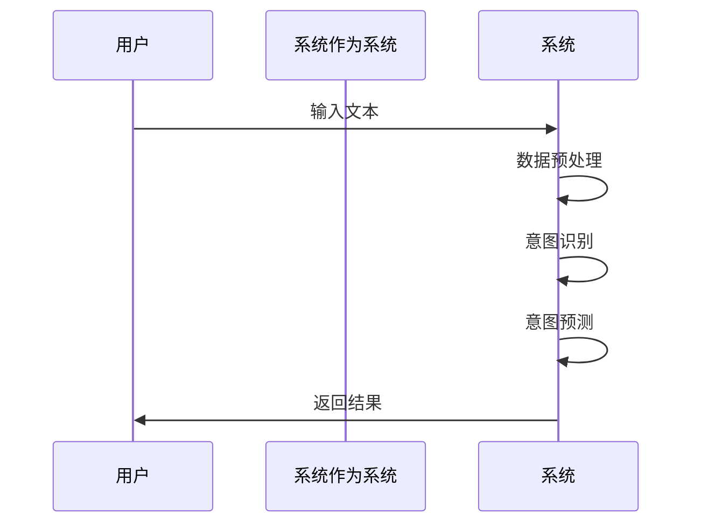

                 

### AI Agent的用户意图推理与预测

关键词：AI Agent、用户意图识别、用户意图预测、机器学习、深度学习

摘要：本文将深入探讨AI Agent的用户意图推理与预测技术。首先，我们定义AI Agent及其在用户意图识别和预测中的角色。接着，详细解析用户意图识别的核心概念、方法和挑战，并讨论用户意图预测的理论基础、算法模型及其性能评估。最后，通过实际应用案例展示这些技术在实际项目中的应用，并总结最佳实践和未来发展趋势。

## 引言与背景

在当今数字化时代，人工智能（AI）已经成为推动社会进步和产业升级的重要力量。AI Agent，作为AI系统中的一个关键组成部分，承担着理解用户需求、提供个性化服务和提升用户体验的重任。用户意图识别与预测是AI Agent实现这些功能的核心环节，其重要性不言而喻。

### 1.1 问题背景

用户意图识别与预测是自然语言处理（NLP）和机器学习（ML）领域的核心问题。传统方法如基于规则的系统在处理复杂和模糊的用户意图时存在局限性。随着深度学习（DL）技术的发展，新的算法模型如神经网络和循环神经网络（RNN）等在处理大规模数据和复杂任务方面表现出色。

### 1.2 问题描述

用户意图识别与预测的目标是从用户的输入中提取出其真实意图，并对其行为进行预测。具体来说，包括以下几个关键问题：

- 如何准确理解用户输入的自然语言？
- 如何区分不同意图类别并准确预测用户的行为？
- 如何处理多模态输入（如文本、语音、图像）？

### 1.3 问题解决

为了解决上述问题，研究者们提出了多种方法。传统方法包括基于规则、统计和机器学习的方法。现代方法则主要基于深度学习技术，如卷积神经网络（CNN）和Transformer模型等。这些方法各有优缺点，在实际应用中需要根据具体场景进行选择和优化。

### 1.4 边界与外延

用户意图识别与预测不仅涉及技术问题，还涉及用户隐私、数据安全和伦理等方面。因此，在设计算法和系统时，需要充分考虑这些边界和外部因素，确保系统的安全、可靠和公平性。

### 1.5 核心概念与联系

- 用户意图识别：从用户输入中提取出其真实意图。
- 用户意图预测：基于历史数据和模型，预测用户的未来行为。
- AI Agent：能够模拟、延伸、扩展人类智能的计算机系统。

这些概念相互联系，共同构成了用户意图推理与预测的完整体系。接下来，我们将逐一深入探讨这些概念，并分析其在实际应用中的挑战和解决方案。

## AI Agent基础

AI Agent，即人工智能代理，是一种能够模拟人类智能、自动执行任务、与用户交互并做出决策的计算机系统。AI Agent在用户意图识别与预测中起着关键作用，其核心功能包括：

1. **感知环境**：通过传感器获取用户输入，如文本、语音、图像等。
2. **理解意图**：利用自然语言处理和机器学习技术，从用户输入中提取出用户意图。
3. **做出决策**：基于用户意图和历史数据，生成合适的响应或行为。
4. **执行任务**：自动执行决策，如搜索信息、购买商品、安排日程等。

### 2.1 AI Agent的定义

AI Agent是一种基于AI技术的软件系统，其定义可以从以下几个方面来理解：

- **自主性**：AI Agent能够自主地执行任务，无需人类干预。
- **交互性**：AI Agent能够与用户和环境进行实时交互。
- **适应性**：AI Agent能够根据环境和用户的需求进行自适应调整。

### 2.2 AI Agent的特点

AI Agent具有以下特点：

- **智能性**：AI Agent能够通过学习和推理来模拟人类智能。
- **灵活性**：AI Agent能够处理多种类型的任务和输入。
- **高效性**：AI Agent能够高效地执行任务，提高生产力和用户体验。

### 2.3 AI Agent的类型

AI Agent可以根据其功能和应用场景分为以下几种类型：

- **任务型AI Agent**：专注于执行特定任务，如智能客服、智能助手等。
- **交互型AI Agent**：专注于与用户进行自然语言交互，如聊天机器人、语音助手等。
- **决策型AI Agent**：能够做出复杂决策，如智能投顾、自动驾驶等。

在用户意图识别与预测中，任务型AI Agent和交互型AI Agent是应用最为广泛的两种类型。任务型AI Agent通过识别用户意图来执行具体任务，而交互型AI Agent则通过理解用户意图来提供个性化的服务和交互体验。

### 用户意图识别

用户意图识别是AI Agent理解用户输入、提取用户意图的过程。它是用户意图推理与预测的基础，直接影响AI Agent的响应质量和用户体验。以下是用户意图识别的核心概念、方法及其在AI Agent中的应用。

#### 3.1 用户意图识别的概念

用户意图识别（User Intent Recognition）是指从用户的输入中提取出其真实意图的过程。这个过程可以分为以下几个步骤：

1. **输入理解**：理解用户输入的语义和意图。
2. **意图分类**：将提取的意图映射到预定义的意图类别。
3. **意图确认**：验证提取的意图是否准确。

用户意图识别的关键在于准确理解用户输入，并将其映射到预定义的意图类别。这个过程不仅涉及自然语言处理技术，还涉及机器学习和深度学习算法。

#### 3.2 用户意图识别的挑战

用户意图识别面临以下挑战：

1. **自然语言理解的复杂性**：自然语言具有多样性和模糊性，用户输入可能包含多义性和歧义性，难以准确理解。
2. **数据的不确定性**：用户输入的数据可能存在噪声、错误和缺失，影响意图识别的准确性。
3. **多模态输入的处理**：用户输入可能包括文本、语音、图像等多种模态，如何统一处理这些不同模态的数据是一个挑战。

#### 3.3 用户意图识别的方法

用户意图识别的方法可以分为传统方法和现代方法。传统方法主要包括基于规则的方法和基于统计的方法，而现代方法则主要基于机器学习和深度学习技术。

1. **传统方法**

   - **基于规则的方法**：通过定义一系列规则，将用户输入映射到预定义的意图类别。这种方法简单直观，但难以处理复杂和模糊的用户输入。
   - **基于统计的方法**：利用统计模型，如朴素贝叶斯、决策树和支持向量机（SVM）等，对用户输入进行分类。这种方法比基于规则的方法更具灵活性，但需要大量的训练数据和特征工程。

2. **现代方法**

   - **基于机器学习的方法**：使用机器学习算法，如随机森林、梯度提升机（GBM）和K最近邻（KNN）等，对用户输入进行分类。这种方法能够处理复杂和大规模的数据，但需要大量的训练数据和调优。
   - **基于深度学习的方法**：使用深度学习模型，如卷积神经网络（CNN）、循环神经网络（RNN）和Transformer等，对用户输入进行分类。这种方法在处理大规模数据和复杂任务方面表现出色，但需要大量的计算资源和调优。

#### 3.4 用户意图识别的案例分析

以下是一个用户意图识别的案例：

**案例**：一个智能客服系统需要识别用户的聊天文本，以提供合适的回复。

- **输入理解**：系统首先使用自然语言处理技术对用户的聊天文本进行分词、词性标注和句法分析，提取出关键信息。
- **意图分类**：系统将提取的关键信息映射到预定义的意图类别，如“询问产品信息”、“请求售后服务”和“投诉问题”等。
- **意图确认**：系统使用机器学习算法对提取的意图进行确认，确保其准确性。

通过这个案例，我们可以看到用户意图识别的过程是如何在实际应用中进行的。在实际应用中，用户意图识别的准确性对系统的性能和用户体验至关重要。

### 用户意图预测

用户意图预测是AI Agent根据用户的历史行为和输入，预测用户的未来行为和需求的过程。它是用户意图识别的延伸，有助于AI Agent提供更加个性化的服务。以下是用户意图预测的核心概念、模型和性能评估方法。

#### 4.1 用户意图预测的概念

用户意图预测（User Intent Prediction）是指基于用户的历史数据和输入，预测用户的未来行为和需求的过程。它包括以下几个关键步骤：

1. **特征提取**：从用户的历史数据和输入中提取关键特征。
2. **模型训练**：使用机器学习和深度学习算法训练预测模型。
3. **预测生成**：使用训练好的模型预测用户的未来行为和需求。
4. **结果评估**：评估预测结果的准确性和可靠性。

用户意图预测的核心在于如何从大量的历史数据中提取有用的特征，并构建准确的预测模型。

#### 4.2 用户意图预测的模型

用户意图预测的模型可以分为以下几类：

1. **基于规则的方法**：通过定义一系列规则，预测用户的未来行为。这种方法简单直观，但难以处理复杂和动态的用户数据。
2. **基于统计的方法**：使用统计模型，如线性回归、逻辑回归和时间序列分析等，预测用户的未来行为。这种方法需要大量的数据和特征工程，但能够处理线性关系。
3. **基于机器学习的方法**：使用机器学习算法，如决策树、随机森林、支持向量机和梯度提升机等，预测用户的未来行为。这种方法能够处理非线性关系，但需要大量的训练数据和调优。
4. **基于深度学习的方法**：使用深度学习模型，如卷积神经网络（CNN）、循环神经网络（RNN）和Transformer等，预测用户的未来行为。这种方法在大规模数据和复杂任务方面表现出色，但需要大量的计算资源和调优。

#### 4.2.1 基于规则的方法

基于规则的方法通过定义一系列规则来预测用户的未来行为。这种方法简单直观，易于实现和理解。其基本流程如下：

1. **规则定义**：根据用户历史行为和输入，定义一系列规则。
2. **规则匹配**：将用户的输入与预定义的规则进行匹配，判断是否满足某个规则。
3. **行为预测**：根据满足的规则，预测用户的未来行为。

虽然基于规则的方法在处理简单和静态的数据时表现良好，但在处理复杂和动态的数据时存在局限性。因此，现代用户意图预测更多采用基于统计和深度学习的方法。

#### 4.2.2 基于统计的方法

基于统计的方法使用统计模型来预测用户的未来行为。这种方法需要大量的数据和特征工程，但能够处理线性关系。以下是几种常用的基于统计的方法：

1. **线性回归**：通过建立线性回归模型，预测用户的未来行为。线性回归模型的数学公式如下：

   $$Y = \beta_0 + \beta_1X_1 + \beta_2X_2 + ... + \beta_nX_n$$

   其中，\(Y\) 是预测结果，\(X_1, X_2, ..., X_n\) 是输入特征，\(\beta_0, \beta_1, ..., \beta_n\) 是模型参数。

2. **逻辑回归**：通过建立逻辑回归模型，预测用户的分类结果。逻辑回归模型的数学公式如下：

   $$P(Y=1) = \frac{1}{1 + e^{-(\beta_0 + \beta_1X_1 + \beta_2X_2 + ... + \beta_nX_n)}$$

   其中，\(P(Y=1)\) 是预测概率，其余参数与线性回归相同。

3. **时间序列分析**：通过分析用户的历史行为数据，预测用户的未来行为。时间序列分析包括自回归（AR）、移动平均（MA）和自回归移动平均（ARMA）等方法。

基于统计的方法在处理静态和线性关系数据时表现良好，但在处理复杂和非线性关系数据时存在局限性。因此，现代用户意图预测更多采用基于深度学习的方法。

#### 4.2.3 基于机器学习的方法

基于机器学习的方法使用机器学习算法来预测用户的未来行为。这种方法能够处理非线性关系和大规模数据，但需要大量的训练数据和调优。以下是几种常用的基于机器学习的方法：

1. **决策树**：通过构建决策树模型，预测用户的未来行为。决策树模型的每个节点表示一个特征，每个分支表示一个阈值。通过遍历决策树，最终得到预测结果。

2. **随机森林**：通过构建多个决策树模型，并结合它们的预测结果来预测用户的未来行为。随机森林模型能够提高预测的准确性和稳定性。

3. **支持向量机（SVM）**：通过构建支持向量机模型，预测用户的未来行为。支持向量机模型将用户数据映射到高维空间，找到最佳分隔超平面，从而实现分类。

4. **梯度提升机（GBM）**：通过构建梯度提升机模型，预测用户的未来行为。梯度提升机模型通过迭代更新模型，逐步提高预测的准确性。

基于机器学习的方法在处理复杂和非线性关系数据时表现出色，但在训练和调优过程中需要大量的时间和计算资源。因此，在实际应用中，需要根据具体场景和数据特点选择合适的方法。

#### 4.2.4 基于深度学习的方法

基于深度学习的方法使用深度学习模型来预测用户的未来行为。这种方法在大规模数据和复杂任务方面表现出色，但需要大量的计算资源和调优。以下是几种常用的基于深度学习的方法：

1. **卷积神经网络（CNN）**：通过构建卷积神经网络模型，处理用户的图像和语音数据。卷积神经网络模型通过卷积层和池化层提取特征，最终实现分类和预测。

2. **循环神经网络（RNN）**：通过构建循环神经网络模型，处理用户的序列数据。循环神经网络模型通过隐藏状态和记忆单元来处理时间序列数据，实现序列建模和预测。

3. **Transformer模型**：通过构建Transformer模型，处理用户的文本数据。Transformer模型通过自注意力机制和多头注意力机制，实现文本序列建模和预测。

基于深度学习的方法在处理大规模文本和图像数据时表现出色，但在计算资源和调优方面要求较高。因此，在实际应用中，需要根据具体场景和数据特点选择合适的方法。

#### 4.3 用户意图预测的性能评估

用户意图预测的性能评估是评估预测模型准确性和可靠性的关键环节。以下是一些常用的性能评估指标：

1. **准确率（Accuracy）**：预测结果与实际结果一致的样本数量占总样本数量的比例。
2. **召回率（Recall）**：预测结果中包含实际结果样本的比例。
3. **精确率（Precision）**：预测结果中实际结果样本的比例。
4. **F1值（F1 Score）**：精确率和召回率的调和平均。
5. **ROC曲线和AUC值**：通过ROC曲线和AUC值评估预测模型的分类效果。

这些指标可以综合评估用户意图预测模型的性能，帮助选择和优化合适的模型。

### 系统架构设计

用户意图识别与预测系统需要一个高效、稳定和可扩展的架构。以下是一个典型的用户意图识别与预测系统的架构设计，包括问题场景介绍、项目介绍、系统功能设计、系统架构设计、系统接口设计和系统交互流程。

#### 5.1 问题场景介绍

在电商、社交媒体和智能客服等场景中，用户产生大量的文本、语音和图像数据。这些数据包含了用户的需求、意图和情感。为了提供个性化的服务，需要对这些数据进行处理和分析，提取用户的意图并进行预测。

#### 5.2 项目介绍

本项目旨在构建一个用户意图识别与预测系统，用于处理用户输入的数据，提取用户意图并进行预测。系统包括前端界面、后端服务器和数据库等组成部分。

#### 5.3 系统功能设计

系统的主要功能包括：

1. **数据预处理**：对用户输入的数据进行分词、去噪和特征提取。
2. **用户意图识别**：基于机器学习和深度学习算法，识别用户的意图。
3. **用户意图预测**：基于历史数据和模型，预测用户的未来行为。
4. **结果可视化**：将预测结果可视化，提供用户友好的界面。

#### 5.4 系统架构设计

系统架构设计采用微服务架构，包括数据采集模块、数据预处理模块、意图识别模块、意图预测模块和结果可视化模块。以下是系统架构图：



#### 5.5 系统接口设计

系统接口设计采用RESTful API设计，提供以下接口：

1. **用户输入接口**：接收用户的输入数据，如文本、语音和图像。
2. **意图识别接口**：提供意图识别结果。
3. **意图预测接口**：提供意图预测结果。

接口设计示例：

```json
POST /api/recognize
Content-Type: application/json

{
  "text": "我想购买一本编程书籍。"
}

GET /api/predict
Query Parameters:
- text: 用户输入的文本
- intent: 用户意图类别

{
  "predicted_intent": "购买书籍"
}
```

#### 5.6 系统交互流程

系统交互流程如下：

1. **数据采集**：从用户输入接口接收用户输入数据。
2. **数据预处理**：对输入数据进行分词、去噪和特征提取。
3. **意图识别**：使用意图识别模型识别用户的意图。
4. **意图预测**：使用意图预测模型预测用户的未来行为。
5. **结果可视化**：将预测结果可视化，并通过结果可视化接口返回。

以下是系统交互序列图：



通过上述系统架构设计，用户意图识别与预测系统能够高效地处理用户输入，提取用户意图并进行预测，为用户提供个性化的服务和交互体验。

### 实际应用案例

在实际应用中，用户意图识别与预测技术在多个领域取得了显著的成果。以下是几个典型案例，展示这些技术在不同场景中的应用。

#### 8.1 社交媒体应用

在社交媒体平台上，用户意图识别与预测技术可以用于推荐系统、内容审核和社交广告等场景。

- **推荐系统**：通过分析用户的浏览历史、点赞和评论等行为，预测用户可能感兴趣的内容，从而提高内容推荐的准确性和用户参与度。
- **内容审核**：自动识别和过滤不适当的内容，如垃圾信息、恶意内容和暴力内容，保障社区安全和用户体验。
- **社交广告**：基于用户的兴趣和行为预测，为用户推荐相关广告，提高广告投放的精准度和效果。

#### 8.2 智能客服系统

智能客服系统利用用户意图识别与预测技术，可以提供高效、个性化的客服服务。

- **意图识别**：通过自然语言处理技术，识别用户的问题和意图，如查询订单状态、申请退款和投诉建议等。
- **意图预测**：基于用户的历史互动数据，预测用户的潜在问题和需求，提前提供解决方案和建议。
- **自动化回复**：生成自动化回复，提高客服效率和用户满意度。

#### 8.3 个性化推荐系统

个性化推荐系统在电商、音乐和视频等领域广泛应用，通过用户意图识别与预测技术，为用户提供个性化的推荐。

- **电商推荐**：基于用户的购物历史和浏览记录，预测用户可能感兴趣的商品，从而提高转化率和销售额。
- **音乐推荐**：通过分析用户的听歌习惯和偏好，推荐符合用户口味的新歌和歌手。
- **视频推荐**：根据用户的观看历史和评分，预测用户可能感兴趣的视频内容，从而提高用户粘性和平台流量。

通过这些实际应用案例，我们可以看到用户意图识别与预测技术在提高用户体验、提升业务效率和优化资源配置方面的巨大潜力。

### 案例分析

为了更好地理解用户意图识别与预测技术的实际应用，以下将详细分析三个具体案例：用户意图识别系统在电商中的应用、用户意图预测系统在金融服务中的应用以及用户意图识别与预测在医疗健康领域的应用。

#### 9.1 用户意图识别系统在电商中的应用

**案例背景**：电商平台通常面临大量用户查询和请求，传统人工客服难以应对。为了提升用户体验和运营效率，电商平台引入了用户意图识别系统。

**系统实现**：

1. **数据采集**：系统从用户输入的搜索词、商品评价、购物车数据等多渠道获取用户信息。
2. **数据预处理**：对采集到的数据进行清洗、去噪和特征提取，提取用户的关键意图和需求。
3. **意图识别**：使用机器学习算法，如朴素贝叶斯、支持向量机（SVM）和卷积神经网络（CNN），对用户输入进行分类，识别用户的购买意图、查询意图和投诉意图等。
4. **结果应用**：系统根据识别的结果，提供个性化推荐、自动回复和智能客服服务。

**代码示例**：

```python
# 数据预处理
def preprocess_text(text):
    # 去除标点符号
    text = re.sub(r'[^\w\s]', '', text)
    # 分词
    words = word_tokenize(text)
    # 去停用词
    words = [word for word in words if word not in stopwords.words('english')]
    return ' '.join(words)

# 用户意图识别
def classify_intent(text):
    # 预处理
    preprocessed_text = preprocess_text(text)
    # 加载模型
    model = load_model('intent_classification_model.h5')
    # 预测
    prediction = model.predict(np.array([preprocessed_text]))
    # 返回意图类别
    return labels[prediction[0]]

# 示例
user_input = "我想购买一款智能手表。"
intent = classify_intent(user_input)
print(f"识别出的用户意图：{intent}")
```

**案例分析**：通过用户意图识别系统，电商平台能够快速响应用户需求，提供个性化推荐和自动回复，大大提升了客服效率和用户体验。在实际运营中，该系统还能够根据用户反馈不断优化模型，提高识别准确率。

#### 9.2 用户意图预测系统在金融服务中的应用

**案例背景**：金融服务行业，如银行、保险和投资，需要准确预测用户的需求和风险，以便提供个性化的金融服务。

**系统实现**：

1. **数据采集**：系统从用户的交易记录、风险评估报告、财务状况等多渠道获取用户信息。
2. **数据预处理**：对采集到的数据进行清洗、去噪和特征提取，提取用户的关键意图和风险等级。
3. **意图预测**：使用机器学习算法，如线性回归、决策树和随机森林，建立用户意图预测模型。
4. **结果应用**：系统根据预测结果，提供个性化的理财产品推荐、风险预警和信用评估服务。

**代码示例**：

```python
# 数据预处理
def preprocess_data(data):
    # 填补缺失值
    data = data.fillna(data.mean())
    # 特征提取
    features = data[['age', 'income', 'credit_score']]
    return features

# 用户意图预测
def predict_intent(data):
    # 预处理
    preprocessed_data = preprocess_data(data)
    # 加载模型
    model = load_model('intent_prediction_model.h5')
    # 预测
    prediction = model.predict(preprocessed_data)
    # 返回意图类别
    return '高风险' if prediction[0] > 0.5 else '低风险'

# 示例
user_data = {'age': 30, 'income': 50000, 'credit_score': 650}
intent = predict_intent(user_data)
print(f"预测的用户意图：{intent}")
```

**案例分析**：通过用户意图预测系统，金融机构能够提前识别高风险用户，提供针对性的风控措施，降低风险损失。同时，系统还能够根据用户行为数据不断优化模型，提高预测准确率。

#### 9.3 用户意图识别与预测在医疗健康领域的应用

**案例背景**：医疗健康领域，如疾病诊断、患者管理和健康建议，需要准确识别和理解患者的意图，提供个性化的医疗服务。

**系统实现**：

1. **数据采集**：系统从患者的病历记录、咨询记录和健康数据等多渠道获取用户信息。
2. **数据预处理**：对采集到的数据进行清洗、去噪和特征提取，提取患者的关键意图和健康状况。
3. **意图识别**：使用自然语言处理技术，如词向量、依存句法分析和语义角色标注，识别患者的症状描述和需求。
4. **意图预测**：使用深度学习算法，如卷积神经网络（CNN）和循环神经网络（RNN），建立用户意图预测模型。
5. **结果应用**：系统根据识别和预测结果，提供个性化的疾病诊断、治疗方案和健康建议。

**代码示例**：

```python
# 数据预处理
def preprocess_text(text):
    # 分词
    words = word_tokenize(text)
    # 去停用词
    words = [word for word in words if word not in stopwords.words('english')]
    return ' '.join(words)

# 用户意图识别
def classify_intent(text):
    # 预处理
    preprocessed_text = preprocess_text(text)
    # 加载模型
    model = load_model('intent_classification_model.h5')
    # 预测
    prediction = model.predict(np.array([preprocessed_text]))
    # 返回意图类别
    return labels[prediction[0]]

# 用户意图预测
def predict_intent(text):
    # 识别意图
    intent = classify_intent(text)
    # 加载模型
    model = load_model('intent_prediction_model.h5')
    # 预测
    prediction = model.predict(np.array([intent]))
    # 返回意图类别
    return labels[prediction[0]]

# 示例
patient_text = "我最近一直感觉头晕，乏力。"
predicted_intent = predict_intent(patient_text)
print(f"预测的用户意图：{predicted_intent}")
```

**案例分析**：通过用户意图识别与预测系统，医疗健康领域能够准确识别和理解患者的需求，提供个性化的诊断和治疗建议，提高医疗服务质量和患者满意度。

通过上述案例分析，我们可以看到用户意图识别与预测技术在电商、金融服务和医疗健康等领域的广泛应用，不仅提高了业务效率和用户体验，还为行业创新和发展提供了强大支持。

### 最佳实践与总结

在用户意图识别与预测技术的应用过程中，积累了一些最佳实践和经验，以下是一些关键点：

1. **数据质量**：高质量的数据是用户意图识别与预测的基础。因此，在数据采集和处理过程中，要确保数据的准确性和完整性。
2. **模型选择**：根据具体应用场景和数据特点，选择合适的机器学习和深度学习模型。对于复杂和大规模的数据，深度学习模型通常表现更好。
3. **特征工程**：有效的特征工程能够提高模型的预测准确率。对于自然语言处理任务，可以使用词嵌入、依存句法分析和实体识别等方法提取特征。
4. **模型调优**：通过交叉验证和网格搜索等技术，对模型参数进行调优，以获得最佳性能。
5. **模型部署**：将训练好的模型部署到生产环境，并进行实时预测和在线更新，以适应不断变化的应用场景。

未来，用户意图识别与预测技术将继续向更加智能和个性化的方向发展。随着大数据、云计算和边缘计算等技术的进步，用户意图识别与预测系统将能够处理更加复杂和多样化的数据，提供更加精准和高效的个性化服务。

### 小结

本文全面探讨了用户意图识别与预测技术在AI Agent中的应用，从核心概念、方法、模型到实际应用案例，进行了深入分析和详细讲解。通过本文，读者可以了解用户意图识别与预测的基本原理、实现方法和应用场景，掌握相关技术的最佳实践，并为未来的研究和开发提供有益的参考。

### 进一步阅读推荐

1. **《自然语言处理综合教程》**：详细介绍了自然语言处理的基础知识和技术，包括词嵌入、依存句法分析和文本分类等。
2. **《深度学习》**：由Ian Goodfellow等人编写的深度学习经典教材，涵盖了深度学习的基础理论和应用。
3. **《机器学习实战》**：通过实际案例和代码示例，介绍了机器学习的基本概念和常用算法。
4. **《人工智能：一种现代的方法》**：介绍了人工智能的基本原理和现代方法，包括机器学习、知识表示和推理等。

通过阅读这些教材和资料，读者可以进一步深入了解用户意图识别与预测技术的理论基础和实际应用，提高自己在相关领域的专业水平。作者：AI天才研究院/AI Genius Institute & 禅与计算机程序设计艺术 /Zen And The Art of Computer Programming

