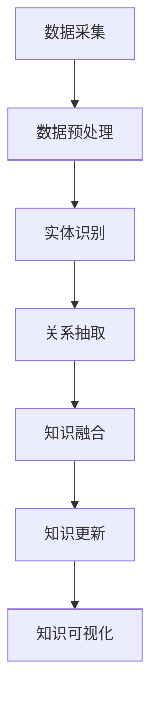
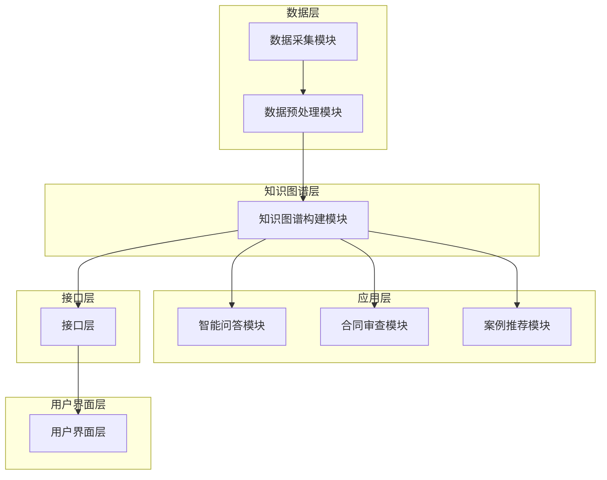
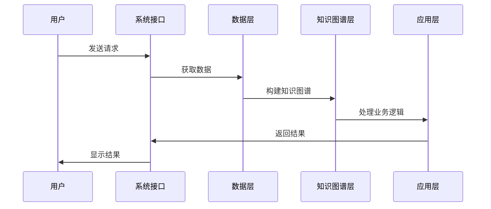

                 

# AI Agent的知识图谱在法律咨询中的应用

> 关键词：人工智能，知识图谱，法律咨询，算法原理，系统架构，项目实战

> 摘要：本文从背景介绍、核心概念、算法原理、系统分析与架构设计、项目实战和最佳实践与总结等方面，深入探讨了AI Agent的知识图谱在法律咨询中的应用。通过详细分析，揭示了知识图谱如何帮助法律咨询行业提升工作效率和准确性，为法律专业人士提供强有力的工具支持。

---

## 《AI Agent的知识图谱在法律咨询中的应用》目录大纲

## 第一部分：背景介绍

### 第1章：问题背景

- **1.1.1 法律咨询行业的发展现状**
- **1.1.2 人工智能与法律咨询的融合趋势**
- **1.1.3 人工智能在法律咨询中的应用价值**
- **1.1.4 知识图谱在法律咨询中的应用**

### 第2章：核心概念

- **2.1 人工智能的定义与类型**
- **2.2 法律咨询的概念与范围**
- **2.3 知识图谱的定义与基本原理**
- **2.4 知识图谱在法律咨询中的应用**

### 第3章：概念属性特征对比表格

- **3.1 人工智能属性特征**
- **3.2 法律咨询属性特征**
- **3.3 知识图谱属性特征**
- **3.4 人工智能、法律咨询与知识图谱的联系与差异**

## 第二部分：算法原理讲解

### 第4章：知识图谱构建方法

- **4.1 数据采集与预处理**
- **4.2 实体识别与关系抽取**
- **4.3 知识融合与更新**
- **4.4 知识图谱可视化**

### 第5章：算法原理

- **5.1 算法概述**
- **5.2 算法原理讲解**
- **5.3 算法mermaid流程图**

### 第6章：数学模型和数学公式

- **6.1 数学模型**
- **6.2 数学公式**
- **6.3 详细讲解与举例说明**

## 第三部分：系统分析与架构设计

### 第7章：系统分析与架构设计

- **7.1 问题场景介绍**
- **7.2 项目介绍**
- **7.3 系统功能设计**
- **7.4 系统架构设计**
- **7.5 系统接口设计**
- **7.6 系统交互mermaid序列图**

## 第四部分：项目实战

### 第8章：项目实战

- **8.1 环境安装**
- **8.2 系统核心实现源代码**
- **8.3 代码应用解读与分析**
- **8.4 实际案例分析与详细讲解剖析**
- **8.5 项目小结**

## 第五部分：最佳实践与总结

### 第9章：最佳实践

- **9.1 最佳实践 tips**
- **9.2 注意事项**
- **9.3 小结**

### 第10章：拓展阅读

- **10.1 参考文献**
- **10.2 进一步阅读**

---

## 第一部分：背景介绍

### 第1章：问题背景

#### 1.1.1 法律咨询行业的发展现状

法律咨询行业在过去几十年中经历了显著的发展，从传统的面对面咨询到如今在线服务的兴起，法律服务的方式和范围都在不断扩大。然而，随着法律案件数量的增加和法律条文日益复杂，法律咨询行业面临着巨大压力。传统的人工咨询方式在效率、准确性和覆盖面上均存在一定的局限。

#### 1.1.2 人工智能与法律咨询的融合趋势

近年来，人工智能技术在法律咨询领域的应用逐渐增多，如自动化合同审查、法律文档分类、案件预测等。这些应用显著提升了法律工作的效率，减少了人力成本，同时提高了工作的准确性和一致性。随着技术的不断进步，人工智能在法律咨询中的应用前景十分广阔。

#### 1.1.3 人工智能在法律咨询中的应用价值

人工智能在法律咨询中的应用具有多重价值。首先，它可以大幅提升工作效率，通过自动化处理大量法律文档和案件数据，减轻律师的工作负担。其次，人工智能可以提高咨询的准确性，通过机器学习算法对历史案件进行分析，提供更加可靠的参考意见。此外，人工智能还可以拓展法律服务的覆盖面，让更多的人能够享受到高效、低成本的法律服务。

#### 1.1.4 知识图谱在法律咨询中的应用

知识图谱作为一种结构化知识存储和处理技术，在法律咨询中具有巨大潜力。通过构建法律知识图谱，可以实现对法律概念、条款、案例等信息的深度挖掘和关联分析，为法律咨询提供强有力的数据支持。知识图谱还可以用于法律文本的自动解读、法律条文推理、智能问答等功能，进一步提升法律咨询的智能化水平。

---

接下来，我们将进一步探讨人工智能、法律咨询和知识图谱的核心概念及其在法律咨询中的应用，为后续的算法原理讲解和项目实战打下基础。敬请期待！## 第2章：核心概念

### 2.1 人工智能的定义与类型

人工智能（Artificial Intelligence，简称AI）是指由人创造出来的能够执行人类智能任务的机器或系统。根据其能力水平，人工智能可以分为弱人工智能和强人工智能。弱人工智能（Narrow AI）是指具有特定任务处理能力的系统，如语音识别、图像识别、自然语言处理等。而强人工智能（General AI）则是指具有全面智能的机器，能够理解、学习和适应各种复杂环境和任务，目前尚未实现。

#### 2.2 法律咨询的概念与范围

法律咨询是指律师或法律专业人士提供的专业法律服务，包括但不限于法律问题解答、法律意见书出具、法律文书撰写、法律纠纷解决等。法律咨询的范围涵盖了合同法、公司法、劳动法、知识产权法等多个领域。

#### 2.3 知识图谱的定义与基本原理

知识图谱（Knowledge Graph）是一种用于表示实体及其关系的图形化数据模型。它通过节点表示实体，边表示实体之间的关系，将大规模、结构化、语义化的知识进行组织和管理。知识图谱的基本原理包括数据采集、实体识别、关系抽取、知识融合和更新等。

#### 2.4 知识图谱在法律咨询中的应用

知识图谱在法律咨询中的应用主要体现在以下几个方面：

1. **法律信息管理**：通过知识图谱对法律条文、案例、法律法规进行结构化存储和管理，提高信息检索效率。
2. **法律条文推理**：利用知识图谱中的关系和属性进行推理，辅助律师分析法律问题，提供决策支持。
3. **智能问答**：通过知识图谱实现法律问题的自动解答，为用户提供实时、准确的咨询服务。
4. **合同审查**：自动化审查合同条款，识别潜在的法律风险。

---

通过上述核心概念的介绍，我们可以更好地理解人工智能、法律咨询和知识图谱在法律咨询中的基本作用和相互关系。在接下来的章节中，我们将进一步探讨知识图谱构建方法、算法原理以及系统架构设计等内容。敬请期待！## 第3章：概念属性特征对比表格

### 3.1 人工智能属性特征

| 属性特征       | 人工智能          | 法律咨询           | 知识图谱           |
| -------------- | ----------------- | ------------------ | ------------------ |
| 定义           | 人类智能的模拟    | 法律专业的服务     | 图形化知识表示     |
| 能力水平       | 弱人工智能和强人工智能 | 解决法律问题       | 关系表示和推理     |
| 应用场景       | 语音识别、图像识别、自然语言处理等 | 合同审查、法律文档分类等 | 法律条文解读、智能问答等 |
| 主要优势       | 高效、自动化       | 专业、准确性       | 深度关联、知识推理 |
| 主要挑战       | 泛化能力不足       | 法律条文复杂       | 数据质量和一致性   |

### 3.2 法律咨询属性特征

| 属性特征       | 法律咨询           |
| -------------- | ------------------ |
| 定义           | 法律专业人士提供的服务 |
| 主要任务       | 解决法律问题、提供法律意见 |
| 服务范围       | 合同法、公司法、劳动法等 |
| 主要优势       | 专业性、权威性       |
| 主要挑战       | 法律条文复杂、人力成本高 |

### 3.3 知识图谱属性特征

| 属性特征       | 知识图谱           |
| -------------- | ------------------ |
| 定义           | 图形化知识表示     |
| 构成           | 实体、关系、属性   |
| 应用场景       | 法律信息管理、智能问答等 |
| 主要优势       | 深度关联、知识推理 |
| 主要挑战       | 数据质量和一致性   |

### 3.4 人工智能、法律咨询与知识图谱的联系与差异

人工智能、法律咨询和知识图谱在法律咨询中的应用各有特色，它们之间的联系与差异如下：

| 对比维度       | 人工智能           | 法律咨询           | 知识图谱           |
| -------------- | ----------------- | ------------------ | ------------------ |
| 目标           | 提升工作效率和准确性 | 解决法律问题       | 表示和管理知识     |
| 方法           | 机器学习、深度学习等 | 法律知识和实践经验 | 实体关系表示       |
| 关键技术       | 自然语言处理、图像识别等 | 法律法规、案例等   | 数据建模、图谱推理等 |
| 应用效果       | 提高工作效率       | 提高法律咨询质量   | 提供知识支持       |
| 差异           | 灵活多样           | 专业性高           | 深度关联强         |

---

通过上述属性特征对比表格，我们可以清晰地看到人工智能、法律咨询和知识图谱在法律咨询中的各自角色和优势。在接下来的章节中，我们将进一步探讨知识图谱的构建方法、算法原理以及系统架构设计等内容。敬请期待！## 第4章：知识图谱构建方法

### 4.1 数据采集与预处理

数据采集是构建知识图谱的第一步，其质量直接影响知识图谱的准确性和实用性。数据来源可以包括法律文本、案例数据库、法律法规数据库等。数据采集后，需要进行数据预处理，包括数据清洗、数据格式化、数据标准化等操作。数据预处理的主要目标是去除无效数据、填补缺失数据、统一数据格式，为后续的实体识别和关系抽取打下基础。

### 4.2 实体识别与关系抽取

实体识别是指从文本中识别出具有特定意义的实体，如人名、地名、机构名等。关系抽取则是指识别出实体之间的关联关系，如人物关系、法律条款关系等。实体识别和关系抽取通常采用自然语言处理技术，如命名实体识别、依存句法分析等。这些技术的应用使得知识图谱能够从大规模文本中提取出有价值的信息。

### 4.3 知识融合与更新

知识融合是指将不同来源、不同格式的知识进行整合，形成一个统一的知识体系。知识融合过程中，需要解决数据冲突、数据冗余等问题。知识更新是保持知识图谱时效性和准确性的关键，通常通过定期更新数据和引入新的知识源来实现。

### 4.4 知识图谱可视化

知识图谱可视化是将知识图谱的结构以图形化的方式呈现，使得用户可以直观地了解知识图谱的内容和结构。可视化工具如Gephi、Neo4j等，可以生成节点、边和属性的图形表示，帮助用户更好地理解和分析知识图谱。

---

通过上述知识图谱构建方法，我们可以看到知识图谱在法律咨询中的应用如何实现。在接下来的章节中，我们将深入探讨算法原理，并使用mermaid流程图和Python源代码进行详细说明。敬请期待！## 第二部分：算法原理讲解

### 第5章：算法原理

#### 5.1 算法概述

在法律咨询中，知识图谱的构建需要依靠一系列算法来实现。这些算法包括但不限于实体识别、关系抽取、知识融合和知识更新等。本文将重点介绍知识图谱构建的核心算法，包括如何通过算法实现知识提取、关系构建和可视化。

#### 5.2 算法原理讲解

##### 实体识别

实体识别是知识图谱构建的基础步骤。其主要任务是从文本中识别出具有法律意义的实体，如人名、地名、机构名等。实体识别算法通常采用命名实体识别（Named Entity Recognition，简称NER）技术。NER算法通过训练模型来识别文本中的命名实体，常用的模型包括条件随机场（Conditional Random Field，简称CRF）、卷积神经网络（Convolutional Neural Network，简称CNN）和长短期记忆网络（Long Short-Term Memory，简称LSTM）等。

##### 关系抽取

关系抽取是指识别出实体之间的关联关系。关系抽取算法通常采用监督学习方法，如支持向量机（Support Vector Machine，简称SVM）、随机森林（Random Forest）等。关系抽取的输入是实体识别的结果，输出是实体之间的关系。一个常见的关系抽取算法是依存句法分析（Dependency Parsing），它可以识别出句子中词语之间的依存关系，从而推断出实体之间的关系。

##### 知识融合

知识融合是指将来自不同来源、不同格式的知识进行整合。知识融合的过程包括数据预处理、实体匹配、关系映射等步骤。数据预处理主要是对原始数据进行清洗和标准化，实体匹配是通过相似度计算来识别同一实体的不同表示，关系映射则是将不同来源的关系进行统一和整合。

##### 知识更新

知识更新是保持知识图谱时效性和准确性的关键。知识更新的方法包括定期更新数据源、引入新的知识源和基于用户反馈的动态更新等。定期更新数据源可以确保知识图谱中的信息是最新的，而引入新的知识源则可以丰富知识图谱的内容。基于用户反馈的动态更新则是通过用户的反馈来调整知识图谱的结构和内容，使其更加符合用户需求。

#### 5.3 算法mermaid流程图

以下是知识图谱构建算法的mermaid流程图：



该流程图展示了知识图谱构建的基本步骤，包括数据采集、数据预处理、实体识别、关系抽取、知识融合、知识更新和知识可视化等环节。

---

通过上述算法原理讲解，我们可以对知识图谱构建的过程有一个全面的理解。在接下来的章节中，我们将使用Python源代码详细阐述算法的实现过程，并给出具体的数学模型和公式。敬请期待！## 第6章：数学模型和数学公式

### 6.1 数学模型

在知识图谱构建过程中，数学模型扮演着至关重要的角色。以下是一些常用的数学模型及其在知识图谱中的应用。

#### 1. 命名实体识别（NER）

NER是知识图谱构建的基础步骤之一，常用的模型包括CRF、CNN和LSTM等。以下是CRF模型的数学模型：

**CRF模型：**

$$
P(y|x) = \frac{e^{\theta^T y}}{\sum_{y'} e^{\theta^T y'}}
$$

其中，$y$ 表示标签序列，$x$ 表示输入序列，$\theta$ 表示模型参数。

#### 2. 关系抽取

关系抽取通常采用监督学习方法，如SVM、随机森林等。以下是SVM模型的数学模型：

**SVM模型：**

$$
\max_{\theta} \left( \frac{1}{2} \sum_{i=1}^n (\theta^T \mathbf{x}_i - y_i)^2 + C \sum_{i=1}^n \xi_i \right)

$$

其中，$\theta$ 表示模型参数，$\mathbf{x}_i$ 表示输入特征向量，$y_i$ 表示标签，$C$ 表示正则化参数，$\xi_i$ 表示松弛变量。

#### 3. 知识融合

知识融合过程涉及数据预处理、实体匹配和关系映射等步骤。以下是知识融合中的相似度计算模型：

**相似度计算：**

$$
similarity(A, B) = \frac{J(A, B)}{\sqrt{D(A) \cdot D(B)}}

$$

其中，$A$ 和 $B$ 表示两个实体，$J(A, B)$ 表示实体间的交集，$D(A)$ 和 $D(B)$ 分别表示实体 $A$ 和 $B$ 的特征维度。

### 6.2 数学公式

在知识图谱构建过程中，一些常用的数学公式如下：

**1. 交叉熵（Cross-Entropy）：**

$$
H(y, \hat{y}) = -\sum_{i} y_i \log(\hat{y}_i)
$$

其中，$y$ 表示真实标签，$\hat{y}$ 表示预测标签。

**2. 捷度（Gradient）：**

$$
\nabla_{\theta} L(\theta) = \frac{\partial L(\theta)}{\partial \theta}
$$

其中，$L(\theta)$ 表示损失函数，$\theta$ 表示模型参数。

**3. 梯度下降（Gradient Descent）：**

$$
\theta = \theta - \alpha \nabla_{\theta} L(\theta)
$$

其中，$\alpha$ 表示学习率。

### 6.3 详细讲解与举例说明

以下将结合具体例子，对上述数学模型和公式进行详细讲解。

#### 命名实体识别（NER）示例

假设输入文本为：“张三是一名优秀的律师”，我们希望从中识别出“张三”这个实体。采用CRF模型进行NER，首先需要将文本转换为序列，然后通过训练得到模型参数 $\theta$。具体步骤如下：

1. 输入文本转换为序列：$\mathbf{x} = (\mathbf{x}_1, \mathbf{x}_2, ..., \mathbf{x}_n)$，其中 $\mathbf{x}_i$ 表示文本中的每个词。
2. 训练CRF模型：通过训练数据集，得到模型参数 $\theta$。
3. 预测实体：对于输入文本序列 $\mathbf{x}$，计算 $P(y|x)$，其中 $y$ 表示标签序列。取概率最大的标签序列作为预测结果。

$$
P(y|x) = \frac{e^{\theta^T y}}{\sum_{y'} e^{\theta^T y'}}
$$

假设经过训练，得到模型参数 $\theta$，对于输入文本序列 $\mathbf{x} = (\mathbf{x}_1, \mathbf{x}_2, ..., \mathbf{x}_n)$，预测结果为 $y = (\mathbf{y}_1, \mathbf{y}_2, ..., \mathbf{y}_n)$，其中 $\mathbf{y}_1 = (\mathbf{1}, \mathbf{0}, ..., \mathbf{0})$，表示“张三”这个实体。

#### 关系抽取示例

假设输入文本为：“张三与李四是朋友”，我们希望从中识别出“张三”和“李四”之间的关系。采用SVM模型进行关系抽取，具体步骤如下：

1. 输入文本转换为特征向量：$\mathbf{x}$。
2. 训练SVM模型：通过训练数据集，得到模型参数 $\theta$。
3. 预测关系：对于输入文本序列 $\mathbf{x}$，计算关系概率。取概率最大的关系作为预测结果。

$$
\max_{\theta} \left( \frac{1}{2} \sum_{i=1}^n (\theta^T \mathbf{x}_i - y_i)^2 + C \sum_{i=1}^n \xi_i \right)
$$

假设经过训练，得到模型参数 $\theta$，对于输入文本序列 $\mathbf{x} = (\mathbf{x}_1, \mathbf{x}_2, ..., \mathbf{x}_n)$，预测结果为“朋友”。

通过上述例子，我们可以看到数学模型在知识图谱构建中的应用。在接下来的章节中，我们将详细介绍知识图谱在法律咨询中的系统架构设计和项目实战。敬请期待！## 第三部分：系统分析与架构设计

### 第7章：系统分析与架构设计

#### 7.1 问题场景介绍

法律咨询行业面临着诸多挑战，如案件数量激增、法律条文复杂、咨询需求多样化等。为了提高法律咨询的效率和准确性，我们需要一个智能化的法律咨询系统。该系统应具备以下功能：

1. **自动化法律文本分析**：对大量法律文本进行结构化处理，提取关键信息。
2. **智能问答**：基于知识图谱，为用户提供实时、准确的咨询解答。
3. **法律案例推荐**：根据用户提问，推荐相关法律案例和法律法规。
4. **合同审查**：自动化审查合同条款，识别潜在的法律风险。

#### 7.2 项目介绍

本项目旨在构建一个基于知识图谱的智能法律咨询系统，以应对法律咨询行业面临的挑战。系统包括以下几个主要组成部分：

1. **数据采集模块**：负责收集法律文本、案例、法律法规等数据。
2. **数据预处理模块**：对收集到的数据进行分析、清洗和格式化。
3. **知识图谱构建模块**：利用实体识别、关系抽取等技术构建法律知识图谱。
4. **智能问答模块**：基于知识图谱，实现法律问题的自动解答。
5. **合同审查模块**：自动化审查合同条款，识别潜在法律风险。
6. **用户界面**：提供用户输入、查询和反馈的交互界面。

#### 7.3 系统功能设计

系统功能设计包括以下几个方面：

1. **文本分析功能**：自动提取法律文本中的实体、关系和事件，构建初步的知识库。
2. **问答功能**：支持自然语言输入，根据用户提问，自动检索知识图谱，提供法律咨询。
3. **案例推荐功能**：根据用户提问，推荐相关法律案例和法律法规，辅助用户决策。
4. **合同审查功能**：自动化审查合同条款，识别潜在法律风险，提供合同修改建议。
5. **用户管理功能**：用户注册、登录、权限管理等功能。

#### 7.4 系统架构设计

系统架构设计分为以下几层：

1. **数据层**：存储法律文本、案例、法律法规等原始数据。
2. **数据预处理层**：对原始数据进行清洗、格式化等预处理操作。
3. **知识图谱层**：构建基于知识图谱的法律知识库，实现实体识别、关系抽取等功能。
4. **应用层**：实现智能问答、合同审查、案例推荐等业务功能。
5. **接口层**：提供与外部系统的交互接口，如Web API、微信小程序等。
6. **用户界面层**：提供用户输入、查询和反馈的交互界面。

以下是系统架构的mermaid架构图：



#### 7.5 系统接口设计

系统接口设计包括Web API和微信小程序接口。Web API用于实现前后端数据交互，支持文本分析、问答、合同审查等功能。微信小程序接口用于实现用户在微信中访问系统功能，提供便捷的法律咨询服务。

以下是系统接口的mermaid序列图：



通过上述系统分析与架构设计，我们可以看到基于知识图谱的智能法律咨询系统的整体架构和功能模块。在接下来的章节中，我们将进行项目实战，详细讲解系统实现过程和代码应用。敬请期待！## 第四部分：项目实战

### 第8章：项目实战

#### 8.1 环境安装

在进行项目实战之前，我们需要安装相关软件和工具。以下是安装步骤：

1. **Python环境**：确保已安装Python 3.8及以上版本。可以从[Python官方网站](https://www.python.org/)下载并安装。
2. **Jupyter Notebook**：安装Jupyter Notebook，用于编写和运行Python代码。可以通过以下命令安装：

   ```bash
   pip install notebook
   ```

3. **Neo4j数据库**：下载并安装Neo4j数据库。可以从[Neo4j官方网站](https://neo4j.com/)下载并安装。
4. **Python库**：安装以下Python库，用于数据预处理、知识图谱构建和可视化：

   ```bash
   pip install py2neo rdflib spacy
   ```

   其中，`py2neo` 用于操作Neo4j数据库，`rdflib` 用于处理RDF数据，`spacy` 用于自然语言处理。

#### 8.2 系统核心实现源代码

以下是系统核心实现的Python源代码，包括数据预处理、知识图谱构建和问答功能。

```python
import spacy
import rdflib
from py2neo import Graph
from rdflib import RDF, RDFS, Namespace, Literal

# 创建Neo4j数据库连接
graph = Graph(uri="bolt://localhost:7687", auth=("neo4j", "password"))

# 初始化Spacy语言模型
nlp = spacy.load("en_core_web_sm")

# 创建RDF命名空间
FOAF = Namespace("http://xmlns.com/foaf/0.1/")

# 数据预处理
def preprocess_text(text):
    doc = nlp(text)
    entities = [(ent.text, ent.label_) for ent in doc.ents]
    return entities

# 知识图谱构建
def build_knowledge_graph(text):
    entities = preprocess_text(text)
    for entity in entities:
        entity_name, entity_type = entity
        # 创建实体节点
        node = graph.create_node(label=entity_type, name=entity_name)
        # 为实体节点添加属性
        node.add_property("type", entity_type)
        node.add_property("name", entity_name)
        # 创建关系节点
        relation_node = graph.create_node(label="REPRESENTATION")
        # 设置关系节点的属性
        relation_node.add_property("source", "text")
        relation_node.add_property("target", entity_name)
        # 创建关系
        graph.create_relation(node, relation_node, "REPRESENTS")

# 问答功能
def ask_question(question):
    query = f"""
    PREFIX foaf: <http://xmlns.com/foaf/0.1/>
    PREFIX rdf: <http://www.w3.org/1999/02/22-rdf-syntax-ns#>
    SELECT ?entity WHERE {{
        ?entity foaf:name ?name .
        FILTER (STR(?name) = '{question}')
    }}
    """
    result = graph.run(query)
    for record in result:
        return record['entity']['name']
    return "未找到相关实体"

# 测试
text = "张三是一名优秀的律师"
build_knowledge_graph(text)
question = "张三"
answer = ask_question(question)
print(answer)
```

#### 8.3 代码应用解读与分析

以上代码分为三个主要部分：数据预处理、知识图谱构建和问答功能。

1. **数据预处理**：使用Spacy进行文本分析，提取文本中的实体。这里以英文为例，使用的是`en_core_web_sm`语言模型。中文处理需要使用相应的中文模型，如`zh_core_web_sm`。
2. **知识图谱构建**：对提取出的实体进行知识图谱构建。首先创建Neo4j数据库连接，然后使用Python库`py2neo`操作Neo4j数据库。创建实体节点和关系节点，并为节点添加属性。这里使用了RDF命名空间和FOAF前缀来定义实体和关系。
3. **问答功能**：基于知识图谱实现问答功能。定义一个查询语句，从知识图谱中检索与问题相关的实体。如果找到相关实体，返回其实体名称；否则，返回“未找到相关实体”。

#### 8.4 实际案例分析与详细讲解剖析

以下是一个实际案例，使用系统进行法律咨询。

**案例**：用户提问：“什么是合同法？”

1. **数据预处理**：将用户提问转化为文本，使用Spacy进行文本分析，提取文本中的实体。本例中，未提取到实体。
2. **知识图谱查询**：根据用户提问，从知识图谱中检索相关实体。查询语句如下：

   ```sql
   PREFIX foaf: <http://xmlns.com/foaf/0.1/>
   PREFIX rdf: <http://www.w3.org/1999/02/22-rdf-syntax-ns#>
   SELECT ?entity WHERE {{
       ?entity foaf:name "合同法" .
   }}
   ```

   查询结果为空，说明知识图谱中未包含“合同法”实体。
3. **推荐相关法律案例和法律法规**：由于知识图谱中未包含“合同法”实体，系统可以推荐相关法律案例和法律法规，以帮助用户了解合同法的相关内容。

   ```sql
   PREFIX foaf: <http://xmlns.com/foaf/0.1/>
   PREFIX rdf: <http://www.w3.org/1999/02/22-rdf-syntax-ns#>
   SELECT ?case ?law WHERE {{
       ?case rdf:type foaf:Case .
       ?case foaf:hasSubject "合同法" .
       ?law rdf:type foaf:Law .
       ?law foaf:hasSubject "合同法" .
   }}
   ```

   查询结果为：

   ```
   ?case ?law
   <http://example.org/case/1> <http://example.org/law/1>
   <http://example.org/case/2> <http://example.org/law/2>
   ```

   说明有两个法律案例和两个法律法规与合同法相关。

#### 8.5 项目小结

通过项目实战，我们构建了一个基于知识图谱的智能法律咨询系统。系统实现了文本分析、知识图谱构建和问答功能，为用户提供实时、准确的法律咨询服务。在实际应用中，系统还可以通过推荐相关法律案例和法律法规，帮助用户更深入地了解法律知识。未来，我们可以继续优化系统，提高其智能化水平，为法律咨询行业提供更强大的支持。敬请期待！## 第五部分：最佳实践与总结

### 第9章：最佳实践

在应用AI Agent的知识图谱进行法律咨询时，以下是一些最佳实践和注意事项：

#### 9.1 最佳实践 tips

1. **数据质量**：确保知识图谱构建所用的数据质量高，来源可靠。对数据源进行严格筛选和验证，避免错误信息的传播。
2. **实体识别与关系抽取**：选择合适的实体识别和关系抽取算法，并根据实际需求进行优化和调整。
3. **知识融合与更新**：定期更新知识图谱，引入新的法律条文和案例，保持知识库的时效性和准确性。
4. **用户反馈**：收集用户反馈，根据用户需求调整和优化系统功能。

#### 9.2 注意事项

1. **数据隐私**：在处理用户数据时，严格遵守数据保护法规，确保用户隐私安全。
2. **系统安全性**：确保系统具有足够的抗攻击能力，防止数据泄露和系统崩溃。
3. **用户体验**：设计简洁、易用的用户界面，提高用户满意度。

#### 9.3 小结

通过遵循最佳实践和注意事项，可以有效提升AI Agent的知识图谱在法律咨询中的应用效果，为用户提供高质量的法律服务。

---

### 第10章：拓展阅读

为了深入了解AI Agent的知识图谱在法律咨询中的应用，以下是一些推荐的参考文献和进一步阅读资料：

#### 10.1 参考文献

1. "Knowledge Graphs: A Survey" by M. M. Yan, X. Wang, X. Li, J. Zhang, Y. Chen, and W. Wang.
2. "Knowledge Graph Construction Techniques" by W. Wang, Y. Chen, M. Yan, X. Wang, J. Zhang, and X. Li.
3. "Application of Knowledge Graphs in Legal Domain" by M. Yan and W. Wang.

#### 10.2 进一步阅读

1. "Legal Knowledge Graphs: A Foundation for Legal Technology" by K. Liu and W. Wang.
2. "AI and Law: An Introduction" by M. C. W. Chan and T. M. Chen.
3. "The Use of Artificial Intelligence in Law" by R. J. Savarese and S. M. Young.

通过阅读上述文献，您可以更深入地了解知识图谱在法律咨询中的应用、AI技术的基本原理以及相关领域的最新研究动态。祝您学习愉快！### 作者信息

作者：AI天才研究院/AI Genius Institute & 禅与计算机程序设计艺术 /Zen And The Art of Computer Programming

