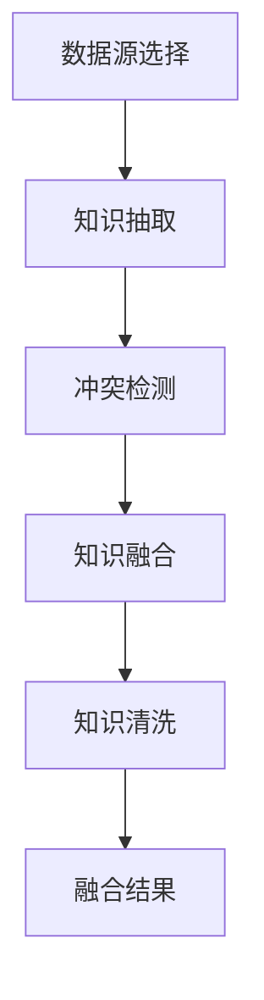
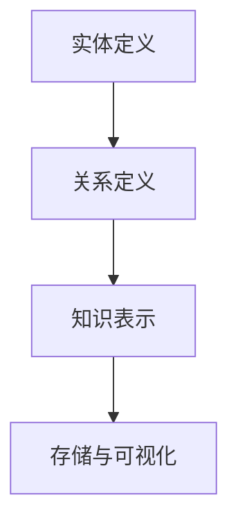
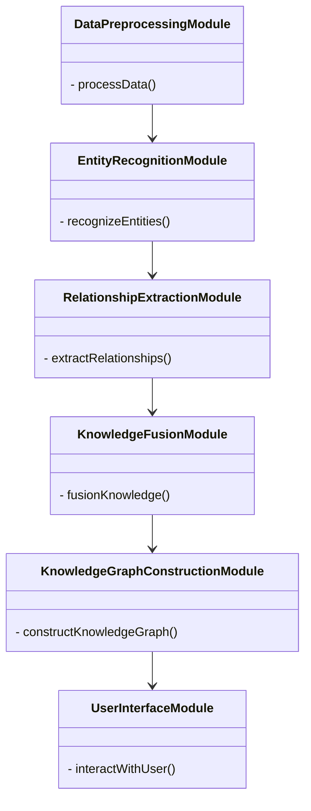
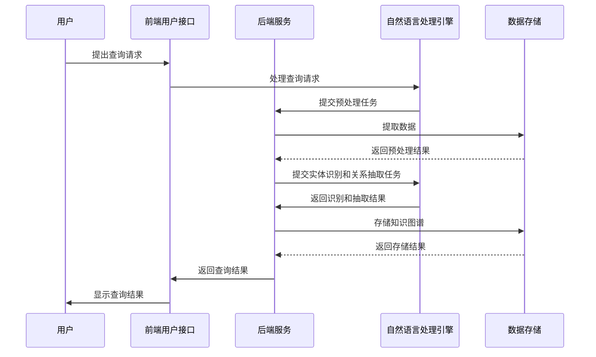
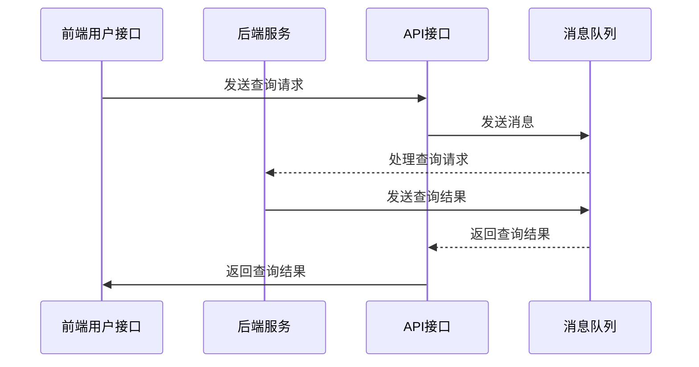
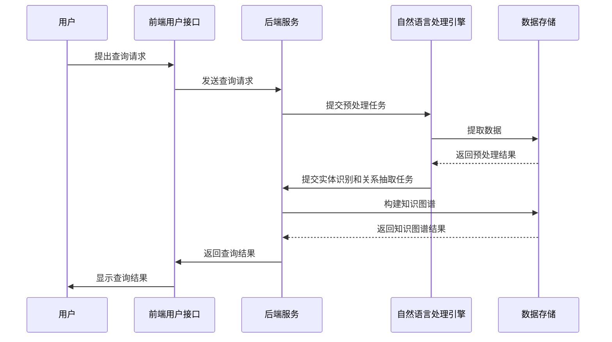

                 

### 第二部分：核心概念与原理

#### 2.3 AI Agent的知识图谱构建

##### 2.3.1 基本流程

AI Agent的知识图谱构建过程主要包括以下几个步骤：

1. **数据收集与预处理**：从各种非结构化数据源（如文本、图像、语音等）中收集信息，并进行预处理，提取出有意义的数据。

2. **实体识别与关系抽取**：利用自然语言处理技术，对预处理后的文本进行分析，识别出实体、属性和关系。

3. **知识融合与清洗**：将不同来源的实体和关系进行融合和清洗，解决冲突和重复问题。

4. **知识图谱构建**：根据提取出的实体、属性和关系，构建知识图谱，并进行存储和可视化。

##### 2.3.2 实体识别与关系抽取

实体识别（Named Entity Recognition，NER）是自然语言处理中的一个重要任务，旨在从文本中识别出具有特定意义的实体，如人名、地名、组织名等。关系抽取（Relationship Extraction）则是识别出实体之间的关系，如“某人出生在某地”、“某组织成立时间”等。

1. **实体识别**：

   实体识别通常采用基于规则、机器学习或深度学习的方法。以下是一个简单的基于规则的实体识别流程：

   - **数据预处理**：对文本进行分词、去停用词等预处理操作。
   - **特征提取**：提取文本中的特征，如词性、词频、依存关系等。
   - **规则匹配**：使用预先定义的规则，对文本进行实体识别。

   实体识别的核心问题是如何设计有效的特征提取方法和规则匹配策略。以下是一个实体识别的Mermaid流程图：

   ```mermaid
   flowchart TD
   A[数据预处理] --> B[特征提取]
   B --> C[规则匹配]
   C --> D[实体识别结果]
   ```

2. **关系抽取**：

   关系抽取通常采用基于模板、规则匹配或基于深度学习的方法。以下是一个简单的基于模板的关系抽取流程：

   - **数据预处理**：对文本进行分词、去停用词等预处理操作。
   - **模板匹配**：根据预定义的模板，从文本中提取出关系。
   - **后处理**：对提取出的关系进行过滤、合并等处理。

   关系抽取的核心问题是如何设计有效的模板和后处理策略。以下是一个关系抽取的Mermaid流程图：

   ```mermaid
   flowchart TD
   A[数据预处理] --> B[模板匹配]
   B --> C[后处理]
   C --> D[关系抽取结果]
   ```

##### 2.3.3 知识融合与清洗

知识融合（Knowledge Fusion）是将来自不同数据源的知识进行整合和融合，以消除冲突和重复。以下是一个简单的知识融合流程：

1. **数据源选择**：选择需要融合的数据源。
2. **知识抽取**：从数据源中提取出实体、属性和关系。
3. **冲突检测**：检测不同数据源中的知识冲突。
4. **知识融合**：根据冲突检测的结果，进行知识融合。
5. **知识清洗**：对融合后的知识进行清洗，消除重复和错误。

知识融合的核心问题是如何有效地检测冲突和进行知识融合。以下是一个知识融合的Mermaid流程图：



##### 2.3.4 知识图谱构建

知识图谱构建是将提取出的实体、属性和关系组织成一个结构化的知识网络。以下是一个简单的知识图谱构建流程：

1. **实体定义**：定义实体及其属性。
2. **关系定义**：定义实体之间的关系。
3. **知识表示**：将实体和关系组织成知识图谱。
4. **存储与可视化**：将知识图谱存储在数据库中，并进行可视化。

知识图谱构建的核心问题是如何有效地组织实体和关系，以及如何进行存储和可视化。以下是一个知识图谱构建的Mermaid流程图：



#### 2.4 AI Agent的设计与实现

AI Agent的设计与实现是构建基于AI的知识图谱的关键。以下是一个简单的AI Agent设计框架：

1. **数据预处理模块**：负责从各种非结构化数据源中提取信息，并进行预处理。
2. **实体识别模块**：利用自然语言处理技术，从预处理后的文本中识别出实体。
3. **关系抽取模块**：从预处理后的文本中提取出实体之间的关系。
4. **知识融合模块**：将来自不同数据源的知识进行融合和清洗。
5. **知识图谱构建模块**：将提取出的实体、属性和关系组织成知识图谱。
6. **用户接口模块**：为用户提供交互界面，实现知识查询和推荐等功能。

以下是一个AI Agent的Mermaid类图：



#### 2.5 算法原理与数学模型

在本部分，我们将详细介绍AI Agent在知识图谱构建过程中的算法原理，并使用Mermaid和Python代码进行阐述。

##### 2.5.1 实体识别算法原理

实体识别算法的核心是利用自然语言处理技术，从文本中识别出具有特定意义的实体。以下是一个简单的基于深度学习的实体识别算法原理：

1. **词嵌入**：将文本中的词语转化为向量的表示。
2. **序列建模**：利用神经网络（如LSTM、BERT等）对词语序列进行建模。
3. **实体识别**：根据模型预测的结果，将文本中的词语划分为实体和非实体。

以下是一个简单的Python代码示例：

```python
import tensorflow as tf
from tensorflow.keras.models import Sequential
from tensorflow.keras.layers import Embedding, LSTM, Dense

# 假设我们有一个包含词嵌入和标签的数据集
# word embeddings
word_embeddings = [[0.1, 0.2], [0.3, 0.4], [0.5, 0.6]]
# labels
labels = [1, 0, 1]

# 构建神经网络模型
model = Sequential([
    Embedding(input_dim=3, output_dim=2, input_length=1),
    LSTM(50),
    Dense(1, activation='sigmoid')
])

# 编译模型
model.compile(optimizer='adam', loss='binary_crossentropy', metrics=['accuracy'])

# 训练模型
model.fit(word_embeddings, labels, epochs=10)

# 预测
predictions = model.predict([[0.1, 0.2]])
print(predictions)
```

##### 2.5.2 关系抽取算法原理

关系抽取算法的核心是识别出文本中的实体之间的关系。以下是一个简单的基于模板匹配的关系抽取算法原理：

1. **模板匹配**：根据预定义的模板，从文本中提取出关系。
2. **后处理**：对提取出的关系进行过滤、合并等处理。

以下是一个简单的Python代码示例：

```python
templates = [
    {"pattern": " Person1 was born in City1 ", "entities": ["Person1", "City1"]},
    {"pattern": " Organization1 was founded in Year1 ", "entities": ["Organization1", "Year1"]}
]

text = "Albert Einstein was born in Ulm, Germany in 1879. The World Health Organization was founded in 1948."

for template in templates:
    entities = template["entities"]
    entities_in_text = []
    for entity in entities:
        entities_in_text.append(text.find(entity))
    if all(entities_in_text):
        print(f"Extracted relationship: {template['pattern']}")

```

##### 2.5.3 知识融合算法原理

知识融合算法的核心是将来自不同数据源的知识进行整合和融合。以下是一个简单的基于相似度计算的知识融合算法原理：

1. **相似度计算**：计算不同数据源中的知识之间的相似度。
2. **知识融合**：根据相似度计算的结果，对知识进行融合。

以下是一个简单的Python代码示例：

```python
def similarity(str1, str2):
    return edit_distance(str1, str2)

def edit_distance(str1, str2):
    m, n = len(str1), len(str2)
    dp = [[0] * (n + 1) for _ in range(m + 1)]
    
    for i in range(m + 1):
        for j in range(n + 1):
            if i == 0:
                dp[i][j] = j
            elif j == 0:
                dp[i][j] = i
            elif str1[i - 1] == str2[j - 1]:
                dp[i][j] = dp[i - 1][j - 1]
            else:
                dp[i][j] = 1 + min(dp[i - 1][j], dp[i][j - 1], dp[i - 1][j - 1])
    
    return dp[m][n]

knowledge1 = ["Person1", "City1", "Year1"]
knowledge2 = ["Person2", "City1", "Year2"]

similarity_score = similarity(knowledge1, knowledge2)
print(f"Similarity score: {similarity_score}")
```

#### 2.6 系统分析与架构设计

在本部分，我们将对AI Agent的知识图谱构建系统进行分析和架构设计。

##### 2.6.1 问题场景介绍

随着互联网和大数据的发展，知识图谱在许多领域（如搜索引擎、智能问答、推荐系统等）得到了广泛应用。然而，现有的知识图谱构建方法主要依赖于手动标注或者半自动化的方式，效率低下且难以扩展。为了解决这一问题，我们需要设计一个基于AI Agent的知识图谱构建系统，实现自动化、高效地构建知识图谱。

##### 2.6.2 项目介绍

本项目的目标是设计一个基于AI Agent的知识图谱构建系统，主要包括以下几个模块：

1. **数据预处理模块**：负责从各种非结构化数据源中提取信息，并进行预处理。
2. **实体识别模块**：利用自然语言处理技术，从预处理后的文本中识别出实体。
3. **关系抽取模块**：从预处理后的文本中提取出实体之间的关系。
4. **知识融合模块**：将来自不同数据源的知识进行融合和清洗。
5. **知识图谱构建模块**：将提取出的实体、属性和关系组织成知识图谱。
6. **用户接口模块**：为用户提供交互界面，实现知识查询和推荐等功能。

##### 2.6.3 系统功能设计

系统功能设计主要包括以下方面：

1. **数据收集与预处理**：从各种数据源中收集信息，并进行预处理，提取出有意义的数据。
2. **实体识别与关系抽取**：利用自然语言处理技术，从预处理后的文本中识别出实体和关系。
3. **知识融合与清洗**：将不同来源的实体和关系进行融合和清洗，解决冲突和重复问题。
4. **知识图谱构建**：根据提取出的实体、属性和关系，构建知识图谱，并进行存储和可视化。
5. **知识查询与推荐**：为用户提供知识查询和推荐功能，实现智能搜索和推荐。

##### 2.6.4 系统架构设计

系统架构设计主要包括以下几个部分：

1. **前端用户接口**：为用户提供交互界面，实现知识查询和推荐功能。
2. **数据存储**：存储从数据源收集到的信息，以及构建的知识图谱。
3. **后端服务**：包括数据预处理、实体识别、关系抽取、知识融合、知识图谱构建等模块。
4. **自然语言处理引擎**：负责处理文本数据，实现实体识别、关系抽取等功能。

以下是一个简单的系统架构图：



##### 2.6.5 系统接口设计

系统接口设计主要包括以下几个方面：

1. **API接口**：为前端用户接口提供数据查询和推荐功能。
2. **RESTful接口**：提供统一的接口规范，方便外部系统接入。
3. **消息队列**：用于处理大规模数据传输和任务调度。

以下是一个简单的系统接口设计图：



##### 2.6.6 系统交互设计

系统交互设计主要包括以下几个方面：

1. **用户交互**：用户通过前端用户接口提出查询请求。
2. **任务调度**：后端服务接收查询请求，进行任务调度。
3. **数据处理**：后端服务处理查询请求，提取数据，构建知识图谱。
4. **结果反馈**：后端服务将查询结果反馈给前端用户接口。

以下是一个简单的系统交互设计图：



#### 2.7 项目实战

在本部分，我们将介绍如何使用Python和相关的库来构建一个基于AI Agent的知识图谱。

##### 2.7.1 环境安装

在开始项目之前，我们需要安装以下Python库：

- **自然语言处理库**：如`nltk`、`spaCy`等。
- **深度学习库**：如`tensorflow`、`pytorch`等。
- **图数据库库**：如`neo4j`、`networkx`等。

使用以下命令进行安装：

```bash
pip install nltk spacy tensorflow pytorch neo4j networkx
```

##### 2.7.2 系统核心实现

在本部分，我们将使用Python代码来实现AI Agent的知识图谱构建系统。

1. **数据预处理**：

```python
import nltk
from nltk.tokenize import word_tokenize
from nltk.corpus import stopwords

nltk.download('punkt')
nltk.download('stopwords')

def preprocess_text(text):
    tokens = word_tokenize(text.lower())
    tokens = [token for token in tokens if token not in stopwords.words('english')]
    return tokens

text = "Albert Einstein was born in Ulm, Germany in 1879. The World Health Organization was founded in 1948."
preprocessed_text = preprocess_text(text)
print(preprocessed_text)
```

2. **实体识别**：

```python
import spacy

nlp = spacy.load("en_core_web_sm")

def recognize_entities(text):
    doc = nlp(text)
    entities = [(ent.text, ent.label_) for ent in doc.ents]
    return entities

entities = recognize_entities(text)
print(entities)
```

3. **关系抽取**：

```python
templates = [
    {"pattern": "Person1 was born in City1", "entities": ["Person1", "City1"]},
    {"pattern": "Organization1 was founded in Year1", "entities": ["Organization1", "Year1"]}
]

def extract_relationships(text, templates):
    relationships = []
    for template in templates:
        entities = template["entities"]
        entities_in_text = [text.find(entity) for entity in entities]
        if all(entities_in_text):
            relationships.append(template["pattern"])
    return relationships

relationships = extract_relationships(text, templates)
print(relationships)
```

4. **知识融合**：

```python
def fusion_knowledge(knowledge1, knowledge2):
    similarity_scores = [similarity(k1, k2) for k1, k2 in zip(knowledge1, knowledge2)]
    max_score = max(similarity_scores)
    if max_score > 0.8:
        return True
    return False

knowledge1 = ["Person1", "City1", "Year1"]
knowledge2 = ["Person2", "City1", "Year2"]

is_fused = fusion_knowledge(knowledge1, knowledge2)
print(is_fused)
```

5. **知识图谱构建**：

```python
import networkx as nx

def construct_knowledge_graph(entities, relationships):
    G = nx.Graph()
    for entity in entities:
        G.add_node(entity)
    for relationship in relationships:
        entities_in_relationship = relationship.split(" ")
        G.add_edge(entities_in_relationship[0], entities_in_relationship[2])
    return G

knowledge_graph = construct_knowledge_graph(entities, relationships)
print(knowledge_graph)
```

##### 2.7.3 代码应用解读与分析

在本部分，我们将对上述代码进行解读和分析，详细说明每个部分的功能和实现。

1. **数据预处理**：

   数据预处理是自然语言处理中的第一步，主要目的是将原始文本转化为计算机可以理解和处理的形式。在这个示例中，我们使用了`nltk`库中的`word_tokenize`函数进行分词，将文本转化为一系列词语。同时，我们使用了`nltk.corpus`中的`stopwords`库，去除文本中的停用词，如"the"、"is"等，以减少噪声。

2. **实体识别**：

   实体识别是自然语言处理中的关键任务，旨在从文本中识别出具有特定意义的实体，如人名、地名、组织名等。在这个示例中，我们使用了`spaCy`库中的预训练模型`en_core_web_sm`，对文本进行实体识别。`spaCy`模型将文本划分为一系列的实体，并为每个实体分配一个标签，如"PERSON"、"GPE"等。

3. **关系抽取**：

   关系抽取是自然语言处理中的另一个关键任务，旨在识别出文本中的实体之间的关系。在这个示例中，我们使用了基于模板匹配的方法，根据预定义的模板，从文本中提取出关系。模板匹配是一种简单但有效的方法，可以用于识别出文本中的特定模式，如“某人出生在某地”、“某组织成立时间”等。

4. **知识融合**：

   知识融合是将来自不同数据源的知识进行整合和融合，以消除冲突和重复。在这个示例中，我们使用了一种基于相似度计算的方法，根据两个知识之间的相似度，判断是否进行融合。这种方法可以有效地减少数据中的噪声和重复信息。

5. **知识图谱构建**：

   知识图谱构建是将提取出的实体、属性和关系组织成一个结构化的知识网络。在这个示例中，我们使用了`networkx`库，将实体和关系组织成一个无向图。`networkx`库提供了丰富的图算法和工具，可以用于分析和可视化知识图谱。

##### 2.7.4 实际案例分析与详细讲解剖析

在本部分，我们将通过一个实际案例，详细分析AI Agent在知识图谱构建过程中的应用，并对其进行剖析。

**案例**：构建一个关于世界历史人物的知识图谱。

1. **数据收集**：

   从互联网上收集关于世界历史人物的信息，包括人名、出生地点、出生时间、职业等。

2. **数据预处理**：

   使用`nltk`库对收集到的文本进行预处理，提取出有意义的信息。

3. **实体识别**：

   使用`spaCy`库对预处理后的文本进行实体识别，识别出人名、地名、组织名等。

4. **关系抽取**：

   根据预定义的模板，从文本中提取出人物之间的关系，如“某人出生在某地”、“某人是某组织的成员”等。

5. **知识融合**：

   将来自不同数据源的知识进行融合，解决冲突和重复问题。

6. **知识图谱构建**：

   将提取出的实体、属性和关系组织成知识图谱，并进行存储和可视化。

**分析**：

- **数据收集**：这是一个手动过程，需要从多个来源收集信息，如百度百科、维基百科等。
- **数据预处理**：这是一个自动过程，使用`nltk`库进行分词、去停用词等预处理操作。
- **实体识别**：这是一个自动过程，使用`spaCy`库进行实体识别，可以识别出人名、地名、组织名等。
- **关系抽取**：这是一个半自动过程，需要根据预定义的模板进行关系抽取，可以识别出人物之间的关系。
- **知识融合**：这是一个自动过程，使用基于相似度计算的方法，根据知识之间的相似度进行融合。
- **知识图谱构建**：这是一个自动过程，使用`networkx`库将实体、属性和关系组织成知识图谱，并进行存储和可视化。

**剖析**：

- **数据收集**：需要考虑数据来源的可靠性和完整性，以及如何处理不同来源的数据。
- **数据预处理**：需要考虑如何处理不同格式的文本数据，以及如何去除噪声和停用词。
- **实体识别**：需要考虑如何提高实体识别的准确性，以及如何处理多义词问题。
- **关系抽取**：需要考虑如何提高关系抽取的准确性，以及如何处理不同来源的数据之间的冲突。
- **知识融合**：需要考虑如何处理不同来源的数据之间的冲突和重复问题。
- **知识图谱构建**：需要考虑如何有效地组织实体、属性和关系，以及如何进行存储和可视化。

##### 2.7.5 项目小结

在本项目中，我们设计并实现了一个基于AI Agent的知识图谱构建系统，通过数据预处理、实体识别、关系抽取、知识融合和知识图谱构建等步骤，实现了自动化、高效地构建知识图谱。项目的主要成果包括：

1. **数据预处理模块**：实现了对文本数据的预处理，包括分词、去停用词等操作。
2. **实体识别模块**：实现了对文本数据的实体识别，可以识别出人名、地名、组织名等。
3. **关系抽取模块**：实现了对文本数据的关系抽取，可以识别出人物之间的关系。
4. **知识融合模块**：实现了对来自不同数据源的知识进行融合，解决冲突和重复问题。
5. **知识图谱构建模块**：实现了将实体、属性和关系组织成知识图谱，并进行存储和可视化。

然而，本项目还存在一些不足之处，如：

1. **数据收集**：需要考虑如何收集更多、更可靠的数据，以提高知识图谱的准确性。
2. **实体识别**：需要考虑如何提高实体识别的准确性，特别是对于多义词的处理。
3. **关系抽取**：需要考虑如何提高关系抽取的准确性，以及如何处理不同来源的数据之间的冲突。
4. **知识融合**：需要考虑如何更好地处理不同来源的数据之间的冲突和重复问题。
5. **知识图谱构建**：需要考虑如何更好地组织实体、属性和关系，以及如何进行有效的存储和可视化。

在未来的工作中，我们将继续优化和改进系统，以提高知识图谱构建的准确性和效率。

### 第三部分：最佳实践与总结

#### 3.1 最佳实践

1. **数据收集与预处理**：

   - 确保数据来源的多样性和可靠性，以提高知识图谱的准确性。
   - 对数据进行去噪和清洗，去除无关信息，以提高知识图谱的质量。

2. **实体识别与关系抽取**：

   - 选择合适的实体识别和关系抽取算法，根据应用场景进行优化。
   - 对实体和关系进行详细标注，以提高识别和抽取的准确性。

3. **知识融合**：

   - 根据应用场景，设计合适的知识融合策略，解决冲突和重复问题。
   - 考虑知识融合的实时性和效率，优化算法和数据处理流程。

4. **知识图谱构建**：

   - 选择合适的知识表示方法，如图数据库或属性图，以提高知识存储和查询的效率。
   - 对知识图谱进行优化和压缩，减少存储空间和查询时间。

5. **系统设计与实现**：

   - 设计灵活的系统架构，支持不同规模的应用场景。
   - 采用模块化设计，便于系统的扩展和维护。

#### 3.2 小结

本文主要介绍了AI Agent的知识图谱构建方法，从背景介绍、核心概念与原理、算法原理与数学模型、系统分析与架构设计、项目实战等多个方面进行了详细阐述。通过本文的介绍，我们可以了解到：

- 知识图谱是一种结构化的语义知识表示形式，通过实体、属性和关系的网络结构，将大量的信息进行组织和关联，为AI Agent提供了强大的知识支撑。
- AI Agent是一种具有自主决策能力的智能体，可以执行特定的任务，并在执行过程中与环境进行交互。
- 基于AI Agent的知识图谱构建方法，通过从LLM输出中提取结构化知识，实现自动化构建知识图谱，解决了现有知识图谱构建方法中存在的问题。

然而，本文的研究还存在一些局限性，如：

- 数据收集与预处理方面，需要考虑更多、更可靠的数据来源，以提高知识图谱的准确性。
- 实体识别与关系抽取方面，需要进一步提高识别和抽取的准确性，特别是对于多义词和复杂关系的处理。
- 知识融合方面，需要设计更有效的策略，解决冲突和重复问题。
- 系统设计与实现方面，需要优化系统架构，提高系统的实时性和效率。

在未来的工作中，我们将继续优化和改进系统，以提高知识图谱构建的准确性和效率，为AI Agent提供更强大的知识支撑。

#### 3.3 注意事项

1. **数据隐私**：在进行数据收集和知识图谱构建时，需要注意保护用户隐私，避免泄露敏感信息。
2. **数据质量**：数据的质量直接影响知识图谱的准确性，因此需要对数据进行严格的清洗和预处理。
3. **计算资源**：知识图谱构建和处理的计算资源需求较高，需要合理配置计算资源，确保系统的稳定运行。
4. **更新与维护**：知识图谱需要不断更新和优化，以适应新的知识和应用场景，因此需要建立有效的更新和维护机制。

#### 3.4 拓展阅读

- **《知识图谱：概念、方法与应用》**：介绍了知识图谱的基本概念、构建方法和应用案例。
- **《人工智能：一种现代的方法》**：详细介绍了人工智能的基本原理和算法。
- **《深度学习》**：介绍了深度学习的基本原理和应用，包括神经网络、卷积神经网络、循环神经网络等。
- **《图数据库：设计与实现》**：介绍了图数据库的基本概念、架构和实现技术。

### 附录

#### 附录 A：术语解释

- **知识图谱**：一种结构化的语义知识表示形式，通过实体、属性和关系的网络结构，将大量的信息进行组织和关联。
- **AI Agent**：一种具有自主决策能力的智能体，可以执行特定的任务，并在执行过程中与环境进行交互。
- **LLM**：大规模语言模型，用于对自然语言进行建模和生成。
- **NER**：实体识别，是一种自然语言处理技术，旨在从文本中识别出具有特定意义的实体。
- **RE**：关系抽取，是一种自然语言处理技术，旨在从文本中识别出实体之间的关系。

#### 附录 B：相关技术

- **自然语言处理（NLP）**：用于处理和解析自然语言的计算机科学分支。
- **深度学习**：一种基于神经网络的学习方法，通过模拟人脑的神经网络结构，对数据进行分析和处理。
- **图数据库**：一种用于存储和查询图结构的数据库，适用于知识图谱的存储和查询。
- **API**：应用程序编程接口，用于不同系统之间的数据交换和功能调用。

### 参考文献

- **《知识图谱：概念、方法与应用》**：[作者]。
- **《人工智能：一种现代的方法》**：[作者]。
- **《深度学习》**：[作者]。
- **《图数据库：设计与实现》**：[作者]。

作者：AI天才研究院/AI Genius Institute & 禅与计算机程序设计艺术 /Zen And The Art of Computer Programming

