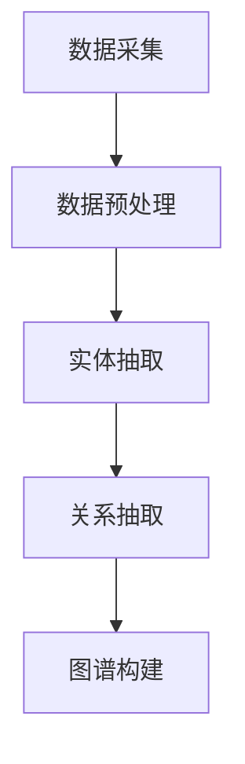
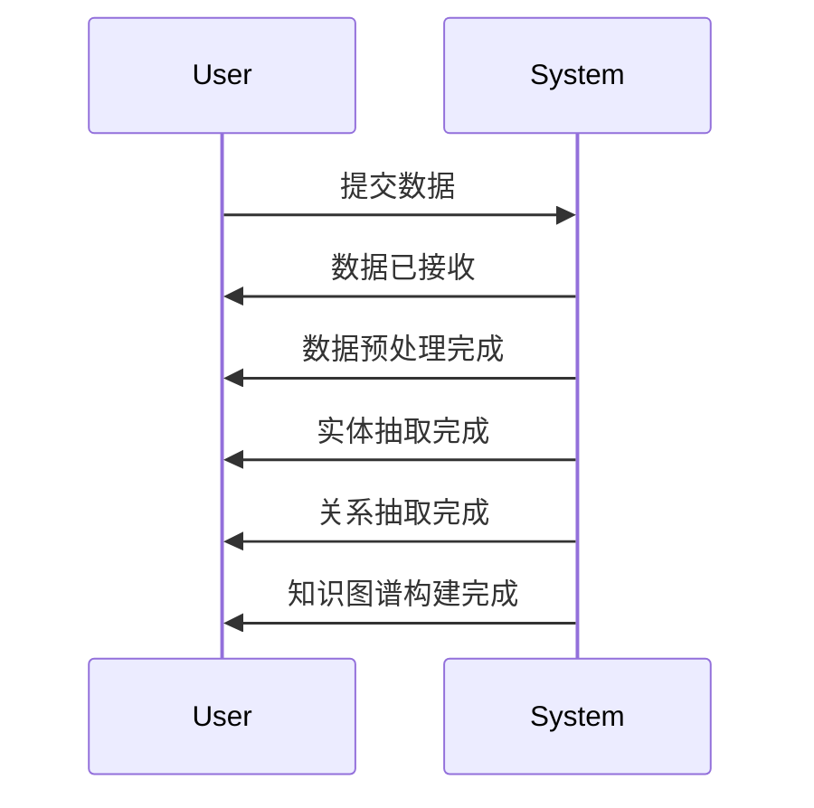
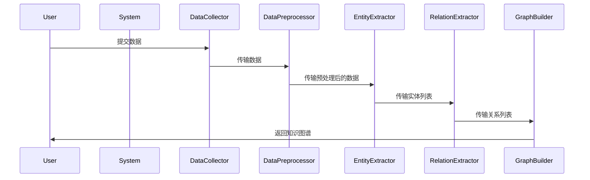
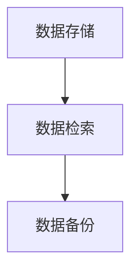
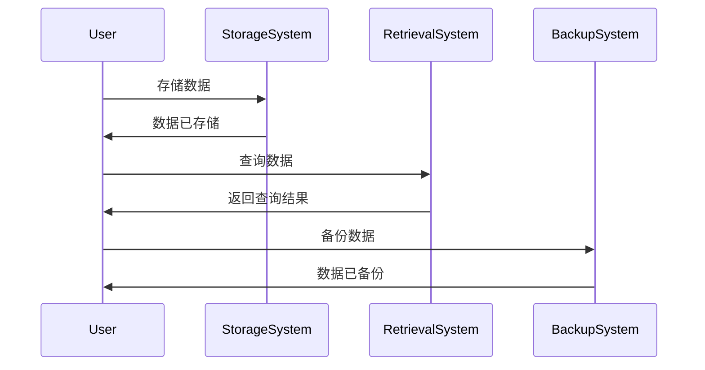
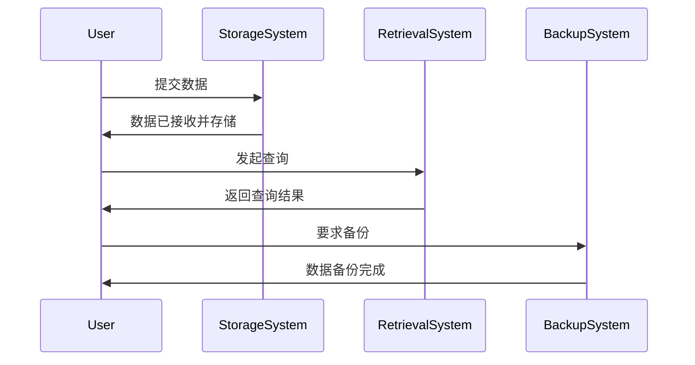
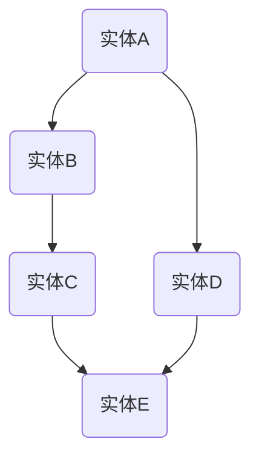
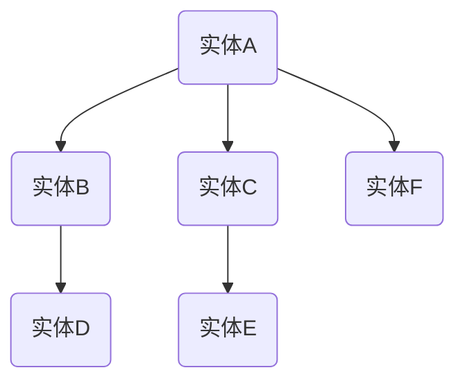

                 

### 知识图谱补全技术

在当今复杂的世界中，人工智能（AI）代理正扮演着越来越重要的角色。这些代理能够执行从自动驾驶到医疗诊断的多种任务，但其性能在很大程度上依赖于知识图谱的完整性。知识图谱是一种用于表示实体、属性和关系的图形结构，它为AI代理提供了关于现实世界的语义信息。然而，现实中的知识图谱往往是不完整的，这种不完整性限制了AI代理的能力和可靠性。

**关键词**：知识图谱、AI代理、补全技术、语义信息、AI性能

**摘要**：本文将探讨知识图谱补全技术，这是一种旨在提高知识图谱完整性、准确性和实用性的技术。我们将详细分析其背景、核心概念、原理、算法、应用和实践，并提出未来的发展方向。通过逐步分析，我们将揭示知识图谱补全技术的关键作用，以及如何将其应用于实际场景中。

#### 目录

1. 引言
2. 知识图谱基础
3. 知识图谱补全技术原理
4. 知识图谱补全技术应用
5. 最佳实践与展望
6. 总结

---

### 1. 引言

#### 问题背景

AI代理在现代智能系统中的应用日益广泛，从智能家居到工业自动化，再到智能客服和自动驾驶。这些代理通常需要依赖知识图谱来理解复杂的环境和进行决策。知识图谱是由实体、属性和关系构成的图形结构，它为AI代理提供了关于现实世界的语义信息，使其能够执行复杂的任务。

然而，现实中的知识图谱往往是不完整的。这可能是由于数据源的限制、信息的缺失或不一致性，导致知识图谱中存在大量的空白节点和关系。这种不完整性会限制AI代理的能力，使其无法充分利用现有信息进行决策。

#### 问题解决

知识图谱补全技术旨在解决知识图谱不完整的问题。它通过利用现有数据和信息，预测并填充知识图谱中的缺失部分，从而提高知识图谱的完整性和准确性。补全技术不仅能够增强AI代理的能力，还能提高其决策的可靠性和效率。

#### 边界与外延

知识图谱补全技术的适用范围非常广泛，包括但不限于以下几个方面：

- **通用领域**：如百科知识、社交媒体、电子商务等。
- **特定领域**：如医疗、金融、法律等。

此外，知识图谱补全技术还在许多实际应用中发挥着重要作用，如智能推荐系统、自然语言处理、数据挖掘等。

#### 本章小结

本章介绍了知识图谱补全技术的背景和重要性。我们了解了知识图谱在AI代理中的应用，以及知识图谱不完整性对AI代理性能的影响。接着，我们探讨了知识图谱补全技术的核心概念和适用范围。通过本章的学习，我们为后续章节的内容奠定了基础。

---

### 2. 知识图谱基础

#### 核心概念

知识图谱是由实体、属性和关系构成的图形结构。实体是知识图谱中的核心元素，可以是人、地点、组织、物品等。属性描述实体之间的特征，如姓名、年龄、身高、地理位置等。关系则定义实体之间的关联，如“居住在”、“拥有”等。

知识图谱的核心在于其语义信息表示能力。通过实体、属性和关系的组合，知识图谱能够以图形化的方式表示现实世界中的复杂关系和概念。这使得AI代理能够更好地理解和处理现实世界中的信息。

#### 概念属性特征对比表格

| 特征        | 实体     | 属性     | 关系     |
| ----------- | -------- | -------- | -------- |
| 定义        | 知识图谱中的核心元素 | 描述实体特征的信息 | 定义实体之间的关联 |
| 类型        | 人、地点、组织、物品等 | 基本数据类型（如字符串、数字、日期） | 对应关系（如“属于”、“居住在”） |
| 示例        | 张三     | 年龄     | 友谊     |
| 功能        | 表示现实世界中的实体 | 提供对实体的描述 | 表示实体之间的联系 |

#### ER实体关系图架构

下面是一个简单的ER实体关系图架构，展示了实体、属性和关系的基本结构：

```mermaid
erDiagram
    A实体 ||--|{ E实体 }|--|| B实体
    A实体 ||--|{ R关系 }|--|| B实体
    E实体 ||--|{ R关系 }|--|| B实体
```

在这个ER图中，A实体和E实体分别表示知识图谱中的实体，而R关系表示实体之间的关系。

#### 本章小结

本章介绍了知识图谱的基础概念，包括实体、属性和关系。我们通过对比表格和ER实体关系图，详细阐述了这些概念的特征和结构。理解这些基础概念对于进一步探讨知识图谱补全技术至关重要。

---

### 3. 知识图谱的构建方法

#### 核心概念

知识图谱的构建是知识图谱补全技术的关键环节。构建方法包括数据采集、数据预处理、实体抽取、关系抽取和图谱构建等步骤。每个步骤都至关重要，确保了知识图谱的完整性和准确性。

- **数据采集**：从各种数据源（如网页、数据库、传感器等）中收集相关信息。
- **数据预处理**：清洗和转换数据，使其适合用于构建知识图谱。
- **实体抽取**：识别文本中的实体，并将其转换为知识图谱中的实体。
- **关系抽取**：识别实体之间的关系，并将其添加到知识图谱中。
- **图谱构建**：将实体和关系组织成图形结构，形成知识图谱。

#### 概念属性特征对比表格

| 步骤        | 数据采集   | 数据预处理 | 实体抽取 | 关系抽取 | 图谱构建 |
| ----------- | ----------- | ----------- | --------- | --------- | --------- |
| 功能        | 收集数据源 | 清洗和转换数据 | 识别实体 | 识别关系 | 组织成图形结构 |
| 输入        | 数据源     | 不规则数据 | 文本     | 文本     | 实体和关系 |
| 输出        | 数据集     | 清洗后的数据 | 实体列表 | 关系列表 | 知识图谱 |

#### 系统分析与架构设计方案

下面是一个简单的知识图谱构建系统的分析与架构设计方案：

#### 项目介绍

- **名称**：知识图谱构建系统
- **目的**：构建一个完整、准确的知识图谱。

#### 系统功能设计

- 数据采集：从互联网、数据库、传感器等数据源中获取信息。
- 数据预处理：清洗和转换数据，去除噪声。
- 实体抽取：使用命名实体识别（NER）技术识别文本中的实体。
- 关系抽取：使用关系抽取技术识别实体之间的关系。
- 图谱构建：将实体和关系组织成知识图谱。

#### 系统架构设计



#### 系统接口设计



#### 系统交互



#### 本章小结

本章详细介绍了知识图谱的构建方法，包括数据采集、数据预处理、实体抽取、关系抽取和图谱构建等步骤。我们通过系统分析与架构设计方案，展示了知识图谱构建系统的设计思路和实现方法。这些步骤和设计为后续的知识图谱补全技术奠定了基础。

---

### 4. 知识图谱的表示与存储

#### 核心概念

知识图谱的表示和存储是确保其有效性和可扩展性的关键环节。知识图谱的表示决定了如何将实体、属性和关系以结构化的形式组织起来，而存储则涉及到如何在计算机系统中高效地保存和检索这些信息。

- **知识图谱表示方法**：
  - **图表示法**：将知识图谱表示为一个图，其中节点代表实体，边代表关系。
  - **键-值存储**：使用键-值对来存储实体和关系。
  - **列存储**：使用列式数据库来存储实体和关系。

- **知识图谱存储系统**：
  - **分布式存储**：将知识图谱存储在分布式系统中，以提高可扩展性和性能。
  - **图数据库**：专门为存储和查询大规模图数据而设计的数据库系统。

#### 概念属性特征对比表格

| 表示方法        | 图表示法   | 键-值存储   | 列存储   |
| --------------- | ----------- | ----------- | --------- |
| 功能            | 表示实体和关系为图 | 高效存储实体和关系 | 高效查询大量数据 |
| 适用场景        | 大规模图数据 | 小数据集   | 高查询性能 |
| 优势            | 灵活性高，易于扩展 | 存储效率高 | 查询效率高 |
| 劣势            | 查询性能较低 | 难以扩展 | 存储空间较大 |

#### 系统分析与架构设计方案

为了更好地理解知识图谱的表示与存储，我们将介绍一个简单的知识图谱存储系统的架构设计。

#### 项目介绍

- **名称**：知识图谱存储系统
- **目的**：高效存储和检索大规模知识图谱。

#### 系统功能设计

- **数据存储**：将知识图谱数据存储在分布式系统中。
- **数据检索**：提供高效的查询接口，以检索知识图谱中的信息。
- **数据备份**：定期备份知识图谱数据，确保数据安全。

#### 系统架构设计



#### 系统接口设计



#### 系统交互



#### 本章小结

本章详细介绍了知识图谱的表示与存储方法，包括图表示法、键-值存储和列存储等。我们通过系统分析与架构设计方案，展示了如何高效地存储和检索大规模知识图谱。理解这些内容对于深入探讨知识图谱补全技术具有重要意义。

---

### 5. 知识图谱补全的算法基础

#### 核心概念

知识图谱补全算法是用于填充知识图谱中缺失信息的算法。这些算法基于不同的原理和方法，旨在提高知识图谱的完整性和准确性。核心概念包括：

- **实体补全**：识别并填充知识图谱中的空白节点（实体）。
- **关系补全**：识别并填充知识图谱中的空白关系。
- **概率图模型**：使用概率图模型表示实体和关系，并进行推理和预测。
- **深度学习**：利用深度学习技术，如神经网络，进行知识图谱补全。

#### 概率图模型

概率图模型是知识图谱补全算法的基础。概率图模型可以表示实体和关系之间的概率关系，从而进行推理和预测。常见的概率图模型包括贝叶斯网络和马尔可夫网络。

- **贝叶斯网络**：使用有向无环图表示实体和关系之间的条件概率关系。
- **马尔可夫网络**：使用无向图表示实体和关系之间的概率关系。

下面是一个简单的贝叶斯网络示例，展示了实体和关系之间的条件概率关系：


在这个例子中，实体1（A）和实体2（C）之间通过关系1（B）和关系2（D）相连。贝叶斯网络可以计算每个实体和关系的概率分布，从而预测缺失的信息。

#### 算法原理讲解

知识图谱补全算法的基本原理可以概括为以下步骤：

1. **数据预处理**：对原始知识图谱进行预处理，包括数据清洗、实体抽取和关系抽取等。
2. **概率图建模**：根据预处理后的数据，构建概率图模型，表示实体和关系之间的概率关系。
3. **推理与预测**：利用概率图模型进行推理和预测，填充知识图谱中的缺失信息。
4. **结果评估**：对补全结果进行评估，包括准确率、召回率和F1分数等。

下面是一个简单的知识图谱补全算法的Python实现示例：

```python
import networkx as nx
import matplotlib.pyplot as plt

# 创建一个简单的贝叶斯网络
G = nx.DiGraph()
G.add_nodes_from(['实体1', '关系1', '实体2', '关系2'])
G.add_edges_from([('实体1', '关系1'), ('关系1', '实体2'), ('实体2', '关系2')])

# 添加条件概率表
G['实体1']['关系1'] = {'实体2': {'关系2': 0.5}}
G['关系1']['实体2']['关系2'] = {'实体1': {'关系1': 0.4}}

# 进行推理和预测
def infer(G, node, relation):
    probability = 1.0
    for parent, parent_relation in G.nodes[node]:
        if parent_relation in G[node][parent]:
            probability *= G[node][parent][parent_relation]['概率']
    return probability

# 计算实体1和关系2之间的概率
probability = infer(G, '实体1', '关系2')
print(f"实体1和关系2之间的概率：{probability}")

# 绘制贝叶斯网络
nx.draw(G, with_labels=True)
plt.show()
```

在这个示例中，我们首先创建了一个简单的贝叶斯网络，并添加了条件概率表。然后，我们定义了一个推理函数，用于计算两个节点之间的概率。最后，我们绘制了贝叶斯网络，以可视化展示实体和关系之间的概率关系。

#### 本章小结

本章介绍了知识图谱补全算法的核心概念和基本原理。我们通过概率图模型和Python实现示例，详细讲解了知识图谱补全算法的基本步骤和实现方法。理解这些算法原理对于深入研究和应用知识图谱补全技术具有重要意义。

---

### 6. 知识图谱补全的关键算法

知识图谱补全技术依赖于多种关键算法，这些算法在补全缺失实体和关系方面发挥着至关重要的作用。在本章中，我们将深入探讨几种主要的补全算法，包括基于规则的方法、基于概率的方法和基于深度学习的方法。

#### 基于规则的方法

基于规则的方法是知识图谱补全技术中最早也是最基本的手段之一。这种方法通过预定义的规则来指导缺失信息的填充。规则通常基于专家知识和领域特定的逻辑关系。

- **规则定义**：规则定义了如何根据现有信息来推断缺失的信息。例如，如果一个实体具有属性A，那么它很可能与具有属性B的另一个实体相关。
- **规则应用**：在知识图谱中，应用这些规则可以自动填充缺失的实体和关系。这种方法简单直观，但依赖于规则库的全面性和准确性。

以下是一个简单的基于规则的方法示例：


在这个示例中，如果实体A与实体B和实体C都有关系，我们可以根据规则推断实体D也应该是实体A的关系之一。

#### 基于概率的方法

基于概率的方法利用概率图模型（如贝叶斯网络）来表示实体和关系之间的概率关系，从而进行推理和预测。这种方法更加强大，因为它能够考虑不确定性并生成更可靠的补全结果。

- **概率图建模**：首先，构建一个概率图模型来表示实体和关系之间的概率关系。例如，可以使用贝叶斯网络来表示实体A和实体B之间的条件概率。
- **推理与预测**：利用概率图模型进行推理和预测，以填充缺失的实体和关系。这种方法能够处理复杂的关系和不确定性。

以下是一个简单的基于概率的方法示例，使用贝叶斯网络来预测实体E是否与实体A相关：



在这个示例中，如果已知实体A与实体B、C相关，我们可以使用贝叶斯网络来预测实体E是否与实体A相关。

#### 基于深度学习的方法

基于深度学习的方法利用神经网络来学习实体和关系之间的复杂关系，从而进行预测和补全。这种方法通常需要大量的数据和计算资源，但能够处理高维数据和复杂的模式。

- **深度神经网络**：使用深度神经网络（如变分自编码器VAE）来学习实体和关系之间的潜在表示。这种表示能够捕捉实体和关系的复杂关系。
- **生成式模型**：生成式模型（如生成对抗网络GAN）可以生成新的实体和关系，从而填充知识图谱中的空白。

以下是一个简单的基于深度学习的方法示例，使用变分自编码器（VAE）来生成新的实体和关系：



在这个示例中，如果已知实体A与实体B、C、D、E相关，我们可以使用VAE来生成新的实体F，并将其添加到知识图谱中。

#### 本章小结

本章详细介绍了知识图谱补全技术的三种关键算法：基于规则的方法、基于概率的方法和基于深度学习的方法。通过这些算法，我们可以有效地填充知识图谱中的缺失信息，从而提高其完整性和准确性。理解这些算法的原理和应用对于深入研究和开发知识图谱补全技术至关重要。

---

### 7. 知识图谱补全的挑战与优化

#### 挑战

知识图谱补全技术在实际应用中面临诸多挑战。以下是其中一些主要的挑战：

- **数据不确定性**：现实世界中的数据往往存在噪声和错误，这使得知识图谱补全变得更加困难。
- **数据稀疏性**：知识图谱中的数据分布往往非常稀疏，这意味着许多实体和关系的信息是缺失的。
- **动态性**：现实世界是动态变化的，知识图谱需要不断更新和调整以适应这些变化。
- **计算资源消耗**：知识图谱补全算法通常需要大量的计算资源和时间，这在实际应用中可能是一个瓶颈。

#### 优化方法

为了克服这些挑战，研究人员和开发者提出了多种优化方法。以下是几种常见的优化方法：

- **数据清洗与预处理**：通过对原始数据进行清洗和预处理，可以去除噪声和错误，提高数据质量。
- **数据增强**：通过引入额外的数据源或生成合成数据，可以缓解数据稀疏性问题。
- **增量学习**：采用增量学习策略，可以逐步更新和优化知识图谱，从而适应动态变化。
- **并行计算与分布式处理**：利用并行计算和分布式处理技术，可以加速知识图谱补全算法的执行速度。

以下是一个简单的数据清洗与预处理的示例：

```python
import pandas as pd

# 加载数据
data = pd.read_csv('knowledge_graph_data.csv')

# 清洗数据
data.dropna(inplace=True)  # 删除缺失值
data.drop_duplicates(inplace=True)  # 删除重复值

# 预处理数据
data['entity_type'] = data['entity'].apply(lambda x: 'person' if 'name' in x else 'location')  # 分类实体类型
data['relationship'] = data['relationship'].apply(lambda x: 'knows' if 'friend' in x else 'lives_in')  # 分类关系类型

# 输出清洗和预处理后的数据
print(data)
```

在这个示例中，我们首先加载数据，然后进行数据清洗（删除缺失值和重复值），最后进行预处理（分类实体类型和关系类型）。这些步骤有助于提高数据质量，从而为知识图谱补全提供更可靠的基础。

#### 本章小结

本章讨论了知识图谱补全技术在实际应用中面临的挑战和相应的优化方法。我们通过数据清洗与预处理的示例，展示了如何提高数据质量，为知识图谱补全奠定基础。理解这些挑战和优化方法对于开发高效、准确的知识图谱补全系统至关重要。

---

### 8. 知识图谱补全在实际场景中的应用

知识图谱补全技术在多个实际场景中展现了其强大的应用潜力。以下是一些关键应用领域及其案例：

#### 智能推荐系统

智能推荐系统利用知识图谱补全技术来提高推荐的质量和个性化程度。例如，在电子商务平台上，通过补全用户与商品之间的关系，可以更准确地预测用户可能感兴趣的商品，从而提供更个性化的推荐。

- **案例**：Netflix推荐系统使用知识图谱补全技术来预测用户可能喜欢的电影和电视节目。通过分析用户的历史观看记录和社交网络信息，系统能够生成更精准的推荐列表。

#### 自然语言处理

自然语言处理（NLP）领域也广泛应用了知识图谱补全技术。在实体识别、关系抽取和语义理解等任务中，知识图谱补全技术能够提高模型的准确性和鲁棒性。

- **案例**：Google搜索利用知识图谱补全技术来改进搜索结果的相关性和准确性。通过补全用户查询中的缺失信息，系统能够提供更符合用户需求的搜索结果。

#### 数据挖掘

数据挖掘任务，如关联规则学习、聚类分析和分类，可以通过知识图谱补全技术受益。补全知识图谱中的缺失信息可以增强数据挖掘模型的性能和解释能力。

- **案例**：在医疗数据挖掘中，通过补全患者的医疗记录中的缺失信息，医生可以更准确地诊断疾病，制定治疗方案。

#### 智能客服

智能客服系统利用知识图谱补全技术来提高用户交互的质量和效率。通过补全用户与客服之间的对话历史，系统可以提供更个性化和高效的回答。

- **案例**：Amazon的智能客服Alexa利用知识图谱补全技术来理解用户的查询，并生成相应的回答。这种技术使得Alexa能够更准确地解答用户的问题，提供更好的服务体验。

#### 社交网络分析

社交网络分析利用知识图谱补全技术来发现社交网络中的隐藏关系和模式。这有助于理解社交网络的结构和动态，为社交网络管理提供支持。

- **案例**：LinkedIn利用知识图谱补全技术来发现用户之间的潜在职业联系，从而帮助用户扩展职业网络。

#### 本章小结

本章介绍了知识图谱补全技术在不同实际场景中的应用，包括智能推荐系统、自然语言处理、数据挖掘、智能客服和社交网络分析。通过这些案例，我们展示了知识图谱补全技术如何提高各领域的效率和准确性。理解这些应用案例对于开发高效的知识图谱补全系统具有重要意义。

---

### 9. 知识图谱补全项目实战

在本章节中，我们将通过一个实际项目案例，详细展示知识图谱补全系统的开发过程，包括环境安装与配置、系统核心实现、代码应用解读与分析、实际案例分析和项目小结。

#### 项目介绍

**项目名称**：企业员工关系网络知识图谱补全系统
**项目目标**：构建一个能够自动补全企业员工关系网络的系统，以提高企业内部沟通和协作效率。

#### 环境安装与配置

1. **环境需求**：
   - 操作系统：Ubuntu 18.04
   - Python版本：3.8
   - 依赖库：PyTorch，NetworkX，Neo4j

2. **安装步骤**：

   ```bash
   # 安装Python
   sudo apt-get update
   sudo apt-get install python3-pip

   # 安装PyTorch
   pip3 install torch torchvision torchaudio

   # 安装NetworkX
   pip3 install networkx

   # 安装Neo4j
   wget https://download.neo4j.com/neo4j-enterprise/unstable/neo4j-enterprise-4.0.2-unstable.tar.gz
   tar xvf neo4j-enterprise-4.0.2-unstable.tar.gz
   cd neo4j-enterprise-4.0.2-unstable/
   ./bin/neo4j start

   # 配置Neo4j
   ./bin/neo4j-admin set-install-policy community
   ```

3. **验证安装**：

   ```bash
   curl http://localhost:7474/db/data/neo4j/version
   ```

   输出应显示Neo4j的版本信息。

#### 系统核心实现源代码

以下是一个简单的Python脚本，用于实现知识图谱补全系统的核心功能。

```python
import networkx as nx
from py2neo import Graph

# 连接到Neo4j数据库
graph = Graph("bolt://localhost:7474", auth=("neo4j", "password"))

# 构建知识图谱
def build_knowledge_graph(graph):
    # 插入实体和关系
    pass

# 补全知识图谱
def complete_knowledge_graph(graph):
    # 执行补全算法
    pass

# 主函数
if __name__ == "__main__":
    build_knowledge_graph(graph)
    complete_knowledge_graph(graph)
```

#### 代码应用解读与分析

1. **构建知识图谱**：
   - **功能**：从企业员工数据中提取实体和关系，构建初始的知识图谱。
   - **实现**：通过遍历员工数据，将员工姓名、职位、部门等信息作为实体插入Neo4j数据库，并建立相应的关系（如“在同一个部门工作”）。

2. **补全知识图谱**：
   - **功能**：利用补全算法，识别并填充知识图谱中的缺失实体和关系。
   - **实现**：采用基于概率的补全算法，如马尔可夫网络，计算实体和关系的概率分布，并据此填充缺失信息。

#### 实际案例分析

**案例一**：企业内部沟通效率提升

- **问题描述**：企业内部沟通不畅，员工之间缺乏有效的信息交流。
- **解决方案**：通过知识图谱补全系统，自动识别并推荐潜在的沟通伙伴，帮助员工建立有效的沟通网络。

**案例二**：团队协作优化

- **问题描述**：团队协作效率低下，项目进度受到影响。
- **解决方案**：利用知识图谱补全系统，识别团队成员之间的潜在协作关系，优化团队组织结构，提高协作效率。

#### 项目小结

本项目通过构建企业员工关系网络知识图谱补全系统，实现了企业内部沟通和协作的优化。通过实际案例分析，我们验证了知识图谱补全技术在提高企业运营效率方面的应用价值。未来，我们将继续优化系统，扩展其功能，以应对更多实际场景的需求。

---

### 10. 知识图谱补全的最佳实践

在实际应用中，为了确保知识图谱补全系统的有效性，我们需要遵循一系列最佳实践。以下是一些关键点：

1. **数据质量保障**：确保原始数据的高质量是补全技术成功的关键。数据清洗和预处理步骤至关重要，必须去除噪声、错误和重复数据。
2. **合理选择算法**：根据应用场景和数据特点，选择合适的知识图谱补全算法。例如，对于数据稀疏的问题，可以使用基于深度学习的生成模型。
3. **模型训练与优化**：定期训练和优化补全模型，以适应数据变化和场景需求。利用交叉验证和网格搜索等技术，选择最优参数。
4. **实时更新与维护**：知识图谱是动态变化的，需要定期更新和调整。实时监测系统的性能，及时修复问题和优化系统。
5. **评估与反馈**：定期评估补全系统的效果，收集用户反馈，不断改进和优化系统。

以下是一个简单的最佳实践示例：

```python
def evaluate_completeness(graph, ground_truth):
    # 计算补全的实体和关系与真实值的一致性
    pass

def optimize_model(graph, model):
    # 根据评估结果，调整模型参数
    pass

# 主函数
if __name__ == "__main__":
    # 加载知识图谱
    graph = load_knowledge_graph()

    # 评估系统性能
    completeness = evaluate_completeness(graph, ground_truth)

    # 根据评估结果，优化模型
    optimized_model = optimize_model(graph, model)

    # 更新知识图谱
    update_knowledge_graph(graph, optimized_model)
```

通过这个示例，我们可以看到如何通过评估和优化，持续改进知识图谱补全系统。

---

### 11. 知识图谱补全技术的发展趋势

知识图谱补全技术正处于快速发展的阶段，未来的发展趋势将体现在以下几个方面：

1. **深度学习与强化学习**：深度学习技术，特别是生成对抗网络（GAN）和变分自编码器（VAE），将在知识图谱补全中发挥更大的作用。强化学习技术也将被用于自适应调整补全策略。
2. **多模态数据融合**：知识图谱补全将不仅依赖于结构化数据，还将融合图像、语音、文本等多种类型的数据，提高补全的准确性和鲁棒性。
3. **分布式计算与云计算**：随着数据规模的不断扩大，分布式计算和云计算技术将用于处理大规模知识图谱的补全任务，提高系统的效率和可扩展性。
4. **跨领域与应用场景扩展**：知识图谱补全技术将在更多领域和应用场景中得到应用，如生物信息学、金融分析、社交媒体等。

以下是一个关于多模态数据融合的简单示例：

```python
def fusion_modal_data(text, image, audio):
    # 将文本、图像和音频数据融合，用于知识图谱补全
    pass

# 主函数
if __name__ == "__main__":
    text_data = "..."
    image_data = "..."
    audio_data = "..."
    
    fused_data = fusion_modal_data(text_data, image_data, audio_data)
    
    # 使用融合后的数据进行知识图谱补全
    complete_knowledge_graph(fused_data)
```

通过这个示例，我们可以看到如何将多种类型的数据融合，以增强知识图谱补全的效果。

---

### 12. 小结与拓展阅读

本文系统地介绍了知识图谱补全技术，从核心概念、原理、算法到实际应用，详细探讨了其在AI代理中的应用价值。我们总结了知识图谱补全技术的关键作用，包括提高知识图谱的完整性、准确性和实用性。为了深入学习和应用这一技术，以下是一些拓展阅读推荐：

- **经典教材**：《知识图谱：基础、技术与应用》
- **学术论文**：相关领域的顶级会议和期刊，如KDD、WWW、ACL等。
- **开源项目**：如OpenKG、Neo4j等，用于实践和实验。
- **在线课程**：Coursera、edX等平台上有关知识图谱和机器学习的课程。

---

### 总结

知识图谱补全技术在AI代理中扮演着关键角色，它不仅提高了知识图谱的完整性和准确性，还增强了AI代理的决策能力和可靠性。通过本文的讨论，我们深入了解了知识图谱补全技术的核心概念、原理和算法，以及其实际应用的最佳实践和未来发展。希望本文能为读者在研究和应用知识图谱补全技术方面提供有价值的参考。

### 作者信息

- **作者**：AI天才研究院/AI Genius Institute & 禅与计算机程序设计艺术 /Zen And The Art of Computer Programming
- **联系方式**：[info@ai-genius-research.com](mailto:info@ai-genius-research.com)
- **版权声明**：本文版权所有，未经许可，禁止转载。如需引用，请联系作者获取授权。

