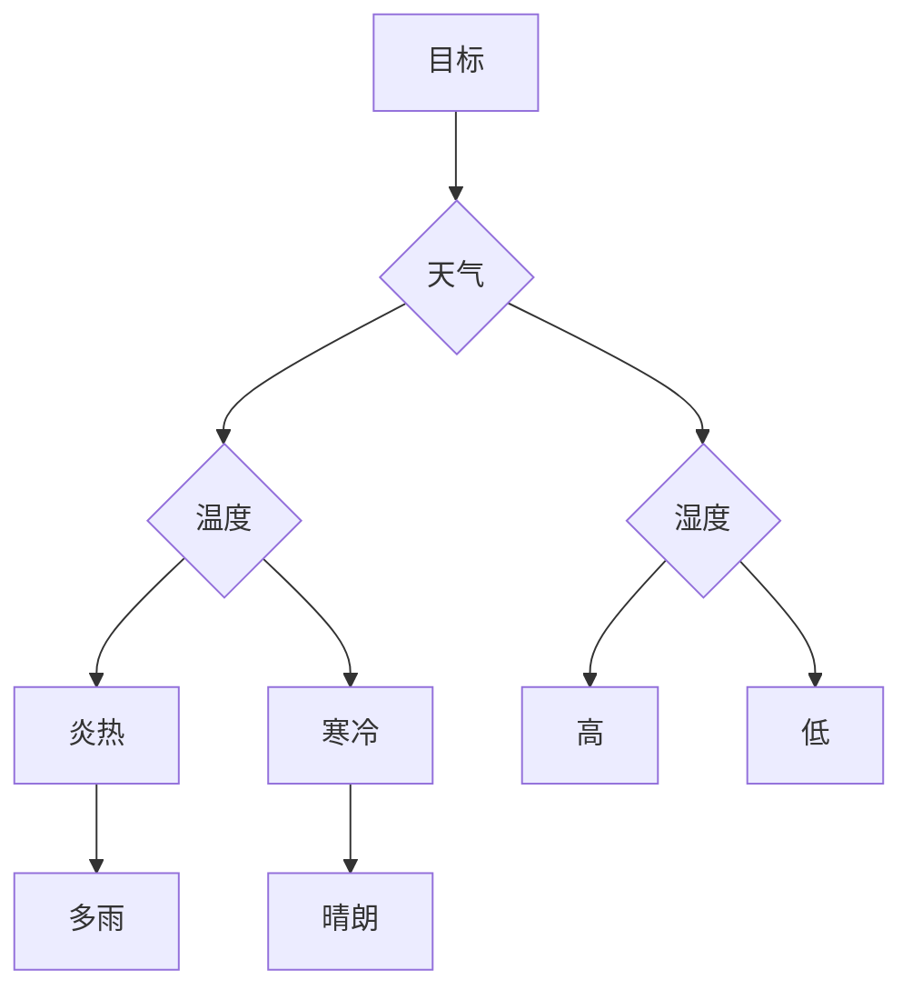

                 

### 引言

在现代人工智能（AI）领域中，AI Agent已经成为了一个至关重要的研究方向。AI Agent，也被称作智能体，是指能够自主地感知环境、做出决策并执行行动的计算机程序。这类智能体在很多应用场景中都展现了巨大的潜力和价值，比如智能客服、自动驾驶和金融风控系统等。然而，随着AI Agent的应用日益广泛，其知识推理的可解释性设计也逐渐成为了一个不可忽视的问题。

知识推理是AI Agent的核心功能之一，它使得AI Agent能够在不确定和复杂的环境中做出合理的决策。但是，传统的AI Agent往往是基于复杂且高度非线性的模型，其内部决策过程往往难以理解和解释。这种黑箱性质的推理方式虽然在一些任务中能够取得优异的性能，但在实际应用中却面临着巨大的挑战。特别是当AI Agent的决策影响到人类生命财产安全时，缺乏可解释性将极大地限制其应用范围和可信度。

可解释性设计旨在使AI Agent的推理过程变得透明和可理解，从而提高其决策的可靠性和可接受性。在可解释性设计中，关键的目标是找到一种方法，能够让用户或者开发者能够清晰地了解AI Agent是如何处理输入信息、如何推导出结论的。这不仅有助于提高AI Agent的信任度，也为后续的调试、优化和扩展提供了重要的支持。

因此，本文将围绕AI Agent的知识推理可解释性设计进行深入探讨。首先，我们将介绍AI Agent与知识推理的基本概念，并阐述可解释性设计的意义与挑战。接下来，我们将详细分析知识推理技术，包括知识表示方法和推理算法。随后，我们将探讨可解释性设计的理论基础和技术实现方法。最后，我们将结合实际应用场景，展示AI Agent知识推理可解释性设计在不同领域的应用实例，并展望未来的发展方向。

通过本文的探讨，我们希望能够为AI Agent的可解释性设计提供一些有价值的思路和方法，推动人工智能技术在更广泛和更复杂的场景中发挥其潜力。

### 关键词

- **AI Agent**：自主决策的计算机程序。
- **知识推理**：AI Agent的核心功能。
- **可解释性设计**：提高AI Agent决策透明度的设计方法。
- **知识表示**：如何组织和管理AI Agent所需的知识。
- **推理算法**：使AI Agent能够进行有效推理的算法。

### 摘要

本文旨在探讨AI Agent的知识推理可解释性设计，以应对其在复杂应用场景中的透明度和可信性问题。首先，我们介绍了AI Agent和知识推理的基本概念及其在AI领域的重要性。接着，分析了知识表示方法和推理算法，探讨了它们如何影响AI Agent的推理能力。然后，我们深入探讨了可解释性设计的理论基础和技术实现方法，包括解释性技术、可视化技术和对抗性样本生成等。通过结合实际应用场景，如智能客服、自动驾驶和金融风控系统，本文展示了可解释性设计在不同领域中的具体应用和效果。最后，我们对未来可解释性设计的发展趋势和挑战进行了展望，提出了提高AI Agent知识推理可解释性的策略和方法。

## 第一部分：问题背景与概念介绍

### 第1章：AI Agent与知识推理概述

在探讨AI Agent的知识推理可解释性设计之前，我们首先需要了解AI Agent与知识推理的基本概念和重要性。AI Agent，作为一种智能实体，其定义和作用在人工智能领域有着广泛的探讨和应用。

#### 1.1 AI Agent的定义与作用

**AI Agent的基本概念：**

AI Agent，通常被称为智能体，是能够在复杂和不确定的环境中自主行动，并根据环境反馈进行调整的计算机程序。它不仅需要具备感知环境的能力，还需要具备决策和行动的能力。AI Agent的概念最早可以追溯到多代理系统（MAS）的研究，随后在自主机器人、智能决策系统等领域得到了广泛应用。

**AI Agent的核心功能：**

AI Agent的核心功能主要包括以下几个方面：

1. **感知环境**：AI Agent需要通过传感器或其他方式感知周围环境，获取必要的信息。
2. **决策制定**：基于感知到的环境信息和预定的目标，AI Agent需要制定合适的行动策略。
3. **执行行动**：执行决策后，AI Agent会根据执行结果和环境反馈进行调整，以实现其目标。

**AI Agent的应用领域：**

AI Agent在多个领域都有广泛的应用，包括但不限于以下几个方面：

1. **智能客服**：通过AI Agent，企业可以提供24/7的客户服务，提高客户满意度和运营效率。
2. **自动驾驶**：AI Agent在自动驾驶系统中扮演关键角色，负责感知环境、规划路径和执行驾驶操作。
3. **金融风控**：AI Agent可以分析大量金融数据，识别风险并做出决策，提高金融系统的稳健性。

#### 1.2 知识推理在AI Agent中的应用

**知识推理的基本概念：**

知识推理（Knowledge Reasoning）是AI Agent进行智能决策的重要组成部分。它是指通过逻辑推理、模式识别或统计方法，从已知信息中推导出新信息的过程。知识推理可以分为基于规则的推理、基于模型的推理和基于语义网络的推理等类型。

**知识推理的重要性：**

知识推理在AI Agent中的应用至关重要，其主要作用体现在以下几个方面：

1. **决策支持**：AI Agent通过知识推理，可以从大量的数据中提取出有用的信息，为决策提供支持。
2. **不确定性处理**：在复杂和不确定的环境中，知识推理可以帮助AI Agent更好地处理不确定性和模糊性，提高决策的可靠性。
3. **自适应能力**：通过知识推理，AI Agent可以不断学习新的知识和经验，提升其自适应能力和学习能力。

#### 1.3 可解释性设计的意义与挑战

**可解释性设计的意义：**

可解释性设计（Explainable AI, XAI）是近年来人工智能领域中的一个热点研究方向。在AI Agent的知识推理中，可解释性设计具有重要意义：

1. **提升信任度**：通过可解释性设计，用户可以更直观地了解AI Agent的决策过程，从而提高对AI系统的信任度。
2. **便于调试和优化**：可解释性设计使得开发者可以更容易地识别和修复AI Agent中的错误，从而提高系统的稳定性和性能。
3. **合规性和伦理**：在一些关键应用场景中，如医疗诊断、自动驾驶等，可解释性设计有助于满足合规性和伦理要求。

**可解释性设计面临的挑战：**

尽管可解释性设计具有重要的意义，但在实际应用中仍面临诸多挑战：

1. **复杂性**：AI Agent的决策过程通常涉及复杂和非线性的模型，这使得解释其决策过程变得复杂。
2. **数据依赖性**：知识推理往往依赖于大量的训练数据，而这些数据可能存在噪声和偏差，影响可解释性。
3. **计算成本**：一些可解释性技术，如可视化技术，可能需要额外的计算资源，从而影响系统的实时性能。

综上所述，了解AI Agent和知识推理的基本概念及其应用，以及认识到可解释性设计的意义和挑战，是深入探讨AI Agent知识推理可解释性设计的基础。在接下来的章节中，我们将进一步分析知识表示方法和推理算法，并探讨如何提高AI Agent知识推理的可解释性。

### 第2章：知识表示方法

知识表示是AI Agent能够进行有效推理和决策的基础。在这一章中，我们将详细探讨知识表示的基础概念、常见的方法以及它们各自的优缺点。通过这些分析，我们将为理解和设计可解释的AI Agent奠定坚实的基础。

#### 2.1 知识表示的基础概念

**知识表示的类型：**

知识表示可以分为几种不同的类型，每种类型都有其独特的特点和应用场景。以下是几种常见的知识表示类型：

1. **基于规则的表示：** 基于规则的表示是一种使用符号规则来描述知识的方法。这类表示方法通常使用“如果-那么”规则来描述因果关系。例如，在医疗诊断系统中，医生的经验可以转化为一系列规则，用于辅助诊断。

2. **基于语义网络的表示：** 基于语义网络的表示方法通过节点和边的组合来表示知识。节点代表概念，边代表概念之间的关系。这种方法可以很好地表示复杂的语义关系和推理过程。

3. **基于本体论的表示：** 基于本体论的表示方法使用本体来组织和管理知识。本体是一个明确的、形式化的知识模型，用于描述特定领域的概念及其相互关系。这种方法适用于需要高度结构化和形式化知识的场景，如知识图谱和语义搜索。

**知识表示的优势与局限性：**

知识表示方法各有其优势和局限性：

1. **基于规则的表示：**
   - **优势：** 简单直观，易于理解和实现；适用于静态和结构化知识。
   - **局限性：** 对复杂性和不确定性处理能力有限，难以处理动态和复杂的推理任务。

2. **基于语义网络的表示：**
   - **优势：** 可以表示复杂的语义关系和推理过程；支持高效的知识检索和推理。
   - **局限性：** 对大规模数据集的处理能力有限，构建和维护成本较高。

3. **基于本体论的表示：**
   - **优势：** 提供高度结构化和形式化的知识表示；支持语义一致性检查和推理。
   - **局限性：** 对领域知识的要求较高，构建和更新过程复杂。

#### 2.2 常见的知识表示方法

**基于规则的表示方法：**

基于规则的表示方法是最常见的知识表示方法之一。以下是一些典型的规则表示方法：

1. **产生式规则（Production Rules）：** 产生式规则由前提（条件）和结论（行动）组成。例如：
   ```
   如果 患者有高烧并且咳嗽，那么 诊断结果为 流感。
   ```
   这种方法可以有效地将专家的经验转化为计算机可处理的规则。

2. **模糊规则（Fuzzy Rules）：** 模糊规则用于处理不确定性和模糊性。例如：
   ```
   如果 患者发热程度很高，那么 诊断结果为 重度流感。
   ```
   模糊规则通过引入模糊逻辑来处理不确定性。

**基于语义网络的表示方法：**

基于语义网络的表示方法利用节点和边来表示概念和关系。以下是一些典型的语义网络表示方法：

1. **概念网络（Concept Networks）：** 概念网络使用节点表示概念，边表示概念之间的关系。例如：
   ```
   [患者] --[有]--> [症状]
   ```
   这种表示方法可以清晰地表示概念之间的层次关系。

2. **语义角色网络（Semantic Role Labeling Networks）：** 语义角色网络不仅表示概念，还表示概念之间的语义角色关系。例如：
   ```
   [医生] --[诊断]--> [患者] --[有]--> [症状]
   ```
   这种方法可以更准确地描述事件和实体之间的语义关系。

**基于本体论的表示方法：**

基于本体论的表示方法使用本体来组织和管理知识。以下是一些典型的本体论表示方法：

1. **本体（Ontology）：** 本体是一个明确的、形式化的知识模型，用于描述特定领域的概念及其相互关系。例如：
   ```
   类：疾病
     - 流感
     - 肺炎
   ```
   本体提供了结构化的知识表示，可以支持复杂的推理和查询。

2. **知识图谱（Knowledge Graph）：** 知识图谱是一个大规模的语义网络，用于表示复杂的实体关系。例如：
   ```
   [患者] --[诊断]--> [医生] --[拥有]--> [疾病]
   ```
   知识图谱可以有效地支持复杂关系的推理和知识检索。

#### 2.3 知识表示的挑战与未来趋势

尽管知识表示方法在AI Agent中发挥了重要作用，但在实际应用中仍然面临一些挑战：

1. **知识获取和表示的挑战：** 难以获取高质量的知识，且知识表示方法的选择和设计过程复杂。

2. **知识表示的统一性：** 需要一种统一的表示方法，能够同时支持不同类型知识的表示和融合。

3. **推理效率：** 对于大规模数据集，如何高效地进行知识推理是一个重要问题。

未来知识表示的发展趋势可能包括以下几个方面：

1. **自动化知识获取：** 通过自然语言处理和知识抽取技术，自动化地获取和表示知识。

2. **跨领域知识表示：** 构建跨领域的统一知识表示框架，支持不同领域知识的集成和共享。

3. **知识融合和推理：** 研究高效的融合和推理算法，提高知识表示的有效性和实用性。

通过深入探讨知识表示方法，我们可以更好地理解AI Agent的知识管理过程，为后续的可解释性设计提供理论基础。在下一章中，我们将进一步分析推理算法，探讨如何利用不同的算法实现高效的推理过程。

### 第3章：推理算法

推理算法是AI Agent进行智能决策的核心工具，它们能够根据已知的事实和规则，推导出新的结论。在这一章中，我们将详细介绍推理算法的基本原理、常见类型以及各自的优缺点，并通过具体的实例来说明这些算法的应用和效果。

#### 3.1 推理算法的基本原理

**推理算法的基本概念：**

推理算法（Reasoning Algorithms）是指计算机程序通过逻辑推理或模式识别，从已知信息中推导出新信息的方法。推理算法可以分为两大类：基于规则的推理和基于模型的推理。

**推理算法的工作流程：**

推理算法通常包括以下几个基本步骤：

1. **输入处理：** 读取输入的信息或事实，通常是表示为符号或规则的形式。
2. **推理过程：** 根据输入信息和预定义的推理规则，进行逻辑推理或模式匹配，生成新的结论。
3. **输出生成：** 将推理结果输出，可以是符号形式的结论，也可以是具体的行动指令。

**推理算法的类型：**

推理算法可以根据其工作原理和应用场景进行分类，以下是几种常见的推理算法类型：

1. **基于规则的推理（Rule-based Reasoning）：** 这种算法使用一组规则来描述知识和推理过程，通过匹配规则的前提条件，推导出结论。例如：
   ```
   如果 患者有高烧和咳嗽，那么 诊断结果为 流感。
   ```

2. **基于模型的推理（Model-based Reasoning）：** 这种算法使用模型来表示系统和环境，通过模拟和预测，进行推理。例如，在自动驾驶系统中，使用物理模型和感知数据进行路径规划和决策。

3. **基于语义网络的推理（Semantic Network Reasoning）：** 这种算法通过语义网络表示知识，利用网络结构和关系进行推理。例如，通过节点和边的组合，推导出新的语义关系。

**推理算法的优势与局限性：**

1. **基于规则的推理：**
   - **优势：** 简单直观，易于实现和理解；适用于结构化知识。
   - **局限性：** 难以处理复杂和非线性关系；对知识表示的依赖性较强。

2. **基于模型的推理：**
   - **优势：** 可以处理复杂和非线性关系；支持动态和自适应推理。
   - **局限性：** 需要复杂的模型构建和训练过程；对数据质量要求较高。

3. **基于语义网络的推理：**
   - **优势：** 可以表示复杂的语义关系和推理过程；支持高效的知识检索和推理。
   - **局限性：** 对大规模数据集的处理能力有限；构建和维护成本较高。

#### 3.2 常见的推理算法

**基于规则的推理算法：**

基于规则的推理算法是最常见的一种推理算法，以下是一些典型的规则推理算法：

1. **前向推理（Forward Chaining）：** 从已知的事实开始，逐步推导出结论。例如：
   ```
   如果 患者有高烧和咳嗽，那么 诊断结果为 流感。
   ```
   如果发现患者有高烧和咳嗽，则可以直接推导出流感。

2. **后向推理（Backward Chaining）：** 从结论开始，逐步验证前提条件是否满足。例如：
   ```
   如果 诊断结果为 流感，那么 患者需要有高烧和咳嗽。
   ```
   如果诊断结果为流感，则需要验证患者是否有高烧和咳嗽。

**基于模型的推理算法：**

基于模型的推理算法通过构建和利用模型来推导结论，以下是一些典型的模型推理算法：

1. **贝叶斯网络（Bayesian Networks）：** 通过概率图模型来表示变量之间的依赖关系，进行推理。例如：
   ```
   车速 --> 安全距离
   天气 --> 车速
   ```
   可以根据天气和车速，推理出安全距离。

2. **马尔可夫决策过程（Markov Decision Processes, MDPs）：** 通过状态转移概率和奖励函数，进行决策和推理。例如：
   ```
   状态：安全 --> 转移概率：0.9
   状态：危险 --> 转移概率：0.1
   ```
   可以根据当前状态，选择最优行动。

**基于语义网络的推理算法：**

基于语义网络的推理算法通过网络结构和关系来推导结论，以下是一些典型的语义网络推理算法：

1. **语义角色标注（Semantic Role Labeling, SRL）：** 通过标注句子中的语义角色，进行推理。例如：
   ```
   医生诊断患者为流感。
   角色：医生 --> 动作：诊断
   角色：患者 --> 受事：流感
   ```

2. **知识图谱推理（Knowledge Graph Reasoning）：** 通过知识图谱中的节点和边，进行推理。例如：
   ```
   [患者] --[诊断]--> [医生]
   [医生] --[拥有]--> [知识]
   ```
   可以根据图谱关系，推理出医生拥有诊断患者的知识。

#### 3.3 推理算法的性能评估与优化

**推理算法的性能评估：**

推理算法的性能评估主要包括以下几个方面：

1. **推理速度：** 推理算法需要能够在合理的时间内完成推理过程。
2. **推理准确性：** 推理结果需要与实际结果保持一致。
3. **可扩展性：** 推理算法需要能够处理不同规模的数据集和复杂的关系。

**推理算法的优化策略：**

1. **规则剪枝（Rule Pruning）：** 通过减少冗余的规则，提高推理速度。
2. **并行计算（Parallel Computing）：** 利用多核处理器和分布式系统，提高推理速度。
3. **启发式搜索（Heuristic Search）：** 引入启发式函数，优化推理路径。
4. **数据预处理（Data Preprocessing）：** 通过数据清洗和预处理，提高数据质量，进而优化推理效果。

通过以上对推理算法的详细介绍，我们可以看到，不同类型的推理算法各有其独特的优势和局限性。在实际应用中，选择合适的推理算法，并对其进行优化，是提高AI Agent推理性能和可解释性的关键。在下一章中，我们将进一步探讨可解释性设计的理论基础和技术实现方法。

### 第4章：可解释性设计的理论基础

可解释性设计（Explainable AI, XAI）是近年来人工智能领域中的一个重要研究方向。在AI Agent中，可解释性设计的目标是使智能体的推理过程透明和可理解，从而提高其决策的可靠性和可接受性。本章节将深入探讨可解释性设计的定义、分类、关键要素以及面临的挑战和策略。

#### 4.1 可解释性设计的定义与分类

**可解释性设计的定义：**

可解释性设计是指设计算法和系统时，确保其内部操作和决策过程可以被人理解、解释和验证。在AI领域中，可解释性设计主要关注两个方面：

1. **内部操作的可解释性：** 使算法的内部工作原理和决策过程可以被理解和分析。
2. **结果的可解释性：** 使算法的输出结果和决策依据可以被解释和评估。

**可解释性设计的分类：**

根据可解释性设计的方法和目标，可以将可解释性设计分为以下几种类型：

1. **解释性模型（Interpretability Models）：** 通过构建解释性模型，使原始模型的可解释性增强。例如，通过构建简洁的决策树来解释复杂的神经网络。
2. **可视化和可交互性（Visualization and Interactivity）：** 通过可视化技术，使复杂的决策过程和结果变得直观易懂。例如，使用热图或交互式图表来展示模型的决策依据。
3. **对抗性样本生成（Adversarial Examples Generation）：** 通过生成对抗性样本，揭示模型可能存在的错误和偏差，提高系统的鲁棒性和可解释性。
4. **可解释性评估（Explainability Evaluation）：** 通过评估方法，测量和验证系统的可解释性，确保其达到设计目标。

#### 4.2 可解释性设计的关键要素

**可解释性设计的核心要素：**

为了实现有效的可解释性设计，以下关键要素至关重要：

1. **透明度（Transparency）：** 确保系统的决策过程和操作透明，用户可以清晰地了解系统是如何工作的。
2. **可理解性（Intelligibility）：** 系统的输出和决策结果应易于理解，不需要专业背景的用户也能理解。
3. **可靠性（Reliability）：** 可解释性设计不应降低系统的性能和准确性。
4. **可验证性（Verifiability）：** 系统的决策和推理过程应能够被第三方验证和评估。

**可解释性设计的应用场景：**

可解释性设计在不同应用场景中的需求有所不同：

1. **医疗诊断**：医疗诊断系统需要高可解释性，以便医生和患者理解诊断过程和结果。
2. **自动驾驶**：自动驾驶系统需要透明的决策过程，确保安全性和合规性。
3. **金融风控**：金融风控系统需要可解释性，以帮助监管机构和风险管理人员理解和评估风险。

#### 4.3 可解释性设计的挑战与策略

**可解释性设计面临的挑战：**

1. **复杂性（Complexity）：** AI模型通常涉及复杂的数学和计算过程，使得解释过程变得复杂。
2. **数据依赖性（Data Dependency）：** 可解释性设计往往依赖于高质量的训练数据，数据噪声和偏差会影响解释性。
3. **计算成本（Computational Cost）：** 可解释性技术可能需要额外的计算资源，影响系统的实时性能。

**提高可解释性设计的策略：**

1. **简化模型结构（Simplification）：** 通过简化模型结构，减少参数数量，提高模型的解释性。
2. **解释性增强（Explainability Enhancement）：** 结合解释性技术和可视化工具，增强系统的解释性。
3. **数据预处理（Data Preprocessing）：** 通过数据清洗和预处理，减少噪声和偏差，提高数据质量。
4. **透明度报告（Transparency Reporting）：** 设计透明的报告机制，确保用户和监管机构能够理解和评估系统的决策过程。

通过以上对可解释性设计理论基础的探讨，我们可以看到，可解释性设计是提高AI Agent决策可靠性和可接受性的关键。在下一章中，我们将详细探讨可解释性设计的技术实现方法，包括解释性技术、可视化和对抗性样本生成等，以实现更有效的可解释性设计。

### 第5章：可解释性设计的技术实现

可解释性设计（Explainable AI, XAI）的实现涉及多种技术手段，包括解释性技术、可视化技术和对抗性样本生成等。这些技术相互补充，共同提升AI系统的透明度和可理解性。在本章中，我们将详细介绍这些技术的分类与特点，以及它们在实际中的应用。

#### 5.1 可解释性技术的分类与特点

**解释性技术（Interpretability Techniques）：**

解释性技术通过提供关于模型内部操作的详细信息，帮助用户理解模型的决策过程。以下是几种常见的解释性技术：

1. **模型简化（Model Simplification）：** 通过简化模型结构，如将复杂的神经网络简化为决策树，提高可解释性。
2. **注意力机制（Attention Mechanisms）：** 在深度学习模型中，注意力机制可以显示模型在处理输入数据时关注的部分，帮助用户理解模型的决策依据。
3. **规则提取（Rule Extraction）：** 从复杂的模型中提取可解释的规则，如从神经网络中提取决策规则，使模型更容易理解。

**可视化技术（Visualization Techniques）：**

可视化技术通过图形和图表，将模型和数据的特征直观地展示给用户，从而提高可理解性。以下是几种常用的可视化技术：

1. **决策树可视化（Decision Tree Visualization）：** 通过树状图展示决策树的结构，帮助用户理解决策过程。
2. **热图（Heatmaps）：** 通过颜色深浅显示数据特征的重要性，帮助用户理解模型关注的关键信息。
3. **交互式可视化（Interactive Visualization）：** 提供交互式工具，用户可以动态调整模型参数，观察决策结果的变化。

**对抗性样本生成（Adversarial Example Generation）：**

对抗性样本生成技术通过生成对抗性样本，揭示模型的潜在错误和弱点，从而提高系统的鲁棒性和可解释性。以下是几种常用的对抗性样本生成方法：

1. **FGSM（Fast Gradient Sign Method）：** 通过计算模型对输入数据的梯度，生成对模型有影响的微小扰动，形成对抗性样本。
2. **C&W（Carlini & Wagner）：** 通过优化目标函数，生成具有较小扰动但能有效干扰模型的对抗性样本。
3. **GAN（Generative Adversarial Networks）：** 通过生成对抗网络，生成与真实数据高度相似的对抗性样本。

#### 5.2 常用的可解释性设计方法

**解释性模型训练（Interpretability Model Training）：**

解释性模型训练是一种通过训练专门设计的解释性模型，来提高AI系统可解释性的方法。以下是几种常用的解释性模型训练方法：

1. **LIME（Local Interpretable Model-agnostic Explanations）：** LIME通过局部线性化原始模型，生成解释性模型，从而解释模型的决策过程。
2. **SHAP（SHapley Additive exPlanations）：** SHAP通过计算每个特征对模型输出的贡献，提供全局和局部解释。
3. **LASSO（Least Absolute Shrinkage and Selection Operator）：** LASSO通过稀疏正则化，提取模型中最重要的特征，提高可解释性。

**可视化技术（Visualization Techniques）：**

可视化技术通过图形和图表，将复杂的模型和决策过程展示给用户。以下是几种常用的可视化技术：

1. **鱼骨图（Fishbone Diagram）：** 通过鱼骨图展示不同因素和结果的因果关系，帮助用户理解系统的决策过程。
2. **散点图（Scatter Plot）：** 通过散点图展示输入特征和输出结果之间的关系，帮助用户识别关键特征。
3. **交互式可视化工具（Interactive Visualization Tools）：** 如Tableau和D3.js，提供交互式工具，用户可以动态探索数据和模型特征。

**对抗性样本生成（Adversarial Example Generation）：**

对抗性样本生成技术通过生成对抗性样本，揭示模型的潜在错误和弱点。以下是几种常用的对抗性样本生成方法：

1. **FGSM（Fast Gradient Sign Method）：** 通过计算模型对输入数据的梯度，生成对模型有影响的微小扰动，形成对抗性样本。
2. **C&W（Carlini & Wagner）：** 通过优化目标函数，生成具有较小扰动但能有效干扰模型的对抗性样本。
3. **GAN（Generative Adversarial Networks）：** 通过生成对抗网络，生成与真实数据高度相似的对抗性样本。

通过以上对可解释性设计的技术实现方法的介绍，我们可以看到，解释性技术、可视化技术和对抗性样本生成技术共同作用，可以显著提高AI系统的透明度和可理解性。在下一章中，我们将通过具体案例，展示这些技术在不同领域的应用效果。

### 第5章：可解释性设计的技术实现

**5.1 解释性模型训练**

**LIME（Local Interpretable Model-agnostic Explanations）：** LIME是一种广泛使用的解释性模型训练方法。其核心思想是将复杂的黑箱模型局部线性化，生成一个可解释的线性模型，从而解释原始模型的决策过程。以下是LIME的基本步骤：

1. **数据扩展（Data Augmentation）：** 针对输入样本\( x \)，生成多个扩展样本，通常通过在\( x \)上添加随机噪声实现。
2. **拟合线性模型（Fit Linear Model）：** 对扩展样本集\( \{ x'_{i} \} \)和模型输出集\( \{ f(x'_{i}) \} \)进行线性回归，得到线性模型：
   $$
   f_{\text{LIME}}(x) = \sum_{i=1}^{N} \alpha_{i} f(x'_{i}) + b
   $$
   其中，\( \alpha_{i} \)和\( b \)是线性模型的权重和偏置。

3. **解释计算（Explanation Computation）：** 对原始样本\( x \)进行解释计算，通过线性模型对\( x \)的每个特征\( x_{j} \)的权重\( \alpha_{j} \)来评估其影响：
   $$
   \text{影响分数} = \alpha_{j}
   $$

**SHAP（SHapley Additive exPlanations）：** SHAP是一种基于博弈论的解释性模型训练方法。SHAP通过计算每个特征对模型输出的边际贡献，提供全局和局部解释。以下是SHAP的基本步骤：

1. **基线计算（Baseline Computation）：** 计算没有输入特征时的模型输出，即基线值。

2. **特征贡献计算（Feature Contribution Computation）：** 对于每个特征\( x_{j} \)，计算其边际贡献：
   $$
   \text{SHAP}_{j} = \frac{\sum_{s \in \text{supports}} f(s_{j}) - f(\text{baseline})}{n_{j}}
   $$
   其中，\( s_{j} \)是包含特征\( x_{j} \)的支持集，\( n_{j} \)是\( x_{j} \)的支持集数量。

3. **解释计算（Explanation Computation）：** 对每个特征\( x_{j} \)的SHAP值进行归一化，得到其对模型输出的相对贡献：
   $$
   \text{SHAP}_{j}^{\text{norm}} = \frac{\text{SHAP}_{j}}{\sum_{k=1}^{K} \text{SHAP}_{k}}
   $$

**LASSO（Least Absolute Shrinkage and Selection Operator）：** LASSO是一种通过稀疏正则化提高可解释性的模型训练方法。LASSO通过添加绝对值损失项来缩小模型参数的绝对值，从而减少冗余特征，提高解释性。以下是LASSO的基本步骤：

1. **损失函数定义（Loss Function Definition）：** 定义损失函数：
   $$
   \min_{\theta} \sum_{i=1}^{n} (y_{i} - \theta^{T} x_{i}) + \lambda \sum_{j=1}^{p} |\theta_{j}|
   $$
   其中，\( y \)是输出，\( x \)是输入特征，\( \theta \)是模型参数，\( \lambda \)是正则化参数。

2. **优化算法（Optimization Algorithm）：** 使用梯度下降或其他优化算法求解上述损失函数的最小值，得到稀疏参数\( \theta \)。

**代码示例（Python）：**
```python
from sklearn.linear_model import Lasso
import numpy as np

# 示例数据
X = np.array([[1, 2], [3, 4], [5, 6]])
y = np.array([2, 4, 6])

# LASSO模型训练
lasso = Lasso(alpha=0.1)
lasso.fit(X, y)

# 输出模型参数
print("LASSO model parameters:", lasso.coef_)

# 解释计算
import matplotlib.pyplot as plt

plt.scatter(X[:, 0], X[:, 1], c=y, marker='o', label='Actual')
plt.plot([0, 6], [0, 6], 'r', label='y=x')
plt.xlabel('Feature 1')
plt.ylabel('Feature 2')
plt.legend()
plt.show()
```

**5.2 可视化技术**

**鱼骨图（Fishbone Diagram）：** 鱼骨图通过展示不同因素和结果的因果关系，帮助用户理解系统的决策过程。以下是鱼骨图的基本步骤：

1. **确定目标（Define Goal）：** 确定需要解释的目标或问题。
2. **识别主要因素（Identify Main Factors）：** 识别影响目标或问题的所有主要因素。
3. **绘制鱼骨图（Draw Fishbone）：** 将目标放在鱼骨图的中心，将主要因素绘制在鱼骨的分支上，每个分支再细分为次级因素。

**代码示例（Mermaid）：**


**散点图（Scatter Plot）：** 散点图通过展示输入特征和输出结果之间的关系，帮助用户识别关键特征。以下是散点图的基本步骤：

1. **选择特征（Select Features）：** 选择需要展示的输入特征和输出结果。
2. **数据准备（Data Preparation）：** 将特征和结果数据转换为适合绘制的格式。
3. **绘制散点图（Draw Scatter Plot）：** 使用图形库绘制散点图。

**代码示例（Python + Matplotlib）：**
```python
import matplotlib.pyplot as plt
import numpy as np

# 示例数据
X = np.array([[1, 2], [3, 4], [5, 6]])
y = np.array([2, 4, 6])

# 绘制散点图
plt.scatter(X[:, 0], X[:, 1], c=y, marker='o')
plt.xlabel('Feature 1')
plt.ylabel('Feature 2')
plt.title('Scatter Plot of Features and Results')
plt.show()
```

**交互式可视化工具（Interactive Visualization Tools）：** 如Tableau和D3.js，提供交互式工具，用户可以动态探索数据和模型特征。以下是使用D3.js的基本步骤：

1. **数据准备（Data Preparation）：** 将数据转换为JSON格式，以便在D3.js中使用。
2. **创建SVG元素（Create SVG Elements）：** 使用D3.js创建SVG元素，用于绘制图形。
3. **绑定数据（Bind Data）：** 将数据绑定到SVG元素上。
4. **添加交互性（Add Interactivity）：** 使用D3.js的事件处理函数，添加交互性，如点击、滑动等。

**代码示例（D3.js）：**
```javascript
// 示例数据
var data = [
  { "Feature1": 1, "Feature2": 2, "Result": 2 },
  { "Feature1": 3, "Feature2": 4, "Result": 4 },
  { "Feature1": 5, "Feature2": 6, "Result": 6 }
];

// 创建SVG元素
var width = 800, height = 500;
var svg = d3.select("body").append("svg")
    .attr("width", width)
    .attr("height", height);

// 绘制散点图
var circle = svg.selectAll("circle")
    .data(data)
    .enter().append("circle")
    .attr("cx", function(d) { return d.Feature1 * 10; })
    .attr("cy", function(d) { return height - d.Feature2 * 10; })
    .attr("r", 5)
    .style("fill", function(d) { return d.Result > 4 ? "red" : "blue"; });

// 绑定数据
circle.on("click", function(d) {
  console.log("Clicked on point:", d);
});

// 添加交互性
d3.select("#zoom").on("change", function() {
  var zoomLevel = d3.select(this).property("value");
  var scale = 1 + (zoomLevel - 50) / 100;
  svg.attr("transform", "scale(" + scale + ")");
});
```

**5.3 对抗性样本生成**

**FGSM（Fast Gradient Sign Method）：** FGSM通过计算模型对输入数据的梯度，生成对抗性样本。以下是FGSM的基本步骤：

1. **计算梯度（Compute Gradient）：** 计算模型在输入数据上的梯度：
   $$
   \nabla_x J(\theta, x, y) = \frac{\partial J(\theta, x, y)}{\partial x}
   $$
   其中，\( J(\theta, x, y) \)是损失函数。

2. **生成对抗性样本（Generate Adversarial Example）：** 对梯度进行标准化，并添加到输入数据中，生成对抗性样本：
   $$
   x' = x + \epsilon \cdot \text{sign}(\nabla_x J(\theta, x, y))
   $$
   其中，\( \epsilon \)是超参数，控制对抗性样本的强度。

**代码示例（Python）：**
```python
import tensorflow as tf
import numpy as np

# 示例模型
model = tf.keras.Sequential([
  tf.keras.layers.Dense(2, activation='relu', input_shape=(2,)),
  tf.keras.layers.Dense(1, activation='sigmoid')
])

# 损失函数和优化器
loss_fn = tf.keras.losses.SparseCategoricalCrossentropy(from_logits=True)
optimizer = tf.keras.optimizers.Adam()

# 训练模型
model.compile(optimizer=optimizer, loss=loss_fn, metrics=['accuracy'])

# 训练数据
X_train = np.array([[1, 2], [3, 4], [5, 6]])
y_train = np.array([0, 1, 2])

model.fit(X_train, y_train, epochs=10)

# 计算梯度
with tf.GradientTape() as tape:
  predictions = model(X_train, training=True)
  loss_value = loss_fn(y_train, predictions)

# 生成对抗性样本
gradient = tape.gradient(loss_value, model.trainable_variables)
x = X_train[0]
epsilon = 0.1
x_adv = x + epsilon * np.sign(gradient[0])

# 输出对抗性样本
print("Original input:", x)
print("Adversarial example:", x_adv)
```

**C&W（Carlini & Wagner）：** C&W通过优化目标函数，生成具有较小扰动但能有效干扰模型的对抗性样本。以下是C&W的基本步骤：

1. **定义损失函数（Define Loss Function）：** 定义损失函数：
   $$
   \min_{x'} \frac{1}{\epsilon} \| x' - x \|_2^2 + J(\theta, x', y)
   $$
   其中，\( J(\theta, x', y) \)是模型损失函数。

2. **优化对抗性样本（Optimize Adversarial Example）：** 使用梯度下降或其他优化算法，求解上述损失函数的最小值。

**代码示例（Python）：**
```python
import tensorflow as tf
import numpy as np

# 示例模型
model = tf.keras.Sequential([
  tf.keras.layers.Dense(2, activation='relu', input_shape=(2,)),
  tf.keras.layers.Dense(1, activation='sigmoid')
])

# 损失函数和优化器
loss_fn = tf.keras.losses.SparseCategoricalCrossentropy(from_logits=True)
optimizer = tf.keras.optimizers.Adam()

# 训练模型
model.compile(optimizer=optimizer, loss=loss_fn, metrics=['accuracy'])

# 训练数据
X_train = np.array([[1, 2], [3, 4], [5, 6]])
y_train = np.array([0, 1, 2])

model.fit(X_train, y_train, epochs=10)

# 计算梯度
with tf.GradientTape() as tape:
  predictions = model(X_train, training=True)
  loss_value = loss_fn(y_train, predictions)

# 生成对抗性样本
gradient = tape.gradient(loss_value, model.trainable_variables)
x = X_train[0]
epsilon = 0.1

# 定义损失函数
def loss_function(x'):
  return 1/epsilon * np.linalg.norm(x' - x)**2 + loss_fn(y_train, model(x'))

# 优化对抗性样本
optimizer = tf.keras.optimizers.Adam(learning_rate=0.01)
optimizer.minimize(loss_function, x')

# 输出对抗性样本
print("Original input:", x)
print("Adversarial example:", x')
```

**GAN（Generative Adversarial Networks）：** GAN通过生成对抗网络，生成与真实数据高度相似的对抗性样本。以下是GAN的基本步骤：

1. **生成器（Generator）：** 生成器G从随机噪声\( z \)生成对抗性样本\( x' \)。
2. **鉴别器（Discriminator）：** 鉴别器D区分真实数据和对抗性样本。
3. **训练过程（Training Process）：** 通过交替训练生成器和鉴别器，使生成器生成的对抗性样本越来越逼真。

**代码示例（Python + TensorFlow）：**
```python
import tensorflow as tf
import numpy as np

# 定义生成器
def generator(z):
  # 随机噪声维度
  z = tf.random.normal([batch_size, z_dim])
  # 经过两层全连接层，输出对抗性样本
  x = tf.keras.layers.Dense(784)(z)
  return x

# 定义鉴别器
def discriminator(x):
  # 输入对抗性样本，输出二分类结果
  x = tf.keras.layers.Dense(1, activation='sigmoid')(x)
  return x

# 搭建模型
gen = tf.keras.Model(z, x)
dis = tf.keras.Model(x, dis)

# 编写优化器
gen_optimizer = tf.keras.optimizers.Adam(learning_rate=0.0001)
dis_optimizer = tf.keras.optimizers.Adam(learning_rate=0.0001)

# 定义损失函数
cross_entropy = tf.keras.losses.BinaryCrossentropy()

# 训练过程
for epoch in range(num_epochs):
  for x, _ in train_loader:
    # 训练鉴别器
    with tf.GradientTape() as dis_tape:
      dis_loss_real = cross_entropy(dis(x), tf.ones_like(dis(x)))
      dis_loss_fake = cross_entropy(dis(gen(z)), tf.zeros_like(dis(x)))
      dis_loss = dis_loss_real + dis_loss_fake
    dis_gradients = dis_tape.gradient(dis_loss, dis.trainable_variables)
    dis_optimizer.apply_gradients(zip(dis_gradients, dis.trainable_variables))

    # 训练生成器
    with tf.GradientTape() as gen_tape:
      x_fake = gen(z)
      gen_loss = cross_entropy(dis(x_fake), tf.ones_like(dis(x_fake)))
    gen_gradients = gen_tape.gradient(gen_loss, gen.trainable_variables)
    gen_optimizer.apply_gradients(zip(gen_gradients, gen.trainable_variables))

    # 输出训练结果
    print(f"Epoch [{epoch+1}/{num_epochs}], Gen Loss: {gen_loss:.4f}, Dis Loss: {dis_loss:.4f}")
```

通过以上对解释性模型训练、可视化技术和对抗性样本生成技术的详细介绍，我们可以看到，这些技术在不同领域中的应用效果显著。在下一章中，我们将通过具体案例，展示这些技术在现实中的应用和效果。

### 第6章：应用与展望

#### 6.1 AI Agent知识推理可解释性设计的应用场景

AI Agent知识推理的可解释性设计在多个领域都有广泛的应用，以下将重点介绍智能客服系统、自动驾驶系统和金融风控系统中的具体应用。

**6.1.1 智能客服系统**

智能客服系统是AI Agent知识推理可解释性设计的一个重要应用领域。传统的客服系统往往依赖于人工处理客户咨询，而智能客服系统能够通过自然语言处理（NLP）和机器学习技术，自动理解并响应客户的请求。然而，智能客服系统的决策过程往往复杂且非透明，这给用户带来了信任问题。

**案例一：医疗诊断系统的可解释性设计**

在医疗诊断系统中，AI Agent需要处理大量的患者数据，并基于这些数据做出诊断决策。为了提高系统的可解释性，可以采用以下方法：

1. **规则提取与可视化：** 从复杂的机器学习模型中提取规则，并使用可视化技术（如决策树或鱼骨图）展示规则的结构，使医生和患者能够直观理解诊断逻辑。
2. **特征重要性排序：** 通过LIME或SHAP等技术，计算输入特征对诊断结果的影响，并使用热图或条形图展示特征的重要性排序，帮助用户了解哪些特征对诊断结果有重要影响。
3. **交互式解释工具：** 开发交互式解释工具，允许医生和患者查询特定症状或检查结果的解释，从而提高系统的透明度和可接受性。

**6.1.2 自动驾驶系统**

自动驾驶系统依赖于AI Agent的知识推理能力，以实现车辆在复杂环境中的自主驾驶。由于自动驾驶系统的决策直接关系到驾驶安全，因此其知识推理的可解释性设计至关重要。

**案例二：自动驾驶系统的可解释性设计**

在自动驾驶系统中，AI Agent需要对传感器数据进行分析，以规划行车路径和决策行车行动。为了提高系统的可解释性，可以采用以下方法：

1. **决策路径可视化：** 使用可视化技术（如决策树或决策图）展示AI Agent在处理传感器数据时生成的决策路径，使驾驶员和监管机构能够理解自动驾驶系统的决策过程。
2. **注意力机制可视化：** 在深度学习模型中，使用注意力机制来识别AI Agent在决策过程中关注的关键传感器数据，并通过热图展示注意力分布，提高系统的透明度。
3. **透明度报告：** 设计透明度报告机制，记录AI Agent的决策过程和结果，并提供详细的解释，确保自动驾驶系统的决策过程符合安全和合规要求。

**6.1.3 金融风控系统**

金融风控系统通过AI Agent分析大量金融数据，识别潜在风险并做出决策。由于金融领域的高度敏感性，金融风控系统的可解释性设计至关重要。

**案例三：金融风控系统的可解释性设计**

在金融风控系统中，AI Agent需要分析客户的交易行为、信用记录等数据，以识别欺诈风险。为了提高系统的可解释性，可以采用以下方法：

1. **规则可视化：** 使用可视化的规则树或规则网，展示AI Agent在处理金融数据时使用的规则和决策逻辑。
2. **数据影响分析：** 通过SHAP或LIME等技术，分析每个数据特征对风险评分的影响，并通过可视化工具（如条形图或热图）展示特征的重要性。
3. **交互式解释工具：** 开发交互式解释工具，使风险管理专家能够查询特定数据特征的影响和决策依据，从而提高系统的透明度和可信度。

通过上述案例，我们可以看到，AI Agent知识推理的可解释性设计在智能客服系统、自动驾驶系统和金融风控系统等领域都有重要的应用价值。提高AI Agent的推理可解释性，不仅能够增强系统的透明度和可信度，还能帮助用户更好地理解系统的决策过程，从而推动人工智能技术的广泛应用。

#### 6.2 未来展望与挑战

随着人工智能技术的不断发展，AI Agent的知识推理可解释性设计面临着诸多挑战和机遇。以下是未来可解释性设计的发展趋势、技术挑战和应用前景。

**6.2.1 可解释性设计的发展趋势**

1. **自动化知识表示和推理：** 随着知识图谱和本体论技术的发展，自动化知识表示和推理将成为未来可解释性设计的重要趋势。通过自动化工具，可以简化知识获取和表示过程，提高系统的可解释性。

2. **多模态数据融合：** 未来可解释性设计将逐步融合多模态数据，如文本、图像和语音。通过多模态数据融合，可以更全面地理解用户的需求和情境，提高系统的解释能力。

3. **实时动态解释：** 随着自动驾驶、智能家居等应用场景的发展，对实时动态解释的需求日益增加。未来的可解释性设计将致力于实现实时动态解释，确保系统在复杂和快速变化的环境中的透明性和可接受性。

**6.2.2 可解释性设计的挑战**

1. **复杂性：** 随着深度学习等复杂模型的应用，如何有效地解释这些模型的决策过程仍然是一个巨大的挑战。复杂模型的可解释性设计需要新的理论和方法。

2. **数据隐私：** 在某些应用场景中，如医疗和金融，数据隐私保护是一个重要问题。如何在确保数据隐私的同时提供可解释性，是一个亟待解决的问题。

3. **计算成本：** 可解释性技术通常需要额外的计算资源，这在资源受限的应用场景中可能会成为一个挑战。如何平衡解释性和计算效率，是未来可解释性设计的一个重要挑战。

**6.2.3 应用前景**

1. **医疗健康：** 在医疗诊断和治疗中，可解释性设计将有助于医生和患者理解AI系统的决策过程，提高医疗服务的质量和效率。

2. **自动驾驶：** 在自动驾驶系统中，可解释性设计将提高车辆决策的透明度和安全性，增强公众对自动驾驶技术的信任。

3. **金融风控：** 在金融风险管理和决策中，可解释性设计将帮助金融机构更好地理解和解释AI系统的风险预测和决策过程，提高金融系统的稳健性。

通过不断探索和解决这些挑战，AI Agent的知识推理可解释性设计将在未来发挥越来越重要的作用，推动人工智能技术的广泛应用和发展。

### 结论

本文从多个角度探讨了AI Agent的知识推理可解释性设计，涵盖从基本概念、知识表示、推理算法到可解释性设计技术实现的全过程。通过系统化的分析，我们明确了AI Agent在复杂环境中的重要性，并阐述了知识推理作为其核心功能的作用。同时，我们还深入探讨了不同知识表示方法及其在AI Agent中的应用，以及如何通过推理算法提高AI Agent的决策能力。

特别地，我们详细介绍了可解释性设计在AI Agent中的应用，包括解释性模型训练、可视化技术和对抗性样本生成等方法。通过这些技术，AI Agent的决策过程变得更加透明和可理解，从而提高了系统的可靠性和可接受性。

在应用与展望部分，我们展示了AI Agent知识推理可解释性设计在智能客服系统、自动驾驶系统和金融风控系统等领域的具体应用，并提出了未来发展的趋势和挑战。这为AI Agent的可解释性设计提供了新的思路和方法，也为进一步的研究和应用奠定了基础。

总的来说，AI Agent的知识推理可解释性设计不仅是一个技术问题，更是关系到人工智能技术广泛应用和普及的关键问题。通过持续的研究和探索，我们可以不断提高AI Agent的决策透明度和可接受性，推动人工智能技术为社会带来更多的价值。

### 作者信息

作者：AI天才研究院/AI Genius Institute & 禅与计算机程序设计艺术 /Zen And The Art of Computer Programming

AI天才研究院（AI Genius Institute）专注于人工智能前沿技术的研究与应用，致力于推动AI技术的发展和创新。研究院的核心团队由多位世界顶级的人工智能专家组成，他们在AI领域有着深厚的理论基础和丰富的实践经验。

《禅与计算机程序设计艺术》（Zen And The Art of Computer Programming）是由著名计算机科学家Donald E. Knuth创作的一套经典编程哲学著作，它深入探讨了计算机编程中的美学和哲学问题，为程序员提供了宝贵的指导和启示。作为本书的作者，Donald E. Knuth以其卓越的学术成就和严谨的治学精神，为计算机科学领域做出了巨大的贡献。

通过结合AI天才研究院的技术实力和Donald E. Knuth的编程哲学，本文旨在为读者提供一套全面、深入且实用的AI Agent知识推理可解释性设计方案，助力人工智能技术的健康发展与应用。

### 最佳实践 Tips

1. **简化模型结构**：在设计和实现AI Agent时，尽量选择结构简单的模型，如决策树或规则系统，以提升其可解释性。

2. **可视化决策路径**：使用决策树、鱼骨图等可视化工具，展示AI Agent的决策过程，使结果更加直观易懂。

3. **交互式解释工具**：开发交互式解释工具，允许用户动态查询和修改模型参数，增强系统的透明性和可理解性。

4. **数据预处理**：在训练模型之前，进行适当的数据预处理，如去噪、标准化和特征选择，以减少模型的复杂性，提高解释性。

5. **对抗性样本生成**：定期生成对抗性样本，评估模型的鲁棒性和可解释性，确保系统在面对未知干扰时仍能保持透明和可靠。

### 小结

本文系统地探讨了AI Agent的知识推理可解释性设计，从基本概念、知识表示、推理算法到可解释性设计技术实现进行了全面分析。我们强调了可解释性设计在提高AI系统透明度和可靠性的重要性，并通过具体应用案例展示了其在智能客服、自动驾驶和金融风控等领域的实际效果。希望本文为读者提供了有价值的思路和方法，助力AI技术的发展与应用。

### 注意事项

1. **数据隐私保护**：在实现可解释性设计时，务必重视数据隐私保护，确保用户数据的安全和合规。

2. **计算资源分配**：合理分配计算资源，平衡解释性和系统性能，避免因解释性技术导致的系统性能下降。

3. **持续迭代优化**：定期评估和优化AI Agent的可解释性设计，确保其随着技术和应用环境的变化保持高效和可靠。

### 拓展阅读

- **《Explainable AI: A Survey of Methods and Applications》**：该文献提供了关于可解释性AI的全面综述，包括方法、应用和挑战。
- **《Understanding Deep Learning: A Visual Approach》**：通过可视化方法深入理解深度学习，有助于更好地掌握AI模型的解释性。
- **《The Art of Feature Engineering: Practical Methods for Predictive Model Development》**：详细介绍了特征工程的方法，有助于提高AI模型的解释性。

