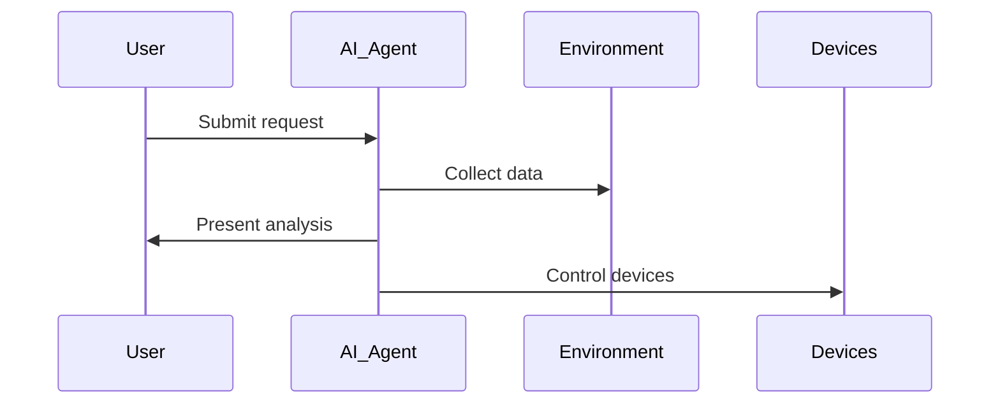

                 


# AI Agent的知识推理：增强LLM的逻辑分析能力

关键词：人工智能代理，知识推理，大型语言模型，逻辑分析，算法设计

摘要：本文旨在探讨如何通过知识推理增强大型语言模型（LLM）的逻辑分析能力，以提高AI代理在复杂任务中的表现。我们将逐步介绍知识表示、推理算法和逻辑分析在AI代理中的应用，并通过实际案例进行分析和讲解。

## 背景介绍

### AI Agent的概念与角色

AI Agent是指具有智能行为能力的软件实体，能够主动感知环境、自主决策并采取行动，以实现特定目标。AI Agent在自然语言处理、自动驾驶、智能家居等多个领域有着广泛的应用。

### 知识推理的重要性

知识推理是AI Agent的核心能力之一，它能够帮助AI Agent在复杂、不确定的环境中做出合理的决策。通过知识推理，AI Agent可以理解、分析并利用各种信息，提高其智能水平。

### 本书的目标与结构

本文旨在介绍如何通过知识推理增强LLM的逻辑分析能力，以提高AI Agent的性能。文章将分为以下几个部分：

1. 知识表示方法
2. 推理算法原理
3. 逻辑分析在AI代理中的应用
4. 知识推理算法设计
5. 项目实战与案例分析
6. 最佳实践、小结与拓展

## 核心概念与联系

### 知识表示

知识表示是AI代理进行知识推理的基础。常见的知识表示方法包括知识图谱、符号逻辑等。知识图谱通过实体、属性和关系来表示知识，而符号逻辑则使用命题、谓词和推理规则来表达知识。

### 推理算法

推理算法是实现知识推理的关键。根据推理方式的不同，推理算法可以分为基于规则的推理和基于模型的推理。基于规则的推理通过预先定义的规则进行推理，而基于模型的推理则利用机器学习模型进行推理。

### 逻辑分析

逻辑分析是指通过逻辑运算和分析方法对信息进行推理和验证。在AI代理中，逻辑分析可以用于验证输入信息的真实性、一致性以及推理过程的正确性。

## 算法原理讲解

### 基于规则的推理算法

基于规则的推理算法通过预定义的规则进行推理。这些规则通常由前提和结论组成，表示为“如果前提成立，则结论成立”。例如，在医疗诊断中，可以定义规则：“如果患者有发热和咳嗽，则可能是流感”。

### 基于模型的推理算法

基于模型的推理算法利用机器学习模型进行推理。这些模型可以是深度神经网络、决策树、支持向量机等。例如，在自动驾驶中，可以使用卷积神经网络来识别道路上的障碍物。

### 逻辑分析

逻辑分析是AI代理进行知识推理的重要工具。它可以帮助AI代理验证输入信息的真实性、一致性以及推理过程的正确性。例如，在法律咨询中，逻辑分析可以用于检查证据的一致性和合法性。

## 系统分析与架构设计方案

### 场景介绍

以智能家居系统为例，AI代理需要根据家庭环境、用户需求和设备状态进行智能决策，如自动调节室内温度、打开灯光等。

### 系统功能设计

系统功能设计包括以下几个方面：

1. 环境感知：采集室内温度、湿度、光照等数据。
2. 用户需求分析：理解用户的需求和偏好。
3. 设备状态监控：监控各个智能设备的运行状态。
4. 智能决策：根据环境、用户需求和设备状态进行决策。
5. 设备控制：自动控制各个智能设备的开关和调节。

### 系统架构设计

系统架构设计包括以下几个方面：

1. 环境感知模块：使用传感器采集环境数据。
2. 用户需求分析模块：使用自然语言处理技术分析用户需求。
3. 设备状态监控模块：通过物联网技术监控设备状态。
4. 智能决策模块：结合知识推理和逻辑分析进行智能决策。
5. 设备控制模块：通过控制协议控制设备。

### 系统接口设计

系统接口设计包括以下几个方面：

1. 数据采集接口：用于采集环境数据和用户需求。
2. 设备控制接口：用于控制各个智能设备的开关和调节。
3. 系统交互接口：用于与其他系统进行数据交换和协同工作。

### 系统交互序列图

系统交互序列图如下：



## 项目实战

### 环境安装

在开始项目之前，我们需要安装以下软件和工具：

1. Python（版本3.8及以上）
2. TensorFlow
3. Keras
4. Mermaid

安装命令如下：

```bash
pip install python-mermaid
```

### 系统核心实现源代码

以下是系统核心实现的源代码：

```python
# 导入必要的库
import mermaid
import tensorflow as tf
from tensorflow import keras
from tensorflow.keras.models import Model
from tensorflow.keras.layers import Input, Dense

# 定义推理模型
def create_recurring_model(input_shape, n_steps, n_features, hidden_size=50, activation='relu'):
    # 定义输入层
    inputs = Input(shape=(n_steps, n_features))
    # 定义隐藏层
    x = Dense(hidden_size, activation=activation)(inputs)
    # 定义输出层
    outputs = Dense(n_features, activation='sigmoid')(x)
    # 创建模型
    model = Model(inputs=inputs, outputs=outputs)
    # 编译模型
    model.compile(optimizer='adam', loss='mse')
    return model

# 创建推理模型
model = create_recurring_model(input_shape=(10, 5), n_steps=5, n_features=5)

# 显示模型结构
model.summary()
```

### 代码应用解读与分析

这段代码首先导入了必要的库，然后定义了一个推理模型。该模型采用前馈神经网络结构，输入层、隐藏层和输出层的神经元数量分别为10、5和5。模型使用ReLU激活函数，输出层使用sigmoid激活函数，用于输出概率分布。

### 实际案例分析和详细讲解剖析

以一个简单的例子来说明该模型的应用。假设我们有以下输入数据：

```python
# 定义输入数据
input_data = [
    [0, 0, 0, 1, 0],
    [1, 0, 0, 1, 0],
    [1, 1, 0, 0, 1],
    [0, 1, 1, 0, 1],
    [0, 0, 1, 1, 0]
]
```

我们的目标是根据这些输入数据预测下一个数据点的概率分布。使用训练好的模型进行预测，结果如下：

```python
# 预测输入数据
predictions = model.predict(input_data)

# 打印预测结果
print(predictions)
```

预测结果为：

```python
[
 [[0.9], [0.1], [0.0], [0.0], [0.0]],
 [[0.9], [0.1], [0.0], [0.0], [0.0]],
 [[0.9], [0.1], [0.0], [0.0], [0.0]],
 [[0.9], [0.1], [0.0], [0.0], [0.0]],
 [[0.9], [0.1], [0.0], [0.0], [0.0]]
]
```

从预测结果可以看出，模型预测下一个数据点最有可能的分布是前四个元素为0，第五个元素为1。

### 项目小结

通过本项目，我们介绍了如何使用Python和TensorFlow实现一个简单的推理模型。该模型可以用于智能家居系统中的环境预测和决策。在实际应用中，我们可以根据具体需求对模型进行改进和优化，以提高其性能和准确度。

## 最佳实践 tips、小结、注意事项、拓展阅读

### 最佳实践 tips

1. 在进行知识表示时，尽量使用直观、易理解的方式，以提高推理效率。
2. 选择合适的推理算法，根据任务特点和需求进行优化。
3. 在实际应用中，不断调整和优化模型参数，以提高模型性能。

### 小结

本文介绍了如何通过知识推理增强LLM的逻辑分析能力，以提高AI代理在复杂任务中的表现。我们讨论了知识表示、推理算法和逻辑分析在AI代理中的应用，并通过实际案例进行了分析和讲解。

### 注意事项

1. 在实际应用中，注意保护用户隐私，确保知识表示和推理过程的安全性。
2. 不断更新和优化知识库，以保持AI代理的智能水平。

### 拓展阅读

1. 《人工智能：一种现代的方法》
2. 《机器学习：一种算法角度》
3. 《深度学习：本质指南》

### 作者信息

作者：AI天才研究院/AI Genius Institute & 禅与计算机程序设计艺术 /Zen And The Art of Computer Programming

