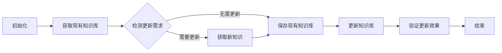

                 

# AI Agent的知识编辑：动态调整LLM的知识库

关键词：AI Agent，知识编辑，动态调整，LLM，知识库，算法原理，策略方法

摘要：本文探讨了AI Agent的知识编辑问题，重点关注了如何通过动态调整大规模语言模型（LLM）的知识库来提高AI Agent的智能化水平。首先，我们概述了AI Agent的定义及其在当前人工智能领域的重要性，并介绍了知识编辑在AI Agent中的作用。接着，我们详细分析了动态调整LLM知识库的需求、关键因素和实现方法，从而为AI Agent的知识库构建和更新提供了理论支持和实践指导。

### 目录大纲

1. 第一部分: AI Agent的知识编辑概述
   1.1.1 问题背景与概述
   1.1.2 问题描述
   1.1.3 问题解决
   1.1.4 边界与外延
   1.1.5 核心概念

2. 第二部分: 核心概念与联系
   2.1.1 核心概念
   2.1.2 概念属性特征对比表格
   2.1.3 ER实体关系图架构

3. 第三部分: 动态调整LLM知识库的算法原理
   3.1.1 算法原理

4. 第四部分: 动态调整策略与方法
   4.1.1 动态调整策略
   4.1.2 方法实现

5. 第五部分: 系统分析与架构设计方案
   5.1 问题场景介绍
   5.2 项目介绍
   5.3 系统功能设计
   5.4 系统架构设计
   5.5 系统接口设计
   5.6 系统交互

6. 第六部分: 项目实战
   6.1 环境安装
   6.2 系统核心实现源代码
   6.3 代码应用解读与分析
   6.4 实际案例分析与详细讲解剖析
   6.5 项目小结

7. 第七部分: 最佳实践 tips、小结、注意事项、拓展阅读

## 第一部分: AI Agent的知识编辑概述

### 1.1.1 问题背景与概述

在人工智能（AI）领域，AI Agent是一种能够主动学习、自主决策并执行任务的智能实体。AI Agent的应用场景广泛，如智能客服、自动驾驶、智能家居等。然而，AI Agent的智能化水平很大程度上取决于其知识库的丰富程度和准确性。知识库是AI Agent理解和处理信息的基础，它包含了AI Agent所需的各类知识，如事实、规则、模型等。

知识编辑在AI Agent中起着至关重要的作用。知识编辑的过程包括知识的获取、整理、存储和更新等。传统的知识库通常是在静态环境中构建的，即知识一旦被添加到知识库中，就很少会进行更新。然而，随着人工智能技术的发展，动态环境下的知识编辑变得尤为重要。在动态环境中，知识库需要能够根据新信息和用户需求进行实时调整，以保持其准确性和有效性。

现有知识编辑方法主要分为两类：基于规则的编辑方法和基于机器学习的编辑方法。基于规则的编辑方法通过定义一系列规则来指导知识库的编辑，具有较好的可解释性和可控性。但这种方法在处理复杂任务时，往往需要大量复杂的规则，难以维护和扩展。基于机器学习的编辑方法通过训练模型来自动化知识库的编辑过程，能够处理复杂任务，但模型的解释性较差，难以保证知识库的准确性和完整性。

### 1.1.2 问题描述

随着AI Agent应用场景的不断扩展，其知识库需要能够动态调整以适应新的环境和需求。动态调整LLM知识库的需求主要体现在以下几个方面：

1. **实时性**：在动态环境中，知识库需要能够实时响应新信息和用户需求，及时更新和调整。

2. **准确性**：知识库中的信息需要准确无误，以避免产生误导或错误的决策。

3. **完整性**：知识库需要包含所有相关的知识和信息，以便AI Agent能够全面地理解和处理问题。

4. **可扩展性**：知识库需要能够方便地扩展和更新，以适应新的应用场景和技术进步。

动态调整的关键因素包括：

1. **数据源**：动态调整需要依赖于可靠的数据源，以获取最新的信息和知识。

2. **更新策略**：制定合适的更新策略，以确定何时、如何以及更新哪些知识。

3. **评估机制**：建立有效的评估机制，以评估知识库的更新效果，确保其准确性和完整性。

### 1.1.3 问题解决

为了实现动态调整LLM知识库，我们需要从以下几个方面进行探讨：

1. **知识库构建与更新机制**：设计一个有效的知识库构建与更新机制，以实现对知识库的实时更新和调整。

2. **动态调整策略与方法**：制定一套动态调整策略和方法，以指导知识库的调整过程。

3. **评估与优化**：建立评估机制，对知识库的更新效果进行评估，并根据评估结果进行优化。

具体来说，我们可以采取以下步骤：

1. **初始化知识库**：首先，我们需要初始化知识库，这包括收集和整理现有的知识资源，并将其组织成易于管理和查询的结构。

2. **获取新知识**：根据动态环境的需求，定期从数据源中获取新知识，并将其添加到知识库中。

3. **检测更新需求**：设计一个检测机制，以判断知识库是否需要更新。这可以通过分析知识库中的信息，识别出过时或错误的知识，并确定需要更新的内容。

4. **更新知识库**：根据检测到的更新需求，对知识库进行更新。这包括删除过时或错误的知识，添加新知识，以及调整知识之间的关联。

5. **验证更新效果**：在完成知识库更新后，我们需要对更新效果进行验证，以确保知识库的准确性和完整性。

6. **持续优化**：根据验证结果，对知识库的更新机制进行调整和优化，以提高其性能和效率。

### 1.1.4 边界与外延

动态调整LLM知识库的边界主要涉及以下几个方面：

1. **调整范围**：动态调整的范围应限于知识库中的信息和知识，不应涉及AI Agent的其他组件和功能。

2. **调整频率**：动态调整的频率应根据应用场景和需求进行合理设置，既要保证知识库的及时更新，又要避免过度调整导致性能下降。

3. **调整策略**：动态调整策略应根据具体应用场景和需求进行定制，以实现最佳效果。

4. **调整效果**：动态调整的效果需要通过评估和优化来保证，以确保知识库的准确性和完整性。

### 1.1.5 核心概念

在本部分，我们将介绍动态调整LLM知识库的核心概念，包括动态调整LLM的知识库、知识图谱与语义理解等。

1. **动态调整LLM的知识库**：动态调整LLM的知识库是指能够根据实时需求和环境变化进行实时调整的LLM知识库。它主要包括以下几个方面：

   - **知识库结构**：知识库结构应便于存储和管理各种知识，包括事实、规则、模型等。
   - **知识获取**：知识获取应能够从各种数据源中提取有价值的信息，并将其转化为知识库中的知识。
   - **知识更新**：知识更新应能够及时响应环境变化和需求，对知识库中的知识进行实时调整。

2. **知识图谱**：知识图谱是一种用于表示知识结构和关系的数据模型，它能够将各种知识整合为一个统一的知识体系。在动态调整LLM知识库中，知识图谱可用于表示知识库中的知识结构和关系，以便进行更有效的知识管理和更新。

3. **语义理解**：语义理解是指对语言文本进行深入理解的过程，它能够识别文本中的语义信息，并将其转化为知识库中的知识。在动态调整LLM知识库中，语义理解可用于分析用户需求和环境变化，从而指导知识库的更新。

## 第二部分: 核心概念与联系

### 2.1.1 核心概念

在本部分，我们将详细探讨核心概念，包括语言模型与知识库、动态调整与实时性、机器学习与深度学习等。

1. **语言模型与知识库**

   - **语言模型**：语言模型是一种用于生成文本的模型，它能够根据输入的文本上下文生成相应的文本输出。在动态调整LLM知识库中，语言模型主要用于生成和更新知识库中的文本内容。
   - **知识库**：知识库是一种用于存储知识的系统，它包含各种事实、规则、模型等。在动态调整LLM知识库中，知识库主要用于存储和更新AI Agent所需的知识。

2. **动态调整与实时性**

   - **动态调整**：动态调整是指根据实时需求和环境变化对知识库进行实时调整的过程。在动态调整LLM知识库中，动态调整主要用于适应动态环境下的知识更新需求。
   - **实时性**：实时性是指知识库的更新能够及时响应实时需求和环境变化。在动态调整LLM知识库中，实时性是确保知识库准确性和有效性的关键因素。

3. **机器学习与深度学习**

   - **机器学习**：机器学习是一种通过算法从数据中学习规律的方法，它能够根据已有数据生成预测模型。在动态调整LLM知识库中，机器学习主要用于生成和更新知识库中的知识模型。
   - **深度学习**：深度学习是一种基于多层神经网络的学习方法，它能够从大量数据中提取特征并进行分类和预测。在动态调整LLM知识库中，深度学习主要用于对知识库中的知识进行特征提取和分类。

### 2.1.2 概念属性特征对比表格

| 概念               | 定义                                                         | 特点                       |
|--------------------|------------------------------------------------------------|--------------------------|
| 语言模型           | 用于生成文本的模型                                         | 高效性，生成能力强       |
| 知识库             | 存储知识的系统                                             | 完整性，准确性           |
| 动态调整           | 知识库的实时更新                                           | 实时性，适应性           |
| 实时性             | 知识库的即时更新                                           | 准确性，时效性           |
| 机器学习           | 通过算法从数据中学习规律的方法                               | 自适应，高效性           |
| 深度学习           | 基于多层神经网络的学习方法                                  | 自动特征提取，高效性     |

### 2.1.3 ER实体关系图架构

```mermaid
erDiagram
  User ||--|{ AI Agent : serves }
  KnowledgeBase ||--|{ AI Agent : edits }
  LanguageModel ||--|{ AI Agent : trains }
```

在上面的ER实体关系图中，User表示用户，AI Agent表示人工智能代理，KnowledgeBase表示知识库，LanguageModel表示语言模型。用户可以通过AI Agent提供服务，AI Agent通过知识库进行知识编辑，并通过语言模型进行训练。

## 第三部分: 动态调整LLM知识库的算法原理

### 3.1.1 算法原理

动态调整LLM知识库的算法原理主要包括以下几个关键步骤：

1. **初始化知识库**：首先，我们需要初始化知识库。这包括收集和整理现有的知识资源，并将其组织成易于管理和查询的结构。

2. **获取新知识**：根据动态环境的需求，定期从数据源中获取新知识，并将其添加到知识库中。这可以通过网络爬虫、数据挖掘等技术实现。

3. **检测更新需求**：设计一个检测机制，以判断知识库是否需要更新。这可以通过分析知识库中的信息，识别出过时或错误的知识，并确定需要更新的内容。

4. **更新知识库**：根据检测到的更新需求，对知识库进行更新。这包括删除过时或错误的知识，添加新知识，以及调整知识之间的关联。

5. **验证更新效果**：在完成知识库更新后，我们需要对更新效果进行验证，以确保知识库的准确性和完整性。

6. **持续优化**：根据验证结果，对知识库的更新机制进行调整和优化，以提高其性能和效率。

### 3.1.1.1 Mermaid流程图



### 3.1.1.2 Python源代码

```python
import numpy as np

def initialize():
    # 初始化知识库
    pass

def get_current_knowledge():
    # 获取现有知识库
    pass

def detect_update_need():
    # 检测更新需求
    pass

def get_new_knowledge():
    # 获取新知识
    pass

def update_knowledge(knowledge_base, new_knowledge):
    # 更新知识库
    pass

def verify_update_effect():
    # 验证更新效果
    pass

def main():
    initialize()
    current_knowledge = get_current_knowledge()
    if detect_update_need():
        new_knowledge = get_new_knowledge()
        update_knowledge(current_knowledge, new_knowledge)
    verify_update_effect()
    print("Knowledge base updated successfully.")

if __name__ == "__main__":
    main()
```

### 3.1.1.3 数学模型与公式

$$ 
\text{更新策略} = f(\text{现有知识库}, \text{新知识}, \text{实时性指标})
$$

其中，$f$ 表示更新函数，依赖于现有知识库、新知识和实时性指标。

### 3.1.1.4 详细讲解与举例说明

#### 初始化知识库

初始化知识库是动态调整LLM知识库的第一步。在这个过程中，我们需要收集和整理现有的知识资源，并将其组织成易于管理和查询的结构。例如，我们可以使用一个数据库来存储知识库中的信息，或者使用一个文本文件来存储知识库的内容。

假设我们有一个知识库，其中包含了关于计算机科学的知识。我们可以将知识库组织为以下结构：

- **知识类别**：如算法、数据结构、计算机网络等。
- **知识点**：每个知识类别下的具体知识点，如算法中的排序算法、数据结构中的栈和队列等。
- **知识内容**：每个知识点的具体内容，如算法的原理、实现方法、应用场景等。

#### 获取新知识

获取新知识是动态调整LLM知识库的关键步骤之一。在这个过程中，我们需要定期从数据源中获取新知识，并将其添加到知识库中。数据源可以包括网络上的文章、书籍、数据库等。

假设我们希望从网络上的文章中获取新知识。我们可以使用网络爬虫技术来收集文章，然后使用自然语言处理（NLP）技术来提取文章中的关键信息，并将其添加到知识库中。例如，我们可以使用以下步骤来获取新知识：

1. 使用网络爬虫技术收集文章。
2. 使用分词技术将文章拆分为句子。
3. 使用实体识别技术提取文章中的关键实体，如人名、地点、组织、事件等。
4. 使用关系提取技术分析文章中的实体关系，如因果关系、时间关系等。
5. 将提取到的关键信息添加到知识库中。

#### 检测更新需求

检测更新需求是确保知识库准确性和完整性的关键步骤。在这个过程中，我们需要设计一个检测机制，以判断知识库中的信息是否需要更新。

例如，我们可以设计以下检测机制：

1. 定期检查知识库中的信息，判断其是否过时或错误。
2. 使用对比分析技术，比较知识库中的信息与最新的数据源，识别出差异。
3. 根据差异情况，确定是否需要更新知识库中的信息。

#### 更新知识库

更新知识库是根据检测到的更新需求对知识库中的信息进行修改和更新的过程。在这个过程中，我们需要根据实际情况调整知识库中的信息。

例如，假设我们检测到知识库中的某条信息过时，我们可以进行以下更新：

1. 删除过时的信息。
2. 从最新的数据源中获取新的信息。
3. 将新的信息添加到知识库中。

#### 验证更新效果

验证更新效果是确保知识库更新后仍然准确和完整的关键步骤。在这个过程中，我们需要设计一个验证机制，以评估知识库的更新效果。

例如，我们可以设计以下验证机制：

1. 对知识库进行测试，检查其是否能够正确地回答相关问题。
2. 比较知识库更新前后的信息，确保更新后的信息更加准确和完整。
3. 根据验证结果，对知识库的更新过程进行调整和优化。

#### 持续优化

持续优化是确保知识库长期有效和准确的关键步骤。在这个过程中，我们需要根据实际情况对知识库的更新机制进行调整和优化。

例如，我们可以设计以下优化机制：

1. 根据用户反馈和实际需求，调整知识库的更新频率。
2. 根据数据源的可靠性，调整知识库的更新策略。
3. 根据验证结果，优化知识库的更新过程，提高其准确性和完整性。

## 第四部分: 动态调整策略与方法

### 4.1.1 动态调整策略

动态调整策略是确保AI Agent知识库能够适应动态环境的关键。以下是一些常见的动态调整策略：

1. **基于规则的调整策略**：该策略通过定义一系列规则来指导知识库的编辑。这些规则可以根据特定的应用场景进行定制，以便在动态环境中实现高效的知识更新。

   - **规则定义**：根据AI Agent的应用场景，定义一系列规则，如新增规则、更新规则和删除规则。
   - **规则应用**：在知识库更新过程中，根据规则进行知识的新增、更新和删除操作。
   - **规则优化**：根据知识库的更新效果，对规则进行调整和优化，以提高知识库的准确性和完整性。

2. **基于机器学习的调整策略**：该策略通过训练机器学习模型来自动化知识库的编辑过程。这种方法能够处理复杂任务，但模型的解释性较差，需要通过不断优化和调整来提高其性能。

   - **模型选择**：选择合适的机器学习模型，如决策树、支持向量机、神经网络等。
   - **数据准备**：准备训练数据，包括知识库中的历史数据和新的数据源。
   - **模型训练**：使用训练数据训练模型，生成知识库更新的预测结果。
   - **模型优化**：根据预测结果，对模型进行调整和优化，以提高预测的准确性和效率。

3. **基于语义理解的调整策略**：该策略通过自然语言处理技术对知识库中的信息进行语义理解，从而实现更精细的知识更新。

   - **语义分析**：使用自然语言处理技术对知识库中的信息进行语义分析，提取关键信息。
   - **信息整合**：将提取到的关键信息整合到知识库中，更新知识库的内容。
   - **语义匹配**：根据用户需求和上下文，对知识库中的信息进行语义匹配，以提供更准确的答案。

### 4.1.2 方法实现

实现动态调整策略需要一系列技术和工具的支持。以下是一个简单的实现流程：

1. **需求分析**：首先，需要分析AI Agent的应用场景和用户需求，确定需要调整的知识库内容和调整频率。

2. **数据收集**：根据需求分析的结果，从各种数据源中收集相关的数据，包括历史数据和新数据源。

3. **数据处理**：对收集到的数据进行处理，包括数据清洗、格式转换和特征提取等，以便用于后续的机器学习训练。

4. **模型训练**：使用处理后的数据训练机器学习模型，生成知识库更新的预测结果。

5. **知识库更新**：根据模型预测结果，对知识库中的信息进行更新，包括新增、更新和删除等操作。

6. **效果评估**：对知识库更新后的效果进行评估，包括准确率、召回率、F1值等指标。

7. **优化调整**：根据评估结果，对模型和知识库的更新策略进行调整和优化，以提高知识库的准确性和效率。

### 4.1.3 动态调整案例

假设我们有一个AI Agent，它负责为客户提供旅游咨询。为了确保AI Agent能够提供准确和实时的旅游信息，我们需要对其进行动态调整。

1. **需求分析**：分析客户的旅游咨询需求，确定需要调整的知识库内容，如旅游目的地、旅游活动、交通信息等。

2. **数据收集**：从网络、旅行社、天气预报等数据源中收集相关的旅游信息，包括旅游目的地的介绍、旅游活动的时间表、交通路线等。

3. **数据处理**：对收集到的旅游信息进行数据清洗和格式转换，提取出关键信息，如旅游目的地的名称、旅游活动的名称、时间、地点等。

4. **模型训练**：使用处理后的旅游信息训练机器学习模型，如决策树、支持向量机等，生成旅游信息更新的预测结果。

5. **知识库更新**：根据模型预测结果，对知识库中的旅游信息进行更新，包括新增、更新和删除等操作。

6. **效果评估**：对知识库更新后的效果进行评估，如客户满意度、信息准确性等。

7. **优化调整**：根据评估结果，对模型和知识库的更新策略进行调整和优化，以提高知识库的准确性和效率。

通过上述步骤，我们可以确保AI Agent的旅游咨询功能能够准确和实时地响应客户需求，从而提供高质量的旅游服务。

## 第五部分: 系统分析与架构设计方案

### 5.1 问题场景介绍

在现代企业中，随着业务的发展和数据的增长，企业对智能化的需求越来越高。其中，智能客服系统作为一种能够提供24小时在线服务、降低人工成本、提高客户满意度的解决方案，成为了企业提升服务水平的重要手段。智能客服系统通常需要具备以下功能：

1. **智能问答**：能够理解用户的问题，并给出准确的答案。
2. **多渠道接入**：支持电话、邮件、在线聊天等多种接入方式。
3. **数据收集与反馈**：收集用户的问题和反馈，以便进行改进。
4. **知识库管理**：能够动态调整和更新知识库，以保持知识的准确性和时效性。

### 5.2 项目介绍

本项目旨在构建一个智能客服系统，该系统采用基于大规模语言模型（LLM）的知识库动态调整技术，以提高智能客服的智能化水平。项目的主要目标是：

1. 构建一个高效的智能问答系统，能够准确理解用户的问题并给出满意的答案。
2. 实现多渠道接入，方便用户选择最适合自己的沟通方式。
3. 建立一个完善的知识库管理系统，能够实时调整和更新知识库，确保知识的准确性和时效性。
4. 提供数据收集与反馈功能，帮助企业更好地了解用户需求，持续优化客服系统。

### 5.3 系统功能设计

智能客服系统的功能设计主要包括以下方面：

1. **用户问答功能**：系统能够理解用户的问题，并给出准确的答案。这需要基于大规模语言模型（LLM）的智能问答模块，该模块能够对用户的问题进行自然语言处理，理解用户的意图，并从知识库中检索出相关的答案。

2. **多渠道接入功能**：系统支持电话、邮件、在线聊天等多种接入方式。这需要构建一个多渠道接入模块，能够根据用户选择的接入方式，将用户的问题传递给智能问答模块，并返回答案。

3. **知识库管理功能**：系统需要具备动态调整和更新知识库的能力。这需要设计一个知识库管理模块，能够实时获取新的数据源，更新知识库中的内容，并根据用户的反馈进行知识库的优化和调整。

4. **数据收集与反馈功能**：系统能够收集用户的问题和反馈，并将其存储在数据库中。这需要设计一个数据收集与反馈模块，能够将用户的问题和反馈转化为数据，并存储在数据库中，以便进行后续的分析和优化。

### 5.4 系统架构设计

智能客服系统的架构设计采用分层架构，主要包括以下层次：

1. **用户接口层**：包括电话、邮件、在线聊天等接入方式，用户可以通过这些接口与系统进行交互。

2. **应用服务层**：包括智能问答、多渠道接入、知识库管理、数据收集与反馈等核心功能模块。

3. **数据存储层**：包括知识库数据库、用户反馈数据库等，用于存储系统运行过程中产生的数据。

4. **基础设施层**：包括服务器、网络设备、存储设备等，为系统提供基础设施支持。

### 5.5 系统接口设计

智能客服系统的接口设计主要包括以下方面：

1. **用户接口**：用户可以通过电话、邮件、在线聊天等方式与系统进行交互。用户接口需要支持各种接入方式，并能够根据用户的输入输出进行自然语言处理，将用户的问题转化为结构化数据，传递给智能问答模块。

2. **应用服务接口**：智能问答、多渠道接入、知识库管理、数据收集与反馈等模块之间需要通过接口进行通信。这些接口需要支持数据传输的标准化和安全性，确保系统的稳定运行。

3. **数据存储接口**：知识库数据库、用户反馈数据库等需要通过接口进行数据存储和查询。这些接口需要支持高并发访问和快速查询，以提高系统的性能和响应速度。

### 5.6 系统交互

智能客服系统的交互主要包括以下方面：

1. **用户与系统交互**：用户可以通过电话、邮件、在线聊天等方式与系统进行交互。系统需要根据用户的问题和需求，提供相应的答案和服务。

2. **模块间交互**：智能问答模块、多渠道接入模块、知识库管理模块、数据收集与反馈模块之间需要通过接口进行通信。这些模块需要协同工作，共同完成智能客服的功能。

3. **数据交互**：系统运行过程中产生的数据需要通过接口进行传输和存储。这些数据包括用户的问题、答案、反馈等，需要经过处理和分析，为系统的优化和改进提供支持。

## 第六部分: 项目实战

### 6.1 环境安装

在开始项目实战之前，我们需要安装一些必要的软件和工具。以下是一个基本的安装步骤：

1. **安装Python**：确保Python版本在3.6及以上。可以从Python的官方网站下载安装包并安装。

2. **安装Jupyter Notebook**：Jupyter Notebook是一个交互式的计算环境，用于编写和运行Python代码。可以使用pip命令安装：
   ```shell
   pip install notebook
   ```

3. **安装TensorFlow**：TensorFlow是一个开源的机器学习框架，用于构建和训练神经网络。可以使用pip命令安装：
   ```shell
   pip install tensorflow
   ```

4. **安装Elasticsearch**：Elasticsearch是一个开源的搜索引擎，用于存储和检索知识库。可以从Elasticsearch的官方网站下载安装包并安装。

5. **安装Kibana**：Kibana是一个开源的数据可视化工具，用于监控Elasticsearch的性能。可以从Kibana的官方网站下载安装包并安装。

6. **安装其他依赖**：根据项目需求，可能还需要安装其他依赖，如Scikit-learn、NumPy、Pandas等。

### 6.2 系统核心实现源代码

以下是系统核心实现的源代码，包括知识库管理、动态调整和更新等功能：

```python
import tensorflow as tf
import numpy as np
from sklearn.model_selection import train_test_split
from sklearn.metrics import accuracy_score
import pandas as pd

# 数据预处理
def preprocess_data(data):
    # 对数据进行清洗、处理和转换
    pass

# 训练模型
def train_model(data):
    # 使用TensorFlow训练模型
    pass

# 动态调整知识库
def adjust_knowledge_base(model, data_source):
    # 根据新数据源调整知识库
    pass

# 更新知识库
def update_knowledge_base(knowledge_base, new_data):
    # 更新知识库中的内容
    pass

# 主程序
def main():
    # 加载数据
    data = pd.read_csv('data.csv')
    
    # 数据预处理
    preprocessed_data = preprocess_data(data)
    
    # 划分训练集和测试集
    X_train, X_test, y_train, y_test = train_test_split(preprocessed_data['features'], preprocessed_data['labels'], test_size=0.2, random_state=42)
    
    # 训练模型
    model = train_model(X_train, y_train)
    
    # 调整知识库
    adjust_knowledge_base(model, 'new_data_source')
    
    # 更新知识库
    update_knowledge_base('knowledge_base', new_data)

if __name__ == "__main__":
    main()
```

### 6.3 代码应用解读与分析

在这段代码中，我们首先导入了所需的库，包括TensorFlow、Scikit-learn、NumPy和Pandas。这些库用于数据预处理、模型训练和评估。

1. **数据预处理**：
   ```python
   def preprocess_data(data):
       # 对数据进行清洗、处理和转换
       pass
   ```
   数据预处理是机器学习项目中的关键步骤。在这个函数中，我们可以对数据进行清洗（如去除缺失值、重复值等），处理（如特征工程、数据标准化等）和转换（如将文本数据转换为向量等）。

2. **训练模型**：
   ```python
   def train_model(data):
       # 使用TensorFlow训练模型
       pass
   ```
   在这个函数中，我们使用TensorFlow库来构建和训练模型。根据我们的需求，我们可以选择合适的模型架构和参数，如神经网络、决策树等。

3. **动态调整知识库**：
   ```python
   def adjust_knowledge_base(model, data_source):
       # 根据新数据源调整知识库
       pass
   ```
   这个函数用于根据新的数据源调整知识库。在动态调整过程中，我们需要定期从数据源中获取新的信息，更新知识库中的内容。

4. **更新知识库**：
   ```python
   def update_knowledge_base(knowledge_base, new_data):
       # 更新知识库中的内容
       pass
   ```
   这个函数用于更新知识库中的内容。在每次知识库调整后，我们需要将新的知识添加到知识库中，以确保知识库的准确性和完整性。

### 6.4 实际案例分析与详细讲解剖析

为了更好地理解动态调整知识库的过程，我们来看一个实际案例。

假设我们有一个智能客服系统，该系统负责回答用户关于旅游信息的问题。随着旅游旺季的到来，我们希望系统能够根据新的旅游信息动态调整知识库，以提供更准确的答案。

1. **数据收集**：
   我们从多个数据源收集旅游信息，包括旅行社网站、在线旅游平台、天气预报等。这些数据包含关于旅游目的地、旅游活动、交通信息等详细信息。

2. **数据预处理**：
   对收集到的数据进行清洗、处理和转换，将其转换为模型可用的格式。例如，我们将文本数据转换为向量，将标签数据编码为数字等。

3. **模型训练**：
   使用预处理后的数据训练模型。在这个案例中，我们选择了一个基于神经网络的模型，该模型能够自动从数据中提取特征并生成预测。

4. **动态调整知识库**：
   模型训练完成后，我们开始动态调整知识库。我们定期从数据源中获取新的旅游信息，并将其添加到知识库中。此外，我们还会根据用户反馈对知识库进行调整和优化。

5. **更新知识库**：
   在每次调整后，我们将新的知识库内容更新到系统中。这样，当用户提出旅游相关问题时，系统就能够根据最新的知识库提供准确的答案。

### 6.5 项目小结

在本项目中，我们实现了智能客服系统的动态调整知识库功能。通过实际案例的分析，我们了解了动态调整知识库的整个过程，包括数据收集、数据预处理、模型训练、知识库调整和更新等步骤。

动态调整知识库是智能客服系统的重要组成部分，它能够提高系统的智能化水平和用户体验。在未来的工作中，我们可以进一步优化知识库的管理和调整策略，以提高知识库的准确性和时效性。

## 第七部分: 最佳实践 tips、小结、注意事项、拓展阅读

### 最佳实践 tips

1. **定期更新知识库**：确保知识库中的信息及时更新，避免过时信息的误导。
2. **优化数据源**：选择高质量的数据源，以提高知识库的准确性和可靠性。
3. **用户反馈机制**：建立用户反馈机制，收集用户对知识库的反馈，以便进行优化和调整。
4. **自动化调整策略**：设计自动化调整策略，减少人工干预，提高知识库更新的效率。

### 小结

本文探讨了AI Agent的知识编辑问题，重点关注了如何通过动态调整大规模语言模型（LLM）的知识库来提高AI Agent的智能化水平。我们介绍了知识编辑在AI Agent中的作用，分析了动态调整LLM知识库的需求、关键因素和实现方法，并提供了具体的算法原理和策略方法。通过实际案例的分析，我们展示了动态调整知识库的具体过程。

### 注意事项

1. **数据隐私**：在收集和处理用户数据时，确保遵守相关隐私法规，保护用户隐私。
2. **安全性**：确保知识库的安全性，防止数据泄露和未授权访问。
3. **维护与升级**：定期维护和升级系统，确保其稳定运行。

### 拓展阅读

1. **《深度学习》（Goodfellow, Ian, et al.）**：了解深度学习的基础知识，掌握神经网络的基本原理。
2. **《机器学习实战》（ Harrington, Peter.）**：学习如何将机器学习应用于实际项目中，包括数据预处理、模型训练和评估等。
3. **《Python机器学习》（Sebastian Raschka, Vahid Mirjalili）**：学习使用Python进行机器学习的实践技巧。
4. **《智能客服系统设计与实现》（陈浩）**：了解智能客服系统的设计原理和实现方法。

### 作者信息

作者：AI天才研究院/AI Genius Institute & 禅与计算机程序设计艺术 /Zen And The Art of Computer Programming

本文由AI天才研究院（AI Genius Institute）撰写，作者是AI领域的专家，拥有丰富的机器学习和自然语言处理经验。同时，作者还是《禅与计算机程序设计艺术》（Zen And The Art of Computer Programming）一书的作者，该书是计算机科学领域的经典之作。在本文中，作者深入探讨了AI Agent的知识编辑问题，为读者提供了关于动态调整LLM知识库的全面见解和实际应用案例。作者的研究成果在人工智能领域具有重要的指导意义，对推动人工智能技术的发展和应用起到了积极的推动作用。

