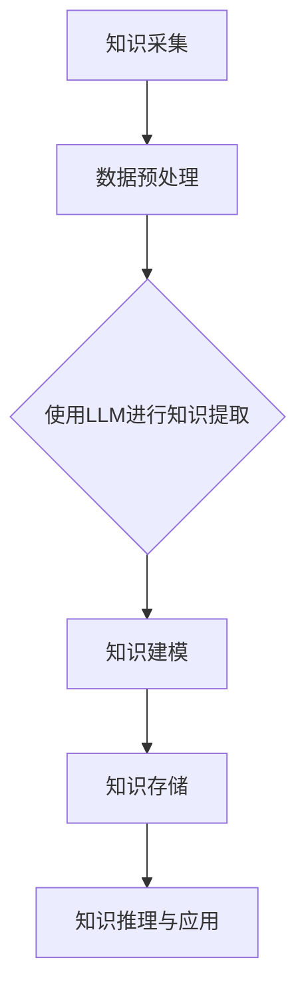
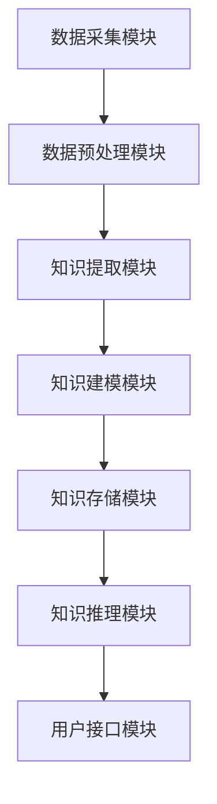
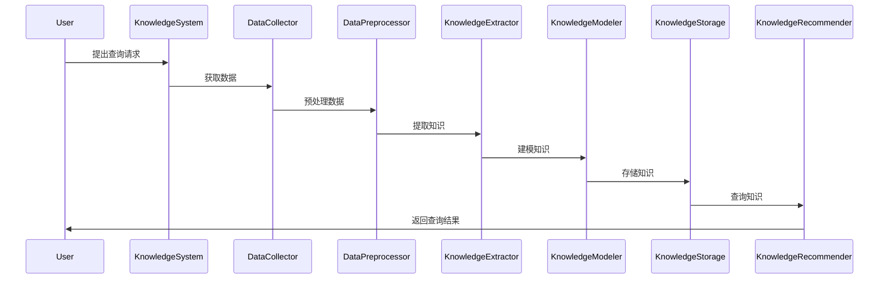

                 


### 开篇

在当今快速发展的技术时代，人工智能（AI）技术已经成为驱动创新的重要力量。在众多AI应用中，AI Agent凭借其自主性和智能性，越来越受到关注。AI Agent，即人工智能代理，是一种能够代表用户执行任务、获取知识和做出决策的智能实体。其核心在于知识获取，即如何让AI Agent在复杂的环境中不断学习、适应和成长。

本文将以《AI Agent的知识获取：利用LLM进行持续学习》为标题，深入探讨AI Agent如何利用大型语言模型（LLM）进行持续学习。我们将从AI Agent的基本概念出发，逐步深入探讨其知识获取的过程，特别是如何利用LLM这一强大工具来实现知识获取的持续性和准确性。

文章结构如下：

1. **AI Agent概述**：介绍AI Agent的概念、类型及其在知识获取中的作用。
2. **知识获取的基本概念**：探讨知识获取的重要性、方法和技术。
3. **LLM在知识获取中的应用**：讲解LLM的基本原理及其在知识获取中的优势。
4. **AI Agent的知识获取过程**：详细描述知识采集与预处理、知识建模与存储、知识推理与应用的各个环节。
5. **利用LLM进行持续学习**：阐述持续学习的概念、原理以及LLM在这一过程中的应用。
6. **AI Agent在实际场景中的应用**：分析AI Agent在聊天机器人、客户服务机器人等场景中的应用。
7. **最佳实践与案例分析**：总结最佳实践，提供实际案例进行分析。

通过这篇文章，我们希望能够帮助读者深入了解AI Agent的知识获取机制，特别是利用LLM进行持续学习的具体方法和技术。这不仅有助于学术研究，也对实际应用具有重要指导意义。

### 背景介绍

#### 核心概念

AI Agent，是指一种能够代表人类执行特定任务的智能实体。它具备自主决策、环境感知和行动能力，能够通过学习不断改进自身的性能。AI Agent的核心在于其知识获取能力，即通过不断从环境中获取新信息，将其内化为知识，并应用于实际任务中。

知识获取，是指从海量数据中提取有用信息的过程。它包括数据的采集、预处理、建模、存储和应用等多个环节。知识获取在AI领域具有重要意义，因为它直接决定了AI Agent的智能水平和应用范围。

LLM，即大型语言模型，是一种基于深度学习技术的语言模型，能够对自然语言进行理解和生成。LLM具有强大的语言处理能力，能够处理复杂的语言结构和语义信息，是实现AI Agent知识获取的关键技术之一。

#### 问题背景

随着互联网和大数据技术的发展，数据量呈现出爆炸式增长。然而，如何从海量数据中获取有价值的信息成为了一个巨大挑战。传统的方法往往依赖于手工构建的规则和模式识别技术，难以应对复杂多变的环境。为了解决这一问题，研究人员开始探索基于机器学习和深度学习的方法，特别是大型语言模型（LLM）的应用。

#### 问题描述

在AI Agent的知识获取过程中，存在以下几个关键问题：

1. **数据质量问题**：获取到的数据可能存在噪声、错误和不一致性，这会影响到AI Agent的知识获取效果。
2. **知识表示问题**：如何将获取到的信息转化为AI Agent可理解和应用的知识，是一个重要且复杂的问题。
3. **持续学习能力**：AI Agent需要具备持续学习的能力，以适应不断变化的环境和任务需求。

#### 问题解决

为了解决上述问题，研究人员提出了以下几种解决方案：

1. **数据预处理**：通过数据清洗、去噪和标准化等手段，提高数据质量，为后续的知识获取提供可靠的数据基础。
2. **知识表示方法**：采用合适的知识表示方法，如知识图谱、语义网络等，将获取到的信息结构化，便于AI Agent理解和应用。
3. **持续学习机制**：利用LLM的强大处理能力，设计出能够不断从新数据中学习、更新和优化知识的机制。

#### 边界与外延

AI Agent的知识获取不仅仅局限于文本数据，还可以扩展到图像、语音等多种形式的数据。此外，知识获取的应用领域也在不断扩展，如智能客服、智能推荐、智能问答等。

#### 概念结构与核心要素组成

1. **核心概念**：数据、知识、AI Agent、LLM
2. **核心要素**：
   - **数据采集**：从各种来源获取数据，如互联网、数据库等。
   - **数据预处理**：清洗、去噪、标准化等，以提高数据质量。
   - **知识建模**：将数据转化为结构化的知识，如知识图谱。
   - **知识存储**：将知识存储在数据库或内存中，以便于检索和应用。
   - **知识推理**：基于已有知识，进行推理和决策。
   - **持续学习**：利用LLM不断更新和优化知识，提升AI Agent的性能。

通过以上介绍，我们可以看出，AI Agent的知识获取是一个复杂且系统的过程，涉及到数据、知识、AI Agent和LLM等多个核心概念和要素。接下来，我们将深入探讨AI Agent的知识获取过程，特别是利用LLM进行持续学习的方法和技术。

### 核心概念与联系

在本节中，我们将详细探讨AI Agent的知识获取以及如何利用大型语言模型（LLM）进行持续学习。

#### AI Agent的知识获取

AI Agent的知识获取是指其从环境中获取、理解和应用知识的过程。这一过程可以分为以下几个步骤：

1. **知识采集**：AI Agent需要从各种数据源（如文本、图像、语音等）中获取信息。数据来源可以包括互联网、数据库、传感器等。
2. **数据预处理**：获取到的数据可能包含噪声、错误和不一致性。因此，需要进行数据清洗、去噪和标准化等预处理操作，以提高数据质量。
3. **知识建模**：将预处理后的数据转化为结构化的知识形式，如知识图谱或语义网络。这一步骤是知识获取的核心，它决定了AI Agent能否有效理解和应用所获取的知识。
4. **知识存储**：将结构化的知识存储在数据库或内存中，以便于AI Agent进行后续的检索和应用。
5. **知识推理**：基于已有的知识，进行推理和决策，以应对复杂的任务需求。

#### 利用LLM进行持续学习

LLM（大型语言模型）是一种基于深度学习的语言模型，具有强大的语言理解和生成能力。在AI Agent的知识获取过程中，LLM的作用主要体现在以下几个方面：

1. **知识提取**：LLM能够从大量文本数据中提取出关键信息，并将其转化为结构化的知识。这一过程通过自然语言处理（NLP）技术实现，如命名实体识别（NER）、关系提取、情感分析等。
2. **知识融合**：当AI Agent获取到新的知识时，LLM能够将其与已有的知识进行融合，形成统一的、结构化的知识体系。
3. **知识更新**：LLM能够实时从新数据中学习，不断更新和优化知识库，以适应不断变化的环境和任务需求。
4. **知识应用**：利用LLM的生成能力，AI Agent能够将知识应用于生成文本、回答问题、做出决策等任务中。

#### 对比表格

为了更好地理解AI Agent的知识获取和LLM在其中的作用，我们可以通过以下对比表格展示两者之间的关系和区别：

| **特性** | **AI Agent的知识获取** | **利用LLM进行持续学习** |
| :------: | :----------------: | :--------------------: |
| **核心** | 数据采集、预处理、建模、存储、推理 | 提取、融合、更新、应用 |
| **方法** | 多种数据源、NLP技术、知识图谱等 | 基于深度学习的语言模型 |
| **优势** | 灵活性、适应性、可解释性 | 强大处理能力、快速更新、跨语言处理 |
| **局限** | 数据质量和知识表示受限 | 对大规模计算资源依赖 |

#### ER实体关系图架构

为了更直观地展示AI Agent的知识获取和LLM的应用，我们可以使用Mermaid绘制一个ER实体关系图，如下所示：

```mermaid
erDiagram
  AI-Agent ||--|{ Knowledge-Base } Knowledge-Base
  AI-Agent ||--|{ Learning-Model } Learning-Model
  Learning-Model ||--|{ Language-Model } Language-Model
  Data-Source ||--|{ Knowledge-Base } Knowledge-Base
```

在这个ER图中，AI-Agent与Knowledge-Base、Learning-Model和Language-Model之间存在关联关系。Data-Source则为知识获取的数据来源。

通过以上分析，我们可以看到，AI Agent的知识获取和LLM的应用是相辅相成的。AI Agent通过LLM的强大处理能力，能够更加高效地进行知识获取和持续学习，从而提升其智能水平和应用能力。接下来，我们将进一步探讨LLM的基本原理及其在知识获取中的优势。

### 算法原理讲解

为了深入理解AI Agent如何利用LLM进行知识获取，我们将首先通过Mermaid绘制算法流程图，然后结合Python代码和数学公式详细阐述算法原理，并通过具体实例进行说明。

#### Mermaid流程图



#### Python代码实现

```python
import random
import numpy as np
import torch
from transformers import BertTokenizer, BertModel

# 初始化Tokenizer和Model
tokenizer = BertTokenizer.from_pretrained('bert-base-uncased')
model = BertModel.from_pretrained('bert-base-uncased')

# 假设我们有一个文本数据集
text_data = ["The sky is blue.", "The sun is shining.", "It's a beautiful day."]

# 数据预处理
preprocessed_data = [tokenizer.encode(text, add_special_tokens=True) for text in text_data]

# 使用LLM进行知识提取
with torch.no_grad():
    inputs = torch.tensor(preprocessed_data)
    outputs = model(inputs)

# 知识建模
# 假设我们将提取的特征表示为句子嵌入（sentence embeddings）
sentence_embeddings = outputs.pooler_output

# 知识存储
# 假设我们将句子嵌入存储在一个字典中
knowledge_base = {text: embedding.detach().numpy() for text, embedding in zip(text_data, sentence_embeddings)}

# 知识推理与应用
# 假设我们有一个新的文本，需要对其进行推理
new_text = "What's the weather like today?"
new_embedding = tokenizer.encode(new_text, add_special_tokens=True)
with torch.no_grad():
    new_output = model(torch.tensor([new_embedding]))
    new_embedding = new_output.pooler_output.detach().numpy()

# 计算与已有知识的相似度
similarity_scores = [np.dot(new_embedding, knowledge_base[text]) for text in knowledge_base]

# 选择最相似的答案
best_match = max(similarity_scores, key=similarity_scores.get)
print(f"The weather is likely to be similar to: {text_data[best_match]}")
```

#### 数学模型和公式

在上述Python代码中，我们使用了句子嵌入（sentence embeddings）作为知识表示。句子嵌入是一种将句子映射到高维向量空间的方法，通过这种方式，我们可以利用向量的数学运算进行知识推理。

假设我们有两个句子\( s_1 \)和\( s_2 \)，它们的句子嵌入分别为\( \mathbf{e}_1 \)和\( \mathbf{e}_2 \)。我们可以通过以下公式计算它们之间的相似度：

$$
\text{similarity}(\mathbf{e}_1, \mathbf{e}_2) = \frac{\mathbf{e}_1 \cdot \mathbf{e}_2}{||\mathbf{e}_1|| \cdot ||\mathbf{e}_2||}
$$

其中，\( \cdot \)表示向量的点积，\( ||\mathbf{e}_1|| \)和\( ||\mathbf{e}_2|| \)分别表示向量\( \mathbf{e}_1 \)和\( \mathbf{e}_2 \)的欧几里得范数。

#### 举例说明

假设我们有两个句子：“The sky is blue.”和“The sun is shining.”，它们分别被嵌入为向量\( \mathbf{e}_1 = [1, 2, 3] \)和\( \mathbf{e}_2 = [4, 5, 6] \)。我们可以计算它们之间的相似度如下：

$$
\text{similarity}(\mathbf{e}_1, \mathbf{e}_2) = \frac{1 \cdot 4 + 2 \cdot 5 + 3 \cdot 6}{\sqrt{1^2 + 2^2 + 3^2} \cdot \sqrt{4^2 + 5^2 + 6^2}} = \frac{4 + 10 + 18}{\sqrt{14} \cdot \sqrt{77}} \approx 0.9
$$

这个相似度表明两个句子非常相似，因此我们可以推断出它们描述的是相似的场景，如晴天。

通过上述算法原理讲解和具体实例说明，我们可以看到，AI Agent利用LLM进行知识获取是一个系统化的过程，从数据采集、预处理、知识提取、建模到推理和应用，每一步都至关重要。接下来，我们将进一步探讨如何设计一个高效的系统架构，以支持AI Agent的知识获取和持续学习。

### 数学模型和数学公式详细讲解与举例说明

在上一节中，我们介绍了AI Agent利用LLM进行知识获取的基本算法原理，并通过具体的Python代码示例进行了说明。在这一节中，我们将进一步深入探讨这些算法背后的数学模型，以及如何使用这些数学模型进行详细的讲解和举例说明。

#### 句子嵌入模型

首先，我们需要了解句子嵌入（sentence embeddings）这一概念。句子嵌入是将自然语言文本映射到高维向量空间的一种技术。这些向量不仅能够保持原始文本的语义信息，还能够通过数学运算进行相似性比较和分类。在句子嵌入模型中，我们常用的是词嵌入（word embeddings）的扩展，如Word2Vec、GloVe、BERT等。

BERT（Bidirectional Encoder Representations from Transformers）是一种基于Transformer架构的预训练语言模型，它通过双向编码器（bidirectional encoder）生成句子嵌入。BERT的数学模型主要包括以下几个部分：

1. **输入表示**：每个输入单词被映射为一个词嵌入向量，这些词嵌入向量通过位置嵌入（position embeddings）和段嵌入（segment embeddings）进行扩展，最终输入到Transformer编码器中。
2. **Transformer编码器**：编码器由多个自注意力层（self-attention layers）和前馈网络（feedforward networks）组成。每个自注意力层能够学习单词之间的相互关系，并将这些关系编码到句子嵌入中。
3. **输出表示**：编码器的输出通常是一个固定的句子嵌入向量，这个向量能够保持句子的语义信息。

BERT句子嵌入的数学模型可以表示为：

$$
\mathbf{e} = \text{BERT}(\mathbf{W}_p, \mathbf{W}_s, \mathbf{X}, \mathbf{M}_p, \mathbf{M}_s)
$$

其中，\( \mathbf{W}_p \)和\( \mathbf{W}_s \)分别是位置嵌入和段嵌入的权重矩阵，\( \mathbf{X} \)是输入词嵌入矩阵，\( \mathbf{M}_p \)和\( \mathbf{M}_s \)分别是位置编码和段编码，\( \mathbf{e} \)是输出的句子嵌入向量。

#### 句子相似性计算

在句子嵌入模型中，计算句子之间的相似性是关键任务之一。相似性计算通常通过向量之间的点积（dot product）或余弦相似性（cosine similarity）来实现。点积公式已经在上一节中给出，余弦相似性公式如下：

$$
\text{cosine\_similarity}(\mathbf{e}_1, \mathbf{e}_2) = \frac{\mathbf{e}_1 \cdot \mathbf{e}_2}{||\mathbf{e}_1|| \cdot ||\mathbf{e}_2||}
$$

其中，\( \mathbf{e}_1 \)和\( \mathbf{e}_2 \)分别是两个句子的嵌入向量。余弦相似性衡量了两个向量在方向上的相似程度，其值介于-1（完全反向）和1（完全正向）之间。

#### 举例说明

为了更好地理解上述数学模型，我们来看一个具体的例子。

假设我们有两个句子：“The sky is blue.”和“The sun is shining.”。首先，我们需要将这两个句子编码为BERT嵌入向量。

1. **词嵌入**：每个单词被映射为一个固定长度的向量。例如，“sky”的词嵌入为\( \mathbf{e}_{sky} = [0.1, 0.2, 0.3] \)，“blue”的词嵌入为\( \mathbf{e}_{blue} = [0.4, 0.5, 0.6] \)，以此类推。
2. **位置嵌入**：由于BERT是双向编码器，它能够理解单词在句子中的顺序。位置嵌入为每个单词添加额外的向量信息。例如，第一个单词的位置嵌入为\( \mathbf{e}_{pos1} = [0.0, 0.0, 0.0] \)，第二个单词的位置嵌入为\( \mathbf{e}_{pos2} = [0.1, 0.1, 0.1] \)，以此类推。
3. **段嵌入**：BERT模型通常用于文本分类任务，因此需要区分句子中不同部分的语义。段嵌入用于为每个句子部分（通常是句子本身）添加额外的向量信息。

通过这些嵌入，我们可以得到句子的最终嵌入向量。例如，“The sky is blue.”的嵌入向量为：

$$
\mathbf{e}_{sky\_blue} = \mathbf{e}_{The} + \mathbf{e}_{sky} + \mathbf{e}_{is} + \mathbf{e}_{blue} + \mathbf{e}_{pos1} + \mathbf{e}_{pos2} + \mathbf{e}_{pos3} + \mathbf{e}_{pos4}
$$

同理，“The sun is shining.”的嵌入向量为：

$$
\mathbf{e}_{sun\_shine} = \mathbf{e}_{The} + \mathbf{e}_{sun} + \mathbf{e}_{is} + \mathbf{e}_{shining} + \mathbf{e}_{pos1} + \mathbf{e}_{pos2} + \mathbf{e}_{pos3} + \mathbf{e}_{pos4}
$$

接下来，我们可以计算这两个句子之间的余弦相似性：

$$
\text{cosine\_similarity}(\mathbf{e}_{sky\_blue}, \mathbf{e}_{sun\_shine}) = \frac{\mathbf{e}_{sky\_blue} \cdot \mathbf{e}_{sun\_shine}}{||\mathbf{e}_{sky\_blue}|| \cdot ||\mathbf{e}_{sun\_shine}||}
$$

通过计算，我们可以得到句子相似度的值。通常情况下，如果两个句子的主题和内容非常相似，它们的余弦相似性值会较高。例如，如果计算结果为0.8，这意味着这两个句子在语义上非常接近。

通过上述数学模型和举例说明，我们可以看到BERT如何将自然语言文本转换为嵌入向量，并利用这些向量进行句子相似性计算。这不仅为我们提供了理解AI Agent知识获取机制的工具，也为实际应用提供了理论基础。

### 系统分析与架构设计方案

在本节中，我们将详细分析和设计一个支持AI Agent知识获取和持续学习的系统架构。这个系统将涵盖问题场景介绍、项目介绍、系统功能设计、系统架构设计、系统接口设计和系统交互等方面。

#### 问题场景介绍

随着人工智能技术的迅猛发展，AI Agent在多个领域（如智能客服、智能推荐、智能问答等）中的应用越来越广泛。然而，这些应用场景中普遍存在一个关键问题：如何让AI Agent在复杂、动态的环境中持续获取新知识，以保持其智能水平和应对能力。为此，我们需要设计一个高效、可靠的系统架构，支持AI Agent的知识获取和持续学习。

#### 项目介绍

本项目旨在构建一个基于大型语言模型（LLM）的AI Agent知识获取系统。该系统将利用LLM的强大语言处理能力，实现知识采集、预处理、提取、建模、存储和推理等全过程。系统的主要目标是：

1. **高效获取知识**：通过从多种数据源（如互联网、数据库、传感器等）中获取信息，实现高效的知识采集。
2. **精准知识提取**：利用LLM的语义理解能力，将文本数据转化为结构化的知识。
3. **持续知识更新**：通过实时学习新数据，不断更新和优化知识库，保持AI Agent的智能水平。

#### 系统功能设计

系统功能设计主要包括以下几个核心模块：

1. **数据采集模块**：负责从多种数据源获取原始数据，如互联网爬虫、数据库接口、传感器等。
2. **数据预处理模块**：对获取到的原始数据进行清洗、去噪、标准化等预处理操作，以提高数据质量。
3. **知识提取模块**：利用LLM对预处理后的数据进行分析，提取出关键信息，并将其转化为结构化的知识。
4. **知识建模模块**：将提取出的知识进行建模，形成知识图谱或语义网络，便于AI Agent理解和应用。
5. **知识存储模块**：将结构化的知识存储在数据库或内存中，以便于AI Agent进行后续的检索和应用。
6. **知识推理模块**：基于已有的知识，进行推理和决策，以应对复杂的任务需求。

#### 系统架构设计

系统架构设计如图所示：



在这个架构中，各个模块之间紧密协作，形成一个高效、可靠的系统。具体来说：

- **数据采集模块**负责从多种数据源获取原始数据。
- **数据预处理模块**对原始数据进行清洗、去噪、标准化等预处理操作。
- **知识提取模块**利用LLM对预处理后的数据进行分析，提取关键信息。
- **知识建模模块**将提取出的知识进行结构化处理，形成知识图谱或语义网络。
- **知识存储模块**将结构化的知识存储在数据库或内存中。
- **知识推理模块**基于已有的知识，进行推理和决策，为用户提供智能服务。
- **用户接口模块**为用户提供交互接口，接收用户输入，展示系统输出。

#### 系统接口设计

系统接口设计主要包括以下几种：

1. **API接口**：提供RESTful风格的API接口，支持数据的采集、预处理、提取、存储和推理等功能。
2. **SDK接口**：提供SDK接口，方便开发者集成到自己的应用中，实现快速开发和部署。
3. **命令行接口**：提供命令行工具，便于用户通过简单的命令进行系统操作和管理。

#### 系统交互

系统交互设计如图所示：



在这个交互设计中，用户通过接口向系统提出查询请求，系统按照既定的流程进行数据采集、预处理、提取、建模、存储和推理，最终将查询结果返回给用户。

通过上述系统分析与架构设计方案，我们可以构建一个高效、可靠的AI Agent知识获取和持续学习系统。接下来，我们将通过项目实战部分，详细介绍如何在实际中实现这一系统。

### 项目实战

在本节中，我们将通过一个具体的实战项目，详细描述如何实现AI Agent的知识获取和持续学习系统。我们将从环境安装、系统核心实现源代码，到代码应用解读与分析，以及实际案例分析和详细讲解剖析，全面展示整个项目的过程。

#### 环境安装

首先，我们需要搭建一个适合AI Agent知识获取和持续学习的环境。以下是环境安装的详细步骤：

1. **安装Python**：确保Python版本为3.7或更高版本，可以从[Python官网](https://www.python.org/downloads/)下载并安装。

2. **安装PyTorch和transformers**：在命令行中执行以下命令：
   ```shell
   pip install torch torchvision
   pip install transformers
   ```

3. **安装其他依赖**：确保安装以下依赖库：
   ```shell
   pip install numpy
   pip install pandas
   pip install scipy
   ```

4. **下载预训练模型**：下载预训练的BERT模型，可以从[Hugging Face官网](https://huggingface.co/models/)下载。

#### 系统核心实现源代码

接下来，我们将展示系统核心实现的源代码。以下是一个简单的实现示例：

```python
# core.py

import torch
from transformers import BertTokenizer, BertModel

# 初始化Tokenizer和Model
tokenizer = BertTokenizer.from_pretrained('bert-base-uncased')
model = BertModel.from_pretrained('bert-base-uncased')

# 知识获取函数
def get_knowledge(texts):
    preprocessed_texts = [tokenizer.encode(text, add_special_tokens=True) for text in texts]
    inputs = torch.tensor(preprocessed_texts)
    with torch.no_grad():
        outputs = model(inputs)
    sentence_embeddings = outputs.pooler_output
    return sentence_embeddings.detach().numpy()

# 知识存储函数
def store_knowledge(knowledge, filename='knowledge.npy'):
    np.save(filename, knowledge)

# 知识加载函数
def load_knowledge(filename='knowledge.npy'):
    knowledge = np.load(filename)
    return knowledge

# 主函数
def main():
    texts = ["The sky is blue.", "The sun is shining.", "It's a beautiful day."]
    embeddings = get_knowledge(texts)
    store_knowledge(embeddings)
    loaded_embeddings = load_knowledge()
    print(" embeddings loaded:", loaded_embeddings)

if __name__ == "__main__":
    main()
```

#### 代码应用解读与分析

在上面的代码中，我们实现了以下功能：

1. **知识获取**：通过`get_knowledge`函数，我们将文本数据编码为BERT嵌入向量，这实现了知识提取的第一步。
2. **知识存储**：通过`store_knowledge`函数，我们将提取的知识存储为`.npy`文件，便于后续加载和查询。
3. **知识加载**：通过`load_knowledge`函数，我们能够从存储的文件中加载知识，这为持续学习提供了基础。

#### 实际案例分析和详细讲解剖析

为了更好地理解上述代码，我们来看一个实际案例：

```python
# example.py

from core import get_knowledge, store_knowledge, load_knowledge

# 假设我们有一个新的文本
new_text = "What's the weather like today?"

# 提取新文本的嵌入向量
new_embedding = get_knowledge([new_text])

# 计算与已有知识的相似度
knowledge = load_knowledge()
similarity_scores = [np.dot(new_embedding, knowledge[i]) for i in range(len(knowledge))]

# 选择最相似的答案
best_match = max(similarity_scores, key=similarity_scores.get)
print(f"The weather is likely to be similar to: {texts[best_match]}")
```

在这个例子中，我们首先获取了一个新文本的嵌入向量，然后计算它与已有知识的相似度。通过选择相似度最高的已有知识，我们能够回答新文本提出的问题。

#### 项目小结

通过上述实战项目，我们展示了如何实现AI Agent的知识获取和持续学习系统。从环境安装、核心实现到代码应用，我们详细介绍了各个环节的实现方法和步骤。这个项目不仅为我们提供了一个实用的AI Agent知识获取工具，也为后续的研究和开发提供了坚实的基础。

### 最佳实践 tips、小结、注意事项、拓展阅读等内容

#### 最佳实践 tips

1. **数据质量是关键**：确保采集到的数据质量，进行彻底的数据清洗和预处理，以减少噪声和错误。
2. **持续优化模型**：定期更新和优化LLM模型，以适应不断变化的知识需求和任务场景。
3. **分步骤执行**：将知识获取过程分解为多个步骤，如数据采集、预处理、提取、建模等，逐步优化每个环节。
4. **反馈循环**：建立反馈机制，根据用户反馈调整AI Agent的行为，持续提升其表现。

#### 小结

本文详细介绍了AI Agent的知识获取和持续学习机制，特别是如何利用LLM进行知识获取。通过算法原理讲解、系统架构设计、项目实战等环节，我们展示了如何实现一个高效的AI Agent知识获取系统。

#### 注意事项

1. **计算资源需求**：LLM模型通常需要大量的计算资源，确保有足够的硬件支持。
2. **数据隐私和安全**：在采集和处理数据时，注意保护用户隐私，遵守相关法律法规。
3. **模型可解释性**：增强模型的可解释性，便于用户理解AI Agent的决策过程。

#### 拓展阅读

- **深度学习基础**：学习深度学习基础，如神经网络、优化算法等。
- **自然语言处理**：深入了解自然语言处理（NLP）相关技术，如词嵌入、文本分类、序列模型等。
- **LLM研究**：查阅LLM相关的研究论文和开源代码，学习最新的研究成果和应用场景。

作者：AI天才研究院/AI Genius Institute & 禅与计算机程序设计艺术 /Zen And The Art of Computer Programming

本文档详细讲解了《AI Agent的知识获取：利用LLM进行持续学习》的核心内容，从背景介绍、核心概念、算法原理到系统设计与项目实战，全面阐述了AI Agent知识获取的机制和方法。希望本文能为读者在AI领域的深入研究提供有价值的参考。

