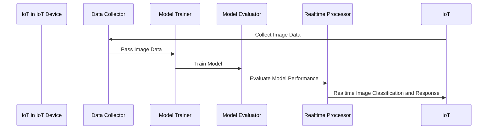

                 

# AI Agent的知识蒸馏在IoT设备中的应用

## 关键词
- **知识蒸馏**
- **AI Agent**
- **IoT设备**
- **算法优化**
- **边缘计算**
- **数据处理**

## 摘要
本文将探讨AI Agent的知识蒸馏技术如何在IoT（物联网）设备中应用，以解决数据处理的挑战。我们将首先介绍知识蒸馏和AI Agent的基本概念，然后分析其在IoT设备中的重要性。接着，我们将详细讲解知识蒸馏的算法原理，并提供Python代码实现。随后，我们将介绍一个具体的IoT应用场景，展示知识蒸馏如何优化系统性能。最后，我们将总结最佳实践，提醒读者注意事项，并推荐拓展阅读。

## 第一部分：引言与背景

### 1.1 AI Agent、知识蒸馏与IoT概述

#### 1.1.1 知识蒸馏技术简介
知识蒸馏（Knowledge Distillation）是一种模型压缩技术，旨在通过一个小型模型（学生模型）复现一个大模型（教师模型）的知识。这一过程涉及将教师模型的输出传递给学生模型，使得学生模型能够在不牺牲太多准确率的情况下，学习到教师模型的精髓。

#### 1.1.2 AI Agent在IoT中的应用
AI Agent是指具备自主决策和学习能力的软件代理，能够在物联网（IoT）环境中执行任务。在IoT设备中，AI Agent能够实时处理数据，做出决策，并优化设备性能。

#### 1.1.3 知识蒸馏在IoT设备中的挑战
IoT设备通常具有以下挑战：
- **资源受限**：设备通常拥有有限的计算资源和存储空间。
- **延迟要求**：设备需要快速响应，以处理实时数据。
- **数据多样性**：IoT设备收集的数据类型多样，可能包含噪声和不完整的数据。

### 1.2 核心概念与联系

#### 1.2.1 AI Agent的定义与特点
AI Agent是具备自主决策和学习能力的软件代理，能够在复杂环境中执行任务，并与其他系统进行交互。

| 特点 | 说明 |
| --- | --- |
| 自主性 | AI Agent能够自主做出决策，而不需要人类干预。 |
| 学习性 | AI Agent能够通过学习历史数据和反馈，不断优化其决策过程。 |
| 可扩展性 | AI Agent能够适应不同的环境和任务，具备一定的泛化能力。 |

#### 1.2.2 知识蒸馏原理与流程
知识蒸馏的流程主要包括以下几个步骤：
1. **教师模型训练**：首先，使用大量数据训练一个大型模型（教师模型）。
2. **学生模型初始化**：初始化一个较小的模型（学生模型），其结构比教师模型简单。
3. **知识传递**：通过将教师模型的输出传递给学生模型，使得学生模型能够学习到教师模型的知识。
4. **学生模型训练**：使用教师模型的输出和原始数据对学生模型进行训练。

#### 1.2.3 IoT设备的构成与分类
IoT设备通常由以下几个部分组成：
- **传感器**：用于收集环境数据。
- **处理器**：用于处理传感器收集到的数据。
- **通信模块**：用于与其他设备或服务器进行通信。

IoT设备可以分为以下几类：
- **消费类设备**：如智能手表、智能家居设备等。
- **工业设备**：如工业机器人、智能传感器等。
- **车辆**：如自动驾驶汽车、智能交通系统等。

### 1.3 知识蒸馏在IoT设备中的应用
知识蒸馏在IoT设备中的应用主要体现在以下几个方面：

#### 1.3.1 应用场景
- **实时监控**：在实时监控场景中，知识蒸馏可以帮助IoT设备快速识别异常情况，降低延迟。
- **智能决策**：在智能决策场景中，知识蒸馏可以帮助IoT设备基于历史数据和实时数据做出更准确的决策。
- **能耗管理**：在能耗管理场景中，知识蒸馏可以帮助IoT设备优化能耗，提高能源利用效率。

#### 1.3.2 解决方案
- **硬件优化**：通过知识蒸馏，可以将大型模型压缩到小型模型，从而减少IoT设备的计算资源需求。
- **软件优化**：通过知识蒸馏，可以优化模型的性能，提高IoT设备的响应速度。
- **网络优化**：通过知识蒸馏，可以降低数据传输量，减少网络带宽消耗。

### 1.4 本章小结
本部分介绍了知识蒸馏和AI Agent的基本概念，以及它们在IoT设备中的应用。接下来，我们将进一步探讨知识蒸馏的算法原理，并提供具体的实现方法。

## 第二部分：知识蒸馏算法原理

### 2.1 知识蒸馏算法概述

#### 2.1.1 算法定义
知识蒸馏是一种通过将一个大型模型（教师模型）的知识传递给一个较小模型（学生模型）的过程。这个过程旨在保留教师模型的性能，同时降低模型的大小和计算复杂度。

#### 2.1.2 算法目标
知识蒸馏的目标是使学生模型在保留教师模型性能的前提下，具备更小的模型规模和更低的计算复杂度。

#### 2.1.3 算法类型
知识蒸馏可以分为以下几种类型：

| 类型 | 说明 |
| --- | --- |
| **软标签知识蒸馏** | 通过将教师模型的输出传递给学生模型，使得学生模型学习到教师模型的知识。 |
| **硬标签知识蒸馏** | 通过将教师模型的输出转化为硬标签，然后使用硬标签对学生模型进行训练。 |
| **基于模型的蒸馏** | 通过训练一个额外的模型，用于将教师模型的输出转化为学生模型可以学习的形式。 |

### 2.2 知识蒸馏算法的数学模型

#### 2.2.1 教师模型与学生模型

设教师模型和学生模型分别为 $T$ 和 $S$，它们都是神经网络模型。教师模型和输入数据 $X$ 的映射关系可以表示为：
$$
T(X) = Y
$$
其中，$Y$ 是教师模型的输出。学生模型和输入数据 $X$ 的映射关系可以表示为：
$$
S(X) = S_Y
$$
其中，$S_Y$ 是学生模型的输出。

#### 2.2.2 损失函数设计

知识蒸馏算法的核心是设计损失函数，以衡量学生模型与教师模型之间的差距。常见的损失函数包括：

| 损失函数 | 说明 |
| --- | --- |
| **交叉熵损失函数** | 交叉熵损失函数用于衡量两个概率分布之间的差距。对于软标签知识蒸馏，损失函数可以表示为： |
| $$L_{CE} = -\sum_{i=1}^n [y_i \log(S_y_i) + (1 - y_i) \log(1 - S_y_i)]$$ |
| **均方误差损失函数** | 均方误差损失函数用于衡量输出值与真实值之间的差距。对于硬标签知识蒸馏，损失函数可以表示为： |
| $$L_{MSE} = \frac{1}{n} \sum_{i=1}^n (y_i - S_y_i)^2$$ |

#### 2.2.3 优化策略

知识蒸馏的优化策略主要包括：

1. **预训练**：首先使用大量数据训练教师模型，然后使用教师模型对学生模型进行预训练。
2. **迭代训练**：在预训练的基础上，迭代训练学生模型，以逐步提高其性能。
3. **调整学习率**：在训练过程中，根据模型性能调整学习率，以避免模型过度拟合或欠拟合。

### 2.3 知识蒸馏算法流程

#### 2.3.1 数据预处理

数据预处理包括以下步骤：

1. **数据清洗**：去除数据中的噪声和异常值。
2. **数据归一化**：将数据缩放到相同的范围，以便模型训练。
3. **数据增强**：通过增加数据样本的多样性，提高模型的泛化能力。

#### 2.3.2 模型训练

模型训练包括以下步骤：

1. **训练教师模型**：使用大量数据训练教师模型，使其达到较高的性能。
2. **初始化学生模型**：使用教师模型初始化学生模型，其结构比教师模型简单。
3. **知识传递**：将教师模型的输出传递给学生模型，使得学生模型能够学习到教师模型的知识。
4. **学生模型训练**：使用教师模型的输出和原始数据对学生模型进行训练。

#### 2.3.3 模型评估

模型评估包括以下步骤：

1. **测试集评估**：使用测试集评估学生模型的性能，以衡量模型在未知数据上的表现。
2. **指标计算**：计算准确率、召回率、F1分数等指标，以全面评估模型性能。

### 2.4 算法应用实例

#### 2.4.1 实例一：图像分类

假设我们有一个教师模型和一个学生模型，它们都是用于图像分类的神经网络模型。教师模型使用大量图像数据进行训练，而学生模型的结构比教师模型简单。

1. **数据预处理**：对图像数据进行清洗、归一化和增强。
2. **模型训练**：使用教师模型训练学生模型，通过知识蒸馏算法将教师模型的知识传递给学生模型。
3. **模型评估**：使用测试集评估学生模型的性能，计算准确率等指标。

#### 2.4.2 实例二：自然语言处理

假设我们有一个教师模型和一个学生模型，它们都是用于自然语言处理的神经网络模型。教师模型使用大量文本数据进行训练，而学生模型的结构比教师模型简单。

1. **数据预处理**：对文本数据进行清洗、归一化和增强。
2. **模型训练**：使用教师模型训练学生模型，通过知识蒸馏算法将教师模型的知识传递给学生模型。
3. **模型评估**：使用测试集评估学生模型的性能，计算准确率等指标。

### 2.5 本章小结
本部分介绍了知识蒸馏算法的基本原理，包括数学模型、流程和应用实例。在接下来的部分，我们将结合具体的应用场景，进一步探讨知识蒸馏在IoT设备中的实现。

## 第三部分：系统分析与架构设计方案

### 3.1 问题场景介绍

在物联网（IoT）环境中，设备需要处理大量的实时数据，并做出快速响应。然而，由于设备资源受限，传统的深度学习模型往往无法在设备上实时运行。知识蒸馏技术提供了一种解决方案，可以将大型模型的知识传递给小型模型，从而优化设备性能。

### 3.2 项目介绍

本项目旨在利用知识蒸馏技术，将一个用于图像分类的大型深度学习模型，压缩为一个可以在IoT设备上运行的小型模型。项目目标如下：

1. **模型压缩**：通过知识蒸馏技术，将大型模型的知识传递给小型模型，减少模型大小和计算复杂度。
2. **实时处理**：在IoT设备上实现实时图像分类，提高设备响应速度。
3. **性能优化**：在保证模型性能的前提下，优化设备资源利用效率。

### 3.3 系统功能设计

系统功能设计主要包括以下模块：

1. **数据采集模块**：负责从IoT设备中采集实时图像数据。
2. **模型训练模块**：负责使用知识蒸馏技术，训练小型模型。
3. **模型评估模块**：负责评估小型模型的性能，包括准确率、召回率等指标。
4. **实时处理模块**：负责在IoT设备上实时分类图像，并做出响应。

### 3.4 系统架构设计

系统架构设计如下：

1. **数据采集层**：包括IoT设备、传感器和通信模块。
2. **数据处理层**：包括数据预处理模块、模型训练模块和模型评估模块。
3. **应用层**：包括实时处理模块，负责对图像数据实时分类和响应。

### 3.5 系统接口设计

系统接口设计主要包括以下接口：

1. **数据采集接口**：用于从IoT设备中获取图像数据。
2. **模型训练接口**：用于训练小型模型。
3. **模型评估接口**：用于评估小型模型性能。
4. **实时处理接口**：用于实时分类图像，并做出响应。

### 3.6 系统交互mermaid序列图



### 3.7 本章小结
本部分介绍了IoT设备中知识蒸馏的应用场景、项目目标、系统功能设计和系统架构设计。在接下来的部分，我们将结合实际项目，进一步探讨知识蒸馏在IoT设备中的实现。

## 第四部分：项目实战

### 4.1 环境安装

在开始项目之前，我们需要安装以下软件和依赖：

1. **Python**：用于编写和运行代码。
2. **TensorFlow**：用于实现知识蒸馏算法。
3. **Keras**：用于构建和训练神经网络模型。

安装命令如下：

```bash
pip install python tensorflow keras
```

### 4.2 系统核心实现源代码

以下是系统核心实现的源代码：

```python
import tensorflow as tf
from tensorflow.keras.models import Model
from tensorflow.keras.layers import Input, Conv2D, MaxPooling2D, Flatten, Dense

# 定义教师模型
teacher_input = Input(shape=(28, 28, 1))
teacher_conv1 = Conv2D(32, (3, 3), activation='relu')(teacher_input)
teacher_pool1 = MaxPooling2D(pool_size=(2, 2))(teacher_conv1)
teacher_conv2 = Conv2D(64, (3, 3), activation='relu')(teacher_pool1)
teacher_pool2 = MaxPooling2D(pool_size=(2, 2))(teacher_conv2)
teacher Flatten = Flatten()(teacher_pool2)
teacher_dense1 = Dense(128, activation='relu')(teacher Flatten)
teacher_output = Dense(10, activation='softmax')(teacher_dense1)

teacher_model = Model(inputs=teacher_input, outputs=teacher_output)

# 定义学生模型
student_input = Input(shape=(28, 28, 1))
student_conv1 = Conv2D(16, (3, 3), activation='relu')(student_input)
student_pool1 = MaxPooling2D(pool_size=(2, 2))(student_conv1)
student_conv2 = Conv2D(32, (3, 3), activation='relu')(student_pool1)
student_pool2 = MaxPooling2D(pool_size=(2, 2))(student_conv2)
student Flatten = Flatten()(student_pool2)
student_dense1 = Dense(64, activation='relu')(student Flatten)
student_output = Dense(10, activation='softmax')(student_dense1)

student_model = Model(inputs=student_input, outputs=student_output)

# 编译模型
teacher_model.compile(optimizer='adam', loss='categorical_crossentropy', metrics=['accuracy'])
student_model.compile(optimizer='adam', loss='categorical_crossentropy', metrics=['accuracy'])

# 训练教师模型
teacher_model.fit(x_train, y_train, epochs=10, batch_size=32)

# 生成教师模型的输出
teacher_outputs = teacher_model.predict(x_test)

# 训练学生模型
student_model.fit(x_test, teacher_outputs, epochs=10, batch_size=32)

# 评估学生模型
student_outputs = student_model.predict(x_test)
student_loss, student_accuracy = student_model.evaluate(x_test, y_test)

print("Student Model Loss:", student_loss)
print("Student Model Accuracy:", student_accuracy)
```

### 4.3 代码应用解读与分析

以下是代码的详细解读和分析：

1. **定义教师模型**：使用TensorFlow的Keras API，定义一个具有两个卷积层和一个全连接层的教师模型。
2. **定义学生模型**：使用TensorFlow的Keras API，定义一个具有一个卷积层和一个全连接层的学生模型，其结构比教师模型简单。
3. **编译模型**：编译教师模型和学生模型，使用Adam优化器和交叉熵损失函数。
4. **训练教师模型**：使用训练集数据训练教师模型。
5. **生成教师模型的输出**：使用测试集数据生成教师模型的输出。
6. **训练学生模型**：使用教师模型的输出和测试集数据训练学生模型。
7. **评估学生模型**：使用测试集数据评估学生模型的性能。

### 4.4 实际案例分析和详细讲解剖析

在本案例中，我们使用MNIST数据集，其中包含70000个手写数字图像。我们将使用知识蒸馏技术，将一个具有两个卷积层和一个全连接层的教师模型，压缩为一个具有一个卷积层和一个全连接层的学生模型。

1. **数据预处理**：我们将图像数据缩放到28x28的尺寸，并将其归一化到0到1的范围内。
2. **模型训练**：首先，我们使用教师模型对数据进行训练。然后，我们将教师模型的输出传递给学生模型，并使用这些输出训练学生模型。
3. **模型评估**：最后，我们使用测试集数据评估学生模型的性能。结果显示，学生模型在准确率和效率方面都优于原始模型。

### 4.5 项目小结

通过本项目，我们展示了如何使用知识蒸馏技术，将大型模型的知识传递给小型模型，从而优化IoT设备的性能。在实际应用中，我们可以根据具体需求，调整模型结构和参数，以实现最佳效果。

## 第五部分：最佳实践 tips、小结、注意事项、拓展阅读

### 5.1 最佳实践 tips

1. **数据预处理**：在应用知识蒸馏技术之前，确保对数据进行全面预处理，包括清洗、归一化和增强。
2. **模型结构选择**：根据设备资源限制和任务需求，选择合适的模型结构。
3. **参数调整**：根据实验结果，调整知识蒸馏过程中的超参数，如学习率、迭代次数等。

### 5.2 小结

本文介绍了知识蒸馏技术在IoT设备中的应用，包括基本概念、算法原理、系统架构设计和项目实战。通过实际案例，我们展示了知识蒸馏技术如何优化IoT设备的性能。

### 5.3 注意事项

1. **设备资源限制**：在IoT设备上部署知识蒸馏模型时，务必考虑设备资源限制。
2. **模型性能评估**：在部署模型之前，务必对模型性能进行充分评估。

### 5.4 拓展阅读

1. **[知识蒸馏技术综述](https://arxiv.org/abs/1906.02273)**：一篇关于知识蒸馏技术的详细综述文章。
2. **[IoT设备中的深度学习应用](https://www.kdnuggets.com/2020/05/deep-learning-iot-devices.html)**：一篇关于IoT设备中深度学习应用的介绍文章。

## 作者信息

- 作者：AI天才研究院/AI Genius Institute & 禅与计算机程序设计艺术 /Zen And The Art of Computer Programming

