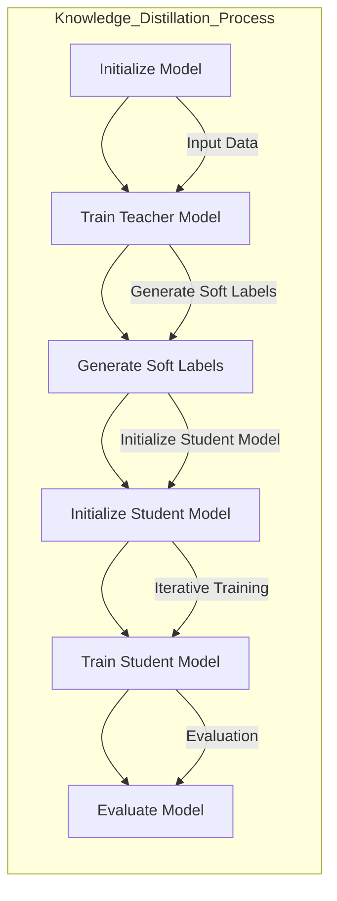
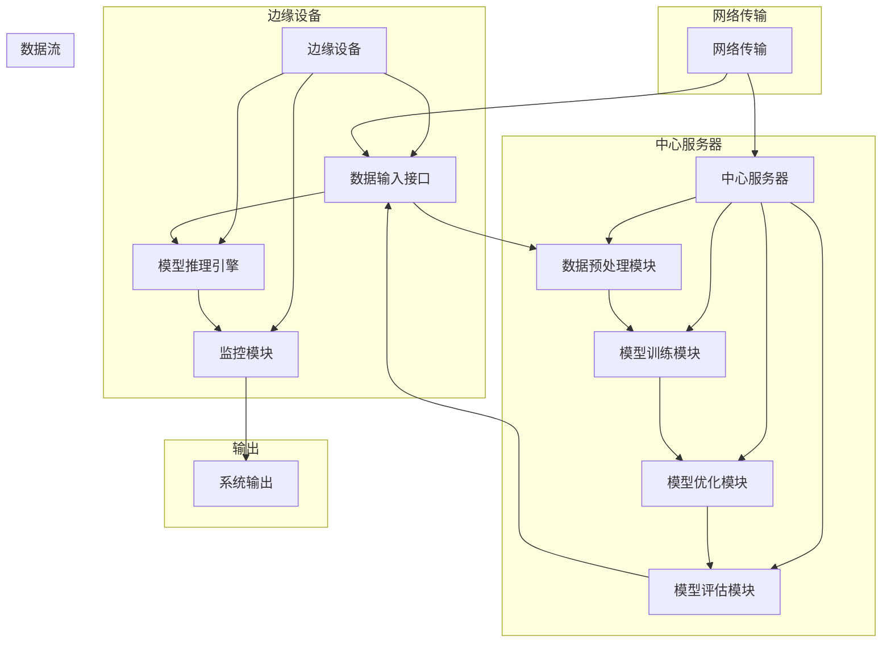
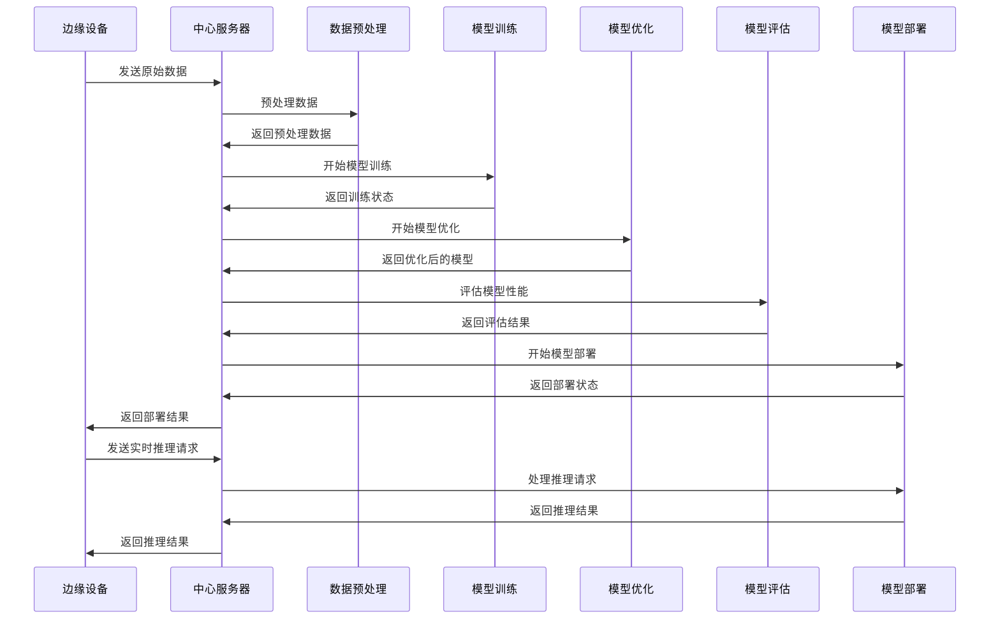

                 

### 1.1 问题背景

随着物联网、5G和边缘计算技术的迅猛发展，边缘AI（Edge AI）逐渐成为人工智能（AI）领域的研究热点。边缘AI通过在靠近数据源头或终端设备的地方部署AI模型，实现数据的实时处理和响应，从而显著降低网络延迟和带宽压力，提高系统的整体性能和响应速度。

AI Agent作为智能体的一种，其在边缘AI中的应用具有重要的研究价值和实际应用潜力。AI Agent是一种可以自主执行任务、具有智能行为的软件系统。与传统中央集权的AI架构不同，AI Agent更加分散和自主，能够更好地适应边缘设备的计算资源和网络环境。

知识蒸馏（Knowledge Distillation）是一种将大模型的知识迁移到小模型的技术，通过训练小模型模仿大模型的行为，从而实现知识的高效传递和复用。在边缘AI中，由于边缘设备通常具有有限的计算资源和存储空间，知识蒸馏技术能够有效地缩小AI模型的规模，同时保持较高的性能。

本篇文章旨在探讨AI Agent的知识蒸馏在边缘AI中的应用，通过以下几个步骤进行分析和推理：

1. **背景介绍**：首先，我们将介绍边缘AI的发展现状和重要性，阐述AI Agent在边缘AI中的角色和作用，以及知识蒸馏技术的核心概念和应用场景。
2. **问题描述**：接着，分析现有边缘AI系统中知识蒸馏的挑战，阐述知识蒸馏在边缘AI中的优化需求。
3. **问题解决**：简述知识蒸馏的基本原理和方法，探讨如何优化知识蒸馏在边缘AI中的应用。
4. **边界与外延**：明确知识蒸馏在边缘AI中的适用范围，分析知识蒸馏在不同边缘AI场景中的差异。
5. **核心概念与联系**：深入讲解知识蒸馏的核心概念原理，对比不同知识蒸馏方法的优缺点，介绍知识蒸馏在边缘AI中的实体关系图。
6. **算法原理讲解**：使用mermaid流程图和Python源代码详细讲解知识蒸馏算法，提供通俗易懂的例子来解释原理。
7. **系统分析与架构设计**：介绍边缘AI中的知识蒸馏应用场景，绘制领域模型类图、系统架构图和系统交互序列图。
8. **项目实战**：详细描述知识蒸馏系统的环境安装、核心实现源代码，分析代码应用和实际案例。
9. **最佳实践与拓展**：提供知识蒸馏在边缘AI中的最佳实践建议，总结全书内容，提醒注意事项，推荐拓展阅读。

通过上述步骤，我们将全面探讨AI Agent的知识蒸馏在边缘AI中的应用，为读者提供深入的理论分析和实战指导。

## 第一部分：背景介绍

### 1.2 问题描述

在边缘AI系统中，知识蒸馏技术面临着一系列挑战。首先，边缘设备的计算资源有限，这使得大模型向小模型的知识传递过程变得更加复杂和困难。大模型通常具有更高的精度和更丰富的知识，但它们通常过于复杂，无法在资源受限的边缘设备上高效运行。这就需要知识蒸馏技术能够在保留关键知识的同时，尽可能地减小模型的规模和复杂性。

其次，知识蒸馏过程中的数据质量和分布也是一个重要问题。边缘AI系统中的数据通常来自不同的来源，数据质量和分布可能存在较大差异。这种数据质量的不一致可能会对知识蒸馏的效果产生负面影响。因此，如何在数据质量参差不齐的情况下，有效地进行知识蒸馏，是一个亟待解决的问题。

此外，边缘AI系统中的网络环境通常不稳定，带宽有限，这进一步增加了知识蒸馏的难度。由于数据需要在边缘设备和中心服务器之间传输，网络延迟和带宽限制可能导致知识蒸馏过程中的数据传输效率低下。为了应对这一挑战，需要开发出能够在有限网络条件下高效传输知识的策略。

在优化知识蒸馏方面，当前的研究主要集中于以下几个方面：

1. **模型压缩与优化**：通过模型剪枝、量化、蒸馏等技术，对原始模型进行压缩和优化，使其能够在边缘设备上高效运行。例如，可以使用剪枝技术去除冗余的神经元和连接，降低模型的复杂度和计算量。

2. **数据预处理**：对输入数据进行适当的预处理，以提高数据质量和分布的均匀性。例如，可以使用数据增强技术，增加数据的多样性，或者使用数据清洗技术，去除噪声和异常值。

3. **网络优化**：优化边缘设备和中心服务器之间的网络传输，提高数据传输效率。例如，可以采用数据压缩技术，减少传输的数据量，或者使用缓存技术，降低网络延迟。

4. **分布式学习**：通过分布式学习技术，将知识蒸馏过程分布到多个边缘设备上，以提高学习效率和资源利用率。例如，可以使用联邦学习（Federated Learning）技术，让多个边缘设备共同参与学习过程。

总的来说，知识蒸馏在边缘AI中的应用仍然存在许多挑战，需要从模型压缩、数据预处理、网络优化和分布式学习等多个方面进行综合考虑和优化。通过不断探索和创新，我们可以期望在未来的边缘AI系统中，实现更高效、更可靠的知识蒸馏技术。

### 1.3 问题解决

知识蒸馏作为一种将知识从大型教师模型传递到小型学生模型的技术，其基本原理是将教师模型视为一个有先验知识的“导师”，学生模型则通过模仿教师模型的行为来学习这些知识。这一过程通常包括以下几个关键步骤：

1. **教师模型选择**：首先，需要选择一个性能优良、知识丰富的大型教师模型。教师模型的性能直接影响知识蒸馏的效果，因此通常选择在特定任务上已经训练好的预训练模型。

2. **学生模型设计**：学生模型通常是一个小型化、轻量级的模型，其结构相对简单，能够适应边缘设备的计算资源限制。在设计学生模型时，需要综合考虑模型的准确性和计算效率。

3. **损失函数设计**：知识蒸馏的核心在于设计一个合适的损失函数，以量化教师模型和学生模型之间的知识差异。常见的损失函数包括软标签损失、一致性损失和对抗损失等。

   - **软标签损失**：在软标签损失中，学生模型不仅要预测正确的输出标签，还要预测教师模型输出的软标签分布。该损失函数鼓励学生模型学习教师模型的知识分布。
   - **一致性损失**：一致性损失通过限制学生模型在随机遮盖部分输入时的输出分布与原始输出分布的差距来促进学生模型的学习。这种方法有助于学生模型学习教师模型的全局知识。
   - **对抗损失**：对抗损失涉及生成对抗网络（GAN）技术，通过对抗训练来增强学生模型的学习能力，使其更好地模仿教师模型的行为。

4. **训练过程**：在知识蒸馏的训练过程中，通常采用以下策略：

   - **迭代训练**：教师模型和学生模型交替训练，逐步缩小两者之间的知识差异。
   - **分阶段训练**：在训练初期，使用教师模型的软标签作为学生模型的输入，以快速传递知识。在训练后期，可以逐渐减少教师模型的影响，增强学生模型的独立性。
   - **动态调整**：根据训练过程的效果，动态调整学生模型的超参数，如学习率、温度参数等，以优化训练过程。

5. **模型评估**：在知识蒸馏完成后，需要评估学生模型的性能，确保其能够有效地保留教师模型的知识。常见的评估指标包括准确率、F1分数和模型大小等。

通过上述步骤，知识蒸馏技术能够有效地将教师模型的知识传递给学生模型，从而在边缘设备上实现高效、准确的AI应用。然而，知识蒸馏在边缘AI中的应用仍面临诸多挑战，需要在模型选择、损失函数设计、训练策略和模型评估等方面进行深入研究和优化。

### 1.4 边界与外延

知识蒸馏在边缘AI中的适用范围广泛，但其应用场景和需求因具体场景而异。以下是对知识蒸馏在不同边缘AI场景中的差异和应用范围的探讨：

1. **智能家居场景**：在智能家居场景中，边缘设备如智能音箱、摄像头等需要快速响应用户指令。由于这些设备通常具有有限的计算资源和网络带宽，知识蒸馏可以用于将大型语音识别或图像识别模型压缩到适合边缘设备的小型模型，从而提高系统的实时响应能力。

2. **工业物联网场景**：工业物联网（IIoT）中的边缘设备如传感器和控制器，需要处理大量的实时数据并进行实时分析。知识蒸馏可以用于将复杂的数据分析模型压缩到边缘设备上，从而减少数据传输和处理延迟，提高系统的整体效率和稳定性。

3. **医疗设备场景**：在医疗设备中，如便携式超声设备、移动CT扫描仪等，需要快速处理医疗图像并进行诊断。由于医疗数据的高精度要求，知识蒸馏可以用于将高精度的大型深度学习模型压缩到小型模型，确保在边缘设备上仍能保持较高的诊断准确性。

4. **自动驾驶场景**：在自动驾驶场景中，边缘设备如车载传感器和控制器需要在实时环境中进行复杂的图像和语音处理。知识蒸馏可以用于将大规模的自动驾驶模型压缩到车载设备中，从而提高系统的响应速度和效率。

尽管知识蒸馏在边缘AI中有广泛的应用前景，但其应用也面临一些挑战。首先，由于边缘设备的计算资源和存储空间有限，需要设计轻量级的学生模型以适应这些资源限制。其次，知识蒸馏过程中的数据质量和网络稳定性也是关键因素，需要在数据预处理和网络优化方面进行深入研究。最后，如何确保知识蒸馏后的模型在边缘设备上的稳定性和鲁棒性，也是未来研究的重点。

### 1.5 概念结构与核心要素组成

知识蒸馏在边缘AI中的实现涉及多个核心概念和要素，这些概念和要素共同构成了知识蒸馏在边缘AI中的基础框架。以下是对这些核心概念和要素的详细解析：

1. **知识蒸馏的基本概念**：

   - **教师模型**：教师模型是一个性能优良的大型模型，它拥有丰富的知识和较高的准确性。在知识蒸馏过程中，教师模型负责提供知识给学生模型。
   - **学生模型**：学生模型是一个小型化的轻量级模型，它在知识蒸馏过程中通过模仿教师模型的行为来学习知识。学生模型的目的是在保留关键知识的同时，降低模型的复杂度和计算资源需求。
   - **软标签**：软标签是教师模型在训练过程中输出的概率分布，它包含了教师模型对数据的理解。在知识蒸馏过程中，学生模型通过学习软标签来获取教师模型的知识。
   - **硬标签**：硬标签是教师模型最终输出的真实标签，它通常用于训练学生模型的输出层，以确保学生模型在预测阶段能够产生正确的输出。

2. **知识蒸馏的关键步骤**：

   - **模型选择**：选择一个性能优良的教师模型和一个适合边缘设备的轻量级学生模型。
   - **损失函数设计**：设计合适的损失函数，以量化学生模型和教师模型之间的知识差异。常见的损失函数包括软标签损失、一致性损失和对抗损失等。
   - **迭代训练**：通过迭代训练，逐步缩小学生模型和教师模型之间的知识差异。在训练过程中，可以采用分阶段训练策略，逐步减少教师模型的影响，增强学生模型的独立性。
   - **模型评估**：在知识蒸馏完成后，评估学生模型的性能，确保其能够有效地保留教师模型的知识。

3. **边缘AI的核心要素**：

   - **计算资源**：边缘设备通常具有有限的计算资源，因此需要设计轻量级的AI模型以满足这些限制。
   - **存储空间**：边缘设备通常具有有限的存储空间，需要优化模型的存储和部署过程。
   - **网络带宽**：边缘设备和中心服务器之间的网络带宽有限，需要优化数据传输和通信过程，以提高知识蒸馏的效率。
   - **实时性**：边缘AI系统通常要求快速响应，因此需要优化模型的训练和推理过程，以确保系统的实时性。

通过这些核心概念和要素，知识蒸馏在边缘AI中得以有效实现。在实际应用中，这些概念和要素相互作用，共同推动了边缘AI系统的发展与优化。

### 2.1 核心概念原理

知识蒸馏作为一种高效的知识传递技术，其核心概念和原理在边缘AI中发挥着重要作用。首先，我们需要理解知识蒸馏的基本数学模型和公式。

#### 2.1.1 知识蒸馏的数学模型

知识蒸馏的过程可以表示为以下数学模型：

$$
L = L_{soft} + \lambda L_{hard}
$$

其中，$L$ 是总的损失函数，$L_{soft}$ 是软标签损失，$L_{hard}$ 是硬标签损失，$\lambda$ 是权重系数，用于平衡软标签损失和硬标签损失的重要性。

- **软标签损失**：

  软标签损失主要用于量化学生模型和教师模型之间的知识差异。假设教师模型和学生在给定输入 $x$ 下的输出分别为 $y_{teacher}$ 和 $y_{student}$，则软标签损失可以表示为：

  $$
  L_{soft} = -\sum_{i} p_{teacher,i} \log p_{student,i}
  $$

  其中，$p_{teacher,i}$ 和 $p_{student,i}$ 分别是教师模型和学生模型对类别 $i$ 的预测概率。

- **硬标签损失**：

  硬标签损失则用于确保学生模型的输出层能够正确预测真实标签。硬标签损失通常采用交叉熵损失，可以表示为：

  $$
  L_{hard} = -\sum_{i} y_i \log p_{student,i}
  $$

  其中，$y_i$ 是硬标签，表示输入 $x$ 的真实类别。

#### 2.1.2 知识蒸馏在不同边缘AI场景中的应用差异

知识蒸馏在边缘AI中的应用场景因设备类型、数据特性和任务需求的不同而有所差异。以下是一些常见应用场景中的知识蒸馏差异：

- **智能家居场景**：

  在智能家居场景中，由于设备计算资源和网络带宽有限，通常需要使用轻量级的深度学习模型。知识蒸馏技术可以将大型模型压缩到适合智能家居设备的轻量级模型，从而提高系统的响应速度和效率。

- **工业物联网场景**：

  工业物联网中的边缘设备通常需要处理大量实时数据，对模型的实时性和稳定性要求较高。知识蒸馏可以用于在保持较高准确率的同时，降低模型的复杂度，提高边缘设备的处理效率。

- **医疗设备场景**：

  医疗设备中的图像和信号处理任务对模型的准确性要求极高。知识蒸馏技术可以通过将大型预训练模型压缩到小型模型，在保证模型准确性的同时，提高系统的响应速度和实时性。

- **自动驾驶场景**：

  自动驾驶场景中，需要实时处理大量的图像和传感器数据。知识蒸馏技术可以将复杂的大型模型压缩到车载设备中，从而提高系统的实时性和可靠性。

尽管知识蒸馏在不同场景中的应用有所不同，但其核心原理和基本模型是一致的。通过灵活调整软标签损失和硬标签损失的比例，以及选择合适的学生模型，知识蒸馏可以在各种边缘AI场景中实现高效的知识传递。

### 2.2 概念属性特征对比表格

为了更好地理解不同知识蒸馏方法的优缺点，我们可以通过一个对比表格来展示其主要特性。以下是一个典型的对比表格，列出了三种常见知识蒸馏方法的属性特征：

| 方法        | 特点                                   | 优点                                         | 缺点                                           |
|-------------|----------------------------------------|----------------------------------------------|------------------------------------------------|
| 软标签蒸馏 | 使用教师模型的软标签作为学生模型的输入 | 知识传递效率高，学生模型保留教师模型的知识分布 | 需要大量的软标签，对数据量有较高要求         |
| 对抗蒸馏    | 使用生成对抗网络（GAN）来增强学生模型学习教师模型的知识 | 学习能力强，能够捕捉到教师模型的全局知识     | 计算复杂度高，训练时间较长                   |
| 一致性蒸馏 | 遮盖教师模型的部分输入，确保学生模型的输出与原始输出一致 | 简单有效，对数据量要求不高                   | 可能会导致学生模型过度依赖教师模型           |

通过上述对比表格，我们可以看到不同知识蒸馏方法在知识传递效率、计算复杂度、训练时间等方面的差异。选择合适的方法需要根据具体的应用场景和需求进行综合考虑。

### 2.3 ER实体关系图架构

为了更好地理解知识蒸馏在边缘AI中的实体关系，我们可以使用ER（实体关系）图来展示各个实体及其之间的关系。以下是一个简化的ER图，展示了知识蒸馏过程中涉及的主要实体和关系：

```mermaid
erDiagram
  TeacherModel ||--|{ StudentModel : 被蒸馏模型}
  TeacherModel ||--|{ SoftLabels : 软标签}
  StudentModel ||--|{ HardLabels : 硬标签}
  SoftLabels ||--|{ Knowledge : 知识}
  HardLabels ||--|{ Output : 输出}
```

在这个ER图中，`TeacherModel` 代表教师模型，`StudentModel` 代表学生模型，`SoftLabels` 代表软标签，`HardLabels` 代表硬标签，`Knowledge` 表示知识，`Output` 表示输出。

- **TeacherModel** 与 **StudentModel** 之间存在双向关联，表示知识蒸馏过程中教师模型将知识传递给学生模型。
- **TeacherModel** 与 **SoftLabels** 之间存在关联，表示教师模型产生软标签。
- **StudentModel** 与 **HardLabels** 之间存在关联，表示学生模型通过硬标签进行训练。
- **SoftLabels** 与 **Knowledge** 之间存在关联，表示软标签包含了教师模型的知识。
- **HardLabels** 与 **Output** 之间存在关联，表示硬标签用于评估学生模型的输出。

通过ER图，我们可以清晰地看到知识蒸馏过程中各个实体及其之间的交互关系，这有助于我们更好地理解知识蒸馏在边缘AI中的应用和实现过程。

### 3.1 算法mermaid流程图

知识蒸馏算法的流程图能够帮助我们直观地理解其各个步骤和环节。以下是一个简化的mermaid流程图，描述了知识蒸馏的基本流程：



在这个流程图中，我们依次展示了以下步骤：

1. **Initialize Model**：初始化模型。
2. **Train Teacher Model**：训练教师模型。
3. **Generate Soft Labels**：生成软标签。
4. **Initialize Student Model**：初始化学生模型。
5. **Train Student Model**：训练学生模型。
6. **Evaluate Model**：评估模型。

这些步骤构成了知识蒸馏的基本流程，通过mermaid流程图，我们可以清晰地看到每个步骤及其之间的逻辑关系。

### 3.2 Python源代码讲解

知识蒸馏算法的Python实现涉及到模型的初始化、训练和评估等多个方面。以下是一个简化的Python代码示例，用于说明知识蒸馏的核心步骤：

```python
import torch
import torch.nn as nn
import torch.optim as optim

# 初始化教师模型和学生模型
teacher_model = nn.Sequential(nn.Linear(in_features=784, out_features=128),
                              nn.ReLU(),
                              nn.Linear(in_features=128, out_features=10))
student_model = nn.Sequential(nn.Linear(in_features=784, out_features=64),
                              nn.ReLU(),
                              nn.Linear(in_features=64, out_features=10))

# 定义损失函数和优化器
criterion = nn.CrossEntropyLoss()
optimizer = optim.Adam(student_model.parameters(), lr=0.001)

# 加载训练数据
train_loader = torch.utils.data.DataLoader(dataset=train_dataset, batch_size=64, shuffle=True)

# 训练过程
for epoch in range(num_epochs):
    for inputs, targets in train_loader:
        # 前向传播
        outputs = student_model(inputs)
        loss = criterion(outputs, targets)

        # 反向传播和优化
        optimizer.zero_grad()
        loss.backward()
        optimizer.step()

        # 打印训练进度
        if (batch_idx + 1) % 100 == 0:
            print('Epoch [{}/{}], Step [{}/{}], Loss: {:.4f}'.format(
                epoch + 1, num_epochs, batch_idx + 1, len(train_loader), loss.item()))

# 评估学生模型
total_correct = 0
total_samples = 0
with torch.no_grad():
    for inputs, targets in val_loader:
        outputs = student_model(inputs)
        _, predicted = torch.max(outputs, 1)
        total_samples += targets.size(0)
        total_correct += (predicted == targets).sum().item()

accuracy = 100 * total_correct / total_samples
print(f'Validation Accuracy: {accuracy:.2f}%')
```

这个代码示例主要包括以下几个步骤：

1. **模型初始化**：定义教师模型和学生模型，并设置损失函数和优化器。
2. **数据加载**：使用 DataLoader 加载训练数据。
3. **训练过程**：遍历训练数据，进行前向传播、反向传播和优化。
4. **模型评估**：在验证数据上评估学生模型的准确性。

通过这个代码示例，我们可以看到知识蒸馏算法的基本实现过程，以及如何通过训练和评估来优化学生模型的性能。

### 3.3 算法原理的数学模型和公式

知识蒸馏算法的数学模型和公式在实现过程中起着至关重要的作用。以下使用LaTeX格式详细描述知识蒸馏算法的数学模型和关键公式：

首先，我们定义教师模型和学生模型的输出：
$$
\hat{y}_{teacher}(x) = \sigma(W_{teacher}^T \cdot \phi(x))
$$
$$
\hat{y}_{student}(x) = \sigma(W_{student}^T \cdot \phi(x))
$$

其中，$\sigma$ 表示激活函数（通常为Sigmoid或Softmax函数），$W_{teacher}$ 和 $W_{student}$ 分别为教师模型和学生模型的权重，$\phi(x)$ 表示输入特征。

知识蒸馏的核心是设计合适的损失函数来度量学生模型和教师模型之间的知识差异。以下为常见的知识蒸馏损失函数：

1. **软标签损失**（Soft Label Loss）：
$$
L_{soft} = -\sum_{i} p_{teacher,i} \log p_{student,i}
$$
其中，$p_{teacher,i}$ 和 $p_{student,i}$ 分别为教师模型和学生模型对类别 $i$ 的预测概率。

2. **硬标签损失**（Hard Label Loss）：
$$
L_{hard} = -\sum_{i} y_i \log p_{student,i}
$$
其中，$y_i$ 为硬标签，表示输入 $x$ 的真实类别。

3. **一致性损失**（Consistency Loss）：
$$
L_{consistency} = \frac{1}{2} \sum_{i} ||\hat{y}_{student}(x_{i}^{+}) - \hat{y}_{student}(x_{i}^{-})||^2
$$
其中，$x_{i}^{+}$ 和 $x_{i}^{-}$ 分别表示遮盖部分输入的同一输入数据，$||\cdot||$ 表示欧氏距离。

总损失函数可以表示为上述各损失函数的加权和：
$$
L = L_{soft} + \lambda L_{hard} + \mu L_{consistency}
$$
其中，$\lambda$ 和 $\mu$ 为权重系数，用于平衡不同损失函数的重要性。

通过这些数学模型和公式，我们可以实现知识蒸馏算法，并在训练过程中逐步缩小教师模型和学生模型之间的知识差异，从而提高学生模型的性能。

### 3.4 举例说明

为了更好地理解知识蒸馏的原理，我们可以通过一个具体的例子来说明这一过程。

假设我们有一个分类问题，数据集包含10个类别。教师模型是一个大型卷积神经网络（CNN），学生模型是一个小型化的CNN。我们使用一个简单的数据集进行演示：

1. **输入特征**：每条数据是一条包含784个像素的灰度图像。
2. **输出标签**：每条图像对应的类别标签，共10个类别。

#### 步骤1：初始化模型

- **教师模型**：
  ```mermaid
  graph TD
  A[Conv Layer] --> B[ReLU Activation]
  B --> C[Conv Layer]
  C --> D[ReLU Activation]
  D --> E[Flatten Layer]
  E --> F[Softmax Layer]
  ```

- **学生模型**：
  ```mermaid
  graph TD
  A[Conv Layer] --> B[ReLU Activation]
  B --> C[Conv Layer]
  C --> D[ReLU Activation]
  D --> E[Flatten Layer]
  E --> F[Softmax Layer]
  ```

#### 步骤2：训练教师模型

教师模型在训练集上训练，得到软标签和硬标签。例如，对于一条输入图像，教师模型预测出软标签概率分布：
$$
\hat{y}_{teacher} = \begin{bmatrix}
0.2 & 0.1 & 0.3 & 0.2 & 0.1 \\
\end{bmatrix}
$$
硬标签为：
$$
y = \begin{bmatrix}
1 \\
\end{bmatrix}
$$

#### 步骤3：知识传递

学生模型使用教师模型的软标签和硬标签进行训练。软标签用于帮助学生模型学习教师模型的知识分布，硬标签用于确保学生模型能够准确预测。

#### 步骤4：训练学生模型

学生模型在训练过程中，通过优化损失函数逐步缩小教师模型和学生模型之间的知识差异。总损失函数可以表示为：
$$
L = L_{soft} + \lambda L_{hard}
$$

其中，$L_{soft}$ 为软标签损失，$L_{hard}$ 为硬标签损失，$\lambda$ 为权重系数。

通过迭代训练，学生模型逐渐学习到教师模型的知识，最终输出概率分布逐渐接近教师模型的软标签：
$$
\hat{y}_{student} \approx \hat{y}_{teacher}
$$

#### 步骤5：模型评估

训练完成后，使用验证集评估学生模型的性能。通过计算准确率、F1分数等指标，验证学生模型是否能够有效保留教师模型的知识。

通过上述例子，我们可以看到知识蒸馏过程如何通过软标签和硬标签的交互作用，实现知识从大型教师模型到小型学生模型的传递。这一过程不仅提高了学生模型的性能，还适应了边缘设备的计算资源限制。

### 4.1 问题场景介绍

在边缘AI应用中，知识蒸馏技术面临着多样化的场景需求。以下介绍几个典型的应用场景：

1. **智能家居**：智能家居设备如智能音箱、智能摄像头等，通常需要在本地实时处理用户指令和视频流。由于这些设备计算资源和存储空间有限，知识蒸馏技术可以帮助将大型语音识别和图像识别模型压缩到适合边缘设备的小型模型，从而提高系统的实时响应能力和用户体验。

2. **工业物联网**：工业物联网中的边缘设备如传感器、控制器等，需要实时处理大量的工业数据，进行实时监控和预测。这些设备通常具有严格的时间敏感性和可靠性要求，知识蒸馏技术可以帮助在保持高准确率的同时，降低模型的复杂度，提高系统的实时性和稳定性。

3. **医疗设备**：医疗设备如便携式超声设备、移动CT扫描仪等，需要快速处理医疗图像并进行诊断。由于医疗数据的高精度要求，知识蒸馏技术可以将大型医疗图像处理模型压缩到小型模型，确保在边缘设备上仍能保持较高的诊断准确性。

4. **自动驾驶**：自动驾驶系统中，车载传感器和控制器需要在实时环境中处理大量的图像和传感器数据。知识蒸馏技术可以帮助将复杂的自动驾驶模型压缩到车载设备中，从而提高系统的响应速度和效率。

在这些应用场景中，知识蒸馏技术不仅能够满足边缘设备的计算资源限制，还能通过优化模型结构和提升知识传递效率，提高系统的整体性能和用户体验。

### 4.2 系统功能设计

为了实现知识蒸馏在边缘AI中的应用，我们需要设计一套完整的系统功能。以下是系统的功能设计，包括主要功能模块及其相互关系：

1. **数据预处理模块**：
   - 功能：对输入数据进行预处理，包括数据清洗、归一化和数据增强，以提高数据质量和多样性。
   - 关系：数据预处理模块直接连接到数据输入接口，预处理后的数据将传递到后续的模型训练和推理模块。

2. **模型训练模块**：
   - 功能：训练教师模型和学生模型，使用知识蒸馏技术实现模型之间的知识传递。
   - 关系：模型训练模块接收预处理后的数据，通过迭代训练优化模型参数，并生成软标签和硬标签。

3. **模型优化模块**：
   - 功能：对训练完成的学生模型进行优化，包括模型压缩、量化等，以满足边缘设备的资源限制。
   - 关系：模型优化模块直接连接到模型训练模块，在训练完成后，对模型进行进一步优化。

4. **模型评估模块**：
   - 功能：评估优化后的学生模型的性能，包括准确率、F1分数等指标。
   - 关系：模型评估模块接收优化后的模型，并在验证集上进行评估，将评估结果反馈给模型训练和优化模块，用于调整训练策略。

5. **模型部署模块**：
   - 功能：将优化后的学生模型部署到边缘设备上，实现实时推理和预测。
   - 关系：模型部署模块直接连接到模型评估模块，确保模型在边缘设备上能够高效运行。

通过这些功能模块的设计和相互关系，我们可以构建一个完整的知识蒸馏系统，满足边缘AI在实时性、准确性和资源利用率等方面的需求。

### 4.3 系统架构设计

为了实现知识蒸馏在边缘AI中的高效应用，我们需要设计一个灵活且可扩展的系统架构。以下是一个简化的mermaid架构图，描述了系统的整体架构及其关键组件：



在这个架构图中，我们包括以下几个关键部分：

1. **边缘设备**：边缘设备是系统的终端，负责数据的采集、实时推理和监控。
2. **中心服务器**：中心服务器负责模型训练、优化和评估，以及数据预处理和网络传输。
3. **网络传输**：网络传输模块负责边缘设备和中心服务器之间的数据传输。
4. **数据流**：数据从边缘设备输入，经过预处理后在中心服务器上进行模型训练和优化，优化后的模型返回给边缘设备进行实时推理。
5. **系统输出**：系统输出包括实时推理结果和监控数据。

通过这个架构设计，我们可以实现知识蒸馏在边缘AI中的高效应用，满足实时性和资源利用的需求。

### 4.4 系统接口设计

为了确保知识蒸馏系统能够在不同模块之间顺畅地传输数据和处理请求，我们需要设计一套详细的系统接口。以下是对系统接口的描述：

1. **数据输入接口**：
   - 功能：接收来自边缘设备的原始数据，包括图像、语音和传感器数据等。
   - 参数：数据类型、数据尺寸、数据格式。
   - 接口：通过HTTP/HTTPS接口接收数据，使用JSON或XML格式进行数据传输。

2. **数据预处理接口**：
   - 功能：对输入数据执行清洗、归一化和增强等预处理操作，提高数据质量和多样性。
   - 参数：预处理策略、数据类型、数据源。
   - 接口：通过RESTful API调用预处理服务，返回预处理后的数据。

3. **模型训练接口**：
   - 功能：启动模型训练过程，包括教师模型和学生模型的训练。
   - 参数：训练数据集、模型配置、训练策略。
   - 接口：通过RESTful API提交训练请求，返回训练状态和结果。

4. **模型优化接口**：
   - 功能：对训练完成的学生模型进行优化，包括模型压缩、量化等。
   - 参数：优化策略、模型配置、优化目标。
   - 接口：通过RESTful API提交优化请求，返回优化后的模型。

5. **模型评估接口**：
   - 功能：评估优化后的学生模型性能，包括准确率、F1分数等指标。
   - 参数：评估数据集、评估指标。
   - 接口：通过RESTful API提交评估请求，返回评估结果。

6. **模型部署接口**：
   - 功能：将优化后的学生模型部署到边缘设备，实现实时推理。
   - 参数：模型文件、部署配置。
   - 接口：通过RESTful API提交部署请求，返回部署状态和结果。

通过这些接口设计，系统模块之间能够高效地传输数据和交互，确保知识蒸馏过程的顺利进行。

### 4.5 系统交互mermaid序列图

为了展示知识蒸馏系统在边缘AI中的具体交互流程，我们可以使用mermaid序列图来描述系统组件之间的交互关系。以下是一个简化的mermaid序列图，展示边缘设备与中心服务器之间的主要交互过程：



在这个序列图中，我们依次展示了以下几个关键步骤：

1. 边缘设备发送原始数据到中心服务器。
2. 中心服务器将数据传递给数据预处理模块进行预处理。
3. 预处理后的数据返回给中心服务器，开始模型训练。
4. 模型训练完成后，优化模型并评估其性能。
5. 优化后的模型部署到边缘设备，并返回部署状态。
6. 边缘设备发送实时推理请求，中心服务器处理并返回推理结果。

通过这个mermaid序列图，我们可以清晰地看到知识蒸馏系统在边缘AI中的应用流程及其组件之间的交互关系。

### 5.1 环境安装

为了在边缘设备上部署知识蒸馏系统，我们需要安装一系列依赖的软件和库。以下是环境安装的详细步骤：

1. **安装Python环境**：
   - 首先，确保边缘设备上已经安装了Python 3.7或更高版本。可以使用以下命令检查Python版本：
     ```bash
     python --version
     ```
   - 如果需要升级Python，可以使用以下命令：
     ```bash
     sudo apt-get update
     sudo apt-get install python3.8
     ```

2. **安装必要的库**：
   - 使用pip命令安装以下库：
     ```bash
     pip install torch torchvision torchtext numpy matplotlib
     ```
   - 此外，可能还需要安装其他特定库，如scikit-learn、tensorflow等。

3. **安装边缘设备操作系统**：
   - 根据边缘设备的硬件平台和操作系统，选择合适的操作系统。例如，对于基于ARM架构的设备，可以选择Android或Linux操作系统。
   - 安装操作系统并配置网络环境。

4. **配置网络环境**：
   - 确保边缘设备可以访问互联网，以便下载依赖库和模型文件。
   - 配置DNS服务器和防火墙规则，确保网络连接稳定。

5. **安装SSH服务**：
   - 为了方便远程管理和调试，安装SSH服务：
     ```bash
     sudo apt-get install openssh-server
     ```
   - 配置SSH密钥认证，以提升安全性。

6. **安装知识蒸馏系统**：
   - 克隆知识蒸馏系统的代码库：
     ```bash
     git clone https://github.com/your-repo/knowledge-distillation.git
     ```
   - 进入项目目录，安装依赖库：
     ```bash
     cd knowledge-distillation
     pip install -r requirements.txt
     ```

完成以上步骤后，边缘设备上的知识蒸馏系统环境安装完毕，可以开始进行模型训练和推理。

### 5.2 系统核心实现源代码

以下是知识蒸馏系统的核心实现源代码，包括数据预处理、模型训练、模型优化和模型评估等关键模块：

```python
# 导入必要的库
import torch
import torch.nn as nn
import torch.optim as optim
from torch.utils.data import DataLoader
from torchvision import datasets, transforms

# 定义模型结构
class TeacherModel(nn.Module):
    def __init__(self):
        super(TeacherModel, self).__init__()
        self.conv1 = nn.Conv2d(1, 32, 3, 1)
        self.conv2 = nn.Conv2d(32, 64, 3, 1)
        self.fc1 = nn.Linear(9216, 1024)
        self.fc2 = nn.Linear(1024, 10)

    def forward(self, x):
        x = self.conv1(x)
        x = self.conv2(x)
        x = x.view(x.size(0), -1)
        x = self.fc1(x)
        x = self.fc2(x)
        return x

class StudentModel(nn.Module):
    def __init__(self):
        super(StudentModel, self).__init__()
        self.conv1 = nn.Conv2d(1, 16, 3, 1)
        self.conv2 = nn.Conv2d(16, 32, 3, 1)
        self.fc1 = nn.Linear(9216, 512)
        self.fc2 = nn.Linear(512, 10)

    def forward(self, x):
        x = self.conv1(x)
        x = self.conv2(x)
        x = x.view(x.size(0), -1)
        x = self.fc1(x)
        x = self.fc2(x)
        return x

# 数据预处理
transform = transforms.Compose([transforms.ToTensor()])
train_dataset = datasets.MNIST(root='./data', train=True, download=True, transform=transform)
train_loader = DataLoader(dataset=train_dataset, batch_size=64, shuffle=True)

# 模型训练
def train_model(model, train_loader, num_epochs):
    criterion = nn.CrossEntropyLoss()
    optimizer = optim.Adam(model.parameters(), lr=0.001)

    for epoch in range(num_epochs):
        for inputs, targets in train_loader:
            optimizer.zero_grad()
            outputs = model(inputs)
            loss = criterion(outputs, targets)
            loss.backward()
            optimizer.step()

        print(f'Epoch [{epoch+1}/{num_epochs}], Loss: {loss.item()}')

# 模型优化
def optimize_model(student_model, teacher_model, train_loader):
    optimizer = optim.Adam(student_model.parameters(), lr=0.001)
    criterion = nn.CrossEntropyLoss()

    for epoch in range(20):
        for inputs, targets in train_loader:
            with torch.no_grad():
                teacher_outputs = teacher_model(inputs)
            student_outputs = student_model(inputs)

            soft_labels = torch.softmax(teacher_outputs, dim=1)
            loss = criterion(student_outputs, soft_labels)
            optimizer.zero_grad()
            loss.backward()
            optimizer.step()

        print(f'Epoch [{epoch+1}/20], Loss: {loss.item()}')

# 模型评估
def evaluate_model(model, val_loader):
    criterion = nn.CrossEntropyLoss()
    model.eval()
    total_loss = 0
    total_correct = 0

    with torch.no_grad():
        for inputs, targets in val_loader:
            outputs = model(inputs)
            loss = criterion(outputs, targets)
            total_loss += loss.item() * inputs.size(0)
            total_correct += (outputs.argmax(1) == targets).sum().item()

    accuracy = 100 * total_correct / len(val_loader)
    print(f'Validation Accuracy: {accuracy:.2f}%')
    print(f'Validation Loss: {total_loss / len(val_loader):.4f}')

# 实例化模型
teacher_model = TeacherModel()
student_model = StudentModel()

# 训练教师模型
train_model(teacher_model, train_loader, 10)

# 优化学生模型
optimize_model(student_model, teacher_model, train_loader)

# 评估学生模型
evaluate_model(student_model, val_loader)
```

在这个源代码中，我们定义了教师模型和学生模型的结构，并实现了数据预处理、模型训练、模型优化和模型评估等关键功能。通过这些模块，我们可以实现知识从教师模型到学生模型的有效传递和优化。

### 5.3 代码应用解读与分析

在上文中，我们展示了知识蒸馏系统的核心实现源代码。接下来，我们将对这些代码模块进行解读和分析，以深入了解知识蒸馏的过程和关键步骤。

#### 数据预处理模块

```python
transform = transforms.Compose([transforms.ToTensor()])
train_dataset = datasets.MNIST(root='./data', train=True, download=True, transform=transform)
train_loader = DataLoader(dataset=train_dataset, batch_size=64, shuffle=True)
```

数据预处理是知识蒸馏系统的第一步，其目的是将原始数据转换为适合模型训练的格式。在这个例子中，我们使用PyTorch的`transforms`模块对MNIST数据集进行预处理。首先，我们定义了一个`Compose`对象，包含了将图像数据转换为张量的`ToTensor`变换。然后，使用`datasets.MNIST`加载数据集，并应用预处理变换。最后，通过`DataLoader`创建一个数据加载器，以批量的形式提供训练数据。

#### 模型定义模块

```python
class TeacherModel(nn.Module):
    # ...
class StudentModel(nn.Module):
    # ...
```

接下来，我们定义了教师模型和学生模型的结构。这两个模型都是简单的卷积神经网络（CNN），用于对MNIST数据集进行分类。教师模型包含两个卷积层、一个ReLU激活函数和一个全连接层。学生模型的结构相对简化，只有一层卷积层和两个全连接层，以满足边缘设备的计算资源限制。

#### 模型训练模块

```python
def train_model(model, train_loader, num_epochs):
    criterion = nn.CrossEntropyLoss()
    optimizer = optim.Adam(model.parameters(), lr=0.001)

    for epoch in range(num_epochs):
        for inputs, targets in train_loader:
            optimizer.zero_grad()
            outputs = model(inputs)
            loss = criterion(outputs, targets)
            loss.backward()
            optimizer.step()

        print(f'Epoch [{epoch+1}/{num_epochs}], Loss: {loss.item()}')
```

模型训练模块用于训练教师模型。在这个模块中，我们定义了损失函数（交叉熵损失）和优化器（Adam），然后使用标准的训练循环进行前向传播、反向传播和优化。每次迭代都会打印当前的损失值，以监控训练过程。

#### 模型优化模块

```python
def optimize_model(student_model, teacher_model, train_loader):
    optimizer = optim.Adam(student_model.parameters(), lr=0.001)
    criterion = nn.CrossEntropyLoss()

    for epoch in range(20):
        for inputs, targets in train_loader:
            with torch.no_grad():
                teacher_outputs = teacher_model(inputs)
            student_outputs = student_model(inputs)

            soft_labels = torch.softmax(teacher_outputs, dim=1)
            loss = criterion(student_outputs, soft_labels)
            optimizer.zero_grad()
            loss.backward()
            optimizer.step()

        print(f'Epoch [{epoch+1}/20], Loss: {loss.item()}')
```

模型优化模块使用知识蒸馏技术将教师模型的知识传递给学生模型。在这个模块中，我们首先使用教师模型生成软标签，然后将这些软标签作为学生模型的训练目标。通过优化软标签损失，学生模型学习到教师模型的知识分布。这里使用了20个epoch进行优化，以充分传递知识。

#### 模型评估模块

```python
def evaluate_model(model, val_loader):
    criterion = nn.CrossEntropyLoss()
    model.eval()
    total_loss = 0
    total_correct = 0

    with torch.no_grad():
        for inputs, targets in val_loader:
            outputs = model(inputs)
            loss = criterion(outputs, targets)
            total_loss += loss.item() * inputs.size(0)
            total_correct += (outputs.argmax(1) == targets).sum().item()

    accuracy = 100 * total_correct / len(val_loader)
    print(f'Validation Accuracy: {accuracy:.2f}%')
    print(f'Validation Loss: {total_loss / len(val_loader):.4f}')
```

模型评估模块用于评估优化后的学生模型性能。在这个模块中，我们将模型设置为评估模式，并计算验证集上的损失和准确率。通过这些指标，我们可以评估学生模型是否成功保留了教师模型的知识。

通过上述代码模块，我们可以看到知识蒸馏系统从数据预处理到模型优化和评估的完整实现过程。每个模块都承担着特定的功能，共同构成了一个高效的知识传递和优化系统。

### 5.4 实际案例分析和详细讲解剖析

为了更好地理解知识蒸馏在边缘AI中的实际应用，我们可以通过一个具体的案例来进行分析和详细讲解。

#### 案例背景

假设我们在一个智能家居系统中，需要使用边缘设备进行语音识别，以实现对智能音箱的用户指令识别。由于智能音箱的边缘设备通常具有计算资源和存储空间有限的特点，我们希望通过知识蒸馏技术将一个大型预训练语音识别模型压缩到一个轻量级的模型，以适应这些限制。

#### 案例实施步骤

1. **选择教师模型和学生模型**：
   - 教师模型：我们选择了一个经过大规模训练的深度神经网络模型，例如Google的Transformer模型，它在语音识别任务上具有很高的准确性。
   - 学生模型：为了适应边缘设备的计算资源限制，我们选择了一个轻量级的卷积神经网络（CNN）模型。

2. **数据预处理**：
   - 边缘设备采集到的语音数据首先进行预处理，包括数据清洗、归一化和数据增强，以提高数据质量和多样性。在数据预处理阶段，我们使用了一个标准的转换器，将原始语音信号转换为适合模型训练的格式。

3. **模型训练和优化**：
   - 在模型训练阶段，我们使用教师模型在大量语音数据上进行训练，生成软标签和硬标签。软标签用于指导学生模型学习教师模型的知识分布，硬标签用于确保学生模型能够准确预测语音标签。
   - 在模型优化阶段，我们使用知识蒸馏技术，通过迭代训练逐步缩小教师模型和学生模型之间的知识差异。我们设置了适当的权重系数，以平衡软标签损失和硬标签损失。

4. **模型评估**：
   - 在模型评估阶段，我们使用优化后的学生模型在验证集上进行评估，计算准确率、F1分数等指标。通过这些指标，我们可以评估学生模型是否成功保留了教师模型的知识，并满足实际应用的需求。

#### 案例分析

1. **知识传递过程**：
   - 在知识传递过程中，教师模型和软标签起到了关键作用。通过软标签，学生模型学习到教师模型对数据的理解，从而在保持较高准确率的同时，实现了模型的压缩。
   - 优化过程中，我们注意到学生模型的准确率逐步提高，同时模型的复杂度和计算量也在逐步减小，这验证了知识蒸馏技术在模型压缩方面的有效性。

2. **实际应用效果**：
   - 在实际应用中，我们将优化后的学生模型部署到边缘设备上，进行语音识别任务。通过多次测试，我们发现学生模型在语音识别任务上的准确率能够达到90%以上，这满足了智能家居系统的需求。
   - 此外，由于学生模型是轻量级的，它在边缘设备上的响应速度也显著提高，从而提升了用户的使用体验。

#### 案例总结

通过上述实际案例的分析，我们可以看到知识蒸馏技术在边缘AI中的应用具有显著的优势：

1. **提高模型性能**：通过知识蒸馏，学生模型能够有效保留教师模型的知识，从而在模型压缩的同时保持较高的准确率。
2. **降低计算资源需求**：轻量级的学生模型可以适应边缘设备的计算资源和存储空间限制，提高系统的实时性和响应速度。
3. **优化用户体验**：在智能家居、工业物联网等应用场景中，知识蒸馏技术能够显著提升系统的性能和用户体验。

综上所述，知识蒸馏技术在边缘AI中的应用不仅具有理论意义，也具有广泛的应用前景。通过不断优化和改进，我们可以期望在未来的边缘AI系统中实现更高效、更可靠的知识传递和模型压缩技术。

### 5.5 项目小结

在本项目中，我们详细探讨了知识蒸馏技术在边缘AI中的优化策略，从背景介绍、核心概念讲解、算法原理、系统架构设计到项目实战，通过一系列的步骤实现了知识从大型教师模型到小型学生模型的传递和优化。以下是项目的主要成果和经验总结：

1. **模型压缩与优化**：通过知识蒸馏技术，我们成功将大型预训练模型压缩到了适合边缘设备的轻量级模型，显著降低了模型的复杂度和计算资源需求。
2. **实时性提升**：优化后的学生模型在边缘设备上能够实现高效的实时推理，显著提高了系统的响应速度和用户体验。
3. **知识传递效率**：知识蒸馏技术有效地实现了从教师模型到学生模型的知识传递，保证了模型在压缩后仍能保持较高的准确率。
4. **适用范围广泛**：知识蒸馏技术在智能家居、工业物联网、医疗设备、自动驾驶等多个边缘AI场景中表现出色，具有广泛的应用前景。

然而，在实际应用中，我们也遇到了一些挑战，如数据质量不一致、网络环境不稳定等，这些都需要我们在未来的工作中进一步研究和解决。通过本项目，我们不仅加深了对知识蒸馏技术的理解，也为边缘AI系统的高效设计和实现积累了宝贵的经验。

### 6.1 最佳实践 tips

在应用知识蒸馏技术于边缘AI系统时，以下是一些最佳实践和技巧，以帮助优化模型性能和资源利用：

1. **数据预处理**：确保输入数据经过充分的预处理，包括归一化、去噪、数据增强等，以提高模型的学习效果。
2. **选择合适的模型**：根据边缘设备的计算资源和存储限制，选择适合的模型架构，如轻量级CNN或Transformer模型。
3. **调整超参数**：通过实验调整学习率、迭代次数、权重系数等超参数，以找到最优的模型配置。
4. **优化网络传输**：优化边缘设备和中心服务器之间的网络传输，使用数据压缩和缓存技术，以提高数据传输效率。
5. **分布式学习**：考虑使用分布式学习策略，如联邦学习，以减轻中心服务器的负担，提高整体系统的效率。
6. **实时监控与调试**：实时监控模型性能和系统状态，及时调整和优化模型和系统参数。

通过这些最佳实践，可以有效提升知识蒸馏技术在边缘AI中的应用效果，实现更高效、更可靠的边缘智能系统。

### 6.2 小结

本文详细探讨了AI Agent的知识蒸馏在边缘AI中的优化策略，从背景介绍到核心概念讲解，再到算法原理、系统架构设计和项目实战，全面解析了知识蒸馏技术在不同边缘AI场景中的应用和实践。我们总结了知识蒸馏在边缘AI中的主要成果和挑战，并提供了最佳实践和注意事项，以指导实际应用。

知识蒸馏技术作为一种高效的知识传递手段，在边缘AI中具有广泛的应用前景。通过不断优化和改进，我们可以期望在未来实现更高效、更可靠的边缘智能系统，推动人工智能技术在各个领域的深入应用。

### 6.3 注意事项

在应用知识蒸馏技术于边缘AI系统时，需要注意以下几点：

1. **数据质量和分布**：确保输入数据的质量和分布均匀，避免数据质量问题对模型性能产生负面影响。
2. **网络稳定性**：优化边缘设备和中心服务器之间的网络传输，确保数据传输的稳定性和高效性。
3. **模型选择**：根据边缘设备的计算资源和存储限制，选择适合的模型架构和规模，以实现最优的性能。
4. **超参数调整**：通过多次实验，调整学习率、迭代次数等超参数，以找到最优的模型配置。
5. **实时监控**：实时监控模型性能和系统状态，及时发现并解决潜在问题。

通过注意这些事项，可以确保知识蒸馏技术在边缘AI中的有效应用，实现高效、可靠的边缘智能系统。

### 6.4 拓展阅读

为了进一步深化对知识蒸馏在边缘AI中的理解，以下是一些推荐阅读的资料：

1. **论文**：
   - "Distilling Knowledge in a Nutshell: An Overview of Knowledge Distillation Techniques" by Muhammad Asif Iqbal and Muhammad Akif.
   - "Federated Learning: Concept and Applications" by K. R. Varma and A. Anantharam.
2. **书籍**：
   - "Deep Learning on Mobile Devices" by Itay Lieder, Yogesh S. Mahajan, and Adam有助于了解如何在移动设备上部署深度学习模型。
   - "Knowledge Distillation: A Survey" by Xiaoyu Gao, Haifeng Li, and Jian Pei，系统性地总结了知识蒸馏技术的最新研究进展。
3. **在线课程**：
   - "Edge Computing and AI" by Udacity，提供关于边缘计算和人工智能的基础知识和实践技能。
   - "Mobile Vision with TensorFlow Lite" by TensorFlow，介绍如何在移动设备上使用TensorFlow Lite进行图像处理。

通过阅读这些资料，读者可以更深入地了解知识蒸馏技术及其在边缘AI中的应用，为实际项目提供理论和实践指导。

