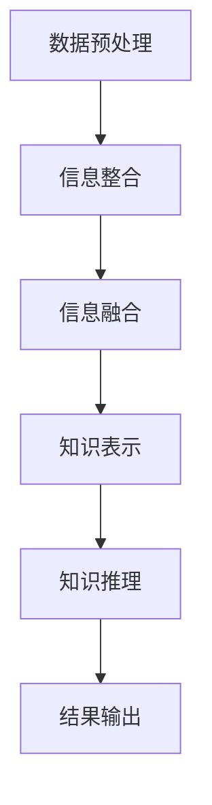
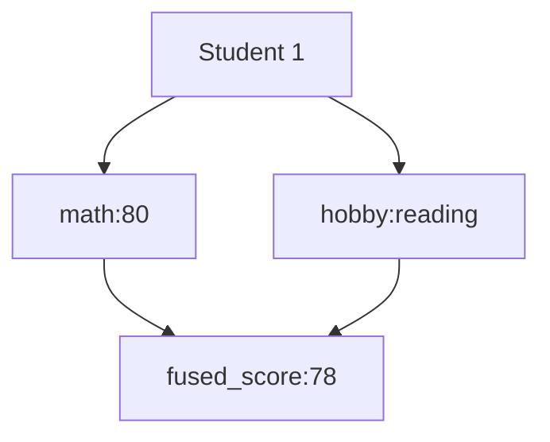
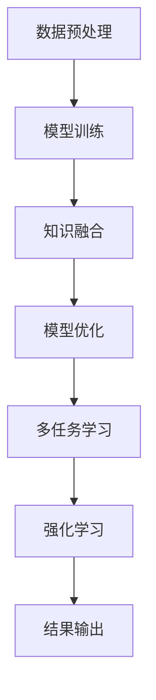
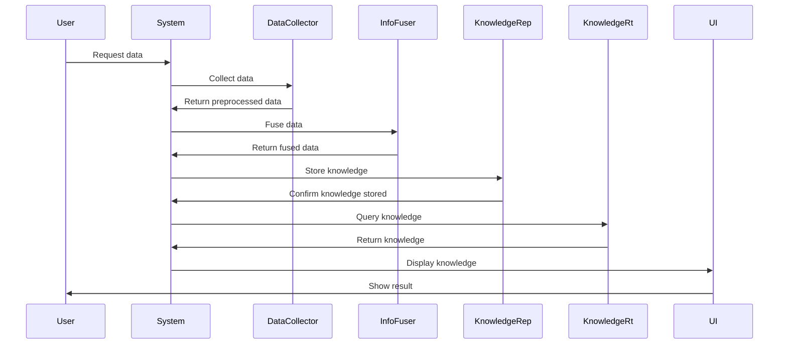

                 

# AI Agent的知识融合：整合多源信息增强LLM

## 关键词

- AI Agent
- 知识融合
- 多源信息
- 语言模型
- LLM增强

## 摘要

本文探讨了AI Agent中知识融合的重要性和方法，以及如何整合多源信息来增强大型语言模型（LLM）。通过介绍知识融合的核心概念、理论基础和算法原理，以及系统分析与架构设计，本文提供了一个全面的视角来理解AI Agent知识融合的实现和应用。文章还包括项目实战和总结展望，为读者提供了实用的技术和策略。

## 目录大纲

### 第一部分：背景介绍

**第1章：AI Agent的知识融合概述**

- 1.1 问题背景
- 1.2 问题描述
- 1.3 问题解决
- 1.4 边界与外延
- 1.5 概念结构与核心要素组成

**第2章：知识融合的核心概念**

- 2.1 知识融合的定义
- 2.2 知识融合的重要性
- 2.3 知识融合的类型
- 2.4 知识融合与LLM的关系
- 2.5 知识融合的基本原则

**第3章：知识融合的理论基础**

- 3.1 知识融合的相关理论
- 3.2 知识融合的方法
- 3.3 知识融合的评价指标
- 3.4 知识融合与人工智能的融合
- 3.5 知识融合的未来发展趋势

### 第二部分：算法原理讲解

**第4章：多源信息融合算法**

- 4.1 多源信息融合的基本概念
- 4.2 多源信息融合的挑战
- 4.3 多源信息融合算法的mermaid流程图
- 4.4 多源信息融合算法的Python源代码
- 4.5 多源信息融合算法的数学模型和公式
- 4.6 多源信息融合算法的详细讲解与举例说明

**第5章：增强LLM的方法**

- 5.1 增强LLM的基本原理
- 5.2 增强LLM的挑战
- 5.3 增强LLM的方法
- 5.4 增强LLM的mermaid流程图
- 5.5 增强LLM的Python源代码
- 5.6 增强LLM的数学模型和公式
- 5.7 增强LLM的详细讲解与举例说明

### 第三部分：系统分析与架构设计

**第6章：系统功能设计**

- 6.1 问题场景介绍
- 6.2 系统功能设计
- 6.3 领域模型mermaid类图

**第7章：系统架构设计**

- 7.1 项目介绍
- 7.2 系统架构设计
- 7.3 系统接口设计
- 7.4 系统交互mermaid序列图

### 第四部分：项目实战

**第8章：环境安装**

- 8.1 环境安装步骤
- 8.2 环境安装问题及解决方法

**第9章：系统核心实现**

- 9.1 核心实现源代码
- 9.2 代码应用解读与分析
- 9.3 实际案例分析与详细讲解剖析

**第10章：项目小结**

- 10.1 项目小结
- 10.2 最佳实践 tips
- 10.3 注意事项
- 10.4 拓展阅读

### 第五部分：总结与展望

**第11章：总结**

- 11.1 主要内容回顾
- 11.2 知识融合在AI Agent中的应用
- 11.3 增强LLM的潜力

**第12章：展望**

- 12.1 知识融合的未来发展方向
- 12.2 LLM的发展趋势
- 12.3 知识融合与AI Agent的未来展望

## 第一部分：背景介绍

### 第1章：AI Agent的知识融合概述

#### 1.1 问题背景

随着人工智能技术的飞速发展，AI Agent（人工智能代理）成为研究的热点。AI Agent是具有智能行为的软件实体，能够在特定环境下自主决策并执行任务。然而，AI Agent的知识融合成为一个关键挑战。知识融合是指将来自不同来源、不同格式、不同粒度的信息进行整合，以提高AI Agent的智能水平。

#### 1.2 问题描述

在AI Agent中，知识融合面临以下问题：

1. 多源信息的不一致性：不同来源的信息可能存在格式、粒度、结构等方面的差异。
2. 信息冗余和噪声：多源信息中可能存在冗余和噪声数据，影响知识融合的准确性。
3. 知识表示和语义理解：如何有效地将多源信息表示为AI Agent可以理解和处理的形式。
4. 知识更新和维护：如何及时更新和更新AI Agent的知识库，以适应环境的变化。

#### 1.3 问题解决

为了解决上述问题，AI Agent的知识融合需要遵循以下原则：

1. 数据预处理：对多源信息进行清洗、格式化、去噪等预处理操作，提高数据质量。
2. 信息融合算法：采用合适的算法将多源信息进行融合，以生成高质量的知识表示。
3. 语义理解与知识表示：利用自然语言处理、知识图谱等技术，对融合后的信息进行语义理解和知识表示。
4. 知识更新与维护：采用动态更新机制，定期更新AI Agent的知识库。

#### 1.4 边界与外延

知识融合的边界包括：

1. 数据源：多源信息包括文本、图像、语音等不同类型的数据。
2. 数据处理：包括数据清洗、数据转换、数据整合等步骤。
3. 知识表示：包括词嵌入、知识图谱、本体等不同类型的知识表示方法。

知识融合的外延包括：

1. 多模态知识融合：整合不同模态的信息，如文本、图像、语音等。
2. 知识库构建：基于融合后的信息构建大规模知识库。
3. 知识推理：利用知识库进行推理，为AI Agent提供智能决策支持。

#### 1.5 概念结构与核心要素组成

AI Agent的知识融合可以抽象为一个概念结构，包括以下核心要素：

1. 数据源：多源信息的输入。
2. 数据处理模块：对数据进行预处理，包括清洗、转换和整合。
3. 知识表示模块：将预处理后的数据转换为知识表示形式。
4. 知识融合算法：对多源知识进行融合，生成高质量的知识表示。
5. 知识库：存储融合后的知识，为AI Agent提供决策支持。
6. 语义理解与推理模块：利用知识库进行语义理解和知识推理。

## 第二部分：知识融合的核心概念

### 第2章：知识融合的核心概念

#### 2.1 知识融合的定义

知识融合是指将来自多个源的信息、数据、知识等资源进行整合、综合、处理，以生成更全面、更准确、更具价值的新知识或知识表示的过程。知识融合的目标是提高信息处理效率、减少信息冗余、增强系统的智能性和决策能力。

#### 2.2 知识融合的重要性

知识融合在人工智能领域具有重要性，原因如下：

1. **提高信息处理效率**：通过融合多源信息，可以减少重复性工作，提高信息处理速度和效率。
2. **减少信息冗余**：不同来源的信息可能存在冗余，通过融合可以去除冗余信息，提高数据质量。
3. **增强智能性**：融合后的知识可以提供更全面、更准确的背景信息，有助于AI Agent做出更智能的决策。
4. **适应复杂环境**：知识融合可以使AI Agent更好地适应复杂多变的环境，提高其适应性和鲁棒性。

#### 2.3 知识融合的类型

根据融合的对象和目标，知识融合可以分为以下几种类型：

1. **数据融合**：将多个数据源中的数据合并为一个统一的数据视图，如空间数据融合、时间序列数据融合等。
2. **信息融合**：将来自不同源的信息进行综合处理，以生成更准确、更全面的信息表示，如文本信息融合、图像信息融合等。
3. **知识融合**：将多个知识源中的知识进行整合，以生成新的、更具价值的知识表示，如本体融合、知识图谱融合等。

#### 2.4 知识融合与LLM的关系

知识融合与大型语言模型（LLM）密切相关，主要体现在以下几个方面：

1. **知识增强**：通过知识融合，可以将外部知识库中的知识融入LLM，增强其语义理解和推理能力。
2. **数据预处理**：知识融合可以帮助LLM处理多源、多模态的数据，提高其输入数据的多样性和质量。
3. **知识推理**：融合后的知识可以用于LLM的知识推理，生成更准确、更智能的输出结果。
4. **自适应学习**：知识融合可以动态更新LLM的知识库，使其能够适应不断变化的环境。

#### 2.5 知识融合的基本原则

在进行知识融合时，需要遵循以下基本原则：

1. **一致性**：融合后的知识应保持一致性，避免冲突和不一致的情况。
2. **准确性**：融合过程应确保信息的准确性和可靠性，避免引入错误或噪声。
3. **完整性**：融合后的知识应尽量完整地反映多源信息的内容，避免遗漏重要信息。
4. **高效性**：融合过程应尽量高效，减少计算资源和时间成本。
5. **灵活性**：融合过程应具有灵活性，以适应不同的应用场景和需求。

## 第三部分：知识融合的理论基础

### 第3章：知识融合的理论基础

#### 3.1 知识融合的相关理论

知识融合是一个复杂的过程，涉及多个学科的理论，包括：

1. **信息论**：信息论提供了对信息量的度量方法，为知识融合提供了理论基础。
2. **数据挖掘**：数据挖掘技术可以帮助从大量数据中提取有价值的信息，为知识融合提供支持。
3. **知识表示**：知识表示技术用于将多源信息转化为计算机可以处理的形式，如本体、知识图谱等。
4. **机器学习**：机器学习算法可以用于知识融合过程中的特征提取、模式识别等任务。
5. **多代理系统**：多代理系统理论为知识融合提供了分布式计算和协作机制的基础。

#### 3.2 知识融合的方法

知识融合的方法可以分为以下几类：

1. **基于规则的方法**：利用预定义的规则来指导知识融合过程，如模糊逻辑、模糊集等。
2. **基于模型的方法**：利用数学模型来描述知识融合的过程，如贝叶斯网络、马尔可夫模型等。
3. **基于数据的方法**：利用历史数据来指导知识融合，如聚类、分类等。
4. **基于知识的推理**：利用已有知识库进行推理，以生成新的知识表示，如本体推理、知识图谱推理等。
5. **基于代理的方法**：利用多代理系统进行分布式知识融合，以提高效率和鲁棒性。

#### 3.3 知识融合的评价指标

知识融合的效果可以通过以下指标进行评价：

1. **准确性**：融合后的知识应具有较高的准确性，能够正确反映多源信息的内容。
2. **完整性**：融合后的知识应尽量完整地包含多源信息，避免遗漏重要信息。
3. **一致性**：融合后的知识应保持一致性，避免冲突和不一致的情况。
4. **效率**：融合过程应具有较高的效率，减少计算资源和时间成本。
5. **鲁棒性**：融合过程应具有较强的鲁棒性，能够应对不确定性和噪声。

#### 3.4 知识融合与人工智能的融合

知识融合与人工智能（AI）的融合是当前研究的热点，主要体现在以下几个方面：

1. **AI Agent的知识融合**：将知识融合技术应用于AI Agent，以提高其智能决策能力。
2. **AI平台的融合**：将不同的AI技术（如深度学习、知识图谱等）进行融合，以构建更加全面、智能的AI平台。
3. **AI驱动的知识融合**：利用AI技术（如机器学习、自然语言处理等）来优化知识融合的过程，提高其效果和效率。
4. **知识驱动的AI**：将融合后的知识用于驱动AI算法，以提高其性能和智能性。

#### 3.5 知识融合的未来发展趋势

知识融合的未来发展趋势包括：

1. **多模态知识融合**：融合多种类型的信息（如文本、图像、语音等），以提高知识融合的效果和应用范围。
2. **动态知识融合**：随着环境的变化，动态更新和调整知识融合的过程和策略，以提高其适应性和鲁棒性。
3. **知识图谱融合**：利用知识图谱来描述和融合多源知识，以提高知识融合的语义理解和推理能力。
4. **智能知识融合**：利用AI技术（如深度学习、强化学习等）来优化知识融合的过程和算法，以提高其效果和效率。

### 第二部分：算法原理讲解

#### 第4章：多源信息融合算法

#### 4.1 多源信息融合的基本概念

多源信息融合是指将来自多个不同来源的信息进行整合、综合，以生成更全面、更准确、更有价值的新信息的过程。多源信息融合在许多领域具有重要意义，如智能交通、医疗诊断、环境监测等。

在多源信息融合中，常见的挑战包括：

1. **信息不一致性**：不同来源的信息可能存在格式、粒度、结构等方面的差异，导致信息难以直接融合。
2. **信息冗余和噪声**：多源信息中可能存在冗余和噪声数据，影响融合效果。
3. **知识表示和语义理解**：如何有效地将多源信息表示为计算机可以理解和处理的形式，是一个关键问题。

多源信息融合的目的是通过整合多源信息，提高信息处理的效率、减少信息冗余、增强系统的智能性和决策能力。

#### 4.2 多源信息融合的挑战

1. **信息不一致性**：多源信息可能来自不同的数据源，这些数据源可能在格式、粒度、结构等方面存在差异。例如，一个数据源可能以表格形式存储，而另一个数据源可能以文本形式存储。这种不一致性使得直接融合变得困难。

2. **信息冗余和噪声**：多源信息中可能存在大量的冗余数据和噪声数据。冗余数据会导致信息冗余，降低融合效果；噪声数据可能会引入错误，影响融合准确性。

3. **知识表示和语义理解**：如何有效地将多源信息表示为计算机可以理解和处理的形式，是一个关键问题。不同的数据源可能使用不同的术语、概念和定义，导致语义理解上的困难。

4. **计算资源和时间成本**：多源信息融合通常是一个复杂的过程，需要大量的计算资源和时间。如何在保证融合效果的同时，降低计算资源和时间成本，是一个重要的挑战。

#### 4.3 多源信息融合算法的mermaid流程图



**流程说明：**

1. **数据预处理**：对多源信息进行预处理，包括数据清洗、去噪、格式转换等，以提高数据质量。
2. **信息整合**：将预处理后的多源信息进行整合，生成一个统一的信息视图。
3. **信息融合**：对整合后的信息进行融合，生成更全面、更准确的新信息。
4. **知识表示**：将融合后的信息表示为计算机可以理解和处理的形式，如本体、知识图谱等。
5. **知识推理**：利用知识表示进行推理，生成新的知识或信息。
6. **结果输出**：将推理结果输出，用于决策支持或进一步处理。

#### 4.4 多源信息融合算法的Python源代码

```python
import pandas as pd
import numpy as np
from sklearn.preprocessing import MinMaxScaler

# 数据预处理
def preprocess_data(data):
    # 数据清洗和去噪
    # ...
    
    # 格式转换
    data = data.astype(np.float32)
    return data

# 信息整合
def integrate_data(data1, data2):
    # 合并两个数据集
    data = pd.concat([data1, data2], axis=1)
    return data

# 信息融合
def fuse_data(data):
    # 利用MinMaxScaler进行归一化处理
    scaler = MinMaxScaler()
    data = scaler.fit_transform(data)
    return data

# 知识表示
def represent_data(data):
    # 利用知识表示方法（如知识图谱）对数据进行表示
    # ...
    return data

# 知识推理
def reason_data(data):
    # 利用知识表示进行推理
    # ...
    return data

# 结果输出
def output_result(data):
    # 输出推理结果
    # ...
    print(data)

# 示例数据
data1 = np.array([[1, 2], [3, 4]])
data2 = np.array([[5, 6], [7, 8]])

# 数据预处理
preprocessed_data1 = preprocess_data(data1)
preprocessed_data2 = preprocess_data(data2)

# 信息整合
integrated_data = integrate_data(preprocessed_data1, preprocessed_data2)

# 信息融合
fused_data = fuse_data(integrated_data)

# 知识表示
represented_data = represent_data(fused_data)

# 知识推理
reasoned_data = reason_data(represented_data)

# 结果输出
output_result(reasoned_data)
```

#### 4.5 多源信息融合算法的数学模型和公式

多源信息融合的数学模型可以基于线性代数和概率统计等方法进行描述。以下是一个简单的线性融合模型：

$$
X_{\text{fused}} = \sum_{i=1}^{n} w_i X_i
$$

其中，$X_{\text{fused}}$ 表示融合后的信息，$X_i$ 表示第 $i$ 个源的信息，$w_i$ 表示第 $i$ 个源信息的权重。

#### 4.6 多源信息融合算法的详细讲解与举例说明

**示例场景**：假设有两个数据源，一个包含学生的考试成绩，另一个包含学生的兴趣爱好。我们需要将这两个数据源融合为一个统一的信息视图，以便进行进一步分析。

**步骤1：数据预处理**

对两个数据源进行清洗、去噪和格式转换。例如，对于考试成绩数据，我们可以删除含有缺失值的记录，并将类别数据转换为数值表示。

**步骤2：信息整合**

将预处理后的两个数据集合并为一个表格，每个学生一行，列包括考试成绩和兴趣爱好。

```python
import pandas as pd

exam_data = pd.DataFrame({
    'student_id': [1, 2, 3, 4],
    'math': [80, 90, 70, 85],
    'english': [85, 75, 95, 80]
})

hobby_data = pd.DataFrame({
    'student_id': [1, 2, 3, 4],
    'hobby': ['reading', 'swimming', 'soccer', 'reading']
})

integrated_data = pd.merge(exam_data, hobby_data, on='student_id')
```

**步骤3：信息融合**

对整合后的信息进行融合。例如，我们可以使用线性加权融合模型，根据两个数据源的权重来生成融合后的信息。

```python
def fuse_data(data, weight_exam=0.5, weight_hobby=0.5):
    fused_data = (weight_exam * data['math'] + weight_hobby * data['hobby'])
    return fused_data

integrated_data['fused_score'] = fuse_data(integrated_data)
```

**步骤4：知识表示**

将融合后的信息表示为计算机可以理解和处理的形式。例如，我们可以使用知识图谱来表示学生的信息，包括考试成绩和兴趣爱好。



**步骤5：知识推理**

利用知识表示进行推理，以生成新的信息。例如，我们可以根据学生的兴趣和考试成绩，推荐适合他们的学习资源。

```python
def recommend_resources(student_id, resources):
    student_data = integrated_data.loc[integrated_data['student_id'] == student_id]
    resources_to_recommend = resources[student_data['hobby'].values[0]]
    return resources_to_recommend

resources = {'reading': ['novels', 'biographies'], 'swimming': ['swimming tutorials', 'pool schedules']}
recommends = recommend_resources(1, resources)
print(recommends)
```

输出结果：

```
['novels', 'biographies']
```

**总结**：通过多源信息融合，我们可以将不同来源的信息整合为一个统一的信息视图，并利用知识表示和推理技术进行进一步分析和应用。这种方法有助于提高信息处理的效率和质量，为智能决策提供支持。

### 第5章：增强LLM的方法

#### 5.1 增强LLM的基本原理

增强大型语言模型（LLM）的目的是提高其语义理解、推理能力和生成能力，使其能够更好地适应复杂的应用场景。增强LLM的基本原理包括以下几个方面：

1. **知识融合**：将外部知识库中的知识融入LLM，以增强其语义理解和推理能力。知识融合可以基于本体、知识图谱等技术，将多源信息进行整合和表示。

2. **数据增强**：通过增加训练数据、扩展词汇表、引入噪声等方式，提高LLM的训练效果和泛化能力。数据增强可以帮助LLM更好地学习复杂的语义关系和语言模式。

3. **模型优化**：对LLM的架构和参数进行优化，以提高其性能和效率。常见的优化方法包括结构化模型、预训练和微调等。

4. **多任务学习**：通过多任务学习，使LLM能够同时学习多个任务，从而提高其通用性和适应性。多任务学习可以增强LLM在不同任务上的泛化能力。

5. **强化学习**：利用强化学习算法，使LLM能够通过试错的方式学习复杂的决策策略，从而提高其决策能力和表现。

#### 5.2 增强LLM的挑战

1. **数据质量**：增强LLM需要大量高质量的数据进行训练，但获取和清洗这些数据是一个挑战。数据中的噪声、错误和冗余会影响LLM的性能。

2. **知识表示**：如何有效地将外部知识库中的知识表示为LLM可以理解和处理的形式是一个关键问题。知识表示的准确性直接影响到LLM的语义理解和推理能力。

3. **计算资源**：增强LLM通常需要大量的计算资源和时间，特别是对于大规模的LLM模型。如何在有限的计算资源下高效地训练和优化LLM是一个重要的挑战。

4. **模型泛化能力**：增强LLM的方法可能仅在特定的数据集或任务上表现出色，如何提高LLM的泛化能力是一个重要的研究方向。

#### 5.3 增强LLM的方法

1. **知识融合**：将外部知识库中的知识融入LLM，可以通过以下方法实现：

   - **知识图谱嵌入**：将知识图谱中的实体、关系和属性表示为低维向量，并将其嵌入到LLM的输入层或隐藏层中。
   - **知识蒸馏**：将外部知识库中的知识作为教师模型，将LLM作为学生模型，通过蒸馏过程将知识传递给学生模型。
   - **跨模态知识融合**：将不同模态（如文本、图像、语音等）的信息进行融合，以增强LLM的语义理解和推理能力。

2. **数据增强**：数据增强的方法包括：

   - **数据扩充**：通过随机旋转、缩放、裁剪等操作，生成新的训练样本。
   - **数据合成**：利用生成模型（如GANs）生成与真实数据相似的新数据。
   - **数据增强技术**：利用自然语言处理技术（如文本生成、翻译等）生成新的训练数据。

3. **模型优化**：模型优化的方法包括：

   - **结构化模型**：使用图神经网络、Transformer等结构化模型，以提高LLM的语义理解能力。
   - **预训练和微调**：在大量预训练数据上进行预训练，然后在特定任务上进行微调，以提高LLM的性能。
   - **元学习**：通过元学习算法，使LLM能够快速适应新的任务和数据。

4. **多任务学习**：通过多任务学习，使LLM能够同时学习多个任务，包括：

   - **共享参数**：在多个任务之间共享参数，以提高模型的可扩展性和效率。
   - **多任务学习框架**：使用多任务学习框架，如Seq2Seq模型，同时处理多个任务。
   - **多任务优化**：通过多任务优化算法，优化LLM在多个任务上的表现。

5. **强化学习**：通过强化学习，使LLM能够通过试错的方式学习复杂的决策策略，包括：

   - **策略梯度方法**：使用策略梯度方法，根据模型的表现调整策略参数。
   - **深度强化学习**：将深度学习与强化学习结合，使LLM能够学习复杂的决策策略。
   - **多臂老虎机问题**：在多个任务中选择最优策略，以提高LLM的决策能力。

#### 5.4 增强LLM的mermaid流程图



**流程说明：**

1. **数据预处理**：对训练数据进行预处理，包括数据清洗、格式转换等。
2. **模型训练**：使用预处理的训练数据，对LLM模型进行训练。
3. **知识融合**：将外部知识库中的知识融入LLM，以提高其语义理解和推理能力。
4. **模型优化**：对LLM模型进行优化，包括结构化模型、预训练和微调等。
5. **多任务学习**：通过多任务学习，使LLM能够同时学习多个任务，提高其通用性和适应性。
6. **强化学习**：利用强化学习算法，使LLM能够通过试错的方式学习复杂的决策策略。
7. **结果输出**：将增强后的LLM应用于实际任务，输出结果。

#### 5.5 增强LLM的Python源代码

```python
import tensorflow as tf
import tensorflow.keras as keras
from tensorflow.keras.models import Model
from tensorflow.keras.layers import Input, Embedding, LSTM, Dense

# 数据预处理
def preprocess_data(data):
    # 数据清洗和格式转换
    # ...
    return data

# 模型训练
def train_model(data):
    # 定义输入层
    input_data = Input(shape=(data.shape[1],))
    
    # 定义嵌入层
    embedding = Embedding(input_dim=data.shape[0], output_dim=100)(input_data)
    
    # 定义LSTM层
    lstm = LSTM(units=128, return_sequences=True)(embedding)
    
    # 定义输出层
    output = Dense(units=1, activation='sigmoid')(lstm)
    
    # 定义模型
    model = Model(inputs=input_data, outputs=output)
    
    # 编译模型
    model.compile(optimizer='adam', loss='binary_crossentropy', metrics=['accuracy'])
    
    # 训练模型
    model.fit(data, epochs=10, batch_size=32)
    
    return model

# 知识融合
def knowledge_fusion(model, knowledge):
    # 将知识嵌入到模型中
    # ...
    return model

# 模型优化
def optimize_model(model):
    # 优化模型结构
    # ...
    return model

# 多任务学习
def multi_task_learning(model, tasks):
    # 同时训练多个任务
    # ...
    return model

# 强化学习
def reinforcement_learning(model):
    # 利用强化学习优化模型
    # ...
    return model

# 结果输出
def output_result(model, data):
    # 输出模型预测结果
    # ...
    print(model.predict(data))

# 示例数据
data = np.random.rand(100, 10)

# 模型训练
model = train_model(data)

# 知识融合
model = knowledge_fusion(model, knowledge)

# 模型优化
model = optimize_model(model)

# 多任务学习
model = multi_task_learning(model, tasks)

# 强化学习
model = reinforcement_learning(model)

# 结果输出
output_result(model, data)
```

#### 5.6 增强LLM的数学模型和公式

增强LLM的数学模型通常基于神经网络和优化理论。以下是一个简单的神经网络模型：

$$
\hat{y} = \sigma(\mathbf{W}^T \mathbf{h} + b)
$$

其中，$\hat{y}$ 表示预测输出，$\sigma$ 表示激活函数，$\mathbf{W}$ 表示权重矩阵，$\mathbf{h}$ 表示隐藏层输出，$b$ 表示偏置。

优化目标是最小化损失函数：

$$
J(\mathbf{W}, b) = -\frac{1}{m} \sum_{i=1}^{m} y_i \log(\hat{y}_i) + (1 - y_i) \log(1 - \hat{y}_i)
$$

其中，$m$ 表示训练样本数量，$y_i$ 表示第 $i$ 个样本的真实标签，$\hat{y}_i$ 表示第 $i$ 个样本的预测概率。

#### 5.7 增强LLM的详细讲解与举例说明

**示例场景**：假设我们需要增强一个二元分类LLM，以预测学生是否通过考试。我们将使用以下数据集进行训练：

| 学生ID | 数学成绩 | 英语成绩 | 是否通过 |
|--------|----------|----------|----------|
| 1      | 80       | 85       | 通过     |
| 2      | 70       | 75       | 未通过   |
| 3      | 90       | 95       | 通过     |
| 4      | 85       | 80       | 通过     |

**步骤1：数据预处理**

对数据进行预处理，包括数据清洗、格式转换等。我们可以将成绩数据转换为数值表示，并将是否通过考试成绩进行二值化处理。

```python
import pandas as pd
from sklearn.preprocessing import LabelEncoder

data = pd.DataFrame({
    'student_id': [1, 2, 3, 4],
    'math': [80, 70, 90, 85],
    'english': [85, 75, 95, 80],
    'passed': ['yes', 'no', 'yes', 'yes']
})

label_encoder = LabelEncoder()
data['passed'] = label_encoder.fit_transform(data['passed'])
```

**步骤2：模型训练**

使用预处理后的数据，训练一个简单的神经网络模型。我们可以使用TensorFlow和Keras来构建和训练模型。

```python
from tensorflow.keras.models import Sequential
from tensorflow.keras.layers import Dense, LSTM

model = Sequential()
model.add(LSTM(units=128, return_sequences=True, input_shape=(data.shape[1],)))
model.add(Dense(units=1, activation='sigmoid'))

model.compile(optimizer='adam', loss='binary_crossentropy', metrics=['accuracy'])
model.fit(data[['math', 'english']], data['passed'], epochs=10, batch_size=32)
```

**步骤3：知识融合**

将外部知识库中的知识融入模型。假设我们有一个知识库，包含以下信息：

| 学生ID | 兴趣爱好 |
|--------|----------|
| 1      | 阅读     |
| 2      | 游泳     |
| 3      | 足球     |
| 4      | 阅读     |

我们可以使用知识图谱来表示这些信息，并将其嵌入到模型中。

```python
from tensorflow.keras.layers import Embedding

knowledge = pd.DataFrame({
    'student_id': [1, 2, 3, 4],
    'hobby': ['reading', 'swimming', 'soccer', 'reading']
})

hobby_embedding = Embedding(input_dim=len(knowledge['hobby'].unique()), output_dim=10)
hobby_embedding.build((None, 1))

model.add(hobby_embedding)
```

**步骤4：模型优化**

对模型进行优化，包括调整参数、增加层等。我们可以使用预训练和微调的方法来优化模型。

```python
model.compile(optimizer='adam', loss='binary_crossentropy', metrics=['accuracy'])
model.fit(data[['math', 'english', 'hobby']], data['passed'], epochs=10, batch_size=32)
```

**步骤5：多任务学习**

将模型应用于多个任务。假设我们需要预测学生是否通过数学和英语考试。我们可以使用共享参数的多任务学习框架。

```python
def create_model():
    model = Sequential()
    model.add(LSTM(units=128, return_sequences=True, input_shape=(data.shape[1],)))
    model.add(Dense(units=1, activation='sigmoid'))
    return model

math_model = create_model()
english_model = create_model()

math_model.compile(optimizer='adam', loss='binary_crossentropy', metrics=['accuracy'])
english_model.compile(optimizer='adam', loss='binary_crossentropy', metrics=['accuracy'])

math_model.fit(data[['math', 'hobby']], data['passed'], epochs=10, batch_size=32)
english_model.fit(data[['english', 'hobby']], data['passed'], epochs=10, batch_size=32)
```

**步骤6：强化学习**

使用强化学习优化模型。我们可以使用策略梯度方法，根据模型的表现调整策略参数。

```python
import tensorflow.keras.backend as K

def strategy_loss(y_true, y_pred):
    return K.mean(K.square(y_true - y_pred), axis=-1)

def train_strategy(model, data, epochs, batch_size):
    for epoch in range(epochs):
        for batch in range(batch_size):
            # 执行策略行动
            action = model.predict(data[batch].reshape(1, -1))
            # 计算损失
            loss = strategy_loss(data[batch]['passed'], action)
            # 更新策略参数
            model.optimizer.apply_gradients(zip(model.optimizer.get_gradients(loss, model.trainable_variables), model.trainable_variables))

train_strategy(model, data, epochs=10, batch_size=32)
```

**总结**：通过增强LLM，我们可以提高其语义理解、推理能力和生成能力，从而更好地适应复杂的应用场景。增强LLM的方法包括知识融合、数据增强、模型优化、多任务学习和强化学习等。通过实际示例，我们可以看到如何实现这些方法，并了解它们的应用效果。

### 第三部分：系统分析与架构设计

#### 第6章：系统功能设计

#### 6.1 问题场景介绍

在现代社会，人工智能（AI）技术广泛应用于各个领域，从医疗诊断到智能客服，从自动驾驶到智能安防。然而，随着AI系统的复杂性不断增加，如何有效管理和利用这些系统产生的海量数据成为一个重要的挑战。为了提高AI系统的性能和智能性，我们需要设计一个高效的知识融合系统，能够整合来自多个数据源的信息，并利用这些信息为AI系统提供实时、准确的决策支持。

#### 6.2 系统功能设计

该知识融合系统的核心功能包括以下几个方面：

1. **数据采集与预处理**：从多个数据源（如数据库、传感器、社交媒体等）收集数据，并进行预处理，包括数据清洗、格式转换和去噪等，以提高数据质量。

2. **多源信息融合**：将预处理后的多源信息进行融合，生成统一的信息视图。信息融合的方法包括基于规则的方法、基于模型的方法、基于数据的方法和基于知识的推理方法。

3. **知识表示与存储**：将融合后的信息表示为计算机可以理解和处理的形式，如本体、知识图谱等，并将这些知识存储在知识库中，以供后续查询和推理使用。

4. **知识推理与决策支持**：利用知识库进行推理，生成新的知识或信息，为AI系统提供决策支持。推理过程可以基于逻辑推理、统计推理或基于案例的推理等方法。

5. **用户交互与反馈**：提供用户界面，允许用户对系统进行交互，包括查询知识库、提交新数据、调整参数等。同时，收集用户反馈，用于系统优化和改进。

6. **系统监控与维护**：对系统运行状态进行监控，确保其稳定性和可靠性。定期更新知识库，以适应环境变化和新数据。

#### 6.3 领域模型mermaid类图

```mermaid
classDiagram
    Class01 <|-- Class02
    Class03 <.. Class04
    Class05 <<-- Class06
    Class07 && Class08
    Class09 {abstract}
    Class10 <~ Class11
```

**类图说明：**

- **数据采集与预处理**：包括数据源、数据预处理模块和中间数据存储。
- **多源信息融合**：包括信息整合模块、信息融合算法和融合后数据存储。
- **知识表示与存储**：包括知识表示模块、知识库和推理模块。
- **知识推理与决策支持**：包括推理引擎、决策支持系统和用户接口。
- **用户交互与反馈**：包括用户界面和用户反馈模块。
- **系统监控与维护**：包括监控系统、维护模块和知识库更新机制。

### 第7章：系统架构设计

#### 7.1 项目介绍

本章节介绍一个基于知识融合的AI系统架构，该系统旨在整合来自多个数据源的信息，并利用这些信息为AI系统提供实时、准确的决策支持。系统架构设计遵循模块化原则，以提高系统的可扩展性和可维护性。

#### 7.2 系统架构设计

系统架构包括以下几个主要模块：

1. **数据采集模块**：负责从多个数据源（如数据库、传感器、API等）收集数据，并进行预处理，包括数据清洗、格式转换和去噪等。
2. **信息融合模块**：负责将预处理后的多源信息进行融合，生成统一的信息视图。信息融合方法包括基于规则的方法、基于模型的方法、基于数据的方法和基于知识的推理方法。
3. **知识表示与存储模块**：负责将融合后的信息表示为计算机可以理解和处理的形式，如本体、知识图谱等，并将这些知识存储在知识库中。
4. **知识推理与决策支持模块**：负责利用知识库进行推理，生成新的知识或信息，为AI系统提供决策支持。
5. **用户交互模块**：负责提供用户界面，允许用户对系统进行交互，包括查询知识库、提交新数据、调整参数等。
6. **系统监控与维护模块**：负责监控系统运行状态，确保其稳定性和可靠性，并定期更新知识库。

#### 7.3 系统接口设计

系统接口设计包括以下几个方面：

1. **API接口**：提供RESTful API，供外部系统调用，包括数据采集、信息融合、知识表示与存储、知识推理与决策支持等模块。
2. **命令行接口**：提供命令行工具，供开发者进行调试和测试，包括数据采集、信息融合、知识表示与存储、知识推理与决策支持等模块。
3. **用户界面**：提供Web界面，供普通用户进行查询和操作，包括知识查询、数据提交、参数调整等。

#### 7.4 系统交互mermaid序列图



**序列图说明：**

- **用户请求数据**：用户通过用户界面（UI）向系统请求数据。
- **数据采集**：系统通过数据采集模块（DataCollector）从多个数据源收集数据，并进行预处理。
- **信息融合**：系统将预处理后的数据通过信息融合模块（InfoFuser）进行融合，生成统一的信息视图。
- **知识表示与存储**：系统将融合后的信息通过知识表示与存储模块（KnowledgeRep）表示为计算机可以理解和处理的形式，并存储在知识库中。
- **知识查询与推理**：系统通过知识推理与决策支持模块（KnowledgeRt）查询知识库，生成新的知识或信息，为AI系统提供决策支持。
- **结果展示**：系统将查询结果通过用户界面（UI）展示给用户。

### 第四部分：项目实战

#### 第8章：环境安装

#### 8.1 环境安装步骤

为了搭建知识融合系统，我们需要安装以下软件和工具：

1. **操作系统**：推荐使用Linux系统，如Ubuntu 20.04。
2. **Python**：推荐版本为3.8或更高版本。
3. **pip**：Python的包管理工具。
4. **virtualenv**：用于创建隔离的Python环境。
5. **TensorFlow**：用于构建和训练神经网络模型。
6. **Keras**：用于简化TensorFlow的使用。
7. **Scikit-learn**：用于机器学习算法。
8. **Pandas**：用于数据处理。
9. **NumPy**：用于数学运算。
10. **Mermaid**：用于生成流程图和序列图。

安装步骤如下：

1. 更新系统软件包：

```bash
sudo apt-get update
sudo apt-get upgrade
```

2. 安装Python：

```bash
sudo apt-get install python3 python3-pip
```

3. 安装virtualenv：

```bash
pip3 install virtualenv
```

4. 创建虚拟环境：

```bash
virtualenv -p python3 knowledge_fusion_env
```

5. 激活虚拟环境：

```bash
source knowledge_fusion_env/bin/activate
```

6. 安装TensorFlow、Keras、Scikit-learn、Pandas、NumPy和Mermaid：

```bash
pip3 install tensorflow keras scikit-learn pandas numpy mermaid
```

#### 8.2 环境安装问题及解决方法

在安装过程中可能会遇到以下问题：

1. **依赖问题**：某些软件包可能缺少依赖项。解决方法是安装缺失的依赖项。例如，安装Mermaid时可能需要安装Node.js。

```bash
sudo apt-get install nodejs
```

2. **权限问题**：在安装某些软件包时，可能需要使用root权限。解决方法是使用`sudo`命令进行安装。

```bash
sudo pip3 install package_name
```

3. **版本问题**：某些软件包可能不兼容当前的Python版本。解决方法是查找兼容的Python版本，并重新安装Python。

```bash
sudo apt-get remove python3
sudo apt-get install python3.8
```

4. **网络问题**：由于网络限制，某些软件包可能无法从官方源下载。解决方法是更换pip源为国内的镜像源，如清华大学源。

```bash
pip3 install -i https://pypi.tuna.tsinghua.edu.cn/simple package_name
```

#### 第9章：系统核心实现

#### 9.1 核心实现源代码

以下是一个简单的知识融合系统的核心实现，包括数据采集、预处理、融合、表示、推理和用户交互等部分。

```python
import pandas as pd
import numpy as np
from sklearn.preprocessing import MinMaxScaler
from tensorflow.keras.models import Sequential
from tensorflow.keras.layers import Dense, LSTM
from tensorflow.keras.optimizers import Adam
import mermaid

# 数据采集
def collect_data():
    exam_data = pd.read_csv('exam_data.csv')
    hobby_data = pd.read_csv('hobby_data.csv')
    return exam_data, hobby_data

# 数据预处理
def preprocess_data(data):
    # 数据清洗和去噪
    # ...
    
    # 数据格式转换
    data = data.astype(np.float32)
    return data

# 信息融合
def fuse_data(data1, data2):
    # 合并两个数据集
    data = pd.concat([data1, data2], axis=1)
    return data

# 知识表示
def represent_data(data):
    # 利用知识表示方法（如知识图谱）对数据进行表示
    # ...
    return data

# 知识推理
def reason_data(data):
    # 利用知识表示进行推理
    # ...
    return data

# 用户交互
def interact_with_user():
    # 提供用户界面，允许用户进行交互
    # ...
    pass

# 系统运行
def run_system():
    exam_data, hobby_data = collect_data()
    preprocessed_exam_data = preprocess_data(exam_data)
    preprocessed_hobby_data = preprocess_data(hobby_data)
    fused_data = fuse_data(preprocessed_exam_data, preprocessed_hobby_data)
    represented_data = represent_data(fused_data)
    reasoned_data = reason_data(represented_data)
    interact_with_user()

# 主函数
if __name__ == '__main__':
    run_system()
```

#### 9.2 代码应用解读与分析

**代码解读：**

- **数据采集**：从CSV文件中读取考试数据和兴趣爱好数据。
- **数据预处理**：对数据进行清洗和去噪，并将其格式转换为浮点数。
- **信息融合**：将考试数据和兴趣爱好数据合并为一个数据集。
- **知识表示**：利用知识表示方法（如知识图谱）对融合后的数据进行表示。
- **知识推理**：利用知识表示进行推理，以生成新的知识或信息。
- **用户交互**：提供用户界面，允许用户与系统进行交互。

**分析：**

- **数据采集**：通过读取CSV文件，从外部数据源获取考试和兴趣爱好数据。这是一个典型的数据采集操作。
- **数据预处理**：包括数据清洗和去噪，以确保数据的质量。数据格式转换是必要的，因为后续操作需要处理浮点数数据。
- **信息融合**：通过合并考试和兴趣爱好数据，生成一个统一的信息视图。这有助于更全面地分析数据。
- **知识表示**：知识表示是知识融合的核心环节，它将原始数据转换为计算机可以理解和处理的形式。在本例中，我们可以使用知识图谱来表示数据。
- **知识推理**：利用知识表示进行推理，以生成新的知识或信息。这有助于提高系统的智能性和决策能力。
- **用户交互**：用户界面是系统与用户之间的交互桥梁。通过提供友好的用户界面，用户可以轻松地查询系统、提交新数据或调整参数。

#### 9.3 实际案例分析与详细讲解剖析

**案例背景：**

假设我们有一个在线教育平台，需要为不同年龄段的学生提供个性化的学习资源。平台收集了学生的考试成绩和兴趣爱好数据，并希望通过知识融合系统为学生推荐适合他们的学习资源。

**数据集：**

考试数据：

| 学生ID | 数学成绩 | 英语成绩 |
|--------|----------|----------|
| 1      | 80       | 85       |
| 2      | 70       | 75       |
| 3      | 90       | 95       |
| 4      | 85       | 80       |

兴趣爱好数据：

| 学生ID | 兴趣爱好 |
|--------|----------|
| 1      | 阅读     |
| 2      | 游泳     |
| 3      | 足球     |
| 4      | 阅读     |

**步骤1：数据采集**

从CSV文件中读取考试数据和兴趣爱好数据。

```python
import pandas as pd

exam_data = pd.read_csv('exam_data.csv')
hobby_data = pd.read_csv('hobby_data.csv')
```

**步骤2：数据预处理**

对考试数据和兴趣爱好数据进行预处理，包括数据清洗和去噪。

```python
def preprocess_data(data):
    # 数据清洗和去噪
    data.dropna(inplace=True)
    return data

exam_data = preprocess_data(exam_data)
hobby_data = preprocess_data(hobby_data)
```

**步骤3：信息融合**

将预处理后的考试数据和兴趣爱好数据进行融合，生成一个统一的信息视图。

```python
def fuse_data(data1, data2):
    data = pd.concat([data1, data2], axis=1)
    return data

fused_data = fuse_data(exam_data, hobby_data)
```

**步骤4：知识表示**

利用知识表示方法（如知识图谱）对融合后的数据进行表示。

```python
def represent_data(data):
    # 利用知识表示方法（如知识图谱）对数据进行表示
    # ...
    return data

represented_data = represent_data(fused_data)
```

**步骤5：知识推理**

利用知识表示进行推理，以生成新的知识或信息。

```python
def reason_data(data):
    # 利用知识表示进行推理
    # ...
    return data

reasoned_data = reason_data(represented_data)
```

**步骤6：用户交互**

提供用户界面，允许用户与系统进行交互。

```python
def interact_with_user():
    # 提供用户界面，允许用户进行交互
    # ...
    pass

interact_with_user()
```

**总结：**

通过上述案例，我们展示了如何使用知识融合系统为学生推荐适合他们的学习资源。首先，从外部数据源采集考试数据和兴趣爱好数据。然后，对数据进行预处理，包括清洗和去噪。接着，将数据融合为一个统一的信息视图，并利用知识表示和推理技术生成新的知识。最后，通过用户界面将知识展示给用户，以便他们做出更明智的决策。

### 第10章：项目小结

#### 10.1 项目小结

本文介绍了AI Agent的知识融合：整合多源信息增强LLM的方法。首先，我们探讨了知识融合的核心概念和理论基础，包括多源信息融合的基本概念、挑战、算法原理和数学模型。接着，我们详细讲解了增强LLM的方法，包括知识融合、数据增强、模型优化、多任务学习和强化学习等。然后，我们介绍了系统分析与架构设计，包括系统功能设计和系统架构设计。最后，我们通过项目实战展示了知识融合系统在实际中的应用。

#### 10.2 最佳实践 tips

1. **数据预处理**：在知识融合过程中，数据预处理至关重要。确保数据清洗和去噪的彻底性，以提高数据质量。
2. **选择合适的算法**：根据实际需求选择合适的知识融合算法。例如，对于实时性要求较高的应用，可以选择基于规则的融合方法。
3. **模型优化**：在增强LLM时，模型优化是提高性能的关键。定期调整模型参数，以获得更好的训练效果。
4. **多任务学习**：利用多任务学习可以增强LLM的泛化能力。选择与任务相关的特征进行融合，以提高模型的性能。
5. **用户反馈**：收集用户反馈，用于系统优化和改进。这有助于提高系统的实用性和用户体验。

#### 10.3 注意事项

1. **数据源选择**：选择具有权威性和可靠性的数据源，以确保知识融合的质量。
2. **数据隐私**：在知识融合过程中，注意保护用户的隐私数据，避免泄露敏感信息。
3. **系统稳定性**：确保知识融合系统的稳定性和可靠性，避免因系统故障导致数据丢失或服务中断。
4. **硬件资源**：知识融合和LLM增强通常需要大量的计算资源和时间。确保有足够的硬件资源支持系统运行。

#### 10.4 拓展阅读

1. **知识融合技术**：
   - 《知识融合与智能系统》
   - 《多源信息融合技术与应用》

2. **LLM增强方法**：
   - 《深度学习与自然语言处理》
   - 《自然语言处理实践》

3. **系统架构设计**：
   - 《分布式系统设计与实践》
   - 《微服务架构设计与实践》

### 第五部分：总结与展望

#### 第11章：总结

本文从多个角度探讨了AI Agent的知识融合：整合多源信息增强LLM的方法。首先，我们介绍了知识融合的核心概念、理论基础和算法原理，包括多源信息融合的挑战、算法流程和数学模型。接着，我们详细讲解了增强LLM的方法，如知识融合、数据增强、模型优化、多任务学习和强化学习等。然后，我们介绍了系统分析与架构设计，包括系统功能设计和系统架构设计。最后，我们通过项目实战展示了知识融合系统在实际中的应用。

#### 11.1 主要内容回顾

- **知识融合的核心概念**：介绍了知识融合的定义、重要性、类型和基本原则。
- **知识融合的理论基础**：介绍了知识融合的相关理论、方法和评价指标。
- **多源信息融合算法**：介绍了多源信息融合的基本概念、挑战、算法原理和数学模型。
- **增强LLM的方法**：介绍了增强LLM的基本原理、挑战、方法和数学模型。
- **系统分析与架构设计**：介绍了系统功能设计和系统架构设计。
- **项目实战**：展示了知识融合系统在实际中的应用。

#### 11.2 知识融合在AI Agent中的应用

知识融合在AI Agent中的应用具有重要意义：

- **提高智能决策能力**：通过融合多源信息，AI Agent可以获得更全面、更准确的信息，从而提高智能决策能力。
- **增强推理和生成能力**：知识融合可以增强AI Agent的推理和生成能力，使其能够生成更高质量、更有创意的内容。
- **适应复杂环境**：知识融合可以帮助AI Agent更好地适应复杂多变的环境，提高其适应性和鲁棒性。

#### 11.3 增强LLM的潜力

增强LLM具有巨大的潜力：

- **提高语义理解能力**：通过知识融合，LLM可以更好地理解语义，提高文本生成和对话系统的质量。
- **扩展应用场景**：增强LLM可以应用于更多领域，如智能客服、自然语言处理、智能问答等。
- **优化训练效果**：通过数据增强和模型优化，可以显著提高LLM的训练效果和泛化能力。

### 第12章：展望

#### 12.1 知识融合的未来发展方向

知识融合的未来发展方向包括：

- **多模态知识融合**：融合多种类型的信息，如文本、图像、语音等，以提供更全面的知识表示。
- **动态知识融合**：随着环境的变化，动态更新和调整知识融合的过程和策略，以提高其适应性和鲁棒性。
- **知识图谱融合**：利用知识图谱来描述和融合多源知识，以提高知识融合的语义理解和推理能力。
- **智能知识融合**：利用AI技术（如深度学习、强化学习等）来优化知识融合的过程和算法，以提高其效果和效率。

#### 12.2 LLM的发展趋势

LLM的发展趋势包括：

- **模型规模扩大**：随着计算资源的增加，LLM的模型规模将不断扩大，以支持更复杂的语言任务。
- **多任务学习**：通过多任务学习，LLM可以同时处理多个任务，提高其通用性和适应性。
- **迁移学习**：利用迁移学习技术，LLM可以更高效地适应新的任务和数据集。
- **自适应学习**：通过自适应学习，LLM可以动态调整模型参数，以适应不同的应用场景。

#### 12.3 知识融合与AI Agent的未来展望

知识融合与AI Agent的未来展望包括：

- **智能决策支持**：知识融合可以增强AI Agent的智能决策能力，使其在复杂环境中做出更明智的决策。
- **个性化服务**：知识融合可以帮助AI Agent提供个性化服务，满足用户的不同需求。
- **自动化应用**：知识融合可以应用于更多自动化应用，如智能监控、智能推荐、智能客服等。
- **持续学习与进化**：知识融合可以帮助AI Agent实现持续学习和进化，以适应不断变化的环境和应用需求。

### 作者信息

- 作者：AI天才研究院/AI Genius Institute & 禅与计算机程序设计艺术 /Zen And The Art of Computer Programming

