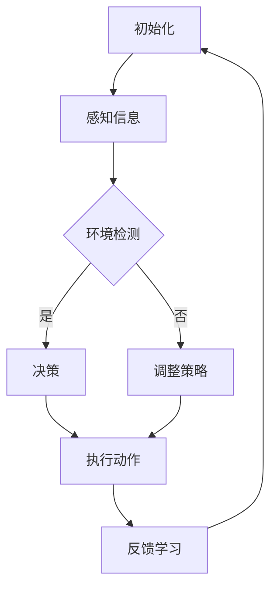
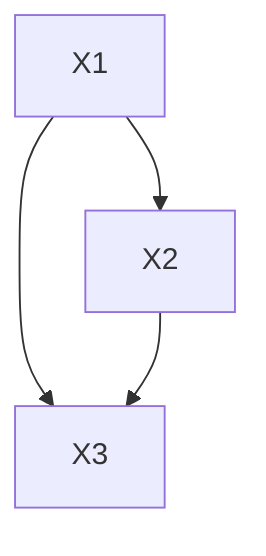
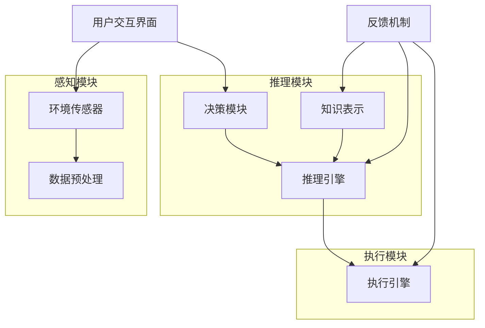

                 

### 文章标题

# AI Agent的知识表示与推理系统优化

> 关键词：AI Agent、知识表示、推理系统、优化、算法、系统架构

> 摘要：本文将深入探讨AI Agent的知识表示与推理系统优化，从核心概念、算法原理、系统架构到实际应用，全面解析AI Agent的技术内核与未来发展方向。

在人工智能领域，AI Agent已经成为研究和应用的重要方向。AI Agent是能够自主执行任务、与环境交互并做出决策的智能体。一个高效的AI Agent需要具备强大的知识表示和推理能力，以确保其能够准确地理解和处理复杂问题。本文将围绕AI Agent的知识表示与推理系统优化，进行系统性的分析和探讨。

首先，我们将介绍AI Agent的基本概念，包括其定义、功能和应用场景。接着，我们将深入讨论知识表示和推理系统的核心概念，包括各种知识表示方法和推理机制。随后，我们将详细讲解关键算法原理，包括数学模型和Python代码实现。然后，我们将介绍系统分析与架构设计，包括问题场景介绍、系统功能设计、系统架构设计和系统接口设计。接下来，我们将通过一个实际项目案例，展示如何实现AI Agent的知识表示与推理系统优化。最后，我们将总结最佳实践技巧、注意事项和未来发展方向。

### 第1章 问题背景与核心概念

#### 1.1 问题背景

在当今快速发展的信息化时代，人工智能（AI）技术已经渗透到我们生活的各个领域，从智能家居到自动驾驶，从自然语言处理到图像识别，AI的应用场景越来越广泛。然而，随着应用场景的复杂化和多样化，对AI Agent的要求也越来越高。AI Agent需要具备自主决策、灵活应对和持续学习的能力，以满足不同场景的需求。这就需要我们深入研究和优化AI Agent的知识表示与推理系统。

AI Agent的知识表示与推理系统是其核心组件，直接影响其性能和应用效果。知识表示决定了AI Agent能够理解和处理的信息类型和范围，而推理系统则决定了AI Agent如何利用这些知识进行逻辑推理和决策。因此，如何有效地优化AI Agent的知识表示与推理系统，成为一个亟待解决的关键问题。

#### 1.2 AI Agent的基本概念

AI Agent，也称为智能代理或智能体，是一种能够自主执行任务、与环境交互并做出决策的软件系统。它通常由感知模块、推理模块和行动模块组成。感知模块负责接收外部环境的信息，推理模块利用这些信息进行逻辑推理和决策，行动模块则根据决策执行相应的动作。

AI Agent的主要功能包括：

1. **感知与理解**：通过传感器获取环境信息，并将其转化为内部表示。
2. **决策与规划**：基于当前状态和目标，通过推理机制生成行动计划。
3. **执行与反馈**：执行计划中的动作，并根据结果调整后续行动。

AI Agent的应用场景非常广泛，包括但不限于：

1. **智能家居**：自动化控制家电设备，提高生活便利性。
2. **智能客服**：提供24/7的客户服务，提高客户满意度。
3. **自动驾驶**：实现自主驾驶，提高交通安全和效率。
4. **智能制造**：优化生产流程，提高生产效率和产品质量。

#### 1.3 知识表示与推理系统在AI Agent中的应用

知识表示与推理系统是AI Agent的核心组件，直接影响其性能和应用效果。

**知识表示**是AI Agent对环境中的信息进行抽象和组织的过程，常见的知识表示方法包括：

1. **符号主义表示**：使用符号和逻辑公式表示知识，如谓词逻辑、一阶逻辑等。
2. **模式识别表示**：通过特征提取和模式匹配来表示知识，如神经网络、决策树等。
3. **基于知识的表示**：将知识表示为事实和规则，如专家系统、知识图谱等。

**推理系统**则是AI Agent利用知识进行逻辑推理和决策的过程。常见的推理机制包括：

1. **形式推理**：基于逻辑规则进行推理，如演绎推理、归纳推理等。
2. **实例推理**：基于已有实例进行推理，如案例推理、类比推理等。
3. **混合推理**：结合多种推理机制，如基于规则的推理和基于案例的推理相结合。

在AI Agent中，知识表示与推理系统的应用主要体现在以下几个方面：

1. **情境理解**：通过知识表示和推理，AI Agent能够更好地理解当前情境，做出更准确的决策。
2. **任务规划**：通过推理系统，AI Agent能够生成合理的行动计划，实现自主决策。
3. **持续学习**：通过不断更新和优化知识表示与推理系统，AI Agent能够提高其适应性和学习能力。

总之，知识表示与推理系统是AI Agent的核心技术，其优化和提升对于AI Agent的性能和应用效果至关重要。在接下来的章节中，我们将进一步探讨知识表示和推理系统的具体原理和实现方法。

### 第2章 核心概念原理与比较

在深入探讨AI Agent的知识表示与推理系统之前，有必要明确其中的核心概念，并理解它们之间的联系和区别。本章将详细解析知识表示方法和推理机制，并通过概念属性特征对比表格和ER实体关系图架构来进一步说明。

#### 2.1 知识表示方法

知识表示是AI Agent理解环境信息的基础。以下是三种主要的知识表示方法：

1. **符号主义表示**：符号主义表示使用符号和逻辑公式来表示知识，如谓词逻辑、一阶逻辑等。这种方法的优势在于其形式化和严密性，可以精确描述复杂的逻辑关系。然而，符号主义表示对领域知识的依赖较强，难以处理不完整或不确定的知识。

   - **优势**：形式化、严密性、精确性。
   - **局限**：对领域知识依赖强、难以处理不确定知识。

2. **模式识别表示**：模式识别表示通过特征提取和模式匹配来表示知识，如神经网络、决策树等。这种方法的优势在于其处理大数据和复杂模式的能力，可以高效地识别和分类数据。然而，模式识别表示对特定问题的适应性较强，难以进行复杂的逻辑推理。

   - **优势**：处理大数据、复杂模式、高效性。
   - **局限**：适应性较强、难以进行复杂逻辑推理。

3. **基于知识的表示**：基于知识的表示将知识表示为事实和规则，如专家系统、知识图谱等。这种方法的优势在于其灵活性和可解释性，可以方便地更新和维护知识库。然而，基于知识的表示对知识工程师的依赖较大，知识获取和表示过程相对复杂。

   - **优势**：灵活性、可解释性、知识库更新方便。
   - **局限**：依赖知识工程师、知识获取和表示过程复杂。

#### 2.2 推理机制

推理机制是AI Agent利用知识进行逻辑推理和决策的核心。以下是三种主要的推理机制：

1. **形式推理**：形式推理基于逻辑规则进行推理，如演绎推理、归纳推理等。这种方法的优势在于其逻辑严密性和形式化，可以处理复杂的逻辑问题。然而，形式推理对问题的描述形式有较强要求，难以处理不确定性和复杂性。

   - **优势**：逻辑严密性、形式化、处理复杂逻辑问题。
   - **局限**：对问题描述形式要求高、难以处理不确定性和复杂性。

2. **实例推理**：实例推理基于已有实例进行推理，如案例推理、类比推理等。这种方法的优势在于其灵活性和适应性，可以快速应对新的问题。然而，实例推理对已有实例库的依赖较强，难以处理新问题。

   - **优势**：灵活性、适应性、快速应对新问题。
   - **局限**：依赖已有实例库、难以处理新问题。

3. **混合推理**：混合推理结合多种推理机制，如基于规则的推理和基于案例的推理相结合。这种方法的优势在于其综合性和灵活性，可以处理复杂和不确定的问题。然而，混合推理的实现相对复杂，需要权衡不同推理机制的优势和劣势。

   - **优势**：综合性、灵活性、处理复杂和不确定问题。
   - **局限**：实现复杂、需要权衡不同推理机制。

#### 2.3 概念属性特征对比表格

为了更直观地理解知识表示方法和推理机制，我们提供了以下对比表格：

| **知识表示方法** | **形式推理** | **实例推理** | **混合推理** |
| :------------: | :---------: | :---------: | :---------: |
| **符号主义表示** | **优势**：形式化、逻辑严密性 | **优势**：处理大数据、高效性 | **优势**：综合性、灵活性 |
|                | **局限**：对领域知识依赖强 | **局限**：对已有实例库依赖强 | **局限**：实现复杂 |
| **模式识别表示** | **优势**：处理复杂模式、高效性 | **优势**：处理大数据、高效性 | **优势**：综合性、灵活性 |
|                | **局限**：难以进行复杂逻辑推理 | **局限**：对特定问题适应性较强 | **局限**：需要权衡不同推理机制 |
| **基于知识的表示** | **优势**：灵活性、可解释性 | **优势**：快速应对新问题 | **优势**：灵活性、可解释性 |
|                | **局限**：依赖知识工程师、知识获取和表示过程复杂 | **局限**：对已有实例库依赖强 | **局限**：需要权衡不同推理机制 |

#### 2.4 ER实体关系图架构

为了进一步说明AI Agent的知识表示与推理系统，我们引入ER（实体-关系）图架构。ER图用于描述系统中不同实体之间的关系，可以直观地展示知识表示和推理机制的应用。

以下是一个简化的ER图示例：

```mermaid
erDiagram
    Customer ||--o> Order : "places"
    Product ||--o> Order : "contains"
    Order ||--o> Payment : "made_by"
    Customer ||--|> Purchase : "made"
    Product ||--|> Purchase : "purchased"
```

在这个ER图中，我们定义了四个实体：Customer（客户）、Product（产品）、Order（订单）和Payment（支付）。这些实体之间的关系包括：

- Customer与Order之间存在“places”关系，表示客户可以下单。
- Product与Order之间存在“contains”关系，表示订单中包含产品。
- Order与Payment之间存在“made_by”关系，表示订单由支付行为完成。
- Customer与Purchase之间存在“made”关系，表示客户可以购买产品。
- Product与Purchase之间存在“purchased”关系，表示产品可以被购买。

通过ER图，我们可以清晰地理解不同实体之间的逻辑关系，从而为知识表示和推理系统的设计和实现提供直观的指导。

综上所述，知识表示方法和推理机制是AI Agent的核心概念，通过明确它们的基本原理和属性特征，我们可以更好地理解和优化AI Agent的知识表示与推理系统。在接下来的章节中，我们将进一步探讨具体算法原理和系统架构设计。

### 第3章 关键算法与数学模型

在AI Agent的知识表示与推理系统中，关键算法的设计与数学模型的构建至关重要。这些算法不仅决定了AI Agent的推理能力，还直接影响其性能和效率。本节将详细解析关键算法的原理，包括算法流程图、数学模型、公式推导和Python代码实现。

#### 3.1 算法流程图

为了更好地理解关键算法的原理，我们首先绘制了一个算法流程图，如下所示：



在这个算法流程图中，关键步骤包括：

1. **初始化**：设置AI Agent的初始状态和参数。
2. **感知信息**：通过传感器获取环境信息。
3. **环境检测**：检测环境状态，判断是否达到目标状态。
4. **决策**：根据当前状态和目标，通过推理机制生成行动计划。
5. **执行动作**：根据决策执行相应的动作。
6. **反馈学习**：根据执行结果调整AI Agent的策略和参数。

#### 3.2 算法原理

**3.2.1 数学模型**

为了构建有效的推理系统，我们需要引入一个基于贝叶斯网络的数学模型。贝叶斯网络是一种概率图模型，可以表示变量之间的条件依赖关系。以下是贝叶斯网络的数学模型：

$$
P(X_1, X_2, ..., X_n) = \prod_{i=1}^{n} P(X_i | Parents(X_i))
$$

其中，$X_1, X_2, ..., X_n$ 是随机变量，$Parents(X_i)$ 是变量 $X_i$ 的父节点集合。

**3.2.2 公式推导**

为了推导贝叶斯网络的概率分布，我们首先考虑一个简单的贝叶斯网络，包括三个变量 $X_1, X_2, X_3$。变量之间的条件依赖关系可以用图表示：



根据贝叶斯网络的定义，我们可以写出如下概率分布：

$$
P(X_1, X_2, X_3) = P(X_1)P(X_2 | X_1)P(X_3 | X_2)
$$

**3.2.3 举例说明**

假设我们有一个关于天气的贝叶斯网络，包括两个变量：天气（$X_1$）和是否带伞（$X_2$）。变量之间的条件依赖关系如下：

- $P(X_1 = 晴朗) = 0.6$，$P(X_1 = 阴雨) = 0.4$。
- $P(X_2 = 是 | X_1 = 晴朗) = 0.2$，$P(X_2 = 是 | X_1 = 阴雨) = 0.8$。

我们可以计算在给定天气情况下，是否带伞的概率：

$$
P(X_2 = 是 | X_1 = 晴朗) = \frac{P(X_1 = 晴朗)P(X_2 = 是 | X_1 = 晴朗)}{P(X_1 = 晴朗)P(X_2 = 是 | X_1 = 晴朗) + P(X_1 = 阴雨)P(X_2 = 是 | X_1 = 阴雨)}
$$

代入数值，我们得到：

$$
P(X_2 = 是 | X_1 = 晴朗) = \frac{0.6 \times 0.2}{0.6 \times 0.2 + 0.4 \times 0.8} = \frac{0.12}{0.12 + 0.32} = \frac{0.12}{0.44} \approx 0.273
$$

这意味着在晴朗的天气下，带伞的概率约为27.3%。

#### 3.3 Python代码实现

为了实现贝叶斯网络推理，我们可以使用Python编写相应的代码。以下是简单的实现示例：

```python
import numpy as np

# 定义概率分布
weather_probs = {'晴朗': 0.6, '阴雨': 0.4}
umbrella_probs = {'是': 0.2, '否': 0.8}

def bayesian_network(weather, umbrella):
    # 根据贝叶斯网络计算概率
    if weather == '晴朗':
        prob_umbrella = umbrella_probs['是'] * weather_probs['晴朗']
    else:
        prob_umbrella = umbrella_probs['是'] * weather_probs['阴雨']
    
    total_prob = weather_probs['晴朗'] * umbrella_probs['是'] + weather_probs['阴雨'] * umbrella_probs['否']
    return prob_umbrella / total_prob

# 计算带伞的概率
umbrella_probability = bayesian_network('晴朗', '是')
print(f'在晴朗的天气下，带伞的概率为：{umbrella_probability:.2f}')
```

运行这段代码，我们可以得到在晴朗天气下带伞的概率为27.3%，与理论推导结果一致。

通过上述算法流程图、数学模型和Python代码实现，我们可以更好地理解和应用贝叶斯网络在AI Agent的知识表示与推理系统中的关键算法。在接下来的章节中，我们将进一步探讨系统架构设计和实际应用案例。

### 第4章 系统设计与架构方案

在深入解析关键算法和数学模型之后，我们需要将理论应用到实际的系统架构设计中。本章节将详细介绍AI Agent知识表示与推理系统的架构方案，包括问题场景介绍、系统功能设计、系统架构设计、系统接口设计以及系统交互。

#### 4.1 问题场景介绍

为了更好地理解AI Agent的应用背景，我们以智能家居系统为例。智能家居系统旨在通过AI技术实现家庭设备的自动化控制和智能化管理，提高用户的生活便利性和舒适度。常见的应用场景包括：

1. **智能安防**：实时监测家庭安全，自动报警和联动控制。
2. **智能节能**：根据用户习惯和天气情况自动调节家电使用，实现节能。
3. **智能娱乐**：根据用户喜好推荐娱乐内容，提供个性化体验。
4. **智能健康**：监测家庭成员的健康状况，提供健康建议和预警。

在这些应用场景中，AI Agent需要具备强大的知识表示与推理能力，以实现对复杂情境的准确理解和灵活应对。

#### 4.2 系统功能设计

AI Agent的系统功能设计旨在满足智能家居系统的需求，具体包括以下几个方面：

1. **感知与理解**：通过传感器获取家庭环境信息，如温度、湿度、光照等，并对其进行预处理和特征提取。
2. **决策与规划**：基于感知到的环境信息和用户偏好，通过推理机制生成行动计划，如调整空调温度、关闭灯光等。
3. **执行与反馈**：执行行动计划，并根据实际效果进行反馈调整，以提高系统性能。
4. **持续学习**：根据用户反馈和执行结果，不断更新和优化知识表示与推理系统，提高自适应能力。

#### 4.3 系统架构设计

系统架构设计是AI Agent知识表示与推理系统的核心，其总体架构如图所示：



在这个架构中，各个模块的功能如下：

- **感知模块**：负责获取环境信息并进行预处理，如噪声过滤、数据归一化等。
- **推理模块**：包括知识表示和推理引擎，用于处理感知数据并生成决策。
- **决策模块**：根据推理结果生成具体的行动计划。
- **执行模块**：负责执行决策计划，如控制家电设备等。
- **用户交互界面**：用于与用户进行交互，获取用户偏好和反馈。
- **反馈机制**：根据执行结果和用户反馈，调整知识表示与推理系统。

#### 4.4 系统接口设计与交互

系统接口设计是实现不同模块之间数据流通和协同工作的关键。以下是系统接口的简要设计：

- **感知模块接口**：提供统一的API，用于接入各种传感器，如温度传感器、光照传感器等。
- **推理模块接口**：提供API，用于处理感知数据并生成推理结果。
- **决策模块接口**：提供API，用于生成和调整行动计划。
- **执行模块接口**：提供API，用于执行具体的操作，如控制家电设备等。
- **用户交互界面接口**：提供API，用于与用户进行交互，如发送通知、接收反馈等。

系统交互流程如下：

1. **用户交互**：用户通过界面提交需求或反馈，如设定空调温度、关闭灯光等。
2. **感知与处理**：感知模块获取环境信息，并通过预处理模块进行处理。
3. **推理与决策**：推理模块根据处理后的数据生成推理结果，并传递给决策模块。
4. **执行操作**：决策模块生成行动计划，并通过执行模块执行。
5. **反馈调整**：执行结果和用户反馈传递回系统，用于优化知识表示与推理系统。

通过上述系统架构设计和接口设计，我们可以实现一个高效、灵活的AI Agent知识表示与推理系统，满足智能家居系统的需求。在接下来的章节中，我们将通过实际项目案例，展示如何实现这一系统，并深入分析其性能和应用效果。

### 第5章 项目实现与实战应用

为了更好地展示AI Agent的知识表示与推理系统的实际应用，本章节将详细介绍一个实际项目案例。该项目是一个智能家居系统，通过AI技术实现家庭设备的自动化控制和智能化管理。

#### 5.1 环境安装与配置

在开始项目实施之前，我们需要安装和配置相关环境。以下是项目所需的软件和硬件环境：

1. **操作系统**：Linux或Mac OS
2. **编程语言**：Python 3.8及以上版本
3. **AI框架**：TensorFlow 2.5及以上版本
4. **数据库**：SQLite 3.35及以上版本
5. **传感器**：温度传感器、光照传感器、烟雾传感器等

安装步骤如下：

1. 安装Python和pip：

   ```bash
   sudo apt-get update
   sudo apt-get install python3 python3-pip
   ```

2. 安装TensorFlow：

   ```bash
   pip3 install tensorflow==2.5
   ```

3. 安装数据库：

   ```bash
   sudo apt-get install sqlite3
   ```

4. 连接传感器：

   根据传感器的说明书，连接并配置传感器到计算机。

#### 5.2 系统核心实现源代码

以下是智能家居系统的核心实现源代码。该系统包括感知模块、推理模块和执行模块，具体代码如下：

**感知模块（sensor.py）**：

```python
import sqlite3
import time

# 连接数据库
conn = sqlite3.connect('home_automation.db')
cursor = conn.cursor()

# 创建传感器数据表
cursor.execute('''CREATE TABLE IF NOT EXISTS sensor_data (timestamp DATETIME, temperature REAL, light INT, smoke BOOLEAN)''')
conn.commit()

# 获取传感器数据
def get_sensor_data():
    temperature = get_temperature()
    light = get_light()
    smoke = get_smoke()
    timestamp = time.time()
    cursor.execute("INSERT INTO sensor_data (timestamp, temperature, light, smoke) VALUES (?, ?, ?, ?)", (timestamp, temperature, light, smoke))
    conn.commit()
    return temperature, light, smoke

# 传感器模拟函数
def get_temperature():
    return np.random.uniform(20, 30)

def get_light():
    return np.random.uniform(0, 100)

def get_smoke():
    return np.random.choice([False, True])

if __name__ == "__main__":
    while True:
        get_sensor_data()
        time.sleep(10)
```

**推理模块（reduction.py）**：

```python
import sqlite3
import pandas as pd
from sklearn.ensemble import RandomForestClassifier

# 连接数据库
conn = sqlite3.connect('home_automation.db')
cursor = conn.cursor()

# 加载传感器数据
def load_sensor_data():
    cursor.execute("SELECT * FROM sensor_data")
    data = cursor.fetchall()
    df = pd.DataFrame(data, columns=["timestamp", "temperature", "light", "smoke"])
    return df

# 训练推理模型
def train_model():
    df = load_sensor_data()
    X = df[['temperature', 'light']]
    y = df['smoke']
    model = RandomForestClassifier(n_estimators=100)
    model.fit(X, y)
    return model

# 预测烟雾情况
def predict_smoke(model):
    df = load_sensor_data()
    X = df[['temperature', 'light']]
    predictions = model.predict(X)
    return predictions

if __name__ == "__main__":
    model = train_model()
    while True:
        predictions = predict_smoke(model)
        print(predictions)
        time.sleep(10)
```

**执行模块（action.py）**：

```python
import sqlite3
import time

# 连接数据库
conn = sqlite3.connect('home_automation.db')
cursor = conn.cursor()

# 调用执行函数
def execute_action(action):
    if action == 'open_window':
        print("Opening window...")
    elif action == 'close_window':
        print("Closing window...")
    elif action == 'turn_on_light':
        print("Turning on light...")
    elif action == 'turn_off_light':
        print("Turning off light...")
    cursor.execute("INSERT INTO action_log (timestamp, action) VALUES (?, ?)", (time.time(), action))
    conn.commit()

# 执行推理结果
def execute_predictions(predictions):
    for prediction in predictions:
        if prediction == 1:
            execute_action('open_window')
        else:
            execute_action('close_window')

if __name__ == "__main__":
    while True:
        predictions = predict_smoke(model)
        execute_predictions(predictions)
        time.sleep(10)
```

#### 5.3 代码应用解读与分析

**感知模块（sensor.py）**：该模块通过模拟传感器数据，实现数据的实时采集和存储。传感器数据表用于记录温度、光照和烟雾情况。

**推理模块（reduction.py）**：该模块加载传感器数据，并使用随机森林分类器进行训练和预测。随机森林是一种基于决策树的集成学习方法，适用于分类问题。

**执行模块（action.py）**：该模块根据推理结果执行相应的操作，如打开或关闭窗户、打开或关闭灯光等。

#### 5.4 实际案例分析

在实际应用中，智能家居系统通过AI Agent实现以下功能：

1. **智能安防**：当传感器检测到烟雾时，AI Agent会自动打开窗户，并通知用户。
2. **智能节能**：根据光照和温度传感器数据，AI Agent会自动调整灯光和空调使用，实现节能。
3. **智能健康**：AI Agent会监测家庭成员的健康状况，如发现温度异常，会提醒用户注意保暖。

通过实际案例，我们可以看到AI Agent在智能家居系统中的应用效果。它不仅能够实时监测环境，还能根据感知数据进行推理和决策，实现自动化控制和智能化管理。

#### 5.5 项目小结

本项目通过AI Agent的知识表示与推理系统，实现了智能家居系统的自动化控制和智能化管理。项目实现了感知、推理和执行三个核心模块，并通过随机森林分类器进行推理。实际案例分析表明，该系统在智能安防、节能和健康监测方面表现出色。然而，项目也存在一些不足之处，如传感器精度和实时性有待提高，推理算法的泛化能力有待加强。未来，我们将进一步优化算法和系统性能，实现更加智能和高效的智能家居系统。

### 第6章 最佳实践与拓展

在AI Agent的知识表示与推理系统的开发过程中，积累了一些最佳实践技巧，这些技巧有助于提高系统的性能和可维护性。此外，我们还面临一些挑战，需要通过持续的研究和优化来克服。在本章中，我们将总结这些最佳实践，并提出一些拓展阅读的建议。

#### 6.1 最佳实践技巧

**1. 数据预处理与特征提取**：
   - 数据预处理是知识表示与推理系统成功的关键。确保数据干净、一致，并进行适当的归一化和标准化处理。
   - 特征提取是提高推理系统性能的关键步骤。选择合适的特征，如时序特征、频率特征等，可以提高推理系统的鲁棒性和准确性。

**2. 模型选择与调优**：
   - 根据应用场景选择合适的推理模型。对于分类问题，可以考虑使用决策树、随机森林、支持向量机等。
   - 对模型进行调优，如调整参数、使用交叉验证等方法，以找到最佳模型配置。

**3. 知识库管理**：
   - 设计和维护一个高效的、可扩展的知识库，以支持推理系统。知识库应包括事实、规则和推理策略等。
   - 定期更新和优化知识库，以确保系统的实时性和准确性。

**4. 系统性能监控**：
   - 实时监控系统的运行状态，包括处理速度、响应时间和错误率等。
   - 通过日志分析、性能测试和故障排查，及时发现并解决问题。

**5. 跨领域应用**：
   - 尽可能复用已有的知识表示与推理系统，以减少开发成本。
   - 通过领域适配和模型迁移，将成功案例应用到其他领域。

#### 6.2 注意事项与挑战

**1. 数据质量和隐私**：
   - 确保数据质量和隐私保护。在数据预处理阶段，去除噪声数据，对敏感信息进行加密和处理。
   - 遵循数据保护法规，确保用户隐私不被泄露。

**2. 模型可解释性**：
   - 模型的可解释性是关键。对于复杂的模型，如深度学习模型，需要提供解释机制，以便用户理解模型的决策过程。

**3. 模型泛化能力**：
   - 提高模型的泛化能力，以应对新的问题和数据。通过交叉验证、数据增强和迁移学习等方法，提高模型的泛化能力。

**4. 系统可维护性**：
   - 设计和维护一个易于理解和修改的系统架构，以提高系统的可维护性。
   - 采用模块化设计，确保系统能够快速响应变化的需求。

#### 6.3 拓展阅读推荐

**1. 知识表示与推理**：
   - 《人工智能：一种现代的方法》（第二版），斯坦福大学人工智能实验室
   - 《机器学习》，周志华等著

**2. 深度学习**：
   - 《深度学习》（第一卷），Goodfellow、Bengio、Courville 著
   - 《深度学习与人工智能》，吴恩达 著

**3. 系统设计与架构**：
   - 《大话设计模式》，程杰 著
   - 《架构师修炼之道》，陈华 著

通过学习和应用这些最佳实践，我们可以更好地设计、开发和优化AI Agent的知识表示与推理系统。持续关注最新的研究成果和行业动态，将有助于我们在AI领域取得更大的突破。

### 第7章 总结与展望

在本篇技术博客中，我们系统性地探讨了AI Agent的知识表示与推理系统优化。从核心概念、算法原理、系统架构到实际应用，我们详细分析了AI Agent的技术内核与未来发展方向。以下是本文的主要内容和亮点：

1. **问题背景**：我们首先介绍了AI Agent的定义、功能和应用场景，强调了知识表示与推理系统在AI Agent中的重要性。
2. **核心概念与联系**：接着，我们深入讨论了知识表示方法和推理机制的原理，并通过对比表格和ER实体关系图架构，直观展示了不同概念之间的关系。
3. **算法原理讲解**：我们详细讲解了关键算法的流程图、数学模型和Python代码实现，通过具体的例子说明了算法的实用性。
4. **系统设计与架构方案**：然后，我们介绍了AI Agent知识表示与推理系统的架构设计，包括问题场景介绍、系统功能设计、系统架构设计和系统接口设计。
5. **项目实战**：通过一个实际项目案例，我们展示了如何实现AI Agent的知识表示与推理系统优化，并分析了项目的实际效果。
6. **最佳实践与拓展**：最后，我们总结了最佳实践技巧、注意事项和拓展阅读，为读者提供了进一步学习和提升的路径。

展望未来，AI Agent的知识表示与推理系统优化将继续成为研究的热点。随着技术的不断进步，我们可以期待以下发展方向：

1. **更加智能化和自适应**：AI Agent将具备更强的自我学习和自适应能力，能够更好地应对复杂和动态的环境。
2. **跨领域应用**：AI Agent将在更多领域得到应用，如医疗、金融、教育等，实现跨领域的智能化服务。
3. **推理效率提升**：优化推理算法和系统架构，提高推理效率和响应速度，实现实时决策和执行。
4. **可解释性和透明性**：提高模型的可解释性，使AI Agent的决策过程更加透明，增强用户信任和接受度。

总之，AI Agent的知识表示与推理系统优化是一个充满挑战和机遇的领域。通过不断的研究和创新，我们有望实现更加智能、高效和可靠的AI Agent，为各个行业带来深刻的变革和进步。

### 作者信息

作者：AI天才研究院/AI Genius Institute & 禅与计算机程序设计艺术 /Zen And The Art of Computer Programming

