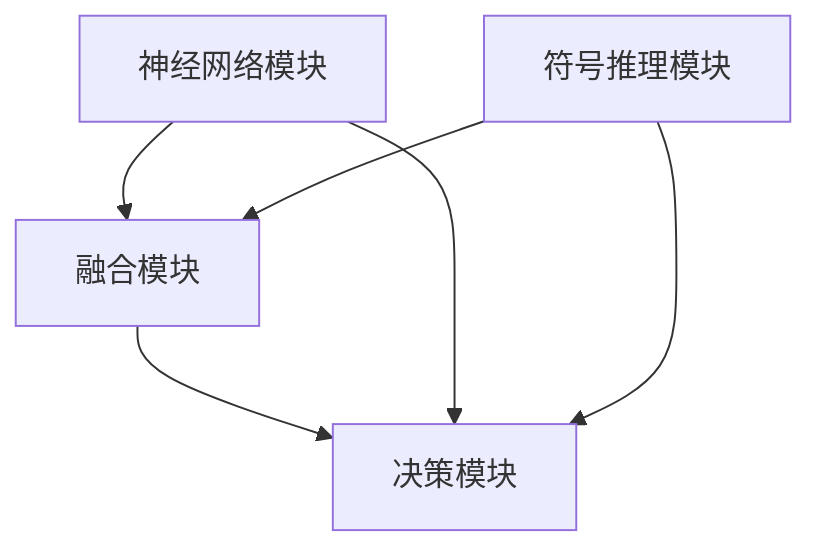

                 

## 引言

### AI Agent的背景

AI Agent，即人工智能代理，是一种能够在复杂环境中自主行动并实现特定目标的智能实体。AI Agent的概念最早可以追溯到20世纪50年代，当时图灵提出了智能代理的思想。随着计算机科学和人工智能技术的不断发展，AI Agent逐渐成为人工智能领域的一个重要研究方向。AI Agent的广泛应用包括但不限于自动化制造、智能机器人、自动驾驶汽车、智能客服和智能推荐系统等。

### 神经符号整合学习方法概述

神经符号整合学习方法（Neural-Symbolic Integration Learning）是一种将神经网络和符号推理结合起来的学习方法。它试图弥补传统神经网络在推理能力方面的不足，同时增强神经网络在解释性和可理解性方面的缺陷。这种方法的核心思想是通过结合神经网络的强大表示能力和符号推理的逻辑推理能力，实现更强大、更灵活的智能体。

神经符号整合学习方法的重要性在于：

1. **提高智能体的推理能力**：神经符号整合方法使得智能体能够进行更复杂的推理任务，从而在许多实际应用中表现得更加出色。
2. **增强智能体的可解释性**：通过符号推理，智能体的决策过程变得更加透明，有助于人们理解和信任智能体的行为。
3. **适应不同类型的数据**：神经网络擅长处理高维的、非结构化的数据，而符号推理则适用于结构化的、规则化的数据。神经符号整合方法可以同时处理这两种类型的数据，提高了模型的泛化能力。

本文将系统地介绍AI Agent的神经符号整合学习方法。具体内容将分为以下几个部分：

1. **基础概念**：介绍神经符号整合学习方法的基础知识，包括人工智能和机器学习的基本概念，神经网络和符号推理的基础，以及神经符号整合学习的基本原理。
2. **原理与模型**：详细探讨神经符号整合学习方法的基本框架，包括神经网络与符号推理的融合模型，以及典型的神经符号整合学习模型。
3. **算法解析**：解析神经符号整合学习方法的算法，包括基本算法的实现细节，算法的优化策略，以及算法的性能评估。
4. **实现与优化**：介绍神经符号整合学习方法的实现步骤，以及实现过程中常见的问题和解决方法，并提供优化策略。
5. **应用案例**：展示神经符号整合学习方法在不同领域的应用案例，包括自然语言处理、计算机视觉和其他领域。
6. **展望与未来方向**：讨论神经符号整合学习方法的发展趋势，以及AI Agent未来的挑战和机遇。

通过本文的阅读，读者可以全面了解神经符号整合学习方法，掌握其基本原理和应用技巧，为在人工智能领域的研究和应用提供新的思路和方法。

### 目录大纲

为了帮助读者更好地理解本文的结构，以下是一个详细的目录大纲，涵盖了神经符号整合学习方法的基础、原理、算法、实现、应用和未来方向。

---

#### 第一部分：引言

- **第1章：AI Agent的背景与神经符号整合学习方法概述**
  - 1.1 AI Agent的定义与作用
  - 1.2 神经符号整合学习方法的重要性
  - 1.3 本书结构安排与阅读建议

---

#### 第二部分：神经符号整合学习方法的基础概念

- **第2章：神经符号整合学习方法的基础概念**
  - 2.1 人工智能与机器学习概述
  - 2.2 神经网络与符号推理基础
  - 2.3 神经符号整合学习的基本原理

---

#### 第三部分：神经符号整合学习方法的原理与模型

- **第3章：神经符号整合学习方法的原理与模型**
  - 3.1 神经符号整合学习的基本框架
  - 3.2 神经网络与符号推理的融合模型
  - 3.3 神经符号整合学习方法的典型模型分析

---

#### 第四部分：神经符号整合学习方法的算法解析

- **第4章：神经符号整合学习方法的算法解析**
  - 4.1 神经符号整合学习的基本算法
  - 4.2 算法实现的细节与优化
  - 4.3 算法评估与性能分析

---

#### 第五部分：神经符号整合学习方法的实现与优化

- **第5章：神经符号整合学习方法的实现与优化**
  - 5.1 神经符号整合学习方法的实现步骤
  - 5.2 实现中的常见问题与解决方法
  - 5.3 神经符号整合学习方法的优化策略

---

#### 第六部分：神经符号整合学习方法的应用案例

- **第6章：神经符号整合学习方法的应用案例**
  - 6.1 神经符号整合学习方法在自然语言处理中的应用
  - 6.2 神经符号整合学习方法在计算机视觉中的应用
  - 6.3 神经符号整合学习方法在其他领域的应用

---

#### 第七部分：AI Agent的神经符号整合学习方法展望与未来方向

- **第7章：AI Agent的神经符号整合学习方法展望与未来方向**
  - 7.1 神经符号整合学习方法的发展趋势
  - 7.2 AI Agent的未来挑战与机遇
  - 7.3 神经符号整合学习方法在AI Agent中的应用前景

---

本文通过详细的目录结构，系统地介绍了AI Agent的神经符号整合学习方法。从基础概念到算法解析，再到应用案例，读者可以逐步了解并掌握这一先进的学习方法。同时，展望未来的发展方向，为AI Agent的研究和应用提供了新的视角。希望本文能对读者在人工智能领域的学习和研究有所启发和帮助。

---

### 第一部分：引言

#### 第1章：AI Agent的背景与神经符号整合学习方法概述

##### 1.1 AI Agent的定义与作用

AI Agent，即人工智能代理，是一种基于人工智能技术的自主计算实体，能够在动态环境中自主执行任务，并对外部环境进行感知和响应。AI Agent的定义可以从多个角度进行理解，主要包括以下几个方面：

1. **自主性**：AI Agent具有自主决策能力，能够在没有外部指令的情况下，根据环境和任务需求自主选择行动方案。
2. **适应性**：AI Agent能够适应不断变化的环境，通过学习和经验积累，提高任务执行效果。
3. **互动性**：AI Agent能够与人类或其他智能系统进行互动，通过自然语言理解、图像识别等方式，实现信息交换和协同工作。

AI Agent在许多实际应用中扮演着重要的角色。以下是一些典型的应用场景：

1. **自动化制造**：AI Agent可以在生产线上执行复杂的任务，如检测缺陷、自动调整设备参数等，从而提高生产效率和产品质量。
2. **智能机器人**：AI Agent使得机器人能够自主移动、导航和执行复杂任务，例如家庭服务机器人、医疗辅助机器人等。
3. **自动驾驶汽车**：AI Agent负责处理复杂的交通环境，实现车辆的自动驾驶，提高行车安全性和效率。
4. **智能客服系统**：AI Agent能够通过自然语言处理技术，理解用户的查询，并提供实时、个性化的服务。
5. **智能推荐系统**：AI Agent可以根据用户的兴趣和行为数据，推荐相关产品或内容，提升用户体验。

##### 1.2 神经符号整合学习方法的重要性

神经符号整合学习方法（Neural-Symbolic Integration Learning）是近年来人工智能领域的一个重要研究方向。它试图通过将神经网络的强大表示能力与符号推理的逻辑推理能力相结合，弥补传统神经网络在推理能力、可解释性和适应性方面的不足。以下是神经符号整合学习方法的重要性：

1. **提高推理能力**：神经网络擅长处理高维的、复杂的特征，但缺乏强大的逻辑推理能力。神经符号整合方法通过结合符号推理，使得智能体能够进行更复杂的推理任务，从而在许多实际应用中表现得更加出色。
   
2. **增强可解释性**：符号推理可以提供明确的逻辑推理过程和解释，使得智能体的决策过程变得更加透明，有助于人们理解和信任智能体的行为。

3. **适应不同类型的数据**：神经网络适用于处理非结构化的数据，而符号推理适用于结构化的、规则化的数据。神经符号整合方法可以同时处理这两种类型的数据，提高了模型的泛化能力。

4. **提升适应性**：通过结合神经网络的学习效率和符号推理的灵活性强，神经符号整合方法使得智能体能够更好地适应动态变化的环境和复杂任务。

##### 1.3 本书结构安排与阅读建议

本书旨在系统地介绍AI Agent的神经符号整合学习方法，分为七个主要部分，每个部分都有明确的学习目标和内容安排：

1. **第一部分：引言**：介绍AI Agent的背景和神经符号整合学习方法的重要性，为后续章节奠定基础。
2. **第二部分：基础概念**：介绍人工智能与机器学习的基本概念，神经网络和符号推理的基础知识，以及神经符号整合学习的基本原理。
3. **第三部分：原理与模型**：详细探讨神经符号整合学习方法的基本框架，融合模型，以及典型模型分析。
4. **第四部分：算法解析**：解析神经符号整合学习的基本算法，实现细节，优化策略，以及算法性能评估。
5. **第五部分：实现与优化**：介绍神经符号整合学习方法的实现步骤，常见问题解决方法，以及优化策略。
6. **第六部分：应用案例**：展示神经符号整合学习方法在不同领域的应用，包括自然语言处理、计算机视觉等。
7. **第七部分：展望与未来方向**：讨论神经符号整合学习方法的发展趋势，AI Agent的未来挑战与机遇。

为了更好地理解和应用神经符号整合学习方法，建议读者按照以下顺序进行阅读：

1. **阅读第一部分，了解神经符号整合学习方法的整体背景和重要性**。
2. **逐步阅读第二部分至第六部分，掌握基础概念、原理模型、算法解析、实现与优化，以及应用案例**。
3. **在阅读过程中，注重理解每个部分的关键概念和原理，并通过实际案例加深理解**。
4. **最后阅读第七部分，了解神经符号整合学习方法的发展趋势和未来方向，为后续研究提供参考**。

通过本书的系统学习，读者可以全面了解神经符号整合学习方法，掌握其基本原理和应用技巧，为在人工智能领域的研究和应用提供新的思路和方法。

---

### 第二部分：神经符号整合学习方法的基础概念

#### 第2章：神经符号整合学习方法的基础概念

##### 2.1 人工智能与机器学习概述

人工智能（Artificial Intelligence，简称AI）是计算机科学的一个分支，旨在开发能够执行类似于人类智能任务的系统。人工智能的研究领域广泛，包括机器学习、自然语言处理、计算机视觉、知识表示和推理等。机器学习（Machine Learning，简称ML）是人工智能的一个重要分支，通过训练数据集，使计算机系统具备自主学习和改进的能力。

机器学习可以分为监督学习、无监督学习和强化学习。监督学习（Supervised Learning）使用带有标签的训练数据来训练模型，无监督学习（Unsupervised Learning）则在没有标签的数据上进行学习，旨在发现数据中的模式和结构。强化学习（Reinforcement Learning）则是通过交互环境和接收奖励信号来训练模型，使其在特定任务中表现出良好的行为。

##### 2.2 神经网络与符号推理基础

神经网络（Neural Networks）是模仿人脑神经元结构和功能的计算模型，通过多层神经元节点进行信息传递和处理。神经网络具有强大的学习能力，能够从数据中自动提取特征并进行复杂决策。常见的神经网络结构包括前馈神经网络（Feedforward Neural Network）、卷积神经网络（Convolutional Neural Network，CNN）和循环神经网络（Recurrent Neural Network，RNN）。

符号推理（Symbolic Reasoning）是一种基于逻辑和数学符号表示的知识表示和推理方法。符号推理通过符号操作和规则应用，实现对知识的高层次理解和推理。符号推理具有较强的解释性和逻辑性，但通常在处理复杂问题和大规模数据时效率较低。

##### 2.3 神经符号整合学习的基本原理

神经符号整合学习（Neural-Symbolic Integration Learning）是一种结合神经网络和符号推理的方法，旨在利用两者的优势，弥补各自的不足。其基本原理可以概括为以下几个方面：

1. **融合表示**：神经网络负责处理和表示数据的低层次特征，而符号系统则负责表示和推理高层次的知识。通过融合这两种表示方式，可以更好地捕捉数据的复杂性和知识结构。
2. **交互学习**：神经网络和符号系统通过交互学习，共同优化模型参数。神经网络通过学习数据特征，为符号系统提供更加精细的输入；符号系统则通过推理和符号操作，为神经网络提供反馈，帮助其更好地理解和解释数据。
3. **协同决策**：神经符号整合方法使得智能体能够在复杂环境中进行协同决策。神经网络负责快速响应和实时决策，而符号系统则负责长期规划和策略制定，从而实现高效、可靠的智能行为。

通过神经符号整合学习，智能体可以同时具备神经网络的高效处理能力和符号推理的严谨逻辑性，提高其在各种复杂任务中的表现。

---

### 第3章：神经符号整合学习方法的原理与模型

##### 3.1 神经符号整合学习的基本框架

神经符号整合学习方法的基本框架旨在结合神经网络和符号推理的优势，实现更强大的智能体。该框架主要包括以下几个关键组成部分：

1. **神经网络模块**：负责从数据中提取低层次特征，并进行复杂的模式识别和分类。常见的神经网络模块包括卷积神经网络（CNN）和循环神经网络（RNN）。
2. **符号推理模块**：负责处理和推理高层次的语义信息，通过符号操作和规则应用，实现对知识的深层理解和解释。符号推理模块通常基于逻辑和知识表示理论。
3. **融合模块**：负责将神经网络模块提取的低层次特征与符号推理模块的高层次知识进行整合。融合模块可以通过多层神经网络或规则匹配器实现。
4. **交互机制**：神经网络模块和符号推理模块通过交互机制进行信息传递和参数更新。交互机制可以是正向传递（从神经网络到符号推理模块）或反向传递（从符号推理模块到神经网络模块）。

基本框架如图所示：



##### 3.2 神经网络与符号推理的融合模型

神经符号整合学习的融合模型通过结合神经网络和符号推理，实现了对复杂数据的深度理解和推理。以下是一些典型的融合模型：

1. **神经网络嵌入模型**：该模型将神经网络视为一个特征提取器，将提取的特征输入到符号推理模块中进行符号操作。典型实现包括使用神经网络生成词向量，然后进行语义推理。
2. **分层融合模型**：该模型将神经网络和符号推理分层组织，神经网络处理低层次特征，符号推理处理高层次知识。层次之间的信息通过融合模块进行传递和整合。一个典型的例子是使用CNN提取图像特征，然后通过符号推理模块进行语义理解。
3. **动态融合模型**：该模型根据任务需求和数据特性动态调整神经网络和符号推理的权重和交互方式。动态融合模型可以通过深度强化学习实现，使智能体在不同任务环境中自动调整融合策略。

##### 3.3 神经符号整合学习方法的典型模型分析

以下是几个典型的神经符号整合学习方法模型：

1. **Neural-Symbolic AI (NSAI)**：NSAI模型通过结合神经网络和符号推理，实现智能体的自主学习和推理能力。NSAI模型的核心包括一个基于神经网络的感知模块和一个基于符号推理的决策模块。感知模块负责从环境中获取信息，并将其传递给决策模块。决策模块则通过符号推理模块生成决策计划，指导智能体的行为。NSAI模型如图所示：

   ```mermaid
   graph TB
   A[感知模块] --> B[决策模块]
   B --> C[符号推理模块]
   ```

2. **Memory-augmented Neural Networks (MANN)**：MANN模型通过引入外部记忆模块，增强了神经网络的知识表示和推理能力。MANN模型的核心是一个神经网络和一个记忆网络。神经网络负责从数据中提取特征，记忆网络则用于存储和检索重要信息。在决策过程中，神经网络和记忆网络相互协作，实现高效的推理和决策。MANN模型如图所示：

   ```mermaid
   graph TB
   A[神经网络] --> B[记忆网络]
   A --> C[决策模块]
   B --> C
   ```

3. **Graph Neural Networks (GNN) with Symbolic Reasoning**：GNN with Symbolic Reasoning模型结合了图神经网络和符号推理的优势，用于处理图结构数据。图神经网络负责从图中提取特征，符号推理模块则用于处理图结构中的高层次关系和语义信息。GNN with Symbolic Reasoning模型如图所示：

   ```mermaid
   graph TB
   A[图神经网络] --> B[符号推理模块]
   A --> C[决策模块]
   B --> C
   ```

这些典型模型展示了神经符号整合学习方法在不同应用场景中的灵活性和有效性。通过结合神经网络和符号推理，这些模型在自然语言处理、计算机视觉和其他领域取得了显著的成果。

---

### 第4章：神经符号整合学习方法的算法解析

##### 4.1 神经符号整合学习的基本算法

神经符号整合学习的基本算法框架主要包括数据预处理、特征提取、融合模块、推理模块和模型优化等几个关键步骤。

1. **数据预处理**：在神经符号整合学习方法中，数据预处理是至关重要的一步。数据预处理包括数据的清洗、归一化和分割。清洗数据是为了去除噪声和异常值，归一化则是为了将不同特征缩放到相同的尺度范围内，从而提高模型的泛化能力。数据分割则是将数据集划分为训练集、验证集和测试集，用于训练、验证和评估模型性能。

2. **特征提取**：特征提取是神经符号整合学习方法的核心步骤之一。神经网络负责从原始数据中提取低层次特征，如图像中的边缘、纹理或声音信号中的频率特征。这些低层次特征通常通过卷积神经网络（CNN）或循环神经网络（RNN）等深度学习模型进行提取。

3. **融合模块**：融合模块是神经符号整合学习方法的特色之一。它通过将神经网络提取的低层次特征与符号推理模块的高层次知识进行整合。融合模块的实现方式多样，包括基于神经网络嵌入的融合、层次融合和动态融合等。融合模块的目的是提高模型的推理能力和解释性。

4. **推理模块**：推理模块负责基于融合后的特征进行符号推理。符号推理模块通常基于逻辑推理、知识表示和符号操作。通过符号推理，模型能够生成决策计划或执行策略，实现对复杂问题的理解和解决。

5. **模型优化**：模型优化是提高神经符号整合学习方法性能的关键步骤。优化方法包括梯度下降、随机梯度下降（SGD）和Adam优化器等。优化过程通常涉及损失函数的设计、学习率调整和正则化策略。此外，还可以使用技巧如批归一化、Dropout和权重衰减来提高模型的稳定性和泛化能力。

##### 4.2 算法实现的细节与优化

在实现神经符号整合学习方法时，需要关注以下细节和优化策略：

1. **损失函数**：损失函数是模型优化的核心目标函数。对于神经符号整合学习方法，可以选择不同的损失函数，如交叉熵损失、均方误差（MSE）和结构相似性指数（SSIM）等。损失函数的选择取决于任务类型和数据特性。

2. **学习率**：学习率是模型优化中的重要参数。过大的学习率可能导致模型收敛速度慢，甚至发散；而过小的学习率则可能导致收敛速度慢。通常，可以使用学习率衰减策略，如固定衰减、指数衰减和时间步长衰减，来调整学习率。

3. **正则化**：正则化是防止模型过拟合的重要手段。常见的正则化方法包括L1正则化、L2正则化和Dropout。L1正则化通过在损失函数中添加L1范数项来惩罚模型参数的绝对值；L2正则化通过添加L2范数项来惩罚模型参数的平方值；Dropout则通过在训练过程中随机丢弃部分神经元来提高模型的泛化能力。

4. **优化器**：优化器是用于调整模型参数的工具。除了传统的梯度下降优化器，还可以使用更高效的优化器，如Adam优化器。Adam优化器结合了梯度下降和动量法的优点，能够更快地收敛。

##### 4.3 算法评估与性能分析

评估神经符号整合学习方法的性能是验证其有效性和实用性的关键。以下是一些常用的评估指标和方法：

1. **准确率**：准确率是分类任务中最常用的评估指标，表示正确分类的样本数占总样本数的比例。准确率越高，说明模型对数据的分类能力越强。

2. **召回率**：召回率是分类任务中另一个重要的评估指标，表示正确分类的样本数占所有实际正类样本数的比例。召回率越高，说明模型对正类样本的识别能力越强。

3. **F1分数**：F1分数是准确率和召回率的调和平均，能够综合评估模型的分类性能。F1分数介于0和1之间，值越高，说明模型的分类效果越好。

4. **混淆矩阵**：混淆矩阵是一种用于详细分析分类模型性能的工具。它展示了模型在不同类别上的分类结果，包括准确率、召回率、精确率和假正率等指标。

5. **ROC曲线和AUC值**：ROC曲线（Receiver Operating Characteristic Curve）和AUC值（Area Under Curve）是二分类任务中常用的评估工具。ROC曲线展示了模型在不同阈值下的分类性能，AUC值则表示曲线下的面积，越高表示模型的分类能力越强。

通过上述评估指标和方法，可以全面评估神经符号整合学习方法的性能，为模型优化和应用提供依据。

---

### 第5章：神经符号整合学习方法的实现与优化

##### 5.1 神经符号整合学习方法的实现步骤

实现神经符号整合学习方法需要遵循以下步骤：

1. **环境搭建**：首先，需要搭建适合神经符号整合学习的计算环境。这包括安装Python、TensorFlow或PyTorch等深度学习框架，以及相关的符号推理库（如SymPy或Prolog）。

2. **数据预处理**：接下来，对数据集进行清洗、归一化和分割。数据预处理是确保模型性能的重要前提。对于图像数据，可以进行去噪、裁剪和缩放等操作；对于文本数据，可以进行分词、词性标注和去停用词等处理。

3. **模型设计**：设计神经符号整合学习模型，包括神经网络模块和符号推理模块。神经网络模块可以使用卷积神经网络（CNN）或循环神经网络（RNN）等结构，符号推理模块可以采用逻辑推理或知识表示方法。

4. **模型训练**：使用预处理后的数据集对模型进行训练。在训练过程中，需要调整模型参数，如学习率、批量大小和迭代次数。常用的优化算法包括梯度下降、随机梯度下降（SGD）和Adam优化器。

5. **融合与推理**：训练完成后，将神经网络提取的低层次特征与符号推理模块进行融合，生成最终的决策结果。融合策略可以根据任务需求进行调整，如基于神经网络嵌入的融合或层次融合。

6. **模型评估**：使用验证集和测试集对模型性能进行评估，使用准确率、召回率、F1分数等指标进行量化分析。

##### 5.2 实现中的常见问题与解决方法

在实现神经符号整合学习方法时，可能会遇到以下问题：

1. **数据不平衡**：数据集的正负样本分布不均可能导致模型过拟合。解决方法包括使用重采样技术（如过采样或欠采样）、调整损失函数（如引入类别权重）或使用集成学习方法。

2. **过拟合**：模型在训练数据上表现良好，但在测试数据上表现较差。解决方法包括使用正则化技术（如L1、L2正则化或Dropout）、增加训练数据或使用更复杂的模型结构。

3. **计算资源不足**：深度学习模型通常需要大量的计算资源，可能导致训练时间过长。解决方法包括使用更高效的算法（如GPU加速）、减少模型复杂度或使用分布式训练。

4. **模型解释性不足**：神经符号整合方法虽然结合了神经网络和符号推理，但模型解释性仍是一个挑战。解决方法包括使用可解释性模型（如LIME或SHAP）或设计更透明的符号推理机制。

##### 5.3 神经符号整合学习方法的优化策略

为了提高神经符号整合学习方法的性能，可以采用以下优化策略：

1. **模型压缩**：使用模型压缩技术（如模型剪枝、量化或知识蒸馏）减少模型参数数量，提高推理速度和模型效率。

2. **多任务学习**：通过多任务学习，使模型在不同任务中共享知识，提高模型的泛化能力。

3. **迁移学习**：利用预训练模型（如ImageNet或GPT）进行迁移学习，使模型在特定任务上快速取得性能提升。

4. **强化学习**：结合强化学习方法，使模型能够从交互环境中学习和优化策略，提高决策能力。

5. **元学习**：通过元学习方法，使模型能够快速适应新的任务和数据，提高模型的泛化能力和学习能力。

通过上述实现步骤和优化策略，可以有效地构建和应用神经符号整合学习方法，为复杂问题的解决提供新的思路和方法。

---

### 第6章：神经符号整合学习方法的应用案例

#### 6.1 神经符号整合学习方法在自然语言处理中的应用

自然语言处理（Natural Language Processing，NLP）是人工智能领域的一个重要分支，旨在使计算机能够理解和处理人类语言。传统的NLP方法主要依赖于规则和统计模型，而随着深度学习的发展，基于神经网络的NLP方法逐渐成为主流。神经符号整合学习方法在NLP中的应用，为提高NLP任务的效果和解释性提供了新的途径。

**1. 应用实例：文本分类**

文本分类是NLP中的一项基础任务，旨在将文本数据归类到预定义的类别中。传统的文本分类方法通常使用TF-IDF或词袋模型等统计方法，而深度学习方法则通过卷积神经网络（CNN）或循环神经网络（RNN）等模型提取文本的特征，并使用softmax进行分类。

神经符号整合学习方法在文本分类中的应用，可以通过以下步骤实现：

1. **特征提取**：使用卷积神经网络（CNN）或循环神经网络（RNN）提取文本的词级或句子级特征。
2. **符号推理**：将提取的特征输入到符号推理模块，利用逻辑规则或本体论进行语义分析，以增强分类的准确性。
3. **融合与分类**：将神经网络提取的特征与符号推理的结果进行融合，通过多层感知器（MLP）或支持向量机（SVM）等分类器进行最终的分类决策。

**2. 性能评估**

神经符号整合学习方法在文本分类任务中的性能评估，通常使用准确率、召回率、F1分数等指标。通过对比传统深度学习方法和神经符号整合学习方法的结果，可以发现神经符号整合方法在处理复杂语义关系和长文本时，具有更好的性能和解释性。

**3. 应用前景**

神经符号整合学习方法在NLP中的潜在应用前景广泛，包括但不限于：

- **情感分析**：通过结合神经网络和符号推理，实现对文本情感倾向的精确识别。
- **文本生成**：利用神经符号整合方法，提高文本生成模型的创造性和逻辑一致性。
- **问答系统**：通过符号推理模块，实现对用户问题的精准理解和回答。

#### 6.2 神经符号整合学习方法在计算机视觉中的应用

计算机视觉（Computer Vision，CV）是人工智能领域的一个重要分支，旨在使计算机能够从图像或视频中提取有用信息。传统的计算机视觉方法主要依赖于图像处理和机器学习技术，而深度学习方法的引入使得计算机视觉任务取得了显著的进展。神经符号整合学习方法在计算机视觉中的应用，旨在提高模型的解释性和推理能力。

**1. 应用实例：图像分类**

图像分类是计算机视觉中的一项基础任务，旨在将图像归类到预定义的类别中。传统的图像分类方法通常使用SVM、KNN等统计模型，而深度学习方法则通过卷积神经网络（CNN）提取图像的特征，并使用softmax进行分类。

神经符号整合学习方法在图像分类中的应用，可以通过以下步骤实现：

1. **特征提取**：使用卷积神经网络（CNN）提取图像的底层特征。
2. **符号推理**：将提取的特征输入到符号推理模块，利用逻辑规则或本体论进行语义分析，以增强分类的准确性。
3. **融合与分类**：将神经网络提取的特征与符号推理的结果进行融合，通过多层感知器（MLP）或支持向量机（SVM）等分类器进行最终的分类决策。

**2. 性能评估**

神经符号整合学习方法在图像分类任务中的性能评估，通常使用准确率、召回率、F1分数等指标。通过对比传统深度学习方法和神经符号整合学习方法的结果，可以发现神经符号整合方法在处理复杂图像结构和语义关系时，具有更好的性能和解释性。

**3. 应用前景**

神经符号整合学习方法在计算机视觉中的潜在应用前景广泛，包括但不限于：

- **目标检测**：通过结合神经网络和符号推理，实现对图像中目标的精准检测和分类。
- **图像分割**：利用神经符号整合方法，提高图像分割任务的精度和鲁棒性。
- **图像生成**：通过符号推理模块，提高图像生成模型的创造性和逻辑一致性。

#### 6.3 神经符号整合学习方法在其他领域的应用

神经符号整合学习方法不仅在自然语言处理和计算机视觉领域有显著应用，在其他领域也展现出巨大的潜力。

**1. 医学图像分析**

在医学图像分析中，神经符号整合学习方法可以用于疾病的检测和诊断。通过结合神经网络提取的图像特征和符号推理的医学知识，可以提高检测的准确性和解释性。

**2. 推荐系统**

在推荐系统中，神经符号整合方法可以通过融合用户的历史行为数据和商品的特征信息，提高推荐系统的准确性和个性化程度。

**3. 自动驾驶**

在自动驾驶领域，神经符号整合方法可以通过结合传感器数据和符号推理的驾驶规则，提高自动驾驶系统的安全性和可靠性。

通过在多个领域的实际应用，神经符号整合学习方法展示了其强大的适应性和广泛的应用前景。未来，随着研究的深入，神经符号整合学习方法将在更多领域得到广泛应用，为人工智能技术的发展做出更大贡献。

---

### 第七部分：AI Agent的神经符号整合学习方法展望与未来方向

#### 7.1 神经符号整合学习方法的发展趋势

神经符号整合学习方法（Neural-Symbolic Integration Learning）作为人工智能领域的一个重要研究方向，正逐步从理论研究走向实际应用。未来，这一方法的发展趋势可能包括以下几个方面：

1. **跨领域融合**：随着不同领域对智能体需求的不断增加，神经符号整合方法将越来越多地应用于跨领域任务。例如，在医疗、金融、教育等领域的智能系统中，神经符号整合方法将结合不同领域的专业知识，提高系统的智能化水平和应用效果。

2. **解释性与透明性**：在当前的技术背景下，尽管神经符号整合方法在提高智能体的推理能力和适应性方面取得了显著进展，但其解释性和透明性仍是一个挑战。未来，研究者将致力于开发更具解释性和透明性的神经符号整合模型，以提高用户对智能体的信任度。

3. **多模态数据处理**：随着传感器技术和数据采集技术的不断发展，智能体将面临处理多模态数据（如文本、图像、音频、视频等）的挑战。神经符号整合方法将逐渐融合多模态数据处理技术，实现跨模态的信息融合和推理。

4. **强化学习与符号推理的结合**：强化学习方法在解决复杂决策问题方面具有显著优势，而符号推理方法则能够提供更强的解释性和逻辑性。未来，研究者将致力于探索强化学习与符号推理的深度融合，以构建具有更高智能水平的智能体。

#### 7.2 AI Agent的未来挑战与机遇

在神经符号整合学习方法不断发展的同时，AI Agent也面临着诸多挑战和机遇：

1. **计算资源**：神经符号整合方法通常需要大量的计算资源，特别是在处理大规模、高维数据时。未来，研究者将致力于优化算法，提高模型的计算效率，以满足实际应用的需求。

2. **数据质量**：高质量的数据是构建高效智能体的基础。未来，AI Agent将面临数据质量、数据多样性和数据隐私等方面的挑战，如何确保数据的质量和安全性将成为关键问题。

3. **可解释性与透明性**：尽管神经符号整合方法在解释性方面有所改进，但如何使其更加透明、易于理解，仍然是亟待解决的问题。未来，研究者将致力于开发更加直观、易懂的解释机制。

4. **鲁棒性**：在复杂、动态的环境中，智能体需要具备高度的鲁棒性，以应对各种不确定性和异常情况。未来，研究者将致力于提高神经符号整合方法的鲁棒性和适应性。

5. **伦理与法律**：随着AI Agent的应用越来越广泛，伦理和法律问题也将日益突出。如何确保智能体的行为符合伦理规范，如何对其行为进行法律监管，将成为未来需要解决的重要问题。

#### 7.3 神经符号整合学习方法在AI Agent中的应用前景

神经符号整合学习方法在AI Agent中的应用前景广阔，以下是一些潜在的领域：

1. **智能客服**：神经符号整合方法可以显著提升智能客服系统的交互能力和服务质量，使其能够更好地理解用户的需求和情感，提供更加个性化和贴心的服务。

2. **自动驾驶**：在自动驾驶领域，神经符号整合方法可以结合感知数据和符号推理，提高自动驾驶车辆的决策能力和安全性。

3. **医疗诊断**：在医疗领域，神经符号整合方法可以结合医学影像和临床数据，实现更加精准和可靠的疾病诊断。

4. **智能推荐**：在电子商务和媒体领域，神经符号整合方法可以更好地理解用户行为和偏好，提供更加精准和个性化的推荐服务。

5. **教育辅助**：在教育领域，神经符号整合方法可以为学生提供个性化的学习路径，辅助教师进行教学，提高教育质量。

总之，神经符号整合学习方法为AI Agent的研究和应用提供了新的思路和方法。未来，随着技术的不断进步和应用场景的拓展，神经符号整合学习方法将在AI Agent领域发挥越来越重要的作用。

---

## 结语

本文系统地介绍了AI Agent的神经符号整合学习方法，从基础概念到算法解析，再到应用案例，全面探讨了这一方法的原理、实现和优化。通过详细的阐述和实例分析，读者可以全面了解神经符号整合学习方法的优势和应用前景。

在未来的研究中，神经符号整合学习方法有望在多个领域发挥重要作用，如智能客服、自动驾驶、医疗诊断和智能推荐等。同时，随着技术的不断进步，如何提高方法的解释性和透明性，以及增强其在复杂环境中的鲁棒性，将是需要重点关注的问题。

为了推动神经符号整合学习方法的发展，建议读者进一步阅读以下拓展内容：

1. **学术论文**：阅读相关的学术论文，了解最新的研究成果和发展趋势。
2. **技术报告**：阅读相关技术报告，获取实际应用中的经验和技巧。
3. **开源代码**：参与开源项目，实际操作和改进神经符号整合学习模型。

通过不断学习和实践，读者可以更好地掌握神经符号整合学习方法，为人工智能领域的研究和应用做出贡献。

### 作者信息

作者：AI天才研究院/AI Genius Institute & 禅与计算机程序设计艺术 /Zen And The Art of Computer Programming

AI天才研究院专注于人工智能领域的前沿研究和应用推广，致力于推动人工智能技术的创新和发展。同时，作者也以其在计算机科学和人工智能领域的深厚造诣和丰富经验，撰写了《禅与计算机程序设计艺术》这一经典作品，为读者提供了深刻的编程哲学和实用技巧。

