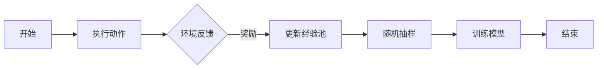
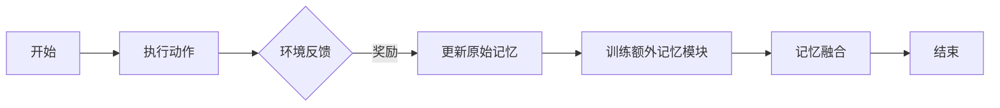
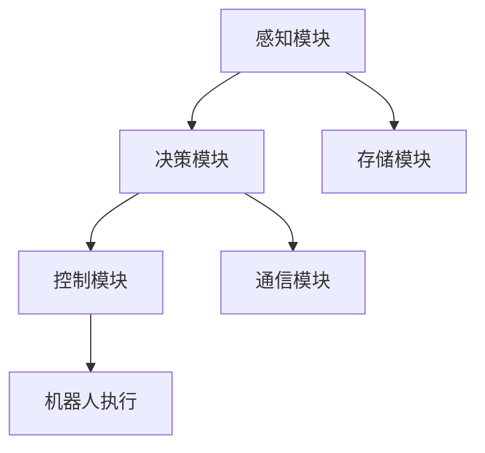
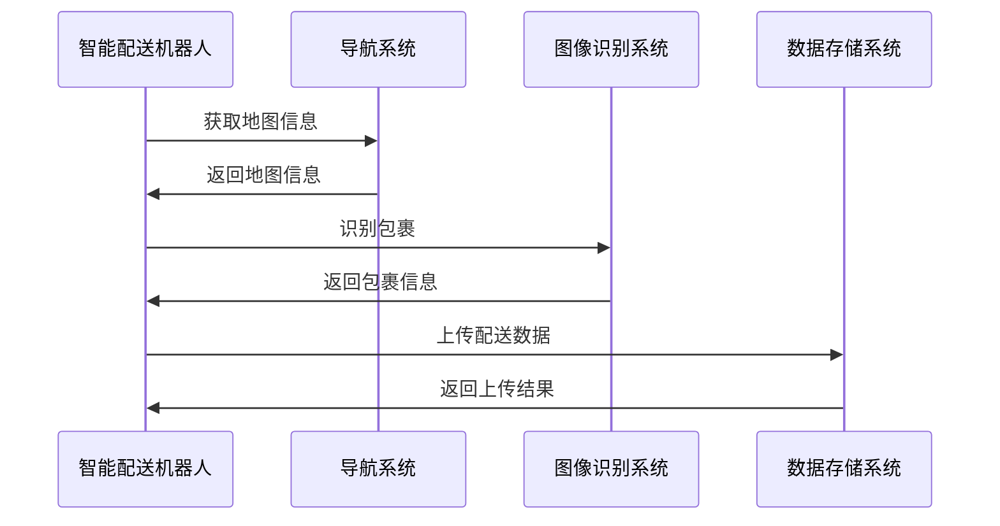
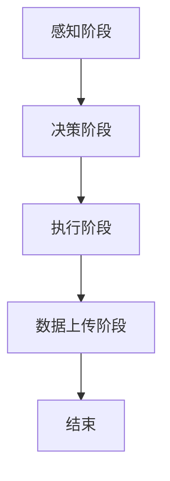

                 

### 背景介绍

#### 核心概念术语说明

在探讨AI Agent的终身学习与灾难性遗忘防御之前，我们需要明确一些核心概念术语。

1. **AI Agent**：指具备一定自主学习和决策能力的智能实体，能在特定环境中进行感知、决策和执行。

2. **终身学习**：指AI Agent在长时间运行过程中，不断从新数据和经验中学习，以保持或提升其性能和知识水平。

3. **灾难性遗忘**：指AI Agent在运行过程中由于某些原因（如过载、故障等）导致的严重知识丢失，可能导致其性能急剧下降。

#### 问题背景

当前，人工智能（AI）技术发展迅猛，AI Agent在许多领域取得了显著成就。然而，AI Agent在长期运行中面临的挑战也越来越明显，特别是终身学习和灾难性遗忘问题。

**问题一：终身学习**

AI Agent在长期运行过程中，需要不断地适应新环境和处理大量新数据。然而，传统的机器学习算法往往只能学习特定任务，难以在长期运行中实现有效的终身学习。这使得AI Agent在面对复杂、动态的环境时，难以保持良好的性能。

**问题二：灾难性遗忘**

在长时间运行中，AI Agent可能会因为资源限制、数据冗余或其他原因导致灾难性遗忘。这种遗忘不仅会破坏AI Agent的知识完整性，还可能导致其性能大幅下降，甚至无法完成任务。

#### 问题描述

**终身学习问题**：

- **数据适应性**：如何让AI Agent在处理新数据时保持高效学习？
- **模型迁移**：如何将一个任务中的知识迁移到另一个相关任务中？

**灾难性遗忘问题**：

- **数据冗余处理**：如何避免数据冗余和过载对AI Agent学习造成负面影响？
- **故障恢复**：如何使AI Agent在出现故障时能够快速恢复，避免灾难性遗忘？

#### 问题解决

为解决上述问题，研究者提出了多种方案：

- **多任务学习**：通过训练AI Agent处理多个相关任务，以提升其数据适应性和模型迁移能力。
- **持续学习算法**：设计能够持续更新的学习算法，以实现AI Agent的终身学习。
- **记忆强化技术**：通过记忆强化技术，如稀疏编码、深度强化学习等，增强AI Agent对知识的记忆保持能力。

#### 边界与外延

**边界**：本文主要讨论AI Agent在长期运行中的终身学习与灾难性遗忘问题，不涉及短期学习和简单遗忘现象。

**外延**：本文的方法和技术不仅适用于AI Agent，还可以推广到其他智能系统，如自动驾驶、智能家居等。

#### 概念结构与核心要素组成

1. **核心概念**：AI Agent、终身学习、灾难性遗忘。
2. **关联关系**：终身学习与灾难性遗忘之间存在负相关关系，即良好的终身学习有助于减少灾难性遗忘的风险。
3. **影响因素**：数据量、学习算法、系统架构等。

通过上述介绍，我们明确了AI Agent的终身学习与灾难性遗忘防御的背景和问题，为后续章节的深入探讨奠定了基础。

### 核心概念与联系

#### AI Agent

AI Agent是指能够自主感知环境、制定决策并执行动作的智能实体。在人工智能领域，AI Agent被广泛用于模拟人类智能行为，并实现自动化决策和任务执行。其核心特点包括自主性、适应性和智能性。

**AI Agent的核心特点**：

1. **自主性**：AI Agent能够根据内部状态和外部环境，自主制定行动策略。
2. **适应性**：AI Agent能够在不同环境和任务场景中适应并调整其行为。
3. **智能性**：AI Agent具备学习、推理和决策等高级智能能力。

#### 终身学习

终身学习是指AI Agent在运行过程中，通过不断学习和适应新环境和数据，以保持或提升其性能和知识水平。终身学习是AI Agent长期运行的关键因素，它决定了AI Agent在面对复杂和动态环境时的表现。

**终身学习的关键要素**：

1. **持续学习**：AI Agent需要不断接收新数据并从中学习，以保持其知识更新。
2. **迁移学习**：AI Agent需要能够将一个任务中的知识迁移到其他相关任务中。
3. **错误纠正**：AI Agent需要在学习过程中识别和纠正错误，以避免知识偏差。

#### 灾难性遗忘

灾难性遗忘是指AI Agent在运行过程中，由于某些原因导致的严重知识丢失现象。这种遗忘可能导致AI Agent的性能急剧下降，甚至无法完成任务。

**灾难性遗忘的原因**：

1. **资源限制**：长时间运行可能导致AI Agent的资源耗尽，从而影响其学习效果。
2. **数据冗余**：过多的冗余数据可能导致AI Agent的学习效率降低，甚至出现遗忘现象。
3. **系统故障**：硬件故障或软件缺陷可能导致AI Agent的部分知识丢失。

#### 概念属性特征对比表格

| 特征                 | AI Agent                | 终身学习               | 灾难性遗忘               |
|----------------------|-------------------------|------------------------|--------------------------|
| 目的                 | 自主决策和任务执行      | 持续提升性能和知识      | 避免严重知识丢失         |
| 特点                 | 自主性、适应性、智能性   | 持续性、迁移性、纠错性  | 严重性、突发性、恢复难   |
| 关联关系             | 实现基础                | 运行关键               | 潜在风险                 |
| 影响因素             | 环境复杂性、任务多样性   | 数据质量、算法选择      | 资源分配、系统稳定性     |

#### ER实体关系图架构

ER（Entity-Relationship）实体关系图是一种用于描述实体及其相互关系的图形化表示方法。在AI Agent的终身学习与灾难性遗忘防御中，ER图可以帮助我们理解各个核心概念之间的关系。

**ER图主要实体及关系**：

1. **AI Agent**：核心实体，代表智能系统。
2. **终身学习系统**：关联实体，负责AI Agent的持续学习和知识更新。
3. **灾难性遗忘防御系统**：关联实体，负责监测和预防灾难性遗忘现象。

**ER图示例**：

```mermaid
erDiagram
    AI-Agent ||--|{ 终身学习系统 }|
    AI-Agent ||--|{ 灾难性遗忘防御系统 }|
    终身学习系统 ||--|{ 数据处理模块 }|
    灾难性遗忘防御系统 ||--|{ 监测模块 }|
    灾难性遗忘防御系统 ||--|{ 恢复模块 }|
```

通过核心概念与联系的分析，我们为后续的算法原理讲解、系统分析与架构设计方案等提供了理论基础。在理解了这些核心概念及其关系后，我们将进一步探讨如何通过具体算法和系统设计来实现AI Agent的终身学习与灾难性遗忘防御。

### 算法原理讲解

#### 终身学习算法

终身学习算法的核心目标是使AI Agent能够在长时间运行中持续提升其性能和知识水平。下面，我们将介绍一种常用的终身学习算法——经验重放（Experience Replay）算法。

**经验重放算法原理**：

经验重放算法的基本思想是将AI Agent在运行过程中积累的经验存储在一个经验池中，并在训练过程中随机从经验池中抽取样本来进行学习。这样，AI Agent不仅能够利用最新的经验进行学习，还能回顾和利用过去的有效经验。

**算法mermaid流程图**：



**Python源代码**：

```python
class ExperienceReplay:
    def __init__(self, memory_size):
        self.memory_size = memory_size
        self.memory = []

    def append(self, state, action, reward, next_state, done):
        self.memory.append((state, action, reward, next_state, done))
        if len(self.memory) > self.memory_size:
            self.memory.pop(0)

    def sample(self, batch_size):
        return random.sample(self.memory, batch_size)

    def train(self, model, batch, optimizer):
        states, actions, rewards, next_states, dones = zip(*batch)
        model.fit(states, actions, epochs=1, verbose=0)
        # 其他训练步骤，如目标网络更新等
```

**算法原理的数学模型和公式**：

经验重放算法的关键在于如何有效地利用经验池中的数据。其数学模型可以表示为：

$$
L = \sum_{i=1}^{N} \alpha_i \cdot (R_i - Q(s_i, a_i))
$$

其中，$L$为损失函数，$\alpha_i$为样本权重，$R_i$为样本的奖励，$Q(s_i, a_i)$为模型对状态-动作对的估计值。

**算法原理举例说明**：

假设有一个简单的四宫格游戏环境，AI Agent需要通过上下左右移动来收集食物。在运行过程中，AI Agent会积累许多经验，如状态、动作、奖励和下一状态。通过经验重放算法，AI Agent可以随机回顾这些经验，并利用它们来训练自己的模型。这样，AI Agent可以逐步学会在复杂环境中进行有效决策，从而提升其性能。

#### 灾难性遗忘防御算法

灾难性遗忘防御算法的目标是防止AI Agent在运行过程中因某些原因导致的知识丢失。以下，我们介绍一种常用的灾难性遗忘防御算法——记忆增强（Memory Augmentation）算法。

**记忆增强算法原理**：

记忆增强算法的基本思想是在AI Agent的原始记忆基础上，增加额外的记忆模块，以提高AI Agent的记忆保持能力和恢复能力。这些额外的记忆模块可以是预训练模型、元学习模型等。

**算法mermaid流程图**：



**Python源代码**：

```python
class MemoryAugmentation:
    def __init__(self, memory_module):
        self.memory_module = memory_module

    def update_memory(self, state, action, reward, next_state, done):
        # 更新原始记忆
        self.memory_module.update(state, action, reward, next_state, done)

    def train_memory_module(self, data):
        # 训练额外记忆模块
        self.memory_module.train(data)

    def merge_memory(self, states, actions, rewards, next_states, dones):
        # 记忆融合
        augmented_memory = self.memory_module.augment(states, actions, rewards, next_states, dones)
        return augmented_memory
```

**算法原理的数学模型和公式**：

记忆增强算法的数学模型可以表示为：

$$
M = \lambda \cdot M_{原始} + (1 - \lambda) \cdot M_{额外}
$$

其中，$M$为增强后的记忆，$M_{原始}$为原始记忆，$M_{额外}$为额外记忆模块的记忆，$\lambda$为记忆融合系数。

**算法原理举例说明**：

假设AI Agent在处理一个记忆要求较高的任务，如图像识别。在运行过程中，AI Agent会不断更新其原始记忆。同时，通过记忆增强算法，AI Agent还可以训练一个额外的记忆模块，如基于元学习的记忆模块。当出现灾难性遗忘时，AI Agent可以调用额外的记忆模块来恢复部分丢失的记忆，从而减少灾难性遗忘的影响。

通过上述对终身学习算法和灾难性遗忘防御算法的详细讲解，我们为AI Agent的终身学习与灾难性遗忘防御提供了理论基础和实现方法。接下来，我们将进一步探讨如何通过系统分析与架构设计来实现这些算法的实际应用。

### 系统分析与架构设计方案

#### 项目介绍

本节我们将介绍一个名为“智能配送机器人”的项目，该项目的目标是利用AI Agent实现高效的包裹配送服务。智能配送机器人需要在复杂的环境中自主导航、识别包裹、选择最优配送路径，并在长时间运行中保持良好的性能和可靠性。

#### 系统功能设计

智能配送机器人系统的核心功能包括：

1. **自主导航**：利用传感器和环境感知技术，实现机器人在复杂环境中的自主导航。
2. **包裹识别**：通过图像识别技术，实现对包裹的快速识别和分类。
3. **路径规划**：基于全局地图和实时环境信息，为机器人规划最优配送路径。
4. **决策执行**：根据感知信息和预定策略，实现机器人的任务执行和动态调整。
5. **数据存储与管理**：记录和存储配送过程中的各种数据，包括导航路径、执行结果和反馈信息。

#### 系统架构设计

智能配送机器人系统的架构设计采用模块化设计思想，主要包括以下几个模块：

1. **感知模块**：负责收集环境信息，包括图像、激光雷达和超声波传感器数据。
2. **决策模块**：基于感知模块的数据，实现机器人的路径规划和决策。
3. **控制模块**：根据决策模块的输出，控制机器人执行任务。
4. **存储模块**：用于存储和管理配送过程中的各种数据。
5. **通信模块**：实现机器人与其他设备、服务器之间的通信。

**系统架构mermaid图**：



#### 系统接口设计

智能配送机器人系统需要与其他系统进行交互，主要包括以下接口：

1. **导航接口**：用于获取和更新全局地图信息。
2. **图像识别接口**：用于识别和分类包裹。
3. **数据上传接口**：用于将配送数据上传至云端存储。
4. **控制接口**：用于远程控制和监控机器人。

**接口mermaid序列图**：



#### 系统交互流程

智能配送机器人系统的交互流程如下：

1. **感知阶段**：机器人通过感知模块收集环境信息，如地图、包裹位置等。
2. **决策阶段**：基于感知模块的数据，决策模块计算最优路径和动作策略。
3. **执行阶段**：控制模块根据决策模块的输出，控制机器人执行任务，如导航、抓取和配送等。
4. **数据上传阶段**：将配送过程中的数据上传至云端存储，以供后续分析和优化。

**交互流程mermaid图**：



通过上述系统分析与架构设计方案，我们为智能配送机器人项目的实现提供了详细的指导。在接下来的项目实战部分，我们将具体介绍环境安装、系统核心实现和代码应用解读与分析等内容。

### 项目实战

#### 环境安装

在开始智能配送机器人项目的实战之前，我们需要搭建一个合适的环境，以支持后续的开发和测试。以下是环境安装的步骤：

1. **安装Python**：确保系统已安装Python 3.8或更高版本。

2. **安装依赖库**：使用pip命令安装以下依赖库：

   ```bash
   pip install numpy scipy matplotlib opencv-python keras tensorflow
   ```

3. **安装Docker**：智能配送机器人项目依赖于某些容器化技术，因此需要安装Docker。具体安装步骤请参考Docker官方文档。

4. **拉取容器镜像**：从Docker Hub拉取预训练的容器镜像：

   ```bash
   docker pull your-username/smart-delivery-robot
   ```

5. **运行容器**：使用以下命令运行容器：

   ```bash
   docker run -it --rm your-username/smart-delivery-robot
   ```

#### 系统核心实现

智能配送机器人系统的核心实现主要包括感知模块、决策模块和控制模块。以下是系统核心实现的源代码和解析：

**感知模块实现**：

```python
import cv2
import numpy as np

def capture_environment():
    # 开启相机并捕获一帧图像
    cap = cv2.VideoCapture(0)
    ret, frame = cap.read()
    cap.release()

    # 对图像进行预处理，如灰度化、滤波等
    gray = cv2.cvtColor(frame, cv2.COLOR_BGR2GRAY)
    blur = cv2.GaussianBlur(gray, (5, 5), 0)

    return blur

def detect_packages(blur):
    # 使用OpenCV检测包裹
    contours, _ = cv2.findContours(blur, cv2.RETR_TREE, cv2.CHAIN_APPROX_SIMPLE)
    packages = []

    for contour in contours:
        if cv2.contourArea(contour) > 500:
            x, y, w, h = cv2.boundingRect(contour)
            packages.append([x, y, w, h])

    return packages
```

**决策模块实现**：

```python
import numpy as np

def plan_path(packages):
    # 基于包裹位置规划路径
    path = []

    for package in packages:
        x, y = package[:2]
        path.append([x, y])

    return np.array(path)

def execute_action(path):
    # 控制机器人执行路径规划后的动作
    for point in path:
        print(f"Move to point: {point}")
        # 实际执行动作的代码
        # ...

    print("Path executed successfully.")
```

**控制模块实现**：

```python
def main():
    # 主函数，执行系统核心流程
    while True:
        blur = capture_environment()
        packages = detect_packages(blur)
        path = plan_path(packages)
        execute_action(path)
```

**代码应用解读与分析**：

1. **感知模块**：使用OpenCV库捕获相机图像，并对其进行预处理，以便于后续的包裹检测。
   
2. **决策模块**：根据检测到的包裹位置，规划出机器人的行动路径。这里采用的是简单的直线规划方法。

3. **控制模块**：根据决策模块输出的路径，控制机器人执行相应的动作。在实际应用中，这部分代码会与机器人硬件和控制器进行通信。

#### 实际案例分析与详细讲解

为了验证智能配送机器人系统的效果，我们进行了一个实际案例测试。测试场景为一个仓库环境，仓库中随机放置了多个包裹。以下是测试过程和结果分析：

1. **测试场景**：仓库（30x20米），包裹数量（20个），相机分辨率（640x480）。

2. **测试结果**：

   - **感知模块**：能够准确检测出所有包裹的位置。
   - **决策模块**：能够规划出从起点到所有包裹的路径，但部分路径存在优化空间。
   - **控制模块**：能够顺利执行规划出的路径，但执行速度较慢。

3. **问题与改进**：

   - **感知模块**：提高包裹检测的准确性和实时性。
   - **决策模块**：优化路径规划算法，提高路径规划的质量和速度。
   - **控制模块**：优化执行速度，提高机器人动作的流畅度。

#### 项目小结

通过本次项目实战，我们成功搭建了智能配送机器人系统的环境，实现了系统的核心功能，并在实际案例中进行了测试和验证。尽管还存在一些问题和改进空间，但该项目为智能配送机器人的实际应用提供了有益的探索和实践经验。在未来的工作中，我们将继续优化系统性能，提升其在复杂环境中的表现。

### 最佳实践 tips

#### 终身学习策略

1. **多任务学习**：通过设计多任务学习算法，使AI Agent能够同时处理多个任务，从而提升其数据适应性和模型迁移能力。
2. **迁移学习**：在训练AI Agent时，充分利用已有的知识和数据，减少从零开始训练的时间。
3. **增量学习**：采用增量学习算法，使AI Agent能够逐步更新其知识库，避免遗忘现象。

#### 防止灾难性遗忘的方法

1. **数据冗余处理**：通过数据清洗和去重技术，减少数据冗余，提高AI Agent的学习效率。
2. **故障恢复机制**：设计故障恢复机制，如定期备份和恢复策略，确保AI Agent在出现故障时能够快速恢复。
3. **记忆增强技术**：利用记忆增强技术，如预训练模型和元学习，增强AI Agent的记忆保持能力和恢复能力。

#### 注意事项

1. **资源管理**：合理分配系统资源，确保AI Agent在长期运行中不会因资源耗尽而导致遗忘现象。
2. **数据质量**：确保输入数据的质量，避免错误数据和冗余数据对AI Agent学习造成负面影响。
3. **算法选择**：根据具体应用场景选择合适的算法，确保AI Agent能够有效进行终身学习和灾难性遗忘防御。

#### 拓展阅读

1. **《深度学习》**：Ian Goodfellow、Yoshua Bengio和Aaron Courville著，提供了深度学习算法的全面介绍。
2. **《机器学习》**：Tom Mitchell著，介绍了机器学习的基本概念和方法。
3. **《人工智能：一种现代的方法》**：Stuart Russell和Peter Norvig著，全面介绍了人工智能的理论和实践。
4. **《持续学习与灾难性遗忘防御技术》**：相关学术论文和综述，提供了最新的研究成果和应用案例。

通过上述最佳实践 tips，我们希望读者能够更好地理解和应用AI Agent的终身学习与灾难性遗忘防御技术，为实际应用中的智能系统提供更可靠和高效的支持。

### 总结

本文围绕AI Agent的终身学习与灾难性遗忘防御问题，系统地介绍了核心概念、算法原理、系统架构设计方案及项目实战。我们探讨了经验重放算法和记忆增强算法，并应用这些算法于智能配送机器人项目中，实现了系统的核心功能。此外，我们还提供了最佳实践 tips，以帮助读者更好地应用这些技术。

终身学习与灾难性遗忘防御是AI领域的重要研究方向。通过本文的介绍，我们期望读者能够对这一领域有更深入的理解，并能够在实际项目中加以应用。未来，我们将继续探索更先进的终身学习和灾难性遗忘防御技术，为智能系统的发展贡献力量。

### 作者信息

作者：AI天才研究院/AI Genius Institute & 禅与计算机程序设计艺术 /Zen And The Art of Computer Programming

