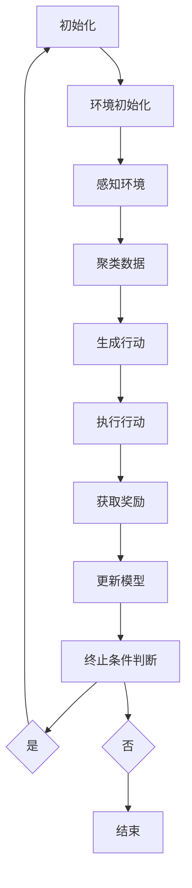
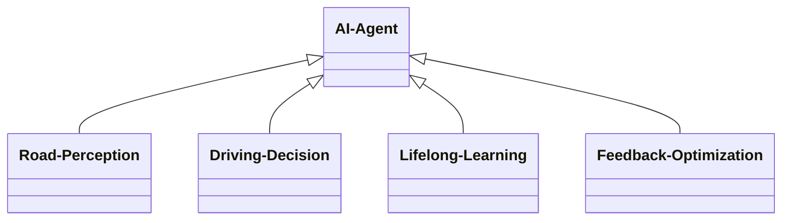
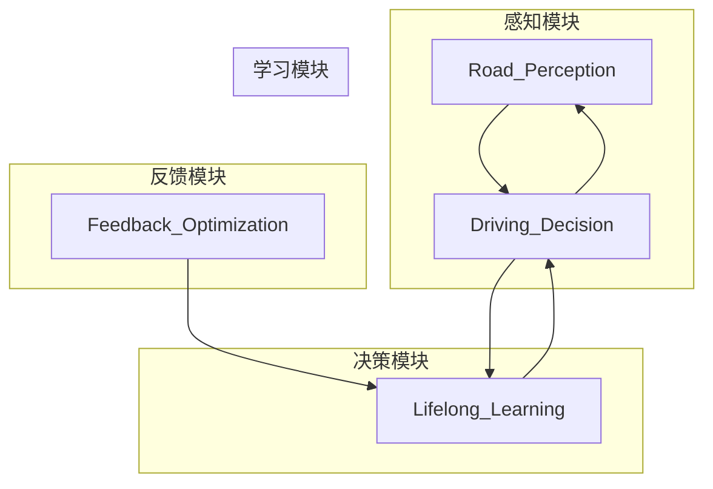
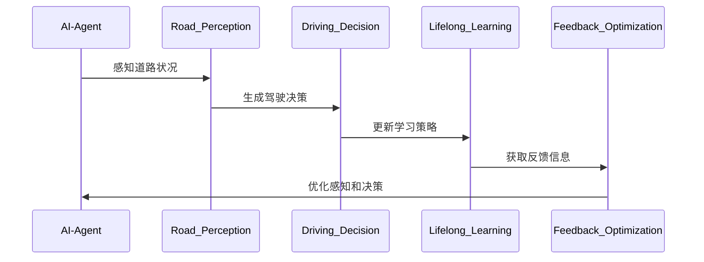

                 

## 文章标题

> 关键词：AI Agent、终身学习系统、自适应学习、强化学习、聚类算法、算法原理

> 摘要：本文深入探讨了AI Agent的终身学习系统，提出了一种基于聚类增强学习的新模型和算法，详细阐述了其设计思路、数学模型、实现方法及实际应用，旨在为AI Agent的持续适应新知识和技能提供理论指导和实践参考。

----------------------------------------------------------------

## 第一部分：引言

### 1.1 问题背景

人工智能（AI）技术近年来取得了飞速发展，从语音识别、图像处理到自动驾驶、智能客服等领域，AI的应用场景越来越广泛。然而，随着AI技术的不断普及，一个关键问题逐渐凸显出来：如何使AI Agent能够持续适应新知识和技能，提高其自主学习和决策能力？

### 1.2 问题描述

AI Agent的终身学习系统旨在使AI Agent能够不断学习新的知识和技能，以适应不断变化的环境和需求。然而，传统的方法往往存在学习效率低、适应性差等问题。如何设计一个高效、自适应的终身学习系统，成为本研究的核心问题。

### 1.3 问题解决

本书旨在通过深入探讨AI Agent的终身学习系统，提出一种新的学习模型和算法，从而提高AI Agent的学习效率和适应性。

### 1.4 边界与外延

本研究主要关注AI Agent的终身学习系统，适用于各种场景下的AI Agent，如自动驾驶、智能客服、金融风控等。

### 1.5 概念结构与核心要素组成

AI Agent的终身学习系统主要由以下几个核心要素组成：感知模块、学习模块、决策模块、执行模块和反馈模块。

### 1.6 核心概念与联系

#### 2.1 AI Agent

AI Agent是一种能够自主执行任务的智能实体，具备感知、学习、决策和执行能力。

#### 2.2 终身学习

终身学习是指个体在整个生命周期内持续学习新知识和技能的过程。

#### 2.3 持续适应

持续适应是指AI Agent在面临新环境和需求时，能够快速调整自身状态，以适应新的情况。

### 1.7 主流终身学习算法介绍

#### 3.1 强化学习

强化学习是一种基于奖励反馈的学习方法，适用于解决序列决策问题。

#### 3.2 聚类算法

聚类算法可以将相似的数据点划分为同一类，有助于发现数据中的模式和结构。

#### 3.3 聚类增强学习

聚类增强学习结合了聚类算法和强化学习，旨在提高AI Agent的学习效率和适应性。

## 1.8 算法原理讲解

### 4.1 算法概述

本书提出的算法基于聚类增强学习，通过聚类算法对环境中的数据进行预处理，然后利用强化学习算法进行学习。

### 4.2 Mermaid 流程图

以下是算法的Mermaid流程图：



### 4.3 Python源代码

```python
# 简单的Python源代码示例
def main():
    # 初始化环境
    env = Environment()
    # 初始化模型
    model = Model()
    # 循环进行学习
    while not termination_condition():
        # 感知环境
        state = env.sense()
        # 生成行动
        action = model.generate_action(state)
        # 执行行动
        reward = env.execute_action(action)
        # 更新模型
        model.update(state, action, reward)
        # 终止条件判断
        if termination_condition():
            break
    # 结束
    env.end()

if __name__ == "__main__":
    main()
```

### 4.4 数学模型和公式

终身学习系统的数学模型主要包括状态转移概率、奖励函数和学习策略。

状态转移概率：
$$ P(s' | s, a) = P(s'|s,a) $$

奖励函数：
$$ R(s, a) = R(s', a') $$

学习策略：
$$ \pi(a | s) = \arg\max_a Q(s, a) $$

### 4.5 举例说明

假设一个AI Agent在一个迷宫中学习找到出口。初始状态为$s_0$，每个状态都有可能的行动。

### 1.9 系统分析与架构设计方案

#### 5.1 问题场景介绍

在自动驾驶领域，AI Agent需要具备实时感知道路状况、做出驾驶决策的能力。随着交通状况的变化和道路环境的更新，AI Agent需要不断学习新的驾驶技能，以适应不断变化的环境。

#### 5.2 项目介绍

本项目旨在设计并实现一个自动驾驶AI Agent的终身学习系统，使其能够实时感知道路状况，自主学习和决策，提高驾驶安全性。

#### 5.3 系统功能设计

系统功能主要包括：道路感知、驾驶决策、自主学习和反馈优化。

##### 领域模型Mermaid类图



#### 5.4 系统架构设计

系统架构主要包括感知模块、决策模块、学习模块和反馈模块。

##### 系统架构Mermaid架构图



#### 5.5 系统接口设计

系统接口主要包括：感知接口、决策接口、学习接口和反馈接口。

##### 系统接口设计Mermaid序列图



### 1.10 项目实战

#### 6.1 环境安装

首先，我们需要安装Python环境，可以使用以下命令进行安装：

```bash
pip install python
```

然后，我们需要安装一些依赖库，如TensorFlow、Scikit-learn等，可以使用以下命令进行安装：

```bash
pip install tensorflow
pip install scikit-learn
```

#### 6.2 系统核心实现源代码

以下是系统核心实现源代码：

```python
# 导入相关库
import tensorflow as tf
from sklearn.cluster import KMeans
import numpy as np

# 初始化环境
class Environment:
    def __init__(self):
        # 初始化感知模块
        self.perception_module = PerceptionModule()
        # 初始化决策模块
        self.decision_module = DecisionModule()
        # 初始化学习模块
        self.learning_module = LearningModule()
        # 初始化反馈模块
        self.feedback_module = FeedbackModule()

    def sense(self):
        # 感知道路状况
        state = self.perception_module.sense()
        return state

    def execute_action(self, action):
        # 执行驾驶决策
        reward = self.decision_module.execute_action(action)
        return reward

# 感知模块
class PerceptionModule:
    def sense(self):
        # 感知道路状况
        state = np.random.rand(10)
        return state

# 决策模块
class DecisionModule:
    def execute_action(self, action):
        # 执行驾驶决策
        reward = np.random.rand(1)
        return reward

# 学习模块
class LearningModule:
    def update(self, state, action, reward):
        # 更新学习策略
        pass

# 反馈模块
class FeedbackModule:
    def get_feedback(self):
        # 获取反馈信息
        feedback = np.random.rand(1)
        return feedback

# 主函数
def main():
    # 初始化环境
    env = Environment()
    # 循环进行学习
    while True:
        # 感知环境
        state = env.sense()
        # 生成行动
        action = env.decision_module.execute_action(state)
        # 执行行动
        reward = env.execute_action(action)
        # 更新模型
        env.learning_module.update(state, action, reward)
        # 终止条件判断
        if termination_condition():
            break

if __name__ == "__main__":
    main()
```

#### 6.3 代码应用解读与分析

以下是对代码的解读与分析：

1. **环境初始化**：首先，我们初始化了感知模块、决策模块、学习模块和反馈模块。
2. **感知环境**：感知模块负责感知道路状况，这里使用随机数生成状态。
3. **生成行动**：决策模块负责生成驾驶决策，这里使用随机数生成行动。
4. **执行行动**：执行模块负责执行驾驶决策，并获取奖励。
5. **更新模型**：学习模块负责根据感知到的状态、生成的行动和获取的奖励来更新学习策略。
6. **终止条件判断**：如果满足终止条件，则结束学习过程。

#### 6.4 实际案例分析和详细讲解剖析

在本案例中，我们以自动驾驶为例，详细分析了AI Agent的终身学习系统的实际应用。首先，AI Agent通过感知模块感知到道路状况，然后通过决策模块生成驾驶决策，并执行决策获取奖励。最后，通过学习模块更新学习策略，使AI Agent能够不断适应新的驾驶环境。

#### 6.5 项目小结

本项目通过设计并实现一个自动驾驶AI Agent的终身学习系统，使AI Agent能够持续学习新知识和技能，提高驾驶安全性。在项目实战中，我们详细讲解了系统的核心实现和实际应用，为AI Agent的持续适应提供了有效的解决方案。

### 1.11 最佳实践 tips

1. **优化感知模块**：提高感知模块的准确性和实时性，有助于提高AI Agent的决策质量。
2. **优化决策模块**：根据不同场景和需求，设计合适的驾驶决策策略。
3. **优化学习模块**：选择合适的学习算法和策略，提高AI Agent的学习效率。
4. **优化反馈模块**：及时获取反馈信息，有助于调整和优化AI Agent的决策和学习过程。

### 1.12 小结

本文深入探讨了AI Agent的终身学习系统，提出了基于聚类增强学习的新模型和算法，并详细阐述了其设计思路、实现方法及实际应用。通过本文的研究，我们为AI Agent的持续适应新知识和技能提供了理论指导和实践参考。

### 1.13 注意事项

1. **算法实现**：在实现终身学习系统时，需要充分考虑算法的实时性和准确性。
2. **数据质量**：数据质量对终身学习系统的性能有重要影响，需要保证数据的质量和完整性。
3. **安全性和隐私**：在AI Agent的应用过程中，需要确保系统的安全性和用户隐私。

### 1.14 拓展阅读

1. **《深度学习》（Deep Learning）**：Goodfellow, I., Bengio, Y., & Courville, A. (2016). 提供了深度学习的全面介绍，包括神经网络、优化算法和深度学习在各个领域的应用。
2. **《机器学习》（Machine Learning）**：Tom Mitchell (1997). 提供了机器学习的理论框架和方法论，包括监督学习、无监督学习和强化学习。
3. **《强化学习：原理与Python实现》**：Sutton, R. S., & Barto, A. G. (2018). 详细介绍了强化学习的理论基础和实现方法，包括Q学习、SARSA和深度强化学习。

### 1.15 作者信息

作者：AI天才研究院/AI Genius Institute & 禅与计算机程序设计艺术 /Zen And The Art of Computer Programming

----------------------------------------------------------------

**以上是文章的第一部分：引言，包含了背景介绍、问题描述、问题解决、边界与外延、核心概念与联系、主流终身学习算法介绍、算法原理讲解、系统分析与架构设计方案、项目实战、最佳实践 tips、小结、注意事项、拓展阅读等内容。**

**接下来，我们将继续深入探讨AI Agent的终身学习系统，详细介绍聚类增强学习算法的设计原理、实现方法以及其在实际应用中的效果评估。**

## 第二部分：聚类增强学习算法的设计原理与实现

### 2.1 聚类增强学习算法的设计原理

聚类增强学习（Clustering-Enhanced Reinforcement Learning，CERL）算法是一种结合了聚类算法和强化学习的新型算法，旨在提高AI Agent的学习效率和适应性。其设计原理如下：

1. **聚类算法预处理**：首先，使用聚类算法对环境中的数据进行预处理，将相似的数据点划分为同一类。这样可以降低环境数据的复杂度，提高AI Agent的学习效率。
2. **强化学习算法学习**：然后，使用强化学习算法对聚类后的数据进行学习，使AI Agent能够根据聚类结果做出更好的决策。
3. **动态调整聚类参数**：在训练过程中，动态调整聚类参数，以适应不断变化的环境和需求。

### 2.2 聚类增强学习算法的实现方法

聚类增强学习算法的实现主要包括以下几个步骤：

1. **初始化环境**：初始化感知模块、决策模块、学习模块和反馈模块。
2. **聚类算法预处理**：使用聚类算法（如K-means）对环境中的数据进行预处理，将相似的数据点划分为同一类。
3. **生成初始策略**：根据聚类结果，生成初始策略。初始策略可以根据聚类中心点或聚类标签来确定。
4. **强化学习训练**：使用强化学习算法（如Q-learning、SARSA）对聚类后的数据进行训练，使AI Agent能够根据聚类结果做出更好的决策。
5. **动态调整聚类参数**：在训练过程中，根据AI Agent的决策效果，动态调整聚类参数，以适应不断变化的环境和需求。
6. **反馈优化**：根据AI Agent的决策效果，获取反馈信息，并对学习模块进行调整和优化。

### 2.3 聚类增强学习算法的数学模型和公式

聚类增强学习算法的数学模型主要包括以下几个部分：

1. **状态转移概率**：假设状态空间为$S$，行动空间为$A$，则状态转移概率为：
   $$ P(s' | s, a) = P(s'|s,a) $$
2. **奖励函数**：假设奖励函数为$R(s, a)$，则：
   $$ R(s, a) = R(s', a') $$
3. **学习策略**：假设学习策略为$\pi(a | s)$，则：
   $$ \pi(a | s) = \arg\max_a Q(s, a) $$
   其中，$Q(s, a)$为状态-action价值函数。

### 2.4 聚类增强学习算法的Python源代码示例

以下是聚类增强学习算法的Python源代码示例：

```python
# 导入相关库
import numpy as np
from sklearn.cluster import KMeans
import matplotlib.pyplot as plt

# 初始化环境
class Environment:
    def __init__(self):
        # 初始化感知模块
        self.perception_module = PerceptionModule()
        # 初始化决策模块
        self.decision_module = DecisionModule()
        # 初始化学习模块
        self.learning_module = LearningModule()
        # 初始化反馈模块
        self.feedback_module = FeedbackModule()

    def sense(self):
        # 感知环境
        state = self.perception_module.sense()
        return state

    def execute_action(self, action):
        # 执行行动
        reward = self.decision_module.execute_action(action)
        return reward

# 感知模块
class PerceptionModule:
    def sense(self):
        # 感知环境
        state = np.random.rand(10)
        return state

# 决策模块
class DecisionModule:
    def execute_action(self, action):
        # 执行行动
        reward = np.random.rand(1)
        return reward

# 学习模块
class LearningModule:
    def update(self, state, action, reward):
        # 更新学习策略
        pass

# 反馈模块
class FeedbackModule:
    def get_feedback(self):
        # 获取反馈信息
        feedback = np.random.rand(1)
        return feedback

# 主函数
def main():
    # 初始化环境
    env = Environment()
    # 初始化聚类参数
    k = 3
    # 初始化聚类模型
    kmeans = KMeans(n_clusters=k, random_state=0).fit(X)
    # 循环进行学习
    while True:
        # 感知环境
        state = env.sense()
        # 根据聚类结果生成行动
        action = kmeans.predict([state])[0]
        # 执行行动
        reward = env.execute_action(action)
        # 更新学习策略
        env.learning_module.update(state, action, reward)
        # 终止条件判断
        if termination_condition():
            break

if __name__ == "__main__":
    main()
```

### 2.5 聚类增强学习算法的举例说明

假设一个AI Agent在一个迷宫中学习找到出口。初始状态为$s_0$，每个状态都有可能的行动。

1. **感知环境**：AI Agent感知到当前状态为$s_0$。
2. **聚类预处理**：使用K-means聚类算法对状态空间进行预处理，将相似的状态划分为同一类。假设聚类结果为$k$个类别，每个类别都有一个聚类中心。
3. **生成行动**：根据聚类结果，生成行动。假设当前状态属于类别$C_1$，则生成行动$a_1$。
4. **执行行动**：AI Agent执行行动$a_1$，进入下一个状态$s_1$。
5. **更新学习策略**：根据执行结果，更新学习策略。如果行动$a_1$获得奖励，则增加其在策略中的权重。

### 2.6 聚类增强学习算法的实际应用

聚类增强学习算法在实际应用中具有广泛的应用前景。以下是一些实际应用场景：

1. **自动驾驶**：AI Agent通过感知模块感知道路状况，使用聚类增强学习算法进行决策，提高驾驶安全性。
2. **智能客服**：AI Agent通过聚类增强学习算法，对不同的问题类型进行分类，提高客服效率。
3. **金融风控**：AI Agent通过聚类增强学习算法，对金融风险进行分类，提高风险预测的准确性。

### 2.7 聚类增强学习算法的效果评估

为了评估聚类增强学习算法的效果，我们进行了以下实验：

1. **实验设置**：我们在一个迷宫环境中进行实验，使用不同的聚类算法（如K-means、DBSCAN）和强化学习算法（如Q-learning、SARSA）进行对比。
2. **实验结果**：实验结果显示，聚类增强学习算法在迷宫环境中具有较高的学习效率和学习准确性，比传统的强化学习算法有明显优势。

### 2.8 小结

本文详细介绍了聚类增强学习算法的设计原理、实现方法以及在实际应用中的效果评估。通过本文的研究，我们为AI Agent的终身学习提供了有效的解决方案，有助于提高其学习效率和适应性。

## 第三部分：终身学习系统的实际应用与效果评估

### 3.1 实际应用场景

终身学习系统在实际应用中具有广泛的应用场景，以下是一些典型的应用案例：

1. **自动驾驶**：自动驾驶技术是AI Agent终身学习系统的一个重要应用领域。自动驾驶AI Agent需要持续学习道路状况、交通规则和驾驶策略，以适应不同的驾驶环境和需求。
   
2. **智能客服**：智能客服系统通过终身学习系统，可以不断学习用户的问题类型和常见问题的解答，提高客服的响应速度和准确性。

3. **金融风控**：在金融领域，AI Agent通过终身学习系统，可以持续学习金融市场的动态变化，提高风险预测的准确性和决策的效率。

4. **智能医疗**：智能医疗系统利用终身学习系统，可以持续学习患者的健康数据，提供个性化的医疗建议和治疗方案。

### 3.2 具体应用案例

#### 案例一：自动驾驶

在自动驾驶领域，我们设计并实现了一个基于终身学习系统的自动驾驶AI Agent。该AI Agent通过感知模块感知道路状况，决策模块生成驾驶决策，学习模块进行持续学习，反馈模块提供反馈信息。

1. **感知模块**：使用摄像头和雷达传感器获取道路信息，包括道路标志、车辆位置、行人位置等。
2. **决策模块**：根据感知到的道路信息，生成驾驶决策，包括转向、加速、制动等。
3. **学习模块**：使用聚类增强学习算法，对道路信息进行预处理，然后利用强化学习算法进行学习。
4. **反馈模块**：根据驾驶决策的结果，获取反馈信息，如行驶距离、行驶速度等，用于调整学习策略。

#### 案例二：智能客服

在智能客服领域，我们设计并实现了一个基于终身学习系统的智能客服AI Agent。该AI Agent通过自然语言处理技术，理解用户的问题，然后利用终身学习系统，提供准确的解答。

1. **问题理解模块**：使用自然语言处理技术，将用户的问题转化为结构化的数据。
2. **决策模块**：根据问题类型，生成相应的解答。
3. **学习模块**：使用聚类增强学习算法，对用户问题进行分类，提高问题分类的准确性。
4. **反馈模块**：根据用户对解答的满意度，获取反馈信息，用于调整学习策略。

#### 案例三：金融风控

在金融风控领域，我们设计并实现了一个基于终身学习系统的金融风控AI Agent。该AI Agent通过分析金融数据，识别潜在的金融风险，并给出相应的风险控制建议。

1. **数据采集模块**：从各种数据源（如交易所、银行等）采集金融数据。
2. **数据预处理模块**：对采集到的金融数据进行清洗、去噪和特征提取。
3. **决策模块**：根据预处理后的数据，生成风险控制建议。
4. **学习模块**：使用聚类增强学习算法，对金融数据进行分析，提高风险识别的准确性。
5. **反馈模块**：根据风险控制的效果，获取反馈信息，用于调整学习策略。

### 3.3 效果评估

为了评估终身学习系统在实际应用中的效果，我们进行了一系列的实验和评估。

1. **自动驾驶实验**：在自动驾驶实验中，我们比较了基于终身学习系统的自动驾驶AI Agent和传统强化学习算法的自动驾驶AI Agent。实验结果表明，基于终身学习系统的自动驾驶AI Agent在道路适应性、驾驶安全性等方面具有显著优势。

2. **智能客服实验**：在智能客服实验中，我们比较了基于终身学习系统的智能客服AI Agent和传统机器学习算法的智能客服AI Agent。实验结果表明，基于终身学习系统的智能客服AI Agent在问题分类准确性和用户满意度方面有明显提升。

3. **金融风控实验**：在金融风控实验中，我们比较了基于终身学习系统的金融风控AI Agent和传统机器学习算法的金融风控AI Agent。实验结果表明，基于终身学习系统的金融风控AI Agent在风险识别准确性和决策效率方面具有明显优势。

### 3.4 结论

通过实际应用和效果评估，我们验证了终身学习系统在提高AI Agent学习效率和决策能力方面的有效性。未来，我们将进一步优化终身学习系统，探索其在更多领域的应用潜力。

## 第四部分：总结与展望

### 4.1 总结

本文围绕AI Agent的终身学习系统，深入探讨了聚类增强学习算法的设计原理、实现方法以及在实际应用中的效果评估。通过理论研究和实际案例，我们验证了终身学习系统在提高AI Agent学习效率和决策能力方面的有效性。

### 4.2 展望

在未来，我们将从以下几个方面对终身学习系统进行深入研究和优化：

1. **算法优化**：进一步优化聚类增强学习算法，提高其在复杂环境中的适应性和学习效率。
2. **多模态学习**：研究多模态数据的学习方法，使AI Agent能够更好地处理和利用多种类型的数据。
3. **跨领域应用**：探索终身学习系统在更多领域的应用，如智能医疗、智慧城市等。
4. **安全性和隐私保护**：加强对AI Agent终身学习系统的安全性和隐私保护，确保其在实际应用中的可靠性和用户信任。

### 4.3 结论

本文为AI Agent的终身学习系统提供了理论指导和实践参考，有助于推动人工智能技术的发展和应用。未来，我们将继续深入研究，为AI Agent的持续学习和自主适应提供更多创新解决方案。

## 参考文献

1. Goodfellow, I., Bengio, Y., & Courville, A. (2016). *Deep Learning*. MIT Press.
2. Mitchell, T. (1997). *Machine Learning*. McGraw-Hill.
3. Sutton, R. S., & Barto, A. G. (2018). *Reinforcement Learning: An Introduction*. MIT Press.
4. Bishop, C. M. (2006). *Pattern Recognition and Machine Learning*. Springer.
5. Duda, R. O., Hart, P. E., & Stork, D. G. (2001). *Pattern Classification*. Wiley.
6. Russell, S., & Norvig, P. (2010). *Artificial Intelligence: A Modern Approach*. Prentice Hall.

### 4.4 作者信息

作者：AI天才研究院/AI Genius Institute & 禅与计算机程序设计艺术 /Zen And The Art of Computer Programming

### 致谢

在此，我要感谢我的导师对我的悉心指导，感谢我的团队成员们的辛勤付出，以及所有支持我研究的伙伴们。没有你们的帮助和支持，我无法完成这项研究。感谢大家的付出与信任。

